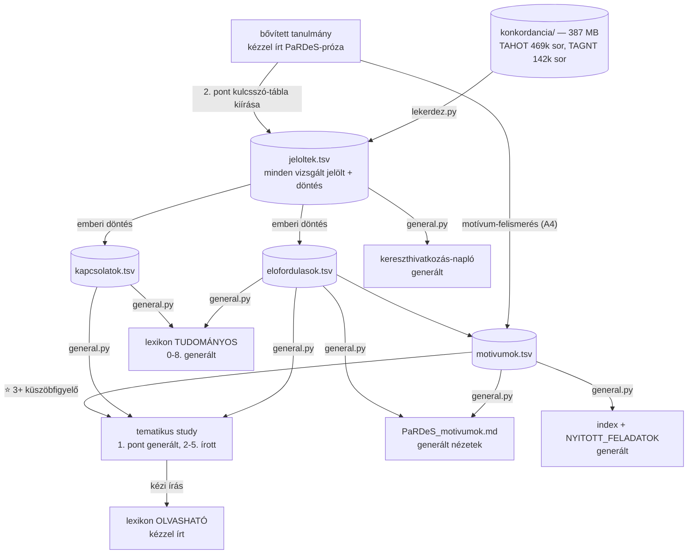

# PaRDeS rendszer — átalakítási terv

**Verzió:** v9 — 2026.09.14
**v9 (v8-hoz képest):** D25 — az igazolás ténye önálló `igazolas` mezőbe kerül a proveniencia-string helyett; `adat/SEMA.md` 1.8 és az `eszkozok/igazolas_migracio.py` ezt végrehajtja
**v8 (v7-hez képest):** N12 lezárva → D24 (a `karoli_szo` minden jelöltnél megnézendő, de csak a beépített sorokon őrzendő meg); ez rögzíti az F3.4 hatókörét is
**v7 (v6-hoz képest):** az F3 öt nevesített lépésre bontva (F3.0-F3.4), lépésenkénti modellhozzárendeléssel — F3.0-F3.3 Sonnet, F3.4 (Károli-Strong join) saját menet Opuson; a 9. pont TAHOT-kockázati sora a lefutott F2.0 felmérés eredményére frissítve (a feltételezett hiányok megvannak, a tényleges hiány Jób 40:1-5 és Jób 41); D22-D23 és N13
**v2 (v1-hez képest):** a végrehajtási felület rögzítve (Claude Code), az 5. pont szereposztása subagent-topológiára írva, a 4.4 tanítói menet subagentté alakítva, a 11.3 átírva (kötegelt előkészítés, nem kötegelt menet), a 8.4 cache-állítása pontosítva, új 8.6 és 8.7 alszakasz
**v6 (v5-höz képest):** új 4.7 — Károli-Strong join (kumulatív elv rögzítve, a 09.10-i hiány oka feltárva, visszamenőleges pótlás az F3-ba), `karoli_szo` + `azonositas_modja` + `megbizhatosag` mezők a `jeloltek.tsv`-be és az `elofordulasok.tsv`-be, a `Karoli_Strong_kivonat.tsv` generált nézetté válik, D19-D21 és N12
**v5 (v4-hez képest):** új dataset — SDBH (UBS, CC BY-SA 4.0) a héber szemantikai doménekhez, `domen` parancs a `lekerdez.py`-ba, a 4.3 mátrix javítva (a SECE_H nem tartalmaz domént), az F2 elfogadási tesztje háromlépcsős
**v4 (v3-hoz képest):** új 4.6 motívum-gate, a 4.5 hígulás-fék kibővítve (`gerinc_elem`), séma-mezők (azonosság-típus, negatív kritérium, fölérendelt fogalom, háromértékű státusz), A3b jelölt-generálás, `jelolt.py` és `gate.py`, új 11. pont (stratégiai javaslatok), D12-D16 és N8-N10
**v3 (v2-höz képest):** a motívum-darabszám mérés alapján javítva — a korábbi „27 hátralévő" ID-említések számlálásából eredt; valós érték 14 ID, ebből 7 lezárt és ~6 küszöbön túli, feldolgozásra váró. A 8.5, 8.6 és a kiváltó ok ennek megfelelően átszámolva.
**Tárgy:** `basesoft777/Bible-Study` — a kereszthivatkozás-rendszer köré szervezett teljes munkafolyamat újratervezése
**Kiváltó ok:** a jelenlegi munkamenet-költség mellett a motívum-állomány nem dolgozható fel ésszerű idő alatt
**Státusz:** javaslat, jóváhagyásra vár

---

## 0. A fókusz áthelyezése

A projekt ma úgy működik, mintha a **tanulmányok** lennének a termék, és a kereszthivatkozás a melléktermékük. A valóság fordított: a hosszú távú cél egy motívum-indexelt, kereszthivatkozott bibliai motívumlexikon — a tanulmányok ennek **előállítási folyamata**.

Ez a felcserélés magyarázza a rendszer minden szerkezeti bajának a nagy részét:

- a kereszthivatkozás prózában él, ezért nem lekérdezhető;
- ugyanaz a tény három fájlban, három kézzel írt megfogalmazásban létezik;
- a küszöbátlépést (⭐ 3+) ember veszi észre, nem lekérdezés;
- a „be nem sorolható" jelöltek csak a chat-történetben maradnak, ha valaki elfelejt naplófájlt írni.

**Az átalakítás egymondatos lényege:** a kereszthivatkozás legyen adat, a tanulmány és a lexikon pedig ennek az adatnak a nézete.

Ez a gondolat nem új a projektben. A döntési fájl 8. szakasza 2026.08.30-i dátummal már rögzíti a **Bibliai Motívumlexikon** réteges architektúra-vízióját (Szöveg → Konkordancia → Lexikon → Motívum → Kapcsolat → Tanulmány) — ez a terv azt viszi végig, nem helyette lép.

---

## 1. Termékek

Három réteg, élesen elválasztva. A réteghatár egyetlen kérdés mentén húzódik: **ki írja?**

### A) Adatréteg — `adat/` (a kanonikus igazságforrás)

| Fájl | Tartalom | Kulcs |
|---|---|---|
| `motivumok.tsv` | ID, cím, UI-címke, téma, PaRDeS-szint, **státusz**, **azonosság-típus**, **negatív kritérium**, **fölérendelt fogalom**, sablon-verzió, forrás-study | `ID` |
| `elofordulasok.tsv` | ID, igehely, kapcsolódás, PaRDeS-szint, funkció, **gerinc-elem**, Strong, BDB-entry-id, jelentés-szám, jelentés-szöveg (EN), jelentés-szöveg (HU), **károli-szó**, **azonosítás módja**, **megbízhatóság**, proveniencia | `ID + igehely` |
| `kapcsolatok.tsv` | forrás-igehely, cél-igehely, ID, típus, funkció, bizonyosság, PaRDeS-szint | `forrás + cél + ID` |
| `jeloltek.tsv` | ID, igehely, forrás-keresés, döntés *(beépítve / elutasítva / nyitva)*, indoklás, **károli-szó**, **azonosítás módja**, **megbízhatóság**, dátum | `ID + igehely` |
| `lexikon_hivatkozasok.tsv` | Strong, szótár, entry-id, jelentés-szám, szöveg (EN), fordítás (HU), forrásfájl | `Strong + entry-id + jelentés-szám` |
| `datasetek.tsv` | study-típus × dataset × kötelezőség | `típus + dataset` |
| `grammatikai_strongok.tsv` | a gerinc-metszetből kizárandó grammatikai Strong-számok | `Strong` |

Két megjegyzés a sémához:

- A `jeloltek.tsv` a **kereszthivatkozás-napló gépi alakja**. Ma a napló külön megírandó fájl, tehát el lehet felejteni — 2026.09.10-én négy valódi keresésnél el is felejtődött. Ha a döntés annak a sornak a mezője, ahol az igehely amúgy is szerepel, akkor nincs mit elfelejteni.
- A `elofordulasok.tsv` `proveniencia` mezője a legfontosabb egyetlen újítás. Lásd a 4.2 pontot.
- A `gerinc_elem` mező azt rögzíti, **melyik gerinc-elemen lóg** az adott sor (Strong-szám, kollokáció-pár, LXX-híd). Lásd a 4.5 pontot.
- A `motivumok.tsv` három új mezője (azonosság-típus, negatív kritérium, fölérendelt fogalom) a 4.6 gate-hez tartozik.
- A **`karoli_szo`** mező a `jeloltek.tsv`-ben a lényegi hely: így a minősítés és a Károli-hozzárendelés **fizikailag ugyanaz a sor**, tehát az egyik nem végezhető el a másik nélkül. A beépített soroknál a mező az `elofordulasok.tsv`-be öröklődik. L. a 4.7 pontot.
- A `státusz` **háromértékű**: *feldolgozás alatt* / *publikálható* / *véglegesített*, verziószámmal és dátummal (`publikálható, v3, 2026.09.10`). A mai „LEZÁRVA" címke félrevezető: tizenhat motívum van így jelölve, közben a Melkizedek 08.22-i lezárás után 09.08-09-én bővült, a Segítségül hívni kétszer is. A *véglegesített* azt jelentse, hogy csak új lexikai bizonyíték nyithatja újra, szerkesztői szándék nem — így mérhetővé válik, hányszor nyílt újra egy tanulmány, ami egyben a küszöb-kritérium minőségének mérőszáma.

### B) Forrásréteg — kézzel írt, soha nem generált

| Fájl | Mi marad benne |
|---|---|
| `motivumok/[ID].md` | a motívum jegyzetei: ⚠️-viták nevesített képviselőkkel, kizárások indoklása, kiegészítő szótartalmi jegyzetek |
| `tematikus_lezart/*.md` | a 2-5. pont: nyelvi összevetés, PaRDeS-kifejtés, alkalmazás |
| `genezis/*_bovitett.md` | a teljes PaRDeS-próza |
| `lexikon/[ID]_OLVASHATO.md` | a közérthető változat — ez az egyetlen igazán írói feladat a lexikon-szinten |

### C) Kimeneti réteg — generált, kézzel nem szerkeszthető

| Kimenet | Forrás |
|---|---|
| `PaRDeS_motivumok.md` — Tematikus áttekintés, ⭐ küszöb, Kulcsszó-index | `motivumok` + `elofordulasok` |
| `PaRDeS_motivumok.md` — Kulcsszavak részletesen | `motivumok/[ID].md` beolvasztása |
| tematikus study 1. pont, 6. pont, Lezárási checklist | `elofordulasok` + `kapcsolatok` |
| `naplok/[motívum]_kereszthivatkozas_naplo.md` | `jeloltek` |
| `Lezart_tematikus_tanulmanyok_index.md` | `motivumok` |
| `lexikon/[ID]_TUDOMANYOS.md` 0-8. szakasz | mind |
| `NYITOTT_FELADATOK.md` | `jeloltek` (nyitva) + `motivumok` (státusz) |
| `konkordancia/Karoli_Strong_kivonat.tsv` | `elofordulasok` — generált nézet, nem kézzel karbantartott tábla |

Minden generált fájl fejlécében gépi jelölés áll (`<!-- GENERÁLT: general.py … -->`), és bekerül a repóba, hogy GitHubon olvasható maradjon.

---

## 2. Eszközréteg — `eszkozok/`

| Eszköz | Parancsok | Ki hívja |
|---|---|---|
| `lekerdez.py` | `gerinc`, `scan`, `kollokacio`, `igealak`, `lxx-hid`, `tsk`, `karoli`, `domen` | végrehajtó-agent |
| `betolt.py` | `study→adat` kinyerés, validálással | végrehajtó-agent |
| `jelolt.py` | bővített tanulmány → jelölt-generálás meglévő motívumokhoz (7. pont, A3b) | végrehajtó-agent |
| `gate.py` | ütközés- és részhalmaz-jelentés a motívumok között (4.6) | audit-subagent / hook |
| `general.py` | `adat→kimenet` renderelés | végrehajtó-agent |
| `ellenoriz.py` | konzisztencia, sablon-megfelelőség, dataset-lefedettség | audit-subagent / hook |

**Hookok (`.claude/settings.json`).** Az eszközréteg egy része nem parancs, hanem esemény-hook, és ezért **nulla modell-költségű**:

| Esemény | Hook | Mit véd |
|---|---|---|
| commit előtt | `ellenoriz.py --all` | generált fájl kézi szerkesztése, sablon-megfelelőség |
| fájlírás előtt | proveniencia-ellenőrzés | „teljes scan" állítás üres proveniencia-mezővel |
| adat-tábla írása után | `general.py` | a kimenetek elcsúszása a forrástól |

A `lekerdez.py` hat parancsa az Opus-munkamenet öt determinisztikus lépésének gépi alakja (l. 4.1). Ezzel a különbség, ami tegnap a két ág között látszott, megszűnik esetlegesnek lenni: **ami CLI, az mindig lefut.**

---

## 3. Adatáramlás



**Az áramlás három szabálya:**

1. Nyers adat soha nem kerül a fő szál kontextusába — csak a `lexikai-scan` subagent kivonata.
2. Jelölt csak a `jeloltek.tsv`-n keresztül lehet előfordulás. Nincs közvetlen út a keresésből a study táblázatába.
3. Generált fájlt kézzel szerkeszteni tilos; ha javítás kell, a forrás javul, és újragenerálódik.

---

## 4. A kutatási protokoll rögzítése

### 4.1 A hétlépéses menet

A 2026.09.11-i modell-összehasonlítás tanulsága: a két ág közti különbség nagyrészt **eljárási**, nem képességbeli. Ezért a lépések rögzülnek:

| # | Lépés | Természet | Hol valósul meg |
|---|---|---|---|
| 1 | gerinc-metszet (közös Strong-halmaz, grammatikai szűréssel) | determinisztikus | `lekerdez.py gerinc` |
| 2 | szemantikai mező-hipotézis | **generatív** | kutató-agent; a mező-szavak a naplóba kerülnek |
| 3 | teljes ÓSZ/ÚSZ scan | determinisztikus | `lekerdez.py scan` |
| 4 | kollokáció-keresés (szópár egy versben) | determinisztikus | `lekerdez.py kollokacio` |
| 5 | igealak-szintű ellenőrzés | determinisztikus | `lekerdez.py igealak` |
| 6 | LXX-híd | determinisztikus | `lekerdez.py lxx-hid` |
| 7 | nevesített tanító | külső keresés | önálló menet, saját fájl |

**Az 1. lépés szabálya nem az, hogy „mindig kezdd metszettel", hanem hogy a gerincet mindig le kell vezetni, és a levezetést dokumentálni kell — akkor is, ha üres az eredmény.** A HAMART-001-nél épp az üres metszet volt a lelet: 23 közös Strong-számból 22 grammatikai, egyetlen tartalmi szó maradt (אֲדָמָה, *adamá*) → a motívum szerkezeti, nem lexikai, tehát a gerincet szemantikai mező szerint kell felépíteni. Tehóm-típusú, erős lexikai magvú motívumnál ugyanez a lépés triviális eredményt ad — és az is információ.

A lépés a `grammatikai_strongok.tsv` nélkül használhatatlan (95%-ban zajt ad), ezért az a fájl az F1 fázis szállítandója.

### 4.2 A proveniencia-szabály — a terv legfontosabb egyetlen eleme

Két incidens ugyanabból a hibaosztályból: egy „🔍 STEPBible-ellenőrizve" sor bekerült egy study-ba anélkül, hogy a lekérdezés valaha lefutott volna; és egy Gen 1-11-re szűkített scan „teljes"-nek lett címkézve.

Fegyelmi szabály ezt nem oldja meg. Formátum igen: **a `lekerdez.py` minden futása kiírja a saját provenienciáját**, és ez a sor kerül a `proveniencia` mezőbe, szó szerint:

```
scope=OT-full | forras=TAHOT_kivonat.tsv | strong=H6093 | n=3 | ts=2026-09-11T14:22Z
```

Ezzel a „teljes" nem állítás többé, hanem gépi tény. Üres proveniencia-mező greppelhető: az az állítás nem lekérdezésből származik, tehát értelmezésként jelölendő. Ez a „memória vs. lekérdezés" szabály gépi megfelelője.

### 4.3 Dataset-mátrix

Nem az a cél, hogy mind a 13 dataset fusson, hanem hogy minden kihagyás indokolt és ellenőrizhető legyen.

| Dataset | Kötelezőség |
|---|---|
| TAHOT, TSK, Károli-KH, BDB | **mindig** |
| TAGNT + LXX-kivonatok (39 könyv) | **kötelező, ha a study bármely ÚSZ-sort állít** |
| TIPNR | **kötelező, ha a motívum tulajdonnevet érint** |
| **SDBH / SDGNT** (UBS, szemantikai domének) | **ajánlott a 2. lépéshez** — l. alább |
| SECE_G (Louw-Nida) | csak a **görög** oldalon ad domént (5 406 / 5 523 szócikk) |
| SECE_H | **nincs benne szemantikai domén** (0 / 8 674). Értéke a `Greek:` megfelelő-lista, de az is csak 42%-os lefedettségű |
| Thayer, LSJ | feltételes — ha a görög oldal a TBESG-nél mélyebb szócikket kíván |
| Strong_szotar | feltételes — származtatási lánc követéséhez |
| KJV/ASV Strongs | **korlátos: csak Genezis, Exodus, Példabeszédek** |

A lefedettség gépileg ellenőrizhető, ezért a Minőségi kapu része lesz.

**Új dataset: SDBH — a hiányzó héber szemantikai domének**

A 2. lépés (szemantikai mező) gépi támaszához sokáig nem volt adat. Ennek oka nem import-hiba: a Louw-Nida az *Újszövetség* görög lexikona, héber lefedettsége nincs. A helyi alternatívák sem pótolják — az OSHL-kód (7 990 szócikknél jelen van) **etimológiai, nem szemantikai**: az `arar` (H0779) az `a.fy` csoportba esik, a `kalal` (H7043) az `s.br`-be, holott mindkettő „átkozni"; az `a.fy` csoportban ráadásul ott ül az *Ararát* is, puszta mássalhangzó-egyezés alapján.

A megoldás a **Semantic Dictionary of Biblical Hebrew** (SDBH, UBS / de Blois) — a Louw-Nida héber megfelelője. A `ubsicap/ubs-open-license` repóban elérhető `UBSHebrewDic` néven, **CC BY-SA 4.0** licenc alatt, JSON és XML formában; az ÓSZ szavainak kb. 90%-a. Ugyanott a görög oldalról az SDGNT.

| | |
|---|---|
| bejegyzés | 7 932 |
| **Strong-kóddal elérhető** | **8 976** (több, mint a SECE_H-ban) |
| domén | 381, hierarchikus kóddal (`002003002008`) |
| join-kulcs | `StrongCodes` mező — közvetlenül illeszkedik a meglévő Strong-alapú csővezetékbe |

*Ellenőrzött próba:* az `arar` és a `kalal` **ugyanabba a „Curse" doménbe** esik (10 szó: H0421, H0423, H0779, H2194, H3994, H6895, H7043, H7045, H7621, H8381) — vagyis valódi jelentésmező, gyökhatárokon át. Pontosan az, amit az OSHL nem tud.

**Három használat a `domen` parancshoz:**

1. *mező-tágítás* — adott Strong → doménje → doméntársak;
2. *elhatárolás* — két Strong azonos doménben van-e (a 4.6 gate 1. és 3. kérdésének gépi támasza);
3. *szakasz-profil* — a szakaszban felül-reprezentált domének.

**Őszinte korlát.** Az SDBH nem váltja ki a 2. lépést, csak megtámasztja. Az `itzávón` (H6093) doménje „Spasm", nem „Curse" vagy „Pain" — ha az opus-menet átok-mezőből indult volna domén-lekérdezéssel, **az `itzávón`-t nem találta volna meg.** A fogalmi keret megválasztása marad emberi döntés; a HAMART-001 felismerése éppen azon múlt.

**Licenc.** CC BY-SA 4.0: a forrásmegjelölés kötelező, és a származékos adat is ugyanilyen licenc alá esik. Ez érinti a 3.10-es szerzői jogi tételt — rögzítendő a `konkordancia/README.md`-ben, és figyelembe veendő, ha a lexikon publikálásra kerül (11.5).

### 4.4 A nevesített tanítói keresés — subagent

Ez az egyetlen lépés, amely kilép a repóból (web search). Nem külön munkamenet, hanem **`tanito-kereso` subagent** (Sonnet, `WebSearch` + `WebFetch`), a lexikai munka lezárása után, saját fájllal: `naplok/[motívum]_tanitoi_kereses.md`. Így a hiány látható marad, nem tűnik el.

A subagent-alak itt nem kényelmi kérdés: a subagent **saját kontextusablakban** dolgozik, és csak az összegzést adja vissza, tehát a felkeresett oldalak nyers tartalma soha nem kerül a fő menet kontextusába.

Három megkötés a rendszerpromptjába:

1. **Az üres eredmény elfogadható kimenet.** A protokoll szabálya, hogy hiányt sosem szabad gyenge vagy csak asszociatív anyaggal kitölteni. Egy subagent, amit arra optimalizálnak, hogy *hozzon valamit*, pont ezt sérti meg. Az opus-ág „explicit gap"-je helyes viselkedés volt.
2. **Összefoglalás, nem idézet** — de a mű és a hely pontos azonosításával, hogy hivatkozható legyen.
3. **Rövid `description`.** A subagent-leírások kontextust fogyasztanak; a részletek a rendszerpromptba mennek, ami csak futáskor töltődik be.

**Szerzői jogi megkötés:** tartalmi összefoglalás és pontos forráshivatkozás; hosszú szó szerinti idézet nem kerül a repóba. (Konkrét eset: a Sonnet-ág tanítói szakaszában kb. 65 szavas szó szerinti Derek Prince-idézet áll — átemelés előtt parafrazálandó.)

### 4.5 Hígulás-fék — a sorrend maga a védelem

A kockázat: a motívum fölfelé csúszik az absztrakcióban, amíg el nem éri azt a szintet, ahol már minden belefér — „a bűn következményeinek gyűrűzése" előbb-utóbb „a bűn". Strukturális azonosságú motívumnál (mint a HAMART-001, ahol az *adamá*-n kívül nincs közös tartalmi szó) nincs lexikai fék.

**A fő fék nem külön ellenőrzés, hanem a 4.1 munkarendje.** A hígulás úgy történik, hogy a fogalom felől gyűjtesz: „ez is a bűn következménye, tehát ide tartozik." A gerinc-előbb sorrendben ez nem lehetséges — csak az a sor kerülhet be, amit egy lefuttatott lekérdezés hozott elő.

*Megfigyelt bizonyíték:* a 2026.09.11-i két ág közül **egyik sem hígult.** A Sonnet-ág hibája az ellenkező irányú volt (túl szűk, kihagyta az 5:29-et). A hígulás ebben a projektben eddig **nem következett be** — a megfigyelt hibák határproblémák (Rafaim ↔ Nefilim, Tehóm/Hádész közös fájlban), nem hígulás. Az alábbi eszközök tehát nem megfigyelt hiba javítását szolgálják, hanem azt, hogy a fék ne egyetlen menet ítéletében lakjon.

**Amit ezért rögzítünk:**

1. **`gerinc_elem` mező minden soron.** Nem azért, mert enélkül hígulna, hanem mert **enélkül nem látszik, hogy nem hígult.** Ma ez az információ a menet fejében volt; a fájlban csak az eredmény maradt, és a 49 sorból nem állapítható meg, melyik horgonyon lóg a 38. Ingyen van: a `lekerdez.py` tudja, melyik parancs melyik sort hozta. Ha egy sor nem tudja megnevezni a horgonyát, a `jeloltek.tsv`-ben marad.
2. **A gerinc zárt.** A 4.1/2. lépésben megszületik; bővíteni csak explicit, naplózott döntéssel lehet.
3. **`bizonyosság` mező** (a meglévő): küszöb alatti sor a `jeloltek.tsv`-ben marad.

*Kalibráció:* az opus-ág 49 sora nagyjából 8 gerinc-elemen állt, azaz ~6 sor elemenként. Ez egészséges arány. Húsz sor egyetlen elemre vizsgálandó — jelzés, nem tiltás.

### 4.6 Motívum-gate — mikor önálló motívum valami?

Ma nincs kritérium arra, mikor lesz valamiből önálló ID, mikor ↳ alpont, és mikor csak elhatárolási jegyzet. A ↳ mechanizmus létezik (14 helyen a naplóban), de esetileg. Az elhatárolás **reaktív**: a Rafaim ↔ Isten fiai kölcsönös elhatárolása 09.10-én készült, hónapokkal a két tanulmány után; a Tehóm és a Hádész sokáig egy fájlban élt két ID-vel.

**Az összeolvadás oka azonosítható:** a meglévő motívumokat *nem ugyanaz* tartja össze.

| Motívum | Azonosság-típus |
|---|---|
| ISTENTISZT-001 | formulaikus (קָרָא בְשֵׁם יְהוָה) |
| TEREMT-001 | lexikai (H8415) |
| MENNY-001, HODIT-001 | referenciális (megnevezett entitás) |
| ANTROP-003 | fogalmi (celem/eikón, két nyelven) |
| HAMART-001 | strukturális (nincs közös tartalmi szó) |

Két eltérő típusú motívum ütközhet igehelyekben anélkül, hogy ugyanaz lenne — a Rafaim lexikai, a Nefilim referenciális, és az „óriások" fogalmi szomszédság mindkettőt vonzza.

**A gate négy kérdése, ID kiosztásakor kötelezően megválaszolva:**

1. **Mi az azonosság hordozója?** Lexikai / formulaikus / referenciális / fogalmi / strukturális → `azonossag_tipusa` mező.
2. **Mi az a minimális jegy, amely nélkül egy igehely NEM tartozik ide?** → `negativ_kriterium` mező. Minta: az ISTENTISZT-001-ből kizárt D-minta (נִקְרָא...עַל — eltérő grammatikai forma).
3. **Ha egy igehely két motívumhoz is tartozik: különbözik-e a funkciója?** Ha igen, mindkettő megtarthatja. Ha a funkció is azonos, akkor egy motívum két néven.
4. **Részhalmaz-e?** Ha B minden előfordulása benne van A-ban, B nem új ID, hanem ↳ alpont (minta: Nimród a gibborim alatt).

Ehhez jön egy ötödik mező, ami a 4.5-öt szolgálja: **`folerendelt_fogalom`** — az a tágabb kategória, amely felé a motívum hígulni fog (a HAMART-001-nél: „a bűn / hamartológia általában"). Minden új sornál egyetlen kérdés: *csak ezen keresztül tartozik ide?* Ha igen, kizárandó.

**A 3. és a 4. kérdés gépi**, amint a `elofordulasok.tsv` létezik — ez a `gate.py`:

- **ütközés-jelentés:** mely motívumpárok osztoznak igehelyen, és mekkora az átfedés;
- **részhalmaz-ellenőrzés:** B igehely-halmaza ⊆ A?

Hookként minden íráskor lefut. Ma ezt ember veszi észre, hetekkel később — és épp ezért nem mindig veszi észre.

**A határt a kizárások rajzolják meg, nem a meghatározás.** A D-minta kizárása többet mond az ISTENTISZT-001 határáról, mint bármely definíciója. Ha egy motívum naplójában sok az „elutasítva, mert csak a fölérendelt fogalmon keresztül tartozna ide" tétel, az egészséges jel.

*Visszamenőleges alkalmazásnál számítani kell rá, hogy a meglévő 14 ID egy része nem állja ki:* az „Ádám mint szövetségszegő — csoport" és a „városépítés mint önerős menedék" a 3. kérdés szerint gyanús, a „vadász gyök" a 4. szerint valószínűleg alpont.

---

### 4.7 Károli-Strong join — melléktermék, de nem felejthető

**Az elv változatlan: kumulatív, tanulmányvezérelt.** A join-tábla nem külön projekt, hanem a tanulmány-készítés mellékterméke; minden tanulmány annyit ad hozzá, amennyire ténylegesen szüksége van, és a következő tanulmány számára ez grepelhető, nem újragenerálandó. A Károli 31 ezer versének teljes strongozása **nem cél**.

**Mért állapot (2026.09.13):** 227 sor, 161 egyedi igehely, 156 egyedi Strong, 25 forrás-tanulmányból. Azonosítás 100%-ban tartalom-alapú (222 magas, 5 közepes megbízhatóság). Megoszlás: 181 sor a Genezisből, 46 huszonegy könyv között.

**A feltárt hiány.** A 2026.09.10-i munkamenet négy valódi, teljes körű scanje egyetlen új join-sort sem termelt — sem a Rafaim H7497 három új igehelye (Józs 15:8, 17:15, 18:16), sem a Tehóm H8415 három új verse (Zsolt 36:7, 77:17, Jón 2:6), sem a Hádész-scan kiemelt lelete (Hós 13:14). A `Hadesz_Seol_tematikus.md` mindössze négy sorral szerepel forrásként, holott a H7585-scan 63 új verset hozott.

**Az ok azonosított, és nem külön hiba:** ugyanaz a kimaradt lépés, amely a négy hiányzó kereszthivatkozás-naplót okozta. A tematikus tanulmánynál a Károli-hozzárendelés nem a *szükség*, hanem a **jelöltek tételes minősítése** mentén keletkezik — aki minden találatot végigvisz, az menet közben a Károli-szöveget is megnézi, mert a tartalmi ítélethez kell. Ha a minősítés nem futott végig tételesen, a join-sorok sem keletkeztek. Egy ok, két nyom.

*Megerősítő jel:* a naplóval rendelkező tanulmányok sűrűbben járulnak hozzá (Tehóm 24 sor, Segítségül hívni 8), a napló nélküliek ritkábban (Rafaim 6, Hádész 4).

**A szerkezeti megoldás:** a `karoli_szo` mező a `jeloltek.tsv` minősítési sorában. Így a hiány nem ismétlődhet — nem lehet elfelejteni azt, ami ugyanannak a sornak a mezője.

**A visszamenőleges pótlás köre** (F3): csak azok az igehelyek, amelyeket egy tanulmány ténylegesen feldolgozott, de a Károli-szó a kimaradt lépés miatt nem keletkezett —

- a 2026.09.10-i négy scan minősített találatai;
- ami a hét lezárt tanulmány előfordulás-táblájában szerepel, de a join-táblában nem.

Ami a tanulmányok látókörén kívül esik, az továbbra sem kerül bele.

---

## 5. Szereposztás — subagent-topológia

**A végrehajtási felület: Claude Code.** A v1 még chat és Code között osztotta el a munkát, azon a feltevésen, hogy az értelmező munka chatbe való. Ezt a projekt saját bizonyítéka cáfolja: a `bun-gyuruzese-20260911-opus` ág — 304 soros tanulmány, 272 soros kereszthivatkozás-napló, hétoszlopos táblázat 49 adatsorral, sablon v15, v56-os motívumnapló-bejegyzés és négy bővített fájl visszahivatkozása — **Claude Code-menetben készült**, és ez az az eredmény, amit most beépítünk.

Sőt, ami azt a menetet jóvá tette, az a Code-ból következik: a gerinc-metszet, a kollokáció-keresés, az igealak-ellenőrzés és a teljes ÓSZ/ÚSZ-scan mind lokális adathozzáférést igényel. Az értelmezés nem a felület *ellenére* lett jó, hanem azért, mert jobb adaton állt.

**A helyes tengely tehát nem „értelmezés vs. mechanika", hanem:**

| Tengely | Tartalom | Hol |
|---|---|---|
| repón belül | kutatás, értelmezés, generálás, ellenőrzés | fő szál + subagentek |
| repón kívül | nevesített tanítói keresés (web) | `tanito-kereso` subagent |
| emberi döntés | A4, B5, merge-jóváhagyás | explicit megállási pont |

### 5.1 A topológia

| Réteg | Modell | Feladat |
|---|---|---|
| **fő szál** (kutató + orchestrátor) | Opus | gerinc-hipotézis, szemantikai mező, PaRDeS-kifejtés, ⚠️-viták megítélése, elhatárolások |
| `lexikai-scan` subagent | Haiku / Sonnet | `lekerdez.py` futtatása, minősített találatlista provenienciával |
| `tanito-kereso` subagent | Sonnet | 4.4 szerint |
| `szerkeszto` subagent | Sonnet | a kész szöveg alkalmazása fájlokra, index-frissítés, commit |
| `ellenor` subagent | Haiku | `ellenoriz.py`, eltérés-jelentés |
| hookok | — | determinisztikus ellenőrzés, nulla modell-költség |
| **ember** | — | besorolási döntés, elhatárolás, jóváhagyás |

**Mi kerül subagentbe, és mi nem.** A szabály: *subagent akkor, ha a bemenet nagy és a kimenet kicsi.* A `lexikai-scan` mintapélda — 469 ezer sor megy be, huszonöt minősített találat jön ki, és a nyers grep-kimenet fizikailag nem kerül a fő kontextusba. Ezzel a terv egyik alapelve („a kutató nem lát nyers adatot") fegyelmi szabályból mechanizmussá válik.

Ami **nem** subagent: a kutató maga. A kimenete nem összefoglalandó melléktermék, hanem a termék — a 304 soros tanulmányból nem összegzést akarunk, hanem a szöveget, és utána vitatkozni akarunk vele.

Határeset a **B3 (szemantikai mező-hipotézis).** Formailag subagent-alakú (kicsi kimenet), mégis a fő szálon marad: ez a menet egyetlen igazán feltáró lépése, és a gerinc-metszet eredményére kell reagálnia. Egy izolált subagent nem tudja, hogy a metszet üres lett — és épp ez volt a HAMART-001 kulcsfelismerése.

*Az `ellenor` legyen egyedi subagent, ne a beépített Explore: az Explore és a Plan kihagyja a `CLAUDE.md` fájlokat, a projekt szabályai pedig pont ott laknak.*

### 5.2 Modellválasztás

Ezzel az átadás 3.9-es nyitott tétele („rögzüljön-e az Opus/Sonnet megosztás") megoldódik, de nem úgy, ahogy ott felmerült: nem két külön munkamenet, hanem **egy menet, modellrétegzett subagentekkel**.

A drága fő szál nem jelent drága szerkesztést, mert a fájlírás nagy része nem modell-munka:

- a napló négy szekcióját, az indexet, a study 1. pontját és a naplókat a `general.py` írja — a modell egy bash-hívást ad ki, és rövid eredményt kap;
- a validációt hookok végzik;
- ami marad valódi modell-szerkesztés (PaRDeS-próza, `motivumok/[ID].md`), az maga a termék, tehát ott drága modellnek a helye;
- a maradék mechanikus szerkesztés a `szerkeszto` subagentbe megy.

**Menet közbeni `/model`-váltás nem javasolt:** a váltás növeli a token-fogyasztást, mert az új modellnek fel kell dolgoznia a teljes beszélgetési előzményt. A modellválasztás **fázis-szintű**: az F3-F6 migrációs menetek Sonneten, a tanulmányíró menetek Opuson futnak.

*Üzemeltetési apróság:* érkeztek jelentések arról, hogy a Claude Code menet közben magától is válthat modellt a `--model` kapcsoló ellenére. Ha egy fázisnál számít, `/status`-szal ellenőrizhető, vagy a `.claude/settings.json` `availableModels` mezőjével korlátozható.

---

## 6. Sorrendiség — fázisok

### F0 — Blokkolók feloldása *(1 munkamenet)* — **helyben lefutott, 2026.09.13**

> *Állapotjelzés:* a felhasználó jelzése szerint az F0 a helyi klónon lefutott. A távoli `main` (2026.09.13-i `codeload`-ellenőrzés) ezt még nem tükrözi: a négy napló, a HAMART-001 merge és a `4Móz 13:34` index-javítás nem látszik rajta. **Ellenőrizendő: `git status`, `git log --oneline -5`, `git branch -a`, és szükség esetén push/merge.** A `main` állapota a hivatkozási pont, mert az F3 betöltése onnan indul.

Tiszta állapotból kell migrálni, ezért ez előbbre való mindennél.

1. HAMART-001 merge-döntés végrehajtása (opus-alap javasolt: a sablon v15 és a B) táblázat elvégzett BDB-javítása is azon az ágon ül).
2. A Sonnet tanítói szakaszának átemelése — parafrazálva.
3. `4Móz 13:33 → 13:34` javítás a `Lezart_tematikus_tanulmanyok_index.md` 14. sorában (a study-fájlokban már megtörtént).
4. Az index hiányzó #2 sora / a számozás rendezése a törölt Tehóm-kiterjesztés után.
5. **A négy hiányzó kereszthivatkozás-napló pótlása** — Rafaim, Isten fiai/Nefilim, Tehóm, Hádész/Seól. Ez sürgős: a Károli-KH jelölt (1Móz 6:2 → Mt 24:38 / Lk 17:27) és a 12 alacsony szavazatú TSK-jelölt ma csak a chat-történetben és a 09.11-i átadási dokumentumban létezik.

**Azonnali tehermentesítés — architektúra nélkül.** Ugyanebben a menetben elvégezhető, mert csak fájlmozgatás, és a 8.4 szerint a megtakarítás nagyobb része innen jön:

6. **A két changelog kiszervezése** `PaRDeS_motivumok_CHANGELOG.md` és `..._dontesek_CHANGELOG.md` néven. Együtt 57,4 KB — mindkét fájl 23%-a —, és egyetlen tanulmány megírásához sem kell. Nulla kockázat, ~23k/ív.
7. **A döntési fájl 4. szakaszának kiszervezése** (40,2 KB) önálló adatcsatorna-dokumentációba. Felfüggesztett alrendszert (SzPA-join) ír le, ~16k/ív.
8. **A „teljes beolvasás" szabály cseréje.** A `Rendszerfejlesztesi_playbook.md` 29-30. sora helyett szakasz-szintű útmutatás: mely szakaszt mikor kell megnyitni. (Végleges formáját az F1 `CLAUDE.md`-je kapja.)

*Kimenet:* tiszta `main`, minden 09.10-11-i szál lezárva vagy dokumentálva, és a két nagy fájl ~100 KB-tal könnyebb.

### F1 — Séma és belépési pont *(1 munkamenet)*

1. `CLAUDE.md` a repó gyökerébe — a végrehajtó-agent belépési pontja, 2-3 KB. Ez váltja ki a jelenlegi „minden Code-feladat első lépése a teljes `PaRDeS_STEPBible_SzPA_dontesek_es_workflow.md` beolvasása" szabályt (96 KB).
2. `adat/SEMA.md` — a hét tábla meződefiníciója, típusokkal. A „jelentés-szám" mező típusa itt kap megoldást: jelentés-szám **vagy** binyan-címke (*Qal pass. ptc.*, *Nif'ál*, *Pi'él*), dokumentáltan — ez zárja az átadás 3.8-as nyitott tételét.
3. Üres TSV-k fejléccel.
4. `adat/grammatikai_strongok.tsv` feltöltése.
5. `adat/datasetek.tsv` a 4.3 szerint.
6. **A döntési fájl 8. szakaszának („Nyitott pontok") migrálása.** A `[ ]` tételek átvezetése a `jeloltek.tsv`-be, illetve a `NYITOTT_FELADATOK.md` forrásába — és közben tételes újraellenőrzés, mert több bejegyzés elavult (pl. a *Segítségül hívni* 94 jelöltje `[ ]` státuszban áll, holott a tanulmány azóta lezárult és kétszer bővült). A fájl ezután archívum: a `DONTESEK_INDEX.tsv` mutat bele, teljes beolvasása nem kötelező.

### F2 — Lekérdező CLI *(1-2 munkamenet)*

`lekerdez.py` hat parancsa, mindegyik proveniencia-kimenettel.

**Elfogadási teszt — három próba:**

1. Az `itzávón` (H6093) teljes ÓSZ-scanje egyetlen paranccsal adja vissza a három előfordulást (1Móz 3:16, 3:17, 5:29).
2. A kollokáció-parancs reprodukálja a *málé* + *chámász* nyolc, illetve a *sámá* + *chámász* négy találatát.
3. A `domen` parancs az `arar` (H0779) és a `kalal` (H7043) esetében is visszaadja a közös „Curse" domént, és felsorolja a tíz doméntársat.

Ha ez a három megvan, az Opus-menet gépesítve van.

*Az F2 első lépése ettől függetlenül a `TAHOT_kivonat.tsv` lefedettségének tételes felmérése (l. 9. pont).*

### F3 — Retroaktív betöltés *(2-3 munkamenet)*

A hét lezárt tematikus study + az ISTENTISZT-001 lexikon-oldal betöltése a táblákba, motívumonként validálva.

Két csoport, eltérő nehézséggel:

- **Könnyű (2 study):** Melkizedek, Segítségül hívni — van Strong / BDB-entry-id / jelentés-szám. Az ISTENTISZT-001-nél a study és a lexikon igehely-halmaza tételesen egyezik (29 = 29), tehát ez tiszta egyesítés.
- **Nehéz (5 study):** Tehóm, Hádész/Seól, Isten fiai/Nefilim, Pneuma/pszükhé, Rafaim — háromoszlopos táblázatuk van, Strong-szám nélkül. Itt nem kinyerés kell, hanem **visszakeresés**: az igehely + héber szóalak alapján a `TAHOT_kivonat.tsv`-ből a Strong-szám kikereshető. Gépi, ellenőrizhető, egyszeri.

*Szabály:* a betöltés **piszkozatot** termel; motívumonként egyszer validálni kell; a tábla csak azután válik kanonikus forrássá.

**A betöltéssel egy menetben végzendő:**

- **A 4.6 gate visszamenőleges alkalmazása** a 14 meglévő ID-re (azonosság-típus, negatív kritérium, fölérendelt fogalom kitöltése). Külön körben ez drága volna; a betöltésnél a mezőket amúgy is ki kell tölteni.
- **A háromértékű státusz bevezetése.** Ha itt még „LEZÁRVA"-t írunk, a rossz szemantika bebetonozódik a sémába.
- **A Károli-Strong join visszamenőleges pótlása** a 4.7 szerinti körben. Tartalom-alapú ítélet soronként, tehát nem gépesíthető — saját menetet kíván az F3-on belül, Opuson (l. F3.4).
- **A `gate.py` első futtatása** ütközés- és részhalmaz-jelentésre — ez lesz az első alkalom, hogy a motívum-határok gépileg ellenőrizhetők.

**Lépések és modellválasztás.** A D11 szerint a modellválasztás fázis-szintű, menet közbeni `/model`-váltás nélkül. Az F3 ezért nem egyetlen menet: a gépesíthető rétege végig **Sonneten** fut, és egyetlen lépés lóg ki ebből — az F3.4 —, ezért az kap külön menetet **Opuson**. A lépéshatárok egyben a kötelező emberi megállási pontok: a betöltés piszkozatot termel, tehát a következő lépés csak az előző validálása után indulhat.

| Lépés | Tartalom | Modell |
|---|---|---|
| **F3.0** | **Előfeltétel-ellenőrzés.** Az F2.0 felmérés által feltárt TAHOT-hiány (Jób 40:1-5 és a teljes Jób 41) érint-e bármely betöltendő igehelyet. Ha igen: explicit hiányként jelölendő — gyenge vagy asszociatív anyaggal kitölteni tilos (3. alapszabály). | Sonnet |
| **F3.1** | **Könnyű csoport:** Melkizedek, Segítségül hívni, + az ISTENTISZT-001 study↔lexikon egyesítés (29 = 29). Vele egy menetben a 4.6 gate visszamenőleges alkalmazása az érintett ID-kre és a háromértékű státusz bevezetése. | Sonnet |
| **F3.2** | **Nehéz csoport:** Tehóm, Hádész/Seól, Isten fiai/Nefilim, Pneuma/pszükhé, Rafaim — visszakeresés a `TAHOT_kivonat.tsv`-ből, szkripttel (`eszkozok/`), nem kézzel. A lefedettségi hiányból eredő néma nem-találat külön kategóriaként jelentendő, nem keverhető a valódi nem-találattal. Könyvnév-normalizálás kötelező. | Sonnet |
| **F3.3** | **A `gate.py` első futtatása** a 14 meglévő ID-n, ütközés- és részhalmaz-jelentésre. A jelentés kimenet, nem döntés. | Sonnet |
| **F3.4** | **A Károli-Strong join visszamenőleges pótlása** (4.7). Soronkénti tartalom-alapú ítélet — **saját menet**. | **Opus** |

A háromértékű státusz bevezetése az F3.1-be tartozik és nem halasztható: ha a könnyű csoport még „LEZÁRVA"-t ír, a rossz szemantika bekerül a sémába, és az F3.2-F3.4 már arra épül.

*Tesztkészlet:* a hat küszöbön túli, feldolgozásra váró motívum (l. 8.5). Nem elméleti migráció — ezeken kell működnie a sémának. Mivel a hatból négy antropológiai vagy teremtéstani, átfedő szakaszokon és dataseteken állnak: ez egyben a kötegelt **előkészítés** (11.3) mintapéldája — a scanek egy passzban futnak, az értelmezés viszont motívumonként külön, rövid menetben.

### F4 — Generátorok *(2 munkamenet)*

`general.py`: motívumnapló felső három blokkja, index, tematikus study 1. pontja, kereszthivatkozás-naplók, `NYITOTT_FELADATOK.md`.

**Elfogadási teszt:** a generált `PaRDeS_motivumok.md` diffje a jelenlegihez képest csak formázási eltérést mutasson, tartalmit ne. Ha tartalmi eltérés van, az vagy betöltési hiba, vagy egy eddig észrevétlen inkonzisztencia — mindkettő megvizsgálandó, egyik sem elfedendő.

### F5 — Sablon-frissítés *(1 munkamenet)*

1. A `4_PaRDeS_tematikus_sablon.md` 123. sorának javítása. A mostani szöveg — *„Az utolsó négy oszlop opcionális kitöltésű"* — kétértelmű: a cella maradhat üresen, vagy az oszlop elhagyható? Helyette: **mind a hét oszlop kötelezően jelen van; az utolsó négy cellája üresen maradhat (`—`), de az oszlop nem hagyható el.**
2. Új szabály a verzió-címkére: a „v‹N› szerint" megjelölés csak akkor írható át, ha a megfelelőségi ellenőrzés minden szakaszra lefutott; részleges kör esetén `v‹N› részleges (érintett: …)`. *(Indok: a Tehóm és a Hádész ma „v14 szerint"-et állít magáról, miközben a §1 táblázata v2-es formátumú.)*
3. A 4.1 hétlépéses protokoll beépítése checklistként, CLI-parancsokra hivatkozva.
4. A 4.3 dataset-mátrix beépítése a Minőségi kapuba.
5. A v15 magyarítási szabály átvezetése a `main`-re (ma csak az opus-ágon él).

### F6 — Lexikon-generátor *(2 munkamenet)*

A `[ID]_TUDOMANYOS.md` generált szakaszai: **0, 1, 2, 3, 4, 5, 9** (nem 0-8. — javítva F7.4, 2026.09.20, l. `MUNKAMENET.md` C) szakasz). Az ISTENTISZT-001 bizonyítja, hogy ez működik: a lexikon §1 nem más, mint a study-táblázat JOIN-ja a kapcsolat-TSV-vel — ezt a joint egyszer már elvégezte kézzel egy modell, részleges kitöltéssel. Modell-munka a 8. szakaszban (*Nyitott kérdések és séma-korlátok*) és a 7. szakasz („ÚJ FELISMERÉS") blokkjaiban marad.

### F7 — Üzemmenet

Az F0-F6 után a 7. ponti munkafolyamat lép életbe. Az üzemmenet mai állapota — a 23 lépés ki-mit-mivel bontása — a `MUNKAMENET.md`-ben áll.

---

## 7. Az új munkamenet

A munkafolyamat **nem a küszöbátlépésnél kezdődik, hanem a bővített tanulmánynál**: a motívumot ott ismeri fel a kutató, és ott kerül be a naplóba. A tematikus study és a lexikon ennek a felismerésnek a következménye. Ezért a menet három szakaszból áll, és az első szakasz minden bővített tanulmánynál lefut — akkor is, ha soha nem lesz belőle tematikus study.

### A) szakasz — bővített tanulmány: a motívum felismerése

| # | Lépés | Ki | Kimenet |
|---|---|---|---|
| A1 | a szakasz feldolgozása, PaRDeS-kifejtés | **kutató** | bővített tanulmány prózája |
| A2 | 2. pont kulcsszó-táblázata | **kutató** | kulcsszavak, Strong-számmal |
| A3 | a kulcsszó-táblázat sorainak **kiírása** a táblába | végrehajtó | `jeloltek.tsv` sorok |
| A3b | **jelölt-generálás meglévő motívumokhoz**: minden Strong, ami a szakaszban szerepel és már benne van a `elofordulasok.tsv`-ben | végrehajtó (`jelolt.py`) | automatikus jelöltlista |
| A4 | motívum-felismerés: új ID, vagy meglévő ID új előfordulása | **kutató** javasol, **ember** dönt | `motivumok.tsv` + `elofordulasok.tsv` |
| A5 | 3/b pont kereszthivatkozásai | **kutató** + végrehajtó (TSK/Károli-KH lekérdezés) | `kapcsolatok.tsv` |
| A6 | előrejelzett motívum rögzítése (státusz = *előrejelzett*, várható igehely) | **kutató** | `motivumok.tsv` |
| A6b | új ID esetén a 4.6 gate négy kérdésének megválaszolása | **kutató** + **ember** | `motivumok.tsv` mezői |
| A7 | motívumnapló, index, sorozat-tábla *(= a napló „Feldolgozott igeszakaszok listája", kézi — l. `NYITOTT_FELADATOK.md` N10, N11)* újragenerálása | végrehajtó | generált fájlok |

Az **A3b** azt a hibaosztályt fogja meg, amely ma az olvasó figyelmén múlik: amikor a motívum létezik, de az új szakasz hozzájárulása észrevétlen marad. Amit viszont **nem old meg — és nem is oldható meg:** egy valóban új motívum első felismerését. Annak nincs mihez illeszkednie; azt csak ember veszi észre olvasás közben. Ezért létezik az „Előrejelzett motívumok" szakasz, és ezért marad az.

Az A3 az, ami ma fordítva működik: a bővített tanulmány kulcsszó-táblázata prózába kerül, és egy külön script próbálja **visszabányászni** (`Alap_bejegyzes_kigyujtes_v1_PISZKOZAT.tsv`, már most duplikált sorokkal). Az új rendben a táblázat *kiíródik*, nem visszakereshető.

### B) szakasz — küszöbátlépés és tematikus study

| # | Lépés | Ki | Kimenet |
|---|---|---|---|
| B1 | küszöbfigyelő jelzi a ⭐ 3+ átlépést (`GROUP BY` az `elofordulasok`-on) | audit-agent | jelentés |
| B2 | gerinc-metszet + grammatikai szűrés | végrehajtó | kivonat |
| B3 | szemantikai mező-hipotézis | **kutató** | mező-szavak listája |
| B4 | teljes scan + kollokáció + igealak + LXX-híd | végrehajtó | jelölt-halmaz provenienciával |
| B5 | jelöltek minősítése | **ember** (+ kutató javaslattal) | `jeloltek.tsv` kitöltve |
| B6 | beépített sorok átvezetése | végrehajtó | `elofordulasok` + `kapcsolatok` |
| B7 | study 1. pont, kereszthivatkozás-napló, index generálása | végrehajtó | generált fájlok |
| B8 | 2-5. pont megírása | **kutató** | PaRDeS-próza |
| B9 | nevesített tanítói menet | tanítói-agent | `_tanitoi_kereses.md` |
| B10 | Q-kapu + konzisztencia-ellenőrzés | audit | jelentés |

A B1 azért automatikus, mert az A4-ben minden előfordulás bekerült a táblába. Ma ezt ember veszi észre — és az „Előrejelzett, konkrét igehelyen megerősítendő motívumok" szakasz pontosan azért létezik, mert a küszöbfigyelés emberi feladat volt.

### C) szakasz — lexikon-oldal

| # | Lépés | Ki | Kimenet |
|---|---|---|---|
| C1 | lexikon TUDOMÁNYOS generált szakaszainak (0, 1, 2, 3, 4, 5, 9) generálása | végrehajtó | generált fájl |
| C2 | a hét kézi rész megírása (1/b, „Miért fontos ez a lelet", „Minősítés", „Alátámasztás", 6, 7 „ÚJ FELISMERÉS", 8 „Nyitott kérdések és séma-korlátok") | **kutató** | kézi blokkok |
| C3 | lexikon OLVASHATÓ megírása | **kutató** | kézi fájl |
| C4 | commit/push, `main` merge | végrehajtó + **ember** | — |

**A teljes íven kilenc lépés igényel drága modellt** (A1, A2, A4, A5, A6, B3, B8, C2, C3). Ezek nem külön felület, hanem a **fő szál** lépései ugyanabban a Claude Code-menetben; a többi subagentbe, scriptbe vagy hookba megy (l. 5.1). Egyik sem lát nyers adatot: a `lexikai-scan` subagent kivonataiból és a sablon érintett szakaszából dolgoznak.

**Két emberi megállási pont kötelező: A4 és B5.** Nem azért, mert az ügynök autonóm, hanem mert a 2026.09.11-i modell-összehasonlításban *mindkét* ág átlépett egy besorolási döntési ponton anélkül, hogy jelezte volna: a Sonnet-ág némán követte a motívumnapló 5:29-re vonatkozó döntését, az Opus-ág némán felülírta. Egyik sem kérdezett. A workflow-nak ezt ki kell kényszerítenie.

---

## 8. Token-mérleg — a teljes folyamat-ív

A mérleg a **bővített tanulmánytól** indul, mert a munkafolyamat is onnan indul (l. 7. pont). A három szakasz külön mérendő: más fájlokat igényelnek, és más a gyakoriságuk — bővített tanulmányból sok készül, lexikon-oldalból motívumonként egy.

### 8.1 Mért kiindulási állapot

Friss `main`, 2026.09.13. Minden KB-érték mérés; a token-becslés ~2,5 karakter/token átváltással készült (magyar + héber/görög szöveg, ezért a szokásosnál rosszabb arány).

**A) szakasz — bővített tanulmány**

| Tétel | KB | ~token |
|---|---|---|
| `2_PaRDeS_bovitett_sablon.md` | 24,6 | ~10k |
| `PaRDeS_motivumok.md` (a motívum-felismeréshez: mi létezik már?) | 149,9 | ~61k |
| `PaRDeS_STEPBible_SzPA_dontesek_es_workflow.md` (v36, playbook 29-30. sor) | 96,3 | ~39k |
| `Rendszerfejlesztesi_playbook.md` | 8,2 | ~3k |
| sorozat-kontextus (2 előző bővített tanulmány, 0. pont) | 60,7 | ~25k |
| `PaRDeS_tanitok_lista.md` | 3,0 | ~1k |
| **alap-kontextus** | **343** | **~140k** |

**B) szakasz — tematikus study**

| Tétel | KB | ~token |
|---|---|---|
| `4_PaRDeS_tematikus_sablon.md` | 32,6 | ~13k |
| `PaRDeS_motivumok.md` | 149,9 | ~61k |
| döntési fájl | 96,3 | ~39k |
| 4 érintett bővített tanulmány | 119,3 | ~49k |
| index + `NYITOTT_FELADATOK.md` | 31,2 | ~13k |
| **alap-kontextus** | **429** | **~176k** |

**C) szakasz — lexikon-oldal**

| Tétel | KB | ~token |
|---|---|---|
| `6_PaRDeS_lexikon_oldal_sablon.md` | 16,4 | ~7k |
| forrás tematikus study | 36,0 | ~15k |
| `PaRDeS_motivumok.md` | 149,9 | ~61k |
| kapcsolat-TSV + minta lexikon-oldal | 61,9 | ~25k |
| **alap-kontextus** | **264** | **~108k** |

**A teljes ív alap-kontextusa: 1 036 KB ≈ ~424k token.**

Ebből a `PaRDeS_motivumok.md` (~61k) háromszor, a döntési fájl (~39k) kétszer olvasódik be — **egyedül ez a két fájl ~263k token az íven.** Szakaszonkénti bontásban (l. 8.4) ténylegesen ~17k kellene belőlük.

Viszonyításul az elkészült termék: egy motívum teljes íve hat fájlban (ISTENTISZT-001, mérve) **207,4 KB / ~85k token**.

**A bemenet/kimenet arány helyes számítása.** Az alapkontextushoz mérve ez 5:1 lenne — de az alapkontextus csak egyszer olvasódik be szakaszonként, a ténylegesen elfogyasztott input viszont a *halmozott* mennyiség, mert a kontextus minden fordulóban újraküldődik:

| | ma | cél |
|---|---|---|
| halmozott input egy motívumra | ~9,0M | ~2,9M |
| megmaradó termék | 85k | 85k |
| **arány** | **~105 : 1** | **~34 : 1** |

Ötszörös arány egy kutatómunkánál teljesen egészséges volna — aki kutat, sokszorosát olvassa annak, amit ír. A valódi szám azonban száz körüli, és ennek nagy része nem olvasás, hanem ugyanannak az anyagnak az újraküldése.

**Az arány a célállapotban sem lesz „jó" (~34:1), és ez nem hiányosság, hanem a chat-architektúra adottsága:** a terv a szorzandót csökkenti, a szorzót nem. Ezért a rövid, egy-feladatos munkamenet nem stílus-kérdés, hanem a mérleg legnagyobb egyedi tétele — egy 50 fordulós beszélgetés utolsó fordulója ötvenszer fizette ki az első üzenetet.

### 8.2 Céltartomány — becslés, jóváhagyandó

| Szakasz | Mit lát a kutató-agent | ~token |
|---|---|---|
| A) bővített | `CLAUDE.md` + séma (~3k), a bővített sablon érintett szakasza (~5k), motívum-index kivonat a napló helyett (~2k), sorozat-kivonat (~4k), lekérdezés-kivonatok (~8k) | **~22k** |
| B) tematikus | `CLAUDE.md` + séma (~3k), a tematikus sablon érintett szakasza (~6k), a motívum `[ID].md`-je (~2k), lekérdezés-kivonatok (~10k), jelölt-halmaz (~4k) | **~25k** |
| C) lexikon | séma (~3k), a lexikon-sablon kézi szakaszai (~2k), a generált váz (~6k), a study 2-5. pontja (~8k) | **~19k** |
| | **teljes ív** | **~66k** |

Nagyságrend: **~424k → ~66k, azaz nagyjából hatodára.** A megtakarítás nem tömörítésből jön, hanem abból, hogy a három nagy fájl (motívumnapló, döntési fájl, korábbi tanulmányok) helyett azok *kivonata* kerül a kontextusba.

### 8.3 Mit jelent ez a Pro-előfizetés 5 órás ablakában

**Módszertani figyelmeztetés.** Az Anthropic nem tesz közzé token-számot a Pro-csomaghoz. A használat gördülő 5 órás ablakban mérődik, plusz heti sapka, és a fogyasztás függ az üzenet hosszától, a csatolmányoktól, a **beszélgetés hosszától**, az eszközhasználattól és a modelltől. A súgó nagyságrendi tájékoztatása kb. **45 üzenet / 5 óra** rövid üzenetek esetén (forrás: Anthropic súgó, illetve <https://support.claude.com> — ellenőrizd a Beállítások → Használat oldalon, mert fiókonként és kapacitás szerint eltér).

Az alábbi számítás ezért **saját modell, nem Anthropic-adat.** A modell egyetlen feltevése: egy forduló fogyasztása nagyjából arányos a beszélgetés akkori kontextusméretével, és egy „rövid üzenet" ≈ egy ~15k tokenes beszélgetés egy fordulója. Ezzel egy forduló súlya = kontextus / 15k.

| Szakasz | Kontextus | Forduló súlya | **Forduló / 5 órás ablak** |
|---|---|---|---|
| A) bővített — ma | ~140k | ~9,4 | **~5** |
| A) bővített — cél | ~22k | ~1,5 | **~30** |
| B) tematikus — ma | ~176k | ~11,7 | **~4** |
| B) tematikus — cél | ~25k | ~1,7 | **~26** |
| C) lexikon — ma | ~108k | ~7,2 | **~6** |
| C) lexikon — cél | ~19k | ~1,3 | **~35** |

Egy teljes ív reálisan 45-55 érdemi fordulót igényel (A ~15, B ~25, C ~10).

| | ma | cél |
|---|---|---|
| fordulónkénti átlagsúly | ~9,5 | ~1,5 |
| 50 forduló összsúlya | ~475 | ~75 |
| **szükséges 5 órás ablakok** | **~10-11** | **~1,7** |

Ez magyarázza a mostani tapasztalatot: **egy motívum teljes íve ma két-három napnyi Pro-ablakot igényel**, és az ablak jellemzően a munka közepén zárul be — innen az átadási dokumentumok kényszere. A célállapotban egy ív nagyjából két ablakban elfér.

**Három őszinte megszorítás:**

1. A Claude Code használata **ugyanabba a keretbe** számít — a Pro-limit közös a Claude-alkalmazások és a Claude Code között. A végrehajtó-réteg tehát nem ingyenes; azért olcsóbb, mert a kontextusa célzott (lokális repó + grep-kivonat), nem azért, mert a kereten kívül van.
2. A heti sapka külön korlát, és az íven ez lehet a szűkebb keresztmetszet, nem az 5 órás ablak.
3. A 45-ös szám és a súly-modell egyaránt közelítés. A terv nem erre épül — a mért 424k → 66k arány akkor is áll, ha a limit-modell pontatlan.

### 8.4 A legnagyobb egyedi tétel: a két ismételt fájl szakaszonként

A ~263k-s ismétlés nem oszthatatlan. Szakaszra bontva kiderül, mennyi kell belőle ténylegesen.

**Döntési fájl — 96,3 KB**

| Szakasz | KB | Kell egy tanulmányhoz? |
|---|---|---|
| changelog (36 verzió) | 22,5 | nem |
| 0. Dataset-leltár | 4,6 | **igen** |
| 1-3. architektúra, STEPBible, SzPA | 5,8 | nem |
| **4. Join Strong-szám alapján** | **40,2** | nem |
| 5-6. korlátok, változtatási workflow | 3,9 | nem |
| 7. Tanulmány-munkafolyamat | 9,7 | **igen** |
| 8. Nyitott pontok | 9,6 | migrálandó (F1/6) |

Ténylegesen kell: **14,3 KB a 96,3-ból** — a többi 85%. Külön figyelmet érdemel, hogy a 4. szakasz a fájl 42%-a, és a STEPBible↔SzPA joint dokumentálja, miközben az SzPA-integráció fel van függesztve (⏸️, felhasználói döntés 2026.08.24, a fájl saját 8. szakasza rögzíti).

**Motívumnapló — 149,9 KB**

| Szakasz | KB | A) bővített | B) tematikus | C) lexikon |
|---|---|---|---|---|
| changelog (v1-v55) | 34,9 | nem | nem | nem |
| Tematikus áttekintés | 16,7 | részben | nem | nem |
| ⭐ küszöb | 19,1 | nem | nem | nem |
| Előrejelzett motívumok | 2,9 | **igen** | nem | nem |
| Kulcsszó-index | 16,4 | **igen** | nem | nem |
| Kulcsszavak részletesen | 60,0 | ~1,5 KB | ~1,5 KB | ~1,5 KB |

Az A) szakasznak azért kell a Kulcsszó-index, mert a motívum-felismeréshez tudni kell, mi létezik már. A B) és C) szakasznak egyetlen bejegyzés kell a hatvanból.

**Eredmény**

| | ma | szakaszolás után |
|---|---|---|
| A) bővített | ~100k | ~10k |
| B) tematikus | ~100k | ~6k |
| C) lexikon | ~61k | ~1k |
| **ív összesen** | **~263k** | **~17k** |

Ez a tétel önmagában a teljes megtakarítás több mint fele, és négy lépéséből **három nem igényel architektúrát** — l. az F0 fázis kiegészítését.

*A prompt-gyorsítótárazás viszonya ehhez.* A cache **valóban sokat segít** — egy találat a normál input árának 10%-a, és az 5 perces szint 1,25×-ös írásfelára már egyetlen olvasás után megtérül. De **más változót optimalizál:**

- **Az árat viszi le, a helyfoglalást nem.** A motívumnapló cache-elve is ~61k tokent foglal az ablakból. Az ablak ugyanúgy betelik, a tömörítés ugyanúgy bekövetkezik, és a modellnek ugyanúgy 61k tokenben kell megtalálnia azt az 1,5 KB-ot, ami számít — ez figyelmi költség, nem árkérdés.
- **A TTL alapértelmezése 5 perc**, a Claude Code-nál rögzítve, kapcsoló nélkül. A három szakasz hetek-hónapok távolságában fut: ott nincs mit cache-elni. Menet közben pedig minden 5 percnél hosszabb szünet hideg újraírást kényszerít a *teljes* előtagra — ilyen munkamódnál a cache drágább is lehet, mint a hiánya.
- **Pro-előfizetésen** a megtakarítás dollárban keletkezik, a korlát viszont ablakban mérődik. Hogy a cache-elt tokenek kevesebbet számítanak-e a kvótába, arról nincs közzétett adat.

A kettő tehát nem alternatívája egymásnak: **a cache olcsóvá teszi az ismétlést, a szakaszolás fölöslegessé** — és a második ablakot és figyelmet is nyer.

### 8.5 Mibe kerül egy motívum?

**Feltevés a fentieken túl:** a kontextus fordulónként kb. 3k tokennel nő, tehát egy munkamenet átlagos kontextusa az alapkontextus plusz a növekmény fele. Árazás 2026.09: Opus 5 = 5 $/25 $, Sonnet 5 = 3 $/15 $, Haiku 4.5 = 1 $/5 $ (input/output, millió token).

**Ma:**

| Szakasz | fordulók | átlag kontextus | halmozott input |
|---|---|---|---|
| A) bővített | ~15 | ~163k | ~2,4M |
| B) tematikus | ~25 | ~214k | ~5,3M |
| C) lexikon | ~10 | ~123k | ~1,2M |
| **összesen** | **~50** | | **~9,0M input + ~0,15M output** |

Opus-árazással: **≈ 49 $ / motívum.** Pro-ablakban: ~475 súlyegység ≈ **10-11 ablak**.

**Célállapot:**

| Réteg | fordulók | halmozott | modell | költség |
|---|---|---|---|---|
| kutató (chat) | ~26 | ~1,0M in | Opus | ~5 $ |
| végrehajtó (Code) | ~40 | ~1,6M in / 0,2M out | Sonnet | ~8 $ |
| audit | ~15 | ~0,3M in | Haiku | ~0,3 $ |
| **összesen** | | | | **≈ 13-14 $ / motívum** |

Pro-ablakban: ~168 súlyegység ≈ **3-4 ablak**.

**A javulás tehát nem hatszoros, hanem nagyjából háromszoros** — se a dollár, se az ablak nem követi a 424k → 66k arányt. Az ok tisztességes: a végrehajtó-réteg *saját* fordulókat termel, amelyek ma nem léteznek külön, mert minden egyetlen kontextusban történik. Megnyugtató viszont, hogy a dollár- és az ablak-modell más feltevésekből indul, mégis ugyanazt a ≈3× szorzót adja.

**A motívum-állomány (mért, 2026.09.13):**

| | db |
|---|---|
| ID-vel rendelkező motívum | **14** |
| ebből lezárt tematikus tanulmánnyal | 7 |
| HAMART-001 — kész, két ágon, nem mergelve | 1 |
| **⭐ küszöbön túl, ID-zett, feldolgozásra vár** | **~6** |
| ID nélküli bejegyzés a „Kulcsszavak részletesen"-ben | ~19 |
| ebből „közel a küszöbhöz" (2 előfordulás) | 3 |

A hat várakozó: ANTROP-002 (uralom-megbízás), ANTROP-003 (Isten képmása), ANTROP-004 (por/formáltatás), TEREMT-002 (tóhú-vabóhú), ISTENTISZT-002 (oltárépítés), SZOVETS-001.

**A hat várakozó motívumra vetítve:**

| | ma | cél |
|---|---|---|
| költség | ~290 $ | ~82 $ |
| Pro-ablak | ~63 ablak | ~22 ablak |

*A korábbi verziók „27 hátralévő motívummal" számoltak. Ez mérési hiba volt: a 34-es szám az ID-**említéseket** adta vissza a napló négy szekciójában, nem az egyedi motívumokat.*

Heti 10-15 ablakos tempóval ez a különbség fél év és két hónap között.

**Három megszorítás:**

1. A fenti két szám **cache nélküli, felső becslés** — a gyorsítótárazással számolt változatot l. a 8.6-ban.
2. A fenti célszám a **beállt üzemmenetre** vonatkozik. Az F3 alatt feldolgozott motívumok drágábbak lesznek, mert a `lekerdez.py` és a generátorok még készülnek.
3. **Az átalakítás maga is kerül valamibe:** F0-tól F6-ig nyolc munkamenet, nagyságrendileg 2-3 motívum ára. A megtérülés nagyjából a hatodik motívumnál van.

*A fenti célszám a fő szálra és egy összevont „végrehajtó" rétegre bont. A subagent-topológia szerinti, rétegenkénti elszámolást l. a 8.7-ben.*

---

### 8.6 Cache-érzékenység — a becslés sávja

A 8.5 nominális, cache nélküli számot ad. A valós költség az **előtag-melegségtől** függ: hány forduló érkezik az 5 perces TTL-en belül.

Effektív szorzó az input-részre = (meleg arány × 0,1) + (hideg arány × 1,25).

| Meleg fordulók | Effektív szorzó | Ma / motívum | Cél / motívum |
|---|---|---|---|
| 90% | 0,22 | ~13 $ | ~7 $ |
| 70% | 0,45 | ~24 $ | ~9 $ |
| 50% | 0,68 | ~34 $ | ~11 $ |
| 0% (nincs cache) | 1,00 | ~49 $ | ~15 $ |

**A meleg arány a domináns ismeretlen, és a munkamódtól függ.** Ez a projekt gondolkodós: elakadsz egy ⚠️-ponton, utánanézel, visszajössz. Az ilyen szünetek rendszeresen átlépik az öt percet — reálisan az 50-70%-os sáv a valószínű, nem a 90%.

Két további megjegyzés:

- **A subagentek rontják a meleg arányt, de olcsó rétegen.** A subagent-kontextusok rövid életűek, ritkán melegszenek be — viszont kicsik, és Sonnet/Haiku szinten futnak, tehát a hatás kicsi.
- **A Pro-ablak számai (10-11 → 3-4) ettől függetlenek**, mert nincs közzétett adat arról, hogy a cache-elt token kevesebbet számít-e a kvótába. Azok maradnak a konzervatív nézet.

**A hat várakozó motívumra,** a valószínű 50-70%-os sávval. A 8.5 számai egyetlen A+B+C átfutásra vonatkoznak; motívumonként 4 bővített tanulmánnyal a teljes ráterhelés (l. 8.7):

| | ma | cél |
|---|---|---|
| egy motívum, bruttó | ~44-62 $ | ~12-16 $ |
| 6 motívum, bruttó | ~265-370 $ | ~72-96 $ |
| 6 motívum, amortizált | ~180-250 $ | ~48-64 $ |
| 6 motívum, Pro-ablakban | ~110-145 ablak | ~22-29 ablak |
| ~nap (2 ablak/nap) | **~55-72 nap** | **~11-15 nap** |

Az arány mindkét nézetben és minden cache-szinten ~3,5-4× — ez a becslés legstabilabb eleme.

**Amit ez a megtérülésről mond.** Az átalakítás maga 2-3 motívum árába kerül (8.5). Hat motívumon **megtérül, de nem sokkal** — ha ez a hat lenne minden, az átalakítás határeset volna. A valódi indok az, hogy a készlet nem fogy, hanem **nő**: a 19 ID nélküli bejegyzés a küszöb felé mozog, ahogy új bővített tanulmányok készülnek, és minden új bővített tanulmány új jelölteket termel. A program nyitott végű, tehát az egyszeri befektetés minden további motívumon kamatozik.

**A hat várakozó motívum egyben az F3 természetes tesztkészlete** — nem elméleti migráció, hanem ezeken kell működnie a sémának. És ez a kötegelt feldolgozás mintapéldája is: a hatból négy antropológiai vagy teremtéstani, tehát átfedő szakaszokon és dataseteken áll.

---

### 8.7 Subagent-elszámolás — egy motívum teljes íve

Az alábbi tábla a **teljes ívre** (A + B + C szakasz együtt) vonatkozik, cache nélküli nominális értéken.

| Réteg | hívás | input | output | modell | költség |
|---|---|---|---|---|---|
| fő szál (kutató + orchestrátor) | ~26 forduló | ~1,2M | ~60k | Opus | **~7,5 $** |
| `lexikai-scan` | ~12 | ~0,30M | ~12k | Sonnet | ~1,2 $ |
| `szerkeszto` | ~10 | ~0,50M | ~40k | Sonnet | ~2,1 $ |
| `tanito-kereso` | 1 | ~0,12M | ~3k | Sonnet | ~0,4 $ |
| `ellenor` | ~15 | ~0,40M | ~8k | Haiku | ~0,4 $ |
| hookok | — | — | — | — | 0 |
| **összesen** | | **~2,5M** | **~123k** | | **≈ 11,5 $** |

Cache-sel, a valószínű 60-70%-os meleg aránnyal: **≈ 9 $** — egybeesik a 8.6 megfelelő sorával, pedig a két számítás más úton jut oda.

**Szakaszonkénti bontás**

| | fő szál | subagentek | szakasz összesen |
|---|---|---|---|
| A) bővített (~9 fő-forduló) | ~2,2 $ | ~0,9 $ | **~3,1 $** |
| B) tematikus (~12) | ~3,6 $ | ~2,2 $ | **~5,8 $** |
| C) lexikon (~5) | ~1,7 $ | ~0,9 $ | **~2,6 $** |

A bővített szakasz azért olcsóbb a tematikusnál, mert ott nincs teljes ÓSZ/ÚSZ-scan és nincs tanítói keresés.

**De egy motívum nem egy bővített tanulmányon áll.** Felhasználói kalkulációs alap: **motívumonként 4 bővített tanulmány.** Ezzel az A) szakasz nem a legolcsóbb, hanem a legdrágább:

| Szakasz | egységár | darab | motívumra |
|---|---|---|---|
| A) bővített | ~3,1 $ | ×4 | **~12,4 $** |
| B) tematikus | ~5,8 $ | ×1 | ~5,8 $ |
| C) lexikon | ~2,6 $ | ×1 | ~2,6 $ |
| **összesen (nominális)** | | | **~20,8 $** |

**Fontos megszorítás — a ráterhelés nem tiszta.** A bővített tanulmány nem egy motívumhoz készül, hanem egy igeszakaszhoz, és egy szakaszból több motívum is előjön (ma 20 bővített tanulmány áll szemben 34 motívum-ID-vel, azaz ~1,7 motívum/tanulmány). A fenti 12,4 $ tehát **bruttó ráterhelés**, nem többletköltség: amortizálva ~7 $ körül van. A valós programköltséghez azt kell megszámolni, **hány új bővített tanulmány kell még** — nem azt, hány motívum van hátra.

**A két nézet:**

| | bruttó ráterhelés | amortizált |
|---|---|---|
| egy motívum (nominális) | ~20,8 $ | ~14 $ |
| egy motívum (cache 50-70%) | ~12-16 $ | ~8-11 $ |

**Három következtetés**

1. **Az A) szakasz a legnagyobb tétel, nem a B).** Ez átrendez egy prioritást: a bővített tanulmány adatkiírása (A3) és a motívum-felismerés (A4) fontosabb optimalizálási cél, mint eddig látszott — és pont ez az a lépés, ami ma visszafelé működik: prózába ír, és egy script próbálja visszabányászni.
2. **A fő szál a drága, nem a subagentek** (~7,5 $ vs. ~4 $). A topológia nem attól működik, hogy sok olcsó munkást indít, hanem attól, hogy a fő szál kicsi marad — a nyers scan-kimenet nem oda kerül. Ha ez az elv sérül, az egész előny elvész.
3. **A subagentek cache-e gyakorlatilag soha nem melegszik.** Rövid életűek, önálló előtaggal; mindegyik fizeti az 1,25×-ös írásfelárat, és sosem szedi be a 0,1×-es olvasást. Sonneten és Haikun ez összesen ~0,5 $, tehát elviselhető — **de subagentet nem érdemes Opuson futtatni**, ott ugyanez négyszeres veszteség lenne.
4. **A legnagyobb egyedi subagent-tétel a `szerkeszto`** (~2,1 $). A további optimalizálás iránya tehát nem újabb subagent, hanem **több munka átterelése a `general.py`-ba és hookokba**, ahol a költség nulla. Amit ma a `szerkeszto`-nek szánunk, annak egy része valószínűleg script.

---

## 9. Kockázatok és ellenintézkedések

| Kockázat | Ellenintézkedés |
|---|---|
| A betöltés hibás adatot rögzít kanonikusként | Motívumonkénti validálás; a tábla csak validálás után kanonikus. Kedvező előjel: az ISTENTISZT-001 study↔lexikon igehely-halmaza tételesen egyezik, tehát nincs meglévő adatromlás. |
| A generálás elnyeli egy meglévő fájl kézi finomságait | F4 elfogadási teszt: a diff csak formázási lehet. Tartalmi eltérés vizsgálandó, nem elfedendő. |
| A migráció alatt a repó inkonzisztens | F0 előbb; a generátorok csak akkor kapcsolnak be, ha a betöltés validált. Addig a próza a forrás. |
| A séma merevsége eltünteti az árnyalatot | A `motivumok/[ID].md` kézi fájl marad; a séma az igehely-halmazt kényszeríti ki, a megfogalmazást nem. |
| **A `TAHOT_kivonat.tsv` lefedettségi rése** — a döntési fájl 8. szakasza nyitott tételként rögzíti, hogy a README „39 könyv, teljes ÓSZ"-t állít, de ez nem igazolt | **Felmérve: F2.0, 2026.09.13** (`eszkozok/tahot_lefedettseg_ellenoriz.py`). A felmérés nem a teljességet igazolta, hanem áthelyezte a hiányt: a korábban feltételezett hiányok (1Móz 32, Zsolt 88/89/140/142, Jóel 3) **valójában megvannak**, viszont van egy addig dokumentálatlan rés — **Jób 40:1-5 és a teljes Jób 41. fejezet**. A `scope=OT-full` proveniencia-címke ezért **továbbra sem adható ki** — marad a `scope=TAHOT-teljes` (azaz: a kivonat egészére, nem az Ószövetség egészére). Ez visszamenőleg a lezárt tanulmányok „teljes ÓSZ-scan" állításait is érinti, és az **F3.0** előfeltétel-ellenőrzés tárgya. A hiány forrásbeli oka nyitva (N13). |
| A `tanito-kereso` subagent gyenge anyaggal tölti ki a hiányt, mert „hoznia kell valamit" | A rendszerpromptja kimondja, hogy az üres eredmény elfogadható kimenet (4.4/1) |
| A fő menet kontextus-tömörítése elnyeli, hogy melyik jelöltet miért utasítottuk el | A döntés a `jeloltek.tsv`-be íródik — amit leír, azt nem tömörítheti el semmi. (Megjegyzés: az opus-ág 272 soros naplója azt mutatja, hogy ez a kockázat a gyakorlatban kezelhető.) |
| Egy fázis nem azon a modellen fut, amin szántuk | `/status` ellenőrzés, illetve `availableModels` korlátozás a `.claude/settings.json`-ban |
| Nyers forrásadat és szerkesztett szöveg keveredése | A nyers dumpok (BDB/TSK/LXX, angol rövidítésekkel) elkülönített szakaszba vagy külön fájlba kerülnek — enélkül minden gépi ellenőrzés félrefut. |

---

## 10. Döntési napló

### Ebben a tervben eldöntöttnek vett kérdések

| # | Döntés | Indok |
|---|---|---|
| D1 | A kereszthivatkozás adatréteg lesz, a study és a lexikon ennek nézete | a duplikáció és a szinkron-adósság mérhető |
| D2 | A `jeloltek.tsv` váltja ki a kézzel írandó kereszthivatkozás-naplót | a 09.10-i négy hiányzó napló ugyanabból az okból keletkezett |
| D3 | Minden lekérdezés provenienciát ír ki, és az bekerül a táblába | két incidens ugyanabból a hibaosztályból |
| D4 | A hétlépéses kutatási protokoll öt lépése CLI-be kerül | a modell-különbség nagyrészt eljárási volt |
| D5 | A nevesített tanítói menet önálló fázis, saját fájllal | ez az egyetlen repón kívülre lépő lépés |
| D6 | A motívumnapló felső három blokkja generált lesz, az alsó kézi marad | 713 sorból ~280 ma is lekérdezés-eredmény |
| D7 | HAMART-001 merge-alapja az opus-ág | a sablon v15 és az elvégzett BDB-javítás azon az ágon van |
| D8 | A végrehajtási felület a Claude Code — az értelmező munka is | az opus-ág bizonyítéka; a v1 ellentétes feltevése visszavonva |
| D9 | A szereposztás subagent-topológia, nem felület-megosztás | a subagent saját kontextusablakban dolgozik és csak összegzést ad vissza — a „nem lát nyers adatot" elv így mechanizmus, nem fegyelem |
| D10 | A tanítói keresés subagent, nem önálló munkamenet | ugyanaz az ok; a 4.4 megkötései a rendszerpromptjába kerülnek |
| D11 | A modellválasztás fázis-szintű; menet közbeni `/model`-váltás nem | a váltás újrafeldolgoztatja a teljes előzményt |
| D12 | A hígulás elleni fő fék a 4.1 sorrendje, nem külön ellenőrzés | a gerinc-előbb munkarendben csak lekérdezésből származó sor kerülhet be; a megfigyelt hibák nem hígulásból eredtek |
| D13 | Minden előfordulás-sor megnevezi a gerinc-elemét | enélkül nem *látszik*, hogy nem hígult — a `lekerdez.py` amúgy is tudja |
| D14 | ID kiosztásakor a 4.6 gate négy kérdése kötelező | az elhatárolás ma reaktív: hónapokkal később derül ki az ütközés |
| D15 | A státusz háromértékű és verziózott, a „LEZÁRVA" címke megszűnik | lezárt tanulmányok kétszer is újranyíltak |
| D16 | A CCR mérőműszerként bevezetendő, útválasztás nélkül | a terv minden költségszáma becslés, mérési pont nélkül |
| D17 | Az SDBH bekerül a datasetek közé, `domen` paranccsal | ez az egyetlen héber szemantikai domén-adat; a helyi OSHL etimológiai, a SECE_H doménmentes |
| D18 | A B3 (szemantikai mező) marad emberi lépés, az SDBH csak támasz | az `itzávón` doménje „Spasm" — domén-lekérdezés nem hozta volna elő |
| D19 | A Károli-Strong join kumulatív melléktermék marad; a teljes Károli strongozása nem cél | a tanulmányok bejárta kör a mérce, nem a bibliai szöveg egésze |
| D20 | A `karoli_szo` a `jeloltek.tsv` minősítési sorába kerül | a minősítés és a hozzárendelés egy sor — a 09.10-i hiány így nem ismétlődhet |
| D21 | A 09.10-i elmaradás visszamenőlegesen pótlandó, az F3-ban | a tanulmányok feldolgozták az igehelyeket; a join-sor csak a kimaradt lépés miatt hiányzik |
| D22 | Az F3 öt nevesített lépésre bomlik (F3.0-F3.4); F3.0-F3.3 Sonneten, F3.4 saját menetben Opuson | a D11 fázis-szintű modellszabálya és a 4.7 join gépesíthetetlensége csak így egyeztethető össze — váltás helyett menethatár |
| D24 | A `karoli_szo` **minden** jelöltnél megnézendő (az ítélethez kell), de csak a beépített sorokon őrzendő meg: kötelező az `elofordulasok.tsv`-ben, opcionális a `jeloltek.tsv` elutasított/nyitva sorain | a `Join_tabla_folyamat_magyarazat.md` 2. szakasza két külön lépésről szól — a 3. („MINDEN egyes találatnál") az ítélethozatal, az 5. („a megerősített találatok") a rögzítés; a 4.7 ezt megerősíti (*„a Károli-szöveget is megnézi, mert a tartalmi ítélethez kell"*). N12 ezzel lezárva |
| D25 | Az igazolás ténye önálló `igazolas` mezőbe kerül, nem a proveniencia-stringbe; a `proveniencia` kulcsai kizárólag `scope`, `forras`, `ts` | egy mező két tényt hordozott (honnan származik az állítás / megerősítette-e lekérdezés). A `manual` gyengítése a rendszer legélesebb szabályát puhította volna; új `scope`-érték pedig az igazolás tényét írta volna a hatókör mezőjébe. A szétválasztás mindkettőt elkerüli, és a 3.3 kényszer érintetlen marad |
| D23 | A `scope=OT-full` címke a lefedettség felmérése **után sem** adható ki | az F2.0 felmérés hiányt talált (Jób 40:1-5, Jób 41), nem teljességet igazolt; a korlát oka megváltozott, a korlát maga nem |

### Nyitva hagyott kérdések — felhasználói döntést igényelnek

| # | Kérdés | Tét |
|---|---|---|
| N1 | A napló igehelyenkénti prózája generálódjon a study Kapcsolódás-oszlopából, vagy maradjon két tudatosan külön megfogalmazás? | az elsőnél elvész egy hangnem, a másodiknál marad egy karbantartási kötelezettség |
| N2 | A nevesített tanítói lelet bekerülhet-e a motívumnaplóba? | a rögzített határszabály szerint nem — de az ISTENTISZT-001 bejegyzésben ott van. Vagy a szabály rossz, vagy a sor kiveendő. |
| N3 | A tudatos duplikáció elve („minden study önmagában is olvasható legyen") általános marad-e? | az átadás 3.5-ös nyitott tétele; N1 függ tőle |
| N4 | A `Olvasoi_szint_pilot_ISTENTISZT-001.md` (74,9 KB) negyedik szakasz vagy lezárt kísérlet? | ha szakasz, a legdrágább mind közül |
| N5 | A Sonnet-ág megmarad-e összehasonlítási referenciának? | ez a projekt egyetlen A/B-bizonyítéka módszertani kérdésről |
| N6 | 1Móz 6:2 → Mt 24:38 / Lk 17:27 Károli-KH jelölt sorsa | jegyzet / önálló motívum / figyelmen kívül |
| N7 | Rafaim — 12 alacsony szavazatú TSK-jelölt egyedi minősítése | F0-ban a `jeloltek.tsv`-be kerülhetnek „nyitva" státusszal |
| N8 | Meddig tart a szövegkorpusz? (11.1) | enélkül a program nyitott végű, és minden költségbecslés egy nem rögzített mennyiségre vonatkozik |
| N9 | Minden motívum megy-e végig mind a három szakaszon? (11.1) | ha nem, kell egy jelentőségi kritérium a mennyiségi ⭐ 3+ mellé |
| N10 | Épüljön-e MCP-szerver a `lekerdez.py` köré? (11.7) | csak akkor, ha a chat-felületről is használni akarod |
| N11 | A CC BY-SA 4.0 (SDBH) hatása a lexikon publikálására (11.5) | a származékos adat is ugyanilyen licenc alá esik — érinti a 3.10-es szerzői jogi tételt |
| ~~N12~~ | **LEZÁRVA 2026.09.14 → D24.** A kérdés rosszul volt feltéve: a két dokumentum nem mond ellent egymásnak, mert a „minden" az ítélethozatalra vonatkozik, a „csak a megerősített" a rögzítésre. | — |
| N13 | Mi a `TAHOT_kivonat.tsv` Jób 40:1-5 / Jób 41 hiányának forrásbeli oka? **Erős nyom a döntési changelogban (v36, 2026.08.31):** ott szerepel a „Jób 38:39-41+39+40:1-5 összevonva Károli 39. fejezetté" fejezethatár-javítás, és a szétbontott összeolvadt versek közt a „Jób 41:25" — tehát Jób 41 létezik a Károli-kulcson. Ez a héber↔angol számozási eltérés képe (héber 40:25-32 = angol 41:1-8). **Ellenőrizendő, nem kimondandó.** | ha számozási eltolódás, a hiány látszólagos: a `scope=OT-full` tiltás (D23) újratárgyalható, és az F3.0 olcsóbb. Ha viszont tényleges kivonatolási hiba, más könyvekben is lehet — akkor a felmérést verselemi szinten, a `Konyv_normalizalo_tabla.tsv` mindkét irányában meg kell ismételni |

---

## 11. Stratégiai javaslatok — a fázisokon kívül

Az F0-F7 a *hogyan*-ra válaszol. Az alábbiak a *meddig* és a *mivel* kérdései; nem blokkolják a fázisokat, de érdemben befolyásolják a programot.

### 11.1 Nincs célvonal — el kell dönteni

A terv számításai fix motívum-készletet feltételeznek. Nem az: **minden új bővített tanulmány új motívumokat termel.** 23 bővített tanulmányból (20 genezisi + 3 újszövetségi) lett 14 ID és ~19 ID nélküli bejegyzés. Ha még húszat írsz, a készlet nagyjából megkétszereződik.

Két eldöntetlen kérdés:

- **Meddig tart a szövegkorpusz?** Genezis 1-11? A teljes Genezis? A Tóra?
- **Minden motívum megy végig mind a három szakaszon?** Ha igen, a program nyitott végű, mert a lexikon-szint maga is új kapcsolatokat tár fel. Ha nem, kell egy kritérium arra, melyik motívum kap tematikus tanulmányt — a ⭐ 3+ küszöb ma mennyiségi, nem jelentőségi.

### 11.2 A „LEZÁRVA" címke cseréje

L. az 1. pont `státusz` mezőjét. Tizenhat motívum van lezártként jelölve, közben a Melkizedek és a Segítségül hívni is újranyílt a lezárás után. Nem hiba — a címke rossz. Az F3-ban végzendő el.

### 11.3 Kötegelt előkészítés, szétválasztott értelmezés

**Előbb egy tévhit kizárása.** A datasetek soha nem kerülnek a kontextusba — a 387 MB-os konkordancia lekérdezett, nem beolvasott anyag; egy Strong-scan eredménye huszonöt sor. Nincs tehát olyan költség, amit a „dataset újraolvasása" jelentene, se egy motívumnál, se többnél. Ami valóban ismétlődik menetenként, az a kicsi: `CLAUDE.md`, séma, a sablon érintett szakasza — együtt ~10k token.

**Ezért a hosszú, több motívumos beszélgetés drágább, nem olcsóbb.** Egyetlen menetben a második motívum minden fordulója magával viszi az elsőét is; a kontextus nem nullázódik.

| | három külön menet | egy menet, három motívum |
|---|---|---|
| megspórolt előkészítés | — | ~20k |
| halmozott input | ~4,5M | **~7,6M** |

A megtakarított 20k eltörpül amellett, hogy a harmadik motívum fordulói már ~160k-s kontextust cipelnek.

**A helyes kötegelés ott van, ahol a munka fájlba megy, nem kontextusba:**

- **Kötegelhető:** a hat motívum összes scanje, kollokáció-, domén- és TSK-lekérdezése egyetlen `lekerdez.py` futásban. A `lexikai-scan` subagent egyszer indul, a hat jelöltlista hat fájlba íródik. A megtakarítás valódi: egy subagent-indítás hat helyett, és a nyers adat egyszer sem érinti a fő szálat.
- **Nem kötegelhető:** a jelöltek minősítése, a PaRDeS-próza, a ⚠️-döntések. Ezek motívumonként külön, rövid menetben, ahol a bemenet az előkészített fájl.

Az F3 tesztkészlete (hat motívum, ebből négy rokon témájú) az *előkészítés* kötegelésére való — nem arra, hogy hatot egy beszélgetésben vigyünk végig.

*Ez ugyanaz a következtetés, mint a 12. pont forduló-szorzójánál: a rövid, egy-feladatos munkamenet nem stílus-kérdés. A fenti tábla szerint a hosszú menet ~70%-kal drágább.*

### 11.4 Arany-készlet a regresszióhoz

Az F2 és F4 kap elfogadási tesztet, utána nincs semmi — miközben a `lekerdez.py` és a generátorok folyamatosan változnak.

Javaslat: **az ISTENTISZT-001 és a HAMART-001 legyen referencia-eset.** Bármilyen eszközváltozás után újrafuttatva a kimenetnek egyeznie kell. Kicsi befektetés, és pont azt a hibaosztályt fogja meg, amely itt a leggyakoribb: valami elcsúszik, és két munkamenettel később derül ki.

### 11.5 A lexikon publikálási formája

A termék egy motívumlexikon, de a terv csak markdown-fájlokig jut. Egy generált statikus oldal a `adat/` táblákból két dolgot adna: a valódi végterméket, és **a legerősebb adatminőségi próbát** — hibás kapcsolat esetén a link rossz helyre mutat, és ez azonnal látszik. Az F6 utánra való.

### 11.6 Mérőműszer: Claude Code Router

A 8.2-8.7 minden száma feltevésen áll (karakter/token átváltás, forduló-súly, cache meleg arány, subagent-overhead), és a terv az F2 elfogadási tesztjét jelöli meg mérési pontnak — **de nincs hozzá műszer.**

A CCR helyi model-gateway és vezérlősík: egy stabil lokális végpontot ad a Claude Code-nak, mögötte szolgáltatók, útválasztási szabályok, tartalék-modellek — és kérés-naplók valós tokenhasználattal, késleltetéssel és költségbecsléssel.

**Javaslat: telepíteni és naplózni, de egyelőre nem irányítani át semmit.** Más szolgáltatóhoz terelni azt jelentené, hogy a héber-görög lexikai munkát és a magyar teológiai prózát más modell végzi — nagy változó egy olyan projektben, ahol már a *módszer* különbsége is kimutatható eltérést okozott. Ráadásul az API-tokeneket a Pro-előfizetésen felül fizetnéd, és a CCR harmadik féltől származó lokális proxy, amin minden kérés tartalma áthalad. Az útválasztás kérdését két hét valós mért adat után érdemes újranyitni.

### 11.7 Saját MCP-szerver

A `lekerdez.py` mint CLI csak ott érhető el, ahol shell van — Code-ban. Ugyanaz MCP-szerverként a **chat-felületről is elérhető** lenne, ami részben feloldja a felület-kérdést: a konkordancia lekérdezhetővé válik onnan is, ahol nincs repó.

A második előny a projekt hibatörténete miatt súlyos: **a proveniencia protokollszinten kikényszeríthető.** Egy CLI kimenetét a modell átfogalmazhatja, elhagyhatja belőle a hatókört; egy MCP-eszköz strukturált választ ad, amelyben a `scope`, `forras`, `n` és `ts` mindig ott van, és nem a modell dönti el, beleírja-e.

Ára: az eszközdefiníciók minden munkamenet indulásakor betöltődnek és kontextust fogyasztanak — ezért hat-nyolc eszköznél többre ne bomoljon.

**Sorrend, nem alternatíva:** előbb a `lekerdez.py` (F2), az MCP-szerver ugyanazon a kódon vékony burok, és akkor érdemes megírni, ha a chat-felületről is használni akarod. Ha csak Code-ban dolgozol, felesleges.

---

## 12. Amit ez a terv nem old meg

- **A forduló-szorzót.** A kontextus fordulónkénti újraküldése architekturális adottság, Code-ban is. A subagentek annyit tesznek hozzá, hogy a *mellékmunka* kontextusa elkülönül — a fő szál saját beszélgetése ettől még halmozódik. Gyógyszere a rövid, egy-feladatos munkamenet, hídként a repó állapotával az átadási dokumentum helyett.
- **A szerzői jogi kérdést** (átadás 3.10). Ha publikálás vagy kereskedelmi felhasználás merül fel, szakjogászi konzultáció indokolt. A terv csak annyit tesz hozzá, hogy a repóba ne kerüljön hosszú szó szerinti harmadik-fél-idézet.
- **Az értelmezés minőségét.** A séma az igehely-halmazt és a provenienciát kényszeríti ki. Hogy egy motívum-felismerés jó-e, az továbbra is emberi és kutató-agent kérdés.

---

*Készült friss `codeload`-ellenőrzés alapján (`main` HEAD `5efba149`, 2026.09.10), a `bun-gyuruzese-20260911-opus` és `-sonnet` ágak külön letöltésével. A 8. pont kiindulási táblája és a 9. pont adatállításai mérésből származnak; a céltartomány becslés, jóváhagyásra vár.*
