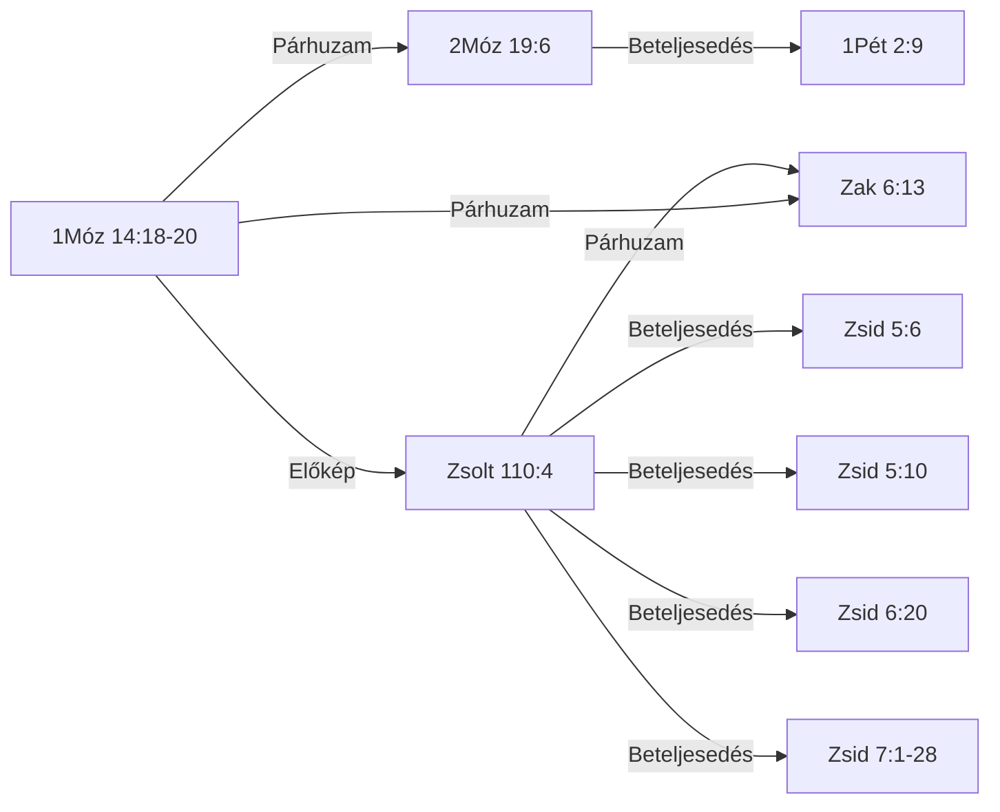

# 📖 KIRALY-001 — Melkizedek — király-pap rendje, kenyér és bor

## TUDOMÁNYOS REFERENCIA-VÁLTOZAT

*Vegyes fájl. A GENERÁLT-blokkok az `adat/` táblákból állnak elő (`python eszkozok/general.py --cel lexikon`), kézzel nem szerkeszthetők. A blokkokon kívüli szakaszok kézzel írandók; a generátor nem írja felül őket.*

## 0. Metaadatok

<!-- GENERÁLT-KEZDET: general.py --cel lexikon#KIRALY-001#metaadat | forrás: adat/motivumok.tsv | licenc: projekt-adat | ts=2026-09-19 -->

*Ez a blokk a `[ID: KIRALY-001]` motívum törzsadatait fedi a `motivumok.tsv`-ből.*

| Mező | Érték |
|---|---|
| ID | `KIRALY-001` |
| Rövid UI-címke | Melkizedek-rend |
| Teljes cím | Melkizedek — király-pap rendje, kenyér és bor |
| Téma | Krisztológia |
| PaRDeS-szint | Drash/Sod |
| Státusz | publikálható (`v2`, 2026.09.10) |
| Azonosság típusa | lexikai |
| Negatív kritérium | az igehelynek vagy név szerint Melkizedeket kell megneveznie/rá hivatkoznia (a "rendje szerint" formulával), vagy a BDB H3548 "priest-king" lexikai sense alá kell tartoznia — a puszta "pap" vagy "király" cím külön-külön nem elég (l. a BDB "chieftain (exercising priestly functions)" alkategória kizárása, Jetró/Dávid fiai/Ira) |
| Fölérendelt fogalom | papi és királyi tisztség kombinációja általában (bármely "pap-király" szereplő, Melkizedekre/a H3548 priest-king sense-re való hivatkozás nélkül) |
| Forrás-study | `tematikus_lezart/Melkizedek_tematikus.md` |
| Kereszthivatkozás-napló | `tematikus_lezart/naplok/Melkizedek_tematikus_kereszthivatkozas_naplo.md` |
| Sablon-megfelelőség | v12 |

<!-- GENERÁLT-VÉGE: lexikon#KIRALY-001#metaadat -->

## 1. Előfordulások

<!-- GENERÁLT-KEZDET: general.py --cel lexikon#KIRALY-001#elofordulasok | forrás: adat/elofordulasok.tsv | licenc: projekt-adat | ts=2026-09-19 -->

*Ez a blokk a `[ID: KIRALY-001]` motívum 9 igehely-sorát fedi az `elofordulasok.tsv`-ből, kanonikus sorrendben, ebből 5 lexikon-jelentéssel.*

| Igehely | Kapcsolódás | PaRDeS-szint | Funkció | Strong-szám(ok) | Lexikon-jelentés |
|---|---|---|---|---|---|
| 1Móz 14:18-20 | Melkizedek, Sálem királya, egyszerre "a Felséges Isten papja" — kenyeret és bort hoz, megáldja Ábrámot, aki tizedet ad neki. Első előfordulás, minden előzmény és genealógia nélkül. | Peshat | 🌱 alap-előfordulás — a motívum legelső megjelenése | H3548 | BDB H3548 1 — pap-király |
| 2Móz 19:6 | "Ti pedig lesztek nékem papok királysága" — a Sínai-szövetségben Izráel egésze kap kollektív király-pap identitást, a lévita papság intézményesítése előtt. Ugyanaz a כֹּהֵן gyök, mint Melkizedeknél, de itt nem egy egyén, hanem egy egész nép viseli. | Remez | egyéni → kollektív szintre emelve | H3548+H4467 | BDB H3548 1 — egyszerre papok és királyok a nemzetekhez való viszonyukban |
| Zsolt 76:3 | "Sálemben van az ő sátora, és lakóhelye Sionban" — a Sálem=Jeruzsálem/Sion azonosítás, ugyanazzal a Strong-számmal (H8004), mint 1Móz 14:18-nál — lexikai, nem csak tematikus kapcsolat. | Remez | helynév-azonosítás, lexikai kapocs | H8004 | BDB H8004 — helynév, Jeruzsálem rövidüléseként/archaizáló neveként; a BDB explicit Zsolt 76:3-at idézi Gen 14:18 mellett |
| Zsolt 110:4 | "Megesküdt az Úr és meg nem másítja: Te vagy pap örökké Melkhisédek rendje szerint" — próféciai eskü-formula, dávidi/individuális szintre visszavéve a mintát. | Remez | próféciai megerősítés, dávidi szintre szűkítve | H3548 | BDB H3548 1 — messiási pap-király, mint Melkizedek |
| Zak 6:13 | "pap lesz az ő királyi székén" — próféciai kép egyetlen alakról, aki egyszerre ül a trónon és visel papi tisztséget. | Remez | explicit "pap a trónon" kép, próféciai megerősítés | H3548+H3678 | BDB H3548 1 — messiási pap és király |
| Zsid 5:6 | A Zsolt 110:4 első idézetei, bevezetve Krisztus főpapságának témáját. | Drash | krisztológiai betöltés, első idézet | G5010 | — |
| Zsid 5:10 | A Zsolt 110:4 idézése, Krisztus főpapságának bevezetése. | Drash | krisztológiai betöltés | G5010 | — |
| Zsid 6:20 | A Zsolt 110:4 idézése, Krisztus "örökkévaló főpap Melkhisédek rendje szerint" bevezetése. | Drash | krisztológiai betöltés | G5010 | — |
| Zsid 7:1-28 | A Melkizedek-rend teljes kifejtése: nagyobb a lévita rendnél (a tized-jelenetből levezetve), örökkévaló (argumentum e silentio), a törvény megváltozásának alapja. | Drash/Sod | krisztológiai betöltés, teljes kifejtés | G5010+G0813+G0282 | — |

<!-- GENERÁLT-VÉGE: lexikon#KIRALY-001#elofordulasok -->

## 1/b. PaRDeS keretrendszer *(kézi)*

*Kézzel írandó — a forrás-study 3. pontja alapján, a 2. szakasz lexikai adataival bővítve.*

## 2. Lexikon-szócikkek

<!-- GENERÁLT-KEZDET: general.py --cel lexikon#KIRALY-001#szocikkek | forrás: adat/lexikon_hivatkozasok.tsv, konkordancia/OSHL_lexikalis_index.tsv, konkordancia/SDBH_domenek.tsv, konkordancia/SDGNT_domenek.tsv | licenc: CC BY 4.0, CC BY-SA 4.0, közkincs | ts=2026-09-19 -->

*Ez a blokk a `[ID: KIRALY-001]` motívum 7 Strong-tokenjét fedi, van jelentés-hivatkozással a `lexikon_hivatkozasok.tsv`-ből.*

### G0282

**TWOT:** —

**Szemantikai domén:** 010002 Kinship Relations Involving Successive Generations

Nincs jelentés-hivatkozás a `lexikon_hivatkozasok.tsv`-ben.

### G0813

**TWOT:** —

**Szemantikai domén:** 088032 Laziness, Idleness

Nincs jelentés-hivatkozás a `lexikon_hivatkozasok.tsv`-ben.

### G5010

**TWOT:** —

**Szemantikai domén:** 058004 Class, Kind, 061 Sequence, 062002 Organize [of events and states]

Nincs jelentés-hivatkozás a `lexikon_hivatkozasok.tsv`-ben.

### H3548

**TWOT:** 959a

**Szemantikai domén:** 001002007008 Priests

#### BDB H3548 — 1. jelentés

> 1 priest-king: e.g. Melchizedek Gen 14:18 (E ?), compare Psa 110:4 (the Messianic priest-king like Melchizedek); Zech 6:13 (Messianic priest and king); Israel כֹּהֲנִים מַמְלֶכֶת Exod 19:6 (E) a kingdom of priests (priests and kings at once in their relation to the nations); compare Isa 61:6 (of Israel ministering as a priest); or a chieftain (exercising priestly functions) מִדְיָן כֹּהֵן Exod 2:16; 3:1; 18:1 (all J E); so also probably the sons of David 2Sam 8:18, his grandson 1Kin 4:5, and Ira the Jairite 2Sam 20:26, who as princes performed priestly functions. With these we may class the כהנים Exod 19:22, 24 (J).

Fordítás nincs (a `forditas_hu` üres).

*Forrás: konkordancia/BDB_teljes_unabridged.tsv*

### H3678

**TWOT:** 1007

**Szemantikai domén:** 001002008001008 Furnishings, 002001002012 Great, 002003002007 Control

Nincs jelentés-hivatkozás a `lexikon_hivatkozasok.tsv`-ben.

### H4467

**TWOT:** 1199f

**Szemantikai domén:** 001002001 Land, 001002007004 Groups, 002001001 Attribute, 002003002007 Control

Nincs jelentés-hivatkozás a `lexikon_hivatkozasok.tsv`-ben.

### H8004

**TWOT:** —

**Szemantikai domén:** 001002007003 Friends, 002001002008 Faithful, 002001003003 Complete, 002003001020 Whole, 002003003019 Safe, 003001010 Names of Locations

Nincs jelentés-hivatkozás a `lexikon_hivatkozasok.tsv`-ben.

<!-- GENERÁLT-VÉGE: lexikon#KIRALY-001#szocikkek -->

### Miért fontos ez a lelet *(kézi)*

*Kézzel írandó.*

## 3. LXX-híd — nyers adat

<!-- GENERÁLT-KEZDET: general.py --cel lexikon#KIRALY-001#lxx | forrás: konkordancia/LXX_kivonat_Exodus.tsv, konkordancia/LXX_kivonat_Genezis.tsv, konkordancia/LXX_kivonat_Zakarias.tsv, konkordancia/LXX_kivonat_Zsoltarok.tsv | licenc: tisztazatlan | ts=2026-09-19 -->

*Ez a blokk a `[ID: KIRALY-001]` motívum 3 görög Strong-tokenjét keresi 5 ÓSZ igehelyen az LXX-kivonatban, és 1 találatot ad.*

| Igehely | Görög szóalak | Morfológiai kód | Strong | Forrás-jelzés |
|---|---|---|---|---|
| Zsolt 110:4 | ταξιν | N-ASF | G5010 | LXX_WH |

<!-- GENERÁLT-VÉGE: lexikon#KIRALY-001#lxx -->

## 4. TSK és Károli-KH — nyers eredmény

<!-- GENERÁLT-KEZDET: general.py --cel lexikon#KIRALY-001#tsk_kh | forrás: konkordancia/TSK_kereszthivatkozasok.tsv, konkordancia/Karoli_kereszthivatkozasok.tsv | licenc: CC BY 4.0, közkincs | ts=2026-09-19 -->

*Ez a blokk a `[ID: KIRALY-001]` motívum 9 igehelyét veti össze a TSK (Votes ≥ 15) és a Károli-KH táblával; 7 igehely ad legalább egy találatot (18 találat összesen), 2 igehely versenkénti kereséssel nem vizsgálható.*

#### 2Móz 19:6
- TSK: Jel 5,10 (Votes: 23)
- TSK: 1Pét 2,9 (Votes: 22)
- TSK: 1Pét 2,5 (Votes: 18)
- Károli-KH: 1Pét 2,9

#### Zsolt 76:3
- Károli-KH: Zsolt 132,13-14

#### Zsolt 110:4
- TSK: Zsid 7,17 (Votes: 25)
- TSK: Zsid 5,6 (Votes: 24)
- TSK: Zsid 7,21 (Votes: 22)
- TSK: 1Móz 14,18 (Votes: 15)
- Károli-KH: Zsid 5,6
- Károli-KH: Zsid 6,20
- Károli-KH: Zsid 7,17

#### Zak 6:13
- Károli-KH: Zak 11,4

#### Zsid 5:6
- TSK: Zsolt 110,4 (Votes: 21)
- Károli-KH: Zsolt 110,4

#### Zsid 5:10
- Károli-KH: 1Móz 14,18-20
- Károli-KH: Zsolt 110,4

#### Zsid 6:20
- Károli-KH: Jel 3,19

*Versenkénti kereséssel nem vizsgálható: 1Móz 14:18-20, Zsid 7:1-28.*

<!-- GENERÁLT-VÉGE: lexikon#KIRALY-001#tsk_kh -->

### Minősítés *(kézi)*

*Kézzel írandó: független megerősítés / új találat / nem releváns.*

## 5. Kapcsolatok

<!-- GENERÁLT-KEZDET: general.py --cel lexikon#KIRALY-001#kapcsolatok | forrás: adat/kapcsolatok.tsv | licenc: projekt-adat | ts=2026-09-19 -->

*Ez a blokk a `[ID: KIRALY-001]` motívum 9 kapcsolat-sorát fedi a `kapcsolatok.tsv`-ből, 9 igehely-csomóponttal.*

| Forrás | Cél | Típus | Funkció | Bizonyosság | PaRDeS-szint |
|---|---|---|---|---|---|
| 1Móz 14:18-20 | 2Móz 19:6 | Párhuzam | egyéni eset → kollektív, nemzeti szintre emelve, lévita rend előtt | magas | Remez |
| 1Móz 14:18-20 | Zsolt 110:4 | Előkép | egyszeri esemény → örökkévaló, próféciai "rendé" emelve; TSK 14 szavazat | magas | Remez |
| Zsolt 110:4 | Zak 6:13 | Párhuzam | próféciai visszautalás → explicit "pap a trónon" kép; TSK 9 szavazat | magas | Remez |
| 1Móz 14:18-20 | Zak 6:13 | Párhuzam | közös H3548 priest-king sense; TSK csak 2 szavazat, gyenge megerősítés | közepes | Remez |
| 2Móz 19:6 | 1Pét 2:9 | Beteljesedés | szó szerinti LXX-idézés (βασίλειον ἱεράτευμα); TSK 22 szavazat | magas | Drash |
| Zsolt 110:4 | Zsid 5:6 | Beteljesedés | a Zsolt 110:4 első idézete, Krisztus főpapságának bevezetése | magas | Drash |
| Zsolt 110:4 | Zsid 5:10 | Beteljesedés | a Zsolt 110:4 idézése | magas | Drash |
| Zsolt 110:4 | Zsid 6:20 | Beteljesedés | a Zsolt 110:4 idézése | magas | Drash |
| Zsolt 110:4 | Zsid 7:1-28 | Beteljesedés | a Melkizedek-rend teljes kifejtése, a Zsolt 110:4 nyomán | magas | Drash/Sod |

<!-- GENERÁLT-VÉGE: lexikon#KIRALY-001#kapcsolatok -->

### Alátámasztás *(kézi)*

*Kézzel írandó.*

## 6. Módszertani napló *(kézi)*

*Kézzel írandó.*

## 7. ÚJ FELISMERÉS *(kézi, ha van)*

## 8. Nyitott kérdések és séma-korlátok *(kézi)*

*Kézzel írandó.*

## 9. Források és licencek

<!-- GENERÁLT-KEZDET: general.py --cel lexikon#KIRALY-001#forrasok | forrás: adat/elofordulasok.tsv, adat/kapcsolatok.tsv, adat/lexikon_hivatkozasok.tsv, adat/motivumok.tsv, konkordancia/Karoli_kereszthivatkozasok.tsv, konkordancia/LXX_kivonat_Exodus.tsv, konkordancia/LXX_kivonat_Genezis.tsv, konkordancia/LXX_kivonat_Zakarias.tsv, konkordancia/LXX_kivonat_Zsoltarok.tsv, konkordancia/OSHL_lexikalis_index.tsv, konkordancia/SDBH_domenek.tsv, konkordancia/SDGNT_domenek.tsv, konkordancia/TSK_kereszthivatkozasok.tsv | licenc: CC BY 4.0, CC BY-SA 4.0, közkincs, projekt-adat, tisztazatlan | ts=2026-09-19 -->

*Ez a blokk a `[ID: KIRALY-001]` motívum lexikon-oldalán ténylegesen felhasznált forrásokat sorolja fel.*

| Forrás | Fájl | Licenc | Blokk |
|---|---|---|---|
| `elofordulasok.tsv` | `adat/elofordulasok.tsv` | projekt-adat | elofordulasok |
| `kapcsolatok.tsv` | `adat/kapcsolatok.tsv` | projekt-adat | kapcsolatok |
| `lexikon_hivatkozasok.tsv` | `adat/lexikon_hivatkozasok.tsv` | közkincs | szocikkek |
| `motivumok.tsv` | `adat/motivumok.tsv` | projekt-adat | metaadat |
| `Karoli_kereszthivatkozasok.tsv` | `konkordancia/Karoli_kereszthivatkozasok.tsv` | közkincs | tsk_kh |
| `LXX_kivonat_Exodus.tsv` | `konkordancia/LXX_kivonat_Exodus.tsv` | tisztazatlan | lxx |
| `LXX_kivonat_Genezis.tsv` | `konkordancia/LXX_kivonat_Genezis.tsv` | tisztazatlan | lxx |
| `LXX_kivonat_Zakarias.tsv` | `konkordancia/LXX_kivonat_Zakarias.tsv` | tisztazatlan | lxx |
| `LXX_kivonat_Zsoltarok.tsv` | `konkordancia/LXX_kivonat_Zsoltarok.tsv` | tisztazatlan | lxx |
| `OSHL_lexikalis_index.tsv` | `konkordancia/OSHL_lexikalis_index.tsv` | CC BY 4.0 | szocikkek |
| `SDBH_domenek.tsv` | `konkordancia/SDBH_domenek.tsv` | CC BY-SA 4.0 | szocikkek |
| `SDGNT_domenek.tsv` | `konkordancia/SDGNT_domenek.tsv` | CC BY-SA 4.0 | szocikkek |
| `TSK_kereszthivatkozasok.tsv` | `konkordancia/TSK_kereszthivatkozasok.tsv` | CC BY 4.0 | tsk_kh |

<!-- GENERÁLT-VÉGE: lexikon#KIRALY-001#forrasok -->
