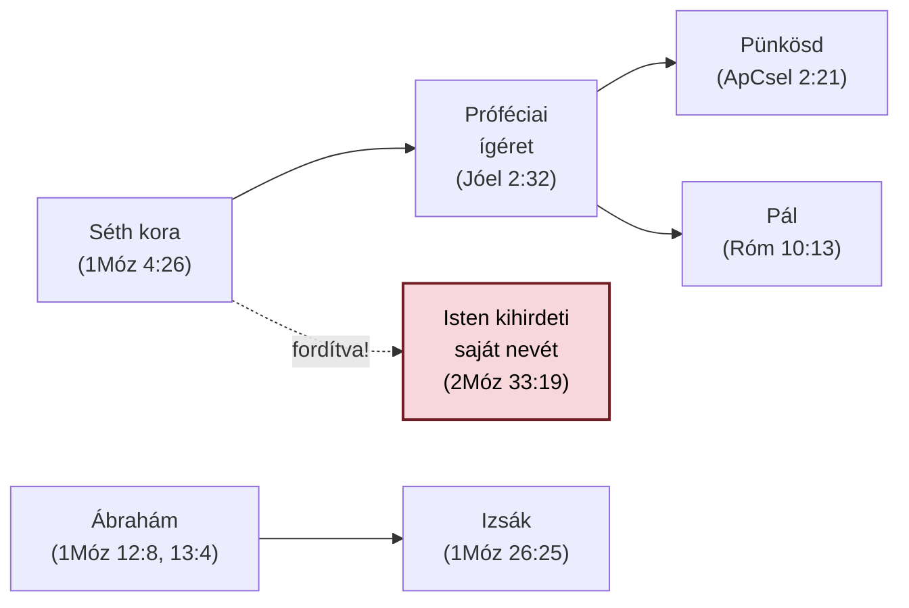

# Névbe vetett segítségül hívás

### *Segítségül hívni az Úr nevét — bibliai motívum*

---

**Mit jelent ez a kifejezés?** A Bibliában újra és újra megjelenik egy
rögzült, szinte szertartásos fordulat: *"segítségül hívni az Úr
nevét"* — héberül **קָרָא בְשֵׁם יְהוָה** (*kará beshém Adonáj*). Nem
egyszerű megszólításról van szó, hanem arról, hogy valaki Isten
nevének tekintélyére, hűségére támaszkodva fordul hozzá.

---

## Hol jelenik meg a Bibliában?

**A történet Énóssal kezdődik** (1Móz 4:26): Ádám unokájának
nemzedékétől kezdve az emberek tudatosan, névvel azonosítva kezdték
imádni Istent — ez éles ellentétben áll az előző fejezetek önerős,
Isten nélküli civilizációépítésével.

**Ábrahám és Izsák életében szokássá válik.** Ábrahám kétszer is
felépít egy oltárt Bétel és Ai között, és mindkétszer segítségül
hívja ott az Urat (1Móz 12:8, majd visszatérve 13:4). Beérsebában egy
fát ültet, és a névhez egy új jelzőt is társít: *"örökkévaló Isten"*
(1Móz 21:33). Fia, Izsák pedig ugyanazon a helyen folytatja apja
gyakorlatát (1Móz 26:25) — a hit nem csak személyes élmény, hanem
öröklődő szokás.

**A nyilvánosság előtt is megjelenik.** A Kármel-hegyen Illés próféta
egyetlen mondatban állítja a nép elé a választást: *"ti a ti
isteneitek nevét hívjátok, én az Úr nevét fogom hívni"* (1Kir 18:24)
— majd a Baál papjai hiába kiáltoznak, nem történik semmi.

**Személyes imádságban is felbukkan.** A zsoltáros háromszor is
elmondja ugyanabban a hálaénekben: *"segítségül hívom az Úr nevét"*
(Zsolt 116:4, 13, 17).

**Végül eljut a próféciai ígéretig.** Jóel könyve kimondja: *"mindaz,
aki segítségül hívja az Úr nevét, megmenekül"* (Jóel 2:32) — ezt a
mondatot idézi szó szerint Péter a pünkösdi prédikációjában (ApCsel
2:21), és Pál is, amikor az evangéliumot magyarázza (Róm 10:13) — sőt
egy verssel később (Róm 10:14) ugyanezzel a szóval folytatja: *"mimódon
hívják segítségül, akiben nem hisznek?"*

## Egy meglepő fordulat

Van egy hely, ahol a szereplők felcserélődnek: a Sínai-hegyen **nem
az ember hívja segítségül Istent, hanem Isten mondja ki a saját
nevét** Mózesnek (2Móz 33:19, majd 34:5) — közvetlenül azelőtt, hogy
kinyilatkoztatná a saját jellemét ("irgalmas és kegyelmes Isten,
késedelmes a haragra..."). Ez a fordulat még a görög bibliafordítók
figyelmét sem kerülte el: míg az ember általi segítségül hívásra
mindenhol ugyanazt a görög szót használják, itt egy másikat — mert
ez egy másfajta cselekedet.

## Egy figyelmeztető ellenpélda

Jeremiás könyve (10:25) és a 79. zsoltár szinte szóról szóra
ugyanazt a vádat mondja ki a pogány nemzetek ellen: *"a Te nevedet
nem hívták segítségül."* A mulasztás önmagában vád.

---

## Hogyan kapcsolódnak egymáshoz az igehelyek?

*A piros csomópont a kivételt jelöli: itt nem az ember hívja
segítségül Istent, hanem Isten mondja ki a saját nevét.*

---

## Miért fontos ez ma?

A motívum azt tanítja, hogy az istentisztelet lényege nem a nyilvános
teljesítmény, hanem a **függőség tudatos, névvel azonosított
kifejezése**. Kenneth Hagin erre a mintára (pontosabban a Róma 10:13
csúcspontjára) építi a "pozitív vallástétel" tanítását: a szóbeli
megvallás nem üres formula, hanem hitbeli cselekvés.

---

## Rövid nyelvi jegyzet

- **קָרָא** (*kará*) — "hívni, kiáltani"
- **שֵׁם** (*shém*) — "név" — a héber gondolkodásban nem puszta címke,
  hanem a lényeget, jellemet hordozza
- Görögül a Septuaginta szinte mindenhol az **ἐπικαλέομαι**
  (*epikaleomai*) igét használja — pontosan azt, amit Péter és Pál is
  átvesz az Újszövetségben

---

*Ez az oldal a `Segitsegul_hivni_az_Urat_tematikus.md` teljes
tanulmány leegyszerűsített, olvasásra/nyomtatásra szánt kivonata. A
teljes forrásanyag (BDB-, TBESG-szócikkek, LXX-adatok,
kereszthivatkozás-napló) az `ISTENTISZT-001_TUDOMANYOS.md` fájlban
található.*
