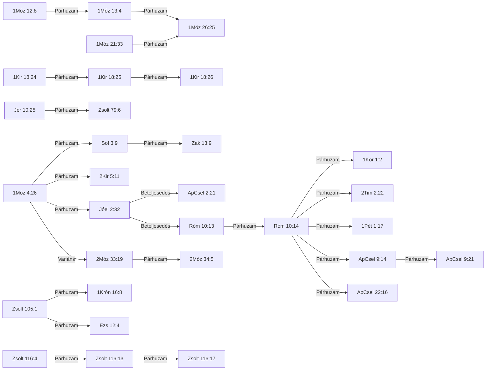

# ISTENTISZT-001 — Segítségül hívni az Úr nevét

*Kereszthivatkozási törzscikk — ugyanannak a tartalomnak az olvasói nézete, mint a [tudományos lexikonoldal](ISTENTISZT-001_TUDOMANYOS.md).*

| | |
|---|---|
| **ID** | `ISTENTISZT-001` |
| **Teljes cím** | Segítségül hívni az Úr nevét |
| **Rövid UI-címke** | Névbe vetett segítségülhívás |
| **Téma** | Pneumatológia/istentisztelet |
| **Azonosság típusa** | formulaikus |
| **PaRDeS-szint** | Drash |
| **Státusz** | publikálható (`v3`, 2026.09.22) |
| **Igehelyek** | 32 (22 ÓSZ / 10 ÚSZ) |
| **Kapcsolatok** | 25 |
| **Fő szavak** | ἐπικαλέω (epikaleó, G1941) · קָרָא (kárá, H7121) · שֵׁם (sém, H8034) |
| **Negatív kritérium** | az igehelynek a קָרָא (kárá) + בְּ (be) (aktív, invokáló szerkezet: "[valaki] hívja segítségül [Isten nevét]") mintát kell mutatnia — a passzív נִקְרָא...עַל (nikrá … al) szerkezet (birtoklás/hovatartozás kifejezése, nem invokáció) kizárja a besorolást, még akkor is, ha ugyanazt a két gyököt használja (l. D-minta, 2Sám 6:2, Jer 7:10-14, 5Móz 28:10, ÚSZ-párja Zsid 11:16) |
| **Fölérendelt fogalom** | istentisztelet/imádság általában (bármely invokációs forma, a קָרָא בְשֵׁם (kárá besém) formulán kívül) |

## Kivonat

A motívum az ószövetségi קָרָא בְּשֵׁם יְהוָה (kárá besém JHVH), „segítségül hívni az Úr nevét" formulát és újszövetségi folytatását követi: formulaikus azonosság, 32 igehelyen (22 ószövetségi, 10 újszövetségi). A formula az 1Móz 4:26-ban jelenik meg először, a pátriárkák oltárépítéséhez kötődik, majd a zsoltárokban és a prófétáknál liturgikus és eszkatológiai formává válik (Jóel 2:32). A Septuaginta a 22 ószövetségi helyből 18-at az ἐπικαλέω (epikaleó) igével ad vissza; eltér a két isteni önkihirdetésnél (2Móz 33:19; 34:5: καλέω, kaleó) és az Ézs 12:4-ben (βοάω, boaó), a Zsolt 116:17-ben pedig a tagmondat hiányzik a görögből. Az Újszövetség a Jóel 2:32-t szó szerint idézi (ApCsel 2:21; Róm 10:13), és a formulát Krisztusra alkalmazza: a „segítségül hívók" a korai gyülekezet önmegnevezésévé válnak (ApCsel 9:14, 21; 1Kor 1:2).

## Tartalom

- [1. Igehelyek és kereszthivatkozások](#1-igehelyek-és-kereszthivatkozások)
- [2. Kapcsolatok](#2-kapcsolatok)
- [3. A kereszthivatkozások minősítése](#3-a-kereszthivatkozások-minősítése)
- [4. LXX-fordítói döntések](#4-lxx-fordítói-döntések)
- [5. Szótári háttér — szerepek és lefedettség](#5-szótári-háttér--szerepek-és-lefedettség)
- [6. Értelmezés](#6-értelmezés)
- [7. Módszertan és nyitott kérdések](#7-módszertan-és-nyitott-kérdések)
- [Jelmagyarázat](#jelmagyarázat)
- [Források és licenc](#források-és-licenc)

## 1. Igehelyek és kereszthivatkozások

| Igehely | Funkció | PaRDeS-szint | Megbízhatóság |
|---|---|---|---|
| [1Móz 4:26](#v-1móz-4-26) | 🌱 alap-előfordulás | Drash | magas · tartalom-alapú |
| [1Móz 12:8](#v-1móz-12-8) | 🔁 ismétlődés | Drash | magas · tartalom-alapú |
| [1Móz 13:4](#v-1móz-13-4) | ⭐ küszöb-előfordulás | Drash | magas · tartalom-alapú |
| [1Móz 21:33](#v-1móz-21-33) | ➕ bővülés | Drash | magas · tartalom-alapú |
| [1Móz 26:25](#v-1móz-26-25) | 👨‍👦 öröklés | Drash | magas · tartalom-alapú |
| [2Móz 33:19](#v-2móz-33-19) | ❓ be nem sorolható | Remez | magas · tartalom-alapú |
| [2Móz 34:5](#v-2móz-34-5) | ❓ be nem sorolható | Remez | magas · tartalom-alapú |
| [1Kir 18:24](#v-1kir-18-24) | ⚔️ nyilvános versengés | Remez | magas · tartalom-alapú |
| [1Kir 18:25](#v-1kir-18-25) | ⚔️ nyilvános versengés (folytatás) | Remez | magas · tartalom-alapú |
| [1Kir 18:26](#v-1kir-18-26) | ⚔️ nyilvános versengés (folytatás) | Remez | magas · tartalom-alapú |
| [2Kir 5:11](#v-2kir-5-11) | 🔁 ismétlődés, kívülálló szemszögéből | Remez | magas · tartalom-alapú |
| [1Krón 16:8](#v-1krón-16-8) | ⇄ párhuzam | Remez | magas · tartalom-alapú |
| [Zsolt 79:6](#v-zsolt-79-6) | ⇄🚫 párhuzam, tagadó forma | Remez | magas · tartalom-alapú |
| [Zsolt 105:1](#v-zsolt-105-1) | ⇄ párhuzam | Remez | magas · tartalom-alapú |
| [Zsolt 116:4](#v-zsolt-116-4) | 🔁 ismétlődés, személyes könyörgésben | Remez | magas · tartalom-alapú |
| [Zsolt 116:13](#v-zsolt-116-13) | 🔁 ismétlődés, személyes könyörgésben | Remez | magas · tartalom-alapú |
| [Zsolt 116:17](#v-zsolt-116-17) | 🔁 ismétlődés, személyes könyörgésben | Remez | magas · tartalom-alapú |
| [Ézs 12:4](#v-ézs-12-4) | ⇄ párhuzam | Remez | közepes · tartalom-alapú |
| [Jer 10:25](#v-jer-10-25) | ⇄🚫 párhuzam, tagadó forma | Remez | magas · tartalom-alapú |
| [Jóel 2:32](#v-jóel-2-32) | 🎯 előkép/beteljesedés | Remez | magas · tartalom-alapú |
| [Sof 3:9](#v-sof-3-9) | 🔮 eszkatológiai kitekintés | Remez | magas · tartalom-alapú |
| [Zak 13:9](#v-zak-13-9) | 🔮 eszkatológiai kitekintés (folytatás) | Remez | magas · tartalom-alapú |
| [ApCsel 2:21](#v-apcsel-2-21) | 🎯 előkép/beteljesedés (idézet) | Remez | magas · tartalom-alapú |
| [ApCsel 9:14](#v-apcsel-9-14) | 🎯 előkép/beteljesedés (kiterjesztés) | Remez | magas · tartalom-alapú |
| [ApCsel 9:21](#v-apcsel-9-21) | 🔁 ismétlődés | Remez | magas · tartalom-alapú |
| [ApCsel 22:16](#v-apcsel-22-16) | 🎯 előkép/beteljesedés (kiterjesztés) | Remez | magas · tartalom-alapú |
| [Róm 10:12](#v-róm-10-12) | 🎯 előkép/beteljesedés (bevezetés) | Remez | magas · tartalom-alapú |
| [Róm 10:13](#v-róm-10-13) | 🎯 előkép/beteljesedés (idézet) | Remez | magas · tartalom-alapú |
| [Róm 10:14](#v-róm-10-14) | 🎯 előkép/beteljesedés (folytatás) | Remez | magas · tartalom-alapú |
| [1Kor 1:2](#v-1kor-1-2) | 🎯 előkép/beteljesedés (kiterjesztés) | Remez | magas · tartalom-alapú |
| [2Tim 2:22](#v-2tim-2-22) | 🎯 előkép/beteljesedés (kiterjesztés) | Remez | magas · tartalom-alapú |
| [1Pét 1:17](#v-1pét-1-17) | 🎯 előkép/beteljesedés (kiterjesztés) | Remez | magas · tartalom-alapú |

*Az UBS-jelentés csak újszövetségi soroknál áll: az UBS Greek New Testament Dictionary az Újszövetséget fedi.*

### 1Móz 4:26

> *Séthnek is született fia, és nevezé annak nevét Énósnak. Akkor kezdték segítségül hívni az Úrnak nevét.*

A formula első előfordulása — Séth fia, Énós nemzedéke; a Kain-vonal önerős civilizációépítése utáni korszakváltás jele.  
Funkció: a motívum legelső megjelenése a kánonban, minden későbbi eset erre vezethető vissza  

- **Kulcsszó:** segítségül hívni az Úrnak nevét — קְרֹ֖א (k.Ro'); שֵׁ֥ם (Shem)
- **Strong · szótári jelentés:** H7121+H8034 · BDB H7121 2.c — invokálni, segítségül hívni
- **LXX:** 1Móz 4:26 — ἐπικαλεῖσθαι (ἐπικαλέω, epikaleó G1941) — egyező
- **Kapcsolatok:** → [Sof 3:9](#v-sof-3-9) (Párhuzam, magas); → [2Kir 5:11](#v-2kir-5-11) (Párhuzam, közepes); → [Jóel 2:32](#v-jóel-2-32) (Párhuzam, magas); → [2Móz 33:19](#v-2móz-33-19) (Variáns, magas)

### 1Móz 12:8

> *Onnan azután a hegység felé méne Bétheltől keletre és felüté sátorát: Béthel vala nyugatra, Hái pedig keletre, és ott oltárt építe az Úrnak, és segítségűl hívá az Úr nevét.*

Ábrám, Bétel-Ai között — oltárépítés + segítségül hívás első összekapcsolása.  
Funkció: a formula második, még nem rögzült szokásként ismétlődő megjelenése  

- **Kulcsszó:** segítségűl hívá az Úr nevét — יִּקְרָ֖א (i.yik.Ra'); שֵׁ֥ם (Shem)
- **Strong · szótári jelentés:** H7121+H8034 · BDB H7121 2.c — invokálni, segítségül hívni
- **LXX:** 1Móz 12:8 — ἐπεκαλέσατο (ἐπικαλέω, epikaleó G1941) — egyező
- **Kapcsolatok:** → [1Móz 13:4](#v-1móz-13-4) (Párhuzam, magas)

### 1Móz 13:4

> *Annak az oltárnak helyére, melyet ott elsőben készített vala: és segítségűl hívá ott Ábrám az Úrnak nevét.*

Ábrám visszatér ugyanahhoz az oltárhoz Egyiptomból; a formula tudatos, felkeresett szokássá válik.  
Funkció: a 3. genezisi eset, ami miatt a motívum elérte az önálló tematikus feldolgozáshoz szükséges gyakoriságot  

- **Kulcsszó:** segítségűl hívá ott Ábrám az Úrnak nevét — יִּקְרָ֥א (i.yik.Ra'); שֵׁ֥ם (Shem)
- **Strong · szótári jelentés:** H7121+H8034 · BDB H7121 2.c — invokálni, segítségül hívni
- **LXX:** 1Móz 13:4 — ἐπεκαλέσατο (ἐπικαλέω, epikaleó G1941) — egyező
- **Kapcsolatok:** → [1Móz 26:25](#v-1móz-26-25) (Párhuzam, magas); ← [1Móz 12:8](#v-1móz-12-8) (Párhuzam, magas)
- **Károli-kereszthivatkozás:** 1Móz 12:8

### 1Móz 21:33

> *Ábrahám pedig tamariskusfákat ültete Beérsebában, és segítségűl hívá ott az örökkévaló Úr Istennek nevét.*

Ábrahám, Beérseba — a formula kiegészül egy isteni jelzővel: אֵל עוֹלָם (él olám), "örökkévaló Isten".  
Funkció: a formula első alkalommal egészül ki isteni jelzővel, új teológiai tartalmat hordozva  

- **Kulcsszó:** segítségűl hívá ott az örökkévaló Úr Istennek nevét — יִּ֨קְרָא (i.Yik.ra'-); שֵׁ֥ם (Shem)
- **Strong · szótári jelentés:** H7121+H8034 · BDB H7121 2.c — invokálni, segítségül hívni
- **LXX:** 1Móz 21:33 — ἐπεκαλέσατο (ἐπικαλέω, epikaleó G1941) — egyező
- **Kapcsolatok:** → [1Móz 26:25](#v-1móz-26-25) (Párhuzam, magas)

### 1Móz 26:25

> *Oltárt építe azért ott, és segítségűl hívá az Úrnak nevét, s felvoná ott az ő sátorát; Izsák szolgái pedig kútat ásának ottan.*

Izsák, Beérseba — a minta szó szerint átöröklődik a második pátriárka-nemzedékre, ugyanazon a helyszínen.  
Funkció: a gyakorlat generációk között, tudatos folytonossággal adódik át  

- **Kulcsszó:** segítségűl hívá az Úrnak nevét — יִּקְרָא֙ (i.yik.Ra'); שֵׁ֣ם (Shem)
- **Strong · szótári jelentés:** H7121+H8034 · BDB H7121 2.c — invokálni, segítségül hívni
- **LXX:** 1Móz 26:25 — ἐπεκαλέσατο (ἐπικαλέω, epikaleó G1941) — egyező
- **Kapcsolatok:** ← [1Móz 13:4](#v-1móz-13-4) (Párhuzam, magas); ← [1Móz 21:33](#v-1móz-21-33) (Párhuzam, magas)

### 2Móz 33:19

> *És monda az Úr: Megteszem, hogy az én dicsőségem a te orczád előtt menjen el, és kiáltom előtted az Úr nevét: És könyörülök, a kin könyörülök, kegyelmezek, a kinek kegyelmezek.*

Isten maga jelenti ki Mózesnek: "kihirdetem előtted az Úr nevét" — nem az ember hívja segítségül Isten nevét, hanem Isten mondja ki a sajátját.  
Funkció: a szereplők szerepe felcserélődik, egyik meglévő kategóriába sem illik tisztán (A/B/C tipológia, B-eset)  

- **Kulcsszó:** kiáltom előtted az Úr nevét — קָרָ֧אתִֽי (ka.Ra.ti); שֵׁ֛ם (Shem)
- **Strong · szótári jelentés:** H7121+H8034 · BDB H7121 3 — kihirdetni, kinyilatkoztatni (NEM invokáció)
- **LXX:** 2Móz 33:19 — καλέω (kaleó G2564) — eltérő
- **Kapcsolatok:** → [2Móz 34:5](#v-2móz-34-5) (Párhuzam, magas); ← [1Móz 4:26](#v-1móz-4-26) (Variáns, magas)
- **Károli-kereszthivatkozás:** Róm 9:15

### 2Móz 34:5

> *Az Úr pedig leszálla felhőben, és ott álla ő vele, és nevén kiáltá az Urat:*

Ugyanaz a jelenet folytatása: "az Úr nevében kiáltott" — Isten végrehajtja az előző fejezetben megígért önkihirdetést.  
Funkció: a szereplők szerepe felcserélődik, egyik meglévő kategóriába sem illik tisztán (A/B/C tipológia, B-eset)  

- **Kulcsszó:** nevén kiáltá az Urat — יִּקְרָ֥א (i.yik.Ra'); שֵׁ֖ם (Shem)
- **Strong · szótári jelentés:** H7121+H8034 · BDB H7121 3 — kihirdetni, kinyilatkoztatni (NEM invokáció)
- **LXX:** 2Móz 34:5 — καλέω (kaleó G2564) — eltérő
- **Kapcsolatok:** ← [2Móz 33:19](#v-2móz-33-19) (Párhuzam, magas)
- **Károli-kereszthivatkozás:** 2Móz 33:19

### 1Kir 18:24

> *Akkor hívjátok segítségül a ti istenteknek nevét, és én is segítségül hívom az Úrnak nevét; és a mely isten tűz által felel, az az Isten. És felelvén az egész sokaság, monda: Jó lesz!*

Illés a Kármelen: "ti a ti isteneitek nevét hívjátok, és én segítségül hívom az Úr nevét" — nyilvános, versengő kontextus, a kontraszt magán a versen belül.  
Funkció: a formula először jelenik meg nyilvános, két isten közötti próbatételi kontextusban  

- **Kulcsszó:** segítségül hívom az Úrnak nevét — אֶקְרָ֣א ('ek.Ra'); שֵׁם (shem-)
- **Strong · szótári jelentés:** H7121+H8034 · BDB H7121 2.c — Jahve nevével, konkrét felszólítás hatalma megmutatására
- **LXX:** 1Kir 18:24 — ἐπικαλέσομαι (ἐπικαλέω, epikaleó G1941) — egyező
- **Kapcsolatok:** → [1Kir 18:25](#v-1kir-18-25) (Párhuzam, magas)

### 1Kir 18:25

> *És monda Illés a Baál prófétáinak: Válaszszátok el magatoknak az egyik tulkot, és készítsétek el ti először; mert ti többen vagytok, és hívjátok segítségül a ti istenteknek nevét, de tüzet ne tegyetek alája.*

A Baál-próféták felszólítása: "hívjátok segítségül a ti istenetek nevét".  
Funkció: a próbatétel gyakorlati végrehajtása  

- **Kulcsszó:** hívjátok segítségül a ti istenteknek nevét — קִרְאוּ֙ (kir.'U); שֵׁ֣ם (Shem)
- **Strong · szótári jelentés:** H7121+H8034 · BDB H7121 2.c — Baál nevével
- **LXX:** 1Kir 18:25 — ἐπικαλέσασθε (ἐπικαλέω, epikaleó G1941) — egyező
- **Kapcsolatok:** → [1Kir 18:26](#v-1kir-18-26) (Párhuzam, magas); ← [1Kir 18:24](#v-1kir-18-24) (Párhuzam, magas)

### 1Kir 18:26

> *És vevék a tulkot, a melyet nékik adott, és azt elkészíték, és segítségül hívák a Baálnak nevét reggeltől fogva délig, mondván: Baál! hallgass meg minket! De nem jött szó, sem felelet. És ott sántikáltak az oltár körül, a melyet készítettek.*

A Baál-próféták ismétlődő, sikertelen invokációja — a formula kudarca a kontraszt kiteljesedése.  
Funkció: a próbatétel kudarca  

- **Kulcsszó:** segítségül hívák a Baálnak nevét — יִּקְרְא֣וּ (i.yik.re.'U); שֵׁם (shem-)
- **Strong · szótári jelentés:** H7121+H8034 · BDB H7121 2.c — Baál nevével
- **LXX:** 1Kir 18:26 — ἐπεκαλοῦντο (ἐπικαλέω, epikaleó G1941) — egyező
- **Kapcsolatok:** ← [1Kir 18:25](#v-1kir-18-25) (Párhuzam, magas)

### 2Kir 5:11

> *Akkor megharaguvék Naámán és elment, és így szólt: Íme én azt gondoltam, hogy kijő hozzám, és előállván, segítségül hívja az Úrnak, az ő Istenének nevét, és kezével megilleti a beteg helyeket, és úgy gyógyítja meg a kiütést.*

Naámán elvárása Elizeus felől — a formula ismertsége a nem-izraeli szereplő szájában is.  

- **Kulcsszó:** segítségül hívja az Úrnak, az ő Istenének nevét — קָרָא֙ (ka.Ra'); שֵׁם (shem-)
- **Strong · szótári jelentés:** H7121+H8034 · BDB H7121 2.c — invokálni, segítségül hívni
- **LXX:** 2Kir 5:11 — ἐπικαλέσεται (ἐπικαλέω, epikaleó G1941) — egyező
- **Kapcsolatok:** ← [1Móz 4:26](#v-1móz-4-26) (Párhuzam, közepes)

### 1Krón 16:8

> *Dícsérjétek az Urat, hívjátok segítségül az ő nevét, hirdessétek minden népek között az ő nagy dolgait.*

A Zsolt 105:1 szinte szó szerinti megismétlése a frigyláda Sátor elé állításának liturgiájában.  
Funkció: formulai/liturgikus örökség a genezisi hagyományból, nem narratív folytonosság  

- **Kulcsszó:** hívjátok segítségül az ő nevét — קִרְא֣וּ (kir.'U); שְׁמ֔ (sh.M)
- **Strong · szótári jelentés:** H7121+H8034 · BDB H7121 2.c — invokálni, segítségül hívni
- **LXX:** 1Krón 16:8 — ἐπικαλεῖσθε (ἐπικαλέω, epikaleó G1941) — egyező
- **Kapcsolatok:** ← [Zsolt 105:1](#v-zsolt-105-1) (Párhuzam, magas)
- **TSK-kereszthivatkozás** (szavazatszám): Zsolt 105:1 (22), Zsolt 105:15 (22), Ézs 12:4 (18)
- **Károli-kereszthivatkozás:** Ésa 12:4-5

### Zsolt 79:6

> *Ontsd ki haragodat a pogányokra, a kik nem ismernek téged, és az országokra, a melyek nem hívják segítségül a te nevedet;*

A Jer 10:25 szinte szó szerinti párhuzama, azonos vádló szerkezettel.  
Funkció: a formula elmulasztása mint vád, fordított szórenddel  

- **Kulcsszó:** nem hívják segítségül a te nevedet — קָרָֽאוּ (ka.Ra.'u); שִׁמְ (shim.)
- **Strong · szótári jelentés:** H7121+H8034 · BDB H7121 2.c (tagadva) — invokálni — tagadó szerkezetben, a mulasztás vádjaként
- **LXX:** Zsolt(LXX) 78:6 — ἐπεκαλέσαντο (ἐπικαλέω, epikaleó G1941) — egyező
- **Kapcsolatok:** ← [Jer 10:25](#v-jer-10-25) (Párhuzam, magas)
- **Károli-kereszthivatkozás:** Jer 10:25

### Zsolt 105:1

> *Magasztaljátok az Urat, hívjátok segítségül az ő nevét, hirdessétek a népek között az ő cselekedeteit!*

"Hívjátok segítségül az ő nevét, hirdessétek a népek közt az ő cselekedeteit" — a genezisi hagyományból örökölt formula önálló, liturgikus felhasználása, nem a történetszál narratív folytatása.  
Funkció: formulai/liturgikus örökség a genezisi hagyományból, nem narratív folytonosság  

- **Kulcsszó:** hívjátok segítségül az ő nevét — קִרְא֣וּ (kir.'U); שְׁמ֑ (sh.M)
- **Strong · szótári jelentés:** H7121+H8034 · BDB H7121 2.c — invokálni, segítségül hívni
- **LXX:** Zsolt(LXX) 104:1 — ἐπικαλεῖσθε (ἐπικαλέω, epikaleó G1941) — egyező
- **Kapcsolatok:** → [1Krón 16:8](#v-1krón-16-8) (Párhuzam, magas); → [Ézs 12:4](#v-ézs-12-4) (Párhuzam, magas)
- **TSK-kereszthivatkozás** (szavazatszám): Ézs 12:4 (24)
- **Károli-kereszthivatkozás:** Zsolt 47:2-4, 1Krón 16:8-10

### Zsolt 116:4

> *És az Úrnak nevét segítségül hívám: Kérlek Uram, szabadítsd meg az én lelkemet!*

A zsoltáros saját, személyes hála-könyörgésének első megfogalmazása: "segítségül hívom az Úr nevét".  

- **Kulcsszó:** az Úrnak nevét segítségül hívám — אֶקְרָ֑א ('ek.Ra'); שֵֽׁם (shem-)
- **Strong · szótári jelentés:** H7121+H8034 · BDB H7121 2.c — invokálni, segítségül hívni
- **LXX:** Zsolt(LXX) 114:4 — ἐπεκαλεσάμην (ἐπικαλέω, epikaleó G1941) — egyező
- **Kapcsolatok:** → [Zsolt 116:13](#v-zsolt-116-13) (Párhuzam, magas)

### Zsolt 116:13

> *A szabadulásért való poharat felemelem, és az Úrnak nevét hívom segítségül.*

A formula második, szó szerinti megismétlése ugyanabban a zsoltárban, a "szabadulás poharának" felemelése kontextusában.  

- **Kulcsszó:** az Úrnak nevét hívom segítségül — אֶקְרָֽא ('ek.Ra'); שֵׁ֖ם (Shem)
- **Strong · szótári jelentés:** H7121+H8034 · BDB H7121 2.c — invokálni, segítségül hívni
- **LXX:** Zsolt(LXX) 115:4 — ἐπικαλέσομαι (ἐπικαλέω, epikaleó G1941) — egyező
- **Kapcsolatok:** → [Zsolt 116:17](#v-zsolt-116-17) (Párhuzam, magas); ← [Zsolt 116:4](#v-zsolt-116-4) (Párhuzam, magas)
- **Károli-kereszthivatkozás:** Róm 3:13, Jak 3:8

### Zsolt 116:17

> *Néked áldozom hálaadásnak áldozatával, és az Úr nevét hívom segítségül.*

A formula harmadik megismétlése, hála-áldozat felajánlása kontextusában.  

- **Kulcsszó:** az Úr nevét hívom segítségül — אֶקְרָֽא ('ek.Ra'); שֵׁ֖ם (Shem)
- **Strong · szótári jelentés:** H7121+H8034 · BDB H7121 2.c — invokálni, segítségül hívni
- **LXX:** Zsolt(LXX) 115:8 — nincs megfelelő a görögben (LXX-minusz) — LXX-minusz
- **Kapcsolatok:** ← [Zsolt 116:13](#v-zsolt-116-13) (Párhuzam, magas)
- **Károli-kereszthivatkozás:** 2Sám 7:9

### Ézs 12:4

> *És így szólotok ama napon: Adjatok hálát az Úrnak, magasztaljátok az Ő nevét, hirdessétek a népek közt nagyságos dolgait, mondjátok, hogy nagy az Ő neve.*

Szó szerint majdnem azonos a Zsolt 105:1-gyel, eszkatológiai hálaének kontextusban.  
Funkció: formulai/liturgikus örökség a genezisi hagyományból, nem narratív folytonosság  

- **Kulcsszó:** magasztaljátok az Ő nevét — קִרְא֣וּ (kir.'U); שְׁמֽ (she.M)
- **Strong · szótári jelentés:** H7121+H8034 · BDB H7121 2.c — invokálni, segítségül hívni
- **LXX:** Ézs 12:4 — βοάω (boaó G0994) — eltérő
- **Kapcsolatok:** ← [Zsolt 105:1](#v-zsolt-105-1) (Párhuzam, magas)
- **Károli-kereszthivatkozás:** Zsolt 66:1-5, Zsolt 118:1, Zsolt 106:1, 1Krón 16:8-10

### Jer 10:25

> *Öntsd ki haragodat ama nemzetekre, a melyek nem ismernek téged, és ama nemzetségekre, a melyek nem hívják segítségül a te nevedet; mert megették Jákóbot, bizony megették őt, és elemésztették őt, és lakóhelyét elpusztították!*

"…a nemzetségekre, akik a Te nevedet nem hívják segítségül" — a formula tagadó, vádló formában, fordított szórenddel.  
Funkció: a formula elmulasztása mint vád, fordított szórenddel  

- **Kulcsszó:** nem hívják segítségül a te nevedet — קָרָ֑אוּ (ka.Ra.'u); שִׁמְ (shim.)
- **Strong · szótári jelentés:** H7121+H8034 · BDB H7121 2.c (tagadva) — invokálni — tagadó szerkezetben, a mulasztás vádjaként
- **LXX:** Jer 10:25 — ἐπεκαλέσαντο (ἐπικαλέω, epikaleó G1941) — egyező
- **Kapcsolatok:** → [Zsolt 79:6](#v-zsolt-79-6) (Párhuzam, magas)
- **Károli-kereszthivatkozás:** Zsolt 79:6

### Jóel 2:32

> *De mindaz, a ki az Úrnak nevét hívja segítségül, megmenekül; mert a Sion hegyén és Jeruzsálemben lészen a szabadulás, a mint megigérte az Úr, és a megszabadultak közt lesznek azok, a kiket elhí az Úr!*

Az ószövetségi megfogalmazás csúcspontja: "mindaz, aki segítségül hívja az Úr nevét, megmenekül" — ezt Péter (ApCsel 2:21) és Pál (Róm 10:13) is szó szerint idézi. Károli-számozás: Jóel 3:5.  
Funkció: az ÓSZ-i ígéret, amit az ÚSZ tételesen, szó szerint idéz  

- **Kulcsszó:** az Úrnak nevét hívja segítségül — קֹרֵֽא (ko.Re'); שֵׁ֥ם (Shem)
- **Strong · szótári jelentés:** H7121+H8034 · BDB H7121 2.c — invokálni, segítségül hívni
- **LXX:** Jóel(LXX) 3:5 — ἐπικαλέσηται (ἐπικαλέω, epikaleó G1941) — egyező
- **Kapcsolatok:** → [ApCsel 2:21](#v-apcsel-2-21) (Beteljesedés, magas); → [Róm 10:13](#v-róm-10-13) (Beteljesedés, magas); ← [1Móz 4:26](#v-1móz-4-26) (Párhuzam, magas)
- **TSK-kereszthivatkozás** (szavazatszám): Róm 10:11 (19), Róm 10:14 (19)
- **Károli-kereszthivatkozás:** Róm 10:13

### Sof 3:9

> *Akkor változtatom majd a népek ajkát tisztává, hogy mind segítségül hívják az Úr nevét, hogy egy akarattal szolgálják őt.*

Eszkatológiai ígéret — a népek megtisztított ajka egy akarattal hívja segítségül az Urat.  
Funkció: a formula jövőbeli, univerzális beteljesedésének előrevetítése  

- **Kulcsszó:** segítségül hívják az Úr nevét — קְרֹ֤א (k.Ro'); שֵׁ֣ם (Shem)
- **Strong · szótári jelentés:** H7121+H8034 · BDB H7121 2.c (rokon)
- **LXX:** Sof 3:9 — ἐπικαλεῖσθαι (ἐπικαλέω, epikaleó G1941) — egyező
- **Kapcsolatok:** → [Zak 13:9](#v-zak-13-9) (Párhuzam, magas); ← [1Móz 4:26](#v-1móz-4-26) (Párhuzam, magas)
- **Károli-kereszthivatkozás:** Zsolt 113:3, Zsolt 114:2

### Zak 13:9

> *És beviszem a harmadrészt a tűzbe, és megtisztítom őket, a mint tisztítják az ezüstöt és megpróbálom őket, a mint próbálják az aranyat; ő segítségül hívja az én nevemet és én felelni fogok néki; ezt mondom: Népem ő! Ő pedig ezt mondja: Az Úr az én Istenem!*

Sof 3:9 párja: a megtisztított maradék segítségül hívja Isten nevét, és Isten válaszol — kétirányú szövetségi megerősítés.  
Funkció: kétirányú szövetségi megerősítéssé bővíti az ígéretet  

- **Kulcsszó:** segítségül hívja ... nevemet — יִקְרָ֣א (yik.Ra'); שְׁמִ֗ (sh.M)
- **Strong · szótári jelentés:** H7121+H8034 · BDB H7121 2.c
- **LXX:** Zak 13:9 — ἐπικαλέσεται (ἐπικαλέω, epikaleó G1941) — egyező
- **Kapcsolatok:** ← [Sof 3:9](#v-sof-3-9) (Párhuzam, magas)
- **TSK-kereszthivatkozás** (szavazatszám): Zsolt 50:15 (130), Jer 29:11 (113), Jer 29:12 (113), ApCsel 2:21 (83), Ézs 65:23 (69), Ézs 65:24 (69), Ézs 48:10 (66), 1Pét 1:6 (60), 1Pét 1:7 (60), Zsolt 34:15 (59), Zsolt 34:19 (59), Zsolt 91:15 (58), Jel 21:7 (42), 1Pét 4:12 (42), Jer 30:22 (41), Ézs 43:2 (38), Jak 1:12 (37), 5Móz 26:17 (30), 5Móz 26:19 (30), Zsolt 66:10 (28), Zsolt 66:12 (28), Hós 2:21 (27), Hós 2:23 (27), Zak 10:6 (25), Mal 3:2 (24), Mal 3:3 (24), Zsid 8:10 (22), Jób 23:10 (22), Zak 8:8 (19), Ézs 58:9 (19), Mt 22:29 (19), Mt 22:32 (19), Jer 31:33 (19), 3Móz 26:12 (19), Róm 10:12 (18), Róm 10:14 (18), Péld 17:3 (16), Zak 12:10 (16), Zsolt 144:15 (16), Jel 21:3 (16), Jel 21:4 (16), 1Kor 3:11 (15), 1Kor 3:13 (15), Ez 37:27 (15), Jóel 2:32 (15), Ez 36:28 (15)
- **Károli-kereszthivatkozás:** 1Pét 1:6-7

### ApCsel 2:21

> *És lészen, hogy mindaz, a ki az Úrnak nevét segítségül hívja, megtartatik.*

Péter pünkösdi beszéde szó szerint idézi a LXX Jóel 2:32-t: "mindaz, a ki az Úrnak nevét segítségül hívja, megtartatik."  
Funkció: az ÚSZ szó szerint idézi a Jóel 2:32-t  

- **Kulcsszó:** az Úrnak nevét segítségül hívja — ἐπικαλέσηται (epikalesētai)
- **Strong · szótári jelentés:** G1941 · TBESG G1941 2 — segítségül hívni, invokálni
- **UBS-jelentés:** 33.176 — valakit arra hívni, hogy tegyen valamit; rendszerint segítségkérést is magában foglal
- **Kapcsolatok:** ← [Jóel 2:32](#v-jóel-2-32) (Beteljesedés, magas)
- **TSK-kereszthivatkozás** (szavazatszám): Róm 10:12 (29), Róm 10:13 (29), Jóel 2:32 (26), Zsolt 86:5 (20)
- **Károli-kereszthivatkozás:** 1Móz 25:21-26

### ApCsel 9:14

> *És itt is hatalma van a főpapoktól, hogy mindazokat megkötözze, kik a te nevedet segítségül hívják.*

"…mindazokat…, kik a te nevedet segítségül hívják" — Saul üldözési célpontjainak leírása, a korai keresztények azonosító megnevezése.  
Funkció: a formula önálló egyházi azonosító-formulává válik  

- **Kulcsszó:** segítségül hívják — ἐπικαλουμένους (epikaloumenous)
- **Strong · szótári jelentés:** G1941 · TBESG G1941 2 — segítségül hívni, invokálni
- **UBS-jelentés:** 11.28 — (idióma, szó szerint: valakinek a nevét valakire hívják) elismertnek lenni úgy, mint aki ahhoz tartozik, akinek a nevét rá hívták
- **Kapcsolatok:** → [ApCsel 9:21](#v-apcsel-9-21) (Párhuzam, magas); ← [Róm 10:14](#v-róm-10-14) (Párhuzam, közepes)
- **Károli-kereszthivatkozás:** 1Sám 13:13-14, Zsolt 89:21-22

### ApCsel 9:21

> *Álmélkodnak vala pedig mindnyájan, a kik hallák, és mondának: Nem ez-é az, a ki pusztította Jeruzsálemben azokat, a kik ezt a nevet hívják segítségül, és ide is azért jött, hogy őket fogva vigye a főpapokhoz?*

"…a kik ezt a nevet hívják segítségül" — az ApCsel 9:14-es leírás közvetlen megismétlése ugyanabban a fejezetben.  
Funkció: az ApCsel 9:14-es leírás közvetlen megismétlése  

- **Kulcsszó:** hívják segítségül — ἐπικαλουμένους (epikaloumenous)
- **Strong · szótári jelentés:** G1941 · TBESG G1941 2 — segítségül hívni, invokálni
- **UBS-jelentés:** 33.131 — valakiről szólva megjelölést (címet, jelzőt) alkalmazni
- **Kapcsolatok:** ← [ApCsel 9:14](#v-apcsel-9-14) (Párhuzam, magas)
- **Károli-kereszthivatkozás:** Gal 1:23

### ApCsel 22:16

> *Most annakokáért mit késedelmezel? Kelj fel és keresztelkedjél meg és mosd le a te bűneidet, segítségül híván az Úrnak nevét.*

"…segítségül híván az Úrnak nevét" — Pál saját megtérés-elbeszélésében, a keresztséggel összekapcsolva.  
Funkció: a formula önálló egyházi azonosító-formulává válik  

- **Kulcsszó:** segítségül híván — ἐπικαλεσάμενος (epikalesamenos)
- **Strong · szótári jelentés:** G1941 · TBESG G1941 2 — segítségül hívni, invokálni
- **UBS-jelentés:** 33.176 — valakit arra hívni, hogy tegyen valamit; rendszerint segítségkérést is magában foglal
- **Kapcsolatok:** ← [Róm 10:14](#v-róm-10-14) (Párhuzam, közepes)
- **TSK-kereszthivatkozás** (szavazatszám): ApCsel 2:38 (15)
- **Károli-kereszthivatkozás:** Jón 1:5

### Róm 10:12

> *Mert nincs különbség zsidó meg görög között; mert ugyanaz az Ura mindeneknek, a ki kegyelemben gazdag mindenekhez, a kik őt segítségül hívják.*

"…ugyanaz az Ura mindeneknek, a ki kegyelemben gazdag mindenekhez, a kik őt segítségül hívják" — a 10:13-as Jóel-idézet közvetlen bevezetése: a segítségül hívók körét zsidóra és görögre egyaránt kiterjeszti.  
Funkció: a 10:13 idézetét előkészítő egyetemes kiterjesztés  

- **Kulcsszó:** segítségül hívják — ἐπικαλουμένους (epikaloumenous)
- **Strong · szótári jelentés:** G1941 · TBESG G1941 2 — segítségül hívni, invokálni
- **UBS-jelentés:** 33.176 — valakit arra hívni, hogy tegyen valamit; rendszerint segítségkérést is magában foglal
- **TSK-kereszthivatkozás** (szavazatszám): Fil 4:19 (18), Jel 17:14 (15), Róm 3:22 (15)
- **Károli-kereszthivatkozás:** Csel 10:34-35

### Róm 10:13

> *Mert minden, a ki segítségül hívja az Úr nevét, megtartatik.*

Pál szó szerint idézi a LXX Jóel 2:32-t: "minden, a ki segítségül hívja az Úr nevét, megtartatik." — erre épül a 10:14 kérdéssora.  
Funkció: az ÚSZ szó szerint idézi a Jóel 2:32-t  

- **Kulcsszó:** segítségül hívja az Úr nevét — ἐπικαλέσηται (epikalesētai)
- **Strong · szótári jelentés:** G1941 · TBESG G1941 2 — segítségül hívni, invokálni
- **UBS-jelentés:** 33.176 — valakit arra hívni, hogy tegyen valamit; rendszerint segítségkérést is magában foglal
- **Kapcsolatok:** → [Róm 10:14](#v-róm-10-14) (Párhuzam, magas); ← [Jóel 2:32](#v-jóel-2-32) (Beteljesedés, magas)
- **TSK-kereszthivatkozás** (szavazatszám): ApCsel 2:21 (106), Jóel 2:32 (103)
- **Károli-kereszthivatkozás:** Jóel 2:32, Csel 2:21

### Róm 10:14

> *Mimódon hívják azért segítségül azt, a kiben nem hisznek? Mimódon hisznek pedig abban, a ki felől nem hallottak? Mimódon hallanának pedig prédikáló nélkül?*

Pál közvetlenül folytatja az érvelést: "Mimódon hívják segítségül, a kiben nem hittek?" — ugyanaz a görög ige, mint 10:13-nál.  
Funkció: Pál közvetlenül továbbviszi az érvelést ugyanabban a szakaszban  

- **Kulcsszó:** hívják segítségül — ἐπικαλέσωνται (epikalesōntai)
- **Strong · szótári jelentés:** G1941 · TBESG G1941 2 — segítségül hívni, invokálni
- **UBS-jelentés:** 33.176 — valakit arra hívni, hogy tegyen valamit; rendszerint segítségkérést is magában foglal
- **Kapcsolatok:** → [1Kor 1:2](#v-1kor-1-2) (Párhuzam, közepes); → [2Tim 2:22](#v-2tim-2-22) (Párhuzam, közepes); → [1Pét 1:17](#v-1pét-1-17) (Párhuzam, közepes); → [ApCsel 9:14](#v-apcsel-9-14) (Párhuzam, közepes); → [ApCsel 22:16](#v-apcsel-22-16) (Párhuzam, közepes); ← [Róm 10:13](#v-róm-10-13) (Párhuzam, magas)
- **TSK-kereszthivatkozás** (szavazatszám): Mk 16:15 (23), Mk 16:16 (23)
- **Károli-kereszthivatkozás:** 1Móz 3:15

### 1Kor 1:2

> *Az Isten gyülekezetének, a mely Korinthusban van, a Krisztus Jézusban megszentelteknek, elhívott szenteknek, mindazokkal egybe, a kik a mi Urunk Jézus Krisztus nevét segítségül hívják bármely helyen, a magokén és a miénken:*

"…mindazokkal egybe, a kik a mi Urunk Jézus Krisztus nevét segítségül hívják bármely helyen" — a formula első explicit alkalmazása Krisztusra, a gyülekezet önmeghatározása.  
Funkció: a formula önálló egyházi azonosító-formulává válik  

- **Kulcsszó:** segítségül hívják — ἐπικαλουμένοις (epikaloumenois)
- **Strong · szótári jelentés:** G1941 · TBESG G1941 2 — segítségül hívni, invokálni
- **UBS-jelentés:** 33.176 — valakit arra hívni, hogy tegyen valamit; rendszerint segítségkérést is magában foglal
- **Kapcsolatok:** ← [Róm 10:14](#v-róm-10-14) (Párhuzam, közepes)
- **Károli-kereszthivatkozás:** 1Kor 6:11

### 2Tim 2:22

> *Az ifjúkori kivánságokat pedig kerüld; hanem kövessed az igazságot, a hitet, a szeretetet, a békességet azokkal egyetembe, a kik segítségül hívják az Urat tiszta szívből.*

"…azokkal egyetembe, a kik segítségül hívják az Urat tiszta szívből" — a segítségül hívás mint közösségválasztási kritérium.  
Funkció: a formula önálló egyházi azonosító-formulává válik  

- **Kulcsszó:** segítségül hívják — ἐπικαλουμένων (epikaloumenōn)
- **Strong · szótári jelentés:** G1941 · TBESG G1941 2 — segítségül hívni, invokálni
- **UBS-jelentés:** 33.176 — valakit arra hívni, hogy tegyen valamit; rendszerint segítségkérést is magában foglal
- **Kapcsolatok:** ← [Róm 10:14](#v-róm-10-14) (Párhuzam, közepes)
- **TSK-kereszthivatkozás** (szavazatszám): 1Pét 2:11 (37), 1Pét 3:11 (34), 1Kor 6:18 (25), Zsolt 119:9 (22), 1Tim 6:11 (22), Zsid 12:14 (19), 1Tim 4:12 (18)
- **Károli-kereszthivatkozás:** 1Kor 1:2

### 1Pét 1:17

> *És ha Atyának hívjátok őt, a ki személyválogatás nélkül ítél, kinek-kinek cselekedete szerint, félelemmel töltsétek a ti jövevénységtek idejét:*

"…ha Atyának hívjátok őt…" — az invokáció "Atya" megszólításra alkalmazva; a görög ige azonos, a Károli nem tartja meg a "segítségül" szót.  
Funkció: a formula önálló egyházi azonosító-formulává válik  

- **Kulcsszó:** hívjátok — ἐπικαλεῖσθε (epikaleisthe)
- **Strong · szótári jelentés:** G1941 · TBESG G1941 2 — segítségül hívni, invokálni
- **UBS-jelentés:** 33.131 — valakiről szólva megjelölést (címet, jelzőt) alkalmazni *(jelölt, nem egyértelmű)*; 33.176 — valakit arra hívni, hogy tegyen valamit; rendszerint segítségkérést is magában foglal *(jelölt, nem egyértelmű)*
- **Kapcsolatok:** ← [Róm 10:14](#v-róm-10-14) (Párhuzam, közepes)
- **TSK-kereszthivatkozás** (szavazatszám): ApCsel 10:34 (20), ApCsel 10:35 (20)
- **Károli-kereszthivatkozás:** Gal 4:6, Róm 2:6-11, Zsid 12:28

### Kizárt és vizsgált helyek

Nincs kizárt vagy nyitva maradt jelölt ehhez a motívumhoz.

**Negatív kritérium**: az igehelynek a קָרָא (kárá) + בְּ (be) (aktív, invokáló szerkezet: "[valaki] hívja segítségül [Isten nevét]") mintát kell mutatnia — a passzív נִקְרָא...עַל (nikrá … al) szerkezet (birtoklás/hovatartozás kifejezése, nem invokáció) kizárja a besorolást, még akkor is, ha ugyanazt a két gyököt használja (l. D-minta, 2Sám 6:2, Jer 7:10-14, 5Móz 28:10, ÚSZ-párja Zsid 11:16)

## 2. Kapcsolatok

| Forrás | Cél | Típus | Funkció | Bizonyosság | PaRDeS-szint |
|---|---|---|---|---|---|
| [1Móz 4:26](#v-1móz-4-26) | [Sof 3:9](#v-sof-3-9) | Párhuzam | azonos szereposztás (ember hívja segítségül Isten nevét), más kánoni ponton | magas | Remez |
| [1Móz 4:26](#v-1móz-4-26) | [2Kir 5:11](#v-2kir-5-11) | Párhuzam | azonos szereposztás, parafrazált formában — nincs szó szerinti egyezés | közepes | Remez |
| [1Móz 4:26](#v-1móz-4-26) | [Jóel 2:32](#v-jóel-2-32) | Párhuzam | azonos szereposztás, az ószövetségi megfogalmazás csúcspontjáig | magas | Remez |
| [Jóel 2:32](#v-jóel-2-32) | [ApCsel 2:21](#v-apcsel-2-21) | Beteljesedés | szó szerinti LXX-idézés, ÓSZ-prófécia → ÚSZ-beteljesedés | magas | Remez |
| [Jóel 2:32](#v-jóel-2-32) | [Róm 10:13](#v-róm-10-13) | Beteljesedés | szó szerinti LXX-idézés, ÓSZ-prófécia → ÚSZ-beteljesedés | magas | Remez |
| [Róm 10:13](#v-róm-10-13) | [Róm 10:14](#v-róm-10-14) | Párhuzam | azonos szereposztás, közvetlen folytatás ugyanabban a szakaszban | magas | Remez |
| [Róm 10:14](#v-róm-10-14) | [1Kor 1:2](#v-1kor-1-2) | Párhuzam | azonos görög ige (ἐπικαλέομαι, epikaleomai), egyházi azonosító-formulává válás — nincs szó szerinti idézés | közepes | Remez |
| [Róm 10:14](#v-róm-10-14) | [2Tim 2:22](#v-2tim-2-22) | Párhuzam | azonos görög ige, egyházi azonosító-formulává válás | közepes | Remez |
| [Róm 10:14](#v-róm-10-14) | [1Pét 1:17](#v-1pét-1-17) | Párhuzam | azonos görög ige, egyházi azonosító-formulává válás | közepes | Remez |
| [Róm 10:14](#v-róm-10-14) | [ApCsel 9:14](#v-apcsel-9-14) | Párhuzam | azonos görög ige, üldözési kontextus | közepes | Remez |
| [ApCsel 9:14](#v-apcsel-9-14) | [ApCsel 9:21](#v-apcsel-9-21) | Párhuzam | szó szerinti megismétlés ugyanabban a fejezetben | magas | Remez |
| [Róm 10:14](#v-róm-10-14) | [ApCsel 22:16](#v-apcsel-22-16) | Párhuzam | azonos görög ige, megtérés-elbeszélés | közepes | Remez |
| [1Móz 4:26](#v-1móz-4-26) | [2Móz 33:19](#v-2móz-33-19) | Variáns | A/B/C tipológia B-esete — azonos szerkezet (קָרָא+שֵׁם – kárá + sém), felcserélt alany/tárgy (Isten mondja ki a saját nevét) | magas | Remez |
| [2Móz 33:19](#v-2móz-33-19) | [2Móz 34:5](#v-2móz-34-5) | Párhuzam | ugyanaz a jelenet, ugyanaz a szereposztás (Isten önkinyilatkoztatása) | magas | Remez |
| [1Móz 12:8](#v-1móz-12-8) | [1Móz 13:4](#v-1móz-13-4) | Párhuzam | Ábrám explicit visszatér ugyanahhoz az oltárhoz | magas | Drash |
| [1Móz 13:4](#v-1móz-13-4) | [1Móz 26:25](#v-1móz-26-25) | Párhuzam | öröklés — azonos szereposztás nemzedékek közt, azonos helyszín (Beérseba) | magas | Drash |
| [1Móz 21:33](#v-1móz-21-33) | [1Móz 26:25](#v-1móz-26-25) | Párhuzam | öröklés — azonos szereposztás nemzedékek közt, azonos helyszín | magas | Drash |
| [1Kir 18:24](#v-1kir-18-24) | [1Kir 18:25](#v-1kir-18-25) | Párhuzam | egyazon pericope közvetlenül egymást követő versei | magas | Remez |
| [1Kir 18:25](#v-1kir-18-25) | [1Kir 18:26](#v-1kir-18-26) | Párhuzam | egyazon pericope közvetlenül egymást követő versei | magas | Remez |
| [Zsolt 116:4](#v-zsolt-116-4) | [Zsolt 116:13](#v-zsolt-116-13) | Párhuzam | egyazon zsoltáros, szó szerinti ismétlés | magas | Remez |
| [Zsolt 116:13](#v-zsolt-116-13) | [Zsolt 116:17](#v-zsolt-116-17) | Párhuzam | egyazon zsoltáros, szó szerinti ismétlés | magas | Remez |
| [Zsolt 105:1](#v-zsolt-105-1) | [1Krón 16:8](#v-1krón-16-8) | Párhuzam | csaknem szó szerint azonos szöveg (1Krón 16 a Zsolt 105/96/106 összeállítását idézi) | magas | Remez |
| [Zsolt 105:1](#v-zsolt-105-1) | [Ézs 12:4](#v-ézs-12-4) | Párhuzam | szinte szó szerinti egyezés a formulában | magas | Remez |
| [Jer 10:25](#v-jer-10-25) | [Zsolt 79:6](#v-zsolt-79-6) | Párhuzam | csaknem szóról szóra azonos, tagadó forma; Károli-KH mindkét irányban megerősíti | magas | Remez |
| [Sof 3:9](#v-sof-3-9) | [Zak 13:9](#v-zak-13-9) | Párhuzam | azonos szereposztás, kétirányú megerősítéssel kiegészítve | magas | Remez |

Mermaid-ábra

### Alátámasztás

*Minden sor: miért ez a funkció-címke, miért ez a bizonyossági szint.*

| Kapcsolat | Alátámasztás |
|---|---|
| 1Móz 4:26 → Sof 3:9 | Mindkettő explicit a formulát alkalmazza istentiszteleti kontextusban ("segítségül hívni az Úr nevét" / "segítségül hívják mindnyájan az Úr nevét") — közös, felismerhető hitvallási nyelvezet, nem csak tematikus rokonság. |
| 1Móz 4:26 → 2Kir 5:11 | Naámán nem szó szerint idézi a formulát, hanem parafrazálja ("segítségül hívja az Úr, az ő Istene nevét") — a tartalmi kapcsolat egyértelmű, de nincs szó szerinti szövegi egyezés, innen a Közepes (nem Magas) bizonyosság. |
| 1Móz 4:26 → Jóel 2:32 → ApCsel 2:21 / Róm 10:13 | Az ApCsel és a Róma-levél **szó szerint**, görögül idézi a LXX Jóel-szöveget (πᾶς ὃς ἂν ἐπικαλέσηται τὸ ὄνομα Κυρίου σωθήσεται – pász hosz an epikaleszétai to onoma Küriú szóthészetai) — ez verbális, nem csak tematikus idézés, innen a Magas bizonyosság mindkét NT-kapcsolatnál. |
| 1Móz 4:26 → 2Móz 33:19 | A lexikai kapocs (azonos H7121+H8034 pár) önmagában Magas bizonyosságú — de a BDB eltérő jelentés alá sorolja (2.c vs. 3.) és a LXX eltérő igét használ (ἐπικαλέομαι – epikaleomai vs. καλέω – kaleó), ezért a *funkcionális* besorolás marad nyitott, a *lexikai* kapcsolat bizonyossága nem. |
| 1Móz 12:8 → 1Móz 13:4 | A szöveg explicit jelzi: Ábrám "**visszatér** ugyanahhoz az oltárhoz" — azonos helyszín, azonos szereplő, közvetlen szövegi utalás, nem rekonstrukció. |
| 1Móz 13:4 → 1Móz 26:25 / 1Móz 21:33 → 1Móz 26:25 | Izsák explicit Ábrahám fia, ugyanazon a földrajzi ponton (Beérseba) cselekszik — a genealógiai és helyrajzi kapcsolat mindkét irányban a szövegből, nem következtetésből ered. |
| 1Kir 18:24 → 18:25 → 18:26 | Egyazon pericope (a Kármel-hegyi próbatétel) közvetlenül egymást követő versei — a narratív folytonosság szövegi tény, nem értelmezés. |
| Zsolt 116:4 → 116:13 → 116:17 | Egyazon zsoltár, egyazon beszélő (a zsoltáros) — a formula szó szerinti, azonos szövegű megismétlése ugyanabban a versben, háromszor. |
| Zsolt 105:1 → 1Krón 16:8 | A két szöveg **majdnem szó szerint azonos** — 1Krón 16 ismerten a Zsolt 105/96/106 összeállítását idézi a frigyláda Sátor elé helyezésekor; ez bibliakritikailag jól dokumentált szövegpárhuzam, nem feltételezés. |
| Zsolt 105:1 → Ézs 12:4 | Szinte szó szerinti egyezés a formulában, de nincs explicit idézési jelzés egyik szövegben sem — a Magas bizonyosság a szövegi hasonlóság mértékén alapul, nem irodalomkritikai konszenzuson a közvetlen függésről. |
| Jer 10:25 → Zsolt 79:6 | A két vers csaknem szóról szóra megegyezik (jól ismert, kommentárokban gyakran tárgyalt szövegpárhuzam a két könyv között) — a Magas bizonyosság indokolt. **2026.09.06: Károli-KH is megerősíti, mindkét irányban.** |
| Róm 10:13 → Róm 10:14 | Ugyanaz a görög ige (ἐπικαλέομαι, epikaleomai), Pál közvetlenül folytatódó érvelésében ugyanabban a szakaszban — TSK-eredetű lelet, 2026.09.06. |
| Sof 3:9 → Zak 13:9 | Mindkettő explicit, egyértelműen eszkatológiai ígéretként fogalmazza meg a segítségül hívást; Zak 13:9 kétirányú szövetségi megerősítéssel egészíti ki (Isten is válaszol) — közös próféciai regiszter, innen a Magas bizonyosság. |
| Róm 10:14 → 1Kor 1:2 / 2Tim 2:22 / 1Pét 1:17 / ApCsel 9:14 / ApCsel 22:16 | Azonos görög ige (ἐπικαλέομαι – epikaleomai / ἐπικαλεῖσθε – epikaleiszthe), de nincs szó szerinti idézési kapcsolat a Jóel-lánchoz vagy egymáshoz — a kapcsolat lexikai (azonos G1941 szó, azonos jelentés-ág), nem verbális idézés, innen a Közepes (nem Magas) bizonyosság. |
| ApCsel 9:14 → ApCsel 9:21 | Ugyanaz a leírás, ugyanabban a fejezetben, néhány verssel később szó szerint megismételve ("kik ezt a nevet hívják segítségül") — Magas bizonyosság. |

## 3. A kereszthivatkozások minősítése

**TSK (Votes ≥ 15 szűréssel), 21 igehelyre lefuttatva — eredmény:** a pilot 2026.09.06-i, 21 igehelyes állapotára vonatkozik; a 2026.09.09-i bővítés 10 igehelyének és a Róm 10:12-nek a minősítése lent (2026.09.22).

- Zsolt 105:1 ↔ Ézs 12:4 (Votes 24) — **független megerősítés**
- 1Krón 16:8 ↔ Ézs 12:4 (Votes 18), 1Krón 16:8 ↔ Zsolt 105:1 (Votes 22) — **független megerősítés**
- 1Krón 16:8 → Zsolt 105:15 (Votes 22) — ellenőrizve, tartalmilag NEM releváns (a próféták érintetlenségéről szól, ugyanabban a zsoltárban)
- **Jóel 2:32 → Róm 10:14 (Votes 19) — ÚJ, VALÓDI TALÁLAT** (l. lent)
- Jóel 2:32 → Róm 10:11 (Votes 19) — ellenőrizve, nincs ἐπικαλέομαι (epikaleomai) / καλέω (kaleó) a versben, NEM releváns

**Károli-KH (szentiras.hu szerkesztői hálózat), 21 igehelyre lefuttatva:** a pilot 21 igehelyére; a kiegészítés lent.

- 1Móz 13:4 → 1Móz 12:8 — **független megerősítés**
- Zsolt 105:1 → 1Krón 16:8 — **független megerősítés**
- 1Krón 16:8 → Ézs 12:4 — **független megerősítés**
- Jer 10:25 ↔ Zsolt 79:6 (mindkét irányban) — **független megerősítés**
- 2Móz 34:5 → 2Móz 33:19 — **független megerősítés**
- Zsolt 116:13 → Róm 3:13, Jak 3:8; Zsolt 116:17 → 2Sám 7:9; Zep 3:9 → Zsolt 113:3, 114:2; Ézs 12:4 → Zsolt 66:1-5, 118:1, 106:1; 2Móz 33:19 → Róm 9:15 — mind ellenőrizve, egyik sem tartalmazza a H7121+H8034 / ἐπικαλέομαι (epikaleomai) formulát, NEM relevánsak

**ÚJ IGEHELY: Róm 10:14** — *"Mimódon hívják tehát segítségül, a kiben
nem hittek? mimódon hisznek pedig abban, a ki felől nem hallottak?"*
— **ἐπικαλέσωνται** (*epikalészóntai*, G1941), ugyanaz az ige, mint a
már dokumentált 10:13-nál, Pál folytatólagos érvelésében ugyanabban a
szakaszban.
Funkció: ELŐKÉP/BETELJESEDÉS klaszter kiegészítése (retorikai, negatív
irányú megfogalmazásban — "hogyan hívnák segítségül, akiben nem
hisznek" — előfeltételezi és megerősíti a 10:13 pozitív állítását).

**Kiegészítés (2026.09.22) — a 2026.09.09-i bővítés 10 igehelye és a Róm 10:12 (TSK Votes ≥ 15 és Károli-KH), azonos kritériummal: tartalmazza-e a cél-igehely a H7121+H8034 / ἐπικαλέομαι (epikaleomai) formulát:**

- Zak 13:9 → 46 TSK-találat + Károli-KH 1Pét 1:6-7: a formulát a már dokumentált Jóel 2:32, ApCsel 2:21 és Róm 10:14 — **független megerősítés** — mellett egyedül a Róm 10:12 tartalmazza (Votes 18) — **ÚJ, VALÓDI TALÁLAT** (l. lent). Név nélküli segítségül hívást (H7121, שֵׁם (sém) nélkül) tartalmaz a Zsolt 50:15, Zsolt 91:15, Jer 29:12, Ézs 58:9 és Ézs 65:24: rokon igei használat, nem a formula, NEM a motívum része. A többi 37 találat (tisztítás, próbatétel, szövetségi formula) a formula szempontjából NEM releváns.
- ApCsel 2:21 → Róm 10:13 (Votes 29), Jóel 2:32 (Votes 26) — **független megerősítés**; Róm 10:12 (Votes 29) — **ÚJ, VALÓDI TALÁLAT**, azonos a fentivel; Zsolt 86:5 (H7121, név nélkül) — rokon, NEM a formula; Károli-KH 1Móz 25:21-26 — a 25:25-26-ban a H7121+H8034 névadás („nevezék nevét Ézsaunak"), nem segítségül hívás — NEM releváns.
- Róm 10:13 → ApCsel 2:21 (Votes 106), Jóel 2:32 (Votes 103), és a Károli-KH ugyanezt a két helyet adja — **független megerősítés**.
- 2Tim 2:22 → Károli-KH 1Kor 1:2 — **független megerősítés**; a 7 TSK-találat (1Pét 2:11; 3:11; 1Kor 6:18; Zsolt 119:9; 1Tim 6:11; Zsid 12:14; 1Tim 4:12) az erkölcsi intelmet köti össze — NEM releváns.
- ApCsel 9:14 → 1Sám 13:13-14, Zsolt 89:21-22; ApCsel 9:21 → Gal 1:23; ApCsel 22:16 → ApCsel 2:38, Jón 1:5; Róm 10:14 → Mk 16:15-16, 1Móz 3:15; 1Kor 1:2 → 1Kor 6:11; 1Pét 1:17 → ApCsel 10:34-35, Gal 4:6, Róm 2:6-11, Zsid 12:28 — mind ellenőrizve, egyik sem tartalmazza a formulát, NEM relevánsak.
- Róm 10:12 (saját hivatkozásai) → Jel 17:14 (Votes 15), Fil 4:19 (Votes 18), Róm 3:22 (Votes 15), Károli-KH ApCsel 10:34-35 — egyik sem tartalmazza a formulát, NEM relevánsak.

**ÚJ IGEHELY: Róm 10:12** — *„Mert nincs különbség zsidó meg görög között; mert ugyanaz az Ura mindeneknek, a ki kegyelemben gazdag mindenekhez, a kik őt segítségül hívják."*
— **ἐπικαλουμένους** (*epikalúmenúsz*, G1941), ugyanaz az ige, mint a 10:13-nál és a 10:14-nél; a Thayer az 5. jelentésnél a 2Tim 2:22-vel együtt sorolja fel (τόν κύριον (ton kürion), név nélkül).
Funkció: ELŐKÉP/BETELJESEDÉS klaszter kiegészítése — a 10:13-as Jóel-idézet közvetlen bevezetése, amely a segítségül hívók körét zsidóra és görögre egyaránt kiterjeszti.

**A 2Móz 33:19/34:5 → Ézs 12:4 és a 9 emberi-invokációs igehely felé
továbbra sincs TSK-kereszthivatkozás** — megerősítve, ez a felismerés
saját, lexikai szintű megfigyelés marad (l. korábbi megállapítás).

## 4. LXX-fordítói döntések

| Igehely (Károli) | LXX-igehely | Héber kulcsszó | Görög megfelelő | Egyezés |
|---|---|---|---|---|
| [1Móz 4:26](#v-1móz-4-26) | 1Móz 4:26 | קְרֹ֖א (k.Ro') | ἐπικαλεῖσθαι (ἐπικαλέω, epikaleó G1941) | egyező |
| [1Móz 12:8](#v-1móz-12-8) | 1Móz 12:8 | יִּקְרָ֖א (i.yik.Ra') | ἐπεκαλέσατο (ἐπικαλέω, epikaleó G1941) | egyező |
| [1Móz 13:4](#v-1móz-13-4) | 1Móz 13:4 | יִּקְרָ֥א (i.yik.Ra') | ἐπεκαλέσατο (ἐπικαλέω, epikaleó G1941) | egyező |
| [1Móz 21:33](#v-1móz-21-33) | 1Móz 21:33 | יִּ֨קְרָא (i.Yik.ra'-) | ἐπεκαλέσατο (ἐπικαλέω, epikaleó G1941) | egyező |
| [1Móz 26:25](#v-1móz-26-25) | 1Móz 26:25 | יִּקְרָא֙ (i.yik.Ra') | ἐπεκαλέσατο (ἐπικαλέω, epikaleó G1941) | egyező |
| [1Kir 18:24](#v-1kir-18-24) | 1Kir 18:24 | אֶקְרָ֣א ('ek.Ra') | ἐπικαλέσομαι (ἐπικαλέω, epikaleó G1941) | egyező |
| [1Kir 18:25](#v-1kir-18-25) | 1Kir 18:25 | קִרְאוּ֙ (kir.'U) | ἐπικαλέσασθε (ἐπικαλέω, epikaleó G1941) | egyező |
| [1Kir 18:26](#v-1kir-18-26) | 1Kir 18:26 | יִּקְרְא֣וּ (i.yik.re.'U) | ἐπεκαλοῦντο (ἐπικαλέω, epikaleó G1941) | egyező |
| [2Kir 5:11](#v-2kir-5-11) | 2Kir 5:11 | קָרָא֙ (ka.Ra') | ἐπικαλέσεται (ἐπικαλέω, epikaleó G1941) | egyező |
| [Sof 3:9](#v-sof-3-9) | Sof 3:9 | קְרֹ֤א (k.Ro') | ἐπικαλεῖσθαι (ἐπικαλέω, epikaleó G1941) | egyező |
| [Zak 13:9](#v-zak-13-9) | Zak 13:9 | יִקְרָ֣א (yik.Ra') | ἐπικαλέσεται (ἐπικαλέω, epikaleó G1941) | egyező |
| [Zsolt 116:4](#v-zsolt-116-4) | Zsolt(LXX) 114:4 | אֶקְרָ֑א ('ek.Ra') | ἐπεκαλεσάμην (ἐπικαλέω, epikaleó G1941) | egyező |
| [Zsolt 116:13](#v-zsolt-116-13) | Zsolt(LXX) 115:4 | אֶקְרָֽא ('ek.Ra') | ἐπικαλέσομαι (ἐπικαλέω, epikaleó G1941) | egyező |
| [Zsolt 116:17](#v-zsolt-116-17) | Zsolt(LXX) 115:8 | אֶקְרָֽא ('ek.Ra') | nincs megfelelő a görögben (LXX-minusz) | LXX-minusz |
| [Jóel 2:32](#v-jóel-2-32) | Jóel(LXX) 3:5 | קֹרֵֽא (ko.Re') | ἐπικαλέσηται (ἐπικαλέω, epikaleó G1941) | egyező |
| [Zsolt 105:1](#v-zsolt-105-1) | Zsolt(LXX) 104:1 | קִרְא֣וּ (kir.'U) | ἐπικαλεῖσθε (ἐπικαλέω, epikaleó G1941) | egyező |
| [1Krón 16:8](#v-1krón-16-8) | 1Krón 16:8 | קִרְא֣וּ (kir.'U) | ἐπικαλεῖσθε (ἐπικαλέω, epikaleó G1941) | egyező |
| [Ézs 12:4](#v-ézs-12-4) | Ézs 12:4 | קִרְא֣וּ (kir.'U) | βοάω (boaó G0994) | eltérő |
| [Jer 10:25](#v-jer-10-25) | Jer 10:25 | קָרָ֑אוּ (ka.Ra.'u) | ἐπεκαλέσαντο (ἐπικαλέω, epikaleó G1941) | egyező |
| [Zsolt 79:6](#v-zsolt-79-6) | Zsolt(LXX) 78:6 | קָרָֽאוּ (ka.Ra.'u) | ἐπεκαλέσαντο (ἐπικαλέω, epikaleó G1941) | egyező |
| [2Móz 33:19](#v-2móz-33-19) | 2Móz 33:19 | קָרָ֧אתִֽי (ka.Ra.ti) | καλέω (kaleó G2564) | eltérő |
| [2Móz 34:5](#v-2móz-34-5) | 2Móz 34:5 | יִּקְרָ֥א (i.yik.Ra') | καλέω (kaleó G2564) | eltérő |

*Összesítés: egyező=18, eltérő=3, LXX-minusz=1.*

## 5. Szótári háttér — szerepek és lefedettség

A szerepek jelentése és mai forrása (`adat/szotar_szerepek.tsv`, RENDER_BRIEF.md G6):

| Szerep | Görög forrás | Héber forrás |
|---|---|---|
| Alapjelentés | TBESG | TBESH |
| Mélységi szócikk | Thayer | BDB |
| Teológiai szócikk | Cremer (1895) | Girdlestone (1897) + Cremer héber mutatója; TWOT-szám hivatkozásként |
| Jelentésszerkezet, szemantikai mező | UBS DNTG (Louw–Nida) | UBS DBH (SDBH) |
| Tömör jelentés, előfordulás | UBS DNTG glossza + referencia-szám; Mounce kiegészítő | UBS DBH glossza + referencia-szám |
| LXX-híd | az ÚSZ-szó LXX-háttere: mely héber szavakat ad vissza, mely versekben (lekerdez.py lxx-hid, LXX_OS) | LXX-fordítói döntés versenként: mely görög szó adja vissza (LXX_OS + adat/lxx_dontesek.tsv; a lexikonoldal 3. szakasza) |
| Megfelelők a másik nyelven | SECE (héber) | SECE (görög) |
| Nyelvi háttér | LSJ, ha releváns | BDB etimológia |
| Versenkénti jelentés | UBS DNTG (szópozícióig) | UBS DBH |
| Kiejtés (magyaros) | kiejtes.py szabálytábla | lemma: kiejtes_kivetelek.tsv (kézi, OSHL-alapú jelöltekből); alak: STEP-átírás, változatlanul |

### Lefedettség szavanként

A cella értéke: forrás-hivatkozás (a szerep ma adatosítva), `kézi (2/b)` (a 2/b résben kézzel rögzítve), vagy `nincs adatosítva` (RENDER_BRIEF.md G7).

| Szó | Alapjelentés | Mélységi szócikk | Teológiai szócikk | Jelentésszerkezet, szemantikai mező | Tömör jelentés, előfordulás | LXX-híd | Megfelelők a másik nyelven | Nyelvi háttér | Versenkénti jelentés | Kiejtés (magyaros) |
|---|---|---|---|---|---|---|---|---|---|---|
| G1941 | TBESG | Thayer | nincs adatosítva | UBS DNTG (Louw–Nida) | UBS DNTG glossza + referencia-szám; Mounce kiegészítő | az ÚSZ-szó LXX-háttere: mely héber szavakat ad vissza, mely versekben (lekerdez.py lxx-hid, LXX_OS) | kézi (2/b) | LSJ, ha releváns | UBS DNTG (szópozícióig) | nincs adatosítva |
| H7121 | TBESH | BDB | nincs adatosítva | UBS DBH (SDBH) | nincs adatosítva | LXX-fordítói döntés versenként: mely görög szó adja vissza (LXX_OS + adat/lxx_dontesek.tsv; a lexikonoldal 3. szakasza) | kézi (2/b) | nincs adatosítva | nincs adatosítva | nincs adatosítva |
| H8034 | TBESH | BDB | nincs adatosítva | UBS DBH (SDBH) | nincs adatosítva | LXX-fordítói döntés versenként: mely görög szó adja vissza (LXX_OS + adat/lxx_dontesek.tsv; a lexikonoldal 3. szakasza) | kézi (2/b) | nincs adatosítva | nincs adatosítva | nincs adatosítva |

## 6. Értelmezés

### PaRDeS keretrendszer

**PaRDeS keretrendszer — a motívum egészére alkalmazva**

**Mit jelent ez a négy szint?** A PaRDeS a zsidó bibliaértelmezés
négy hagyományos rétegének kezdőbetűiből áll össze — mindegyik más
kérdést tesz fel ugyanarról a szövegről:

- **Peshat** (פְּשָׁט, "egyszerű") — mit mond a szöveg a
  legközvetlenebb, szó szerinti értelmében? Mi történik a
  történetben, mit tesznek a szereplők?
- **Remez** (רֶמֶז, "utalás") — hová mutat ez a szöveg még? Milyen más
  bibliai helyekkel cseng össze, milyen nagyobb ívbe illeszkedik? Itt
  még csak a kapcsolat *felismerése* a cél, következtetés nélkül —
  azt már a következő szint vonja le.
- **Drash** (דְּרַשׁ, "keresés/magyarázat") — mit tanulhatunk ebből,
  mit kell tennünk vele? Ez a normatív, alkalmazó szint: erkölcsi
  vagy gyakorlati tanulság, amit a szöveg felkínál.
- **Sod** (סוֹד, "titok") — van-e ennek mélyebb, spirituális rétege?
  Ez a legfegyelmezettebb szint: csak akkor szólal meg, ha
  ténylegesen levezethető a szövegből, nem szabad, hogy találgatás
  vagy allegorizálás legyen.

**Peshat:** a genezisi öt előfordulás (4:26, 12:8, 13:4, 21:33, 26:25)
egyetlen, folytonos gyakorlatot ír le: a hívő ember Isten nevének
invokálásával fejezi ki függőségét és hódolatát — jellemzően egy
konkrét, helyhez kötött kultikus jelhez kapcsolva (oltárépítés 12:8,
13:4 és 26:25 esetén; fa ültetése 21:33-nál). A gyakorlat nem
egyszeri esemény, hanem nemzedékeken át öröklődő szokás (Ábrahám →
Izsák), amely konkrét földrajzi pontokhoz kötődik (Bétel-Ai,
Beérseba).

**Remez:** a minta a Séthita vonaltól a pátriárkákon át húzódik
tovább, a próféták nyilvános, versengő kontextusán (1Kir 18) és a
zsoltáros személyes könyörgésén (Zsolt 116) át egy eszkatológiai,
univerzális ígéretig (Sof 3:9, Zak 13:9; Jóel 3:5/2:32), amely
Pünkösdkor (ApCsel 2:21) és Pál evangéliumi érvelésében (Róm
10:13-14) nyeri el végső alkalmazását.

**Miért nem csak véletlen szóegyezés ez:**
amikor Péter és Pál görögül idézik a formulát, egy görög igét
használnak (ἐπικαλέομαι, epikaleomai), aminek önmagában elég tág, általános
jelentése van — bárkit meg lehet vele "szólítani", akár egy pogány
istent is. Felmerülhetne tehát a kérdés: tényleg ugyanarról a
dologról van szó, mint a genezisi történetben, vagy csak egy tág
jelentésű szót választottak, ami történetesen illik ide?

A válasz most, hogy három egymástól teljesen független szótár
(a héber BDB, és két külön görög szótár, a TBESG és Thayer)
is elérhető, egyértelműbb, mint korábban volt. A Thayer
ugyanis **külön kategóriába** teszi azt az esetet, amikor ezt a görög
igét kifejezetten **egy héber kifejezés fordításaként** használják —
külön véve attól az esettől, amikor csak simán "hívnak/szólítanak"
valakit. Vagyis maga a szótár mondja ki: ez nem esetleges
szóhasználat, hanem tudatos fordítás egy már ismert héber mintára.

Ez azért erősebb bizonyíték, mint egyetlen forrásra támaszkodni:
három, egymástól független szótárkészítő, más korban, más módszerrel
dolgozva jutott ugyanarra a következtetésre. Egyetlen olvasat esetén
felmerülhetne, hogy a kapcsolat csak belelátás, nem valódi — de mivel
maguk a szótárak, egymástól függetlenül, külön kezelik ezt az esetet,
ez megerősíti a motívum valódiságát: Pál és Péter nem véletlenül
fogalmaznak úgy, mint a Genezis, hanem tudatosan ugyanazt a régi
mintát viszik tovább, csak már görögül.

**Lexikai kiegészítés (2026.09.22) — Remez-szint:** a lexikon-oldal
adatrétege (1–5. szakasz) három olyan leletet hozott, amely a fenti
Remez-ívet pontosítja.

**1. A Septuaginta fordítói következetessége.** A 22 ószövetségi
igehely közül 18-ban ugyanaz a görög ige áll, az ἐπικαλέομαι
(epikaleomai). A három eltérés nem szórvány, hanem magyarázható:
a 2Móz 33:19-ben és a 34:5-ben a καλέω (kaleó) alapige áll, és ez
pontosan a fenti A/B/C tipológia B-esete — ott nem ember hívja Isten
nevét, hanem Isten hirdeti ki a sajátját, és a fordító is jelzi a
szereposztás megfordulását. Az Ézs 12:4-ben a βοάω (boaó), a
„hangos kiáltás" igéje áll, az eszkatológiai, nyilvános hirdetés
regiszterében. A Zsolt 116:17-nél pedig a görögből maga a tagmondat
hiányzik (LXX-minusz), tehát ott nincs fordítói döntés, amit
értelmezni lehetne. A formula görög megfelelője tehát stabil, és
ahol nem az, ott az eltérésnek önálló jelentése van.

**2. A Thayer jelentés-tagolása.** A Thayer öt jelentés-ágra bontja
az igét: melléknéven nevezni (1.), valakinek a nevét rá-hívni
valakire (2.), váddal illetni (3.), bíróhoz fellebbezni (4.), és
külön, ötödikként azt az esetet, amikor a szó a héber
קָרָא בְּשֵׁם יְהוָה (kárá besém JHVH) fordítása. A motívum
újszövetségi helyei — ApCsel 2:21; 9:14, 21; 22:16; Róm 10:12-13;
1Kor 1:2; 2Tim 2:22 — ebben az ötödik ágban állnak. Vagyis nem a tág
„hívni" jelentésről van szó, hanem arról a szűk kategóriáról,
amelyet maga a szótár köt a héber formulához.

**3. A Róm 10:12 (2026.09.22-én felvéve).** A 10:13-as Jóel-idézetet
egy olyan mondat vezeti be, amely ugyanezt az igét használja, és a
segítségül hívók körét zsidóra és görögre egyaránt kiterjeszti. Az
egyetemes ígéret tehát nem a 13. versnél kezdődik: a 12. vers már
kimondja, hogy ugyanaz az Úr gazdag mindazokhoz, akik őt segítségül
hívják.

**Drash:** a motívum azt tanítja, hogy az istentisztelet magja nem a
nyilvános teljesítmény vagy a rituálé pontossága, hanem a
**függőség tudatos, névvel azonosított kifejezése**. Ábrahám és
Izsák párhuzama azt is megmutatja, hogy ez a fajta istentisztelet
**taníthatóvá és örökölhetővé** válik.

*(Remez-szintű kiegészítés, l. 7. szakasz — Módszertani napló, A/B/C tipológia):* ugyanez a קָרָא+שֵׁם (kárá + sém)
szókapcsolat, felcserélt alany/tárgy-szereposztásban, Isten
önkinyilatkoztatását (2Móz 33:19/34:5) és Isten névadó tettét egy
emberen (Ézs 43:1, 44:5, 45:3) is kifejezheti — a motívum tehát nem
elszigetelt emberi gyakorlat, hanem egy tágabb, kölcsönös isteni-emberi
kommunikációs mintázat egyik pólusa.

**Sod** *(fegyelmezetten, csak a fenti rétegekből levezetve)*: a
bűneset és Kain testvérgyilkossága utáni emberiség első dokumentált
lelki válasza nem az önmegváltás kísérlete, hanem a segítségül
hívás — a névbe vetett függőség beismerése, éles ellentétben a
Bábel-építőkkel, akik "nevet akarnak szerezni maguknak" (1Móz 11:4).
Ez tematikus, nem lexikai párhuzam. A réteg fegyelmezetten
változatlan marad.

⚠️ *(a Rashi-vita itt is releváns: ha a 4:26 valójában a
bálványimádás kezdetét jelzi, a Sod-szintű "első pozitív lelki
válasz" olvasat módosulna — a projekt a többségi olvasatot követi, de
a vitát nem hallgatja el)*

### Új felismerés — a D-minta görög folytatása

> ⚠️ Ez a szakasz kizárólag a lexikon-oldalon rögzített megfigyelés — a
> `Segitsegul_hivni_az_Urat_tematikus.md` fájlba szándékosan NEM került
> be, amíg külön döntés nem születik róla.

A tematikus study a D-mintát (נִקְרָא...עַל, nikrá … al — „valakinek
a nevét hívják valakire", a birtoklás és a hovatartozás kifejezése)
héber oldalon azonosította. A lexikon-oldal két, egymástól független
görög szótára ennek a szerkezetnek **önálló újszövetségi folytatását**
mutatja.

A Thayer a 2. jelentés-ágban kifejezetten a héber mintára hivatkozva
adja meg az ἐπικαλεῖται τό ὄνομα τίνος ἐπί τινα (epikaleitai to onoma
tinosz epi tina) szerkezetet, és két helyet sorol ide: az ApCsel
15:17-et — amely az Ám 9:12-t idézi — és a Jak 2:7-et. Az UBS szótár
ugyanezt külön jelentésként kezeli (Louw–Nida 11.28: „elismertnek
lenni úgy, mint aki ahhoz tartozik, akinek a nevét rá hívták"), és
**az ApCsel 9:14-et is ide sorolja**, nem a „segítségül hívni"
jelentéshez; a szócikk megjegyzése ezt a verset a hagyományos
értelmezéstől eltérőként nevezi meg. Az 1Pét 1:17 hozzárendelése a
forrásban kettős marad.

Ez azt jelenti, hogy a formula két iránya az Újszövetségben is
megmarad. Az egyik irányban az ember hívja segítségül a nevet
(ApCsel 2:21; Róm 10:13); a másikban a név hívatik rá az emberre,
és ez teszi őt odatartozóvá (ApCsel 15:17; Jak 2:7). Az ApCsel 9:14
azért érdekes, mert a szövege az első irányhoz áll közel („akik a te
nevedet segítségül hívják"), a szótár mégis a másodikba sorolja: a
tanítványok itt már *azok, akikre a Név hívatott*, vagyis a formula
azonosító, csoportmegnevező szerepet kap.

**Amit ez a felismerés NEM állít.** Nem állítja, hogy az ApCsel 9:14
fordítása hibás volna, sem azt, hogy a „segítségül hívni" olvasat
elvetendő — csak azt, hogy az UBS besorolása egy második olvasati
lehetőséget dokumentál. Nem állítja, hogy az Ám 9:12, az ApCsel 15:17
és a Jak 2:7 a motívum előfordulása volna: ezek a helyek a
jeloltek.tsv-ben nem szerepelnek, és a negatív kritérium (aktív
קָרָא בְּ, kárá be szerkezet) szerint nem is felelnének meg neki. És
nem állít semmit a Sod-szintről: a megfigyelés lexikai és Remez-szintű.

**Nyitott kérdés a folytatáshoz.** Fel kell-e venni a D-minta görög
folytatását külön vizsgált (nem beépített) jelölt-körként a
jeloltek.tsv-be, negatív kritériummal együtt — és át kell-e vezetni a
felismerést a tematikus study 2. és 3. pontjába? A döntésig ez a
szakasz a lexikon-oldalon marad.

## 7. Módszertan és nyitott kérdések

### Módszertani napló

#### 8 ellenőrzési réteg összegzése

| # | Módszer | Eredmény |
|---|---|---|
| 1 | Nyers Strong-szám grep | 153 találat (túl zajos) |
| 2 | Kalibrált pozíció-alapú frázis-keresés | 9 ismert + 2Móz 33:19/34:5 |
| 3 | Hamis-negatív teszt (tág ablak) | 0 új, megerősítve |
| 4 | Anaforikus névmás-bővítés | 7 jelölt, 3 valódi + 4 hamis pozitív |
| 5 | TSK kereszthivatkozás | Ézs 12:4 |
| 6 | BDB szótári idézet-ellenőrzés | Jer 10:25 / Zsolt 79:6 |
| 7 | Kétirányú szórend-ellenőrzés, teljes ÓSZ | 0 új, megerősítve |
| 8 | Szisztematikus LXX-egyeztetés, mind a 17 versre | 15/17 ἐπικαλέομαι (epikaleomai); 2 kivétel; 1 adathiba; 1 kinyerési hiány |

**Teljes indoklás:** l. a chat-munkamenet 2026.09.05-i naplója és a
`Segitsegul_hivni_az_Urat_kereszthivatkozas_naplo.md`.

#### A "be nem sorolható" eset mögötti hármas tipológia (A/B/C)

Az elutasított jelöltek (Ézs 43:1, 44:5, 45:3
— "Isten néven szólít egy embert") és a "be nem sorolható" eset
(2Móz 33:19/34:5 — "Isten kihirdeti saját nevét") **együtt nézve nem
véletlen zaj, hanem egy koherens, háromtagú mintázat** részei. A
קָרָא (kárá) + שֵׁם (sém) szerkezet ugyanazokkal a szavakkal, de szisztematikusan
variálódó alany/tárgy-szereposztással három, egymástól élesen
elkülönülő teológiai aktust fejez ki:

| Minta | Alany | Tárgy | Igehelyek | Eddigi kezelés |
|---|---|---|---|---|
| **A — fő motívum** | ember | Isten neve | a 15 emberi-invokációs eset (l. 1. pont) | ✅ a study fő tárgya |
| **B** | Isten | saját neve | 2Móz 33:19, 34:5 | "be nem sorolható" — l. 1. pont |
| **C** | Isten | ember neve | Ézs 43:1, 44:5, 45:3 | ❌ elutasítva, "hamis pozitív" |

⚠ ELTÉRÉS: a táblázat „15 emberi-invokációs eset" száma a pilot 2026.09.06-i, a 2026.09.09-i 7-soros bővítés előtti állapotára vonatkozik; a jelenlegi „Előfordulások" tábla 31 igehelyet tartalmaz, az emberi-invokációs esetek száma rajta nem mért.

**Miért fontos ez:** a "B" eset eddig elszigetelt anomáliaként szerepelt
a study-ban ("nem sorolható be a meglévő funkciók egyikébe sem"). A
"C" jelöltek pedig egyszerűen ki lettek zárva, mint a motívumhoz nem
tartozó zaj. Együtt nézve viszont kiderül: **mindhárom minta ugyanannak
a nyelvi szerkezetnek a szisztematikus variánsa**, nem esetleges
egybeesés — a "B" tehát nem a "be nem sorolható" kategóriába, hanem egy
**önálló, felismerhető harmadik mintázatba** tartozik, aminek a "C" is
tagja.

**Amit ez a felismerés NEM állít:**

- Nem állítja, hogy A/B/C motívum-szinten összetartozna (a study
  fókusza jogosan marad az A mintán) — csak azt, hogy a **lexikai
  szerkezet szintjén** van egy magasabb rendű, közös minta.
- Nem old meg semmit a KAPCSOLATOK-réteg funkció-készletében — a
  "be nem sorolható" címke a study-ban marad, amíg nincs döntés arról,
  hogy a lexikonban legyen-e egy negyedik, formális funkció-kategória
  (pl. "TIPOLÓGIAI VÁLTOZAT" vagy hasonló) erre a jelenségre.

**Nyitott kérdés a folytatáshoz:** érdemes-e ezt a hármas tipológiát
(A/B/C) saját, önálló megfigyelésként rögzíteni a
`Bibliai_Motivumlexikon_tervezesi_naplo.md`-ben, mint a KAPCSOLATOK-
réteg funkció-készletének egy általánosítható kiegészítését — nem csak
erre az egy motívumra, hanem elvi mintaként más "elhívás/megnevezés"
jellegű motívumoknál is alkalmazható módon?

##### D — negyedik minta: נִקְרָא...עַל (nikrá … al; birtoklás/hovatartozás), kizárva

A H7121+H8034 kombinált teljes-előfordulás scan
(`tematikus_lezart/Segitsegul_hivni_az_Urat_tematikus.md`, 2026.09.08-i
v2-bővítés) egy negyedik, nyelvtanilag élesen elkülönülő szerkezetet is
felszínre hozott: **נִקְרָא...עַל** (*nikrá...al*, "[egy név] hivatik ...
felette/rajta") — passzív nifal ige + עַל (al) elöljárószó, szemben a fő
motívum aktív קָרָא (kárá) + בְּ (be) szerkezetével. Ez nem invokációt fejez ki, hanem
**birtoklást/hovatartozást**: "X az Ő nevéről neveztetik", azaz X
Istenhez tartozik, az Ő tulajdona. Példák: a frigyláda (2Sám 6:2, 1Krón
13:6), a jeruzsálemi templom (Jer 7:10-11,14,30), Izráel egésze (5Móz
28:10).

**Ez a motívumhoz NEM tartozik** — Q3-fegyelem: azonos két gyök, de
eltérő grammatikai forma (aktív vs. passzív), eltérő elöljárószó (בְּ – be
vs. עַל – al), és eltérő jelentés (invokáció vs. birtoklás). **ÚSZ-párja:**
Zsid 11:16 (ugyanez a D-minta, passzív "neveztetni" értelemben, G1941)
— emiatt explicit kizárva, annak ellenére, hogy Strong-szinten (G1941)
azonos szót használ, mint a fő motívum ÚSZ-i helyei.

**Kapcsolata az A/B/C tipológiához:** a D-minta ugyanannak a
קָרָא+שֵׁם (kárá + sém) szerkezetnek egy negyedik szisztematikus variánsa — de mivel
az alany itt nem személy (Isten vagy ember), hanem egy tárgy/hely/nép,
amire a név *rájuk mondatik*, ez nem simán illeszkedik az A/B/C sorba
(ahol mindhárom esetben egy invokáló/megnevező cselekvő és egy
megnevezett/invokált fél áll szemben); a D inkább egy ötödik dimenzió
(birtoklás-kifejezés), nem az A/B/C egyenes folytatása.

### Nyitott kérdések és séma-korlátok

1. **2Móz 33:19/34:5 funkcionális besorolása** — nem sorolható be a
   meglévő KAPCSOLATOK-funkciók egyikébe sem (l. 1. pont indoklása a
   tematikus study-ban). Javasolt felvétel a
   `Bibliai_Motivumlexikon_tervezesi_naplo.md`-be nyitott kérdésként.
2. **Egy versen belüli kontraszt (1Kir 18:24)** — a KAPCSOLATOK-séma
   (Forrás-igehely | Cél-igehely, mindig két igehely) nem tudja
   natívan ábrázolni.
3. **A görög oldal erősítése** — 5 dokumentált lehetőség
   (`konkordancia/Javasolt_gorog_oldal_erositese.md`). Ebből a
   "Thayer beszerzése" pont **2026.09.07-én ténylegesen megoldódott**:
   a teljes Thayer's Greek-English Lexicon SQLite-fájlban elérhetővé
   vált (5427 bejegyzés), és ebbe a pilot-oldalba be is építve (l. 5. szakasz). ~~A fájl repóba emelése még külön döntést igényel.~~ — 2026.09.20-án lezárva (F7.1): közkincs, `konkordancia/Thayer_teljes.tsv`; a teljes G1941-szócikk és magyar fordítása az 5. szakaszban áll.
4. ~~LXX-híd 2 adatminőségi hibája~~ — 2026.09.07-én lezárva: Zsolt
   116:4 téves G-címkéje javítva G1941-re; Zsolt 116:17 "hiánya"
   tévhitnek bizonyult — a görög LXX autentikusan nem fordítja le a
   vers második felét, a kivonat eleve helyes és teljes volt.
5. **UBS-besorolás (2026.09.22)** — az UBS Greek New Testament Dictionary az ApCsel 9:14 ἐπικαλουμένους (epikalúmenúsz) alakját nem a 33.176-os „segítségül hívni" jelentéshez sorolja, hanem a 11.28-hoz („Isten népéhez tartozni", szó szerint: „akire valakinek a nevét hívják"), és a 11.28 megjegyzése ezt a verset a hagyományos értelmezéstől eltérőként kifejezetten megnevezi; az 1Pét 1:17 hozzárendelése kettős (33.131 és 33.176). Mindkettő a 6. Értelmezés feldolgozandó kérdése; a lexikon-adat (1. szakasz, UBS-jelentés) a forrás besorolását mutatja.

## Jelmagyarázat

**PaRDeS-szintek:**
- **Peshat** — a szöveg szerinti, szó szerinti értelem.
- **Remez** — csak felismerés/azonosítás, következtetés nélkül.
- **Drash** — normatív, következtető, alkalmazó.
- **Sod** — fegyelmezett, csak szövegből levezethető, gematria/allegorizálás nélkül.

**Funkció:** a vers szerepe a motívum ívében, a motívum saját tanulmányából átvett megnevezéssel.

**Rövidítések:** BDB (Brown–Driver–Briggs), TBESH/TBESG (Tyndale Bible
Encyclopedia — Strong's Hebrew/Greek), Thayer (Thayer's Greek Lexicon),
UBS (UBS Dictionary of New Testament Greek — Louw–Nida szemantikai
doménekkel), L–N (Louw–Nida doménkód), SDBH/SDGNT (Semantic Dictionary
of Biblical Hebrew/Greek), OSHL (Open Scriptures Hebrew Lexicon), TWOT
(Theological Wordbook of the Old Testament — csak számhivatkozás), TSK
(Treasury of Scripture Knowledge), KH (Károli-kereszthivatkozás), LXX
(Septuaginta), MT (Masoretic Text), KJV (King James Version).

A szótári fordításokban a πνεῦμα (pneuma) mindig *szellem*, a ψυχή
(pszükhé) *lélek*; a Károli-idézetek szövege változatlan (pl. »Lélek«).

## Források és licenc

**Hivatkozás:** `ISTENTISZT-001` — Segítségül hívni az Úr nevét. Státusz: publikálható (v3, 2026.09.22).

**Felhasznált szótárak és adatok:**

- BDB (Brown–Driver–Briggs, A Hebrew and English Lexicon of the Old Testament, 1906) — közkincs
- LSJ (Liddell-Scott-Jones, A Greek-English Lexicon) — CC BY-SA 3.0
- LXX (Septuaginta — lxx-morph + GreekWordList szövegkorpusz) — CC BY 4.0
- OSHL (Open Scriptures Hebrew Lexicon) — csak TWOT-szám — CC BY 4.0
- SDBH (Semantic Dictionary of Biblical Hebrew) — CC BY-SA 4.0
- SDGNT (Semantic Dictionary of Biblical Greek) — CC BY-SA 4.0
- TBESG (Tyndale Brief lexicon of Extended Strongs for Greek) — CC BY 4.0
- TBESH (Tyndale Brief lexicon of Extended Strongs for Hebrew) — CC BY 4.0
- TSK (Treasury of Scripture Knowledge) — CC BY 4.0
- Thayer (Thayer's Greek-English Lexicon of the New Testament) — közkincs
- UBS (UBS Dictionary of New Testament Greek — Louw–Nida szemantikai domének) — CC BY-SA 4.0
- Károli Gáspár fordítása (1908) és a Károli-kereszthivatkozások — közkincs
