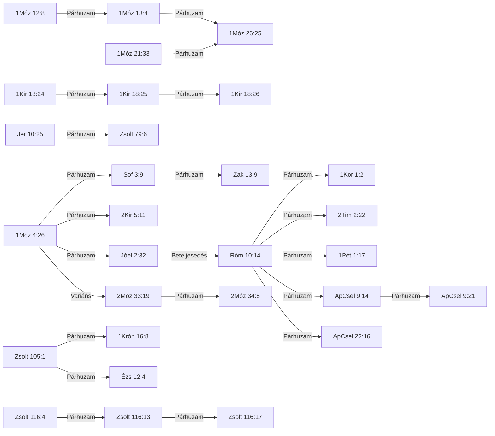

# 📖 ISTENTISZT-001 — Segítségül hívni az Úr nevét

## TUDOMÁNYOS REFERENCIA-VÁLTOZAT

*Vegyes fájl. A GENERÁLT-blokkok az `adat/` táblákból állnak elő (`python eszkozok/general.py --cel lexikon`), kézzel nem szerkeszthetők. A blokkokon kívüli szakaszok kézzel írandók; a generátor nem írja felül őket.*

## 0. Metaadatok

<!-- GENERÁLT-KEZDET: general.py --cel lexikon#ISTENTISZT-001#metaadat | forrás: adat/motivumok.tsv | licenc: projekt-adat | ts=2026-09-19 -->

*Ez a blokk a `[ID: ISTENTISZT-001]` motívum törzsadatait fedi a `motivumok.tsv`-ből.*

| Mező | Érték |
|---|---|
| ID | `ISTENTISZT-001` |
| Rövid UI-címke | Névbe vetett segítségülhívás |
| Teljes cím | Segítségül hívni az Úr nevét |
| Téma | Pneumatológia/istentisztelet |
| PaRDeS-szint | Drash |
| Státusz | publikálható (`v2`, 2026.09.09) |
| Azonosság típusa | formulaikus |
| Negatív kritérium | az igehelynek a קָרָא + בְּ (aktív, invokáló szerkezet: "[valaki] hívja segítségül [Isten nevét]") mintát kell mutatnia — a passzív נִקְרָא...עַל szerkezet (birtoklás/hovatartozás kifejezése, nem invokáció) kizárja a besorolást, még akkor is, ha ugyanazt a két gyököt használja (l. D-minta, 2Sám 6:2, Jer 7:10-14, 5Móz 28:10, ÚSZ-párja Zsid 11:16) |
| Fölérendelt fogalom | istentisztelet/imádság általában (bármely invokációs forma, a קָרָא בְשֵׁם formulán kívül) |
| Forrás-study | `tematikus_lezart/Segitsegul_hivni_az_Urat_tematikus.md` `motivumlog/lexikon_pilot/ISTENTISZT-001_TUDOMANYOS.md` |
| Kereszthivatkozás-napló | `tematikus_lezart/naplok/Segitsegul_hivni_az_Urat_kereszthivatkozas_naplo.md` |
| Sablon-megfelelőség | v12 |

<!-- GENERÁLT-VÉGE: lexikon#ISTENTISZT-001#metaadat -->

## 1. Előfordulások

<!-- GENERÁLT-KEZDET: general.py --cel lexikon#ISTENTISZT-001#elofordulasok | forrás: adat/elofordulasok.tsv | licenc: projekt-adat | ts=2026-09-19 -->

*Ez a blokk a `[ID: ISTENTISZT-001]` motívum 29 igehely-sorát fedi az `elofordulasok.tsv`-ből, kanonikus sorrendben, ebből 22 lexikon-jelentéssel.*

| Igehely | Kapcsolódás | PaRDeS-szint | Funkció | Strong-szám(ok) | Lexikon-jelentés |
|---|---|---|---|---|---|
| 1Móz 4:26 | A formula első előfordulása — Séth fia, Énós nemzedéke; a Kain-vonal önerős civilizációépítése utáni korszakváltás jele. | Drash | 🌱 alap-előfordulás — a motívum legelső megjelenése a kánonban, minden későbbi eset erre vezethető vissza | H7121+H8034 | BDB H7121 2.c — invokálni, segítségül hívni |
| 1Móz 12:8 | Ábrám, Bétel-Ai között — oltárépítés + segítségül hívás első összekapcsolása. | Drash | 🔁 ismétlődés — a formula második, még nem rögzült szokásként ismétlődő megjelenése | H7121+H8034 | BDB H7121 2.c — invokálni, segítségül hívni |
| 1Móz 13:4 | Ábrám visszatér ugyanahhoz az oltárhoz Egyiptomból; a formula tudatos, felkeresett szokássá válik. | Drash | ⭐ küszöb-előfordulás — a 3. genezisi eset, ami miatt a motívum elérte az önálló tematikus feldolgozáshoz szükséges gyakoriságot | H7121+H8034 | BDB H7121 2.c — invokálni, segítségül hívni |
| 1Móz 21:33 | Ábrahám, Beérseba — a formula kiegészül egy isteni jelzővel: אֵל עוֹלָם, "örökkévaló Isten". | — | ➕ bővülés — a formula első alkalommal egészül ki isteni jelzővel, új teológiai tartalmat hordozva | H7121+H8034 | BDB H7121 2.c — invokálni, segítségül hívni |
| 1Móz 26:25 | Izsák, Beérseba — a minta szó szerint átöröklődik a második pátriárka-nemzedékre, ugyanazon a helyszínen. | — | 👨‍👦 öröklés — a gyakorlat generációk között, tudatos folytonossággal adódik át | H7121+H8034 | BDB H7121 2.c — invokálni, segítségül hívni |
| 2Móz 33:19 | Isten maga jelenti ki Mózesnek: "kihirdetem előtted az Úr nevét" — nem az ember hívja segítségül Isten nevét, hanem Isten mondja ki a sajátját. | Remez | ❓ be nem sorolható — a szereplők szerepe felcserélődik, egyik meglévő kategóriába sem illik tisztán (A/B/C tipológia, B-eset) | H7121+H8034 | BDB H7121 3 — kihirdetni, kinyilatkoztatni (NEM invokáció) |
| 2Móz 34:5 | Ugyanaz a jelenet folytatása: "az Úr nevében kiáltott" — Isten végrehajtja az előző fejezetben megígért önkihirdetést. | Remez | ❓ be nem sorolható — a szereplők szerepe felcserélődik, egyik meglévő kategóriába sem illik tisztán (A/B/C tipológia, B-eset) | H7121+H8034 | BDB H7121 3 — kihirdetni, kinyilatkoztatni (NEM invokáció) |
| 1Kir 18:24 | Illés a Kármelen: "ti a ti isteneitek nevét hívjátok, és én segítségül hívom az Úr nevét" — nyilvános, versengő kontextus, a kontraszt magán a versen belül. | Remez | ⚔️ nyilvános versengés — a formula először jelenik meg nyilvános, két isten közötti próbatételi kontextusban | H7121+H8034 | BDB H7121 2.c — Jahve nevével, konkrét felszólítás hatalma megmutatására |
| 1Kir 18:25 | A Baál-próféták felszólítása: "hívjátok segítségül a ti istenetek nevét". | Remez | ⚔️ nyilvános versengés (folytatás) — a próbatétel gyakorlati végrehajtása | H7121+H8034 | BDB H7121 2.c — Baál nevével |
| 1Kir 18:26 | A Baál-próféták ismétlődő, sikertelen invokációja — a formula kudarca a kontraszt kiteljesedése. | Remez | ⚔️ nyilvános versengés (folytatás) — a próbatétel kudarca | H7121+H8034 | BDB H7121 2.c — Baál nevével |
| 2Kir 5:11 | Naámán elvárása Elizeus felől — a formula ismertsége a nem-izraeli szereplő szájában is. | Remez | 🔁 ismétlődés, kívülálló szemszögéből | H7121+H8034 | BDB H7121 2.c — invokálni, segítségül hívni |
| 1Krón 16:8 | A Zsolt 105:1 szinte szó szerinti megismétlése a frigyláda Sátor elé állításának liturgiájában. | Remez | ⇄ párhuzam — formulai/liturgikus örökség a genezisi hagyományból, nem narratív folytonosság | H7121+H8034 | BDB H7121 2.c — invokálni, segítségül hívni |
| Zsolt 79:6 | A Jer 10:25 szinte szó szerinti párhuzama, azonos vádló szerkezettel. | Remez | ⇄🚫 párhuzam, tagadó forma — a formula elmulasztása mint vád, fordított szórenddel | H7121+H8034 | BDB H7121 2.c (tagadva) — invokálni — tagadó szerkezetben, a mulasztás vádjaként |
| Zsolt 105:1 | "Hívjátok segítségül az ő nevét, hirdessétek a népek közt az ő cselekedeteit" — a genezisi hagyományból örökölt formula önálló, liturgikus felhasználása, nem a történetszál narratív folytatása. | Remez | ⇄ párhuzam — formulai/liturgikus örökség a genezisi hagyományból, nem narratív folytonosság | H7121+H8034 | BDB H7121 2.c — invokálni, segítségül hívni |
| Zsolt 116:4 | A zsoltáros saját, személyes hála-könyörgésének első megfogalmazása: "segítségül hívom az Úr nevét". | Remez | 🔁 ismétlődés, személyes könyörgésben | H7121+H8034 | BDB H7121 2.c — invokálni, segítségül hívni |
| Zsolt 116:13 | A formula második, szó szerinti megismétlése ugyanabban a zsoltárban, a "szabadulás poharának" felemelése kontextusában. | Remez | 🔁 ismétlődés, személyes könyörgésben | H7121+H8034 | BDB H7121 2.c — invokálni, segítségül hívni |
| Zsolt 116:17 | A formula harmadik megismétlése, hála-áldozat felajánlása kontextusában. | Remez | 🔁 ismétlődés, személyes könyörgésben | H7121+H8034 | BDB H7121 2.c — invokálni, segítségül hívni |
| Ézs 12:4 | Szó szerint majdnem azonos a Zsolt 105:1-gyel, eszkatológiai hálaének kontextusban. | Remez | ⇄ párhuzam — formulai/liturgikus örökség a genezisi hagyományból, nem narratív folytonosság | H7121+H8034 | BDB H7121 2.c — invokálni, segítségül hívni |
| Jer 10:25 | "…a nemzetségekre, akik a Te nevedet nem hívják segítségül" — a formula tagadó, vádló formában, fordított szórenddel. | Remez | ⇄🚫 párhuzam, tagadó forma — a formula elmulasztása mint vád, fordított szórenddel | H7121+H8034 | BDB H7121 2.c (tagadva) — invokálni — tagadó szerkezetben, a mulasztás vádjaként |
| Jóel 2:32 | Az ószövetségi megfogalmazás csúcspontja: "mindaz, aki segítségül hívja az Úr nevét, megmenekül" — ezt Péter (ApCsel 2:21) és Pál (Róm 10:13) is szó szerint idézi. Károli-számozás: Jóel 3:5. | Remez | 🎯 előkép/beteljesedés — az ÓSZ-i ígéret, amit az ÚSZ tételesen, szó szerint idéz | H7121+H8034 | BDB H7121 2.c — invokálni, segítségül hívni |
| Sof 3:9 | Eszkatológiai ígéret — a népek megtisztított ajka egy akarattal hívja segítségül az Urat. | Remez | 🔮 eszkatológiai kitekintés — a formula jövőbeli, univerzális beteljesedésének előrevetítése | H7121+H8034 | BDB H7121 2.c (rokon) |
| Zak 13:9 | Sof 3:9 párja: a megtisztított maradék segítségül hívja Isten nevét, és Isten válaszol — kétirányú szövetségi megerősítés. | Remez | 🔮 eszkatológiai kitekintés (folytatás) — kétirányú szövetségi megerősítéssé bővíti az ígéretet | H7121+H8034 | BDB H7121 2.c |
| ApCsel 9:14 | "…mindazokat…, kik a te nevedet segítségül hívják" — Saul üldözési célpontjainak leírása, a korai keresztények azonosító megnevezése. | Remez | 🎯 előkép/beteljesedés (kiterjesztés) — a formula önálló egyházi azonosító-formulává válik | G1941 | — |
| ApCsel 9:21 | "…a kik ezt a nevet hívják segítségül" — az ApCsel 9:14-es leírás közvetlen megismétlése ugyanabban a fejezetben. | Remez | 🔁 ismétlődés — az ApCsel 9:14-es leírás közvetlen megismétlése | G1941 | — |
| ApCsel 22:16 | "…segítségül híván az Úrnak nevét" — Pál saját megtérés-elbeszélésében, a keresztséggel összekapcsolva. | Remez | 🎯 előkép/beteljesedés (kiterjesztés) — a formula önálló egyházi azonosító-formulává válik | G1941 | — |
| Róm 10:14 | Pál közvetlenül folytatja az érvelést: "Mimódon hívják segítségül, a kiben nem hittek?" — ugyanaz a görög ige, mint 10:13-nál. | Remez | 🎯 előkép/beteljesedés (folytatás) — Pál közvetlenül továbbviszi az érvelést ugyanabban a szakaszban | G1941 | — |
| 1Kor 1:2 | "…mindazokkal egybe, a kik a mi Urunk Jézus Krisztus nevét segítségül hívják bármely helyen" — a formula első explicit alkalmazása Krisztusra, a gyülekezet önmeghatározása. | Remez | 🎯 előkép/beteljesedés (kiterjesztés) — a formula önálló egyházi azonosító-formulává válik | G1941 | — |
| 2Tim 2:22 | "…azokkal egyetembe, a kik segítségül hívják az Urat tiszta szívből" — a segítségül hívás mint közösségválasztási kritérium. | Remez | 🎯 előkép/beteljesedés (kiterjesztés) — a formula önálló egyházi azonosító-formulává válik | G1941 | — |
| 1Pét 1:17 | "…ha Atyának hívjátok őt…" — az invokáció "Atya" megszólításra alkalmazva; a görög ige azonos, a Károli nem tartja meg a "segítségül" szót. | Remez | 🎯 előkép/beteljesedés (kiterjesztés) — a formula önálló egyházi azonosító-formulává válik | G1941 | — |

<!-- GENERÁLT-VÉGE: lexikon#ISTENTISZT-001#elofordulasok -->

## 1/b. PaRDeS keretrendszer *(kézi)*

**PaRDeS keretrendszer — a motívum egészére alkalmazva**

【NAPLO: a study saját 3. pontjából átvéve, a lexikon-kiegészítés (2-4. szakasz) fényében bővítve, 2026.09.07.】

**Mit jelent ez a négy szint?** A PaRDeS a zsidó bibliaértelmezés
négy hagyományos rétegének kezdőbetűiből áll össze — mindegyik más
kérdést tesz fel ugyanarról a szövegről:

- **Peshat** (פְּשָׁט, "egyszerű") — mit mond a szöveg a
  legközvetlenebb, szó szerinti értelmében? Mi történik a
  történetben, mit tesznek a szereplők?
- **Remez** (רֶמֶז, "utalás") — hová mutat ez a szöveg még? Milyen más
  bibliai helyekkel cseng össze, milyen nagyobb ívbe illeszkedik? Itt
  még csak a kapcsolat *felismerése* a cél, következtetés nélkül —
  azt már a következő szint vonja le.
- **Drash** (דְּרַשׁ, "keresés/magyarázat") — mit tanulhatunk ebből,
  mit kell tennünk vele? Ez a normatív, alkalmazó szint: erkölcsi
  vagy gyakorlati tanulság, amit a szöveg felkínál.
- **Sod** (סוֹד, "titok") — van-e ennek mélyebb, spirituális rétege?
  Ez a legfegyelmezettebb szint: csak akkor szólal meg, ha
  ténylegesen levezethető a szövegből, nem szabad, hogy találgatás
  vagy allegorizálás legyen.

**Peshat:** a genezisi öt előfordulás (4:26, 12:8, 13:4, 21:33, 26:25)
egyetlen, folytonos gyakorlatot ír le: a hívő ember Isten nevének
invokálásával fejezi ki függőségét és hódolatát — jellemzően egy
konkrét, helyhez kötött kultikus jelhez kapcsolva (oltárépítés 12:8,
13:4 és 26:25 esetén; fa ültetése 21:33-nál). A gyakorlat nem
egyszeri esemény, hanem nemzedékeken át öröklődő szokás (Ábrahám →
Izsák), amely konkrét földrajzi pontokhoz kötődik (Bétel-Ai,
Beérseba).

**Remez:** a minta a Séthita vonaltól a pátriárkákon át húzódik
tovább, a próféták nyilvános, versengő kontextusán (1Kir 18) és a
zsoltáros személyes könyörgésén (Zsolt 116) át egy eszkatológiai,
univerzális ígéretig (Sof 3:9, Zak 13:9; Jóel 3:5/2:32), amely
Pünkösdkor (ApCsel 2:21) és Pál evangéliumi érvelésében (Róm
10:13-14) nyeri el végső alkalmazását.

**Miért nem csak véletlen szóegyezés ez:**
amikor Péter és Pál görögül idézik a formulát, egy görög igét
használnak (ἐπικαλέομαι), aminek önmagában elég tág, általános
jelentése van — bárkit meg lehet vele "szólítani", akár egy pogány
istent is. Felmerülhetne tehát a kérdés: tényleg ugyanarról a
dologról van szó, mint a genezisi történetben, vagy csak egy tág
jelentésű szót választottak, ami történetesen illik ide?

A válasz most, hogy három egymástól teljesen független szótár
(a héber BDB, és két külön görög szótár, a TBESG és Thayer)
is elérhető, egyértelműbb, mint korábban volt. A Thayer
ugyanis **külön kategóriába** teszi azt az esetet, amikor ezt a görög
igét kifejezetten **egy héber kifejezés fordításaként** használják —
külön véve attól az esettől, amikor csak simán "hívnak/szólítanak"
valakit. Vagyis maga a szótár mondja ki: ez nem esetleges
szóhasználat, hanem tudatos fordítás egy már ismert héber mintára.

【NAPLO: a Thayer 2026.09.07-től vált ténylegesen elérhetővé (l. 8. szakasz — Nyitott kérdések) — előtte csak a BDB és a TBESG állt rendelkezésre.】

Ez azért erősebb bizonyíték, mint egyetlen forrásra támaszkodni:
három, egymástól független szótárkészítő, más korban, más módszerrel
dolgozva jutott ugyanarra a következtetésre. Egyetlen olvasat esetén
felmerülhetne, hogy a kapcsolat csak belelátás, nem valódi — de mivel
maguk a szótárak, egymástól függetlenül, külön kezelik ezt az esetet,
ez megerősíti a motívum valódiságát: Pál és Péter nem véletlenül
fogalmaznak úgy, mint a Genezis, hanem tudatosan ugyanazt a régi
mintát viszik tovább, csak már görögül.

**Drash:** a motívum azt tanítja, hogy az istentisztelet magja nem a
nyilvános teljesítmény vagy a rituálé pontossága, hanem a
**függőség tudatos, névvel azonosított kifejezése**. Ábrahám és
Izsák párhuzama azt is megmutatja, hogy ez a fajta istentisztelet
**taníthatóvá és örökölhetővé** válik.

*(Remez-szintű kiegészítés, l. 6. szakasz — Módszertani napló, A/B/C tipológia):* ugyanez a קָרָא+שֵׁם
szókapcsolat, felcserélt alany/tárgy-szereposztásban, Isten
önkinyilatkoztatását (2Móz 33:19/34:5) és Isten névadó tettét egy
emberen (Ézs 43:1, 44:5, 45:3) is kifejezheti — a motívum tehát nem
elszigetelt emberi gyakorlat, hanem egy tágabb, kölcsönös isteni-emberi
kommunikációs mintázat egyik pólusa.

【NAPLO: az A/B/C tipológiát a study 2026.09.07-én írta vissza.】

**Sod** *(fegyelmezetten, csak a fenti rétegekből levezetve)*: a
bűneset és Kain testvérgyilkossága utáni emberiség első dokumentált
lelki válasza nem az önmegváltás kísérlete, hanem a segítségül
hívás — a névbe vetett függőség beismerése, éles ellentétben a
Bábel-építőkkel, akik "nevet akarnak szerezni maguknak" (1Móz 11:4).
Ez tematikus, nem lexikai párhuzam. A réteg fegyelmezetten
változatlan marad.

【NAPLO: a lexikon-kiegészítés nem indokolt új Sod-szintű állítást.】

⚠️ *(a Rashi-vita itt is releváns: ha a 4:26 valójában a
bálványimádás kezdetét jelzi, a Sod-szintű "első pozitív lelki
válasz" olvasat módosulna — a projekt a többségi olvasatot követi, de
a vitát nem hallgatja el)*

## 2. Lexikon-szócikkek

<!-- GENERÁLT-KEZDET: general.py --cel lexikon#ISTENTISZT-001#szocikkek | forrás: adat/lexikon_hivatkozasok.tsv, konkordancia/OSHL_lexikalis_index.tsv, konkordancia/SDBH_domenek.tsv, konkordancia/SDGNT_domenek.tsv | licenc: CC BY 4.0, CC BY-SA 4.0, közkincs | ts=2026-09-19 -->

*Ez a blokk a `[ID: ISTENTISZT-001]` motívum 3 Strong-tokenjét fedi, van jelentés-hivatkozással a `lexikon_hivatkozasok.tsv`-ből.*

### G1941

**TWOT:** —

**Szemantikai domén:** 011002 Socio-Religious, 033009 Name, 033012 Ask For, Request, 056004 Judicial Hearing, Inquiry

#### TBESG G1941 — 1. jelentés

> to call, name, surname : with accusative (cl.), Mat.10:25; pass., Act.1:23 4:36 10:5, 18 10:22 11:13 12:12, 25 , Heb.11:16 ; τ. ὄνομα, before ἐπί (denoting possession, as Heb. עַל. . שֻׁם קָרָא), Act.15:17 (LXX), Jas.2:7 (see. CB on Amo.9:12 ).

**🇭🇺** **1.** *hívni, nevezni, elnevezni*: tárgyesettel (klasszikus göröngben), Mt 10:25; szenvedő szerkezetben, ApCsel 1:23, 4:36, 10:5,18,22, 11:13, 12:12,25, Zsid 11:16; "a nevet" ἐπί-vel (birtoklást jelölve, mint a héber עַל..שֻׁם קָרָא), ApCsel 15:17 (LXX), Jak 2:7.

*Forrás: konkordancia/TBESG.txt*

#### TBESG G1941 — 2. jelentés

> Mid. (so also act.; cl., LXX), to call upon, invoke, appeal to (θεόν, θεούς, Hdt., Xen., al.; cf. Deiss., LAE , 426): Καίσαρα (Σεβαστόν, Act.25:25 ), Act.25:11-12, 21 26:32 28:19 ; sc. τ. Κύριον Ἰησοῦν, Act.7:59; μάρτυρα (cl.) τ. θεόν, 2Co.1:23; πατέρα, 1Pe.1:17; τ. κύριον, Rom.10:12 , 2Ti.2:22 ; τ. ὄνομα κυρίου (μου, σου; like Heb. יְהוָֹה שֻׁם קָרָא), Act.2:21 (LXX) Act.9:14, 21 22:16 , Rom.10:13-14 " (LXX) 1Co.1:2 (Cremer, 335, 742).† (AS)

**🇭🇺** **2. Közép alakban (de aktívban is; klasszikus göröngben és LXX-ben): *segítségül hívni, invokálni, folyamodni*** (istenhez/istenekhez): a császárhoz (fellebbezve), ApCsel 25:11-12,21, 26:32, 28:19; "az Úr Jézust", ApCsel 7:59; tanúul hívni az Istent, 2Kor 1:23; "Atyát", 1Pét 1:17; "az Urat", Róm 10:12, 2Tim 2:22; **"az Úr nevét" (enyémet/tiédet) — pontosan úgy, mint a héber יְהוָֹה שֻׁם קָרָא — ApCsel 2:21 (LXX-idézet), ApCsel 9:14,21, 22:16, Róm 10:13-14 (LXX-idézet), 1Kor 1:2.**

*Forrás: konkordancia/TBESG.txt*

### H7121

**TWOT:** 2063

**Szemantikai domén:** 002001002012 Great, 002002001012 Move, 002002001016 Search, 002002001017 Space, 002002003003 Happen, 002003002002 Associate, 002003002009 Dissociate, 002003002015 Meet, 002003002022 Serve, 002003003011 Engage, 002004001009005 Shout, 002004002007 Know, 002004002010 Name

#### BDB H7121 — 2.c. jelentés

> c. ׳ק י ׳בְּשֵׁם call with name of ׳י (i.e. use it in invocation): Gen 4:26; 12:8; 2Kin 5:11; Jer 10:25 = Psa 79:6 16t. (1Kin 18:24 of specific appeal to ׳י to display his power), + Isa 65:1 (see Pu`al); with name of Baal 1Kin 18:24-25, 26.

**🇭🇺** *"hívni Jahve nevével" (azaz segítségül hívni, invokálni)*: 1Móz 4:26; 12:8; 2Kir 5:11; Jer 10:25 = Zsolt 79:6, és további 16 előfordulás (1Kir 18:24-nél kifejezetten arra a konkrét felszólításra vonatkozik, hogy Jahve mutassa meg hatalmát), valamint Ézs 65:1 (l. szenvedő alak); Baál nevével: 1Kir 18:24-25, 26.

*Forrás: konkordancia/BDB_teljes_unabridged.tsv*

#### BDB H7121 — 3. jelentés

> 3 proclaim: a. with accusative of thing procl. Amos 4:5; Gen 41:43; Deut 15:2; Jer 31:6; Lev 25:10 +; ׳ק צוֺם proclaim a fast 1Kin 21:9, 12; Jer 36:9 +, ׳ק י ׳מוֺעֲדֵי Lev 23:2, 4; ׳ק followed by oratio recta [direct speech] Exod 34:6, etc.; followed by ל person Jer 34:8, 15, 17 (twice in verse); Isa 61:1, עַל person (against, concerning) 1Kin 13:4, 32; Jer 49:29; Lam 1:15; proclaim peace to (ל person) Judg 21:13; compare ׳ק לְשָׁלוֺם אֵלֶיהָ Deut 20:10; ׳ק with accusative of congnate meaning with verb מִקְרָא Isa 1:13, הַקְּרִיאָה Jonah 3:2 (+ אֶל).

Fordítás nincs (a `forditas_hu` üres).

*Forrás: konkordancia/BDB_teljes_unabridged.tsv*

### H8034

**TWOT:** 2405

**Szemantikai domén:** 002003002007 Control, 002004002007 Know, 002004002010 Name, 003001007 Names of People, 003001016 Self

Nincs jelentés-hivatkozás a `lexikon_hivatkozasok.tsv`-ben.

<!-- GENERÁLT-VÉGE: lexikon#ISTENTISZT-001#szocikkek -->

### Miért fontos ez a lelet *(kézi)*

#### G1941

**Miért fontos ez a lelet:** a Thayer **explicit** szétválasztja a "héberies" (Hebraistically) 5. jelentésárnyalatot a sima 4. "invokálni" jelentésárnyalattól — ez egy **harmadik, tőlünk teljesen független forrás** (BDB és Abbott-Smith után), ami megerősíti, hogy a mi motívumunk nem csupán "invokáció általában", hanem egy **specifikusan héber eredetű, azonosított nyelvi mintázat**, amit a görög fordítói/kommentár-hagyomány is külön kategóriaként kezel.

#### G0994

*(Megjegyzés: a G0994-hez a 2. szakaszban jelenleg nincs generált lexikon-szócikk.)*

**Miért fontos ez a lelet:** a Thayer megerősíti az Abbott-Smith szinonima-magyarázatát (βοάω ≠ ἐπικαλέομαι, más érzelmi regiszter), és pontosítja, hogy az Ézs 12:4-nél használt fordítói döntés (βοάω) illeszkedik a βοάω tipikus LXX-forrásaihoz (Ézs 40:3, Ézs 54:1 — mindkettő Ézsaiás-részlet, ahogy a mi versünk is!) — vagyis a fordító **stílusregiszterben és forráskönyvben is konzisztens** választást tett, nem véletlenszerű eltérést az ἐπικαλέομαι-tól.

#### Kiemelt módszertani jelentőség

**Kiemelt módszertani jelentőség:** mindhárom ige SECE-listája tartalmazza a קָרָא-t (kiemelve) mint egyik lehetséges héber forrását — ez **független megerősítés** arra, amit a mai LXX-audit talált: a קָרָא fordítása mindhárom göröggel (ἐπικαλέομαι, καλέω, βοάω) **általánosan bevett, dokumentált gyakorlat** volt, nem a mi két "kivételes" versünkre (2Móz 33:19/34:5; Ézs 12:4) jellemző egyedi eset. A Louw-Nida domain-számok egy teljesen új, **jelentés szerinti** keresési dimenziót nyitnak meg a jövőre nézve — a jelenlegi Strong-szám-alapú módszertan csak azonos-gyökű szavakat talál meg, a Louw-Nida-alapú keresés viszont *azonos jelentésmezőbe* tartozó, eltérő gyökű szavakat is felszínre hozhatna.

## 3. LXX-híd — nyers adat

<!-- GENERÁLT-KEZDET: general.py --cel lexikon#ISTENTISZT-001#lxx | forrás: konkordancia/LXX_kivonat_Exodus.tsv, konkordancia/LXX_kivonat_Ezsaias.tsv, konkordancia/LXX_kivonat_Genezis.tsv, konkordancia/LXX_kivonat_Jeremias.tsv, konkordancia/LXX_kivonat_Joel.tsv, konkordancia/LXX_kivonat_Kiralyok_1.tsv, konkordancia/LXX_kivonat_Kiralyok_2.tsv, konkordancia/LXX_kivonat_Kronikak_1.tsv, konkordancia/LXX_kivonat_Sofonias.tsv, konkordancia/LXX_kivonat_Zakarias.tsv, konkordancia/LXX_kivonat_Zsoltarok.tsv | licenc: tisztazatlan | ts=2026-09-19 -->

*Ez a blokk a `[ID: ISTENTISZT-001]` motívum 1 görög Strong-tokenjét keresi 22 ÓSZ igehelyen az LXX-kivonatban, és 13 találatot ad.*

| Igehely | Görög szóalak | Morfológiai kód | Strong | Forrás-jelzés |
|---|---|---|---|---|
| 1Móz 4:26 | επικαλεισθαι | V-PMN | G1941 | ABP-potolt |
| 1Móz 12:8 | επεκαλεσατο | V-AMI-3S | G1941 | ABP-potolt |
| 1Móz 13:4 | επεκαλεσατο | V-AMI-3S | G1941 | ABP-potolt |
| 1Móz 21:33 | επεκαλεσατο | V-AMI-3S | G1941 | ABP-potolt |
| 1Móz 26:25 | επεκαλεσατο | V-AMI-3S | G1941 | ABP-potolt |
| 1Kir 18:24 | επικαλεσομαι | V-FMI-1S | G1941 | ABP-potolt |
| 1Kir 18:25 | επικαλεσασθε | V-AMD-2P | G1941 | ABP-potolt |
| 1Kir 18:26 | επεκαλουντο | V-IMI-3P | G1941 | ABP-potolt |
| 2Kir 5:11 | επικαλεσεται | V-FMI-3S | G1941 | ABP-potolt |
| Zsolt 116:4 | επεκαλεσαμην | V-AMI-1S | G1941 | ABP-potolt |
| Zsolt 116:13 | επικαλεσομαι | V-FMI-1S | G1941 | ABP-potolt |
| Jóel 2:32 | επικαλεσηται | V-AMS-3S | G1941 | ABP-potolt |
| Zsolt 105:1 | επικαλεισθε | V-PMD-2P | G1941 | ABP-potolt |

<!-- GENERÁLT-VÉGE: lexikon#ISTENTISZT-001#lxx -->

## 4. TSK és Károli-KH — nyers eredmény

<!-- GENERÁLT-KEZDET: general.py --cel lexikon#ISTENTISZT-001#tsk_kh | forrás: konkordancia/TSK_kereszthivatkozasok.tsv, konkordancia/Karoli_kereszthivatkozasok.tsv | licenc: CC BY 4.0, közkincs | ts=2026-09-19 -->

*Ez a blokk a `[ID: ISTENTISZT-001]` motívum 29 igehelyét veti össze a TSK (Votes ≥ 15) és a Károli-KH táblával; 20 igehely ad legalább egy találatot (93 találat összesen), 0 igehely versenkénti kereséssel nem vizsgálható.*

#### 1Móz 13:4
- Károli-KH: 1Móz 12,8

#### 2Móz 33:19
- Károli-KH: Róm 9,15

#### 2Móz 34:5
- Károli-KH: 2Móz 33,19

#### 1Krón 16:8
- TSK: Zsolt 105,1 (Votes: 22)
- TSK: Zsolt 105,15 (Votes: 22)
- TSK: Ézs 12,4 (Votes: 18)
- Károli-KH: Ésa 12,4-5

#### Zsolt 79:6
- Károli-KH: Jer 10,25

#### Zsolt 105:1
- TSK: Ézs 12,4 (Votes: 24)
- Károli-KH: Zsolt 47,2-4
- Károli-KH: 1Krón 16,8-10

#### Zsolt 116:13
- Károli-KH: Róm 3,13
- Károli-KH: Jak 3,8

#### Zsolt 116:17
- Károli-KH: 2Sám 7,9

#### Ézs 12:4
- Károli-KH: Zsolt 66,1-5
- Károli-KH: Zsolt 118,1
- Károli-KH: Zsolt 106,1
- Károli-KH: 1Krón 16,8-10

#### Jer 10:25
- Károli-KH: Zsolt 79,6

#### Jóel 2:32
- TSK: Róm 10,11 (Votes: 19)
- TSK: Róm 10,14 (Votes: 19)
- Károli-KH: Róm 10,13

#### Sof 3:9
- Károli-KH: Zsolt 113,3
- Károli-KH: Zsolt 114,2

#### Zak 13:9
- TSK: Zsolt 50,15 (Votes: 130)
- TSK: Jer 29,11 (Votes: 113)
- TSK: Jer 29,12 (Votes: 113)
- TSK: ApCsel 2,21 (Votes: 83)
- TSK: Ézs 65,23 (Votes: 69)
- TSK: Ézs 65,24 (Votes: 69)
- TSK: Ézs 48,10 (Votes: 66)
- TSK: 1Pét 1,6 (Votes: 60)
- TSK: 1Pét 1,7 (Votes: 60)
- TSK: Zsolt 34,15 (Votes: 59)
- TSK: Zsolt 34,19 (Votes: 59)
- TSK: Zsolt 91,15 (Votes: 58)
- TSK: Jel 21,7 (Votes: 42)
- TSK: 1Pét 4,12 (Votes: 42)
- TSK: Jer 30,22 (Votes: 41)
- TSK: Ézs 43,2 (Votes: 38)
- TSK: Jak 1,12 (Votes: 37)
- TSK: 5Móz 26,17 (Votes: 30)
- TSK: 5Móz 26,19 (Votes: 30)
- TSK: Zsolt 66,10 (Votes: 28)
- TSK: Zsolt 66,12 (Votes: 28)
- TSK: Hós 2,21 (Votes: 27)
- TSK: Hós 2,23 (Votes: 27)
- TSK: Zak 10,6 (Votes: 25)
- TSK: Mal 3,2 (Votes: 24)
- TSK: Mal 3,3 (Votes: 24)
- TSK: Zsid 8,10 (Votes: 22)
- TSK: Jób 23,10 (Votes: 22)
- TSK: Zak 8,8 (Votes: 19)
- TSK: Ézs 58,9 (Votes: 19)
- TSK: Mt 22,29 (Votes: 19)
- TSK: Mt 22,32 (Votes: 19)
- TSK: Jer 31,33 (Votes: 19)
- TSK: 3Móz 26,12 (Votes: 19)
- TSK: Róm 10,12 (Votes: 18)
- TSK: Róm 10,14 (Votes: 18)
- TSK: Péld 17,3 (Votes: 16)
- TSK: Zak 12,10 (Votes: 16)
- TSK: Zsolt 144,15 (Votes: 16)
- TSK: Jel 21,3 (Votes: 16)
- TSK: Jel 21,4 (Votes: 16)
- TSK: 1Kor 3,11 (Votes: 15)
- TSK: 1Kor 3,13 (Votes: 15)
- TSK: Ez 37,27 (Votes: 15)
- TSK: Jóel 2,32 (Votes: 15)
- TSK: Ez 36,28 (Votes: 15)
- Károli-KH: 1Pét 1,6-7

#### ApCsel 9:14
- Károli-KH: 1Sám 13,13-14
- Károli-KH: Zsolt 89,21-22

#### ApCsel 9:21
- Károli-KH: Gal 1,23

#### ApCsel 22:16
- TSK: ApCsel 2,38 (Votes: 15)
- Károli-KH: Jón 1,5

#### Róm 10:14
- TSK: Mk 16,15 (Votes: 23)
- TSK: Mk 16,16 (Votes: 23)
- Károli-KH: 1Móz 3,15

#### 1Kor 1:2
- Károli-KH: 1Kor 6,11

#### 2Tim 2:22
- TSK: 1Pét 2,11 (Votes: 37)
- TSK: 1Pét 3,11 (Votes: 34)
- TSK: 1Kor 6,18 (Votes: 25)
- TSK: Zsolt 119,9 (Votes: 22)
- TSK: 1Tim 6,11 (Votes: 22)
- TSK: Zsid 12,14 (Votes: 19)
- TSK: 1Tim 4,12 (Votes: 18)
- Károli-KH: 1Kor 1,2

#### 1Pét 1:17
- TSK: ApCsel 10,34 (Votes: 20)
- TSK: ApCsel 10,35 (Votes: 20)
- Károli-KH: Gal 4,6
- Károli-KH: Róm 2,6-11
- Károli-KH: Zsid 12,28

<!-- GENERÁLT-VÉGE: lexikon#ISTENTISZT-001#tsk_kh -->

### Minősítés *(kézi)*

**TSK (Votes ≥ 15 szűréssel), 21 igehelyre lefuttatva — eredmény:** ⚠ ELTÉRÉS: a generált 4. szakasz jelenleg 29 igehelyet vet össze (a 2026.09.09-i 7-soros bővítés miatt); ez a minősítés a pilot 2026.09.06-i, még 21 igehelyes állapotára vonatkozik.

- Zsolt 105:1 ↔ Ézs 12:4 (Votes 24) — **független megerősítés**
- 1Krón 16:8 ↔ Ézs 12:4 (Votes 18), 1Krón 16:8 ↔ Zsolt 105:1 (Votes 22) — **független megerősítés**
- 1Krón 16:8 → Zsolt 105:15 (Votes 22) — ellenőrizve, tartalmilag NEM releváns (a próféták érintetlenségéről szól, ugyanabban a zsoltárban)
- **Jóel 2:32 → Róm 10:14 (Votes 19) — ÚJ, VALÓDI TALÁLAT** (l. lent)
- Jóel 2:32 → Róm 10:11 (Votes 19) — ellenőrizve, nincs ἐπικαλέομαι/καλέω a versben, NEM releváns

**Károli-KH (szentiras.hu szerkesztői hálózat), 21 igehelyre lefuttatva:** ⚠ ELTÉRÉS: l. a fenti megjegyzés — a generált 4. szakasz 29 igehelyre fut.

- 1Móz 13:4 → 1Móz 12:8 — **független megerősítés**
- Zsolt 105:1 → 1Krón 16:8 — **független megerősítés**
- 1Krón 16:8 → Ézs 12:4 — **független megerősítés**
- Jer 10:25 ↔ Zsolt 79:6 (mindkét irányban) — **független megerősítés**
- 2Móz 34:5 → 2Móz 33:19 — **független megerősítés**
- Zsolt 116:13 → Róm 3:13, Jak 3:8; Zsolt 116:17 → 2Sám 7:9; Zep 3:9 → Zsolt 113:3, 114:2; Ézs 12:4 → Zsolt 66:1-5, 118:1, 106:1; 2Móz 33:19 → Róm 9:15 — mind ellenőrizve, egyik sem tartalmazza a H7121+H8034/ἐπικαλέομαι formulát, NEM relevánsak

**ÚJ IGEHELY: Róm 10:14** — *"Mimódon hívják tehát segítségül, a kiben
nem hittek? mimódon hisznek pedig abban, a ki felől nem hallottak?"*
— **ἐπικαλέσωνται** (*epikalészóntai*, G1941), ugyanaz az ige, mint a
már dokumentált 10:13-nál, Pál folytatólagos érvelésében ugyanabban a
szakaszban.
Funkció: ELŐKÉP/BETELJESEDÉS klaszter kiegészítése (retorikai, negatív
irányú megfogalmazásban — "hogyan hívnák segítségül, akiben nem
hisznek" — előfeltételezi és megerősíti a 10:13 pozitív állítását).

**A 2Móz 33:19/34:5 → Ézs 12:4 és a 9 emberi-invokációs igehely felé
továbbra sincs TSK-kereszthivatkozás** — megerősítve, ez a felismerés
saját, lexikai szintű megfigyelés marad (l. korábbi megállapítás).

## 5. Kapcsolatok

<!-- GENERÁLT-KEZDET: general.py --cel lexikon#ISTENTISZT-001#kapcsolatok | forrás: adat/kapcsolatok.tsv | licenc: projekt-adat | ts=2026-09-19 -->

*Ez a blokk a `[ID: ISTENTISZT-001]` motívum 23 kapcsolat-sorát fedi a `kapcsolatok.tsv`-ből, 29 igehely-csomóponttal.*

| Forrás | Cél | Típus | Funkció | Bizonyosság | PaRDeS-szint |
|---|---|---|---|---|---|
| 1Móz 4:26 | Sof 3:9 | Párhuzam | azonos szereposztás (ember hívja segítségül Isten nevét), más kánoni ponton | magas | Remez |
| 1Móz 4:26 | 2Kir 5:11 | Párhuzam | azonos szereposztás, parafrazált formában — nincs szó szerinti egyezés | közepes | Remez |
| 1Móz 4:26 | Jóel 2:32 | Párhuzam | azonos szereposztás, az ószövetségi megfogalmazás csúcspontjáig | magas | Remez |
| Jóel 2:32 | Róm 10:14 | Beteljesedés | szó szerinti LXX-idézés-lánc (2:32⇒Róm 10:13⇒10:14) | magas | Remez |
| Róm 10:14 | 1Kor 1:2 | Párhuzam | azonos görög ige (ἐπικαλέομαι), egyházi azonosító-formulává válás — nincs szó szerinti idézés | közepes | Remez |
| Róm 10:14 | 2Tim 2:22 | Párhuzam | azonos görög ige, egyházi azonosító-formulává válás | közepes | Remez |
| Róm 10:14 | 1Pét 1:17 | Párhuzam | azonos görög ige, egyházi azonosító-formulává válás | közepes | Remez |
| Róm 10:14 | ApCsel 9:14 | Párhuzam | azonos görög ige, üldözési kontextus | közepes | Remez |
| ApCsel 9:14 | ApCsel 9:21 | Párhuzam | szó szerinti megismétlés ugyanabban a fejezetben | magas | Remez |
| Róm 10:14 | ApCsel 22:16 | Párhuzam | azonos görög ige, megtérés-elbeszélés | közepes | Remez |
| 1Móz 4:26 | 2Móz 33:19 | Variáns | A/B/C tipológia B-esete — azonos szerkezet (קָרָא+שֵׁם), felcserélt alany/tárgy (Isten mondja ki a saját nevét) | magas | Remez |
| 2Móz 33:19 | 2Móz 34:5 | Párhuzam | ugyanaz a jelenet, ugyanaz a szereposztás (Isten önkinyilatkoztatása) | magas | Remez |
| 1Móz 12:8 | 1Móz 13:4 | Párhuzam | Ábrám explicit visszatér ugyanahhoz az oltárhoz | magas | Drash |
| 1Móz 13:4 | 1Móz 26:25 | Párhuzam | öröklés — azonos szereposztás nemzedékek közt, azonos helyszín (Beérseba) | magas | Drash |
| 1Móz 21:33 | 1Móz 26:25 | Párhuzam | öröklés — azonos szereposztás nemzedékek közt, azonos helyszín | magas | Drash |
| 1Kir 18:24 | 1Kir 18:25 | Párhuzam | egyazon pericope közvetlenül egymást követő versei | magas | Remez |
| 1Kir 18:25 | 1Kir 18:26 | Párhuzam | egyazon pericope közvetlenül egymást követő versei | magas | Remez |
| Zsolt 116:4 | Zsolt 116:13 | Párhuzam | egyazon zsoltáros, szó szerinti ismétlés | magas | Remez |
| Zsolt 116:13 | Zsolt 116:17 | Párhuzam | egyazon zsoltáros, szó szerinti ismétlés | magas | Remez |
| Zsolt 105:1 | 1Krón 16:8 | Párhuzam | csaknem szó szerint azonos szöveg (1Krón 16 a Zsolt 105/96/106 összeállítását idézi) | magas | Remez |
| Zsolt 105:1 | Ézs 12:4 | Párhuzam | szinte szó szerinti egyezés a formulában | magas | Remez |
| Jer 10:25 | Zsolt 79:6 | Párhuzam | csaknem szóról szóra azonos, tagadó forma; Károli-KH mindkét irányban megerősíti | magas | Remez |
| Sof 3:9 | Zak 13:9 | Párhuzam | azonos szereposztás, kétirányú megerősítéssel kiegészítve | magas | Remez |

<!-- GENERÁLT-VÉGE: lexikon#ISTENTISZT-001#kapcsolatok -->

### Alátámasztás *(kézi)*

*Minden sor: miért ez a funkció-címke, miért ez a bizonyossági szint.*

| Kapcsolat | Alátámasztás |
|---|---|
| 1Móz 4:26 → Sof 3:9 | Mindkettő explicit a formulát alkalmazza istentiszteleti kontextusban ("segítségül hívni az Úr nevét" / "segítségül hívják mindnyájan az Úr nevét") — közös, felismerhető hitvallási nyelvezet, nem csak tematikus rokonság. |
| 1Móz 4:26 → 2Kir 5:11 | Naámán nem szó szerint idézi a formulát, hanem parafrazálja ("segítségül hívja az Úr, az ő Istene nevét") — a tartalmi kapcsolat egyértelmű, de nincs szó szerinti szövegi egyezés, innen a Közepes (nem Magas) bizonyosság. |
| 1Móz 4:26 → Jóel 2:32 → ApCsel 2:21 / Róm 10:13 | Az ApCsel és a Róma-levél **szó szerint**, görögül idézi a LXX Jóel-szöveget (πᾶς ὃς ἂν ἐπικαλέσηται τὸ ὄνομα Κυρίου σωθήσεται) — ez verbális, nem csak tematikus idézés, innen a Magas bizonyosság mindkét NT-kapcsolatnál. ⚠ ELTÉRÉS: az ApCsel 2:21 és a Róm 10:13 nem szerepel a jelenlegi 29 igehelyes „Előfordulások" táblában (a generált 5. szakasz kapcsolat-gráfja Jóel 2:32-t közvetlenül Róm 10:14-hez köti, „Beteljesedés" típussal, nem ezen a két közbülső igehelyen át). |
| 1Móz 4:26 → 2Móz 33:19 | A lexikai kapocs (azonos H7121+H8034 pár) önmagában Magas bizonyosságú — de a BDB eltérő jelentés alá sorolja (2.c vs. 3.) és a LXX eltérő igét használ (ἐπικαλέομαι vs. καλέω), ezért a *funkcionális* besorolás marad nyitott, a *lexikai* kapcsolat bizonyossága nem. |
| 1Móz 12:8 → 1Móz 13:4 | A szöveg explicit jelzi: Ábrám "**visszatér** ugyanahhoz az oltárhoz" — azonos helyszín, azonos szereplő, közvetlen szövegi utalás, nem rekonstrukció. |
| 1Móz 13:4 → 1Móz 26:25 / 1Móz 21:33 → 1Móz 26:25 | Izsák explicit Ábrahám fia, ugyanazon a földrajzi ponton (Beérseba) cselekszik — a genealógiai és helyrajzi kapcsolat mindkét irányban a szövegből, nem következtetésből ered. |
| 1Kir 18:24 → 18:25 → 18:26 | Egyazon pericope (a Kármel-hegyi próbatétel) közvetlenül egymást követő versei — a narratív folytonosság szövegi tény, nem értelmezés. |
| Zsolt 116:4 → 116:13 → 116:17 | Egyazon zsoltár, egyazon beszélő (a zsoltáros) — a formula szó szerinti, azonos szövegű megismétlése ugyanabban a versben, háromszor. |
| Zsolt 105:1 → 1Krón 16:8 | A két szöveg **majdnem szó szerint azonos** — 1Krón 16 ismerten a Zsolt 105/96/106 összeállítását idézi a frigyláda Sátor elé helyezésekor; ez bibliakritikailag jól dokumentált szövegpárhuzam, nem feltételezés. |
| Zsolt 105:1 → Ézs 12:4 | Szinte szó szerinti egyezés a formulában, de nincs explicit idézési jelzés egyik szövegben sem — a Magas bizonyosság a szövegi hasonlóság mértékén alapul, nem irodalomkritikai konszenzuson a közvetlen függésről. |
| Jer 10:25 → Zsolt 79:6 | A két vers csaknem szóról szóra megegyezik (jól ismert, kommentárokban gyakran tárgyalt szövegpárhuzam a két könyv között) — a Magas bizonyosság indokolt. **2026.09.06: Károli-KH is megerősíti, mindkét irányban.** |
| Róm 10:13 → Róm 10:14 | Ugyanaz a görög ige (ἐπικαλέομαι), Pál közvetlenül folytatódó érvelésében ugyanabban a szakaszban — TSK-eredetű lelet, 2026.09.06. ⚠ ELTÉRÉS: l. fent, a Róm 10:13 nem szerepel önálló igehelyként a jelenlegi táblában. |
| Sof 3:9 → Zak 13:9 | Mindkettő explicit, egyértelműen eszkatológiai ígéretként fogalmazza meg a segítségül hívást; Zak 13:9 kétirányú szövetségi megerősítéssel egészíti ki (Isten is válaszol) — közös próféciai regiszter, innen a Magas bizonyosság. |
| Róm 10:14 → 1Kor 1:2 / 2Tim 2:22 / 1Pét 1:17 / ApCsel 9:14 / ApCsel 22:16 | Azonos görög ige (ἐπικαλέομαι/ἐπικαλεῖσθε), de nincs szó szerinti idézési kapcsolat a Jóel-lánchoz vagy egymáshoz — a kapcsolat lexikai (azonos G1941 szó, azonos jelentés-ág), nem verbális idézés, innen a Közepes (nem Magas) bizonyosság. |
| ApCsel 9:14 → ApCsel 9:21 | Ugyanaz a leírás, ugyanabban a fejezetben, néhány verssel később szó szerint megismételve ("kik ezt a nevet hívják segítségül") — Magas bizonyosság. |

*(A nyers, gépileg olvasható adat: `Motivum_kapcsolatok_PILOT.tsv`,
25 sor, oszlopok: Forrás-igehely | Cél-igehely | Motívum-ID | Típus |
Funkció | Bizonyosság | PaRDeS-szint. A 2026.09.09-i bővítéssel 7 új
sorral egészült ki.)*

【NAPLO: névütközés-figyelmeztetés — a TSV "Típus" oszlopa (LEXIKAI/
NARRATÍV/STRUKTURÁLIS/TEMATIKUS) egy MÁSIK, a kapcsolat jellegét leíró
tengely, nem azonos a fenti diagramban használt PaRDeS Típus-mezővel
(Előkép/Párhuzam/Beteljesedés/Kontraszt/Variáns). A TSV-ben jelenleg
nincs önálló oszlop a PaRDeS Típus-mezőre — ez nyitott kérdés marad.】

## 6. Módszertani napló *(kézi)*

### 8 ellenőrzési réteg összegzése

| # | Módszer | Eredmény |
|---|---|---|
| 1 | Nyers Strong-szám grep | 153 találat (túl zajos) |
| 2 | Kalibrált pozíció-alapú frázis-keresés | 9 ismert + 2Móz 33:19/34:5 |
| 3 | Hamis-negatív teszt (tág ablak) | 0 új, megerősítve |
| 4 | Anaforikus névmás-bővítés | 7 jelölt, 3 valódi + 4 hamis pozitív |
| 5 | TSK kereszthivatkozás | Ézs 12:4 |
| 6 | BDB szótári idézet-ellenőrzés | Jer 10:25 / Zsolt 79:6 |
| 7 | Kétirányú szórend-ellenőrzés, teljes ÓSZ | 0 új, megerősítve |
| 8 | Szisztematikus LXX-egyeztetés, mind a 17 versre | 15/17 ἐπικαλέομαι; 2 kivétel; 1 adathiba; 1 kinyerési hiány |

**Teljes indoklás:** l. a chat-munkamenet 2026.09.05-i naplója és a
`Segitsegul_hivni_az_Urat_kereszthivatkozas_naplo.md`.

### A "be nem sorolható" eset mögötti hármas tipológia (A/B/C)

【NAPLO: eredetileg lexikon-pilot-only megfigyelésként rögzítve, 2026.09.06. 2026.09.07-én a study PaRDeS-keretrendszer Drash-szakaszába visszaírva (l. 1/b. szakasz) — ez a szakasz itt a tipológia teljes, részletes kifejtését őrzi.】

Az elutasított jelöltek (Ézs 43:1, 44:5, 45:3
— "Isten néven szólít egy embert") és a "be nem sorolható" eset
(2Móz 33:19/34:5 — "Isten kihirdeti saját nevét") **együtt nézve nem
véletlen zaj, hanem egy koherens, háromtagú mintázat** részei. A
קָרָא + שֵׁם szerkezet ugyanazokkal a szavakkal, de szisztematikusan
variálódó alany/tárgy-szereposztással három, egymástól élesen
elkülönülő teológiai aktust fejez ki:

【NAPLO: a jelöltek eredeti elutasítása és a "be nem sorolható" besorolás a 2026.09.05-i audit eredménye; a hármas mintázat felismerése 2026.09.06-i.】

| Minta | Alany | Tárgy | Igehelyek | Eddigi kezelés |
|---|---|---|---|---|
| **A — fő motívum** | ember | Isten neve | a 15 emberi-invokációs eset (l. 1. pont) | ✅ a study fő tárgya |
| **B** | Isten | saját neve | 2Móz 33:19, 34:5 | "be nem sorolható" — l. 1. pont |
| **C** | Isten | ember neve | Ézs 43:1, 44:5, 45:3 | ❌ elutasítva, "hamis pozitív" |

⚠ ELTÉRÉS: a táblázat „15 emberi-invokációs eset" száma a pilot 2026.09.06-i, a 2026.09.09-i 7-soros bővítés előtti állapotára vonatkozik; a jelenlegi „Előfordulások" tábla 29 igehelyet tartalmaz, ebből 27 emberi-invokációs (a 2 „B"-mintás — 2Móz 33:19, 34:5 — nélkül).

**Miért fontos ez:** a "B" eset eddig elszigetelt anomáliaként szerepelt
a study-ban ("nem sorolható be a meglévő funkciók egyikébe sem"). A
"C" jelöltek pedig egyszerűen ki lettek zárva, mint a motívumhoz nem
tartozó zaj. Együtt nézve viszont kiderül: **mindhárom minta ugyanannak
a nyelvi szerkezetnek a szisztematikus variánsa**, nem esetleges
egybeesés — a "B" tehát nem a "be nem sorolható" kategóriába, hanem egy
**önálló, felismerhető harmadik mintázatba** tartozik, aminek a "C" is
tagja.

**Amit ez a felismerés NEM állít:**

- Nem állítja, hogy A/B/C motívum-szinten összetartozna (a study
  fókusza jogosan marad az A mintán) — csak azt, hogy a **lexikai
  szerkezet szintjén** van egy magasabb rendű, közös minta.
- Nem old meg semmit a KAPCSOLATOK-réteg funkció-készletében — a
  "be nem sorolható" címke a study-ban marad, amíg nincs döntés arról,
  hogy a lexikonban legyen-e egy negyedik, formális funkció-kategória
  (pl. "TIPOLÓGIAI VÁLTOZAT" vagy hasonló) erre a jelenségre.

**Nyitott kérdés a folytatáshoz:** érdemes-e ezt a hármas tipológiát
(A/B/C) saját, önálló megfigyelésként rögzíteni a
`Bibliai_Motivumlexikon_tervezesi_naplo.md`-ben, mint a KAPCSOLATOK-
réteg funkció-készletének egy általánosítható kiegészítését — nem csak
erre az egy motívumra, hanem elvi mintaként más "elhívás/megnevezés"
jellegű motívumoknál is alkalmazható módon?

【NAPLO: a fenti nyitott kérdés 2026.09.09-én megválaszolva — l.
`Bibliai_Motivumlexikon_tervezesi_naplo.md` KAPCSOLATOK Típus-mező v1
döntése: az A/B/C tipológia (szereplő-csere ugyanazon a szerkezeten
belül) a KAPCSOLATOK-réteg új **Variáns** kategóriájába tartozik.】

#### D — negyedik minta: נִקְרָא...עַל (birtoklás/hovatartozás), kizárva

A H7121+H8034 kombinált teljes-előfordulás scan
(`tematikus_lezart/Segitsegul_hivni_az_Urat_tematikus.md`, 2026.09.08-i
v2-bővítés) egy negyedik, nyelvtanilag élesen elkülönülő szerkezetet is
felszínre hozott: **נִקְרָא...עַל** (*nikrá...al*, "[egy név] hivatik ...
felette/rajta") — passzív nifal ige + עַל elöljárószó, szemben a fő
motívum aktív קָרָא + בְּ szerkezetével. Ez nem invokációt fejez ki, hanem
**birtoklást/hovatartozást**: "X az Ő nevéről neveztetik", azaz X
Istenhez tartozik, az Ő tulajdona. Példák: a frigyláda (2Sám 6:2, 1Krón
13:6), a jeruzsálemi templom (Jer 7:10-11,14,30), Izráel egésze (5Móz
28:10).

**Ez a motívumhoz NEM tartozik** — Q3-fegyelem: azonos két gyök, de
eltérő grammatikai forma (aktív vs. passzív), eltérő elöljárószó (בְּ
vs. עַל), és eltérő jelentés (invokáció vs. birtoklás). **ÚSZ-párja:**
Zsid 11:16 (ugyanez a D-minta, passzív "neveztetni" értelemben, G1941)
— emiatt explicit kizárva, annak ellenére, hogy Strong-szinten (G1941)
azonos szót használ, mint a fő motívum ÚSZ-i helyei.

**Kapcsolata az A/B/C tipológiához:** a D-minta ugyanannak a
קָרָא+שֵׁם szerkezetnek egy negyedik szisztematikus variánsa — de mivel
az alany itt nem személy (Isten vagy ember), hanem egy tárgy/hely/nép,
amire a név *rájuk mondatik*, ez nem simán illeszkedik az A/B/C sorba
(ahol mindhárom esetben egy invokáló/megnevező cselekvő és egy
megnevezett/invokált fél áll szemben); a D inkább egy ötödik dimenzió
(birtoklás-kifejezés), nem az A/B/C egyenes folytatása.

【NAPLO: felismerve és a study-ban explicit kizárva, 2026.09.08. Itt, a
lexikon-oldalon dokumentálva 2026.09.09-én, hogy egy jövőbeli kör
tévesen ne sorolja be a motívumba.】

## 7. ÚJ FELISMERÉS *(kézi, ha van)*

## 8. Nyitott kérdések és séma-korlátok *(kézi)*

1. **2Móz 33:19/34:5 funkcionális besorolása** — nem sorolható be a
   meglévő KAPCSOLATOK-funkciók egyikébe sem (l. 1. pont indoklása a
   tematikus study-ban). Javasolt felvétel a
   `Bibliai_Motivumlexikon_tervezesi_naplo.md`-be nyitott kérdésként.
2. **Egy versen belüli kontraszt (1Kir 18:24)** — a KAPCSOLATOK-séma
   (Forrás-igehely | Cél-igehely, mindig két igehely) nem tudja
   natívan ábrázolni.
3. **A görög oldal erősítése** — 5 dokumentált lehetőség
   (`konkordancia/Javasolt_gorog_oldal_erositese.md`). Ebből a
   "Thayer beszerzése" pont **2026.09.07-én ténylegesen megoldódott**:
   a teljes Thayer's Greek-English Lexicon SQLite-fájlban elérhetővé
   vált (5427 bejegyzés), és ebbe a pilot-oldalba be is építve (l. a
   `motivumlog/lexikon_pilot/ISTENTISZT-001_TUDOMANYOS.md` 4. szakasza
   — a szó szerinti szótári idézetek erre a lexikon-oldalra nem
   kerültek át, l. 2. szakasz "Miért fontos ez a lelet"). **A fájl
   repóba emelése még külön döntést igényel.**
4. ~~LXX-híd 2 adatminőségi hibája~~ — 2026.09.07-én lezárva: Zsolt
   116:4 téves G-címkéje javítva G1941-re; Zsolt 116:17 "hiánya"
   tévhitnek bizonyult — a görög LXX autentikusan nem fordítja le a
   vers második felét, a kivonat eleve helyes és teljes volt.

## 9. Források és licencek

<!-- GENERÁLT-KEZDET: general.py --cel lexikon#ISTENTISZT-001#forrasok | forrás: adat/elofordulasok.tsv, adat/kapcsolatok.tsv, adat/lexikon_hivatkozasok.tsv, adat/motivumok.tsv, konkordancia/Karoli_kereszthivatkozasok.tsv, konkordancia/LXX_kivonat_Exodus.tsv, konkordancia/LXX_kivonat_Ezsaias.tsv, konkordancia/LXX_kivonat_Genezis.tsv, konkordancia/LXX_kivonat_Jeremias.tsv, konkordancia/LXX_kivonat_Joel.tsv, konkordancia/LXX_kivonat_Kiralyok_1.tsv, konkordancia/LXX_kivonat_Kiralyok_2.tsv, konkordancia/LXX_kivonat_Kronikak_1.tsv, konkordancia/LXX_kivonat_Sofonias.tsv, konkordancia/LXX_kivonat_Zakarias.tsv, konkordancia/LXX_kivonat_Zsoltarok.tsv, konkordancia/OSHL_lexikalis_index.tsv, konkordancia/SDBH_domenek.tsv, konkordancia/SDGNT_domenek.tsv, konkordancia/TSK_kereszthivatkozasok.tsv | licenc: CC BY 4.0, CC BY-SA 4.0, közkincs, projekt-adat, tisztazatlan | ts=2026-09-19 -->

*Ez a blokk a `[ID: ISTENTISZT-001]` motívum lexikon-oldalán ténylegesen felhasznált forrásokat sorolja fel.*

| Forrás | Fájl | Licenc | Blokk |
|---|---|---|---|
| `elofordulasok.tsv` | `adat/elofordulasok.tsv` | projekt-adat | elofordulasok |
| `kapcsolatok.tsv` | `adat/kapcsolatok.tsv` | projekt-adat | kapcsolatok |
| `lexikon_hivatkozasok.tsv` | `adat/lexikon_hivatkozasok.tsv` | CC BY 4.0, közkincs | szocikkek |
| `motivumok.tsv` | `adat/motivumok.tsv` | projekt-adat | metaadat |
| `Karoli_kereszthivatkozasok.tsv` | `konkordancia/Karoli_kereszthivatkozasok.tsv` | közkincs | tsk_kh |
| `LXX_kivonat_Exodus.tsv` | `konkordancia/LXX_kivonat_Exodus.tsv` | tisztazatlan | lxx |
| `LXX_kivonat_Ezsaias.tsv` | `konkordancia/LXX_kivonat_Ezsaias.tsv` | tisztazatlan | lxx |
| `LXX_kivonat_Genezis.tsv` | `konkordancia/LXX_kivonat_Genezis.tsv` | tisztazatlan | lxx |
| `LXX_kivonat_Jeremias.tsv` | `konkordancia/LXX_kivonat_Jeremias.tsv` | tisztazatlan | lxx |
| `LXX_kivonat_Joel.tsv` | `konkordancia/LXX_kivonat_Joel.tsv` | tisztazatlan | lxx |
| `LXX_kivonat_Kiralyok_1.tsv` | `konkordancia/LXX_kivonat_Kiralyok_1.tsv` | tisztazatlan | lxx |
| `LXX_kivonat_Kiralyok_2.tsv` | `konkordancia/LXX_kivonat_Kiralyok_2.tsv` | tisztazatlan | lxx |
| `LXX_kivonat_Kronikak_1.tsv` | `konkordancia/LXX_kivonat_Kronikak_1.tsv` | tisztazatlan | lxx |
| `LXX_kivonat_Sofonias.tsv` | `konkordancia/LXX_kivonat_Sofonias.tsv` | tisztazatlan | lxx |
| `LXX_kivonat_Zakarias.tsv` | `konkordancia/LXX_kivonat_Zakarias.tsv` | tisztazatlan | lxx |
| `LXX_kivonat_Zsoltarok.tsv` | `konkordancia/LXX_kivonat_Zsoltarok.tsv` | tisztazatlan | lxx |
| `OSHL_lexikalis_index.tsv` | `konkordancia/OSHL_lexikalis_index.tsv` | CC BY 4.0 | szocikkek |
| `SDBH_domenek.tsv` | `konkordancia/SDBH_domenek.tsv` | CC BY-SA 4.0 | szocikkek |
| `SDGNT_domenek.tsv` | `konkordancia/SDGNT_domenek.tsv` | CC BY-SA 4.0 | szocikkek |
| `TSK_kereszthivatkozasok.tsv` | `konkordancia/TSK_kereszthivatkozasok.tsv` | CC BY 4.0 | tsk_kh |

<!-- GENERÁLT-VÉGE: lexikon#ISTENTISZT-001#forrasok -->
