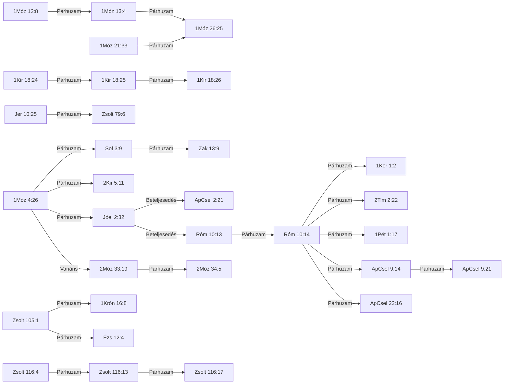

# 📖 ISTENTISZT-001 — Segítségül hívni az Úr nevét

## Kivonat *(kézi)*

A motívum az ószövetségi קָרָא בְּשֵׁם יְהוָה (kárá besém JHVH), „segítségül hívni az Úr nevét" formulát és újszövetségi folytatását követi: formulaikus azonosság, 32 igehelyen (22 ószövetségi, 10 újszövetségi). A formula az 1Móz 4:26-ban jelenik meg először, a pátriárkák oltárépítéséhez kötődik, majd a zsoltárokban és a prófétáknál liturgikus és eszkatológiai formává válik (Jóel 2:32). A Septuaginta a 22 ószövetségi helyből 18-at az ἐπικαλέω (epikaleó) igével ad vissza; eltér a két isteni önkihirdetésnél (2Móz 33:19; 34:5: καλέω, kaleó) és az Ézs 12:4-ben (βοάω, boaó), a Zsolt 116:17-ben pedig a tagmondat hiányzik a görögből. Az Újszövetség a Jóel 2:32-t szó szerint idézi (ApCsel 2:21; Róm 10:13), és a formulát Krisztusra alkalmazza: a „segítségül hívók" a korai gyülekezet önmegnevezésévé válnak (ApCsel 9:14, 21; 1Kor 1:2).

## Tartalomjegyzék

<!-- GENERÁLT-KEZDET: general.py --cel lexikon#ISTENTISZT-001#tartalom | forrás:  | licenc: projekt-adat | ts=2026-09-22 -->

*Ez a blokk a lexikon-oldal 12 szakaszának tartalomjegyzékét adja (LEXV2_2_BRIEF.md G1).*

- [Kivonat](#kivonat)
- [Jelmagyarázat és rövidítések](#jelmagyarázat-és-rövidítések)
- [1. Előfordulások](#1-előfordulások)
- [1/b. Kizárt és vizsgált helyek](#1b-kizárt-és-vizsgált-helyek)
- [2. Szótári háttér](#2-szótári-háttér)
- [3. LXX-fordítói döntések](#3-lxx-fordítói-döntések)
- [4. Kereszthivatkozások](#4-kereszthivatkozások)
- [5. Kapcsolatok](#5-kapcsolatok)
- [6. Értelmezés](#6-értelmezés)
- [7. Módszertan és nyitott kérdések](#7-módszertan-és-nyitott-kérdések)
- [8. Irodalom és idézés](#8-irodalom-és-idézés)
- [Kolofon](#kolofon)

<!-- GENERÁLT-VÉGE: lexikon#ISTENTISZT-001#tartalom -->

## Jelmagyarázat és rövidítések

<!-- GENERÁLT-KEZDET: general.py --cel lexikon#ISTENTISZT-001#jelmagyarazat | forrás:  | licenc: projekt-adat | ts=2026-09-22 -->

*Ez a blokk közös, minden lexikon-oldalon szó szerint azonos szöveg (G10).*

**PaRDeS-szintek** (`sablonok/PaRDeS_gyorsreferencia.md`):
- **Peshat** — a szöveg szerinti, szó szerinti értelem.
- **Remez** — csak felismerés/azonosítás, következtetés nélkül.
- **Drash** — normatív, következtető, alkalmazó.
- **Sod** — fegyelmezett, csak szövegből levezethető, gematria/allegorizálás nélkül.

**Funkció:** a vers szerepe a motívum ívében — az `adat/SEMA.md` szerint
szabad szöveg (nincs zárt értékkészlet), az alábbi táblákban a motívum
saját study-jából átvett megnevezéssel szerepel.

**Rövidítések:** BDB (Brown–Driver–Briggs), TBESH/TBESG (Tyndale Bible
Encyclopedia — Strong's Hebrew/Greek), Thayer (Thayer's Greek Lexicon),
UBS (UBS Dictionary of New Testament Greek — Louw–Nida szemantikai
doménekkel), L–N (Louw–Nida doménkód), SDBH/SDGNT (Semantic Dictionary
of Biblical Hebrew/Greek), OSHL (Open Scriptures Hebrew Lexicon), TWOT
(Theological Wordbook of the Old Testament — csak számhivatkozás), TSK
(Treasury of Scripture Knowledge), KH (Károli-kereszthivatkozás), LXX
(Septuaginta), MT (Masoretic Text), KJV (King James Version).

A szótári fordításokban a πνεῦμα (pneuma) mindig *szellem*, a ψυχή
(pszükhé) *lélek*; a Károli-idézetek szövege változatlan (pl. »Lélek«).

<!-- GENERÁLT-VÉGE: lexikon#ISTENTISZT-001#jelmagyarazat -->

## 1. Előfordulások

<!-- GENERÁLT-KEZDET: general.py --cel lexikon#ISTENTISZT-001#elofordulasok | forrás: adat/elofordulasok.tsv, konkordancia/Karoli_1908.tsv, konkordancia/UBS_DNTG_referenciak.tsv, konkordancia/UBS_DNTG_jelentesek.tsv, adat/forditas_ubs.tsv | licenc: projekt-adat, közkincs, CC BY-SA 4.0 | ts=2026-09-22 -->

*Ez a blokk a `[ID: ISTENTISZT-001]` motívum 32 igehely-sorát fedi az `elofordulasok.tsv`-ből, kanonikus sorrendben, a Károli-szöveggel (1/a) és az UBS-jelentés renderidejű hozzárendelésével (G3).*

| Igehely | Kulcsszó | Funkció | PaRDeS-szint | Strong | Szótári jelentés | UBS-jelentés | Megbízhatóság · azonosítás módja |
|---|---|---|---|---|---|---|---|
| [1Móz 4:26](#ige-1móz-4-26)[^1] | segítségül hívni az Úrnak nevét — קְרֹ֖א (k.Ro'); שֵׁ֥ם (Shem) | 🌱 alap-előfordulás — a motívum legelső megjelenése a kánonban, minden későbbi eset erre vezethető vissza | Drash | H7121+H8034 | BDB H7121 2.c — invokálni, segítségül hívni | — *(ÓSZ)* | magas · tartalom-alapú |
| [1Móz 12:8](#ige-1móz-12-8)[^2] | segítségűl hívá az Úr nevét — יִּקְרָ֖א (i.yik.Ra'); שֵׁ֥ם (Shem) | 🔁 ismétlődés — a formula második, még nem rögzült szokásként ismétlődő megjelenése | Drash | H7121+H8034 | BDB H7121 2.c — invokálni, segítségül hívni | — *(ÓSZ)* | magas · tartalom-alapú |
| [1Móz 13:4](#ige-1móz-13-4)[^3] | segítségűl hívá ott Ábrám az Úrnak nevét — יִּקְרָ֥א (i.yik.Ra'); שֵׁ֥ם (Shem) | ⭐ küszöb-előfordulás — a 3. genezisi eset, ami miatt a motívum elérte az önálló tematikus feldolgozáshoz szükséges gyakoriságot | Drash | H7121+H8034 | BDB H7121 2.c — invokálni, segítségül hívni | — *(ÓSZ)* | magas · tartalom-alapú |
| [1Móz 21:33](#ige-1móz-21-33)[^4] | segítségűl hívá ott az örökkévaló Úr Istennek nevét — יִּ֨קְרָא (i.Yik.ra'-); שֵׁ֥ם (Shem) | ➕ bővülés — a formula első alkalommal egészül ki isteni jelzővel, új teológiai tartalmat hordozva | — | H7121+H8034 | BDB H7121 2.c — invokálni, segítségül hívni | — *(ÓSZ)* | magas · tartalom-alapú |
| [1Móz 26:25](#ige-1móz-26-25)[^5] | segítségűl hívá az Úrnak nevét — יִּקְרָא֙ (i.yik.Ra'); שֵׁ֣ם (Shem) | 👨‍👦 öröklés — a gyakorlat generációk között, tudatos folytonossággal adódik át | — | H7121+H8034 | BDB H7121 2.c — invokálni, segítségül hívni | — *(ÓSZ)* | magas · tartalom-alapú |
| [2Móz 33:19](#ige-2móz-33-19)[^6] | kiáltom előtted az Úr nevét — קָרָ֧אתִֽי (ka.Ra.ti); שֵׁ֛ם (Shem) | ❓ be nem sorolható — a szereplők szerepe felcserélődik, egyik meglévő kategóriába sem illik tisztán (A/B/C tipológia, B-eset) | Remez | H7121+H8034 | BDB H7121 3 — kihirdetni, kinyilatkoztatni (NEM invokáció) | — *(ÓSZ)* | magas · tartalom-alapú |
| [2Móz 34:5](#ige-2móz-34-5)[^7] | nevén kiáltá az Urat — יִּקְרָ֥א (i.yik.Ra'); שֵׁ֖ם (Shem) | ❓ be nem sorolható — a szereplők szerepe felcserélődik, egyik meglévő kategóriába sem illik tisztán (A/B/C tipológia, B-eset) | Remez | H7121+H8034 | BDB H7121 3 — kihirdetni, kinyilatkoztatni (NEM invokáció) | — *(ÓSZ)* | magas · tartalom-alapú |
| [1Kir 18:24](#ige-1kir-18-24)[^8] | segítségül hívom az Úrnak nevét — אֶקְרָ֣א ('ek.Ra'); שֵׁם (shem-) | ⚔️ nyilvános versengés — a formula először jelenik meg nyilvános, két isten közötti próbatételi kontextusban | Remez | H7121+H8034 | BDB H7121 2.c — Jahve nevével, konkrét felszólítás hatalma megmutatására | — *(ÓSZ)* | magas · tartalom-alapú |
| [1Kir 18:25](#ige-1kir-18-25)[^9] | hívjátok segítségül a ti istenteknek nevét — קִרְאוּ֙ (kir.'U); שֵׁ֣ם (Shem) | ⚔️ nyilvános versengés (folytatás) — a próbatétel gyakorlati végrehajtása | Remez | H7121+H8034 | BDB H7121 2.c — Baál nevével | — *(ÓSZ)* | magas · tartalom-alapú |
| [1Kir 18:26](#ige-1kir-18-26)[^10] | segítségül hívák a Baálnak nevét — יִּקְרְא֣וּ (i.yik.re.'U); שֵׁם (shem-) | ⚔️ nyilvános versengés (folytatás) — a próbatétel kudarca | Remez | H7121+H8034 | BDB H7121 2.c — Baál nevével | — *(ÓSZ)* | magas · tartalom-alapú |
| [2Kir 5:11](#ige-2kir-5-11)[^11] | segítségül hívja az Úrnak, az ő Istenének nevét — קָרָא֙ (ka.Ra'); שֵׁם (shem-) | 🔁 ismétlődés, kívülálló szemszögéből | Remez | H7121+H8034 | BDB H7121 2.c — invokálni, segítségül hívni | — *(ÓSZ)* | magas · tartalom-alapú |
| [1Krón 16:8](#ige-1krón-16-8)[^12] | hívjátok segítségül az ő nevét — קִרְא֣וּ (kir.'U); שְׁמ֔ (sh.M) | ⇄ párhuzam — formulai/liturgikus örökség a genezisi hagyományból, nem narratív folytonosság | Remez | H7121+H8034 | BDB H7121 2.c — invokálni, segítségül hívni | — *(ÓSZ)* | magas · tartalom-alapú |
| [Zsolt 79:6](#ige-zsolt-79-6)[^13] | nem hívják segítségül a te nevedet — קָרָֽאוּ (ka.Ra.'u); שִׁמְ (shim.) | ⇄🚫 párhuzam, tagadó forma — a formula elmulasztása mint vád, fordított szórenddel | Remez | H7121+H8034 | BDB H7121 2.c (tagadva) — invokálni — tagadó szerkezetben, a mulasztás vádjaként | — *(ÓSZ)* | magas · tartalom-alapú |
| [Zsolt 105:1](#ige-zsolt-105-1)[^14] | hívjátok segítségül az ő nevét — קִרְא֣וּ (kir.'U); שְׁמ֑ (sh.M) | ⇄ párhuzam — formulai/liturgikus örökség a genezisi hagyományból, nem narratív folytonosság | Remez | H7121+H8034 | BDB H7121 2.c — invokálni, segítségül hívni | — *(ÓSZ)* | magas · tartalom-alapú |
| [Zsolt 116:4](#ige-zsolt-116-4)[^15] | az Úrnak nevét segítségül hívám — אֶקְרָ֑א ('ek.Ra'); שֵֽׁם (shem-) | 🔁 ismétlődés, személyes könyörgésben | Remez | H7121+H8034 | BDB H7121 2.c — invokálni, segítségül hívni | — *(ÓSZ)* | magas · tartalom-alapú |
| [Zsolt 116:13](#ige-zsolt-116-13)[^16] | az Úrnak nevét hívom segítségül — אֶקְרָֽא ('ek.Ra'); שֵׁ֖ם (Shem) | 🔁 ismétlődés, személyes könyörgésben | Remez | H7121+H8034 | BDB H7121 2.c — invokálni, segítségül hívni | — *(ÓSZ)* | magas · tartalom-alapú |
| [Zsolt 116:17](#ige-zsolt-116-17)[^17] | az Úr nevét hívom segítségül — אֶקְרָֽא ('ek.Ra'); שֵׁ֖ם (Shem) | 🔁 ismétlődés, személyes könyörgésben | Remez | H7121+H8034 | BDB H7121 2.c — invokálni, segítségül hívni | — *(ÓSZ)* | magas · tartalom-alapú |
| [Ézs 12:4](#ige-ézs-12-4)[^18] | magasztaljátok az Ő nevét — קִרְא֣וּ (kir.'U); שְׁמֽ (she.M) | ⇄ párhuzam — formulai/liturgikus örökség a genezisi hagyományból, nem narratív folytonosság | Remez | H7121+H8034 | BDB H7121 2.c — invokálni, segítségül hívni | — *(ÓSZ)* | közepes · tartalom-alapú |
| [Jer 10:25](#ige-jer-10-25)[^19] | nem hívják segítségül a te nevedet — קָרָ֑אוּ (ka.Ra.'u); שִׁמְ (shim.) | ⇄🚫 párhuzam, tagadó forma — a formula elmulasztása mint vád, fordított szórenddel | Remez | H7121+H8034 | BDB H7121 2.c (tagadva) — invokálni — tagadó szerkezetben, a mulasztás vádjaként | — *(ÓSZ)* | magas · tartalom-alapú |
| [Jóel 2:32](#ige-jóel-2-32)[^20] | az Úrnak nevét hívja segítségül — קֹרֵֽא (ko.Re'); שֵׁ֥ם (Shem) | 🎯 előkép/beteljesedés — az ÓSZ-i ígéret, amit az ÚSZ tételesen, szó szerint idéz | Remez | H7121+H8034 | BDB H7121 2.c — invokálni, segítségül hívni | — *(ÓSZ)* | magas · tartalom-alapú |
| [Sof 3:9](#ige-sof-3-9)[^21] | segítségül hívják az Úr nevét — קְרֹ֤א (k.Ro'); שֵׁ֣ם (Shem) | 🔮 eszkatológiai kitekintés — a formula jövőbeli, univerzális beteljesedésének előrevetítése | Remez | H7121+H8034 | BDB H7121 2.c (rokon) | — *(ÓSZ)* | magas · tartalom-alapú |
| [Zak 13:9](#ige-zak-13-9)[^22] | segítségül hívja ... nevemet — יִקְרָ֣א (yik.Ra'); שְׁמִ֗ (sh.M) | 🔮 eszkatológiai kitekintés (folytatás) — kétirányú szövetségi megerősítéssé bővíti az ígéretet | Remez | H7121+H8034 | BDB H7121 2.c | — *(ÓSZ)* | magas · tartalom-alapú |
| [ApCsel 2:21](#ige-apcsel-2-21)[^23] | az Úrnak nevét segítségül hívja — ἐπικαλέσηται (epikalesētai) | 🎯 előkép/beteljesedés (idézet) — az ÚSZ szó szerint idézi a Jóel 2:32-t | Remez | G1941 | TBESG G1941 2 — segítségül hívni, invokálni | 33.176 — valakit arra hívni, hogy tegyen valamit; rendszerint segítségkérést is magában foglal | magas · tartalom-alapú |
| [ApCsel 9:14](#ige-apcsel-9-14)[^24] | segítségül hívják — ἐπικαλουμένους (epikaloumenous) | 🎯 előkép/beteljesedés (kiterjesztés) — a formula önálló egyházi azonosító-formulává válik | Remez | G1941 | — | 11.28 — (idióma, szó szerint: valakinek a nevét valakire hívják) elismertnek lenni úgy, mint aki ahhoz tartozik, akinek a nevét rá hívták | magas · tartalom-alapú |
| [ApCsel 9:21](#ige-apcsel-9-21)[^25] | hívják segítségül — ἐπικαλουμένους (epikaloumenous) | 🔁 ismétlődés — az ApCsel 9:14-es leírás közvetlen megismétlése | Remez | G1941 | — | 33.131 — valakiről szólva megjelölést (címet, jelzőt) alkalmazni | magas · tartalom-alapú |
| [ApCsel 22:16](#ige-apcsel-22-16)[^26] | segítségül híván — ἐπικαλεσάμενος (epikalesamenos) | 🎯 előkép/beteljesedés (kiterjesztés) — a formula önálló egyházi azonosító-formulává válik | Remez | G1941 | — | 33.176 — valakit arra hívni, hogy tegyen valamit; rendszerint segítségkérést is magában foglal | magas · tartalom-alapú |
| [Róm 10:12](#ige-róm-10-12)[^27] | segítségül hívják — ἐπικαλουμένους (epikaloumenous) | 🎯 előkép/beteljesedés (bevezetés) — a 10:13 idézetét előkészítő egyetemes kiterjesztés | Remez | G1941 | TBESG G1941 2 — segítségül hívni, invokálni | 33.176 — valakit arra hívni, hogy tegyen valamit; rendszerint segítségkérést is magában foglal | magas · tartalom-alapú |
| [Róm 10:13](#ige-róm-10-13)[^28] | segítségül hívja az Úr nevét — ἐπικαλέσηται (epikalesētai) | 🎯 előkép/beteljesedés (idézet) — az ÚSZ szó szerint idézi a Jóel 2:32-t | Remez | G1941 | TBESG G1941 2 — segítségül hívni, invokálni | 33.176 — valakit arra hívni, hogy tegyen valamit; rendszerint segítségkérést is magában foglal | magas · tartalom-alapú |
| [Róm 10:14](#ige-róm-10-14)[^29] | hívják segítségül — ἐπικαλέσωνται (epikalesōntai) | 🎯 előkép/beteljesedés (folytatás) — Pál közvetlenül továbbviszi az érvelést ugyanabban a szakaszban | Remez | G1941 | — | 33.176 — valakit arra hívni, hogy tegyen valamit; rendszerint segítségkérést is magában foglal | magas · tartalom-alapú |
| [1Kor 1:2](#ige-1kor-1-2)[^30] | segítségül hívják — ἐπικαλουμένοις (epikaloumenois) | 🎯 előkép/beteljesedés (kiterjesztés) — a formula önálló egyházi azonosító-formulává válik | Remez | G1941 | — | 33.176 — valakit arra hívni, hogy tegyen valamit; rendszerint segítségkérést is magában foglal | magas · tartalom-alapú |
| [2Tim 2:22](#ige-2tim-2-22)[^31] | segítségül hívják — ἐπικαλουμένων (epikaloumenōn) | 🎯 előkép/beteljesedés (kiterjesztés) — a formula önálló egyházi azonosító-formulává válik | Remez | G1941 | — | 33.176 — valakit arra hívni, hogy tegyen valamit; rendszerint segítségkérést is magában foglal | magas · tartalom-alapú |
| [1Pét 1:17](#ige-1pét-1-17)[^32] | hívjátok — ἐπικαλεῖσθε (epikaleisthe) | 🎯 előkép/beteljesedés (kiterjesztés) — a formula önálló egyházi azonosító-formulává válik | Remez | G1941 | — | 33.131 — valakiről szólva megjelölést (címet, jelzőt) alkalmazni *(jelölt, nem egyértelmű)*; 33.176 — valakit arra hívni, hogy tegyen valamit; rendszerint segítségkérést is magában foglal *(jelölt, nem egyértelmű)* | magas · tartalom-alapú |

[^1]: proveniencia: scope=manual | forras=Segitsegul_hivni_az_Urat_tematikus.md | ts=2026-09-05 | igazolas: nincs
[^2]: proveniencia: scope=manual | forras=Segitsegul_hivni_az_Urat_tematikus.md | ts=2026-09-05 | igazolas: nincs
[^3]: proveniencia: scope=manual | forras=Segitsegul_hivni_az_Urat_tematikus.md | ts=2026-09-05 | igazolas: nincs
[^4]: proveniencia: scope=manual | forras=Segitsegul_hivni_az_Urat_tematikus.md | ts=2026-09-05 | igazolas: nincs
[^5]: proveniencia: scope=manual | forras=Segitsegul_hivni_az_Urat_tematikus.md | ts=2026-09-05 | igazolas: nincs
[^6]: proveniencia: scope=manual | forras=Segitsegul_hivni_az_Urat_tematikus.md | ts=2026-09-05 | igazolas: nincs
[^7]: proveniencia: scope=manual | forras=Segitsegul_hivni_az_Urat_tematikus.md | ts=2026-09-05 | igazolas: nincs
[^8]: proveniencia: scope=manual | forras=Segitsegul_hivni_az_Urat_tematikus.md | ts=2026-09-05 | igazolas: nincs
[^9]: proveniencia: scope=manual | forras=Segitsegul_hivni_az_Urat_tematikus.md | ts=2026-09-05 | igazolas: nincs
[^10]: proveniencia: scope=manual | forras=Segitsegul_hivni_az_Urat_tematikus.md | ts=2026-09-05 | igazolas: nincs
[^11]: proveniencia: scope=manual | forras=Segitsegul_hivni_az_Urat_tematikus.md | ts=2026-09-05 | igazolas: nincs
[^12]: proveniencia: scope=manual | forras=Segitsegul_hivni_az_Urat_tematikus.md | ts=2026-09-05 | igazolas: nincs
[^13]: proveniencia: scope=manual | forras=Segitsegul_hivni_az_Urat_tematikus.md | ts=2026-09-05 | igazolas: nincs
[^14]: proveniencia: scope=manual | forras=Segitsegul_hivni_az_Urat_tematikus.md | ts=2026-09-05 | igazolas: nincs
[^15]: proveniencia: scope=manual | forras=Segitsegul_hivni_az_Urat_tematikus.md | ts=2026-09-05 | igazolas: nincs
[^16]: proveniencia: scope=manual | forras=Segitsegul_hivni_az_Urat_tematikus.md | ts=2026-09-05 | igazolas: nincs
[^17]: proveniencia: scope=manual | forras=Segitsegul_hivni_az_Urat_tematikus.md | ts=2026-09-05 | igazolas: nincs
[^18]: proveniencia: scope=manual | forras=Segitsegul_hivni_az_Urat_tematikus.md | ts=2026-09-05 | igazolas: nincs
[^19]: proveniencia: scope=manual | forras=Segitsegul_hivni_az_Urat_tematikus.md | ts=2026-09-05 | igazolas: nincs
[^20]: proveniencia: scope=manual | forras=Segitsegul_hivni_az_Urat_tematikus.md | ts=2026-09-05 | igazolas: nincs
[^21]: proveniencia: scope=manual | forras=Segitsegul_hivni_az_Urat_tematikus.md | ts=2026-09-05 | igazolas: nincs
[^22]: proveniencia: scope=manual | forras=Segitsegul_hivni_az_Urat_tematikus.md | ts=2026-09-08 | igazolas: nincs
[^23]: proveniencia: scope=manual | forras=Segitsegul_hivni_az_Urat_tematikus.md | ts=2026-09-05 | igazolas: nincs
[^24]: proveniencia: scope=manual | forras=Segitsegul_hivni_az_Urat_tematikus.md | ts=2026-09-08 | igazolas: nincs
[^25]: proveniencia: scope=manual | forras=Segitsegul_hivni_az_Urat_tematikus.md | ts=2026-09-08 | igazolas: nincs
[^26]: proveniencia: scope=manual | forras=Segitsegul_hivni_az_Urat_tematikus.md | ts=2026-09-08 | igazolas: nincs
[^27]: proveniencia: scope=manual | forras=TSK (Zak 13:9→Róm 10:12 Votes 18; ApCsel 2:21→Róm 10:12 Votes 29) + TAGNT G1941 + Thayer G1941 5. jelentés | ts=2026-09-22 | igazolas: nincs
[^28]: proveniencia: scope=manual | forras=Segitsegul_hivni_az_Urat_tematikus.md | ts=2026-09-05 | igazolas: nincs
[^29]: proveniencia: scope=manual | forras=Segitsegul_hivni_az_Urat_tematikus.md | ts=2026-09-06 | igazolas: nincs
[^30]: proveniencia: scope=manual | forras=Segitsegul_hivni_az_Urat_tematikus.md | ts=2026-09-08 | igazolas: nincs
[^31]: proveniencia: scope=manual | forras=Segitsegul_hivni_az_Urat_tematikus.md | ts=2026-09-08 | igazolas: nincs
[^32]: proveniencia: scope=manual | forras=Segitsegul_hivni_az_Urat_tematikus.md | ts=2026-09-08 | igazolas: nincs

*Az UBS-jelentés csak újszövetségi soroknál áll: az UBS Greek New Testament Dictionary az Újszövetséget fedi.*

#### 1/a. Az igehelyek szövege

**1Móz 4:26**
*Séthnek is született fia, és nevezé annak nevét Énósnak. Akkor kezdték segítségül hívni az Úrnak nevét.*
A formula első előfordulása — Séth fia, Énós nemzedéke; a Kain-vonal önerős civilizációépítése utáni korszakváltás jele.

**1Móz 12:8**
*Onnan azután a hegység felé méne Bétheltől keletre és felüté sátorát: Béthel vala nyugatra, Hái pedig keletre, és ott oltárt építe az Úrnak, és segítségűl hívá az Úr nevét.*
Ábrám, Bétel-Ai között — oltárépítés + segítségül hívás első összekapcsolása.

**1Móz 13:4**
*Annak az oltárnak helyére, melyet ott elsőben készített vala: és segítségűl hívá ott Ábrám az Úrnak nevét.*
Ábrám visszatér ugyanahhoz az oltárhoz Egyiptomból; a formula tudatos, felkeresett szokássá válik.

**1Móz 21:33**
*Ábrahám pedig tamariskusfákat ültete Beérsebában, és segítségűl hívá ott az örökkévaló Úr Istennek nevét.*
Ábrahám, Beérseba — a formula kiegészül egy isteni jelzővel: אֵל עוֹלָם, "örökkévaló Isten".

**1Móz 26:25**
*Oltárt építe azért ott, és segítségűl hívá az Úrnak nevét, s felvoná ott az ő sátorát; Izsák szolgái pedig kútat ásának ottan.*
Izsák, Beérseba — a minta szó szerint átöröklődik a második pátriárka-nemzedékre, ugyanazon a helyszínen.

**2Móz 33:19**
*És monda az Úr: Megteszem, hogy az én dicsőségem a te orczád előtt menjen el, és kiáltom előtted az Úr nevét: És könyörülök, a kin könyörülök, kegyelmezek, a kinek kegyelmezek.*
Isten maga jelenti ki Mózesnek: "kihirdetem előtted az Úr nevét" — nem az ember hívja segítségül Isten nevét, hanem Isten mondja ki a sajátját.

**2Móz 34:5**
*Az Úr pedig leszálla felhőben, és ott álla ő vele, és nevén kiáltá az Urat:*
Ugyanaz a jelenet folytatása: "az Úr nevében kiáltott" — Isten végrehajtja az előző fejezetben megígért önkihirdetést.

**1Kir 18:24**
*Akkor hívjátok segítségül a ti istenteknek nevét, és én is segítségül hívom az Úrnak nevét; és a mely isten tűz által felel, az az Isten. És felelvén az egész sokaság, monda: Jó lesz!*
Illés a Kármelen: "ti a ti isteneitek nevét hívjátok, és én segítségül hívom az Úr nevét" — nyilvános, versengő kontextus, a kontraszt magán a versen belül.

**1Kir 18:25**
*És monda Illés a Baál prófétáinak: Válaszszátok el magatoknak az egyik tulkot, és készítsétek el ti először; mert ti többen vagytok, és hívjátok segítségül a ti istenteknek nevét, de tüzet ne tegyetek alája.*
A Baál-próféták felszólítása: "hívjátok segítségül a ti istenetek nevét".

**1Kir 18:26**
*És vevék a tulkot, a melyet nékik adott, és azt elkészíték, és segítségül hívák a Baálnak nevét reggeltől fogva délig, mondván: Baál! hallgass meg minket! De nem jött szó, sem felelet. És ott sántikáltak az oltár körül, a melyet készítettek.*
A Baál-próféták ismétlődő, sikertelen invokációja — a formula kudarca a kontraszt kiteljesedése.

**2Kir 5:11**
*Akkor megharaguvék Naámán és elment, és így szólt: Íme én azt gondoltam, hogy kijő hozzám, és előállván, segítségül hívja az Úrnak, az ő Istenének nevét, és kezével megilleti a beteg helyeket, és úgy gyógyítja meg a kiütést.*
Naámán elvárása Elizeus felől — a formula ismertsége a nem-izraeli szereplő szájában is.

**1Krón 16:8**
*Dícsérjétek az Urat, hívjátok segítségül az ő nevét, hirdessétek minden népek között az ő nagy dolgait.*
A Zsolt 105:1 szinte szó szerinti megismétlése a frigyláda Sátor elé állításának liturgiájában.

**Zsolt 79:6**
*Ontsd ki haragodat a pogányokra, a kik nem ismernek téged, és az országokra, a melyek nem hívják segítségül a te nevedet;*
A Jer 10:25 szinte szó szerinti párhuzama, azonos vádló szerkezettel.

**Zsolt 105:1**
*Magasztaljátok az Urat, hívjátok segítségül az ő nevét, hirdessétek a népek között az ő cselekedeteit!*
"Hívjátok segítségül az ő nevét, hirdessétek a népek közt az ő cselekedeteit" — a genezisi hagyományból örökölt formula önálló, liturgikus felhasználása, nem a történetszál narratív folytatása.

**Zsolt 116:4**
*És az Úrnak nevét segítségül hívám: Kérlek Uram, szabadítsd meg az én lelkemet!*
A zsoltáros saját, személyes hála-könyörgésének első megfogalmazása: "segítségül hívom az Úr nevét".

**Zsolt 116:13**
*A szabadulásért való poharat felemelem, és az Úrnak nevét hívom segítségül.*
A formula második, szó szerinti megismétlése ugyanabban a zsoltárban, a "szabadulás poharának" felemelése kontextusában.

**Zsolt 116:17**
*Néked áldozom hálaadásnak áldozatával, és az Úr nevét hívom segítségül.*
A formula harmadik megismétlése, hála-áldozat felajánlása kontextusában.

**Ézs 12:4**
*És így szólotok ama napon: Adjatok hálát az Úrnak, magasztaljátok az Ő nevét, hirdessétek a népek közt nagyságos dolgait, mondjátok, hogy nagy az Ő neve.*
Szó szerint majdnem azonos a Zsolt 105:1-gyel, eszkatológiai hálaének kontextusban.

**Jer 10:25**
*Öntsd ki haragodat ama nemzetekre, a melyek nem ismernek téged, és ama nemzetségekre, a melyek nem hívják segítségül a te nevedet; mert megették Jákóbot, bizony megették őt, és elemésztették őt, és lakóhelyét elpusztították!*
"…a nemzetségekre, akik a Te nevedet nem hívják segítségül" — a formula tagadó, vádló formában, fordított szórenddel.

**Jóel 2:32**
*De mindaz, a ki az Úrnak nevét hívja segítségül, megmenekül; mert a Sion hegyén és Jeruzsálemben lészen a szabadulás, a mint megigérte az Úr, és a megszabadultak közt lesznek azok, a kiket elhí az Úr!*
Az ószövetségi megfogalmazás csúcspontja: "mindaz, aki segítségül hívja az Úr nevét, megmenekül" — ezt Péter (ApCsel 2:21) és Pál (Róm 10:13) is szó szerint idézi. Károli-számozás: Jóel 3:5.

**Sof 3:9**
*Akkor változtatom majd a népek ajkát tisztává, hogy mind segítségül hívják az Úr nevét, hogy egy akarattal szolgálják őt.*
Eszkatológiai ígéret — a népek megtisztított ajka egy akarattal hívja segítségül az Urat.

**Zak 13:9**
*És beviszem a harmadrészt a tűzbe, és megtisztítom őket, a mint tisztítják az ezüstöt és megpróbálom őket, a mint próbálják az aranyat; ő segítségül hívja az én nevemet és én felelni fogok néki; ezt mondom: Népem ő! Ő pedig ezt mondja: Az Úr az én Istenem!*
Sof 3:9 párja: a megtisztított maradék segítségül hívja Isten nevét, és Isten válaszol — kétirányú szövetségi megerősítés.

**ApCsel 2:21**
*És lészen, hogy mindaz, a ki az Úrnak nevét segítségül hívja, megtartatik.*
Péter pünkösdi beszéde szó szerint idézi a LXX Jóel 2:32-t: "mindaz, a ki az Úrnak nevét segítségül hívja, megtartatik."

**ApCsel 9:14**
*És itt is hatalma van a főpapoktól, hogy mindazokat megkötözze, kik a te nevedet segítségül hívják.*
"…mindazokat…, kik a te nevedet segítségül hívják" — Saul üldözési célpontjainak leírása, a korai keresztények azonosító megnevezése.

**ApCsel 9:21**
*Álmélkodnak vala pedig mindnyájan, a kik hallák, és mondának: Nem ez-é az, a ki pusztította Jeruzsálemben azokat, a kik ezt a nevet hívják segítségül, és ide is azért jött, hogy őket fogva vigye a főpapokhoz?*
"…a kik ezt a nevet hívják segítségül" — az ApCsel 9:14-es leírás közvetlen megismétlése ugyanabban a fejezetben.

**ApCsel 22:16**
*Most annakokáért mit késedelmezel? Kelj fel és keresztelkedjél meg és mosd le a te bűneidet, segítségül híván az Úrnak nevét.*
"…segítségül híván az Úrnak nevét" — Pál saját megtérés-elbeszélésében, a keresztséggel összekapcsolva.

**Róm 10:12**
*Mert nincs különbség zsidó meg görög között; mert ugyanaz az Ura mindeneknek, a ki kegyelemben gazdag mindenekhez, a kik őt segítségül hívják.*
"…ugyanaz az Ura mindeneknek, a ki kegyelemben gazdag mindenekhez, a kik őt segítségül hívják" — a 10:13-as Jóel-idézet közvetlen bevezetése: a segítségül hívók körét zsidóra és görögre egyaránt kiterjeszti.

**Róm 10:13**
*Mert minden, a ki segítségül hívja az Úr nevét, megtartatik.*
Pál szó szerint idézi a LXX Jóel 2:32-t: "minden, a ki segítségül hívja az Úr nevét, megtartatik." — erre épül a 10:14 kérdéssora.

**Róm 10:14**
*Mimódon hívják azért segítségül azt, a kiben nem hisznek? Mimódon hisznek pedig abban, a ki felől nem hallottak? Mimódon hallanának pedig prédikáló nélkül?*
Pál közvetlenül folytatja az érvelést: "Mimódon hívják segítségül, a kiben nem hittek?" — ugyanaz a görög ige, mint 10:13-nál.

**1Kor 1:2**
*Az Isten gyülekezetének, a mely Korinthusban van, a Krisztus Jézusban megszentelteknek, elhívott szenteknek, mindazokkal egybe, a kik a mi Urunk Jézus Krisztus nevét segítségül hívják bármely helyen, a magokén és a miénken:*
"…mindazokkal egybe, a kik a mi Urunk Jézus Krisztus nevét segítségül hívják bármely helyen" — a formula első explicit alkalmazása Krisztusra, a gyülekezet önmeghatározása.

**2Tim 2:22**
*Az ifjúkori kivánságokat pedig kerüld; hanem kövessed az igazságot, a hitet, a szeretetet, a békességet azokkal egyetembe, a kik segítségül hívják az Urat tiszta szívből.*
"…azokkal egyetembe, a kik segítségül hívják az Urat tiszta szívből" — a segítségül hívás mint közösségválasztási kritérium.

**1Pét 1:17**
*És ha Atyának hívjátok őt, a ki személyválogatás nélkül ítél, kinek-kinek cselekedete szerint, félelemmel töltsétek a ti jövevénységtek idejét:*
"…ha Atyának hívjátok őt…" — az invokáció "Atya" megszólításra alkalmazva; a görög ige azonos, a Károli nem tartja meg a "segítségül" szót.

<!-- GENERÁLT-VÉGE: lexikon#ISTENTISZT-001#elofordulasok -->

## 1/b. Kizárt és vizsgált helyek

<!-- GENERÁLT-KEZDET: general.py --cel lexikon#ISTENTISZT-001#kizart | forrás: adat/jeloltek.tsv, adat/motivumok.tsv | licenc: projekt-adat | ts=2026-09-22 -->

*Ez a blokk a `[ID: ISTENTISZT-001]` motívum 0 elutasított/nyitva maradt jelöltjét fedi a `jeloltek.tsv`-ből (G7).*

Nincs kizárt vagy nyitva maradt jelölt a `jeloltek.tsv`-ben ehhez a motívumhoz.

**Negatív kritérium** (`motivumok.tsv`): az igehelynek a קָרָא + בְּ (aktív, invokáló szerkezet: "[valaki] hívja segítségül [Isten nevét]") mintát kell mutatnia — a passzív נִקְרָא...עַל szerkezet (birtoklás/hovatartozás kifejezése, nem invokáció) kizárja a besorolást, még akkor is, ha ugyanazt a két gyököt használja (l. D-minta, 2Sám 6:2, Jer 7:10-14, 5Móz 28:10, ÚSZ-párja Zsid 11:16)

<!-- GENERÁLT-VÉGE: lexikon#ISTENTISZT-001#kizart -->

## 2. Szótári háttér

<!-- GENERÁLT-KEZDET: general.py --cel lexikon#ISTENTISZT-001#szocikkek | forrás: adat/lexikon_hivatkozasok.tsv, konkordancia/BDB_teljes_unabridged.tsv, konkordancia/OSHL_lexikalis_index.tsv, konkordancia/SDBH_domenek.tsv, konkordancia/SDGNT_domenek.tsv, konkordancia/TBESG.txt, konkordancia/TBESH.txt, konkordancia/Thayer_teljes.tsv | licenc: CC BY 4.0, CC BY-SA 4.0, közkincs | ts=2026-09-22 -->

*Ez a blokk a `[ID: ISTENTISZT-001]` motívum 3 Strong-tokenjét fedi, van jelentés-hivatkozással a `lexikon_hivatkozasok.tsv`-ből.*

### G1941 — ἐπικαλέω (epikaleō)

**TWOT:** —

**Szemantikai domén:** 011002 Socio-Religious, 033009 Name, 033012 Ask For, Request, 056004 Judicial Hearing, Inquiry

#### TBESG G1941 — 1. jelentés

> to call, name, surname : with accusative (cl.), Mat.10:25; pass., Act.1:23 4:36 10:5, 18 10:22 11:13 12:12, 25 , Heb.11:16 ; τ. ὄνομα, before ἐπί (denoting possession, as Heb. עַל. . שֻׁם קָרָא), Act.15:17 (LXX), Jas.2:7 (see. CB on Amo.9:12 ).

**🇭🇺** hívni, nevezni, melléknevet adni: tárgyesettel (klasszikus), Mt 10:25; szenvedő alakban: ApCsel 1:23; 4:36; 10:5, 18, 22; 11:13; 12:12, 25; Zsid 11:16; τ. ὄνομα (t. onoma), ἐπί (epi) előtt (birtoklást jelölve, mint a héb. עַל. . שֻׁם קָרָא (kárá sum … al)): ApCsel 15:17 (LXX), Jak 2:7 (l. CB, Ámós 9:12-höz).

*Forrás: konkordancia/TBESG.txt*

#### TBESG G1941 — 2. jelentés

> Mid. (so also act.; cl., LXX), to call upon, invoke, appeal to (θεόν, θεούς, Hdt., Xen., al.; cf. Deiss., LAE , 426): Καίσαρα (Σεβαστόν, Act.25:25 ), Act.25:11-12, 21 26:32 28:19 ; sc. τ. Κύριον Ἰησοῦν, Act.7:59; μάρτυρα (cl.) τ. θεόν, 2Co.1:23; πατέρα, 1Pe.1:17; τ. κύριον, Rom.10:12 , 2Ti.2:22 ; τ. ὄνομα κυρίου (μου, σου; like Heb. יְהוָֹה שֻׁם קָרָא), Act.2:21 (LXX) Act.9:14, 21 22:16 , Rom.10:13-14 " (LXX) 1Co.1:2 (Cremer, 335, 742).† (AS)

**🇭🇺** Közép alakban (így cselekvő alakban is; klasszikus, LXX): segítségül hívni, invokálni, folyamodni valakihez (θεόν (theon), θεούς (theúsz): Hérodotosz, Xenophón és mások; vö. Deissmann, LAE, 426): Καίσαρα (Kaiszara) (Σεβαστόν (Szebaszton), ApCsel 25:25), ApCsel 25:11-12, 21; 26:32; 28:19; ti. τ. Κύριον Ἰησοῦν (t. Kürion Iészún), ApCsel 7:59; μάρτυρα (martüra) (klasszikus) τ. θεόν (t. theon), 2Kor 1:23; πατέρα (patera), 1Pét 1:17; τ. κύριον (t. kürion), Róm 10:12; 2Tim 2:22; τ. ὄνομα κυρίου (t. onoma küriú) (μου (mú), σου (szú); mint a héb. יְהוָֹה שֻׁם קָרָא (kárá sum JHVH)), ApCsel 2:21 (LXX); 9:14, 21; 22:16; Róm 10:13-14 (LXX); 1Kor 1:2 (Cremer, 335, 742). † (Abbott-Smith; † = minden újszövetségi előfordulás felsorolva)

*Forrás: konkordancia/TBESG.txt*

#### Thayer G1941 — (teljes szócikk)

> G1941 — ἐπικαλέω ἐπικαλῶ: 1 aorist ἐπεκαλεσα; (passive and middle, present ἐπικαλοῦμαι); perfect passive ἐπικέκλημαι; pluperfect 3 person singular ἐπεκέκλητο, and with neglect of augment (cf. Winers Grammar, § 12, 5; Buttmann, 33 (29)) ἐπικεκλητο (Act 26:32 Lachmann); 1 aorist passive ἐπεκλήθην; future middle ἐπικαλέσομαι; 1 aorist middle ἐπεκαλεσάμην; the Sept. very often for קָרָא; 1. to put a name upon, to surname: τινα (Xenophon, Plato, others), Mat 10:25 G T Tr WH (Rec. ἐκάλεσαν); passive ὁ ἐπικαλούμενος, he who is surnamed, Luk 22:3 R G L; Act 10:18; Act 11:13; Act 12:12; Act 15:22 R G; also ὅς ἐπικαλεῖται, Act 10:5, Act 10:32; ὁ ἐπικληθείς, Mat 10:3 (R G); Act 4:36; Act 12:25; equivalent to ὅς ἐπεκλήθη, Act 1:23. Passive with the force of a middle (cf. Winers Grammar, § 38, 3), to permit oneself to be surnamed: Heb 11:16; middle with τινα: 1Pe 1:17 εἰ πατέρα ἐπικαλεῖσθε τόν etc. i. e. if ye call (for yourselves) on him as father, i. e. if ye surname him your father. 2. ἐπικαλεῖται τό ὄνομα τίνος ἐπί τινα, after the Hebrew פ עַל פ... שֵׁם נִקְרָא..., "the name of one is named upon some one, i. e. he is called by his name or declared to be dedicated to him" (cf. Gesenius, Thesaurus iii., p. 1232a): Act 15:17 from Amo 9:12 (the name referred to is the people of God); Jam 2:7 (the name οἱ τοῦ Χριστοῦ). 3. τίνι with the accusative of the object; properly, to call something to one (cf. English to cry out upon (or against) one); "to charge something to one as a crime or reproach; to summon one on any charge, prosecute one for a crime; to blame one for, accuse one of" (Aristophanes pax 663; Thucydides 2, 27; 3, 36; Plato, legg. 6, 761 e.; 7, 809 e.; Dio Cass. 36, 28; 40, 41 and often in the orators (cf. under the word κατηγορέω)): εἰ τῷ οἰκοδεσπότῃ Βηλζεβουλ ἐπεκάλεσαν (i. e. accused of commerce with Beelzebul, of receiving his help, cf. Mat 9:34; Mat 12:24; Mar 3:22; Luk 11:15), πόσῳ μᾶλλον τοῖς ὀικιακοις αὐτοῦ, Mat 10:25 L WH marginal reading after Vat. (see 1 above), a reading defended by Rettig in the Studien und Kritiken for 1838, p. 477ff and by Alexander Buttmann (1873) in the same journal for 1860, p. 343, and also in his N. T. Gram. 151 (132); (also by Weiss in Meyer edition 7 at the passage). But this expression (Beelzebul for the help of Beelzebul) is too hard not to be suggestive of the emendation of some ignorant scribe, who took offence because (with the exception of this passage) the enemies of Jesus are nowhere in the Gospels said to have called him by the name of Beelzebul. 4. to call upon (like German anrufen), to invoke; middle, to call upon for oneself, in one's behalf: anyone as a helper, Act 7:59, where supply τόν κύριον Ἰησοῦν (βοηθόν, Plato, Euthyd., p. 297 c.; Diodorus 5, 79); τινα μάρτυρα, as my witness, 2Co 1:23 (Plato, legg. 2, 664 c.); as a judge, i. e. to appeal to one, make appeal unto: Καίσαρα, Act 25:11; Act 26:32; Act 28:19; (τόν Σεβαστόν, Act 25:25); followed by the infinitive passive Act 25:21 (to be reserved). 5. Hebraistically (like יְהוָה בְּשֵׁם קָרָא to call upon by pronouncing the name of Jehovah, Gen 4:26; Gen 12:8; 2Ki 5:11, etc.; cf. Gesenius, Thesaurus, p. 1231{b} (or his Hebrew Lexicon, under the word קָרָא); an expression finding its explanation in the fact that prayers addressed to God ordinarily began with an invocation of the divine name: Psa 3:2; Psa 6:2; Psa 7:2, etc.) ἐπικαλοῦμαι τό ὄνομα τοῦ κυρίου, I call upon (on my behalf) the name of the Lord, i. e. to invoke, adore, worship, the Lord, i. e. Christ: Act 2:21 (from Joe 2:32 ()); Act 9:14,21; 22:16>; Rom 10:13; 1Co 1:2; τόν κύριον, Rom 10:12; 2Ti 2:22; (often in Greek writings ἐπικαλεῖσθαι τούς Θεούς, as Xenophon, Cyril 7, 1, 35; Plato, Tim., p. 27 c.; Polybius 15, 1, 13).

**🇭🇺** G1941 — ἐπικαλέω (epikaleó), ἐπικαλῶ (epikaló): 1. aorisztosz ἐπεκαλεσα (epekalesza); (szenvedő és közép alak, jelen idő ἐπικαλοῦμαι (epikalúmai)); perfektum szenvedő ἐπικέκλημαι (epikeklémai); pluskvamperfektum egyes szám 3. személy ἐπεκέκλητο (epekekléto), és az augmentum elhagyásával (vö. Winer, Grammatika, 12. §, 5; Buttmann, 33 (29)) ἐπικεκλητο (epikekléto) (ApCsel 26:32, Lachmann); 1. aorisztosz szenvedő ἐπεκλήθην (epekléthén); jövő idő közép ἐπικαλέσομαι (epikaleszomai); 1. aorisztosz közép ἐπεκαλεσάμην (epekaleszamén); a Septuagintában igen gyakran a קָרָא (kárá) fordítása; 1. nevet tenni valakire, melléknéven nevezni: τινα (tina) (Xenophón, Platón és mások), Mt 10:25 G T Tr WH (a Rec.-ben ἐκάλεσαν (ekaleszan)); szenvedő alakban ὁ ἐπικαλούμενος (ho epikalúmenosz): akit melléknéven neveznek, Lk 22:3 R G L; ApCsel 10:18; 11:13; 12:12; 15:22 R G; továbbá ὅς ἐπικαλεῖται (hosz epikaleitai), ApCsel 10:5; 10:32; ὁ ἐπικληθείς (ho epiklétheisz), Mt 10:3 (R G); ApCsel 4:36; 12:25; egyenértékű a ὅς ἐπεκλήθη (hosz epekléthé) kifejezéssel, ApCsel 1:23. Közép jelentésű szenvedő alak (vö. Winer, Grammatika, 38. §, 3): megengedni, hogy valakit melléknéven nevezzenek: Zsid 11:16; közép alak τινα (tina)-val: 1Pét 1:17 εἰ πατέρα ἐπικαλεῖσθε τόν (ei patera epikaleiszthe ton) stb., azaz ha (magatoknak) Atyaként hívjátok őt, azaz ha Atyátoknak nevezitek. 2. ἐπικαλεῖται τό ὄνομα τίνος ἐπί τινα (epikaleitai to onoma tinosz epi tina), a héber פ עַל פ... שֵׁם נִקְרָא... (pe al pe … sém nikrá …) mintájára: „valakinek a nevét nevezik valaki fölött, azaz az ő nevéről nevezik, vagy neki szenteltnek nyilvánítják" (vö. Gesenius, Thesaurus iii., 1232a. o.): ApCsel 15:17, az Ám 9:12-ből (a szóban forgó név Isten népéé); Jak 2:7 (a név: οἱ τοῦ Χριστοῦ (hoi tú Khrisztú)). 3. τίνι (tini), a tárgy tárgyesetével; tulajdonképpen: valamit rákiáltani valakire (vö. angol to cry out upon (or against) one); „valamit bűnként vagy szemrehányásként valakinek a terhére róni; valakit valamilyen vádpont alapján perbe idézni, bűncselekményért perbe fogni; hibáztatni valakit valamiért, vádolni valakit valamivel" (Arisztophanész, Béke 663; Thuküdidész 2, 27; 3, 36; Platón, Törvények 6, 761 e.; 7, 809 e.; Dio Cassius 36, 28; 40, 41, és gyakran a szónokoknál (vö. a κατηγορέω (katégoreó) címszót)): εἰ τῷ οἰκοδεσπότῃ Βηλζεβουλ ἐπεκάλεσαν (ei tó oikodeszpoté Bélzebúl epekaleszan) (azaz a Belzebúllal való kapcsolattal, az ő segítségének elfogadásával vádolták, vö. Mt 9:34; 12:24; Mk 3:22; Lk 11:15), πόσῳ μᾶλλον τοῖς ὀικιακοις αὐτοῦ (poszó mallon toisz oikiakoisz autú), Mt 10:25, L WH széljegyzeti olvasata a Vaticanus nyomán (lásd fent az 1. pontot); ezt az olvasatot Rettig védte a Studien und Kritiken 1838-as évfolyamában, 477. skk. o., valamint Alexander Buttmann (1873) ugyanebben a folyóiratban, 1860, 343. o., és újszövetségi grammatikájában is, 151 (132); (továbbá Weiss a Meyer-kommentár 7. kiadásában, az adott helynél). Ez a kifejezés azonban (Belzebúl a Belzebúl segítsége helyett) túl nehézkes ahhoz, hogy ne valamely tudatlan írnok javítását sejtesse, aki azon botránkozott meg, hogy (e hely kivételével) az evangéliumokban sehol sem mondják Jézus ellenségeiről, hogy Belzebúlnak nevezték volna őt. 4. segítségül hívni (mint a német anrufen), invokálni; közép alakban: segítségül hívni magának, a maga javára: valakit segítőként, ApCsel 7:59, ahol τόν κύριον Ἰησοῦν (ton kürion Iészún) értendő (βοηθόν (boéthon), Platón, Euthüdémosz 297 c.; Diodórosz 5, 79); τινα μάρτυρα (tina martüra): tanúmul, 2Kor 1:23 (Platón, Törvények 2, 664 c.); bíróként, azaz hozzá fellebbezni, hozzá folyamodni: Καίσαρα (Kaiszara), ApCsel 25:11; 26:32; 28:19; (τόν Σεβαστόν (ton Szebaszton), ApCsel 25:25); szenvedő főnévi igenévvel, ApCsel 25:21 (hogy megtartassék). 5. héber mintára (mint a יְהוָה בְּשֵׁם קָרָא (kárá besém JHVH): segítségül hívni a JHVH név kimondásával, 1Móz 4:26; 12:8; 2Kir 5:11 stb.; vö. Gesenius, Thesaurus, 1231b. o. (vagy héber szótára a קָרָא (kárá) címszónál); a kifejezés magyarázata az, hogy az Istenhez intézett imádságok rendszerint az isteni név segítségül hívásával kezdődtek: Zsolt 3:2; 6:2; 7:2 stb.) ἐπικαλοῦμαι τό ὄνομα τοῦ κυρίου (epikalúmai to onoma tú küriú): segítségül hívom (a magam javára) az Úr nevét, azaz segítségül hívom, imádom, tisztelem az Urat, azaz Krisztust: ApCsel 2:21 (a Jóel 2:32-ből); ApCsel 9:14, 21; 22:16; Róm 10:13; 1Kor 1:2; τόν κύριον (ton kürion), Róm 10:12; 2Tim 2:22; (a görög íróknál gyakran ἐπικαλεῖσθαι τούς Θεούς (epikaleiszthai túsz Theúsz), mint Xenophón, Cyril [értsd: Kürupaideia] 7, 1, 35; Platón, Tímaiosz 27 c.; Polübiosz 15, 1, 13).

*Forrás: konkordancia/Thayer_teljes.tsv*

### H7121 — קָרָא (qa.ra)

**TWOT:** 2063

**Szemantikai domén:** 002001002012 Great, 002002001012 Move, 002002001016 Search, 002002001017 Space, 002002003003 Happen, 002003002002 Associate, 002003002009 Dissociate, 002003002015 Meet, 002003002022 Serve, 002003003011 Engage, 002004001009005 Shout, 002004002007 Know, 002004002010 Name

#### BDB H7121 — 2.c. jelentés

> c. ׳ק י ׳בְּשֵׁם call with name of ׳י (i.e. use it in invocation): Gen 4:26; 12:8; 2Kin 5:11; Jer 10:25 = Psa 79:6 16t. (1Kin 18:24 of specific appeal to ׳י to display his power), + Isa 65:1 (see Pu`al); with name of Baal 1Kin 18:24-25, 26.

**🇭🇺** c. ׳ק י ׳בְּשֵׁם (k. besém J., azaz kárá besém JHVH) hívni ׳י (J., azaz JHVH) nevével (azaz használni azt a segítségül hívásban): 1Móz 4:26; 12:8; 2Kir 5:11; Jer 10:25 = Zsolt 79:6, összesen 16-szor (1Kir 18:24: annak konkrét kérésére, hogy ׳י (J., azaz JHVH) mutassa meg hatalmát), továbbá Ézs 65:1 (l. Pual); Baál nevével: 1Kir 18:24-25, 26.

*Forrás: konkordancia/BDB_teljes_unabridged.tsv*

#### BDB H7121 — 3. jelentés

> 3 proclaim: a. with accusative of thing procl. Amos 4:5; Gen 41:43; Deut 15:2; Jer 31:6; Lev 25:10 +; ׳ק צוֺם proclaim a fast 1Kin 21:9, 12; Jer 36:9 +, ׳ק י ׳מוֺעֲדֵי Lev 23:2, 4; ׳ק followed by oratio recta [direct speech] Exod 34:6, etc.; followed by ל person Jer 34:8, 15, 17 (twice in verse); Isa 61:1, עַל person (against, concerning) 1Kin 13:4, 32; Jer 49:29; Lam 1:15; proclaim peace to (ל person) Judg 21:13; compare ׳ק לְשָׁלוֺם אֵלֶיהָ Deut 20:10; ׳ק with accusative of congnate meaning with verb מִקְרָא Isa 1:13, הַקְּרִיאָה Jonah 3:2 (+ אֶל).

**🇭🇺** 3 kihirdetni: a. a kihirdetett dolog tárgyesetével: Ámós 4:5; 1Móz 41:43; 5Móz 15:2; Jer 31:6; 3Móz 25:10 és máshol; ׳ק צוֺם (kárá com) böjtöt hirdetni: 1Kir 21:9, 12; Jer 36:9 és máshol; ׳ק י ׳מוֺעֲדֵי (kárá móadé JHVH): 3Móz 23:2, 4; ׳ק (k., azaz kárá) után egyenes beszéd: 2Móz 34:6 stb.; ל (le) + személy: Jer 34:8, 15, 17 (a versben kétszer); Ézs 61:1; עַל (al) + személy (ellen, felől): 1Kir 13:4, 32; Jer 49:29; JSir 1:15; békességet hirdetni valakinek (ל (le) + személy): Bír 21:13; vö. ׳ק לְשָׁלוֺם אֵלֶיהָ (kárá lesálóm éléhá) 5Móz 20:10; ׳ק az igével rokon jelentésű tárgyesettel: מִקְרָא (mikrá) Ézs 1:13, הַקְּרִיאָה (hakkeriá) Jón 3:2 (+ אֶל (el)).

*Forrás: konkordancia/BDB_teljes_unabridged.tsv*

### H8034 — שֵׁם (shem)

**TWOT:** 2405

**Szemantikai domén:** 002003002007 Control, 002004002007 Know, 002004002010 Name, 003001007 Names of People, 003001016 Self

Nincs jelentés-hivatkozás a `lexikon_hivatkozasok.tsv`-ben.

<!-- GENERÁLT-VÉGE: lexikon#ISTENTISZT-001#szocikkek -->

### 2/b. Teljes szótári anyag — a pilotból

*A `motivumlog/lexikon_pilot/ISTENTISZT-001_TUDOMANYOS.md` 2–4. szakaszának szó szerinti átvétele (N16, 2026.09.21). A magyar fordítások az LXH.2-ben (2026.09.21) hű fordításra cserélve, a SEMA 2.5 szabálya szerint.*

#### 2. TELJES BDB szócikk — H7121 (קָרָא, kárá), releváns jelentések szó szerint

【NAPLO: a teljes BDB-bejegyzés 10 781 karakter
(`BDB_teljes_unabridged.tsv`) — itt a motívum szempontjából releváns
2. és 3. jelentés szó szerint, angolul, forrásmegjelöléssel idézve. A
teljes szócikk a morfológiai alakokat (Qal, Niphal, Pual stb.) és
minden előfordulást is felsorolja, ami itt nem releváns, ezért nincs
beidézve.】

> **2. c.** ׳ק בְּשֵׁם י׳ *call with name of Yahweh (i.e. use it in invocation)*: Gen 4:26; 12:8; 2Kin 5:11; Jer 10:25 = Psa 79:6 16t. (1Kin 18:24 of specific appeal to ׳י to display his power), + Isa 65:1 (see Pu`al); with name of Baal 1Kin 18:24-25, 26.

**🇭🇺 Magyarul (BDB):** 2. c. ׳ק בְּשֵׁם י׳ (k. besém J., azaz kárá besém JHVH) hívni Jahve nevével (azaz használni azt a segítségül hívásban): 1Móz 4:26; 12:8; 2Kir 5:11; Jer 10:25 = Zsolt 79:6, összesen 16-szor (1Kir 18:24: annak konkrét kérésére, hogy ׳י (J., azaz JHVH) mutassa meg hatalmát), továbbá Ézs 65:1 (l. Pual); Baál nevével: 1Kir 18:24-25, 26.

> **3. proclaim: a.** with accusative of thing procl. Amos 4:5; Gen 41:43; Deut 15:2; Jer 31:6; Lev 25:10 +; **׳ק followed by oratio recta [direct speech] Exod 34:6, etc.**

**🇭🇺 Magyarul (BDB):** 3. kihirdetni: a. a kihirdetett dolog tárgyesetével: Ámós 4:5; 1Móz 41:43; 5Móz 15:2; Jer 31:6; 3Móz 25:10 és máshol; ׳ק (k., azaz kárá) után oratio recta [egyenes beszéd]: 2Móz 34:6 stb.

【NAPLO: forrás — `BDB_teljes_unabridged.tsv`, H7121 sor, saját
feldolgozás (Python `csv`, `encoding='utf-8', errors='replace'`).】

**Kiemelés jelentősége:** a fenti **2.c** és **3.** jelentések —
kiemelve, mert a motívum funkcionális kettéválasztásának (emberi
invokáció vs. isteni önki­hirdetés) ez a lexikográfiai, BDB-szintű
alapja. A **2.c** citációs listája (Gen 4:26; 12:8; 2Kin 5:11; Jer
10:25 = Psa 79:6; 1Kin 18:24; Baal 1Kin 18:24-26) **önállóan, a mi
kutatásunktól függetlenül** csaknem pontosan egyezik a study saját
audit-eredményével — beleértve a Jer 10:25 = Psa 79:6 párt.

【NAPLO: a study saját auditja 2026.09.05-i; a Jer 10:25 = Psa 79:6 párt a study a BDB-idézet alapján találta meg, nem önálló kereséssel.】

---

#### 3. TELJES BDB szócikk — H8034 (שֵׁם, sém), etimológiai rész szó szerint

> **H8034. shem I. שֵׁם_864 noun masculine name (√ unknown; Thes שׁמה, compare Ba^ZMG xli (1887), 635; Lag^BN 160 ושׁם, Arabic brand, mark; Late Hebrew = Biblical Hebrew (especially הַשֵּׁם = יהוה); Phoenician שם; Assyrian šumu; Sabean סם; Ethiopic; Arabic; Aramaic שְׁמָא שֵׁם, Old Aramaic, Palmyrene שם);** — absolute ׳שׁ Gen 6:4 +; construct ׳שׁ 12:8 +...

**🇭🇺 Magyarul (BDB):** H8034. shem I. שֵׁם (sém)_864, hímnemű főnév: név (√ ismeretlen; Thes.: שׁמה (smh), vö. Ba ZMG xli (1887), 635; Lag BN 160: ושׁם (vsm), arab: bélyeg, jel; késői héber = bibliai héber (különösen הַשֵּׁם (hassém) = יהוה (JHVH)); főníciai שם (sm); asszír šumu; sabeus סם (szm); etióp; arab; arámi שְׁמָא (semá) שֵׁם (sém), óarámi, palmürai שם (sm)); — abszolút állapotban ׳שׁ (s., azaz sém) 1Móz 6:4 és máshol; szerkezeti (constructus) állapotban ׳שׁ (s., azaz sém) 1Móz 12:8 és máshol…

【NAPLO: forrás — `BDB_teljes_unabridged.tsv`, H8034 sor.】

**Jelentősége:** a **"√ unknown"** (gyök ismeretlen) jelölés a szócikk
legelején azt jelzi: nincs tovább vezethető etimológia.

【NAPLO: ez a lexikográfiai alap ahhoz, hogy a study 2/b Origin-lánc lépése lezártnak minősüljön — nincs mit "elutasítani" vagy "beépíteni" ezen a téren.】

---

#### 4. TELJES TBESG (Abbott-Smith) szócikkek — a három görög ige

##### G1941 ἐπικαλέω (epikaleō)

**TBESG (Abbott-Smith):**

> **ἐπι-καλέω**, -ῶ [in LXX chiefly for קָרָא] —
> **1.** *to call, name, surname*: with accusative (cl.), Mat.10:25; pass., Act.1:23, 4:36, 10:5, 18, 10:22, 11:13, 12:12, 25, Heb.11:16; τ. ὄνομα, before ἐπί (denoting possession, as Heb. עַל..שֻׁם קָרָא), Act.15:17 (LXX), Jas.2:7.
> **2. Mid. (so also act.; cl., LXX), to call upon, invoke, appeal to** (θεόν, θεούς, Hdt., Xen., al.): Καίσαρα (Σεβαστόν, Act.25:25), Act.25:11-12, 21, 26:32, 28:19; sc. τ. Κύριον Ἰησοῦν, Act.7:59; μάρτυρα (cl.) τ. θεόν, 2Co.1:23; πατέρα, 1Pe.1:17; τ. κύριον, Rom.10:12, 2Ti.2:22; **τ. ὄνομα κυρίου (μου, σου; like Heb. יְהוָֹה שֻׁם קָרָא), Act.2:21 (LXX) Act.9:14, 21, 22:16, Rom.10:13-14 (LXX) 1Co.1:2** (Cremer, 335, 742). (AS)

**🇭🇺 Magyarul (Abbott-Smith):** ἐπι-καλέω (epi-kaleó) (összevont alakban: ἐπικαλῶ (epikaló)) — a Septuagintában többnyire a héber קָרָא (kárá) fordítására szolgál. 1. hívni, nevezni, melléknevet adni: tárgyesettel (klasszikus), Mt 10:25; szenvedő alakban: ApCsel 1:23; 4:36; 10:5, 18, 22; 11:13; 12:12, 25; Zsid 11:16; τ. ὄνομα (t. onoma), ἐπί (epi) előtt (birtoklást jelölve, mint a héb. עַל..שֻׁם קָרָא (kárá sum … al)): ApCsel 15:17 (LXX), Jak 2:7. 2. Közép alakban (így cselekvő alakban is; klasszikus, LXX): segítségül hívni, invokálni, folyamodni valakihez (θεόν (theon), θεούς (theúsz): Hérodotosz, Xenophón és mások): Καίσαρα (Kaiszara) (Σεβαστόν (Szebaszton), ApCsel 25:25), ApCsel 25:11-12, 21; 26:32; 28:19; ti. τ. Κύριον Ἰησοῦν (t. Kürion Iészún), ApCsel 7:59; μάρτυρα (martüra) (klasszikus) τ. θεόν (t. theon), 2Kor 1:23; πατέρα (patera), 1Pét 1:17; τ. κύριον (t. kürion), Róm 10:12; 2Tim 2:22; τ. ὄνομα κυρίου (t. onoma küriú) (μου (mú), σου (szú); mint a héb. יְהוָֹה שֻׁם קָרָא (kárá sum JHVH)), ApCsel 2:21 (LXX); 9:14, 21; 22:16; Róm 10:13-14 (LXX); 1Kor 1:2 (Cremer, 335, 742). (Abbott-Smith)

**Thayer's Greek-English Lexicon (2026.09.07-től ténylegesen elérhető, l. Kolofon) — TELJES, 5 jelentés-ágas szócikk:**

> **G1941 — ἐπικαλέω** ... the Sept. very often for קָרָא ; **1.** to put a name upon, to surname: τινα, Mat 10:25; passive ὁ ἐπικαλούμενος, "he who is surnamed", Luk 22:3, Act 10:18, 11:13, 12:12 etc. **2.** ἐπικαλεῖται τό ὄνομα τίνος ἐπί τινα, after the Hebrew ... "the name of one is named upon some one" (cf. Gesenius, Thesaurus iii., p. 1232a): Act 15:17 from Amo 9:12; Jam 2:7. **3.** τίνι with accusative — legal sense, "to charge something to one as a crime; to accuse of": Mat 10:25. **4. to call upon (like German** *anrufen***), to invoke; middle, to call upon for oneself, in one's behalf**: as a helper, Act 7:59; as a witness, 2Co 1:23; as a judge/appeal, Act 25:11, 26:32, 28:19. **5. Hebraistically (like יְהוָה בְּשֵׁם קָרָא to call upon by pronouncing the name of Jehovah, Gen 4:26; Gen 12:8; 2Ki 5:11, etc.; cf. Gesenius, Thesaurus, p. 1231b ... an expression finding its explanation in the fact that prayers addressed to God ordinarily began with an invocation of the divine name: Psa 3:2; Psa 6:2; Psa 7:2, etc.) ἐπικαλοῦμαι τό ὄνομα τοῦ κυρίου, I call upon the name of the Lord, i.e. to invoke, adore, worship, the Lord: Act 2:21 (from Joe 2:32); Act 9:14,21; 22:16; Rom 10:13; 1Co 1:2; τόν κύριον, Rom 10:12; 2Ti 2:22.**

**🇭🇺 Magyarul (Thayer):** G1941 — ἐπικαλέω (epikaleó) … a Septuagintában nagyon gyakran a קָרָא (kárá) fordítása; 1. nevet tenni valakire, melléknevet adni: τινα (tina), Mt 10:25; szenvedő alakban ὁ ἐπικαλούμενος (ho epikalúmenosz), „akit melléknéven neveznek", Lk 22:3; ApCsel 10:18; 11:13; 12:12 stb. 2. ἐπικαλεῖται τό ὄνομα τίνος ἐπί τινα (epikaleitai to onoma tinosz epi tina), a héber mintájára … „valakinek a nevét nevezik valaki fölött" (vö. Gesenius, Thesaurus iii., 1232a. o.): ApCsel 15:17, az Ámós 9:12-ből; Jak 2:7. 3. τίνι (tini) tárgyesettel — jogi értelemben: „valamit bűnként valakinek a terhére róni; vádolni valamivel": Mt 10:25. 4. segítségül hívni (mint a német anrufen), invokálni; közép alakban: segítségül hívni magának, a maga javára: mint segítőt, ApCsel 7:59; mint tanút, 2Kor 1:23; mint bírót/fellebbezésként, ApCsel 25:11; 26:32; 28:19. 5. Héberiesen (mint a יְהוָה בְּשֵׁם קָרָא (kárá besém JHVH), segítségül hívni Jehova nevének kimondásával, 1Móz 4:26; 12:8; 2Kir 5:11 stb.; vö. Gesenius, Thesaurus, 1231b. o. … olyan kifejezés, amely abban leli magyarázatát, hogy az Istenhez intézett imák rendszerint az isteni név segítségül hívásával kezdődtek: Zsolt 3:2; 6:2; 7:2 stb.) ἐπικαλοῦμαι τό ὄνομα τοῦ κυρίου (epikalúmai to onoma tú küriú), segítségül hívom az Úr nevét, azaz invokálni, imádni, tisztelni az Urat: ApCsel 2:21 (a Jóel 2:32-ből); ApCsel 9:14, 21; 22:16; Róm 10:13; 1Kor 1:2; τόν κύριον (ton kürion), Róm 10:12; 2Tim 2:22.

*(L. lent: Miért fontos ez a lelet — G1941.)*

【NAPLO: a Thayer-idézet Zsolt 3:2/6:2/7:2 hivatkozásait ellenőriztük —
nem tartalmazzák a H7121+H8034 formulát; Thayer itt csak
általánosságban jegyzi meg, hogy a zsoltárok gyakran isteni névvel
kezdődnek — nem új rejtett találat, de nem is hamis nyom.】

##### G2564 καλέω (kaleō)

> **καλέω**, -ῶ, [in LXX chiefly for קרא] —
> **1.** *to call, summon*: with accusative of person(s), Mat.20:8, 25:14, Mrk.3:31, Luk.19:13, Act.4:18; before ἐκ, Mat.2:15 (LXX); metaphorically, 1Pe.2:9.
> **2.** *to call to one's house, invite*: Luk.14:16, 1Co.10:27, Rev.19:9; ... metaphorically, of inviting to partake of the blessings of the kingdom of God: Rom.8:30, 9:24-25, 1Co.7:17-18...
> **3.** *to call, name, call by name*: pass., Mat.2:23, Luk.1:32, al.; with pred. nom., Mat.5:9, Luk.1:35, Rom.9:26, Jas.2:23, 1Jn.3:1. (AS)

**🇭🇺 Magyarul (Abbott-Smith):** καλέω (kaleó) (összevont alakban: καλῶ (kaló)) — a Septuagintában többnyire a קרא (kárá) fordítására szolgál. 1. hívni, odahívni: személy(ek) tárgyesetével, Mt 20:8; 25:14; Mk 3:31; Lk 19:13; ApCsel 4:18; ἐκ (ek) előtt, Mt 2:15 (LXX); átvitt értelemben, 1Pét 2:9. 2. házába hívni, meghívni: Lk 14:16; 1Kor 10:27; Jel 19:9; … átvitt értelemben: meghívni Isten országa áldásaiban való részesedésre: Róm 8:30; 9:24-25; 1Kor 7:17-18 … 3. hívni, nevezni, néven nevezni: szenvedő alakban, Mt 2:23; Lk 1:32 és máshol; állítmánykiegészítő alanyesettel, Mt 5:9; Lk 1:35; Róm 9:26; Jak 2:23; 1Jn 3:1. (Abbott-Smith)

##### G0994 βοάω (boaō)

**TBESG (Abbott-Smith):**

> **βοάω**, -ῶ (βοή), [in LXX chiefly for זעק, צעק, קרא] —
> **1. absol., to cry, call out**: Mat.3:3, 27:46, Mrk.1:3, 15:34, Luk.3:4, 9:38, 18:38, Jhn.1:23, Act.8:7, 17:6, 25:24, Gal.4:27.
> **2. C. dative, to call on for help** (Heb. זעק על, Hos.7:14, al.), Luk.18:7.
> **SYN.: καλέω, to call, invite, summon; κράζω, to cry, harshly or inarticulately, as animals; κραυγάζω, intensive of κράζω. βοάω expresses emotion, whether joy, fear, etc.** (AS)

**🇭🇺 Magyarul (Abbott-Smith):** βοάω (boaó) (összevont alakban: βοῶ (boó); vö. βοή (boé)) — a Septuagintában többnyire a זעק (záak), צעק (cáak), קרא (kárá) fordítására szolgál. 1. Önmagában (tárgy nélkül): kiáltani, felkiáltani: Mt 3:3; 27:46; Mk 1:3; 15:34; Lk 3:4; 9:38; 18:38; Jn 1:23; ApCsel 8:7; 17:6; 25:24; Gal 4:27. 2. Részes esettel: segítségért kiáltani (héb. זעק על (záak al), Hós 7:14 és máshol), Lk 18:7. Szinonimák: καλέω (kaleó): hívni, meghívni, összehívni; κράζω (kradzó): kiáltani, durván vagy artikulálatlanul, mint az állatok; κραυγάζω (kraugadzó): a κράζω (kradzó) nyomatékos alakja. A βοάω (boaó) érzelmet fejez ki, legyen az öröm, félelem stb. (Abbott-Smith)

**Thayer's Greek-English Lexicon (2026.09.07-től ténylegesen elérhető):**

> **G994 — βοάω** ... in the Sept. mostly for קָרָא, זָעַק, צָעַק; **to cry aloud, shout: 1. to raise a cry**: of joy, Gal 4:27 (from Isa 54:1); of pain, Mat 27:46, Act 8:7. **2. to cry i.e. speak with a high, strong voice**: Mat 3:3, Mar 1:3, Luk 3:4, Joh 1:23 (all from Isa 40:3); Mar 15:34; Luk 9:38; Act 17:6; Act 21:34. **3. πρός τινα to cry to one for help, implore his aid**: Luk 18:7 (1Sa 7:8; 1Ch 5:20; Hos 7:14, etc. for אֶל...זָעַק). (Compare: ἀναβοάω, ἐπιβοάω.)

**🇭🇺 Magyarul (Thayer):** G994 — βοάω (boaó) … a Septuagintában többnyire a קָרָא (kárá), זָעַק (záak), צָעַק (cáak) fordítása; hangosan kiáltani, kiabálni: 1. kiáltást hallatni: örömében, Gal 4:27 (Ézs 54:1-ből); fájdalmában, Mt 27:46; ApCsel 8:7. 2. kiáltani, azaz magas, erős hangon beszélni: Mt 3:3; Mk 1:3; Lk 3:4; Jn 1:23 (mind Ézs 40:3-ból); Mk 15:34; Lk 9:38; ApCsel 17:6; ApCsel 21:34. 3. πρός τινα (prosz tina): kiáltani valakihez segítségért, kérni a segítségét: Lk 18:7 (1Sám 7:8; 1Krón 5:20; Hós 7:14 stb., az אֶל...זָעַק (záak … el) fordításaként). (Vö.: ἀναβοάω (anaboaó), ἐπιβοάω (epiboaó).)

*(L. lent: Miért fontos ez a lelet — G0994.)*

##### Kiegészítő adatok: MCGED (Mounce), SECE (Louw-Nida) és LSJ

【NAPLO: elérhetővé vált 2026.09.07-től.】

**MCGED (Mounce Concise Greek-English Dictionary) — pontos NT-előfordulás-szám mindhárom igére:**

| Ige | Frekvencia (teljes ÚSZ) | Mounce tömör gloss | Magyarul |
|---|---|---|---|
| ἐπικαλέω (epikaleó, G1941) | **30×** | "to call on; to attach or connect a name" | segítségül hívni; nevet rátenni vagy hozzákapcsolni |
| καλέω (kaleó, G2564) | **148×** | "to call, call to... to invite... to call to a participation in the privileges of the Gospel" | hívni, odahívni… meghívni… meghívni az evangélium kiváltságaiban való részesedésre |
| βοάω (boaó, G994) | **12×** | "to cry out; to exclaim, proclaim... πρός τινα, to invoke, implore" | kiáltani; felkiáltani, kihirdetni… πρός τινα (prosz tina): segítségül hívni, könyörögni |

**SECE (kibővített Strong's) — Louw-Nida szemantikai domain + teljes héber-megfelelő lista:**

| Ige | Louw-Nida domain-számok | Héber megfelelők (a teljes LXX-en át) |
|---|---|---|
| ἐπικαλέω (epikaleó, G1941) | 11.28, 33.131, 33.176, 56.15 | זָכַר (zákar), מָצָא (mácá), נָקַב (nákav), עָשָׂה (ászá), **קָרָא** (kárá), שׂוּם (szúm), שָׁכַן (sákan), שֻׁם (sum) |
| καλέω (kaleó, G2564) | 33.129, 33.131, 33.307, 33.312, 33.315 | אָמַר (ámar), בֹּוא (bó), דָבַר (dávar), הָיָה (hájá), זָכַר (zákar), זָעַק (záak), לָקַח (lákah), עֲלַל (alal), **קָרָא** (kárá), רוּם (rúm), שֵׁם (sém) |
| βοάω (boaó, G994) | 33.81 | אָמַר (ámar), הָגָה (hágá), הָמָה (hámá), זָעַק (záak), זַעַק (zaak), כָּנָה (káná), נָהַם (náham), נָהַק (náhak), נָשָׂא (nászá), פָּצַח (pácah), צָהַל (cáhal), צָוַח (cávah), צָעַק (cáak), צָרַח (cárah), **קָרָא** (kárá), רוּעַ (rúa), רָעַם (ráam), שָׁאַג (sáag), שָׁבַע (sáva), שָׁעָה (sáá) |

*(L. lent: Miért fontos ez a lelet — Kiemelt módszertani jelentőség.)*

**LSJ (Liddell-Scott-Jones) — καλέω (kaleó) teljes klasszikus szócikke (13 750 karakter, itt csak reprezentatív részlet):**

> ...**II 1. call by name, name**: ὃν Βριάρεων καλέουσι θεοί ("akit Briareósznak neveznek az istenek"), Il. 1.403; ὄνομα καλεῖν τινα — "néven nevezni valakit", Od. 8.550; κ. ὄνομα ἐπί τινι — "nevet adni valaminek", Pl. Prm. 147d; κ. τινὰ ἐπὶ τῷ ὀνόματι τοῦ πατρός — "apja nevén nevezni", **Luk 1:59**... Passzívban: ὁ καλούμενος — "az úgynevezett"... **2.** Passzívban: "neveztetni", majdnem = "lenni", különösen rokonsági/státusz-kifejezésekkel...

**🇭🇺 Magyarul (LSJ):** … II 1. néven nevezni, nevezni: ὃν Βριάρεων καλέουσι θεοί (hon Briareón kaleúszi theoi) („akit Briareósznak neveznek az istenek"), Iliász 1.403; ὄνομα καλεῖν τινα (onoma kalein tina), „néven nevezni valakit", Odüsszeia 8.550; κ. ὄνομα ἐπί τινι (k. onoma epi tini), „nevet adni valaminek", Platón, Parmenidész 147d; κ. τινὰ ἐπὶ τῷ ὀνόματι τοῦ πατρός (k. tina epi tó onomati tú patrosz), „apja nevén nevezni", Lk 1:59 … Szenvedő alakban: ὁ καλούμενος (ho kalúmenosz), „az úgynevezett" … 2. Szenvedő alakban: „neveztetni", majdnem = „lenni", különösen rokonsági/státusz-kifejezésekkel …

**Jelentősége:** a καλέω (kaleó) klasszikus göröngben (Homérosztól kezdve) elsősorban **"néven nevezni, elnevezni"** jelentésben áll — ez pontosan megegyezik azzal a jelentés-ággal, amit a 2Móz 33:19/34:5-nél azonosítottunk (BDB 3. jelentés, "proclaim/kihirdetni"; Thayer 1. jelentés, "to surname"). **Az LSJ tehát klasszikus görög irodalmi háttérrel is megerősíti**: a καλέω (kaleó) elsődleges, legrégebbi jelentése a "megnevezés" aktusa, nem az "invokáció" — így nyelvtörténetileg is indokolt, hogy a fordító pont ezt az igét választotta Isten *önmegnevező* aktusára, nem az ἐπικαλέομαι-t (epikaleomai) (ami maga is a καλέω-ból (kaleó) képzett, de már specializálódott "segítségül hívás" jelentéssel).

*(Az ἐπικαλέω (epikaleó) LSJ-szócikke maga csak átirányít a καλέω (kaleó) alapigéhez — klasszikus lexikográfiai gyakorlat összetett igéknél, önálló LSJ-tartalom nincs rá.)*

##### A héber oldal kiegészítő adatai (TBESH-konszolidáció + SECE)

**TBESH.lexicon (SQLite, konszolidált verzió)** — H7121 itt **egyetlen, tiszta bejegyzésben** jelenik meg:

【NAPLO: 2026.09.07-től elérhető; a korábban dokumentált "többsoros Strong-szám" probléma (H7121 4 alsora a szöveges TBESH.txt-ben) ezzel megoldódott.】

> קָרָא [H:V] to call **1)** to call, call out, recite, read, cry out, proclaim **1a)** (Qal) **1a1)** to call, cry, utter a loud sound **1a2) to call unto, cry (for help), call (with name of God)** **1a3)** to proclaim **1a4)** to read aloud, read (to oneself), read **1a5)** to summon, invite, call for, call and commission, appoint, call and endow **1a6)** to call, name, give name to, call by **1b)** (Niphal) ... **1c)** (Pual) to be called, be named, be called out, be chosen

**🇭🇺 Magyarul (TBESH):** קָרָא (kárá) [héber ige] hívni 1) hívni, kiáltani, recitálni, olvasni, felkiáltani, kihirdetni 1a) (Qal) 1a1) hívni, kiáltani, hangos hangot adni 1a2) hívni valakit, kiáltani (segítségért), hívni (Isten nevével) 1a3) kihirdetni 1a4) hangosan felolvasni, olvasni (magában), olvasni 1a5) hívatni, meghívni, hívni valakit, elhívni és megbízni, kinevezni, elhívni és felruházni 1a6) hívni, nevezni, nevet adni, néven hívni 1b) (Niphal) … 1c) (Pual) hívatni, neveztetni, kihívatni, kiválasztatni

**SECE H7121 — teljes görög-megfelelő lista (a teljes LXX-en át):** ἄγω (agó), ἀναβοάω (anaboaó), ἀναγγέλλω (anangelló), ἀναγινώσκω (anaginószkó), ἀνακράζω (anakradzó), ἀνοίγω (anoigó), ..., **βοάω** (boaó), ..., ἐγκαλέω (enkaleó), ..., **ἐπικαλέομαι** (epikaleomai; kétszer is szerepel a listában, jelezve gyakoriságát), ..., **καλέω** (kaleó), κηρύσσω (kérüsszó), κράζω (kradzó), ..., ὀνομάζω (onomadzó), παρακαλέω (parakaleó), προσκαλέομαι (proszkaleomai), ..., φωνέω (fóneó). TWOT-szám: **2063**. GK-szám: **H7924**.

**SECE H8034 (שֵׁם, sém) — görög megfelelők:** θρόνος (thronosz), **καλέω** (kaleó), καλός (kalosz), καύχημα (kaukhéma), **ὄνομα** (onoma; kétszer), Σήμ (Szém). TWOT-szám: **2405**.

【NAPLO: forrás mindháromhoz — `TBESG.txt` (Abbott-Smith-alapú,
STEPBible-Data, CC BY 4.0), saját `grep "^G####"` lekérdezés,
2026.09.05/06.】

**Kereszt-elemzés a három ige között (a szótár SYN.-jegyzete alapján):**
a βοάω (boaó) saját szinonima-magyarázata explicit szembeállítja magát a
καλέω-val (kaleó) és a κράζω-val (kradzó) — ez azt jelenti, hogy az Ézs 12:4 fordítója
egy **tudatos, a szótár által is dokumentált stilisztikai spektrumból**
választott, nem véletlenül tért el a "szabvány" ἐπικαλέομαι-tól (epikaleomai).

*Források és licencek ehhez az alszakaszhoz:* BDB (Brown–Driver–Briggs) — közkincs; TBESG, TBESH (STEPBible-Data, Abbott-Smith-alapú) — CC BY 4.0; Thayer's Greek-English Lexicon — közkincs; SECE — közkincs; LSJ forrás: Liddell-Scott-Jones, Perseus Digital Library (`lexica` repó), CC BY-SA 3.0.; Mounce Concise Greek-English Dictionary, Copyright 1993 All Rights Reserved, www.teknia.com/greek-dictionary

### Miért fontos ez a lelet *(kézi)*

#### G1941

**Miért fontos ez a lelet:** a Thayer **explicit** szétválasztja a "héberies" (Hebraistically) 5. jelentésárnyalatot a sima 4. "invokálni" jelentésárnyalattól — ez egy **harmadik, tőlünk teljesen független forrás** (BDB és Abbott-Smith után), ami megerősíti, hogy a mi motívumunk nem csupán "invokáció általában", hanem egy **specifikusan héber eredetű, azonosított nyelvi mintázat**, amit a görög fordítói/kommentár-hagyomány is külön kategóriaként kezel.

#### G0994

*(Megjegyzés: a G0994 nem a motívum saját tokenje, ezért a 2. szakasz generált része nem ad hozzá szócikket; LXX-beli szerepét a 3. szakasz mutatja: Ézs 12:4.)*

**Miért fontos ez a lelet:** a Thayer megerősíti az Abbott-Smith szinonima-magyarázatát (βοάω (boaó) ≠ ἐπικαλέομαι (epikaleomai), más érzelmi regiszter), és pontosítja, hogy az Ézs 12:4-nél használt fordítói döntés (βοάω, boaó) illeszkedik a βοάω (boaó) tipikus LXX-forrásaihoz (Ézs 40:3, Ézs 54:1 — mindkettő Ézsaiás-részlet, ahogy a mi versünk is!) — vagyis a fordító **stílusregiszterben és forráskönyvben is konzisztens** választást tett, nem véletlenszerű eltérést az ἐπικαλέομαι-tól (epikaleomai).

#### Kiemelt módszertani jelentőség

**Kiemelt módszertani jelentőség:** mindhárom ige SECE-listája tartalmazza a קָרָא-t (kárá) (kiemelve) mint egyik lehetséges héber forrását — ez **független megerősítés** arra, amit a mai LXX-audit talált: a קָרָא (kárá) fordítása mindhárom göröggel (ἐπικαλέομαι – epikaleomai, καλέω – kaleó, βοάω – boaó) **általánosan bevett, dokumentált gyakorlat** volt, nem a mi két "kivételes" versünkre (2Móz 33:19/34:5; Ézs 12:4) jellemző egyedi eset. A Louw-Nida domain-számok egy teljesen új, **jelentés szerinti** keresési dimenziót nyitnak meg a jövőre nézve — a jelenlegi Strong-szám-alapú módszertan csak azonos-gyökű szavakat talál meg, a Louw-Nida-alapú keresés viszont *azonos jelentésmezőbe* tartozó, eltérő gyökű szavakat is felszínre hozhatna.

## 3. LXX-fordítói döntések

<!-- GENERÁLT-KEZDET: general.py --cel lexikon#ISTENTISZT-001#lxx | forrás: adat/lxx_dontesek.tsv, konkordancia/LXX_OS/1-chronicles.tsv, konkordancia/LXX_OS/1-kings.tsv, konkordancia/LXX_OS/2-kings.tsv, konkordancia/LXX_OS/exodus.tsv, konkordancia/LXX_OS/genesis.tsv, konkordancia/LXX_OS/isaiah.tsv, konkordancia/LXX_OS/jeremiah-lxx.tsv, konkordancia/LXX_OS/joel.tsv, konkordancia/LXX_OS/psalms-lxx.tsv, konkordancia/LXX_OS/zechariah.tsv, konkordancia/LXX_OS/zephaniah.tsv | licenc: CC BY 4.0, projekt-adat | ts=2026-09-22 -->

*Ez a blokk a `[ID: ISTENTISZT-001]` motívum ÓSZ-i előfordulásait veti össze az `LXX_OS`-szel (G5), soronként a Károli-vers minden versére.*

| Igehely (Károli) | LXX-igehely | Héber kulcsszó | Görög megfelelő | Egyezés | Forrás |
|---|---|---|---|---|---|
| 1Móz 4:26 | 1Móz 4:26 | קְרֹ֖א (k.Ro') | ἐπικαλεῖσθαι (ἐπικαλέω, epikaleō G1941) | egyező | LXX_OS |
| 1Móz 12:8 | 1Móz 12:8 | יִּקְרָ֖א (i.yik.Ra') | ἐπεκαλέσατο (ἐπικαλέω, epikaleō G1941) | egyező | LXX_OS |
| 1Móz 13:4 | 1Móz 13:4 | יִּקְרָ֥א (i.yik.Ra') | ἐπεκαλέσατο (ἐπικαλέω, epikaleō G1941) | egyező | LXX_OS |
| 1Móz 21:33 | 1Móz 21:33 | יִּ֨קְרָא (i.Yik.ra'-) | ἐπεκαλέσατο (ἐπικαλέω, epikaleō G1941) | egyező | LXX_OS |
| 1Móz 26:25 | 1Móz 26:25 | יִּקְרָא֙ (i.yik.Ra') | ἐπεκαλέσατο (ἐπικαλέω, epikaleō G1941) | egyező | LXX_OS |
| 1Kir 18:24 | 1Kir 18:24 | אֶקְרָ֣א ('ek.Ra') | ἐπικαλέσομαι (ἐπικαλέω, epikaleō G1941) | egyező | LXX_OS |
| 1Kir 18:25 | 1Kir 18:25 | קִרְאוּ֙ (kir.'U) | ἐπικαλέσασθε (ἐπικαλέω, epikaleō G1941) | egyező | LXX_OS |
| 1Kir 18:26 | 1Kir 18:26 | יִּקְרְא֣וּ (i.yik.re.'U) | ἐπεκαλοῦντο (ἐπικαλέω, epikaleō G1941) | egyező | LXX_OS |
| 2Kir 5:11 | 2Kir 5:11 | קָרָא֙ (ka.Ra') | ἐπικαλέσεται (ἐπικαλέω, epikaleō G1941) | egyező | LXX_OS |
| Sof 3:9 | Sof 3:9 | קְרֹ֤א (k.Ro') | ἐπικαλεῖσθαι (ἐπικαλέω, epikaleō G1941) | egyező | LXX_OS |
| Zak 13:9 | Zak 13:9 | יִקְרָ֣א (yik.Ra') | ἐπικαλέσεται (ἐπικαλέω, epikaleō G1941) | egyező | LXX_OS |
| Zsolt 116:4 | Zsolt(LXX) 114:4 | אֶקְרָ֑א ('ek.Ra') | ἐπεκαλεσάμην (ἐπικαλέω, epikaleō G1941) | egyező | LXX_OS |
| Zsolt 116:13 | Zsolt(LXX) 115:4 | אֶקְרָֽא ('ek.Ra') | ἐπικαλέσομαι (ἐπικαλέω, epikaleō G1941) | egyező | LXX_OS |
| Zsolt 116:17 | Zsolt(LXX) 115:8 | אֶקְרָֽא ('ek.Ra') | nincs megfelelő a görögben (LXX-minusz) | LXX-minusz | adat/lxx_dontesek.tsv |
| Jóel 2:32 | Jóel(LXX) 3:5 | קֹרֵֽא (ko.Re') | ἐπικαλέσηται (ἐπικαλέω, epikaleō G1941) | egyező | LXX_OS |
| Zsolt 105:1 | Zsolt(LXX) 104:1 | קִרְא֣וּ (kir.'U) | ἐπικαλεῖσθε (ἐπικαλέω, epikaleō G1941) | egyező | LXX_OS |
| 1Krón 16:8 | 1Krón 16:8 | קִרְא֣וּ (kir.'U) | ἐπικαλεῖσθε (ἐπικαλέω, epikaleō G1941) | egyező | LXX_OS |
| Ézs 12:4 | Ézs 12:4 | קִרְא֣וּ (kir.'U) | βοάω (boaō G0994) | eltérő | adat/lxx_dontesek.tsv |
| Jer 10:25 | Jer 10:25 | קָרָ֑אוּ (ka.Ra.'u) | ἐπεκαλέσαντο (ἐπικαλέω, epikaleō G1941) | egyező | LXX_OS |
| Zsolt 79:6 | Zsolt(LXX) 78:6 | קָרָֽאוּ (ka.Ra.'u) | ἐπεκαλέσαντο (ἐπικαλέω, epikaleō G1941) | egyező | LXX_OS |
| 2Móz 33:19 | 2Móz 33:19 | קָרָ֧אתִֽי (ka.Ra.ti) | καλέω (kaleō G2564) | eltérő | adat/lxx_dontesek.tsv |
| 2Móz 34:5 | 2Móz 34:5 | יִּקְרָ֥א (i.yik.Ra') | καλέω (kaleō G2564) | eltérő | adat/lxx_dontesek.tsv |

*Összesítés: egyező=18, eltérő=3, LXX-minusz=1, kutatói azonosítás függőben=0, szamozas_elteres=0.*

<!-- GENERÁLT-VÉGE: lexikon#ISTENTISZT-001#lxx -->

## 4. Kereszthivatkozások

<!-- GENERÁLT-KEZDET: general.py --cel lexikon#ISTENTISZT-001#kereszthivatkozasok | forrás: konkordancia/TSK_kereszthivatkozasok.tsv, konkordancia/Karoli_kereszthivatkozasok.tsv | licenc: CC BY 4.0, közkincs | ts=2026-09-22 -->

*Ez a blokk a `[ID: ISTENTISZT-001]` motívum 32 igehelyét veti össze a TSK (Votes ≥ 15) és a Károli-KH táblával; 23 igehely ad legalább egy találatot (106 találat összesen), 0 igehely versenkénti kereséssel nem vizsgálható.*

#### 1Móz 13:4
- Károli-KH: 1Móz 12:8

#### 2Móz 33:19
- Károli-KH: Róm 9:15

#### 2Móz 34:5
- Károli-KH: 2Móz 33:19

#### 1Krón 16:8
- TSK: Zsolt 105:1 (Votes: 22)
- TSK: Zsolt 105:15 (Votes: 22)
- TSK: Ézs 12:4 (Votes: 18)
- Károli-KH: Ésa 12:4-5

#### Zsolt 79:6
- Károli-KH: Jer 10:25

#### Zsolt 105:1
- TSK: Ézs 12:4 (Votes: 24)
- Károli-KH: Zsolt 47:2-4
- Károli-KH: 1Krón 16:8-10

#### Zsolt 116:13
- Károli-KH: Róm 3:13
- Károli-KH: Jak 3:8

#### Zsolt 116:17
- Károli-KH: 2Sám 7:9

#### Ézs 12:4
- Károli-KH: Zsolt 66:1-5
- Károli-KH: Zsolt 118:1
- Károli-KH: Zsolt 106:1
- Károli-KH: 1Krón 16:8-10

#### Jer 10:25
- Károli-KH: Zsolt 79:6

#### Jóel 2:32
- TSK: Róm 10:11 (Votes: 19)
- TSK: Róm 10:14 (Votes: 19)
- Károli-KH: Róm 10:13

#### Sof 3:9
- Károli-KH: Zsolt 113:3
- Károli-KH: Zsolt 114:2

#### Zak 13:9
- TSK: Zsolt 50:15 (Votes: 130)
- TSK: Jer 29:11 (Votes: 113)
- TSK: Jer 29:12 (Votes: 113)
- TSK: ApCsel 2:21 (Votes: 83)
- TSK: Ézs 65:23 (Votes: 69)
- TSK: Ézs 65:24 (Votes: 69)
- TSK: Ézs 48:10 (Votes: 66)
- TSK: 1Pét 1:6 (Votes: 60)
- TSK: 1Pét 1:7 (Votes: 60)
- TSK: Zsolt 34:15 (Votes: 59)
- TSK: Zsolt 34:19 (Votes: 59)
- TSK: Zsolt 91:15 (Votes: 58)
- TSK: Jel 21:7 (Votes: 42)
- TSK: 1Pét 4:12 (Votes: 42)
- TSK: Jer 30:22 (Votes: 41)
- TSK: Ézs 43:2 (Votes: 38)
- TSK: Jak 1:12 (Votes: 37)
- TSK: 5Móz 26:17 (Votes: 30)
- TSK: 5Móz 26:19 (Votes: 30)
- TSK: Zsolt 66:10 (Votes: 28)
- TSK: Zsolt 66:12 (Votes: 28)
- TSK: Hós 2:21 (Votes: 27)
- TSK: Hós 2:23 (Votes: 27)
- TSK: Zak 10:6 (Votes: 25)
- TSK: Mal 3:2 (Votes: 24)
- TSK: Mal 3:3 (Votes: 24)
- TSK: Zsid 8:10 (Votes: 22)
- TSK: Jób 23:10 (Votes: 22)
- TSK: Zak 8:8 (Votes: 19)
- TSK: Ézs 58:9 (Votes: 19)
- TSK: Mt 22:29 (Votes: 19)
- TSK: Mt 22:32 (Votes: 19)
- TSK: Jer 31:33 (Votes: 19)
- TSK: 3Móz 26:12 (Votes: 19)
- TSK: Róm 10:12 (Votes: 18)
- TSK: Róm 10:14 (Votes: 18)
- TSK: Péld 17:3 (Votes: 16)
- TSK: Zak 12:10 (Votes: 16)
- TSK: Zsolt 144:15 (Votes: 16)
- TSK: Jel 21:3 (Votes: 16)
- TSK: Jel 21:4 (Votes: 16)
- TSK: 1Kor 3:11 (Votes: 15)
- TSK: 1Kor 3:13 (Votes: 15)
- TSK: Ez 37:27 (Votes: 15)
- TSK: Jóel 2:32 (Votes: 15)
- TSK: Ez 36:28 (Votes: 15)
- Károli-KH: 1Pét 1:6-7

#### ApCsel 2:21
- TSK: Róm 10:12 (Votes: 29)
- TSK: Róm 10:13 (Votes: 29)
- TSK: Jóel 2:32 (Votes: 26)
- TSK: Zsolt 86:5 (Votes: 20)
- Károli-KH: 1Móz 25:21-26

#### ApCsel 9:14
- Károli-KH: 1Sám 13:13-14
- Károli-KH: Zsolt 89:21-22

#### ApCsel 9:21
- Károli-KH: Gal 1:23

#### ApCsel 22:16
- TSK: ApCsel 2:38 (Votes: 15)
- Károli-KH: Jón 1:5

#### Róm 10:12
- TSK: Fil 4:19 (Votes: 18)
- TSK: Jel 17:14 (Votes: 15)
- TSK: Róm 3:22 (Votes: 15)
- Károli-KH: Csel 10:34-35

#### Róm 10:13
- TSK: ApCsel 2:21 (Votes: 106)
- TSK: Jóel 2:32 (Votes: 103)
- Károli-KH: Jóel 2:32
- Károli-KH: Csel 2:21

#### Róm 10:14
- TSK: Mk 16:15 (Votes: 23)
- TSK: Mk 16:16 (Votes: 23)
- Károli-KH: 1Móz 3:15

#### 1Kor 1:2
- Károli-KH: 1Kor 6:11

#### 2Tim 2:22
- TSK: 1Pét 2:11 (Votes: 37)
- TSK: 1Pét 3:11 (Votes: 34)
- TSK: 1Kor 6:18 (Votes: 25)
- TSK: Zsolt 119:9 (Votes: 22)
- TSK: 1Tim 6:11 (Votes: 22)
- TSK: Zsid 12:14 (Votes: 19)
- TSK: 1Tim 4:12 (Votes: 18)
- Károli-KH: 1Kor 1:2

#### 1Pét 1:17
- TSK: ApCsel 10:34 (Votes: 20)
- TSK: ApCsel 10:35 (Votes: 20)
- Károli-KH: Gal 4:6
- Károli-KH: Róm 2:6-11
- Károli-KH: Zsid 12:28

<!-- GENERÁLT-VÉGE: lexikon#ISTENTISZT-001#kereszthivatkozasok -->

### Minősítés *(kézi)*

**TSK (Votes ≥ 15 szűréssel), 21 igehelyre lefuttatva — eredmény:** a pilot 2026.09.06-i, 21 igehelyes állapotára vonatkozik; a 2026.09.09-i bővítés 10 igehelyének és a Róm 10:12-nek a minősítése lent (2026.09.22).

- Zsolt 105:1 ↔ Ézs 12:4 (Votes 24) — **független megerősítés**
- 1Krón 16:8 ↔ Ézs 12:4 (Votes 18), 1Krón 16:8 ↔ Zsolt 105:1 (Votes 22) — **független megerősítés**
- 1Krón 16:8 → Zsolt 105:15 (Votes 22) — ellenőrizve, tartalmilag NEM releváns (a próféták érintetlenségéről szól, ugyanabban a zsoltárban)
- **Jóel 2:32 → Róm 10:14 (Votes 19) — ÚJ, VALÓDI TALÁLAT** (l. lent)
- Jóel 2:32 → Róm 10:11 (Votes 19) — ellenőrizve, nincs ἐπικαλέομαι (epikaleomai) / καλέω (kaleó) a versben, NEM releváns

**Károli-KH (szentiras.hu szerkesztői hálózat), 21 igehelyre lefuttatva:** a pilot 21 igehelyére; a kiegészítés lent.

- 1Móz 13:4 → 1Móz 12:8 — **független megerősítés**
- Zsolt 105:1 → 1Krón 16:8 — **független megerősítés**
- 1Krón 16:8 → Ézs 12:4 — **független megerősítés**
- Jer 10:25 ↔ Zsolt 79:6 (mindkét irányban) — **független megerősítés**
- 2Móz 34:5 → 2Móz 33:19 — **független megerősítés**
- Zsolt 116:13 → Róm 3:13, Jak 3:8; Zsolt 116:17 → 2Sám 7:9; Zep 3:9 → Zsolt 113:3, 114:2; Ézs 12:4 → Zsolt 66:1-5, 118:1, 106:1; 2Móz 33:19 → Róm 9:15 — mind ellenőrizve, egyik sem tartalmazza a H7121+H8034 / ἐπικαλέομαι (epikaleomai) formulát, NEM relevánsak

**ÚJ IGEHELY: Róm 10:14** — *"Mimódon hívják tehát segítségül, a kiben
nem hittek? mimódon hisznek pedig abban, a ki felől nem hallottak?"*
— **ἐπικαλέσωνται** (*epikalészóntai*, G1941), ugyanaz az ige, mint a
már dokumentált 10:13-nál, Pál folytatólagos érvelésében ugyanabban a
szakaszban.
Funkció: ELŐKÉP/BETELJESEDÉS klaszter kiegészítése (retorikai, negatív
irányú megfogalmazásban — "hogyan hívnák segítségül, akiben nem
hisznek" — előfeltételezi és megerősíti a 10:13 pozitív állítását).

**Kiegészítés (2026.09.22) — a 2026.09.09-i bővítés 10 igehelye és a Róm 10:12 (TSK Votes ≥ 15 és Károli-KH), azonos kritériummal: tartalmazza-e a cél-igehely a H7121+H8034 / ἐπικαλέομαι (epikaleomai) formulát:**

- Zak 13:9 → 46 TSK-találat + Károli-KH 1Pét 1:6-7: a formulát a már dokumentált Jóel 2:32, ApCsel 2:21 és Róm 10:14 — **független megerősítés** — mellett egyedül a Róm 10:12 tartalmazza (Votes 18) — **ÚJ, VALÓDI TALÁLAT** (l. lent). Név nélküli segítségül hívást (H7121, שֵׁם (sém) nélkül) tartalmaz a Zsolt 50:15, Zsolt 91:15, Jer 29:12, Ézs 58:9 és Ézs 65:24: rokon igei használat, nem a formula, NEM a motívum része. A többi 37 találat (tisztítás, próbatétel, szövetségi formula) a formula szempontjából NEM releváns.
- ApCsel 2:21 → Róm 10:13 (Votes 29), Jóel 2:32 (Votes 26) — **független megerősítés**; Róm 10:12 (Votes 29) — **ÚJ, VALÓDI TALÁLAT**, azonos a fentivel; Zsolt 86:5 (H7121, név nélkül) — rokon, NEM a formula; Károli-KH 1Móz 25:21-26 — a 25:25-26-ban a H7121+H8034 névadás („nevezék nevét Ézsaunak"), nem segítségül hívás — NEM releváns.
- Róm 10:13 → ApCsel 2:21 (Votes 106), Jóel 2:32 (Votes 103), és a Károli-KH ugyanezt a két helyet adja — **független megerősítés**.
- 2Tim 2:22 → Károli-KH 1Kor 1:2 — **független megerősítés**; a 7 TSK-találat (1Pét 2:11; 3:11; 1Kor 6:18; Zsolt 119:9; 1Tim 6:11; Zsid 12:14; 1Tim 4:12) az erkölcsi intelmet köti össze — NEM releváns.
- ApCsel 9:14 → 1Sám 13:13-14, Zsolt 89:21-22; ApCsel 9:21 → Gal 1:23; ApCsel 22:16 → ApCsel 2:38, Jón 1:5; Róm 10:14 → Mk 16:15-16, 1Móz 3:15; 1Kor 1:2 → 1Kor 6:11; 1Pét 1:17 → ApCsel 10:34-35, Gal 4:6, Róm 2:6-11, Zsid 12:28 — mind ellenőrizve, egyik sem tartalmazza a formulát, NEM relevánsak.
- Róm 10:12 (saját hivatkozásai) → Jel 17:14 (Votes 15), Fil 4:19 (Votes 18), Róm 3:22 (Votes 15), Károli-KH ApCsel 10:34-35 — egyik sem tartalmazza a formulát, NEM relevánsak.

**ÚJ IGEHELY: Róm 10:12** — *„Mert nincs különbség zsidó meg görög között; mert ugyanaz az Ura mindeneknek, a ki kegyelemben gazdag mindenekhez, a kik őt segítségül hívják."*
— **ἐπικαλουμένους** (*epikalúmenúsz*, G1941), ugyanaz az ige, mint a 10:13-nál és a 10:14-nél; a Thayer az 5. jelentésnél a 2Tim 2:22-vel együtt sorolja fel (τόν κύριον (ton kürion), név nélkül).
Funkció: ELŐKÉP/BETELJESEDÉS klaszter kiegészítése — a 10:13-as Jóel-idézet közvetlen bevezetése, amely a segítségül hívók körét zsidóra és görögre egyaránt kiterjeszti.

**A 2Móz 33:19/34:5 → Ézs 12:4 és a 9 emberi-invokációs igehely felé
továbbra sincs TSK-kereszthivatkozás** — megerősítve, ez a felismerés
saját, lexikai szintű megfigyelés marad (l. korábbi megállapítás).

## 5. Kapcsolatok

<!-- GENERÁLT-KEZDET: general.py --cel lexikon#ISTENTISZT-001#kapcsolatok | forrás: adat/kapcsolatok.tsv | licenc: projekt-adat | ts=2026-09-22 -->

*Ez a blokk a `[ID: ISTENTISZT-001]` motívum 25 kapcsolat-sorát fedi a `kapcsolatok.tsv`-ből, 31 igehely-csomóponttal.*

| Forrás | Cél | Típus | Funkció | Bizonyosság | PaRDeS-szint |
|---|---|---|---|---|---|
| 1Móz 4:26 | Sof 3:9 | Párhuzam | azonos szereposztás (ember hívja segítségül Isten nevét), más kánoni ponton | magas | Remez |
| 1Móz 4:26 | 2Kir 5:11 | Párhuzam | azonos szereposztás, parafrazált formában — nincs szó szerinti egyezés | közepes | Remez |
| 1Móz 4:26 | Jóel 2:32 | Párhuzam | azonos szereposztás, az ószövetségi megfogalmazás csúcspontjáig | magas | Remez |
| Jóel 2:32 | ApCsel 2:21 | Beteljesedés | szó szerinti LXX-idézés, ÓSZ-prófécia → ÚSZ-beteljesedés | magas | Remez |
| Jóel 2:32 | Róm 10:13 | Beteljesedés | szó szerinti LXX-idézés, ÓSZ-prófécia → ÚSZ-beteljesedés | magas | Remez |
| Róm 10:13 | Róm 10:14 | Párhuzam | azonos szereposztás, közvetlen folytatás ugyanabban a szakaszban | magas | Remez |
| Róm 10:14 | 1Kor 1:2 | Párhuzam | azonos görög ige (ἐπικαλέομαι), egyházi azonosító-formulává válás — nincs szó szerinti idézés | közepes | Remez |
| Róm 10:14 | 2Tim 2:22 | Párhuzam | azonos görög ige, egyházi azonosító-formulává válás | közepes | Remez |
| Róm 10:14 | 1Pét 1:17 | Párhuzam | azonos görög ige, egyházi azonosító-formulává válás | közepes | Remez |
| Róm 10:14 | ApCsel 9:14 | Párhuzam | azonos görög ige, üldözési kontextus | közepes | Remez |
| ApCsel 9:14 | ApCsel 9:21 | Párhuzam | szó szerinti megismétlés ugyanabban a fejezetben | magas | Remez |
| Róm 10:14 | ApCsel 22:16 | Párhuzam | azonos görög ige, megtérés-elbeszélés | közepes | Remez |
| 1Móz 4:26 | 2Móz 33:19 | Variáns | A/B/C tipológia B-esete — azonos szerkezet (קָרָא+שֵׁם), felcserélt alany/tárgy (Isten mondja ki a saját nevét) | magas | Remez |
| 2Móz 33:19 | 2Móz 34:5 | Párhuzam | ugyanaz a jelenet, ugyanaz a szereposztás (Isten önkinyilatkoztatása) | magas | Remez |
| 1Móz 12:8 | 1Móz 13:4 | Párhuzam | Ábrám explicit visszatér ugyanahhoz az oltárhoz | magas | Drash |
| 1Móz 13:4 | 1Móz 26:25 | Párhuzam | öröklés — azonos szereposztás nemzedékek közt, azonos helyszín (Beérseba) | magas | Drash |
| 1Móz 21:33 | 1Móz 26:25 | Párhuzam | öröklés — azonos szereposztás nemzedékek közt, azonos helyszín | magas | Drash |
| 1Kir 18:24 | 1Kir 18:25 | Párhuzam | egyazon pericope közvetlenül egymást követő versei | magas | Remez |
| 1Kir 18:25 | 1Kir 18:26 | Párhuzam | egyazon pericope közvetlenül egymást követő versei | magas | Remez |
| Zsolt 116:4 | Zsolt 116:13 | Párhuzam | egyazon zsoltáros, szó szerinti ismétlés | magas | Remez |
| Zsolt 116:13 | Zsolt 116:17 | Párhuzam | egyazon zsoltáros, szó szerinti ismétlés | magas | Remez |
| Zsolt 105:1 | 1Krón 16:8 | Párhuzam | csaknem szó szerint azonos szöveg (1Krón 16 a Zsolt 105/96/106 összeállítását idézi) | magas | Remez |
| Zsolt 105:1 | Ézs 12:4 | Párhuzam | szinte szó szerinti egyezés a formulában | magas | Remez |
| Jer 10:25 | Zsolt 79:6 | Párhuzam | csaknem szóról szóra azonos, tagadó forma; Károli-KH mindkét irányban megerősíti | magas | Remez |
| Sof 3:9 | Zak 13:9 | Párhuzam | azonos szereposztás, kétirányú megerősítéssel kiegészítve | magas | Remez |

Mermaid-ábra

<!-- GENERÁLT-VÉGE: lexikon#ISTENTISZT-001#kapcsolatok -->

### Alátámasztás *(kézi)*

*Minden sor: miért ez a funkció-címke, miért ez a bizonyossági szint.*

| Kapcsolat | Alátámasztás |
|---|---|
| 1Móz 4:26 → Sof 3:9 | Mindkettő explicit a formulát alkalmazza istentiszteleti kontextusban ("segítségül hívni az Úr nevét" / "segítségül hívják mindnyájan az Úr nevét") — közös, felismerhető hitvallási nyelvezet, nem csak tematikus rokonság. |
| 1Móz 4:26 → 2Kir 5:11 | Naámán nem szó szerint idézi a formulát, hanem parafrazálja ("segítségül hívja az Úr, az ő Istene nevét") — a tartalmi kapcsolat egyértelmű, de nincs szó szerinti szövegi egyezés, innen a Közepes (nem Magas) bizonyosság. |
| 1Móz 4:26 → Jóel 2:32 → ApCsel 2:21 / Róm 10:13 | Az ApCsel és a Róma-levél **szó szerint**, görögül idézi a LXX Jóel-szöveget (πᾶς ὃς ἂν ἐπικαλέσηται τὸ ὄνομα Κυρίου σωθήσεται – pász hosz an epikaleszétai to onoma Küriú szóthészetai) — ez verbális, nem csak tematikus idézés, innen a Magas bizonyosság mindkét NT-kapcsolatnál. |
| 1Móz 4:26 → 2Móz 33:19 | A lexikai kapocs (azonos H7121+H8034 pár) önmagában Magas bizonyosságú — de a BDB eltérő jelentés alá sorolja (2.c vs. 3.) és a LXX eltérő igét használ (ἐπικαλέομαι – epikaleomai vs. καλέω – kaleó), ezért a *funkcionális* besorolás marad nyitott, a *lexikai* kapcsolat bizonyossága nem. |
| 1Móz 12:8 → 1Móz 13:4 | A szöveg explicit jelzi: Ábrám "**visszatér** ugyanahhoz az oltárhoz" — azonos helyszín, azonos szereplő, közvetlen szövegi utalás, nem rekonstrukció. |
| 1Móz 13:4 → 1Móz 26:25 / 1Móz 21:33 → 1Móz 26:25 | Izsák explicit Ábrahám fia, ugyanazon a földrajzi ponton (Beérseba) cselekszik — a genealógiai és helyrajzi kapcsolat mindkét irányban a szövegből, nem következtetésből ered. |
| 1Kir 18:24 → 18:25 → 18:26 | Egyazon pericope (a Kármel-hegyi próbatétel) közvetlenül egymást követő versei — a narratív folytonosság szövegi tény, nem értelmezés. |
| Zsolt 116:4 → 116:13 → 116:17 | Egyazon zsoltár, egyazon beszélő (a zsoltáros) — a formula szó szerinti, azonos szövegű megismétlése ugyanabban a versben, háromszor. |
| Zsolt 105:1 → 1Krón 16:8 | A két szöveg **majdnem szó szerint azonos** — 1Krón 16 ismerten a Zsolt 105/96/106 összeállítását idézi a frigyláda Sátor elé helyezésekor; ez bibliakritikailag jól dokumentált szövegpárhuzam, nem feltételezés. |
| Zsolt 105:1 → Ézs 12:4 | Szinte szó szerinti egyezés a formulában, de nincs explicit idézési jelzés egyik szövegben sem — a Magas bizonyosság a szövegi hasonlóság mértékén alapul, nem irodalomkritikai konszenzuson a közvetlen függésről. |
| Jer 10:25 → Zsolt 79:6 | A két vers csaknem szóról szóra megegyezik (jól ismert, kommentárokban gyakran tárgyalt szövegpárhuzam a két könyv között) — a Magas bizonyosság indokolt. **2026.09.06: Károli-KH is megerősíti, mindkét irányban.** |
| Róm 10:13 → Róm 10:14 | Ugyanaz a görög ige (ἐπικαλέομαι, epikaleomai), Pál közvetlenül folytatódó érvelésében ugyanabban a szakaszban — TSK-eredetű lelet, 2026.09.06. |
| Sof 3:9 → Zak 13:9 | Mindkettő explicit, egyértelműen eszkatológiai ígéretként fogalmazza meg a segítségül hívást; Zak 13:9 kétirányú szövetségi megerősítéssel egészíti ki (Isten is válaszol) — közös próféciai regiszter, innen a Magas bizonyosság. |
| Róm 10:14 → 1Kor 1:2 / 2Tim 2:22 / 1Pét 1:17 / ApCsel 9:14 / ApCsel 22:16 | Azonos görög ige (ἐπικαλέομαι – epikaleomai / ἐπικαλεῖσθε – epikaleiszthe), de nincs szó szerinti idézési kapcsolat a Jóel-lánchoz vagy egymáshoz — a kapcsolat lexikai (azonos G1941 szó, azonos jelentés-ág), nem verbális idézés, innen a Közepes (nem Magas) bizonyosság. |
| ApCsel 9:14 → ApCsel 9:21 | Ugyanaz a leírás, ugyanabban a fejezetben, néhány verssel később szó szerint megismételve ("kik ezt a nevet hívják segítségül") — Magas bizonyosság. |

*(A nyers, gépileg olvasható adat: `Motivum_kapcsolatok_PILOT.tsv`,
25 sor, oszlopok: Forrás-igehely | Cél-igehely | Motívum-ID | Típus |
Funkció | Bizonyosság | PaRDeS-szint. A 2026.09.09-i bővítéssel 7 új
sorral egészült ki.)*

【NAPLO: névütközés-figyelmeztetés — a TSV "Típus" oszlopa (LEXIKAI/
NARRATÍV/STRUKTURÁLIS/TEMATIKUS) egy MÁSIK, a kapcsolat jellegét leíró
tengely, nem azonos a fenti diagramban használt PaRDeS Típus-mezővel
(Előkép/Párhuzam/Beteljesedés/Kontraszt/Variáns). A TSV-ben jelenleg
nincs önálló oszlop a PaRDeS Típus-mezőre — ez nyitott kérdés marad.】

## 6. Értelmezés *(kézi)*

### PaRDeS keretrendszer

**PaRDeS keretrendszer — a motívum egészére alkalmazva**

【NAPLO: a study saját 3. pontjából átvéve, a lexikon-kiegészítés (2-4. szakasz) fényében bővítve, 2026.09.07.】

**Mit jelent ez a négy szint?** A PaRDeS a zsidó bibliaértelmezés
négy hagyományos rétegének kezdőbetűiből áll össze — mindegyik más
kérdést tesz fel ugyanarról a szövegről:

- **Peshat** (פְּשָׁט, "egyszerű") — mit mond a szöveg a
  legközvetlenebb, szó szerinti értelmében? Mi történik a
  történetben, mit tesznek a szereplők?
- **Remez** (רֶמֶז, "utalás") — hová mutat ez a szöveg még? Milyen más
  bibliai helyekkel cseng össze, milyen nagyobb ívbe illeszkedik? Itt
  még csak a kapcsolat *felismerése* a cél, következtetés nélkül —
  azt már a következő szint vonja le.
- **Drash** (דְּרַשׁ, "keresés/magyarázat") — mit tanulhatunk ebből,
  mit kell tennünk vele? Ez a normatív, alkalmazó szint: erkölcsi
  vagy gyakorlati tanulság, amit a szöveg felkínál.
- **Sod** (סוֹד, "titok") — van-e ennek mélyebb, spirituális rétege?
  Ez a legfegyelmezettebb szint: csak akkor szólal meg, ha
  ténylegesen levezethető a szövegből, nem szabad, hogy találgatás
  vagy allegorizálás legyen.

**Peshat:** a genezisi öt előfordulás (4:26, 12:8, 13:4, 21:33, 26:25)
egyetlen, folytonos gyakorlatot ír le: a hívő ember Isten nevének
invokálásával fejezi ki függőségét és hódolatát — jellemzően egy
konkrét, helyhez kötött kultikus jelhez kapcsolva (oltárépítés 12:8,
13:4 és 26:25 esetén; fa ültetése 21:33-nál). A gyakorlat nem
egyszeri esemény, hanem nemzedékeken át öröklődő szokás (Ábrahám →
Izsák), amely konkrét földrajzi pontokhoz kötődik (Bétel-Ai,
Beérseba).

**Remez:** a minta a Séthita vonaltól a pátriárkákon át húzódik
tovább, a próféták nyilvános, versengő kontextusán (1Kir 18) és a
zsoltáros személyes könyörgésén (Zsolt 116) át egy eszkatológiai,
univerzális ígéretig (Sof 3:9, Zak 13:9; Jóel 3:5/2:32), amely
Pünkösdkor (ApCsel 2:21) és Pál evangéliumi érvelésében (Róm
10:13-14) nyeri el végső alkalmazását.

**Miért nem csak véletlen szóegyezés ez:**
amikor Péter és Pál görögül idézik a formulát, egy görög igét
használnak (ἐπικαλέομαι, epikaleomai), aminek önmagában elég tág, általános
jelentése van — bárkit meg lehet vele "szólítani", akár egy pogány
istent is. Felmerülhetne tehát a kérdés: tényleg ugyanarról a
dologról van szó, mint a genezisi történetben, vagy csak egy tág
jelentésű szót választottak, ami történetesen illik ide?

A válasz most, hogy három egymástól teljesen független szótár
(a héber BDB, és két külön görög szótár, a TBESG és Thayer)
is elérhető, egyértelműbb, mint korábban volt. A Thayer
ugyanis **külön kategóriába** teszi azt az esetet, amikor ezt a görög
igét kifejezetten **egy héber kifejezés fordításaként** használják —
külön véve attól az esettől, amikor csak simán "hívnak/szólítanak"
valakit. Vagyis maga a szótár mondja ki: ez nem esetleges
szóhasználat, hanem tudatos fordítás egy már ismert héber mintára.

【NAPLO: a Thayer 2026.09.07-től vált ténylegesen elérhetővé (l. 7. szakasz — Nyitott kérdések és séma-korlátok) — előtte csak a BDB és a TBESG állt rendelkezésre.】

Ez azért erősebb bizonyíték, mint egyetlen forrásra támaszkodni:
három, egymástól független szótárkészítő, más korban, más módszerrel
dolgozva jutott ugyanarra a következtetésre. Egyetlen olvasat esetén
felmerülhetne, hogy a kapcsolat csak belelátás, nem valódi — de mivel
maguk a szótárak, egymástól függetlenül, külön kezelik ezt az esetet,
ez megerősíti a motívum valódiságát: Pál és Péter nem véletlenül
fogalmaznak úgy, mint a Genezis, hanem tudatosan ugyanazt a régi
mintát viszik tovább, csak már görögül.

**Drash:** a motívum azt tanítja, hogy az istentisztelet magja nem a
nyilvános teljesítmény vagy a rituálé pontossága, hanem a
**függőség tudatos, névvel azonosított kifejezése**. Ábrahám és
Izsák párhuzama azt is megmutatja, hogy ez a fajta istentisztelet
**taníthatóvá és örökölhetővé** válik.

*(Remez-szintű kiegészítés, l. 7. szakasz — Módszertani napló, A/B/C tipológia):* ugyanez a קָרָא+שֵׁם (kárá + sém)
szókapcsolat, felcserélt alany/tárgy-szereposztásban, Isten
önkinyilatkoztatását (2Móz 33:19/34:5) és Isten névadó tettét egy
emberen (Ézs 43:1, 44:5, 45:3) is kifejezheti — a motívum tehát nem
elszigetelt emberi gyakorlat, hanem egy tágabb, kölcsönös isteni-emberi
kommunikációs mintázat egyik pólusa.

【NAPLO: az A/B/C tipológiát a study 2026.09.07-én írta vissza.】

**Sod** *(fegyelmezetten, csak a fenti rétegekből levezetve)*: a
bűneset és Kain testvérgyilkossága utáni emberiség első dokumentált
lelki válasza nem az önmegváltás kísérlete, hanem a segítségül
hívás — a névbe vetett függőség beismerése, éles ellentétben a
Bábel-építőkkel, akik "nevet akarnak szerezni maguknak" (1Móz 11:4).
Ez tematikus, nem lexikai párhuzam. A réteg fegyelmezetten
változatlan marad.

【NAPLO: a lexikon-kiegészítés nem indokolt új Sod-szintű állítást.】

⚠️ *(a Rashi-vita itt is releváns: ha a 4:26 valójában a
bálványimádás kezdetét jelzi, a Sod-szintű "első pozitív lelki
válasz" olvasat módosulna — a projekt a többségi olvasatot követi, de
a vitát nem hallgatja el)*

## 7. Módszertan és nyitott kérdések *(kézi)*

### Módszertani napló

#### 8 ellenőrzési réteg összegzése

| # | Módszer | Eredmény |
|---|---|---|
| 1 | Nyers Strong-szám grep | 153 találat (túl zajos) |
| 2 | Kalibrált pozíció-alapú frázis-keresés | 9 ismert + 2Móz 33:19/34:5 |
| 3 | Hamis-negatív teszt (tág ablak) | 0 új, megerősítve |
| 4 | Anaforikus névmás-bővítés | 7 jelölt, 3 valódi + 4 hamis pozitív |
| 5 | TSK kereszthivatkozás | Ézs 12:4 |
| 6 | BDB szótári idézet-ellenőrzés | Jer 10:25 / Zsolt 79:6 |
| 7 | Kétirányú szórend-ellenőrzés, teljes ÓSZ | 0 új, megerősítve |
| 8 | Szisztematikus LXX-egyeztetés, mind a 17 versre | 15/17 ἐπικαλέομαι (epikaleomai); 2 kivétel; 1 adathiba; 1 kinyerési hiány |

**Teljes indoklás:** l. a chat-munkamenet 2026.09.05-i naplója és a
`Segitsegul_hivni_az_Urat_kereszthivatkozas_naplo.md`.

#### A "be nem sorolható" eset mögötti hármas tipológia (A/B/C)

【NAPLO: eredetileg lexikon-pilot-only megfigyelésként rögzítve, 2026.09.06. 2026.09.07-én a study PaRDeS-keretrendszer Drash-szakaszába visszaírva (l. 6. szakasz — PaRDeS keretrendszer) — ez a szakasz itt a tipológia teljes, részletes kifejtését őrzi.】

Az elutasított jelöltek (Ézs 43:1, 44:5, 45:3
— "Isten néven szólít egy embert") és a "be nem sorolható" eset
(2Móz 33:19/34:5 — "Isten kihirdeti saját nevét") **együtt nézve nem
véletlen zaj, hanem egy koherens, háromtagú mintázat** részei. A
קָרָא (kárá) + שֵׁם (sém) szerkezet ugyanazokkal a szavakkal, de szisztematikusan
variálódó alany/tárgy-szereposztással három, egymástól élesen
elkülönülő teológiai aktust fejez ki:

【NAPLO: a jelöltek eredeti elutasítása és a "be nem sorolható" besorolás a 2026.09.05-i audit eredménye; a hármas mintázat felismerése 2026.09.06-i.】

| Minta | Alany | Tárgy | Igehelyek | Eddigi kezelés |
|---|---|---|---|---|
| **A — fő motívum** | ember | Isten neve | a 15 emberi-invokációs eset (l. 1. pont) | ✅ a study fő tárgya |
| **B** | Isten | saját neve | 2Móz 33:19, 34:5 | "be nem sorolható" — l. 1. pont |
| **C** | Isten | ember neve | Ézs 43:1, 44:5, 45:3 | ❌ elutasítva, "hamis pozitív" |

⚠ ELTÉRÉS: a táblázat „15 emberi-invokációs eset" száma a pilot 2026.09.06-i, a 2026.09.09-i 7-soros bővítés előtti állapotára vonatkozik; a jelenlegi „Előfordulások" tábla 31 igehelyet tartalmaz, az emberi-invokációs esetek száma rajta nem mért.

**Miért fontos ez:** a "B" eset eddig elszigetelt anomáliaként szerepelt
a study-ban ("nem sorolható be a meglévő funkciók egyikébe sem"). A
"C" jelöltek pedig egyszerűen ki lettek zárva, mint a motívumhoz nem
tartozó zaj. Együtt nézve viszont kiderül: **mindhárom minta ugyanannak
a nyelvi szerkezetnek a szisztematikus variánsa**, nem esetleges
egybeesés — a "B" tehát nem a "be nem sorolható" kategóriába, hanem egy
**önálló, felismerhető harmadik mintázatba** tartozik, aminek a "C" is
tagja.

**Amit ez a felismerés NEM állít:**

- Nem állítja, hogy A/B/C motívum-szinten összetartozna (a study
  fókusza jogosan marad az A mintán) — csak azt, hogy a **lexikai
  szerkezet szintjén** van egy magasabb rendű, közös minta.
- Nem old meg semmit a KAPCSOLATOK-réteg funkció-készletében — a
  "be nem sorolható" címke a study-ban marad, amíg nincs döntés arról,
  hogy a lexikonban legyen-e egy negyedik, formális funkció-kategória
  (pl. "TIPOLÓGIAI VÁLTOZAT" vagy hasonló) erre a jelenségre.

**Nyitott kérdés a folytatáshoz:** érdemes-e ezt a hármas tipológiát
(A/B/C) saját, önálló megfigyelésként rögzíteni a
`Bibliai_Motivumlexikon_tervezesi_naplo.md`-ben, mint a KAPCSOLATOK-
réteg funkció-készletének egy általánosítható kiegészítését — nem csak
erre az egy motívumra, hanem elvi mintaként más "elhívás/megnevezés"
jellegű motívumoknál is alkalmazható módon?

【NAPLO: a fenti nyitott kérdés 2026.09.09-én megválaszolva — l.
`Bibliai_Motivumlexikon_tervezesi_naplo.md` KAPCSOLATOK Típus-mező v1
döntése: az A/B/C tipológia (szereplő-csere ugyanazon a szerkezeten
belül) a KAPCSOLATOK-réteg új **Variáns** kategóriájába tartozik.】

##### D — negyedik minta: נִקְרָא...עַל (nikrá … al; birtoklás/hovatartozás), kizárva

A H7121+H8034 kombinált teljes-előfordulás scan
(`tematikus_lezart/Segitsegul_hivni_az_Urat_tematikus.md`, 2026.09.08-i
v2-bővítés) egy negyedik, nyelvtanilag élesen elkülönülő szerkezetet is
felszínre hozott: **נִקְרָא...עַל** (*nikrá...al*, "[egy név] hivatik ...
felette/rajta") — passzív nifal ige + עַל (al) elöljárószó, szemben a fő
motívum aktív קָרָא (kárá) + בְּ (be) szerkezetével. Ez nem invokációt fejez ki, hanem
**birtoklást/hovatartozást**: "X az Ő nevéről neveztetik", azaz X
Istenhez tartozik, az Ő tulajdona. Példák: a frigyláda (2Sám 6:2, 1Krón
13:6), a jeruzsálemi templom (Jer 7:10-11,14,30), Izráel egésze (5Móz
28:10).

**Ez a motívumhoz NEM tartozik** — Q3-fegyelem: azonos két gyök, de
eltérő grammatikai forma (aktív vs. passzív), eltérő elöljárószó (בְּ – be
vs. עַל – al), és eltérő jelentés (invokáció vs. birtoklás). **ÚSZ-párja:**
Zsid 11:16 (ugyanez a D-minta, passzív "neveztetni" értelemben, G1941)
— emiatt explicit kizárva, annak ellenére, hogy Strong-szinten (G1941)
azonos szót használ, mint a fő motívum ÚSZ-i helyei.

**Kapcsolata az A/B/C tipológiához:** a D-minta ugyanannak a
קָרָא+שֵׁם (kárá + sém) szerkezetnek egy negyedik szisztematikus variánsa — de mivel
az alany itt nem személy (Isten vagy ember), hanem egy tárgy/hely/nép,
amire a név *rájuk mondatik*, ez nem simán illeszkedik az A/B/C sorba
(ahol mindhárom esetben egy invokáló/megnevező cselekvő és egy
megnevezett/invokált fél áll szemben); a D inkább egy ötödik dimenzió
(birtoklás-kifejezés), nem az A/B/C egyenes folytatása.

【NAPLO: felismerve és a study-ban explicit kizárva, 2026.09.08. Itt, a
lexikon-oldalon dokumentálva 2026.09.09-én, hogy egy jövőbeli kör
tévesen ne sorolja be a motívumba.】

### Nyitott kérdések és séma-korlátok

1. **2Móz 33:19/34:5 funkcionális besorolása** — nem sorolható be a
   meglévő KAPCSOLATOK-funkciók egyikébe sem (l. 1. pont indoklása a
   tematikus study-ban). Javasolt felvétel a
   `Bibliai_Motivumlexikon_tervezesi_naplo.md`-be nyitott kérdésként.
2. **Egy versen belüli kontraszt (1Kir 18:24)** — a KAPCSOLATOK-séma
   (Forrás-igehely | Cél-igehely, mindig két igehely) nem tudja
   natívan ábrázolni.
3. **A görög oldal erősítése** — 5 dokumentált lehetőség
   (`konkordancia/Javasolt_gorog_oldal_erositese.md`). Ebből a
   "Thayer beszerzése" pont **2026.09.07-én ténylegesen megoldódott**:
   a teljes Thayer's Greek-English Lexicon SQLite-fájlban elérhetővé
   vált (5427 bejegyzés), és ebbe a pilot-oldalba be is építve (l. 2/b. szakasz). ~~A fájl repóba emelése még külön döntést igényel.~~ — 2026.09.20-án lezárva (F7.1): közkincs, `konkordancia/Thayer_teljes.tsv`; a teljes G1941-szócikk és magyar fordítása a 2. szakasz generált részében áll.
4. ~~LXX-híd 2 adatminőségi hibája~~ — 2026.09.07-én lezárva: Zsolt
   116:4 téves G-címkéje javítva G1941-re; Zsolt 116:17 "hiánya"
   tévhitnek bizonyult — a görög LXX autentikusan nem fordítja le a
   vers második felét, a kivonat eleve helyes és teljes volt.
5. **UBS-besorolás (2026.09.22)** — az UBS Greek New Testament Dictionary az ApCsel 9:14 ἐπικαλουμένους (epikalúmenúsz) alakját nem a 33.176-os „segítségül hívni" jelentéshez sorolja, hanem a 11.28-hoz („Isten népéhez tartozni", szó szerint: „akire valakinek a nevét hívják"), és a 11.28 megjegyzése ezt a verset a hagyományos értelmezéstől eltérőként kifejezetten megnevezi; az 1Pét 1:17 hozzárendelése kettős (33.131 és 33.176). Mindkettő a 6. Értelmezés feldolgozandó kérdése; a lexikon-adat (1. szakasz, UBS-oszlop) a forrás besorolását mutatja.

## 8. Irodalom és idézés

<!-- GENERÁLT-KEZDET: general.py --cel lexikon#ISTENTISZT-001#idezes | forrás:  | licenc: projekt-adat | ts=2026-09-22 -->

*Ez a blokk a `[ID: ISTENTISZT-001]` motívum hivatkozási adatait, a ténylegesen felhasznált szótárakat (teljes névvel, forrásfájlonként) és az adatforrásokat adja (G9, LEXV2_3-ig szűkítve).*

**Hogyan hivatkozz:**
- ID: `ISTENTISZT-001`
- Cím: Segítségül hívni az Úr nevét
- Státusz: publikálható (`v3`, 2026.09.22)
- Generálva: 2026-09-22
- Fájl: `https://github.com/Basesoft777/Bible-Study/blob/main/lexikon/ISTENTISZT-001_TUDOMANYOS.md`

**Felhasznált szótárak:**
- BDB (Brown–Driver–Briggs, A Hebrew and English Lexicon of the Old Testament, 1906) (`konkordancia/BDB_teljes_unabridged.tsv`, közkincs)
- LXX (Septuaginta — lxx-morph + GreekWordList szövegkorpusz) (`konkordancia/LXX_OS/1-chronicles.tsv`, `konkordancia/LXX_OS/1-kings.tsv`, `konkordancia/LXX_OS/2-kings.tsv`, `konkordancia/LXX_OS/exodus.tsv`, `konkordancia/LXX_OS/genesis.tsv`, `konkordancia/LXX_OS/isaiah.tsv`, `konkordancia/LXX_OS/jeremiah-lxx.tsv`, `konkordancia/LXX_OS/joel.tsv`, `konkordancia/LXX_OS/psalms-lxx.tsv`, `konkordancia/LXX_OS/zechariah.tsv`, `konkordancia/LXX_OS/zephaniah.tsv`, CC BY 4.0)
- OSHL (Open Scriptures Hebrew Lexicon) — csak TWOT-szám (`konkordancia/OSHL_lexikalis_index.tsv`, CC BY 4.0)
- SDBH (Semantic Dictionary of Biblical Hebrew) (`konkordancia/SDBH_domenek.tsv`, CC BY-SA 4.0)
- SDGNT (Semantic Dictionary of Biblical Greek) (`konkordancia/SDGNT_domenek.tsv`, CC BY-SA 4.0)
- TBESG (Tyndale Brief lexicon of Extended Strongs for Greek) (`konkordancia/TBESG.txt`, CC BY 4.0)
- TBESH (Tyndale Brief lexicon of Extended Strongs for Hebrew) (`konkordancia/TBESH.txt`, CC BY 4.0)
- TSK (Treasury of Scripture Knowledge) (`konkordancia/TSK_kereszthivatkozasok.tsv`, CC BY 4.0)
- Thayer (Thayer's Greek-English Lexicon of the New Testament) (`konkordancia/Thayer_teljes.tsv`, közkincs)
- UBS (UBS Dictionary of New Testament Greek — Louw–Nida szemantikai domének) (`konkordancia/UBS_DNTG_jelentesek.tsv`, `konkordancia/UBS_DNTG_referenciak.tsv`, CC BY-SA 4.0)

**Adatforrások:**
- `adat/elofordulasok.tsv` (projekt-adat)
- `adat/forditas_ubs.tsv` (projekt-adat)
- `adat/jeloltek.tsv` (projekt-adat)
- `adat/kapcsolatok.tsv` (projekt-adat)
- `adat/lexikon_hivatkozasok.tsv` (CC BY 4.0, közkincs)
- `adat/lxx_dontesek.tsv` (projekt-adat)
- `adat/motivumok.tsv` (projekt-adat)
- `konkordancia/Karoli_1908.tsv` (közkincs)
- `konkordancia/Karoli_kereszthivatkozasok.tsv` (közkincs)

<!-- GENERÁLT-VÉGE: lexikon#ISTENTISZT-001#idezes -->

## Kolofon

<!-- GENERÁLT-KEZDET: general.py --cel lexikon#ISTENTISZT-001#kolofon | forrás: adat/elofordulasok.tsv, adat/forditas_ubs.tsv, adat/jeloltek.tsv, adat/kapcsolatok.tsv, adat/lexikon_hivatkozasok.tsv, adat/lxx_dontesek.tsv, adat/motivumok.tsv, konkordancia/BDB_teljes_unabridged.tsv, konkordancia/Karoli_1908.tsv, konkordancia/Karoli_kereszthivatkozasok.tsv, konkordancia/LXX_OS/1-chronicles.tsv, konkordancia/LXX_OS/1-kings.tsv, konkordancia/LXX_OS/2-kings.tsv, konkordancia/LXX_OS/exodus.tsv, konkordancia/LXX_OS/genesis.tsv, konkordancia/LXX_OS/isaiah.tsv, konkordancia/LXX_OS/jeremiah-lxx.tsv, konkordancia/LXX_OS/joel.tsv, konkordancia/LXX_OS/psalms-lxx.tsv, konkordancia/LXX_OS/zechariah.tsv, konkordancia/LXX_OS/zephaniah.tsv, konkordancia/OSHL_lexikalis_index.tsv, konkordancia/SDBH_domenek.tsv, konkordancia/SDGNT_domenek.tsv, konkordancia/TBESG.txt, konkordancia/TBESH.txt, konkordancia/TSK_kereszthivatkozasok.tsv, konkordancia/Thayer_teljes.tsv, konkordancia/UBS_DNTG_jelentesek.tsv, konkordancia/UBS_DNTG_referenciak.tsv | licenc: CC BY 4.0, CC BY-SA 4.0, közkincs, projekt-adat | ts=2026-09-22 -->

*Ez a blokk a `[ID: ISTENTISZT-001]` motívum törzsadatait (`motivumok.tsv`) és a lexikon-oldalon ténylegesen felhasznált forrásokat sorolja fel.*

| Mező | Érték |
|---|---|
| ID | `ISTENTISZT-001` |
| Rövid UI-címke | Névbe vetett segítségülhívás |
| Teljes cím | Segítségül hívni az Úr nevét |
| Téma | Pneumatológia/istentisztelet |
| PaRDeS-szint | Drash |
| Státusz | publikálható (`v3`, 2026.09.22) |
| Azonosság típusa | formulaikus |
| Negatív kritérium | az igehelynek a קָרָא + בְּ (aktív, invokáló szerkezet: "[valaki] hívja segítségül [Isten nevét]") mintát kell mutatnia — a passzív נִקְרָא...עַל szerkezet (birtoklás/hovatartozás kifejezése, nem invokáció) kizárja a besorolást, még akkor is, ha ugyanazt a két gyököt használja (l. D-minta, 2Sám 6:2, Jer 7:10-14, 5Móz 28:10, ÚSZ-párja Zsid 11:16) |
| Fölérendelt fogalom | istentisztelet/imádság általában (bármely invokációs forma, a קָרָא בְשֵׁם formulán kívül) |
| Forrás-study | `tematikus_lezart/Segitsegul_hivni_az_Urat_tematikus.md` `motivumlog/lexikon_pilot/ISTENTISZT-001_TUDOMANYOS.md` |
| Kereszthivatkozás-napló | `tematikus_lezart/naplok/Segitsegul_hivni_az_Urat_kereszthivatkozas_naplo.md` |
| Sablon-megfelelőség | v12 |

---

| Forrás | Fájl | Licenc | Blokk |
|---|---|---|---|
| `elofordulasok.tsv` | `adat/elofordulasok.tsv` | projekt-adat | elofordulasok |
| `forditas_ubs.tsv` | `adat/forditas_ubs.tsv` | projekt-adat | elofordulasok |
| `jeloltek.tsv` | `adat/jeloltek.tsv` | projekt-adat | kizart |
| `kapcsolatok.tsv` | `adat/kapcsolatok.tsv` | projekt-adat | kapcsolatok |
| `lexikon_hivatkozasok.tsv` | `adat/lexikon_hivatkozasok.tsv` | CC BY 4.0, közkincs | szocikkek |
| `lxx_dontesek.tsv` | `adat/lxx_dontesek.tsv` | projekt-adat | lxx |
| `motivumok.tsv` | `adat/motivumok.tsv` | projekt-adat | kizart |
| `BDB_teljes_unabridged.tsv` | `konkordancia/BDB_teljes_unabridged.tsv` | közkincs | szocikkek |
| `Karoli_1908.tsv` | `konkordancia/Karoli_1908.tsv` | közkincs | elofordulasok |
| `Karoli_kereszthivatkozasok.tsv` | `konkordancia/Karoli_kereszthivatkozasok.tsv` | közkincs | kereszthivatkozasok |
| `1-chronicles.tsv` | `konkordancia/LXX_OS/1-chronicles.tsv` | CC BY 4.0 | lxx |
| `1-kings.tsv` | `konkordancia/LXX_OS/1-kings.tsv` | CC BY 4.0 | lxx |
| `2-kings.tsv` | `konkordancia/LXX_OS/2-kings.tsv` | CC BY 4.0 | lxx |
| `exodus.tsv` | `konkordancia/LXX_OS/exodus.tsv` | CC BY 4.0 | lxx |
| `genesis.tsv` | `konkordancia/LXX_OS/genesis.tsv` | CC BY 4.0 | lxx |
| `isaiah.tsv` | `konkordancia/LXX_OS/isaiah.tsv` | CC BY 4.0 | lxx |
| `jeremiah-lxx.tsv` | `konkordancia/LXX_OS/jeremiah-lxx.tsv` | CC BY 4.0 | lxx |
| `joel.tsv` | `konkordancia/LXX_OS/joel.tsv` | CC BY 4.0 | lxx |
| `psalms-lxx.tsv` | `konkordancia/LXX_OS/psalms-lxx.tsv` | CC BY 4.0 | lxx |
| `zechariah.tsv` | `konkordancia/LXX_OS/zechariah.tsv` | CC BY 4.0 | lxx |
| `zephaniah.tsv` | `konkordancia/LXX_OS/zephaniah.tsv` | CC BY 4.0 | lxx |
| `OSHL_lexikalis_index.tsv` | `konkordancia/OSHL_lexikalis_index.tsv` | CC BY 4.0 | szocikkek |
| `SDBH_domenek.tsv` | `konkordancia/SDBH_domenek.tsv` | CC BY-SA 4.0 | szocikkek |
| `SDGNT_domenek.tsv` | `konkordancia/SDGNT_domenek.tsv` | CC BY-SA 4.0 | szocikkek |
| `TBESG.txt` | `konkordancia/TBESG.txt` | CC BY 4.0 | szocikkek |
| `TBESH.txt` | `konkordancia/TBESH.txt` | CC BY 4.0 | szocikkek |
| `TSK_kereszthivatkozasok.tsv` | `konkordancia/TSK_kereszthivatkozasok.tsv` | CC BY 4.0 | kereszthivatkozasok |
| `Thayer_teljes.tsv` | `konkordancia/Thayer_teljes.tsv` | közkincs | szocikkek |
| `UBS_DNTG_jelentesek.tsv` | `konkordancia/UBS_DNTG_jelentesek.tsv` | CC BY-SA 4.0 | elofordulasok |
| `UBS_DNTG_referenciak.tsv` | `konkordancia/UBS_DNTG_referenciak.tsv` | CC BY-SA 4.0 | elofordulasok |

<!-- GENERÁLT-VÉGE: lexikon#ISTENTISZT-001#kolofon -->
