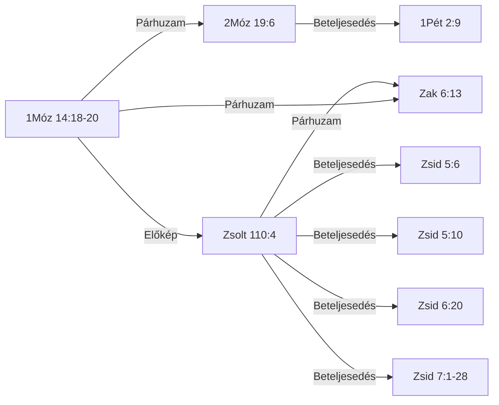

# KIRALY-001 — Melkizedek — király-pap rendje, kenyér és bor

*Kereszthivatkozási törzscikk — ugyanannak a tartalomnak az olvasói nézete, mint a [tudományos lexikonoldal](KIRALY-001_TUDOMANYOS.md).*

| | |
|---|---|
| **ID** | `KIRALY-001` |
| **Teljes cím** | Melkizedek — király-pap rendje, kenyér és bor |
| **Rövid UI-címke** | Melkizedek-rend |
| **Téma** | Krisztológia |
| **Azonosság típusa** | lexikai |
| **PaRDeS-szint** | Drash/Sod |
| **Státusz** | publikálható (`v2`, 2026.09.10) |
| **Igehelyek** | 9 (5 ÓSZ / 4 ÚSZ) |
| **Kapcsolatok** | 9 |
| **Fő szavak** | ἀμήτωρ (amētōr, G0282) · ἄτακτος (ataktos, G0813) · τάξις (taxis, G5010) · כֹּהֵן (ko.hen, H3548) · כִּסֵּא (kis.se, H3678) · מַמְלָכָה (mam.la.khah, H4467) · שָׁלֵם (sha.lem, H8004) |
| **Negatív kritérium** | az igehelynek vagy név szerint Melkizedeket kell megneveznie/rá hivatkoznia (a "rendje szerint" formulával), vagy a BDB H3548 "priest-king" lexikai sense alá kell tartoznia — a puszta "pap" vagy "király" cím külön-külön nem elég (l. a BDB "chieftain (exercising priestly functions)" alkategória kizárása, Jetró/Dávid fiai/Ira) |
| **Fölérendelt fogalom** | papi és királyi tisztség kombinációja általában (bármely "pap-király" szereplő, Melkizedekre/a H3548 priest-king sense-re való hivatkozás nélkül) |

## Kivonat

## Tartalom

- [1. Igehelyek és kereszthivatkozások](#1-igehelyek-és-kereszthivatkozások)
- [2. Kapcsolatok](#2-kapcsolatok)
- [3. A kereszthivatkozások minősítése](#3-a-kereszthivatkozások-minősítése)
- [4. LXX-fordítói döntések](#4-lxx-fordítói-döntések)
- [5. Szótári háttér — szerepek és lefedettség](#5-szótári-háttér--szerepek-és-lefedettség)
- [6. Értelmezés](#6-értelmezés)
- [7. Módszertan és nyitott kérdések](#7-módszertan-és-nyitott-kérdések)
- [Jelmagyarázat](#jelmagyarázat)
- [Források és licenc](#források-és-licenc)

## 1. Igehelyek és kereszthivatkozások

| Igehely | Funkció | PaRDeS-szint | Megbízhatóság |
|---|---|---|---|
| [1Móz 14:18-20](#v-1móz-14-18-20) | 🌱 alap-előfordulás | Peshat | magas · tartalom-alapú |
| [2Móz 19:6](#v-2móz-19-6) | egyéni → kollektív szintre emelve | Remez | magas · tartalom-alapú |
| [Zsolt 76:3](#v-zsolt-76-3) | helynév-azonosítás, lexikai kapocs | Remez | magas · tartalom-alapú |
| [Zsolt 110:4](#v-zsolt-110-4) | próféciai megerősítés, dávidi szintre szűkítve | Remez | magas · tartalom-alapú |
| [Zak 6:13](#v-zak-6-13) | explicit "pap a trónon" kép, próféciai megerősítés | Remez | magas · tartalom-alapú |
| [Zsid 5:6](#v-zsid-5-6) | krisztológiai betöltés, első idézet | Drash | magas · tartalom-alapú |
| [Zsid 5:10](#v-zsid-5-10) | krisztológiai betöltés | Drash | magas · tartalom-alapú |
| [Zsid 6:20](#v-zsid-6-20) | krisztológiai betöltés | Drash | magas · tartalom-alapú |
| [Zsid 7:1-28](#v-zsid-7-1-28) | krisztológiai betöltés, teljes kifejtés | Drash/Sod | magas · tartalom-alapú |

*Az UBS-jelentés csak újszövetségi soroknál áll: az UBS Greek New Testament Dictionary az Újszövetséget fedi.*

### 1Móz 14:18-20

> *Melkhisédek pedig Sálem királya, kenyeret és bort hoza; ő pedig a Magasságos Istennek papja vala.*

*És megáldá őt, és monda: Áldott legyen Ábrám a Magasságos Istentől, ég és föld teremtőjétől.*  
*Áldott a Magasságos Isten, a ki kezedbe adta ellenségeidet. És tizedet ada néki mindenből.*  
Melkizedek, Sálem királya, egyszerre "a Felséges Isten papja" — kenyeret és bort hoz, megáldja Ábrámot, aki tizedet ad neki. Első előfordulás, minden előzmény és genealógia nélkül.  
Funkció: a motívum legelső megjelenése  

- **Kulcsszó:** papja — כֹהֵ֖ן (kho.Hen)
- **Strong · szótári jelentés:** H3548 · BDB H3548 1 — pap-király
- **Kapcsolatok:** → [2Móz 19:6](#v-2móz-19-6) (Párhuzam, magas); → [Zsolt 110:4](#v-zsolt-110-4) (Előkép, magas); → [Zak 6:13](#v-zak-6-13) (Párhuzam, közepes)

### 2Móz 19:6

> *És lesztek ti nékem papok birodalma és szent nép. Ezek azok az ígék, melyeket el kell mondanod Izráel fiainak.*

"Ti pedig lesztek nékem papok királysága" — a Sínai-szövetségben Izráel egésze kap kollektív király-pap identitást, a lévita papság intézményesítése előtt. Ugyanaz a כֹּהֵן (kóhén) gyök, mint Melkizedeknél, de itt nem egy egyén, hanem egy egész nép viseli.  

- **Kulcsszó:** papok — כֹּהֲנִ֖ים (ko.ha.Nim); מַמְלֶ֥כֶת (mam.Le.khet)
- **Strong · szótári jelentés:** H3548+H4467 · BDB H3548 1 — egyszerre papok és királyok a nemzetekhez való viszonyukban
- **LXX:** 2Móz 19:6 — — — kutatói azonosítás függőben
- **Kapcsolatok:** → [1Pét 2:9](#v-1pét-2-9) (Beteljesedés, magas); ← [1Móz 14:18-20](#v-1móz-14-18-20) (Párhuzam, magas)
- **TSK-kereszthivatkozás** (szavazatszám): Jel 5:10 (23), 1Pét 2:9 (22), 1Pét 2:5 (18)
- **Károli-kereszthivatkozás:** 1Pét 2:9

### Zsolt 76:3

> *Mert hajléka van Sálemben, és lakhelye Sionban.*

"Sálemben van az ő sátora, és lakóhelye Sionban" — a Sálem=Jeruzsálem/Sion azonosítás, ugyanazzal a Strong-számmal (H8004), mint 1Móz 14:18-nál — lexikai, nem csak tematikus kapcsolat.  

- **Kulcsszó:** Sálemben — שָׁלֵ֣ם (sha.Lem)
- **Strong · szótári jelentés:** H8004 · BDB H8004 — helynév, Jeruzsálem rövidüléseként/archaizáló neveként; a BDB explicit Zsolt 76:3-at idézi Gen 14:18 mellett
- **LXX:** Zsolt(LXX) 75:3 — — — kutatói azonosítás függőben
- **Károli-kereszthivatkozás:** Zsolt 132:13-14

### Zsolt 110:4

> *Megesküdt az Úr és meg nem másítja: Pap vagy te örökké Melkhisedek rendje szerint.*

"Megesküdt az Úr és meg nem másítja: Te vagy pap örökké Melkhisédek rendje szerint" — próféciai eskü-formula, dávidi/individuális szintre visszavéve a mintát.  

- **Kulcsszó:** Pap — כֹהֵ֥ן (kho.Hen)
- **Strong · szótári jelentés:** H3548 · BDB H3548 1 — messiási pap-király, mint Melkizedek
- **LXX:** Zsolt(LXX) 109:4 — τάξιν (τάξις, taxis G5010) — egyező
- **Kapcsolatok:** → [Zak 6:13](#v-zak-6-13) (Párhuzam, magas); → [Zsid 5:6](#v-zsid-5-6) (Beteljesedés, magas); → [Zsid 5:10](#v-zsid-5-10) (Beteljesedés, magas); → [Zsid 6:20](#v-zsid-6-20) (Beteljesedés, magas); → [Zsid 7:1-28](#v-zsid-7-1-28) (Beteljesedés, magas); ← [1Móz 14:18-20](#v-1móz-14-18-20) (Előkép, magas)
- **TSK-kereszthivatkozás** (szavazatszám): Zsid 7:17 (25), Zsid 5:6 (24), Zsid 7:21 (22), 1Móz 14:18 (15)
- **Károli-kereszthivatkozás:** Zsid 5:6, Zsid 6:20, Zsid 7:17

### Zak 6:13

> *Mert ő fogja megépíteni az Úrnak templomát, és nagy lesz az ő dicsősége, és ülni és uralkodni fog az ő székében, és pap is lesz az ő székében, és békesség tanácsa lesz kettőjük között.*

"pap lesz az ő királyi székén" — próféciai kép egyetlen alakról, aki egyszerre ül a trónon és visel papi tisztséget.  

- **Kulcsszó:** pap — כֹהֵן֙ (kho.Hen); כִּסְא֔ (kis.')
- **Strong · szótári jelentés:** H3548+H3678 · BDB H3548 1 — messiási pap és király
- **LXX:** Zak 6:13 — — — kutatói azonosítás függőben
- **Kapcsolatok:** ← [Zsolt 110:4](#v-zsolt-110-4) (Párhuzam, magas); ← [1Móz 14:18-20](#v-1móz-14-18-20) (Párhuzam, közepes)
- **Károli-kereszthivatkozás:** Zak 11:4

### Zsid 5:6

> *Miképen másutt is mondja: Te örökké való pap vagy, Melkisédek rendje szerint.*

A Zsolt 110:4 első idézetei, bevezetve Krisztus főpapságának témáját.  

- **Kulcsszó:** rendje szerint — τάξιν (taxin)
- **Strong · szótári jelentés:** G5010 · —
- **UBS-jelentés:** 58.21 — valamely dolog fajtája vagy típusa, más hasonló dolgokkal való szembeállítást és összehasonlítást feltételezve
- **Kapcsolatok:** ← [Zsolt 110:4](#v-zsolt-110-4) (Beteljesedés, magas)
- **TSK-kereszthivatkozás** (szavazatszám): Zsolt 110:4 (21)
- **Károli-kereszthivatkozás:** Zsolt 110:4

### Zsid 5:10

> *Neveztetvén az Istentől Melkisédek rendje szerint való főpapnak.*

A Zsolt 110:4 idézése, Krisztus főpapságának bevezetése.  

- **Kulcsszó:** rendje szerint — τάξιν (taxin)
- **Strong · szótári jelentés:** G5010 · —
- **UBS-jelentés:** 58.21 — valamely dolog fajtája vagy típusa, más hasonló dolgokkal való szembeállítást és összehasonlítást feltételezve
- **Kapcsolatok:** ← [Zsolt 110:4](#v-zsolt-110-4) (Beteljesedés, magas)
- **Károli-kereszthivatkozás:** 1Móz 14:18-20, Zsolt 110:4

### Zsid 6:20

> *A hová útnyitóul bement érettünk Jézus, a ki örökké való főpap lett Melkisédek rendje szerint.*

A Zsolt 110:4 idézése, Krisztus "örökkévaló főpap Melkhisédek rendje szerint" bevezetése.  

- **Kulcsszó:** rendje szerint — τάξιν (taxin)
- **Strong · szótári jelentés:** G5010 · —
- **UBS-jelentés:** 58.21 — valamely dolog fajtája vagy típusa, más hasonló dolgokkal való szembeállítást és összehasonlítást feltételezve
- **Kapcsolatok:** ← [Zsolt 110:4](#v-zsolt-110-4) (Beteljesedés, magas)
- **Károli-kereszthivatkozás:** Jel 3:19

### Zsid 7:1-28

> *Mert ez a Melkisédek Sálem királya, a felséges Isten papja, a ki a királyok leveréséből visszatérő Ábrahámmal találkozván, őt megáldotta,*

*A kinek tizedet is adott Ábrahám mindenből: a ki elsőben is magyarázat szerint igazság királya, azután pedig Sálem királya is, azaz békesség királya,*  
*Apa nélkül, anya nélkül, nemzetség nélkül való; sem napjainak kezdete, sem életének vége nincs, de hasonlóvá tétetvén az Isten Fiához, pap marad örökké.*  
*Nézzétek meg pedig, mily nagy ez, a kinek a zsákmányból tizedet is adott Ábrahám, a pátriárka;*  
*És bár azoknak, kik a Lévi fiai közül nyerik el a papságot, parancsolatjok van, hogy törvény szerint tizedet szedjenek a néptől, azaz az ő atyafiaiktól, jóllehet ők is az Ábrahám ágyékából származtak;*  
*De az, a kinek nemzetsége nem azok közül való, tizedet vett Ábrahámtól, és az ígéretek birtokosát megáldotta,*  
*Pedig minden ellenmondás nélkül való, hogy a nagyobb áldja meg a kisebbet.*  
*És itt halandó emberek szednek tizedet, ott ellenben az, a ki bizonyság szerint él:*  
*És hogy úgy szóljak, Ábrahámnál fogva tized vétetett Lévitől is, a tizedszedőtől,*  
*Mert ő még az atyja ágyékában vala, a mikor annak elébe ment Melkisédek.*  
*Ha tehát a lévitai papság által volna a tökéletesség (mert a nép ez alatt nyerte a törvényt): mi szükség tovább is mondogatni, hogy más pap támadjon a Melkisédek rendje szerint és ne az Áron rendje szerint?*  
*Mert a papság megváltozásával szükségképen megváltozik a törvény is.*  
*Mert a kiről ezek mondatnak, az más nemzetségből származott, a melyből senki sem szolgált az oltár körül;*  
*Mert nyilvánvaló, hogy a mi Urunk Júdából támadott, a mely nemzetségre nézve semmit sem szólott Mózes a papságról.*  
*És még inkább nyilvánvaló az, ha a Melkisédek hasonlatossága szerint áll elő más pap,*  
*A ki nem testi parancsolatnak törvénye szerint, hanem enyészhetetlen életnek ereje szerint lett.*  
*Mert ez a bizonyságtétel: Te pap vagy örökké, Melkisédek rendje szerint.*  
*Mert az előbbi parancsolat eltöröltetik, mivelhogy erőtelen és haszontalan,*  
*Minthogy a törvény semmiben sem szerzett tökéletességet; de beáll a jobb reménység, a mely által közeledünk az Istenhez.*  
*És a mennyiben nem esküvés nélkül való, mert amazok esküvés nélkül lettek papokká,*  
*De ez esküvéssel, az által, a ki azt mondá néki: Megesküdött az Úr, és nem bánja meg, te pap vagy örökké, Melkisédek rendje szerint:*  
*Annyiban jobb szövetségnek lett kezesévé Jézus.*  
*És amazok jóllehet többen lettek papokká, mert a halál miatt meg nem maradhattak:*  
*De ennek, minthogy örökké megmarad, változhatatlan a papsága.*  
*Ennekokáért ő mindenképen idvezítheti is azokat, a kik ő általa járulnak Istenhez, mert mindenha él, hogy esedezzék érettök.*  
*Mert ilyen főpap illet vala minket, szent, ártatlan, szeplőtelen, a bűnösöktől elválasztott, és a ki az egeknél magasságosabb lőn,*  
*A kinek nincs szüksége, mint a főpapoknak, hogy napról-napra előbb a saját bűneiért vigyen áldozatot, azután a népéiért, mert ezt egyszer megcselekedte, maga-magát megáldozván.*  
*Mert a törvény gyarló embereket rendel főpapokká, de a törvény után való esküvés beszéde örök tökéletes Fiút.*  
A Melkizedek-rend teljes kifejtése: nagyobb a lévita rendnél (a tized-jelenetből levezetve), örökkévaló (argumentum e silentio), a törvény megváltozásának alapja.  

- **Kulcsszó:** rendje szerint (G5010, 7:17); Apa nélkül (G0540, 7:3); anya nélkül (G0282, 7:3); nemzetség nélkül való (G0035, 7:3) — τάξιν (taxin); ἀμήτωρ (amētōr)
- **Strong · szótári jelentés:** G5010+G0813+G0282 · —
- **UBS-jelentés:** G5010: 58.21 — valamely dolog fajtája vagy típusa, más hasonló dolgokkal való szembeállítást és összehasonlítást feltételezve *(jelölt, nem egyértelmű)* · G0813: *(nincs hozzárendelés)* · G0282: 10.17 — olyan személy, akinek anyjáról nincs feljegyzés, vagy akinek sohasem volt anyja, vagy akinek anyja meghalt *(jelölt, nem egyértelmű)*
- **Kapcsolatok:** ← [Zsolt 110:4](#v-zsolt-110-4) (Beteljesedés, magas)

### Kizárt és vizsgált helyek

Nincs kizárt vagy nyitva maradt jelölt ehhez a motívumhoz.

**Negatív kritérium**: az igehelynek vagy név szerint Melkizedeket kell megneveznie/rá hivatkoznia (a "rendje szerint" formulával), vagy a BDB H3548 "priest-king" lexikai sense alá kell tartoznia — a puszta "pap" vagy "király" cím külön-külön nem elég (l. a BDB "chieftain (exercising priestly functions)" alkategória kizárása, Jetró/Dávid fiai/Ira)

## 2. Kapcsolatok

| Forrás | Cél | Típus | Funkció | Bizonyosság | PaRDeS-szint |
|---|---|---|---|---|---|
| [1Móz 14:18-20](#v-1móz-14-18-20) | [2Móz 19:6](#v-2móz-19-6) | Párhuzam | egyéni eset → kollektív, nemzeti szintre emelve, lévita rend előtt | magas | Remez |
| [1Móz 14:18-20](#v-1móz-14-18-20) | [Zsolt 110:4](#v-zsolt-110-4) | Előkép | egyszeri esemény → örökkévaló, próféciai "rendé" emelve; TSK 14 szavazat | magas | Remez |
| [Zsolt 110:4](#v-zsolt-110-4) | [Zak 6:13](#v-zak-6-13) | Párhuzam | próféciai visszautalás → explicit "pap a trónon" kép; TSK 9 szavazat | magas | Remez |
| [1Móz 14:18-20](#v-1móz-14-18-20) | [Zak 6:13](#v-zak-6-13) | Párhuzam | közös H3548 priest-king sense; TSK csak 2 szavazat, gyenge megerősítés | közepes | Remez |
| [2Móz 19:6](#v-2móz-19-6) | [1Pét 2:9](#v-1pét-2-9) | Beteljesedés | szó szerinti LXX-idézés (βασίλειον ἱεράτευμα – baszileion hierateuma); TSK 22 szavazat | magas | Drash |
| [Zsolt 110:4](#v-zsolt-110-4) | [Zsid 5:6](#v-zsid-5-6) | Beteljesedés | a Zsolt 110:4 első idézete, Krisztus főpapságának bevezetése | magas | Drash |
| [Zsolt 110:4](#v-zsolt-110-4) | [Zsid 5:10](#v-zsid-5-10) | Beteljesedés | a Zsolt 110:4 idézése | magas | Drash |
| [Zsolt 110:4](#v-zsolt-110-4) | [Zsid 6:20](#v-zsid-6-20) | Beteljesedés | a Zsolt 110:4 idézése | magas | Drash |
| [Zsolt 110:4](#v-zsolt-110-4) | [Zsid 7:1-28](#v-zsid-7-1-28) | Beteljesedés | a Melkizedek-rend teljes kifejtése, a Zsolt 110:4 nyomán | magas | Drash/Sod |

Mermaid-ábra

### Alátámasztás

## 3. A kereszthivatkozások minősítése

## 4. LXX-fordítói döntések

| Igehely (Károli) | LXX-igehely | Héber kulcsszó | Görög megfelelő | Egyezés |
|---|---|---|---|---|
| [1Móz 14:18](#v-1móz-14-18) | 1Móz 14:18 | כֹהֵ֖ן (kho.Hen) | — | kutatói azonosítás függőben |
| [1Móz 14:19](#v-1móz-14-19) | 1Móz 14:19 | — | — | kutatói azonosítás függőben |
| [1Móz 14:20](#v-1móz-14-20) | 1Móz 14:20 | — | — | kutatói azonosítás függőben |
| [Zsolt 76:3](#v-zsolt-76-3) | Zsolt(LXX) 75:3 | שָׁלֵ֣ם (sha.Lem) | — | kutatói azonosítás függőben |
| [2Móz 19:6](#v-2móz-19-6) | 2Móz 19:6 | כֹּהֲנִ֖ים (ko.ha.Nim) | — | kutatói azonosítás függőben |
| [Zsolt 110:4](#v-zsolt-110-4) | Zsolt(LXX) 109:4 | כֹהֵ֥ן (kho.Hen) | τάξιν (τάξις, taxis G5010) | egyező |
| [Zak 6:13](#v-zak-6-13) | Zak 6:13 | כֹהֵן֙ (kho.Hen) | — | kutatói azonosítás függőben |

*Összesítés: egyező=1, eltérő=0, LXX-minusz=0, kutatói azonosítás függőben=6, szamozas_elteres=0.*

## 5. Szótári háttér — szerepek és lefedettség

A szerepek jelentése és mai forrása (`adat/szotar_szerepek.tsv`, RENDER_BRIEF.md G6):

| Szerep | Görög forrás | Héber forrás |
|---|---|---|
| Alapjelentés | TBESG | TBESH |
| Mélységi szócikk | Thayer | BDB |
| Teológiai szócikk | Cremer (1895) | Girdlestone (1897) + Cremer héber mutatója; TWOT-szám hivatkozásként |
| Jelentésszerkezet, szemantikai mező | UBS DNTG (Louw–Nida) | UBS DBH (SDBH) |
| Tömör jelentés, előfordulás | UBS DNTG glossza + referencia-szám; Mounce kiegészítő | UBS DBH glossza + referencia-szám |
| LXX-híd | az ÚSZ-szó LXX-háttere: mely héber szavakat ad vissza, mely versekben (lekerdez.py lxx-hid, LXX_OS) | LXX-fordítói döntés versenként: mely görög szó adja vissza (LXX_OS + adat/lxx_dontesek.tsv; a lexikonoldal 3. szakasza) |
| Megfelelők a másik nyelven | SECE (héber) | SECE (görög) |
| Nyelvi háttér | LSJ, ha releváns | BDB etimológia |
| Versenkénti jelentés | UBS DNTG (szópozícióig) | UBS DBH |
| Kiejtés (magyaros) | kiejtes.py szabálytábla | lemma: kiejtes_kivetelek.tsv (kézi, OSHL-alapú jelöltekből); alak: STEP-átírás, változatlanul |

### Lefedettség szavanként

A cella értéke: forrás-hivatkozás (a szerep ma adatosítva), `kézi (2/b)` (a 2/b résben kézzel rögzítve), vagy `nincs adatosítva` (RENDER_BRIEF.md G7).

| Szó | Alapjelentés | Mélységi szócikk | Teológiai szócikk | Jelentésszerkezet, szemantikai mező | Tömör jelentés, előfordulás | LXX-híd | Megfelelők a másik nyelven | Nyelvi háttér | Versenkénti jelentés | Kiejtés (magyaros) |
|---|---|---|---|---|---|---|---|---|---|---|
| G0282 | TBESG | Thayer | nincs adatosítva | UBS DNTG (Louw–Nida) | UBS DNTG glossza + referencia-szám; Mounce kiegészítő | az ÚSZ-szó LXX-háttere: mely héber szavakat ad vissza, mely versekben (lekerdez.py lxx-hid, LXX_OS) | nincs adatosítva | LSJ, ha releváns | UBS DNTG (szópozícióig) | nincs adatosítva |
| G0813 | TBESG | Thayer | nincs adatosítva | UBS DNTG (Louw–Nida) | UBS DNTG glossza + referencia-szám; Mounce kiegészítő | az ÚSZ-szó LXX-háttere: mely héber szavakat ad vissza, mely versekben (lekerdez.py lxx-hid, LXX_OS) | nincs adatosítva | LSJ, ha releváns | UBS DNTG (szópozícióig) | nincs adatosítva |
| G5010 | TBESG | Thayer | nincs adatosítva | UBS DNTG (Louw–Nida) | UBS DNTG glossza + referencia-szám; Mounce kiegészítő | az ÚSZ-szó LXX-háttere: mely héber szavakat ad vissza, mely versekben (lekerdez.py lxx-hid, LXX_OS) | nincs adatosítva | LSJ, ha releváns | UBS DNTG (szópozícióig) | nincs adatosítva |
| H3548 | TBESH | BDB | nincs adatosítva | UBS DBH (SDBH) | nincs adatosítva | LXX-fordítói döntés versenként: mely görög szó adja vissza (LXX_OS + adat/lxx_dontesek.tsv; a lexikonoldal 3. szakasza) | nincs adatosítva | nincs adatosítva | nincs adatosítva | nincs adatosítva |
| H3678 | TBESH | BDB | nincs adatosítva | UBS DBH (SDBH) | nincs adatosítva | LXX-fordítói döntés versenként: mely görög szó adja vissza (LXX_OS + adat/lxx_dontesek.tsv; a lexikonoldal 3. szakasza) | nincs adatosítva | nincs adatosítva | nincs adatosítva | nincs adatosítva |
| H4467 | TBESH | BDB | nincs adatosítva | UBS DBH (SDBH) | nincs adatosítva | LXX-fordítói döntés versenként: mely görög szó adja vissza (LXX_OS + adat/lxx_dontesek.tsv; a lexikonoldal 3. szakasza) | nincs adatosítva | nincs adatosítva | nincs adatosítva | nincs adatosítva |
| H8004 | TBESH | BDB | nincs adatosítva | UBS DBH (SDBH) | nincs adatosítva | LXX-fordítói döntés versenként: mely görög szó adja vissza (LXX_OS + adat/lxx_dontesek.tsv; a lexikonoldal 3. szakasza) | nincs adatosítva | nincs adatosítva | nincs adatosítva | nincs adatosítva |

## 6. Értelmezés

### PaRDeS keretrendszer

## 7. Módszertan és nyitott kérdések

### Módszertani napló

### Nyitott kérdések és séma-korlátok

## Jelmagyarázat

**PaRDeS-szintek:**
- **Peshat** — a szöveg szerinti, szó szerinti értelem.
- **Remez** — csak felismerés/azonosítás, következtetés nélkül.
- **Drash** — normatív, következtető, alkalmazó.
- **Sod** — fegyelmezett, csak szövegből levezethető, gematria/allegorizálás nélkül.

**Funkció:** a vers szerepe a motívum ívében, a motívum saját tanulmányából átvett megnevezéssel.

**Rövidítések:** BDB (Brown–Driver–Briggs), TBESH/TBESG (Tyndale Bible
Encyclopedia — Strong's Hebrew/Greek), Thayer (Thayer's Greek Lexicon),
UBS (UBS Dictionary of New Testament Greek — Louw–Nida szemantikai
doménekkel), L–N (Louw–Nida doménkód), SDBH/SDGNT (Semantic Dictionary
of Biblical Hebrew/Greek), OSHL (Open Scriptures Hebrew Lexicon), TWOT
(Theological Wordbook of the Old Testament — csak számhivatkozás), TSK
(Treasury of Scripture Knowledge), KH (Károli-kereszthivatkozás), LXX
(Septuaginta), MT (Masoretic Text), KJV (King James Version).

A szótári fordításokban a πνεῦμα (pneuma) mindig *szellem*, a ψυχή
(pszükhé) *lélek*; a Károli-idézetek szövege változatlan (pl. »Lélek«).

## Források és licenc

**Hivatkozás:** `KIRALY-001` — Melkizedek — király-pap rendje, kenyér és bor. Státusz: publikálható (v2, 2026.09.10).

**Felhasznált szótárak és adatok:**

- BDB (Brown–Driver–Briggs, A Hebrew and English Lexicon of the Old Testament, 1906) — közkincs
- LXX (Septuaginta — lxx-morph + GreekWordList szövegkorpusz) — CC BY 4.0
- OSHL (Open Scriptures Hebrew Lexicon) — csak TWOT-szám — CC BY 4.0
- SDBH (Semantic Dictionary of Biblical Hebrew) — CC BY-SA 4.0
- SDGNT (Semantic Dictionary of Biblical Greek) — CC BY-SA 4.0
- TBESG (Tyndale Brief lexicon of Extended Strongs for Greek) — CC BY 4.0
- TBESH (Tyndale Brief lexicon of Extended Strongs for Hebrew) — CC BY 4.0
- TSK (Treasury of Scripture Knowledge) — CC BY 4.0
- Thayer (Thayer's Greek-English Lexicon of the New Testament) — közkincs
- UBS (UBS Dictionary of New Testament Greek — Louw–Nida szemantikai domének) — CC BY-SA 4.0
- Károli Gáspár fordítása (1908) és a Károli-kereszthivatkozások — közkincs
