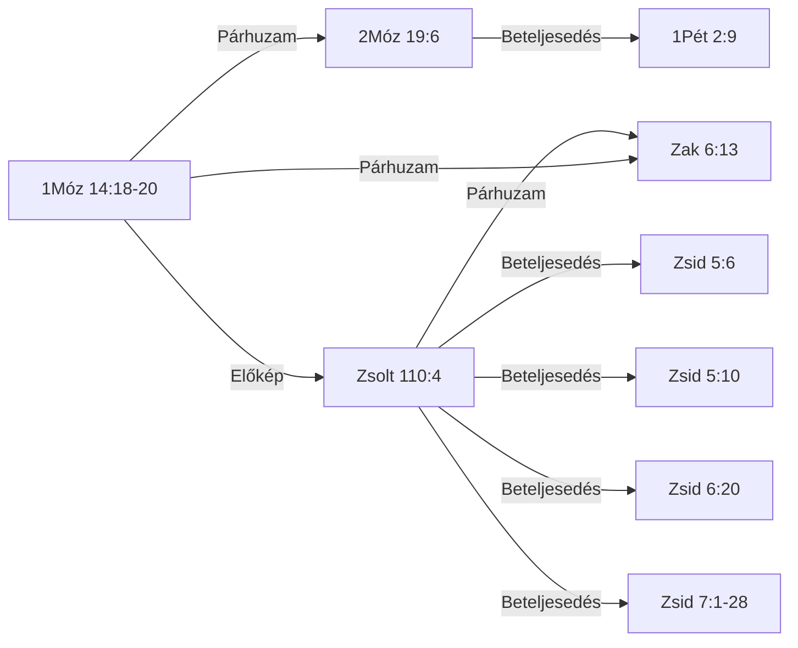

# KIRALY-001 — Melkizedek — király-pap rendje, kenyér és bor

*Kereszthivatkozási törzscikk — ugyanannak a tartalomnak az olvasói nézete, mint a [tudományos lexikonoldal](KIRALY-001_TUDOMANYOS.md).*

| | |
|---|---|
| **ID** | `KIRALY-001` |
| **Teljes cím** | Melkizedek — király-pap rendje, kenyér és bor |
| **Rövid UI-címke** | Melkizedek-rend |
| **Téma** | Krisztológia |
| **Azonosság típusa** | lexikai |
| **PaRDeS-szint** | Drash/Sod |
| **Státusz** | publikálható (`v2`, 2026.09.10) |
| **Igehelyek** | 9 (5 ÓSZ / 4 ÚSZ) |
| **Kapcsolatok** | 9 |
| **Fő szavak** | ἀμήτωρ (amētōr, G0282) · ἄτακτος (ataktos, G0813) · τάξις (taxis, G5010) · כֹּהֵן (ko.hen, H3548) · כִּסֵּא (kis.se, H3678) · מַמְלָכָה (mam.la.khah, H4467) · שָׁלֵם (sha.lem, H8004) |
| **Negatív kritérium** | az igehelynek vagy név szerint Melkizedeket kell megneveznie/rá hivatkoznia (a "rendje szerint" formulával), vagy a BDB H3548 "priest-king" lexikai sense alá kell tartoznia — a puszta "pap" vagy "király" cím külön-külön nem elég (l. a BDB "chieftain (exercising priestly functions)" alkategória kizárása, Jetró/Dávid fiai/Ira) |
| **Fölérendelt fogalom** | papi és királyi tisztség kombinációja általában (bármely "pap-király" szereplő, Melkizedekre/a H3548 priest-king sense-re való hivatkozás nélkül) |

## Kivonat

A motívum azt a lexikai azonosságot követi, amelyet a BDB H3548 (*kohén*) "pap-király" jelentés-kategóriája köt össze: Melkizedek (1Móz 14:18-20), Izráel kollektív "papok királysága" (2Móz 19:6), a dávidi eskü-ígéret (Zsolt 110:4), a próféciai "pap a trónon" kép (Zak 6:13) és a Zsidókhoz írt levél Krisztus-alkalmazása (Zsid 5-7) — kilenc tabulált igehely/igehelycsoport, öt lépéses kánoni íven. A legfontosabb lexikai lelet a τάξις (*taxis*, "rend") szó technikai súlya: a Zsidókhoz írt levél öt, minden kritikai kiadásban egységesen igazolt helyen (a hatodik, Zsid 7:21, szövegkritikailag nem egységes) a Melkizedek-rendet a lévitaival szembeállítható, önálló papi rendként azonosítja. Két önálló, egymástól független vitatott pont marad nyitva: Melkizedek kiléte (krisztofánia vs. irodalmi-retorikai olvasat) és az 1Móz 14↔Zsolt 110 kapcsolat iránya.

## Tartalom

- [1. Igehelyek és kereszthivatkozások](#1-igehelyek-és-kereszthivatkozások)
- [2. Kapcsolatok](#2-kapcsolatok)
- [3. A kereszthivatkozások minősítése](#3-a-kereszthivatkozások-minősítése)
- [4. LXX-fordítói döntések](#4-lxx-fordítói-döntések)
- [5. Szótári háttér — szerepek és lefedettség](#5-szótári-háttér--szerepek-és-lefedettség)
- [6. Értelmezés](#6-értelmezés)
- [7. Módszertan és nyitott kérdések](#7-módszertan-és-nyitott-kérdések)
- [Jelmagyarázat](#jelmagyarázat)
- [Források és licenc](#források-és-licenc)

## 1. Igehelyek és kereszthivatkozások

| Igehely | Funkció | PaRDeS-szint | Megbízhatóság |
|---|---|---|---|
| [1Móz 14:18-20](#v-1móz-14-18-20) | 🌱 alap-előfordulás | Peshat | magas · tartalom-alapú |
| [2Móz 19:6](#v-2móz-19-6) | egyéni → kollektív szintre emelve | Remez | magas · tartalom-alapú |
| [Zsolt 76:3](#v-zsolt-76-3) | helynév-azonosítás, lexikai kapocs | Remez | magas · tartalom-alapú |
| [Zsolt 110:4](#v-zsolt-110-4) | próféciai megerősítés, dávidi szintre szűkítve | Remez | magas · tartalom-alapú |
| [Zak 6:13](#v-zak-6-13) | explicit "pap a trónon" kép, próféciai megerősítés | Remez | magas · tartalom-alapú |
| [Zsid 5:6](#v-zsid-5-6) | krisztológiai betöltés, első idézet | Drash | magas · tartalom-alapú |
| [Zsid 5:10](#v-zsid-5-10) | krisztológiai betöltés | Drash | magas · tartalom-alapú |
| [Zsid 6:20](#v-zsid-6-20) | krisztológiai betöltés | Drash | magas · tartalom-alapú |
| [Zsid 7:1-28](#v-zsid-7-1-28) | krisztológiai betöltés, teljes kifejtés | Drash/Sod | magas · tartalom-alapú |

*Az UBS-jelentés csak újszövetségi soroknál áll: az UBS Greek New Testament Dictionary az Újszövetséget fedi.*

### 1Móz 14:18-20

> *Melkhisédek pedig Sálem királya, kenyeret és bort hoza; ő pedig a Magasságos Istennek papja vala.*

*És megáldá őt, és monda: Áldott legyen Ábrám a Magasságos Istentől, ég és föld teremtőjétől.*  
*Áldott a Magasságos Isten, a ki kezedbe adta ellenségeidet. És tizedet ada néki mindenből.*  
Melkizedek, Sálem királya, egyszerre "a Felséges Isten papja" — kenyeret és bort hoz, megáldja Ábrámot, aki tizedet ad neki. Első előfordulás, minden előzmény és genealógia nélkül.  
Funkció: a motívum legelső megjelenése  

- **Kulcsszó:** papja — כֹהֵ֖ן (kho.Hen)
- **Strong · szótári jelentés:** H3548 · BDB H3548 1 — pap-király
- **Kapcsolatok:** → [2Móz 19:6](#v-2móz-19-6) (Párhuzam, magas); → [Zsolt 110:4](#v-zsolt-110-4) (Előkép, magas); → [Zak 6:13](#v-zak-6-13) (Párhuzam, közepes)

### 2Móz 19:6

> *És lesztek ti nékem papok birodalma és szent nép. Ezek azok az ígék, melyeket el kell mondanod Izráel fiainak.*

"Ti pedig lesztek nékem papok királysága" — a Sínai-szövetségben Izráel egésze kap kollektív király-pap identitást, a lévita papság intézményesítése előtt. Ugyanaz a כֹּהֵן (kóhén) gyök, mint Melkizedeknél, de itt nem egy egyén, hanem egy egész nép viseli.  

- **Kulcsszó:** papok — כֹּהֲנִ֖ים (ko.ha.Nim); מַמְלֶ֥כֶת (mam.Le.khet)
- **Strong · szótári jelentés:** H3548+H4467 · BDB H3548 1 — egyszerre papok és királyok a nemzetekhez való viszonyukban
- **LXX:** 2Móz 19:6 — — — kutatói azonosítás függőben
- **Kapcsolatok:** → [1Pét 2:9](#v-1pét-2-9) (Beteljesedés, magas); ← [1Móz 14:18-20](#v-1móz-14-18-20) (Párhuzam, magas)
- **TSK-kereszthivatkozás** (szavazatszám): Jel 5:10 (23), 1Pét 2:9 (22), 1Pét 2:5 (18)
- **Károli-kereszthivatkozás:** 1Pét 2:9

### Zsolt 76:3

> *Mert hajléka van Sálemben, és lakhelye Sionban.*

"Sálemben van az ő sátora, és lakóhelye Sionban" — a Sálem=Jeruzsálem/Sion azonosítás, ugyanazzal a Strong-számmal (H8004), mint 1Móz 14:18-nál — lexikai, nem csak tematikus kapcsolat.  

- **Kulcsszó:** Sálemben — שָׁלֵ֣ם (sha.Lem)
- **Strong · szótári jelentés:** H8004 · BDB H8004 — helynév, Jeruzsálem rövidüléseként/archaizáló neveként; a BDB explicit Zsolt 76:3-at idézi Gen 14:18 mellett
- **LXX:** Zsolt(LXX) 75:3 — — — kutatói azonosítás függőben
- **Károli-kereszthivatkozás:** Zsolt 132:13-14

### Zsolt 110:4

> *Megesküdt az Úr és meg nem másítja: Pap vagy te örökké Melkhisedek rendje szerint.*

"Megesküdt az Úr és meg nem másítja: Te vagy pap örökké Melkhisédek rendje szerint" — próféciai eskü-formula, dávidi/individuális szintre visszavéve a mintát.  

- **Kulcsszó:** Pap — כֹהֵ֥ן (kho.Hen)
- **Strong · szótári jelentés:** H3548 · BDB H3548 1 — messiási pap-király, mint Melkizedek
- **LXX:** Zsolt(LXX) 109:4 — τάξιν (τάξις, taxis G5010) — egyező
- **Kapcsolatok:** → [Zak 6:13](#v-zak-6-13) (Párhuzam, magas); → [Zsid 5:6](#v-zsid-5-6) (Beteljesedés, magas); → [Zsid 5:10](#v-zsid-5-10) (Beteljesedés, magas); → [Zsid 6:20](#v-zsid-6-20) (Beteljesedés, magas); → [Zsid 7:1-28](#v-zsid-7-1-28) (Beteljesedés, magas); ← [1Móz 14:18-20](#v-1móz-14-18-20) (Előkép, magas)
- **TSK-kereszthivatkozás** (szavazatszám): Zsid 7:17 (25), Zsid 5:6 (24), Zsid 7:21 (22), 1Móz 14:18 (15)
- **Károli-kereszthivatkozás:** Zsid 5:6, Zsid 6:20, Zsid 7:17

### Zak 6:13

> *Mert ő fogja megépíteni az Úrnak templomát, és nagy lesz az ő dicsősége, és ülni és uralkodni fog az ő székében, és pap is lesz az ő székében, és békesség tanácsa lesz kettőjük között.*

"pap lesz az ő királyi székén" — próféciai kép egyetlen alakról, aki egyszerre ül a trónon és visel papi tisztséget.  

- **Kulcsszó:** pap — כֹהֵן֙ (kho.Hen); כִּסְא֔ (kis.')
- **Strong · szótári jelentés:** H3548+H3678 · BDB H3548 1 — messiási pap és király
- **LXX:** Zak 6:13 — — — kutatói azonosítás függőben
- **Kapcsolatok:** ← [Zsolt 110:4](#v-zsolt-110-4) (Párhuzam, magas); ← [1Móz 14:18-20](#v-1móz-14-18-20) (Párhuzam, közepes)
- **Károli-kereszthivatkozás:** Zak 11:4

### Zsid 5:6

> *Miképen másutt is mondja: Te örökké való pap vagy, Melkisédek rendje szerint.*

A Zsolt 110:4 első idézetei, bevezetve Krisztus főpapságának témáját.  

- **Kulcsszó:** rendje szerint — τάξιν (taxin)
- **Strong · szótári jelentés:** G5010 · —
- **UBS-jelentés:** 58.21 — valamely dolog fajtája vagy típusa, más hasonló dolgokkal való szembeállítást és összehasonlítást feltételezve
- **Kapcsolatok:** ← [Zsolt 110:4](#v-zsolt-110-4) (Beteljesedés, magas)
- **TSK-kereszthivatkozás** (szavazatszám): Zsolt 110:4 (21)
- **Károli-kereszthivatkozás:** Zsolt 110:4

### Zsid 5:10

> *Neveztetvén az Istentől Melkisédek rendje szerint való főpapnak.*

A Zsolt 110:4 idézése, Krisztus főpapságának bevezetése.  

- **Kulcsszó:** rendje szerint — τάξιν (taxin)
- **Strong · szótári jelentés:** G5010 · —
- **UBS-jelentés:** 58.21 — valamely dolog fajtája vagy típusa, más hasonló dolgokkal való szembeállítást és összehasonlítást feltételezve
- **Kapcsolatok:** ← [Zsolt 110:4](#v-zsolt-110-4) (Beteljesedés, magas)
- **Károli-kereszthivatkozás:** 1Móz 14:18-20, Zsolt 110:4

### Zsid 6:20

> *A hová útnyitóul bement érettünk Jézus, a ki örökké való főpap lett Melkisédek rendje szerint.*

A Zsolt 110:4 idézése, Krisztus "örökkévaló főpap Melkhisédek rendje szerint" bevezetése.  

- **Kulcsszó:** rendje szerint — τάξιν (taxin)
- **Strong · szótári jelentés:** G5010 · —
- **UBS-jelentés:** 58.21 — valamely dolog fajtája vagy típusa, más hasonló dolgokkal való szembeállítást és összehasonlítást feltételezve
- **Kapcsolatok:** ← [Zsolt 110:4](#v-zsolt-110-4) (Beteljesedés, magas)
- **Károli-kereszthivatkozás:** Jel 3:19

### Zsid 7:1-28

> *Mert ez a Melkisédek Sálem királya, a felséges Isten papja, a ki a királyok leveréséből visszatérő Ábrahámmal találkozván, őt megáldotta,*

*A kinek tizedet is adott Ábrahám mindenből: a ki elsőben is magyarázat szerint igazság királya, azután pedig Sálem királya is, azaz békesség királya,*  
*Apa nélkül, anya nélkül, nemzetség nélkül való; sem napjainak kezdete, sem életének vége nincs, de hasonlóvá tétetvén az Isten Fiához, pap marad örökké.*  
*Nézzétek meg pedig, mily nagy ez, a kinek a zsákmányból tizedet is adott Ábrahám, a pátriárka;*  
*És bár azoknak, kik a Lévi fiai közül nyerik el a papságot, parancsolatjok van, hogy törvény szerint tizedet szedjenek a néptől, azaz az ő atyafiaiktól, jóllehet ők is az Ábrahám ágyékából származtak;*  
*De az, a kinek nemzetsége nem azok közül való, tizedet vett Ábrahámtól, és az ígéretek birtokosát megáldotta,*  
*Pedig minden ellenmondás nélkül való, hogy a nagyobb áldja meg a kisebbet.*  
*És itt halandó emberek szednek tizedet, ott ellenben az, a ki bizonyság szerint él:*  
*És hogy úgy szóljak, Ábrahámnál fogva tized vétetett Lévitől is, a tizedszedőtől,*  
*Mert ő még az atyja ágyékában vala, a mikor annak elébe ment Melkisédek.*  
*Ha tehát a lévitai papság által volna a tökéletesség (mert a nép ez alatt nyerte a törvényt): mi szükség tovább is mondogatni, hogy más pap támadjon a Melkisédek rendje szerint és ne az Áron rendje szerint?*  
*Mert a papság megváltozásával szükségképen megváltozik a törvény is.*  
*Mert a kiről ezek mondatnak, az más nemzetségből származott, a melyből senki sem szolgált az oltár körül;*  
*Mert nyilvánvaló, hogy a mi Urunk Júdából támadott, a mely nemzetségre nézve semmit sem szólott Mózes a papságról.*  
*És még inkább nyilvánvaló az, ha a Melkisédek hasonlatossága szerint áll elő más pap,*  
*A ki nem testi parancsolatnak törvénye szerint, hanem enyészhetetlen életnek ereje szerint lett.*  
*Mert ez a bizonyságtétel: Te pap vagy örökké, Melkisédek rendje szerint.*  
*Mert az előbbi parancsolat eltöröltetik, mivelhogy erőtelen és haszontalan,*  
*Minthogy a törvény semmiben sem szerzett tökéletességet; de beáll a jobb reménység, a mely által közeledünk az Istenhez.*  
*És a mennyiben nem esküvés nélkül való, mert amazok esküvés nélkül lettek papokká,*  
*De ez esküvéssel, az által, a ki azt mondá néki: Megesküdött az Úr, és nem bánja meg, te pap vagy örökké, Melkisédek rendje szerint:*  
*Annyiban jobb szövetségnek lett kezesévé Jézus.*  
*És amazok jóllehet többen lettek papokká, mert a halál miatt meg nem maradhattak:*  
*De ennek, minthogy örökké megmarad, változhatatlan a papsága.*  
*Ennekokáért ő mindenképen idvezítheti is azokat, a kik ő általa járulnak Istenhez, mert mindenha él, hogy esedezzék érettök.*  
*Mert ilyen főpap illet vala minket, szent, ártatlan, szeplőtelen, a bűnösöktől elválasztott, és a ki az egeknél magasságosabb lőn,*  
*A kinek nincs szüksége, mint a főpapoknak, hogy napról-napra előbb a saját bűneiért vigyen áldozatot, azután a népéiért, mert ezt egyszer megcselekedte, maga-magát megáldozván.*  
*Mert a törvény gyarló embereket rendel főpapokká, de a törvény után való esküvés beszéde örök tökéletes Fiút.*  
A Melkizedek-rend teljes kifejtése: nagyobb a lévita rendnél (a tized-jelenetből levezetve), örökkévaló (argumentum e silentio), a törvény megváltozásának alapja.  

- **Kulcsszó:** rendje szerint (G5010, 7:17); Apa nélkül (G0540, 7:3); anya nélkül (G0282, 7:3); nemzetség nélkül való (G0035, 7:3) — τάξιν (taxin); ἀμήτωρ (amētōr)
- **Strong · szótári jelentés:** G5010+G0813+G0282 · —
- **UBS-jelentés:** G5010: 58.21 — valamely dolog fajtája vagy típusa, más hasonló dolgokkal való szembeállítást és összehasonlítást feltételezve *(jelölt, nem egyértelmű)* · G0813: *(nincs hozzárendelés)* · G0282: 10.17 — olyan személy, akinek anyjáról nincs feljegyzés, vagy akinek sohasem volt anyja, vagy akinek anyja meghalt *(jelölt, nem egyértelmű)*
- **Kapcsolatok:** ← [Zsolt 110:4](#v-zsolt-110-4) (Beteljesedés, magas)

### Kizárt és vizsgált helyek

Nincs kizárt vagy nyitva maradt jelölt ehhez a motívumhoz.

**Negatív kritérium**: az igehelynek vagy név szerint Melkizedeket kell megneveznie/rá hivatkoznia (a "rendje szerint" formulával), vagy a BDB H3548 "priest-king" lexikai sense alá kell tartoznia — a puszta "pap" vagy "király" cím külön-külön nem elég (l. a BDB "chieftain (exercising priestly functions)" alkategória kizárása, Jetró/Dávid fiai/Ira)

## 2. Kapcsolatok

| Forrás | Cél | Típus | Funkció | Bizonyosság | PaRDeS-szint |
|---|---|---|---|---|---|
| [1Móz 14:18-20](#v-1móz-14-18-20) | [2Móz 19:6](#v-2móz-19-6) | Párhuzam | egyéni eset → kollektív, nemzeti szintre emelve, lévita rend előtt | magas | Remez |
| [1Móz 14:18-20](#v-1móz-14-18-20) | [Zsolt 110:4](#v-zsolt-110-4) | Előkép | egyszeri esemény → örökkévaló, próféciai "rendé" emelve; TSK 14 szavazat | magas | Remez |
| [Zsolt 110:4](#v-zsolt-110-4) | [Zak 6:13](#v-zak-6-13) | Párhuzam | próféciai visszautalás → explicit "pap a trónon" kép; TSK 9 szavazat | magas | Remez |
| [1Móz 14:18-20](#v-1móz-14-18-20) | [Zak 6:13](#v-zak-6-13) | Párhuzam | közös H3548 priest-king sense; TSK csak 2 szavazat, gyenge megerősítés | közepes | Remez |
| [2Móz 19:6](#v-2móz-19-6) | [1Pét 2:9](#v-1pét-2-9) | Beteljesedés | szó szerinti LXX-idézés (βασίλειον ἱεράτευμα – baszileion hierateuma); TSK 22 szavazat | magas | Drash |
| [Zsolt 110:4](#v-zsolt-110-4) | [Zsid 5:6](#v-zsid-5-6) | Beteljesedés | a Zsolt 110:4 első idézete, Krisztus főpapságának bevezetése | magas | Drash |
| [Zsolt 110:4](#v-zsolt-110-4) | [Zsid 5:10](#v-zsid-5-10) | Beteljesedés | a Zsolt 110:4 idézése | magas | Drash |
| [Zsolt 110:4](#v-zsolt-110-4) | [Zsid 6:20](#v-zsid-6-20) | Beteljesedés | a Zsolt 110:4 idézése | magas | Drash |
| [Zsolt 110:4](#v-zsolt-110-4) | [Zsid 7:1-28](#v-zsid-7-1-28) | Beteljesedés | a Melkizedek-rend teljes kifejtése, a Zsolt 110:4 nyomán | magas | Drash/Sod |

Mermaid-ábra

### Alátámasztás

Az egyes kapcsolatok indoklása a fenti táblázat Funkció oszlopában áll; külön alátámasztás a tematikus tanulmányban nem készült.

## 3. A kereszthivatkozások minősítése

| Jelölt | Minősítés | Indoklás |
|---|---|---|
| 2Móz 19:6 | ✅ beépítve | H3548, BDB priest-king sense, önálló kollektív-szintű megjelenés |
| Zak 6:13 | ✅ beépítve | H3548+H3678, BDB priest-king sense, TSK-megerősített kapcsolat |
| Zsolt 76:3 | ✅ beépítve (0. pontból) | H8004 lexikai egyezés, korábban kihagyva a tematikus táblázatból |
| H7069 (קֹנֵה) | ❌ elutasítva, indokolt | más motívum (Isten mint teremtő/birtokos) tárgyköre, nem "priest-king" |
| BDB "chieftain" alkategória (Jetró stb.) | ❌ elutasítva, indokolt | más BDB-sense, lexikai azonosság motívum-azonosság nélkül |
| G5010 Luk 1:8, 1Kor 14:40, Kol 2:5 | ❌ elutasítva, indokolt | más sense (papi beosztás / általános rendezettség), nem "Melkizedek-rendi" |
| Zsid 7:21 (τάξις hatodik előfordulása) | ⚠️ szövegkritikai megjegyzéssel megtartva | csak TR/Bizánci szövegtípusban igazolt, NA28-ban nem |
| Kenneth Copeland (1Móz 14:22-23, Ábrám esküje) | ❌ elutasítva, indokolt | más igehely/téma a fejezeten belül, nem a Melkizedek-papság motívuma |
| 1Pét 2:9 | ✅ beépítve (2026.09.09, retroaktív pótlás) | szó szerinti LXX-idézés (βασίλειον ἱεράτευμα, azonos G0934+G2406 pár, mint LXX 2Móz 19:6) — lexikai, nem csak tematikus kapcsolat. **A TSK 2026.09.08-09-i auditja már megtalálta, de a minősítő táblázatból kimaradt — l. a Q2-szabály 2026.09.09-i kibővítését.** |
| Jel 1:6 | ❌ elutasítva, indokolt | tematikus párhuzam, de más görög szavak (βασιλείαν, ἱερεῖς — nem βασίλειον ἱεράτευμα) — nem szó szerinti LXX-idézés |
| Jel 5:10 | ❌ elutasítva, indokolt | ugyanaz, mint Jel 1:6 — tematikus párhuzam, más görög szavak, nem lexikai egyezés |

A teljes ✅ halmaz (2Móz 19:6, Zak 6:13, Zsolt 76:3) beépítve a study 1. pontjának táblázatába. A H7069 és a BDB "chieftain" alkategória, valamint a G5010 nem-releváns előfordulásai és a Copeland-forrás explicit elutasítva, dokumentált indokkal — egyik sem hallgatólagos kihagyás.

## 4. LXX-fordítói döntések

| Igehely (Károli) | LXX-igehely | Héber kulcsszó | Görög megfelelő | Egyezés |
|---|---|---|---|---|
| [1Móz 14:18](#v-1móz-14-18) | 1Móz 14:18 | כֹהֵ֖ן (kho.Hen) | — | kutatói azonosítás függőben |
| [1Móz 14:19](#v-1móz-14-19) | 1Móz 14:19 | — | — | kutatói azonosítás függőben |
| [1Móz 14:20](#v-1móz-14-20) | 1Móz 14:20 | — | — | kutatói azonosítás függőben |
| [Zsolt 76:3](#v-zsolt-76-3) | Zsolt(LXX) 75:3 | שָׁלֵ֣ם (sha.Lem) | — | kutatói azonosítás függőben |
| [2Móz 19:6](#v-2móz-19-6) | 2Móz 19:6 | כֹּהֲנִ֖ים (ko.ha.Nim) | — | kutatói azonosítás függőben |
| [Zsolt 110:4](#v-zsolt-110-4) | Zsolt(LXX) 109:4 | כֹהֵ֥ן (kho.Hen) | τάξιν (τάξις, taxis G5010) | egyező |
| [Zak 6:13](#v-zak-6-13) | Zak 6:13 | כֹהֵן֙ (kho.Hen) | — | kutatói azonosítás függőben |

*Összesítés: egyező=1, eltérő=0, LXX-minusz=0, kutatói azonosítás függőben=6, szamozas_elteres=0.*

## 5. Szótári háttér — szerepek és lefedettség

A szerepek jelentése és mai forrása (`adat/szotar_szerepek.tsv`, RENDER_BRIEF.md G6):

| Szerep | Görög forrás | Héber forrás |
|---|---|---|
| Alapjelentés | TBESG | TBESH |
| Mélységi szócikk | Thayer | BDB |
| Teológiai szócikk | Cremer (1895) | Girdlestone (1897) + Cremer héber mutatója; TWOT-szám hivatkozásként |
| Jelentésszerkezet, szemantikai mező | UBS DNTG (Louw–Nida) | UBS DBH (SDBH) |
| Tömör jelentés, előfordulás | UBS DNTG glossza + referencia-szám; Mounce kiegészítő | UBS DBH glossza + referencia-szám |
| LXX-híd | az ÚSZ-szó LXX-háttere: mely héber szavakat ad vissza, mely versekben (lekerdez.py lxx-hid, LXX_OS) | LXX-fordítói döntés versenként: mely görög szó adja vissza (LXX_OS + adat/lxx_dontesek.tsv; a lexikonoldal 3. szakasza) |
| Megfelelők a másik nyelven | SECE (héber) | SECE (görög) |
| Nyelvi háttér | LSJ, ha releváns | BDB etimológia |
| Versenkénti jelentés | UBS DNTG (szópozícióig) | UBS DBH |
| Kiejtés (magyaros) | kiejtes.py szabálytábla | lemma: kiejtes_kivetelek.tsv (kézi, OSHL-alapú jelöltekből); alak: STEP-átírás, változatlanul |

### Lefedettség szavanként

A cella értéke: forrás-hivatkozás (a szerep ma adatosítva), `kézi (2/b)` (a 2/b résben kézzel rögzítve), vagy `nincs adatosítva` (RENDER_BRIEF.md G7).

| Szó | Alapjelentés | Mélységi szócikk | Teológiai szócikk | Jelentésszerkezet, szemantikai mező | Tömör jelentés, előfordulás | LXX-híd | Megfelelők a másik nyelven | Nyelvi háttér | Versenkénti jelentés | Kiejtés (magyaros) |
|---|---|---|---|---|---|---|---|---|---|---|
| G0282 | TBESG | Thayer | nincs adatosítva | UBS DNTG (Louw–Nida) | UBS DNTG glossza + referencia-szám; Mounce kiegészítő | az ÚSZ-szó LXX-háttere: mely héber szavakat ad vissza, mely versekben (lekerdez.py lxx-hid, LXX_OS) | nincs adatosítva | LSJ, ha releváns | UBS DNTG (szópozícióig) | nincs adatosítva |
| G0813 | TBESG | Thayer | nincs adatosítva | UBS DNTG (Louw–Nida) | UBS DNTG glossza + referencia-szám; Mounce kiegészítő | az ÚSZ-szó LXX-háttere: mely héber szavakat ad vissza, mely versekben (lekerdez.py lxx-hid, LXX_OS) | nincs adatosítva | LSJ, ha releváns | UBS DNTG (szópozícióig) | nincs adatosítva |
| G5010 | TBESG | Thayer | nincs adatosítva | UBS DNTG (Louw–Nida) | UBS DNTG glossza + referencia-szám; Mounce kiegészítő | az ÚSZ-szó LXX-háttere: mely héber szavakat ad vissza, mely versekben (lekerdez.py lxx-hid, LXX_OS) | nincs adatosítva | LSJ, ha releváns | UBS DNTG (szópozícióig) | nincs adatosítva |
| H3548 | TBESH | BDB | nincs adatosítva | UBS DBH (SDBH) | nincs adatosítva | LXX-fordítói döntés versenként: mely görög szó adja vissza (LXX_OS + adat/lxx_dontesek.tsv; a lexikonoldal 3. szakasza) | nincs adatosítva | nincs adatosítva | nincs adatosítva | nincs adatosítva |
| H3678 | TBESH | BDB | nincs adatosítva | UBS DBH (SDBH) | nincs adatosítva | LXX-fordítói döntés versenként: mely görög szó adja vissza (LXX_OS + adat/lxx_dontesek.tsv; a lexikonoldal 3. szakasza) | nincs adatosítva | nincs adatosítva | nincs adatosítva | nincs adatosítva |
| H4467 | TBESH | BDB | nincs adatosítva | UBS DBH (SDBH) | nincs adatosítva | LXX-fordítói döntés versenként: mely görög szó adja vissza (LXX_OS + adat/lxx_dontesek.tsv; a lexikonoldal 3. szakasza) | nincs adatosítva | nincs adatosítva | nincs adatosítva | nincs adatosítva |
| H8004 | TBESH | BDB | nincs adatosítva | UBS DBH (SDBH) | nincs adatosítva | LXX-fordítói döntés versenként: mely görög szó adja vissza (LXX_OS + adat/lxx_dontesek.tsv; a lexikonoldal 3. szakasza) | nincs adatosítva | nincs adatosítva | nincs adatosítva | nincs adatosítva |

## 6. Értelmezés

**Peshat:** öt szöveg együttesen egy szokatlan, ismétlődő alakzatot rajzol ki. Egy Ábrahám-kori kánaáni király, aki egyúttal "a Felséges Isten papja" — olyan kombináció, amely a későbbi izraeli rendszerben (király és pap szigorúan elkülönített tisztsége) tiltott lett volna. Melkizedek kenyeret és bort hoz — nem áldozati állatot —, megáldja Ábrámot, és Ábrám önként tizedet ad neki. A Genezis-szöveg semmi mást nem közöl róla: nincs genealógiája, nincs halál-formulája, nem tér vissza többé. Városa, Sálem, azonos a későbbi Jeruzsálem/Sionnal — ezt Zsolt 76:3 ugyanazzal a szóval (H8004) erősíti meg, mint egy, a Genezistől független ószövetségi hang. Alig néhány fejezettel/évszázaddal később, a Sínai-hegynél, Isten **ugyanezt a kombinációt egy egész népre** ruházza: "lesztek nékem papok királysága" (2Móz 19:6) — még mielőtt a lévita papság a maga szigorú, elkülönített intézményeként megszerveződne. Zsolt 110:4 ezt az alakot próféciai mintaként emeli fel egy jövőbeli, immár egyénre (a dávidi királyra) szűkített királyi-papi tisztség számára; Zakariás egy generációval a fogság után explicit próféciai képet fest: "pap lesz az ő királyi székén" (Zak 6:13) — a kombináció ezúttal egyetlen jövőbeli alakra összpontosítva, trónon ülő papként. Zsid 5-7 pedig szisztematikusan kifejti, hogy ez a rend miért és hogyan alkalmazható Krisztusra.

**Remez:** a minta íve **öt lépésben** bontakozik ki, nem háromban. **Először** egy egyszeri, rejtélyes esemény (1Móz 14) — a szöveg szó szerint semmit nem magyaráz meg Melkizedek eredetéről vagy sorsáról. **Másodszor** ugyanez a kombináció — pap + király/uralkodó identitás — váratlanul **kollektív, nemzeti szintre** emelkedik (2Móz 19:6): Izráel egésze kap "papok királysága" elnevezést, még a lévita rend intézményesítése előtt, mintegy jelezve, hogy az egyedi Melkizedek-eset nem elszigetelt kuriózum volt, hanem egy szélesebb isteni minta korai megjelenése. **Harmadszor** egy próféciai visszautalás (Zsolt 110:4), amely az egyszeri genezisi eseményt egy örökkévaló, ismétlődő "rendé" emeli — itt már nem egyetlen történelmi személyről vagy egy egész népről, hanem egy dávidi tisztség-típusról van szó. **Negyedszer** egy önálló, explicit próféciai kép (Zak 6:13) — "pap az ő királyi székén" — amely a Zsolt 110:4 ígéretét vizuálisan, egyetlen trónon ülő alakban sűríti össze; a TSK ezt a kapcsolatot (Zsolt 110:4 ↔ Zak 6:13, 9 szavazat) önállóan, konkordancia-szinten is megerősíti. **Ötödször** egy teljes teológiai kifejtés (Zsid 5-7), amely a próféciai mintát Krisztusra alkalmazza, és a genezisbeli szűkszavúságot (amely Peshat-szinten puszta elbeszélői tömörség) tudatos tipológiai jellé formálja. **Ez a mintázat — egy egyedi eset ismétlődő visszatérése egyre táguló, majd ismét szűkülő körökben (egyén → nép → egyén → próféciai kép → Krisztus) — maga is a Remez tárgya:** azt mutatja, hogy a kánon nem egyszer, hanem többször, egymástól független szerzői rétegekben nyúl vissza ugyanahhoz a kombinációhoz, és hogy a szöveg hallgatása (Gen 14 szűkszavúsága) utólag tudatos teológiai jelentést kap.

**Drash:** a motívum központi tanítása immár háromrétegű. Először azt mutatja be, **honnan származik az áldás, és kinek jár a hála** — Ábrám tudatosan elfogadja Melkizedek áldását és tizedet ad, miközben visszautasítja Sodoma királyának vagyonát; a kettő közötti választás azt fejezi ki, hogy győzelmét és gazdagságát nem akarja emberi forrásnak tulajdonítani. Másodszor, a 2Móz 19:6-tal kiegészülve, a motívum azt is megmutatja, hogy **a király-pap identitás nem kizárólag egy elit, kiválasztott egyén kiváltsága volt** — Isten már a Sínainál felkínálta ezt a kettős identitást egész népének, mielőtt a Sínai utáni intézményrendszer (külön királyi és külön papi tisztség) ezt szétválasztotta volna. Harmadszor, mélyebb szinten, a motívum egy **Áron/lévita rendtől független, azt megelőző és felülmúló papi tekintélyt** mutat be — ez az alap, amelyre Zsid 7 építi Krisztus főpapságának érvelését: ha már Ábrahám, a lévita rend őse is tizedet adott és áldást fogadott el Melkizedektől, akkor a Melkizedek-rend eredendően nagyobb a lévitainál. A feszültség — hogy a "papok királysága" ígérete (2Móz 19:6) a Sínai utáni valóságban mégis kettéválik királyra és papra — nem elsimítandó ellentmondás, hanem maga is a Drash része: a történelem folyamán elveszített egység az, amit Zak 6:13 próféciailag ismét összekapcsol, és amit Zsid 7 szerint végül Krisztusban nyer vissza a maga teljességét.

**Sod** *(tömör, fegyelmezett)*: a kenyér és a bor, amelyet Melkizedek ad — ingyen, kérés nélkül, mielőtt bármit kapna —, előlegezi azt a mintát, amelyet Krisztus az utolsó vacsorán betölt. Isten kegyelme mindig **megelőzi** az ember válaszát: Melkizedek előbb ad, mint ahogy Ábrám tizedet adna; Izráel Sínainál még mielőtt bármit tett volna, már megkapja a "papok királysága" elnevezést, feltételként, nem jutalomként; Krisztus előbb hal meg és támad fel, mint ahogy a hívő bármit "adhatna" cserébe. A Melkizedek-rend örökkévalósága (Zsid 7:3, 7:16 — "levél nélkül való parancsolatnak ereje szerint, hanem enyészhetetlen életnek ereje szerint") azt jelzi, hogy Krisztus papsága nem emberi rendelés, hanem az élet legyőzhetetlen erejéből fakad — ugyanaz az erő, amely Zak 6:13 próféciai zárómondatában "a békesség tanácsaként" (עֲצַת שָׁלוֹם, *acát sálóm*) nyilvánul meg a pap és a király egysége között.

⚠️ **Vitatott pontok**

**(a) Melkizedek kiléte** — krisztofánia (Krisztus pre-inkarnációs megjelenése, a Zsid 7:3-at szó szerint véve — **Derek Prince** és a hagyományos pünkösdi/karizmatikus olvasat) vs. irodalmi-retorikai olvasat (a Zsid 7:3 a Genezis hallgatásából épített *argumentum e silentio*, nem metafizikai állítás egy konkrét történelmi király-papról — **Gordon Wenham, Kenneth Mathews, Victor Hamilton**). A rabbinikus hagyomány (Rási, *Nedárim* 32b) egy harmadik utat követ: Melkizedeket **Sémmel**, Noé fiával azonosítja, elkerülve egy azonosítatlan pogány pap teológiai problémáját.

**Két konkrét nyelvtani érv, mindkét fél számára — a Zsid 7:3 és 7:8 szó szerinti elemzéséből:**

*Az irodalmi-retorikai olvasat mellett — ἀφωμοιωμένος (*afomoioménosz*, ἀφομοιόω tőből, "hasonlóvá tenni/formálni", 7:3).* Ez egy **passzív**, befejezett melléknévi igenév (participium perfectum passivi): "**hasonlóvá téve** az Isten Fiához" (ἀφωμοιωμένος δὲ τῷ υἱῷ τοῦ θεοῦ, *afomoioménosz de tó hüió tú theú*). A passzív szerkezet nyelvtanilag **két különböző alakot** tételez fel — Melkizedek van hasonlóvá *téve* valaki *máshoz* (a Fiúhoz). Ha Melkizedek maga volna a Fiú (krisztofánia), a szöveg furcsán fogalmazna: nehezen értelmezhető, hogy egy alakról azt mondjuk, "hasonlóvá van téve" önmagához.

*A krisztofánia-olvasat mellett — μαρτυρούμενος ὅτι ζῇ (*martüruménosz hoti dzé*, "bizonyságul adatik, hogy él", 7:8).* A vers ellentétes párhuzam-szerkezetben (ὧδε [*hóde*, "itt"] μέν [*men*]... ἐκεῖ [*ekei*, "ott"] δέ [*de*]) áll: "itt egyfelől halandó emberek szednek tizedet, ott másfelől az, akiről bizonyságul adatik, hogy él." A μαρτυρούμενος (**passzív**, "bizonyságul **adatik**") a többségi olvasat szerint nem szó szerinti életrajzi állítás (Melkizedek nyilvánvalóan nem élt még a levél írásakor sem) — hanem retorikai fogás: a Genezis-szöveg *hallgatása* a haláláról kerül át "tanúságtétellé" (ugyanaz a μαρτυρ- tő, mint 7:17-nél Krisztusra alkalmazva, feltehetően tudatos szerzői párhuzamként). A krisztofánia-olvasat számára viszont ez a mondat **könnyebben olvasható szó szerinti ténymegállapításként** — nincs szükség a "hallgatásból bizonyságtétel" retorikai átfordításra, ha Melkizedek ténylegesen nem volt halandó.

**A két érv nem dönti el a vitát, hanem élesebbé teszi mindkét felet** — az ἀφωμοιωμένος passzívuma nyelvtani nehézséget okoz a krisztofánia-olvasatnak, a μαρτυρούμενος viszont annak kedvez. A study nem foglal állást, melyik nyom súlyosabb.

**(b) A Gen 14 ↔ Zsolt 110 kapcsolat iránya** — két, egymással szemben álló olvasat létezik a tudományos irodalomban:
- **Kritikai/redakciós irány (H.H. Rowley; P.J. Nel):** a Zsolt 110 korábbi, önálló királyi-ideológiai hagyományból származik (a jeruzsálemi királyi kultusz Melkizedek-öröksége felől), és az 1Móz 14:18-20 epizódja **utólagos visszavetítés** — a Genezis-elbeszélés Ábrámra vonatkoztatva "kanonizálja" a már létező jeruzsálemi papi-királyi hagyományt, nem pedig fordítva, hogy a zsoltár egy korábbi patriarchai eseményre emlékezne vissza.
- **Kanonikus/hagyományos irány (Derek Kidner; Bruce Waltke; Victor Hamilton):** a Zsolt 110:4 **tudatosan idézi/hivatkozik** az 1Móz 14 eseményére mint már ismert, rögzült hagyományra — Dávid (vagy a zsoltár szerzője) tudatosan von párhuzamot a maga királyi-papi tisztsége és az ősi, Ábrahám korából ismert Melkizedek-alak közé, hogy a dávidi dinasztia legitimitását egy Áron előtti, ezért a lévita rendtől független papi tekintélyhez kösse.

A projekt módszertani állásfoglalása: ez a vita a történeti-kritikai vs. kanonikus-irodalmi olvasat közötti szélesebb feszültség egyik konkrét megnyilvánulása — nem dönthető el pusztán filológiai eszközökkel, mivel mindkét olvasat konzisztens a rendelkezésre álló szöveggel. **Ez a két vita — (a) és (b) — egymástól független**: nem ugyanarról a kérdésről szól, és a projekt egyiket sem tekinti eldöntöttnek. A 2Móz 19:6 és Zak 6:13 bevonása egyik vitát sem dönti el, de a (b) vitát árnyalja: ha a "kritikai/redakciós irány" helyes, a 2Móz 19:6-nál dokumentált korai, kollektív "papok királysága" hagyomány önálló, a Zsolt 110-től és Gen 14-től is független tanúja lehet ugyanannak a régi ideológiai mintának — ez a lehetőség nyitva marad, nincs a projekt által eldöntve.

## 7. Módszertan és nyitott kérdések

Az 1. pont friss keresése előtt végignézve a kötelező forrásokat:

- **`PaRDeS_motivumok.md`** — a motívum meglévő bejegyzése (l. 1. pont).
- **`genezis/1Moz_14_bovitett.md` 4. pontja** — három 🔗-blokk: Zsolt 76:3 (Sálem-azonosítás, Peshat), Zsolt 110:4 (már ismert), Zsid 7:2 (tized, Drash). **Zsolt 76:3 eddig hiányzott a tematikus táblázatból** — most pótolva.
- **`genezis/1Moz_14_bovitett.md` 7. pontja (Lexikai audit napló)** — a קֹנֵה (H7069, 1Móz 14:19) szót ott a bővített tanulmány már tárgyalja: a gyök elsődleges jelentése "venni/birtokolni", de a Károli "teremtőjétől" fordítást választja — a bővített tanulmány szerint ez tudatos kettősség (nem fordítási pontatlanság): a szó egyszerre hordozza a "birtokosa" és az "alkotója" jelentést, és Ábrám a 22. versben pont ezt a kettősséget használja ki, amikor a kánaáni "Felséges Isten" címet minden átmenet nélkül JHVH-ra vonatkoztatja. Ez pontosítja (nem cáfolja) a lenti ⚡ mellőzési döntést a jelen studyban: a szó nem "kiaknázatlan", csak a *jelen, Melkizedek-motívum* szempontjából nem hordoz önálló többletet.
- **Named teacher, más igehelyre, ezért a jelen motívum szempontjából nem releváns:** a bővített tanulmány szerint **Kenneth Copeland** (kcm.org, *"70 Scriptures That Prove God Is Your Source"*) az 1Móz 14:22-23-at (Ábrám esküje Sodoma királyának) tárgyalja "forrás-reveláció" témában — ez a fejezet egy másik jelenete (nem Melkizedek papsága/tizede), ezért a jelen motívum 5. pontjába nem kerül be.
- **"Nyitva maradó szál" jelzés:** nincs a bővített tanulmányban.
- **Kockázat-szűrő riport:** friss verzió nem található a repóban erre a motívumra.

Ez a tanulmány a Melkizedek-motívumot **kiegészíti**, nem duplikálja a naplóban már rögzített lezárást (v42, mélyelemzés) — a motívum már korábban "lezárt/önállóan feldolgozott mélyelemzési szálként" van megjelölve. E tanulmány (v2) hozzáadja a naplóhoz: (a) a motívum-szintű teljes Peshat/Remez/Drash/Sod bontást, immár öt igehelyre kiterjesztve; (b) két új, lexikailag (nem csak tematikusan) kapcsolódó igehelyet (2Móz 19:6, Zak 6:13), BDB-jelentés szinten is dokumentálva; (c) a nevesített tanítói keresés eredményét (Derek Prince ✅, a többi jóváhagyott tanítónál explicit gap-jelzés) — változatlanul a v1-ből. A `Lezart_tematikus_tanulmanyok_index.md`-ben a motívum mostantól **mindkét formában** szerepel: a "Lezárt mélyelemzések" szekcióban (a filológiai mélyelemzés) és a fő tematikus táblázatban is (a teljes PaRDeS-feldolgozás).

### Minőségi kapu (Quality Gate) — a Lezárási checklist előtt, `4_PaRDeS_tematikus_sablon.md` szerint

- [x] **Q1. Szerkezeti teljesség** — mind a 6 kötelező szakasz jelen van, egyik sem placeholder; a 3. pont (korábban hiányzott) most explicit Peshat/Remez/Drash/Sod bontással kiegészítve.
- [x] **Q2. Négyforrásos audit nyoma dokumentált** — TAHOT_kivonat.tsv, TAGNT_kivonat.tsv, TSK_kereszthivatkozasok.tsv, Karoli_Strong_kivonat.tsv teljes-előfordulás ellenőrzés lefutott, 2026.09.08. **Korlátozás explicit jelezve:** a repóban jelenleg nincs önálló `BDB_teljes_unabridged.tsv` fájl (l. `sablonok/Javasolt_sablon_kiegeszites_BDB_arnyalat.md` 11. pont, 4. tétel — a görög mélységi lexikon importja is még nyitott); a BDB H3548 "priest-king" ("pap-király") jelentés-adat ezért kivételesen **web_search-ből** származik, nem a determinisztikus repó-forrásból — ez a `Javasolt_sablon_kiegeszites_BDB_arnyalat.md` 3. pontja szerint "nem determinisztikus kiegészítés"-nek minősül, nem ⚡-jegyzetként rögzítve, hanem itt, a Q2 alatt explicit megnevezve.
- [x] **Q3. Lexikai vs. tematikus kapcsolat szétválasztva** — a BDB "chieftain" alkategória (Jetró, Dávid fiai) explicit kizárva mint más jelentés; a τáξις más ÚSZ-előfordulásai (Luk 1:8, 1Kor 14:40, Kol 2:5) explicit kizárva mint más jelentés/tematikus, nem motívum-azonos.
- [x] **Q4. Kereszt-motívum szennyeződés kizárva** — friss `grep` a teljes repón (2026.09.08): sem 2Móz 19:6, sem Zak 6:13 nem szerepel más motívum-fájlban.
- [x] **Q5. Nevesített tanítói szakasz jelen van** — 5. pont, Derek Prince ✅, öt jóváhagyott tanítónál explicit gap.

### Lezárási checklist (a `4_PaRDeS_tematikus_sablon.md` v12 szerint)

- [x] 1. Tanulmányfájl elkészítve — ez a fájl (`Melkizedek_tematikus.md`), a repóban él
- [x] 2. Motívumlog 1. szekció (Tematikus áttekintés) — frissítve 2026.09.10-én (`PaRDeS_motivumok.md`, commit `9b89ef9`)
- [x] 3. Motívumlog 2. szekció (Kulcsszó-index) — frissítve 2026.09.10-én, ugyanott
- [x] 4. Motívumlog 3. szekció (Részletes kulcsszó-magyarázatok) — frissítve 2026.09.10-én, "Visszahivatkozott bővített study-k" sorral kiegészítve
- [x] 5. Motívumlog 4. szekció (Könyv szerinti index) — frissítve 2026.09.10-én (2Mózes/Zakariás/1Péter sorok bővítve)
- [x] 6. Motívumlog 5. szekció (⭐ Emlékeztető küszöb) — nem érintett (a motívum sosem volt ott, küszöb előtti kivételes feldolgozás)
- [x] 7. Motívumlog 6. szekció (Előrejelzett motívumok) — nem érintett
- [x] 8. `Lezart_tematikus_tanulmanyok_index.md` frissítve — 2026.09.10-én, #8 sor
- [x] 9. Motívumlog fejléc-changelog frissítve — v53 bejegyzés, 2026.09.10
- [x] 10. GitHub-feltöltésre emlékeztetés — a fájl a repóban él, commitolva és pusholva (`melkizedek-checklist-sync-20260910` branch, commit `9b89ef9`)
- [x] 11. STEPBible-ellenőrzés dokumentálva — 🔍 STEPBible-ellenőrizve: H3548, H1700, H410, H5945, H7069 (TAHOT teljes ÓSZ), G5010, G0934, G2406 (TAGNT teljes ÚSZ), 2026.09.08–09
- [x] 12. Érintett bővített tanulmányok visszahivatkozása — `1Moz_14_bovitett.md` 📎-jegyzettel kiegészítve, 2026.09.10 (2Móz 19-nek és Zak 6-nak nincs saját bővített study-ja, ezért rájuk nem vonatkozik)

---

*Belső önellenőrzés elvégezve: kiejtés minden héber/görög szónál feltüntetve; a mélyelemzés filológiai eredményei (τάξις, Zsid 7:3 argumentum e silentio, Gen 14↔Zsolt 110 irány-vita) teljes egészében megismételve, hogy a fájl önmagában is olvasható legyen; ⚠️ két elkülönített vita explicit megkülönböztetve (Melkizedek kiléte vs. Gen 14↔Zsolt 110 irány), (b) vita kiegészítve a 2Móz 19:6-lelet lehetséges hatásával; nevesített tanítói keresés az öt lépéses módszertant követte, forrás-erősség jelölve (✅ Prince), hiány esetén explicit jelezve; igehely-formátum egységes; napló-jelölés formában, elkülönítve minden folyamat-jellegű megjegyzésnél; Napló-frissítés és Lezárási checklist elvégezve — **mind a 12 pont lezárva 2026.09.10-én** (l. fent); a korábbi, 2-5/8-9/10/12. pontokat nyitva hagyó megjegyzés elavult volt, törölve.*

## Jelmagyarázat

**PaRDeS-szintek:**
- **Peshat** — a szöveg szerinti, szó szerinti értelem.
- **Remez** — csak felismerés/azonosítás, következtetés nélkül.
- **Drash** — normatív, következtető, alkalmazó.
- **Sod** — fegyelmezett, csak szövegből levezethető, gematria/allegorizálás nélkül.

**Funkció:** a vers szerepe a motívum ívében, a motívum saját tanulmányából átvett megnevezéssel.

**Rövidítések:** BDB (Brown–Driver–Briggs), TBESH/TBESG (Tyndale Bible
Encyclopedia — Strong's Hebrew/Greek), Thayer (Thayer's Greek Lexicon),
UBS (UBS Dictionary of New Testament Greek — Louw–Nida szemantikai
doménekkel), L–N (Louw–Nida doménkód), SDBH/SDGNT (Semantic Dictionary
of Biblical Hebrew/Greek), OSHL (Open Scriptures Hebrew Lexicon), TWOT
(Theological Wordbook of the Old Testament — csak számhivatkozás), TSK
(Treasury of Scripture Knowledge), KH (Károli-kereszthivatkozás), LXX
(Septuaginta), MT (Masoretic Text), KJV (King James Version).

A szótári fordításokban a πνεῦμα (pneuma) mindig *szellem*, a ψυχή
(pszükhé) *lélek*; a Károli-idézetek szövege változatlan (pl. »Lélek«).

## Források és licenc

**Hivatkozás:** `KIRALY-001` — Melkizedek — király-pap rendje, kenyér és bor. Státusz: publikálható (v2, 2026.09.10).

**Felhasznált szótárak és adatok:**

- BDB (Brown–Driver–Briggs, A Hebrew and English Lexicon of the Old Testament, 1906) — közkincs
- LXX (Septuaginta — lxx-morph + GreekWordList szövegkorpusz) — CC BY 4.0
- OSHL (Open Scriptures Hebrew Lexicon) — csak TWOT-szám — CC BY 4.0
- SDBH (Semantic Dictionary of Biblical Hebrew) — CC BY-SA 4.0
- SDGNT (Semantic Dictionary of Biblical Greek) — CC BY-SA 4.0
- TBESG (Tyndale Brief lexicon of Extended Strongs for Greek) — CC BY 4.0
- TBESH (Tyndale Brief lexicon of Extended Strongs for Hebrew) — CC BY 4.0
- TSK (Treasury of Scripture Knowledge) — CC BY 4.0
- Thayer (Thayer's Greek-English Lexicon of the New Testament) — közkincs
- UBS (UBS Dictionary of New Testament Greek — Louw–Nida szemantikai domének) — CC BY-SA 4.0
- Károli Gáspár fordítása (1908) és a Károli-kereszthivatkozások — közkincs
