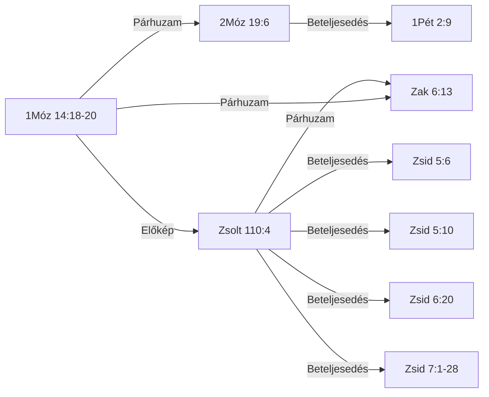

<!-- GENERÁLT: general.py --cel lexikon | rések: tematikus_lezart/Melkizedek_tematikus.md -->

# 📖 KIRALY-001 — Melkizedek — király-pap rendje, kenyér és bor

## Kivonat *(kézi)*

A motívum azt a lexikai azonosságot követi, amelyet a BDB H3548 (*kohén*) "pap-király" jelentés-kategóriája köt össze: Melkizedek (1Móz 14:18-20), Izráel kollektív "papok királysága" (2Móz 19:6), a dávidi eskü-ígéret (Zsolt 110:4), a próféciai "pap a trónon" kép (Zak 6:13) és a Zsidókhoz írt levél Krisztus-alkalmazása (Zsid 5-7) — kilenc tabulált igehely/igehelycsoport, öt lépéses kánoni íven. A legfontosabb lexikai lelet a τάξις (*taxis*, "rend") szó technikai súlya: a Zsidókhoz írt levél öt, minden kritikai kiadásban egységesen igazolt helyen (a hatodik, Zsid 7:21, szövegkritikailag nem egységes) a Melkizedek-rendet a lévitaival szembeállítható, önálló papi rendként azonosítja. Két önálló, egymástól független vitatott pont marad nyitva: Melkizedek kiléte (krisztofánia vs. irodalmi-retorikai olvasat) és az 1Móz 14↔Zsolt 110 kapcsolat iránya.

## Tartalomjegyzék

<!-- GENERÁLT-KEZDET: general.py --cel lexikon#KIRALY-001#tartalom | forrás:  | licenc: projekt-adat | ts=2026-09-22 -->

*Ez a blokk a lexikon-oldal 12 szakaszának tartalomjegyzékét adja (LEXV2_2_BRIEF.md G1).*

- [Kivonat](#kivonat)
- [Jelmagyarázat és rövidítések](#jelmagyarázat-és-rövidítések)
- [1. Előfordulások](#1-előfordulások)
- [1/b. Kizárt és vizsgált helyek](#1b-kizárt-és-vizsgált-helyek)
- [2. Szótári háttér](#2-szótári-háttér)
- [3. LXX-fordítói döntések](#3-lxx-fordítói-döntések)
- [4. Kereszthivatkozások](#4-kereszthivatkozások)
- [5. Kapcsolatok](#5-kapcsolatok)
- [6. Értelmezés](#6-értelmezés)
- [7. Módszertan és nyitott kérdések](#7-módszertan-és-nyitott-kérdések)
- [8. Irodalom és idézés](#8-irodalom-és-idézés)
- [Kolofon](#kolofon)

<!-- GENERÁLT-VÉGE: lexikon#KIRALY-001#tartalom -->

## Jelmagyarázat és rövidítések

<!-- GENERÁLT-KEZDET: general.py --cel lexikon#KIRALY-001#jelmagyarazat | forrás:  | licenc: projekt-adat | ts=2026-09-22 -->

*Ez a blokk közös, minden lexikon-oldalon szó szerint azonos szöveg (G10).*

**PaRDeS-szintek** (`sablonok/PaRDeS_gyorsreferencia.md`):
- **Peshat** — a szöveg szerinti, szó szerinti értelem.
- **Remez** — csak felismerés/azonosítás, következtetés nélkül.
- **Drash** — normatív, következtető, alkalmazó.
- **Sod** — fegyelmezett, csak szövegből levezethető, gematria/allegorizálás nélkül.

**Funkció:** a vers szerepe a motívum ívében — az `adat/SEMA.md` szerint
szabad szöveg (nincs zárt értékkészlet), az alábbi táblákban a motívum
saját study-jából átvett megnevezéssel szerepel.

**Rövidítések:** BDB (Brown–Driver–Briggs), TBESH/TBESG (Tyndale Bible
Encyclopedia — Strong's Hebrew/Greek), Thayer (Thayer's Greek Lexicon),
UBS (UBS Dictionary of New Testament Greek — Louw–Nida szemantikai
doménekkel), L–N (Louw–Nida doménkód), SDBH/SDGNT (Semantic Dictionary
of Biblical Hebrew/Greek), OSHL (Open Scriptures Hebrew Lexicon), TWOT
(Theological Wordbook of the Old Testament — csak számhivatkozás), TSK
(Treasury of Scripture Knowledge), KH (Károli-kereszthivatkozás), LXX
(Septuaginta), MT (Masoretic Text), KJV (King James Version).

A szótári fordításokban a πνεῦμα (pneuma) mindig *szellem*, a ψυχή
(pszükhé) *lélek*; a Károli-idézetek szövege változatlan (pl. »Lélek«).

<!-- GENERÁLT-VÉGE: lexikon#KIRALY-001#jelmagyarazat -->

## 1. Előfordulások

<!-- GENERÁLT-KEZDET: general.py --cel lexikon#KIRALY-001#elofordulasok | forrás: adat/elofordulasok.tsv, konkordancia/Karoli_1908.tsv, konkordancia/UBS_DNTG_referenciak.tsv, konkordancia/UBS_DNTG_jelentesek.tsv, adat/forditas_ubs.tsv | licenc: projekt-adat, közkincs, CC BY-SA 4.0 | ts=2026-09-22 -->

*Ez a blokk a `[ID: KIRALY-001]` motívum 9 igehely-sorát fedi az `elofordulasok.tsv`-ből, kanonikus sorrendben, a Károli-szöveggel (1/a) és az UBS-jelentés renderidejű hozzárendelésével (G3).*

| Igehely | Kulcsszó | Funkció | PaRDeS-szint | Strong | Szótári jelentés | UBS-jelentés | Megbízhatóság · azonosítás módja |
|---|---|---|---|---|---|---|---|
| [1Móz 14:18-20](#ige-1móz-14-18-20) | papja — כֹהֵ֖ן (kho.Hen) | 🌱 alap-előfordulás | Peshat | H3548 | BDB H3548 1 — pap-király | — *(ÓSZ)* | magas · tartalom-alapú[^1] |
| [2Móz 19:6](#ige-2móz-19-6) | papok — כֹּהֲנִ֖ים (ko.ha.Nim); מַמְלֶ֥כֶת (mam.Le.khet) | egyéni → kollektív szintre emelve | Remez | H3548+H4467 | BDB H3548 1 — egyszerre papok és királyok a nemzetekhez való viszonyukban | — *(ÓSZ)* | magas · tartalom-alapú[^2] |
| [Zsolt 76:3](#ige-zsolt-76-3) | Sálemben — שָׁלֵ֣ם (sha.Lem) | helynév-azonosítás, lexikai kapocs | Remez | H8004 | BDB H8004 — helynév, Jeruzsálem rövidüléseként/archaizáló neveként; a BDB explicit Zsolt 76:3-at idézi Gen 14:18 mellett | — *(ÓSZ)* | magas · tartalom-alapú[^3] |
| [Zsolt 110:4](#ige-zsolt-110-4) | Pap — כֹהֵ֥ן (kho.Hen) | próféciai megerősítés, dávidi szintre szűkítve | Remez | H3548 | BDB H3548 1 — messiási pap-király, mint Melkizedek | — *(ÓSZ)* | magas · tartalom-alapú[^4] |
| [Zak 6:13](#ige-zak-6-13) | pap — כֹהֵן֙ (kho.Hen); כִּסְא֔ (kis.') | explicit "pap a trónon" kép, próféciai megerősítés | Remez | H3548+H3678 | BDB H3548 1 — messiási pap és király | — *(ÓSZ)* | magas · tartalom-alapú[^5] |
| [Zsid 5:6](#ige-zsid-5-6) | rendje szerint — τάξιν (taxin) | krisztológiai betöltés, első idézet | Drash | G5010 | — | 58.21 — valamely dolog fajtája vagy típusa, más hasonló dolgokkal való szembeállítást és összehasonlítást feltételezve | magas · tartalom-alapú[^6] |
| [Zsid 5:10](#ige-zsid-5-10) | rendje szerint — τάξιν (taxin) | krisztológiai betöltés | Drash | G5010 | — | 58.21 — valamely dolog fajtája vagy típusa, más hasonló dolgokkal való szembeállítást és összehasonlítást feltételezve | magas · tartalom-alapú[^7] |
| [Zsid 6:20](#ige-zsid-6-20) | rendje szerint — τάξιν (taxin) | krisztológiai betöltés | Drash | G5010 | — | 58.21 — valamely dolog fajtája vagy típusa, más hasonló dolgokkal való szembeállítást és összehasonlítást feltételezve | magas · tartalom-alapú[^8] |
| [Zsid 7:1-28](#ige-zsid-7-1-28) | rendje szerint (G5010, 7:17); Apa nélkül (G0540, 7:3); anya nélkül (G0282, 7:3); nemzetség nélkül való (G0035, 7:3) — τάξιν (taxin); ἀμήτωρ (amētōr) | krisztológiai betöltés, teljes kifejtés | Drash/Sod | G5010+G0813+G0282 | — | G5010: 58.21 — valamely dolog fajtája vagy típusa, más hasonló dolgokkal való szembeállítást és összehasonlítást feltételezve *(jelölt, nem egyértelmű)* · G0813: *(nincs hozzárendelés)* · G0282: 10.17 — olyan személy, akinek anyjáról nincs feljegyzés, vagy akinek sohasem volt anyja, vagy akinek anyja meghalt *(jelölt, nem egyértelmű)* | magas · tartalom-alapú[^9] |

[^1]: proveniencia: scope=manual | forras=Melkizedek_tematikus.md | ts=2026-09-08 | igazolas: nincs
[^2]: proveniencia: scope=manual | forras=Melkizedek_tematikus.md | ts=2026-09-08 | igazolas: nincs
[^3]: proveniencia: scope=manual | forras=Melkizedek_tematikus.md | ts=2026-09-09 | igazolas: nincs
[^4]: proveniencia: scope=manual | forras=Melkizedek_tematikus.md | ts=2026-09-08 | igazolas: nincs
[^5]: proveniencia: scope=manual | forras=Melkizedek_tematikus.md | ts=2026-09-08 | igazolas: nincs
[^6]: proveniencia: scope=manual | forras=Melkizedek_tematikus.md | ts=2026-09-08 | igazolas: nincs
[^7]: proveniencia: scope=manual | forras=Melkizedek_tematikus.md | ts=2026-09-08 | igazolas: nincs
[^8]: proveniencia: scope=manual | forras=Melkizedek_tematikus.md | ts=2026-09-08 | igazolas: nincs
[^9]: proveniencia: scope=manual | forras=Melkizedek_tematikus.md | ts=2026-09-08 | igazolas: nincs

*Az UBS-jelentés csak újszövetségi soroknál áll: az UBS Greek New Testament Dictionary az Újszövetséget fedi.*

#### 1/a. Az igehelyek szövege

**1Móz 14:18-20**
*Melkhisédek pedig Sálem királya, kenyeret és bort hoza; ő pedig a Magasságos Istennek papja vala.*
*És megáldá őt, és monda: Áldott legyen Ábrám a Magasságos Istentől, ég és föld teremtőjétől.*
*Áldott a Magasságos Isten, a ki kezedbe adta ellenségeidet. És tizedet ada néki mindenből.*
Melkizedek, Sálem királya, egyszerre "a Felséges Isten papja" — kenyeret és bort hoz, megáldja Ábrámot, aki tizedet ad neki. Első előfordulás, minden előzmény és genealógia nélkül.
Funkció: a motívum legelső megjelenése

**2Móz 19:6**
*És lesztek ti nékem papok birodalma és szent nép. Ezek azok az ígék, melyeket el kell mondanod Izráel fiainak.*
"Ti pedig lesztek nékem papok királysága" — a Sínai-szövetségben Izráel egésze kap kollektív király-pap identitást, a lévita papság intézményesítése előtt. Ugyanaz a כֹּהֵן (kóhén) gyök, mint Melkizedeknél, de itt nem egy egyén, hanem egy egész nép viseli.

**Zsolt 76:3**
*Mert hajléka van Sálemben, és lakhelye Sionban.*
"Sálemben van az ő sátora, és lakóhelye Sionban" — a Sálem=Jeruzsálem/Sion azonosítás, ugyanazzal a Strong-számmal (H8004), mint 1Móz 14:18-nál — lexikai, nem csak tematikus kapcsolat.

**Zsolt 110:4**
*Megesküdt az Úr és meg nem másítja: Pap vagy te örökké Melkhisedek rendje szerint.*
"Megesküdt az Úr és meg nem másítja: Te vagy pap örökké Melkhisédek rendje szerint" — próféciai eskü-formula, dávidi/individuális szintre visszavéve a mintát.

**Zak 6:13**
*Mert ő fogja megépíteni az Úrnak templomát, és nagy lesz az ő dicsősége, és ülni és uralkodni fog az ő székében, és pap is lesz az ő székében, és békesség tanácsa lesz kettőjük között.*
"pap lesz az ő királyi székén" — próféciai kép egyetlen alakról, aki egyszerre ül a trónon és visel papi tisztséget.

**Zsid 5:6**
*Miképen másutt is mondja: Te örökké való pap vagy, Melkisédek rendje szerint.*
A Zsolt 110:4 első idézetei, bevezetve Krisztus főpapságának témáját.

**Zsid 5:10**
*Neveztetvén az Istentől Melkisédek rendje szerint való főpapnak.*
A Zsolt 110:4 idézése, Krisztus főpapságának bevezetése.

**Zsid 6:20**
*A hová útnyitóul bement érettünk Jézus, a ki örökké való főpap lett Melkisédek rendje szerint.*
A Zsolt 110:4 idézése, Krisztus "örökkévaló főpap Melkhisédek rendje szerint" bevezetése.

**Zsid 7:1-28**
*Mert ez a Melkisédek Sálem királya, a felséges Isten papja, a ki a királyok leveréséből visszatérő Ábrahámmal találkozván, őt megáldotta,*
*A kinek tizedet is adott Ábrahám mindenből: a ki elsőben is magyarázat szerint igazság királya, azután pedig Sálem királya is, azaz békesség királya,*
*Apa nélkül, anya nélkül, nemzetség nélkül való; sem napjainak kezdete, sem életének vége nincs, de hasonlóvá tétetvén az Isten Fiához, pap marad örökké.*
*Nézzétek meg pedig, mily nagy ez, a kinek a zsákmányból tizedet is adott Ábrahám, a pátriárka;*
*És bár azoknak, kik a Lévi fiai közül nyerik el a papságot, parancsolatjok van, hogy törvény szerint tizedet szedjenek a néptől, azaz az ő atyafiaiktól, jóllehet ők is az Ábrahám ágyékából származtak;*
*De az, a kinek nemzetsége nem azok közül való, tizedet vett Ábrahámtól, és az ígéretek birtokosát megáldotta,*
*Pedig minden ellenmondás nélkül való, hogy a nagyobb áldja meg a kisebbet.*
*És itt halandó emberek szednek tizedet, ott ellenben az, a ki bizonyság szerint él:*
*És hogy úgy szóljak, Ábrahámnál fogva tized vétetett Lévitől is, a tizedszedőtől,*
*Mert ő még az atyja ágyékában vala, a mikor annak elébe ment Melkisédek.*
*Ha tehát a lévitai papság által volna a tökéletesség (mert a nép ez alatt nyerte a törvényt): mi szükség tovább is mondogatni, hogy más pap támadjon a Melkisédek rendje szerint és ne az Áron rendje szerint?*
*Mert a papság megváltozásával szükségképen megváltozik a törvény is.*
*Mert a kiről ezek mondatnak, az más nemzetségből származott, a melyből senki sem szolgált az oltár körül;*
*Mert nyilvánvaló, hogy a mi Urunk Júdából támadott, a mely nemzetségre nézve semmit sem szólott Mózes a papságról.*
*És még inkább nyilvánvaló az, ha a Melkisédek hasonlatossága szerint áll elő más pap,*
*A ki nem testi parancsolatnak törvénye szerint, hanem enyészhetetlen életnek ereje szerint lett.*
*Mert ez a bizonyságtétel: Te pap vagy örökké, Melkisédek rendje szerint.*
*Mert az előbbi parancsolat eltöröltetik, mivelhogy erőtelen és haszontalan,*
*Minthogy a törvény semmiben sem szerzett tökéletességet; de beáll a jobb reménység, a mely által közeledünk az Istenhez.*
*És a mennyiben nem esküvés nélkül való, mert amazok esküvés nélkül lettek papokká,*
*De ez esküvéssel, az által, a ki azt mondá néki: Megesküdött az Úr, és nem bánja meg, te pap vagy örökké, Melkisédek rendje szerint:*
*Annyiban jobb szövetségnek lett kezesévé Jézus.*
*És amazok jóllehet többen lettek papokká, mert a halál miatt meg nem maradhattak:*
*De ennek, minthogy örökké megmarad, változhatatlan a papsága.*
*Ennekokáért ő mindenképen idvezítheti is azokat, a kik ő általa járulnak Istenhez, mert mindenha él, hogy esedezzék érettök.*
*Mert ilyen főpap illet vala minket, szent, ártatlan, szeplőtelen, a bűnösöktől elválasztott, és a ki az egeknél magasságosabb lőn,*
*A kinek nincs szüksége, mint a főpapoknak, hogy napról-napra előbb a saját bűneiért vigyen áldozatot, azután a népéiért, mert ezt egyszer megcselekedte, maga-magát megáldozván.*
*Mert a törvény gyarló embereket rendel főpapokká, de a törvény után való esküvés beszéde örök tökéletes Fiút.*
A Melkizedek-rend teljes kifejtése: nagyobb a lévita rendnél (a tized-jelenetből levezetve), örökkévaló (argumentum e silentio), a törvény megváltozásának alapja.

<!-- GENERÁLT-VÉGE: lexikon#KIRALY-001#elofordulasok -->

## 1/b. Kizárt és vizsgált helyek

<!-- GENERÁLT-KEZDET: general.py --cel lexikon#KIRALY-001#kizart | forrás: adat/jeloltek.tsv, adat/motivumok.tsv | licenc: projekt-adat | ts=2026-09-22 -->

*Ez a blokk a `[ID: KIRALY-001]` motívum 0 elutasított/nyitva maradt jelöltjét fedi a `jeloltek.tsv`-ből (G7).*

Nincs kizárt vagy nyitva maradt jelölt a `jeloltek.tsv`-ben ehhez a motívumhoz.

**Negatív kritérium** (`motivumok.tsv`): az igehelynek vagy név szerint Melkizedeket kell megneveznie/rá hivatkoznia (a "rendje szerint" formulával), vagy a BDB H3548 "priest-king" lexikai sense alá kell tartoznia — a puszta "pap" vagy "király" cím külön-külön nem elég (l. a BDB "chieftain (exercising priestly functions)" alkategória kizárása, Jetró/Dávid fiai/Ira)

<!-- GENERÁLT-VÉGE: lexikon#KIRALY-001#kizart -->

## 2. Szótári háttér

<!-- GENERÁLT-KEZDET: general.py --cel lexikon#KIRALY-001#szocikkek | forrás: adat/lexikon_hivatkozasok.tsv, konkordancia/BDB_teljes_unabridged.tsv, konkordancia/OSHL_lexikalis_index.tsv, konkordancia/SDBH_domenek.tsv, konkordancia/SDGNT_domenek.tsv, konkordancia/TBESG.txt, konkordancia/TBESH.txt, konkordancia/Thayer_teljes.tsv | licenc: CC BY 4.0, CC BY-SA 4.0, közkincs | ts=2026-09-22 -->

*Ez a blokk a `[ID: KIRALY-001]` motívum 7 Strong-tokenjét fedi, van jelentés-hivatkozással a `lexikon_hivatkozasok.tsv`-ből.*

### G0282 — ἀμήτωρ (amētōr)

**TWOT:** —

**Szemantikai domén:** 010002 Kinship Relations Involving Successive Generations

#### Thayer G282 — (teljes szócikk)

> G282 — ἀμήτωρ (ορος, ὁ, ἡ (μήτηρ), without a mother, motherless; in Greek writings: 1. born without a mother, e. g. Minerva, Euripides, Phoen. 666f, others; God himself, inasmuch as he is without origin, Lactantius, instt. 4, 13, 2. 2. bereft of a mother, Herodotus 4, 154, elsewhere. 3. born of a base or unknown mother, Euripides, Ion 109 cf. 837. 4. unmotherly, unworthy of the name of mother: μήτηρ ἀμήτωρ, Sophocles El. 1154. Cf. Bleek on Heb. vol. ii., 2, p. 305ff 5. in a significance unused by the Greeks, 'whose mother is not recorded in the genealogy': of Melchizedek, Heb 7:3; (of Sarah by Philo in de temul. § 14, and rer. div. haer. § 12; (cf. Bleek as above)); cf. the classic ἀνολυμπιάς.

*Fordítás függőben.*

*Forrás: konkordancia/Thayer_teljes.tsv*

### G0813 — ἄτακτος (ataktos)

**TWOT:** —

**Szemantikai domén:** 088032 Laziness, Idleness

#### Thayer G813 — (teljes szócikk)

> G813 — ἄτακτος ἄτακτον (τάσσω), disorderly, out of the ranks, (often so of soldiers); irregular, inordinate (ἀτακτοι ἡδοναι immoderate pleasures, Plato, legg. 2, 660 b.; Plutarch, de book educ. c. 7), deviating from the prescribed order or rule: 1Th 5:14, cf. 2Th 3:6. (In Greek writings from (Herodotus and) Thucydides down; often in Plato.)

*Fordítás függőben.*

*Forrás: konkordancia/Thayer_teljes.tsv*

### G5010 — τάξις (taxis)

**TWOT:** —

**Szemantikai domén:** 058004 Class, Kind, 061 Sequence, 062002 Organize [of events and states]

#### Thayer G5010 — (teljes szócikk)

> G5010 — τάξις τάξεως, ἡ (τάσσω), from Aeschylus and Herodotus down; 1. an arranging, arrangement. 2. order, i. e. a fixed succession observing also a fixed time: Luk 1:8. 3. due or right order: κατά τάξιν, in order, 1Co 14:40; orderly condition, Col 2:5 (some give it here a military sense, 'orderly array', see στερέωμα, c.). 4. the post, rank, or position which one holds in civil or other affairs; and since this position generally depends on one's talents, experience, resources, τάξις becomes equivalent to character, fashion, quality, style, (2 Macc. 9:18 2Macc. 1:19; οὐ γάρ ἱστορίας, ἀλλά κουρεακης λαλιᾶς ἐμοί δοκοῦσι τάξιν ἔχειν, Polybius 3, 20, 5): κατά τήν τάξιν (for which in Heb 7:15 we have κατά τήν ὁμοιότητα) Μελχισέδεκ, after the manner of the priesthood (A. V. order) of Melchizedek (according to the Sept. of Psa 109:5 עַל־דִּבְרָתִי), Heb 5:6, Heb 5:10; Heb 6:20; Heb 7:11, Heb 7:17, Heb 7:21 (where T Tr WH omit the phrase).

*Fordítás függőben.*

*Forrás: konkordancia/Thayer_teljes.tsv*

### H3548 — כֹּהֵן (ko.hen)

**TWOT:** 959a

**Szemantikai domén:** 001002007008 Priests

#### BDB H3548 — 1. jelentés

> 1 priest-king: e.g. Melchizedek Gen 14:18 (E ?), compare Psa 110:4 (the Messianic priest-king like Melchizedek); Zech 6:13 (Messianic priest and king); Israel כֹּהֲנִים מַמְלֶכֶת Exod 19:6 (E) a kingdom of priests (priests and kings at once in their relation to the nations); compare Isa 61:6 (of Israel ministering as a priest); or a chieftain (exercising priestly functions) מִדְיָן כֹּהֵן Exod 2:16; 3:1; 18:1 (all J E); so also probably the sons of David 2Sam 8:18, his grandson 1Kin 4:5, and Ira the Jairite 2Sam 20:26, who as princes performed priestly functions. With these we may class the כהנים Exod 19:22, 24 (J).

**🇭🇺** 1 pap-király: pl. Melkisédek 1Móz 14:18 (E ?), vö. Zsolt 110:4 (a Melkisédekhez hasonló messiási pap-király); Zak 6:13 (messiási pap és király); Izráel: כֹּהֲנִים מַמְלֶכֶת (mamlekhet kóhaním) 2Móz 19:6 (E), papok királysága (a népekhez való viszonyukban egyszerre papok és királyok); vö. Ézs 61:6 (Izráelről, amint papként szolgál); vagy törzsfő (aki papi feladatokat lát el): מִדְיָן כֹּהֵן (kóhén midján) 2Móz 2:16; 3:1; 18:1 (mind J E); így valószínűleg Dávid fiai is, 2Sám 8:18, az unokája, 1Kir 4:5, és a jairita Íra, 2Sám 20:26, akik fejedelmekként papi feladatokat végeztek. Velük sorolhatók a כהנים (kóhaním) is, 2Móz 19:22, 24 (J).

*Forrás: konkordancia/BDB_teljes_unabridged.tsv*

### H3678 — כִּסֵּא (kis.se)

**TWOT:** 1007

**Szemantikai domén:** 001002008001008 Furnishings, 002001002012 Great, 002003002007 Control

Nincs jelentés-hivatkozás a `lexikon_hivatkozasok.tsv`-ben.

### H4467 — מַמְלָכָה (mam.la.khah)

**TWOT:** 1199f

**Szemantikai domén:** 001002001 Land, 001002007004 Groups, 002001001 Attribute, 002003002007 Control

Nincs jelentés-hivatkozás a `lexikon_hivatkozasok.tsv`-ben.

### H8004 — שָׁלֵם (sha.lem)

**TWOT:** —

**Szemantikai domén:** 001002007003 Friends, 002001002008 Faithful, 002001003003 Complete, 002003001020 Whole, 002003003019 Safe, 003001010 Names of Locations

Nincs jelentés-hivatkozás a `lexikon_hivatkozasok.tsv`-ben.

<!-- GENERÁLT-VÉGE: lexikon#KIRALY-001#szocikkek -->

### 2/b. Kiegészítő szótári adatok *(kézi)*

Nincs kiegészítő szótári adat.

### Miért fontos ez a lelet *(kézi)*

**H3548 (כֹּהֵן, *kohén*)** — "pap." Első előfordulása a Szentírásban éppen itt, Melkizedeknél — még a lévita papság és a Sínai-törvény előtt.

**BDB H3548 — "priest-king" ("pap-király") jelentés:** a BDB szótár a כֹּהֵן szócikk 1. jelentésárnyalatát kifejezetten **"priest-king"** ("pap-király") címkével látja el, és ide sorolja együtt: Melkizedeket (1Móz 14:18), a "Messianic priest-king like Melchizedek" ("messiási pap-király, mint Melkizedek") minősítéssel Zsolt 110:4-et, a "Messianic priest and king" ("messiási pap és király") minősítéssel Zak 6:13-at, és Izráelt mint מַמְלֶכֶת כֹּהֲנִים (*mamlékhet kohaním*, 2Móz 19:6, "priests and kings at once in their relation to the nations" — "egyszerre papok és királyok a nemzetekhez való viszonyukban"), összevetésként Ézs 61:6-ot is megemlítve. **Ez a négy igehely tehát nem a jelen tanulmány szabad asszociációja, hanem magának a BDB-nek egy önálló, elkülönített lexikai jelentés-kategóriája.**

【NAPLO: verifikálva 2026.09.08-án; a négyforrásos audit ezt a kategorizálást önállóan, a study-tól függetlenül erősítette meg.】

⚡ **Fontos elhatárolás:** a BDB ugyanennél a szócikknél egy **másik, elkülönített** alkategóriát is felsorol — "chieftain (exercising priestly functions)" ("törzsfő, aki papi funkciót gyakorol") — Jetró (2Móz 2:16; 3:1; 18:1), Dávid fiai (2Sám 8:18), unokája (1Kir 4:5) és Ira jairita (2Sám 20:26) személyére. **Ez a lexikográfia szerint más jelentés**, nem tartozik a "priest-king" ("pap-király") kategóriához, ezért a jelen motívumba nem kerül be — a lexikai azonosság (ugyanaz a H3548 szó) itt nem jelent motívum-azonosságot.

【NAPLO: Q3 fegyelem (lexikai vs. tematikus kapcsolat szétválasztása) alkalmazva.】

**אֵל עֶלְיוֹן (*Él Eljón*, "Felséges Isten")** — szintén első előfordulás; Ábrám a 22. versben tudatosan azonosítja ezt a JHVH névvel, jelezve, hogy Melkizedek Istene és Ábrám Istene ugyanaz. Az אֵל/אֵלֹוהַּ + עֶלְיוֹן kombináció összesen **9** helyen fordul elő a teljes ÓSZ-ban, ebből **4 magán a Melkizedek-jeleneten belül** (1Móz 14:18,19,20,22) — a fennmaradó 5 hely: 4Móz 24:16 (Bálám-orákulum), Zsolt 57:3, 73:11, 78:35, 107:11.

【NAPLO: teljes-előfordulás scan a TAHOT-on, 2026.09.08.】

**עַל־דִּבְרָתִי מַלְכִּי־צֶדֶק (*al-divrátí Malki-Cedek*, "Melkhisédek rendje/módja szerint")** — a דִּבְרָה (*divrá*, H1700) ritka szó, jelentése "mód, ok, ügy." Ez a szó összesen mindössze **5** helyen fordul elő a teljes ÓSZ-ban (Jób 5:8, Zsolt 110:4, Préd 3:18, 7:14, 8:2) — jóval a `<50` ritkaság-küszöb alatt. A Septuaginta ezt **κατὰ τὴν τάξιν** (*kata tén taxin*) fordítással adja vissza. A *τάξις* (*taxis*) a hellenisztikus görögben technikai, adminisztratív-katonai és papi-rendi szó volt — papi "osztályokra", szolgálati "rendekre" (vö. az 1Krón 24-ben felsorolt lévita szolgálati rendek görög elnevezése is ezt a szócsaládot használja) utaló kifejezés.

【NAPLO: teljes-előfordulás scan a TAHOT-on, 2026.09.08 — a korábbi "ritka szó" minősítés ezzel a számadattal megerősítve.】

**Zsolt 110:4 — az eskü-formula.** "Megesküdt az Úr és meg nem másítja" (נִשְׁבַּע יְהוָה וְלֹא יִנָּחֵם, *nisbá Adonáj velo jinnáchém*). A "megesküdött" (H7650) és a tagadott "megmásítja" (H5162, *jinnáchém*) ige **egyetlen más helyen sem fordul elő együtt** a teljes Ószövetségben — a szöveg tudatosan a legerősebb rendelkezésre álló nyelvi eszközzel fejezi ki a kinevezés visszavonhatatlanságát. (Ugyanez az ige, יִנָּחֵם (*jinnáchém*), jelenik meg 1Sám 15:29-ben is, ott Saul elvetésének visszavonhatatlanságát kifejezve — ellentétes irányú isteni döntésre, de azonos nyelvi eszközzel: ez a kifejezés általában a véglegesség regisztere Istennél, nem csak erre a versre jellemző fordulat.)

【NAPLO: teljes-előfordulás scan a TAHOT-on (H7650+H5162 együttes előfordulás), 2026.09.08.】

**A megszólított — három-szereplős grammatika.** A zsoltár nyelvtana három, egymástól elkülönülő szerepet jelöl ki egyetlen tagmondaton belül: "Mondása az Úrnak az én Uramnak" (נְאֻם יְהוָה לַאדֹנִי, *neúm Adonáj ladóní*). JHVH a mondás alanya; "az én Uram" (אֲדֹנִי, *adóní*) a címzett; az elbeszélő (hagyomány szerint Dávid) pedig nincs jelen szereplőként ebben az isteni párbeszédben — kívülállóként figyeli meg, és a birtokos raggal ("az én Uram") csupán utólag, magára vonatkoztatva azonosítja a címzettet. Ez a kettős távolság — kívülálló megfigyelőként észleli a jelenetet, mégis a sajátjaként ismeri el a benne szereplő alakot — teszi lehetővé Jézus érvelését (Mt 22:41-45): Dávid nem egy jelenlévő emberhez szól, hanem egy rajta kívül eső, transzcendens jelenetről tesz birtokos-jelölésű kijelentést. Ez a nyelvtani tény önmagában eldönti, hogy a megszólított nem lehet Dávid maga.

**Melkizedek-alapú, nem lévita-alapú legitimáció.** A dávidi királyok Júda törzséből származtak, nem Lévi törzséből — törvényesen tehát semmilyen papi funkciót nem gyakorolhattak volna (vö. Uzziás büntetése, 2Krón 26:16-21, amikor egy király papi funkciót próbált gyakorolni). Ha a vers azt mondaná, "pap leszel, mint Áron", az egyenesen ellentmondana a Tórának. Ehelyett egy korábbi, Áron-előtti, ezért a lévita rendnek alá nem rendelt precedenshez — Melkizedekhez — nyúl vissza, és ebbe a kategóriába sorolja be a megígért tisztséget: nem "hasonló papságot" ígér, hanem egy már létező, régebbi és magasabb rangú kategóriába helyezi a leendő király-papot.

【NAPLO: a megszólított-kérdés (nyelvtanilag eldöntött) és a keletkezéskori regiszter kérdése (transzcendens/messiási vs. udvari tiszteletadás-konvenció) két külön kérdés — utóbbi a lenti ⚠️ (b) vitapont egyik dimenziója, nem önálló vitapont.】

A Zsidókhoz írt levél szerzője **öt kritikai szövegkiadásban egységesen igazolt** helyen alkalmazza ezt a LXX-kifejezést: **Zsid 5:6, 5:10, 6:20, 7:11, 7:17** (mindegyik NA28+NA27+SBL+WH+Treg+Tyn-ben). A **Zsid 7:21** hatodik előfordulása **csak a Textus Receptus/Bizánci szövegtípusban** igazolt, a modern kritikai kiadásokban (NA28, SBL, WH) nem szerepel ott a τάξις szó — ez tehát egy valódi szövegkritikai variáns. Az "ötször idézi" megállapítás a kritikai szövegre nézve pontos. **G5010 (τάξις) egyéb ÚSZ-előfordulásai** — Luk 1:8 (papi szolgálati rend/beosztás — más, nem "Melkizedek-rendi" jelentés), 1Kor 14:40 (általános "rendezettség"), Kol 2:5 (általános "rendezettség") — **tematikus rokonság nélkül, más BDB/lexikai jelentés**, ezért nem tartoznak a motívumhoz.

【NAPLO: teljes-előfordulás scan a TAGNT-on, 2026.09.08 — a korábbi zárójeles felsorolás, amely mind a hat helyet, 7:21-et is felsorolta, e lábjegyzet nélkül félrevezető volt.】

Ez az öt/hat-szörös hivatkozás tudatosan kihasználja a szó technikai súlyát: nem egyszerűen "Melkizedek módján" papságról beszél, hanem egy **önálló papi rendről/osztályról**, amely strukturálisan szembeállítható a lévita renddel (7:11: "ha tehát a lévitai papság által volna a tökéletesség... mi szükség még, hogy más pap támadjon a Melkhisédek rendje szerint"). Ez a nyelvi pontosítás erősíti a szerző argumentumát: nem költői metaforáról, hanem egy azonosítható, a lévitaival versengő papi struktúráról van szó.

**Zsid 7:20-22 — önálló, az eddigitől független eskü-érv.** A szerző nemcsak a "rendje" kifejezésre épít, hanem explicit magára az eskü-tényre is: "a mennyiben nem eskü nélkül lett pappá... annyival jobb szövetségnek lett kezesévé Jézus." A lévita papok eskü *nélkül* neveztettek ki; Krisztus eskü *mellett*, pontosan a Zsolt 110:4-et idézve. Ez egy, a τάξις-argumentumtól függetlenül is önálló bizonyítási vonal.

**Görög megfelelő (Zsid 7:3):** ἀπάτωρ, ἀμήτωρ, ἀγενεαλόγητος (*apátór, amétór, ageneálogétosz* — "apa nélkül, anya nélkül, nemzetség nélkül"). Ez nem azt állítja, hogy Melkizedeknek ténylegesen nem volt szülője vagy halála, hanem a Genezis **elhallgatásából** épít argumentumot: mivel a szövegben — szokatlan módon egy ilyen jelentőségű alaknál — nincs genealógia, sem halál-formula (ellentétben pl. az 1Móz 5. fejezet nemzetségtáblájának állandó "és meghala" refrénjével), ez az elhallgatás a szerző retorikájában **tipológiai jellé** válik: Melkizedek irodalmilag "örökkévalónak" jelenik meg, és ez teszi alkalmassá arra, hogy Krisztus örökkévaló papságának előképe legyen. **Deborah Rooke** (*Biblica* 90 [2009]) részletesen elemzi, hogyan építi fel a szerző ezt a *qal va-chomer* (a kisebbről a nagyobbra következtető) jellegű érvelést a genezisbeli hallgatásra alapozva — ez tudatos irodalmi-retorikai technika (*argumentum e silentio*, "hallgatásból való érvelés"), nem a szerző történeti-életrajzi állítása Melkizedek tényleges eredetéről.

**Grammatikai/szerzői konzisztencia:** mindhárom réteg (Genezis-elbeszélő, Dávid zsoltára, a Zsidókhoz írt levél) más szerzőtől, más korból származik, és a köztük lévő kapocs nem szó szerinti idézetlánc, hanem egy név + egy ritka szerkezet ("rendje") tudatos továbbvitele — a Zsid egyértelműen a Zsolt 110:4 LXX-megfogalmazását idézi szó szerint, míg az 1Móz 14 ↔ Zsolt 110 kapcsolat iránya tudományosan vitatott (l. lent, ⚠️ pont). A 2Móz 19:6 és Zak 6:13 kapcsolódása a fenti két igehelyhez **lexikai** (közös H3548 gyök), nem csupán tematikus.

【NAPLO: a Zak 6:13 ↔ Zsolt 110:4 kapcsolatot a TSK is önállóan, 9 szavazattal megerősíti. A Q3 elhatárolás (lexikai vs. tematikus kapcsolat szétválasztása) szerint ez a kapcsolat nem igényel "tematikus, nem lexikai" jelölést.】

⚡ **Mellőzött jelölt, pontosított indoklással:** 1Móz 14:19 "Magasságos Istennek… teremtőjétől" kifejezésben a קֹנֵה (H7069, "birtokló/alkotó") szó — teológiailag súlyos cím (vö. Péld 8:22): a gyök elsődleges jelentése "venni/birtokolni", de a szó egyszerre hordozza a "birtokosa" és az "alkotója" jelentést is (l. 0. pont, a bővített tanulmány 7. pontjának tárgyalása). Ez a *jelen*, Melkizedek-motívum szempontjából nem hordoz önálló többletet: az "Isten mint teremtő/birtokos" egy másik, önálló motívum tárgyköre, nem a "király-pap rendje" mintázaté.

【NAPLO: Q2 audit-átláthatóság — a 0. pont gyűjtése (2026.09.09) tárta fel, hogy a korábbi "nem ritka, egyik réteg sem épül rá" indoklás pontatlan volt: a szó valójában dokumentált a bővített tanulmányban, csak más motívumhoz tartozik.】

## 3. LXX-fordítói döntések

<!-- GENERÁLT-KEZDET: general.py --cel lexikon#KIRALY-001#lxx | forrás: konkordancia/LXX_OS/exodus.tsv, konkordancia/LXX_OS/genesis.tsv, konkordancia/LXX_OS/psalms-lxx.tsv, konkordancia/LXX_OS/zechariah.tsv | licenc: CC BY 4.0, projekt-adat | ts=2026-09-22 -->

*Ez a blokk a `[ID: KIRALY-001]` motívum ÓSZ-i előfordulásait veti össze az `LXX_OS`-szel (G5), soronként a Károli-vers minden versére.*

| Igehely (Károli) | LXX-igehely | Héber kulcsszó | Görög megfelelő | Egyezés | Forrás |
|---|---|---|---|---|---|
| 1Móz 14:18 | 1Móz 14:18 | כֹהֵ֖ן (kho.Hen) | — | kutatói azonosítás függőben | LXX_OS |
| 1Móz 14:19 | 1Móz 14:19 | — | — | kutatói azonosítás függőben | LXX_OS |
| 1Móz 14:20 | 1Móz 14:20 | — | — | kutatói azonosítás függőben | LXX_OS |
| Zsolt 76:3 | Zsolt(LXX) 75:3 | שָׁלֵ֣ם (sha.Lem) | — | kutatói azonosítás függőben | LXX_OS |
| 2Móz 19:6 | 2Móz 19:6 | כֹּהֲנִ֖ים (ko.ha.Nim) | — | kutatói azonosítás függőben | LXX_OS |
| Zsolt 110:4 | Zsolt(LXX) 109:4 | כֹהֵ֥ן (kho.Hen) | τάξιν (τάξις, taxis G5010) | egyező | LXX_OS |
| Zak 6:13 | Zak 6:13 | כֹהֵן֙ (kho.Hen) | — | kutatói azonosítás függőben | LXX_OS |

*Összesítés: egyező=1, eltérő=0, LXX-minusz=0, kutatói azonosítás függőben=6, szamozas_elteres=0.*

<!-- GENERÁLT-VÉGE: lexikon#KIRALY-001#lxx -->

## 4. Kereszthivatkozások

<!-- GENERÁLT-KEZDET: general.py --cel lexikon#KIRALY-001#kereszthivatkozasok | forrás: konkordancia/TSK_kereszthivatkozasok.tsv, konkordancia/Karoli_kereszthivatkozasok.tsv | licenc: CC BY 4.0, közkincs | ts=2026-09-22 -->

*Ez a blokk a `[ID: KIRALY-001]` motívum 9 igehelyét veti össze a TSK (Votes ≥ 15) és a Károli-KH táblával; 7 igehely ad legalább egy találatot (18 találat összesen), 2 igehely versenkénti kereséssel nem vizsgálható.*

#### 2Móz 19:6
- TSK: Jel 5:10 (Votes: 23)
- TSK: 1Pét 2:9 (Votes: 22)
- TSK: 1Pét 2:5 (Votes: 18)
- Károli-KH: 1Pét 2:9

#### Zsolt 76:3
- Károli-KH: Zsolt 132:13-14

#### Zsolt 110:4
- TSK: Zsid 7:17 (Votes: 25)
- TSK: Zsid 5:6 (Votes: 24)
- TSK: Zsid 7:21 (Votes: 22)
- TSK: 1Móz 14:18 (Votes: 15)
- Károli-KH: Zsid 5:6
- Károli-KH: Zsid 6:20
- Károli-KH: Zsid 7:17

#### Zak 6:13
- Károli-KH: Zak 11:4

#### Zsid 5:6
- TSK: Zsolt 110:4 (Votes: 21)
- Károli-KH: Zsolt 110:4

#### Zsid 5:10
- Károli-KH: 1Móz 14:18-20
- Károli-KH: Zsolt 110:4

#### Zsid 6:20
- Károli-KH: Jel 3:19

*Versenkénti kereséssel nem vizsgálható: 1Móz 14:18-20, Zsid 7:1-28.*

<!-- GENERÁLT-VÉGE: lexikon#KIRALY-001#kereszthivatkozasok -->

### Minősítés *(kézi)*

| Jelölt | Minősítés | Indoklás |
|---|---|---|
| 2Móz 19:6 | ✅ beépítve | H3548, BDB priest-king sense, önálló kollektív-szintű megjelenés |
| Zak 6:13 | ✅ beépítve | H3548+H3678, BDB priest-king sense, TSK-megerősített kapcsolat |
| Zsolt 76:3 | ✅ beépítve (0. pontból) | H8004 lexikai egyezés, korábban kihagyva a tematikus táblázatból |
| H7069 (קֹנֵה) | ❌ elutasítva, indokolt | más motívum (Isten mint teremtő/birtokos) tárgyköre, nem "priest-king" |
| BDB "chieftain" alkategória (Jetró stb.) | ❌ elutasítva, indokolt | más BDB-sense, lexikai azonosság motívum-azonosság nélkül |
| G5010 Luk 1:8, 1Kor 14:40, Kol 2:5 | ❌ elutasítva, indokolt | más sense (papi beosztás / általános rendezettség), nem "Melkizedek-rendi" |
| Zsid 7:21 (τάξις hatodik előfordulása) | ⚠️ szövegkritikai megjegyzéssel megtartva | csak TR/Bizánci szövegtípusban igazolt, NA28-ban nem |
| Kenneth Copeland (1Móz 14:22-23, Ábrám esküje) | ❌ elutasítva, indokolt | más igehely/téma a fejezeten belül, nem a Melkizedek-papság motívuma |
| 1Pét 2:9 | ✅ beépítve (2026.09.09, retroaktív pótlás) | szó szerinti LXX-idézés (βασίλειον ἱεράτευμα, azonos G0934+G2406 pár, mint LXX 2Móz 19:6) — lexikai, nem csak tematikus kapcsolat. **A TSK 2026.09.08-09-i auditja már megtalálta, de a minősítő táblázatból kimaradt — l. a Q2-szabály 2026.09.09-i kibővítését.** |
| Jel 1:6 | ❌ elutasítva, indokolt | tematikus párhuzam, de más görög szavak (βασιλείαν, ἱερεῖς — nem βασίλειον ἱεράτευμα) — nem szó szerinti LXX-idézés |
| Jel 5:10 | ❌ elutasítva, indokolt | ugyanaz, mint Jel 1:6 — tematikus párhuzam, más görög szavak, nem lexikai egyezés |

A teljes ✅ halmaz (2Móz 19:6, Zak 6:13, Zsolt 76:3) beépítve a study 1. pontjának táblázatába. A H7069 és a BDB "chieftain" alkategória, valamint a G5010 nem-releváns előfordulásai és a Copeland-forrás explicit elutasítva, dokumentált indokkal — egyik sem hallgatólagos kihagyás.

## 5. Kapcsolatok

<!-- GENERÁLT-KEZDET: general.py --cel lexikon#KIRALY-001#kapcsolatok | forrás: adat/kapcsolatok.tsv | licenc: projekt-adat | ts=2026-09-22 -->

*Ez a blokk a `[ID: KIRALY-001]` motívum 9 kapcsolat-sorát fedi a `kapcsolatok.tsv`-ből, 9 igehely-csomóponttal.*

| Forrás | Cél | Típus | Funkció | Bizonyosság | PaRDeS-szint |
|---|---|---|---|---|---|
| 1Móz 14:18-20 | 2Móz 19:6 | Párhuzam | egyéni eset → kollektív, nemzeti szintre emelve, lévita rend előtt | magas | Remez |
| 1Móz 14:18-20 | Zsolt 110:4 | Előkép | egyszeri esemény → örökkévaló, próféciai "rendé" emelve; TSK 14 szavazat | magas | Remez |
| Zsolt 110:4 | Zak 6:13 | Párhuzam | próféciai visszautalás → explicit "pap a trónon" kép; TSK 9 szavazat | magas | Remez |
| 1Móz 14:18-20 | Zak 6:13 | Párhuzam | közös H3548 priest-king sense; TSK csak 2 szavazat, gyenge megerősítés | közepes | Remez |
| 2Móz 19:6 | 1Pét 2:9 | Beteljesedés | szó szerinti LXX-idézés (βασίλειον ἱεράτευμα – baszileion hierateuma); TSK 22 szavazat | magas | Drash |
| Zsolt 110:4 | Zsid 5:6 | Beteljesedés | a Zsolt 110:4 első idézete, Krisztus főpapságának bevezetése | magas | Drash |
| Zsolt 110:4 | Zsid 5:10 | Beteljesedés | a Zsolt 110:4 idézése | magas | Drash |
| Zsolt 110:4 | Zsid 6:20 | Beteljesedés | a Zsolt 110:4 idézése | magas | Drash |
| Zsolt 110:4 | Zsid 7:1-28 | Beteljesedés | a Melkizedek-rend teljes kifejtése, a Zsolt 110:4 nyomán | magas | Drash/Sod |

Mermaid-ábra

<!-- GENERÁLT-VÉGE: lexikon#KIRALY-001#kapcsolatok -->

### Alátámasztás *(kézi)*

Az egyes kapcsolatok indoklása a fenti táblázat Funkció oszlopában áll; külön alátámasztás a tematikus tanulmányban nem készült.

## 6. Értelmezés *(kézi)*

**Peshat:** öt szöveg együttesen egy szokatlan, ismétlődő alakzatot rajzol ki. Egy Ábrahám-kori kánaáni király, aki egyúttal "a Felséges Isten papja" — olyan kombináció, amely a későbbi izraeli rendszerben (király és pap szigorúan elkülönített tisztsége) tiltott lett volna. Melkizedek kenyeret és bort hoz — nem áldozati állatot —, megáldja Ábrámot, és Ábrám önként tizedet ad neki. A Genezis-szöveg semmi mást nem közöl róla: nincs genealógiája, nincs halál-formulája, nem tér vissza többé. Városa, Sálem, azonos a későbbi Jeruzsálem/Sionnal — ezt Zsolt 76:3 ugyanazzal a szóval (H8004) erősíti meg, mint egy, a Genezistől független ószövetségi hang. Alig néhány fejezettel/évszázaddal később, a Sínai-hegynél, Isten **ugyanezt a kombinációt egy egész népre** ruházza: "lesztek nékem papok királysága" (2Móz 19:6) — még mielőtt a lévita papság a maga szigorú, elkülönített intézményeként megszerveződne. Zsolt 110:4 ezt az alakot próféciai mintaként emeli fel egy jövőbeli, immár egyénre (a dávidi királyra) szűkített királyi-papi tisztség számára; Zakariás egy generációval a fogság után explicit próféciai képet fest: "pap lesz az ő királyi székén" (Zak 6:13) — a kombináció ezúttal egyetlen jövőbeli alakra összpontosítva, trónon ülő papként. Zsid 5-7 pedig szisztematikusan kifejti, hogy ez a rend miért és hogyan alkalmazható Krisztusra.

**Remez:** a minta íve **öt lépésben** bontakozik ki, nem háromban. **Először** egy egyszeri, rejtélyes esemény (1Móz 14) — a szöveg szó szerint semmit nem magyaráz meg Melkizedek eredetéről vagy sorsáról. **Másodszor** ugyanez a kombináció — pap + király/uralkodó identitás — váratlanul **kollektív, nemzeti szintre** emelkedik (2Móz 19:6): Izráel egésze kap "papok királysága" elnevezést, még a lévita rend intézményesítése előtt, mintegy jelezve, hogy az egyedi Melkizedek-eset nem elszigetelt kuriózum volt, hanem egy szélesebb isteni minta korai megjelenése. **Harmadszor** egy próféciai visszautalás (Zsolt 110:4), amely az egyszeri genezisi eseményt egy örökkévaló, ismétlődő "rendé" emeli — itt már nem egyetlen történelmi személyről vagy egy egész népről, hanem egy dávidi tisztség-típusról van szó. **Negyedszer** egy önálló, explicit próféciai kép (Zak 6:13) — "pap az ő királyi székén" — amely a Zsolt 110:4 ígéretét vizuálisan, egyetlen trónon ülő alakban sűríti össze; a TSK ezt a kapcsolatot (Zsolt 110:4 ↔ Zak 6:13, 9 szavazat) önállóan, konkordancia-szinten is megerősíti. **Ötödször** egy teljes teológiai kifejtés (Zsid 5-7), amely a próféciai mintát Krisztusra alkalmazza, és a genezisbeli szűkszavúságot (amely Peshat-szinten puszta elbeszélői tömörség) tudatos tipológiai jellé formálja. **Ez a mintázat — egy egyedi eset ismétlődő visszatérése egyre táguló, majd ismét szűkülő körökben (egyén → nép → egyén → próféciai kép → Krisztus) — maga is a Remez tárgya:** azt mutatja, hogy a kánon nem egyszer, hanem többször, egymástól független szerzői rétegekben nyúl vissza ugyanahhoz a kombinációhoz, és hogy a szöveg hallgatása (Gen 14 szűkszavúsága) utólag tudatos teológiai jelentést kap.

**Drash:** a motívum központi tanítása immár háromrétegű. Először azt mutatja be, **honnan származik az áldás, és kinek jár a hála** — Ábrám tudatosan elfogadja Melkizedek áldását és tizedet ad, miközben visszautasítja Sodoma királyának vagyonát; a kettő közötti választás azt fejezi ki, hogy győzelmét és gazdagságát nem akarja emberi forrásnak tulajdonítani. Másodszor, a 2Móz 19:6-tal kiegészülve, a motívum azt is megmutatja, hogy **a király-pap identitás nem kizárólag egy elit, kiválasztott egyén kiváltsága volt** — Isten már a Sínainál felkínálta ezt a kettős identitást egész népének, mielőtt a Sínai utáni intézményrendszer (külön királyi és külön papi tisztség) ezt szétválasztotta volna. Harmadszor, mélyebb szinten, a motívum egy **Áron/lévita rendtől független, azt megelőző és felülmúló papi tekintélyt** mutat be — ez az alap, amelyre Zsid 7 építi Krisztus főpapságának érvelését: ha már Ábrahám, a lévita rend őse is tizedet adott és áldást fogadott el Melkizedektől, akkor a Melkizedek-rend eredendően nagyobb a lévitainál. A feszültség — hogy a "papok királysága" ígérete (2Móz 19:6) a Sínai utáni valóságban mégis kettéválik királyra és papra — nem elsimítandó ellentmondás, hanem maga is a Drash része: a történelem folyamán elveszített egység az, amit Zak 6:13 próféciailag ismét összekapcsol, és amit Zsid 7 szerint végül Krisztusban nyer vissza a maga teljességét.

**Sod** *(tömör, fegyelmezett)*: a kenyér és a bor, amelyet Melkizedek ad — ingyen, kérés nélkül, mielőtt bármit kapna —, előlegezi azt a mintát, amelyet Krisztus az utolsó vacsorán betölt. Isten kegyelme mindig **megelőzi** az ember válaszát: Melkizedek előbb ad, mint ahogy Ábrám tizedet adna; Izráel Sínainál még mielőtt bármit tett volna, már megkapja a "papok királysága" elnevezést, feltételként, nem jutalomként; Krisztus előbb hal meg és támad fel, mint ahogy a hívő bármit "adhatna" cserébe. A Melkizedek-rend örökkévalósága (Zsid 7:3, 7:16 — "levél nélkül való parancsolatnak ereje szerint, hanem enyészhetetlen életnek ereje szerint") azt jelzi, hogy Krisztus papsága nem emberi rendelés, hanem az élet legyőzhetetlen erejéből fakad — ugyanaz az erő, amely Zak 6:13 próféciai zárómondatában "a békesség tanácsaként" (עֲצַת שָׁלוֹם, *acát sálóm*) nyilvánul meg a pap és a király egysége között.

⚠️ **Vitatott pontok**

**(a) Melkizedek kiléte** — krisztofánia (Krisztus pre-inkarnációs megjelenése, a Zsid 7:3-at szó szerint véve — **Derek Prince** és a hagyományos pünkösdi/karizmatikus olvasat) vs. irodalmi-retorikai olvasat (a Zsid 7:3 a Genezis hallgatásából épített *argumentum e silentio*, nem metafizikai állítás egy konkrét történelmi király-papról — **Gordon Wenham, Kenneth Mathews, Victor Hamilton**). A rabbinikus hagyomány (Rási, *Nedárim* 32b) egy harmadik utat követ: Melkizedeket **Sémmel**, Noé fiával azonosítja, elkerülve egy azonosítatlan pogány pap teológiai problémáját.

**Két konkrét nyelvtani érv, mindkét fél számára — a Zsid 7:3 és 7:8 szó szerinti elemzéséből:**

*Az irodalmi-retorikai olvasat mellett — ἀφωμοιωμένος (*afomoioménosz*, ἀφομοιόω tőből, "hasonlóvá tenni/formálni", 7:3).* Ez egy **passzív**, befejezett melléknévi igenév (participium perfectum passivi): "**hasonlóvá téve** az Isten Fiához" (ἀφωμοιωμένος δὲ τῷ υἱῷ τοῦ θεοῦ, *afomoioménosz de tó hüió tú theú*). A passzív szerkezet nyelvtanilag **két különböző alakot** tételez fel — Melkizedek van hasonlóvá *téve* valaki *máshoz* (a Fiúhoz). Ha Melkizedek maga volna a Fiú (krisztofánia), a szöveg furcsán fogalmazna: nehezen értelmezhető, hogy egy alakról azt mondjuk, "hasonlóvá van téve" önmagához.

*A krisztofánia-olvasat mellett — μαρτυρούμενος ὅτι ζῇ (*martüruménosz hoti dzé*, "bizonyságul adatik, hogy él", 7:8).* A vers ellentétes párhuzam-szerkezetben (ὧδε [*hóde*, "itt"] μέν [*men*]... ἐκεῖ [*ekei*, "ott"] δέ [*de*]) áll: "itt egyfelől halandó emberek szednek tizedet, ott másfelől az, akiről bizonyságul adatik, hogy él." A μαρτυρούμενος (**passzív**, "bizonyságul **adatik**") a többségi olvasat szerint nem szó szerinti életrajzi állítás (Melkizedek nyilvánvalóan nem élt még a levél írásakor sem) — hanem retorikai fogás: a Genezis-szöveg *hallgatása* a haláláról kerül át "tanúságtétellé" (ugyanaz a μαρτυρ- tő, mint 7:17-nél Krisztusra alkalmazva, feltehetően tudatos szerzői párhuzamként). A krisztofánia-olvasat számára viszont ez a mondat **könnyebben olvasható szó szerinti ténymegállapításként** — nincs szükség a "hallgatásból bizonyságtétel" retorikai átfordításra, ha Melkizedek ténylegesen nem volt halandó.

**A két érv nem dönti el a vitát, hanem élesebbé teszi mindkét felet** — az ἀφωμοιωμένος passzívuma nyelvtani nehézséget okoz a krisztofánia-olvasatnak, a μαρτυρούμενος viszont annak kedvez. A study nem foglal állást, melyik nyom súlyosabb.

**(b) A Gen 14 ↔ Zsolt 110 kapcsolat iránya** — két, egymással szemben álló olvasat létezik a tudományos irodalomban:
- **Kritikai/redakciós irány (H.H. Rowley; P.J. Nel):** a Zsolt 110 korábbi, önálló királyi-ideológiai hagyományból származik (a jeruzsálemi királyi kultusz Melkizedek-öröksége felől), és az 1Móz 14:18-20 epizódja **utólagos visszavetítés** — a Genezis-elbeszélés Ábrámra vonatkoztatva "kanonizálja" a már létező jeruzsálemi papi-királyi hagyományt, nem pedig fordítva, hogy a zsoltár egy korábbi patriarchai eseményre emlékezne vissza.
- **Kanonikus/hagyományos irány (Derek Kidner; Bruce Waltke; Victor Hamilton):** a Zsolt 110:4 **tudatosan idézi/hivatkozik** az 1Móz 14 eseményére mint már ismert, rögzült hagyományra — Dávid (vagy a zsoltár szerzője) tudatosan von párhuzamot a maga királyi-papi tisztsége és az ősi, Ábrahám korából ismert Melkizedek-alak közé, hogy a dávidi dinasztia legitimitását egy Áron előtti, ezért a lévita rendtől független papi tekintélyhez kösse.

A projekt módszertani állásfoglalása: ez a vita a történeti-kritikai vs. kanonikus-irodalmi olvasat közötti szélesebb feszültség egyik konkrét megnyilvánulása — nem dönthető el pusztán filológiai eszközökkel, mivel mindkét olvasat konzisztens a rendelkezésre álló szöveggel. **Ez a két vita — (a) és (b) — egymástól független**: nem ugyanarról a kérdésről szól, és a projekt egyiket sem tekinti eldöntöttnek. A 2Móz 19:6 és Zak 6:13 bevonása egyik vitát sem dönti el, de a (b) vitát árnyalja: ha a "kritikai/redakciós irány" helyes, a 2Móz 19:6-nál dokumentált korai, kollektív "papok királysága" hagyomány önálló, a Zsolt 110-től és Gen 14-től is független tanúja lehet ugyanannak a régi ideológiai mintának — ez a lehetőség nyitva marad, nincs a projekt által eldöntve.

## 7. Módszertan és nyitott kérdések *(kézi)*

Az 1. pont friss keresése előtt végignézve a kötelező forrásokat:

- **`PaRDeS_motivumok.md`** — a motívum meglévő bejegyzése (l. 1. pont).
- **`genezis/1Moz_14_bovitett.md` 4. pontja** — három 🔗-blokk: Zsolt 76:3 (Sálem-azonosítás, Peshat), Zsolt 110:4 (már ismert), Zsid 7:2 (tized, Drash). **Zsolt 76:3 eddig hiányzott a tematikus táblázatból** — most pótolva.
- **`genezis/1Moz_14_bovitett.md` 7. pontja (Lexikai audit napló)** — a קֹנֵה (H7069, 1Móz 14:19) szót ott a bővített tanulmány már tárgyalja: a gyök elsődleges jelentése "venni/birtokolni", de a Károli "teremtőjétől" fordítást választja — a bővített tanulmány szerint ez tudatos kettősség (nem fordítási pontatlanság): a szó egyszerre hordozza a "birtokosa" és az "alkotója" jelentést, és Ábrám a 22. versben pont ezt a kettősséget használja ki, amikor a kánaáni "Felséges Isten" címet minden átmenet nélkül JHVH-ra vonatkoztatja. Ez pontosítja (nem cáfolja) a lenti ⚡ mellőzési döntést a jelen studyban: a szó nem "kiaknázatlan", csak a *jelen, Melkizedek-motívum* szempontjából nem hordoz önálló többletet.
- **Named teacher, más igehelyre, ezért a jelen motívum szempontjából nem releváns:** a bővített tanulmány szerint **Kenneth Copeland** (kcm.org, *"70 Scriptures That Prove God Is Your Source"*) az 1Móz 14:22-23-at (Ábrám esküje Sodoma királyának) tárgyalja "forrás-reveláció" témában — ez a fejezet egy másik jelenete (nem Melkizedek papsága/tizede), ezért a jelen motívum 5. pontjába nem kerül be.
- **"Nyitva maradó szál" jelzés:** nincs a bővített tanulmányban.
- **Kockázat-szűrő riport:** friss verzió nem található a repóban erre a motívumra.

Ez a tanulmány a Melkizedek-motívumot **kiegészíti**, nem duplikálja a naplóban már rögzített lezárást (v42, mélyelemzés) — a motívum már korábban "lezárt/önállóan feldolgozott mélyelemzési szálként" van megjelölve. E tanulmány (v2) hozzáadja a naplóhoz: (a) a motívum-szintű teljes Peshat/Remez/Drash/Sod bontást, immár öt igehelyre kiterjesztve; (b) két új, lexikailag (nem csak tematikusan) kapcsolódó igehelyet (2Móz 19:6, Zak 6:13), BDB-jelentés szinten is dokumentálva; (c) a nevesített tanítói keresés eredményét (Derek Prince ✅, a többi jóváhagyott tanítónál explicit gap-jelzés) — változatlanul a v1-ből. A `Lezart_tematikus_tanulmanyok_index.md`-ben a motívum mostantól **mindkét formában** szerepel: a "Lezárt mélyelemzések" szekcióban (a filológiai mélyelemzés) és a fő tematikus táblázatban is (a teljes PaRDeS-feldolgozás).

【NAPLO: v1 → v2 bővítés forrása és dátuma: 2026.09.08, chat-munkamenet, önálló négyforrásos audit (TAHOT/TAGNT teljes-előfordulás scan, TSK, Károli-Strong-kivonat, BDB online-ellenőrzés webes kereséssel — a repóban nincs önálló BDB-TSV, l. alábbi Q2 megjegyzés). Nem egy korábbi, elveszett munkamenet tartalmának felidézéséből.】

### Minőségi kapu (Quality Gate) — a Lezárási checklist előtt, `4_PaRDeS_tematikus_sablon.md` szerint

- [x] **Q1. Szerkezeti teljesség** — mind a 6 kötelező szakasz jelen van, egyik sem placeholder; a 3. pont (korábban hiányzott) most explicit Peshat/Remez/Drash/Sod bontással kiegészítve.
- [x] **Q2. Négyforrásos audit nyoma dokumentált** — TAHOT_kivonat.tsv, TAGNT_kivonat.tsv, TSK_kereszthivatkozasok.tsv, Karoli_Strong_kivonat.tsv teljes-előfordulás ellenőrzés lefutott, 2026.09.08. **Korlátozás explicit jelezve:** a repóban jelenleg nincs önálló `BDB_teljes_unabridged.tsv` fájl (l. `sablonok/Javasolt_sablon_kiegeszites_BDB_arnyalat.md` 11. pont, 4. tétel — a görög mélységi lexikon importja is még nyitott); a BDB H3548 "priest-king" ("pap-király") jelentés-adat ezért kivételesen **web_search-ből** származik, nem a determinisztikus repó-forrásból — ez a `Javasolt_sablon_kiegeszites_BDB_arnyalat.md` 3. pontja szerint "nem determinisztikus kiegészítés"-nek minősül, nem ⚡-jegyzetként rögzítve, hanem itt, a Q2 alatt explicit megnevezve.
- [x] **Q3. Lexikai vs. tematikus kapcsolat szétválasztva** — a BDB "chieftain" alkategória (Jetró, Dávid fiai) explicit kizárva mint más jelentés; a τáξις más ÚSZ-előfordulásai (Luk 1:8, 1Kor 14:40, Kol 2:5) explicit kizárva mint más jelentés/tematikus, nem motívum-azonos.
- [x] **Q4. Kereszt-motívum szennyeződés kizárva** — friss `grep` a teljes repón (2026.09.08): sem 2Móz 19:6, sem Zak 6:13 nem szerepel más motívum-fájlban.
- [x] **Q5. Nevesített tanítói szakasz jelen van** — 5. pont, Derek Prince ✅, öt jóváhagyott tanítónál explicit gap.

### Lezárási checklist (a `4_PaRDeS_tematikus_sablon.md` v12 szerint)

- [x] 1. Tanulmányfájl elkészítve — ez a fájl (`Melkizedek_tematikus.md`), a repóban él
- [x] 2. Motívumlog 1. szekció (Tematikus áttekintés) — frissítve 2026.09.10-én (`PaRDeS_motivumok.md`, commit `9b89ef9`)
- [x] 3. Motívumlog 2. szekció (Kulcsszó-index) — frissítve 2026.09.10-én, ugyanott
- [x] 4. Motívumlog 3. szekció (Részletes kulcsszó-magyarázatok) — frissítve 2026.09.10-én, "Visszahivatkozott bővített study-k" sorral kiegészítve
- [x] 5. Motívumlog 4. szekció (Könyv szerinti index) — frissítve 2026.09.10-én (2Mózes/Zakariás/1Péter sorok bővítve)
- [x] 6. Motívumlog 5. szekció (⭐ Emlékeztető küszöb) — nem érintett (a motívum sosem volt ott, küszöb előtti kivételes feldolgozás)
- [x] 7. Motívumlog 6. szekció (Előrejelzett motívumok) — nem érintett
- [x] 8. `Lezart_tematikus_tanulmanyok_index.md` frissítve — 2026.09.10-én, #8 sor
- [x] 9. Motívumlog fejléc-changelog frissítve — v53 bejegyzés, 2026.09.10
- [x] 10. GitHub-feltöltésre emlékeztetés — a fájl a repóban él, commitolva és pusholva (`melkizedek-checklist-sync-20260910` branch, commit `9b89ef9`)
- [x] 11. STEPBible-ellenőrzés dokumentálva — 🔍 STEPBible-ellenőrizve: H3548, H1700, H410, H5945, H7069 (TAHOT teljes ÓSZ), G5010, G0934, G2406 (TAGNT teljes ÚSZ), 2026.09.08–09
- [x] 12. Érintett bővített tanulmányok visszahivatkozása — `1Moz_14_bovitett.md` 📎-jegyzettel kiegészítve, 2026.09.10 (2Móz 19-nek és Zak 6-nak nincs saját bővített study-ja, ezért rájuk nem vonatkozik)

---

*Belső önellenőrzés elvégezve: kiejtés minden héber/görög szónál feltüntetve; a mélyelemzés filológiai eredményei (τάξις, Zsid 7:3 argumentum e silentio, Gen 14↔Zsolt 110 irány-vita) teljes egészében megismételve, hogy a fájl önmagában is olvasható legyen; ⚠️ két elkülönített vita explicit megkülönböztetve (Melkizedek kiléte vs. Gen 14↔Zsolt 110 irány), (b) vita kiegészítve a 2Móz 19:6-lelet lehetséges hatásával; nevesített tanítói keresés az öt lépéses módszertant követte, forrás-erősség jelölve (✅ Prince), hiány esetén explicit jelezve; igehely-formátum egységes; napló-jelölés 【NAPLO: ...】 formában, elkülönítve minden folyamat-jellegű megjegyzésnél; Napló-frissítés és Lezárási checklist elvégezve — **mind a 12 pont lezárva 2026.09.10-én** (l. fent); a korábbi, 2-5/8-9/10/12. pontokat nyitva hagyó megjegyzés elavult volt, törölve.*

## 8. Irodalom és idézés

<!-- GENERÁLT-KEZDET: general.py --cel lexikon#KIRALY-001#idezes | forrás:  | licenc: projekt-adat | ts=2026-09-25 -->

*Ez a blokk a `[ID: KIRALY-001]` motívum hivatkozási adatait, a ténylegesen felhasznált szótárakat (teljes névvel, forrásfájlonként) és az adatforrásokat adja (G9, LEXV2_3-ig szűkítve).*

**Hogyan hivatkozz:**
- ID: `KIRALY-001`
- Cím: Melkizedek — király-pap rendje, kenyér és bor
- Státusz: publikálható (`v2`, 2026.09.10)
- Generálva: 2026-09-25
- Fájl: `https://github.com/Basesoft777/Bible-Study/blob/main/lexikon/KIRALY-001_TUDOMANYOS.md`

**Felhasznált szótárak:**
- BDB (Brown–Driver–Briggs, A Hebrew and English Lexicon of the Old Testament, 1906) (`konkordancia/BDB_teljes_unabridged.tsv`, közkincs)
- LXX (Septuaginta — lxx-morph + GreekWordList szövegkorpusz) (`konkordancia/LXX_OS/exodus.tsv`, `konkordancia/LXX_OS/genesis.tsv`, `konkordancia/LXX_OS/psalms-lxx.tsv`, `konkordancia/LXX_OS/zechariah.tsv`, CC BY 4.0)
- OSHL (Open Scriptures Hebrew Lexicon) — csak TWOT-szám (`konkordancia/OSHL_lexikalis_index.tsv`, CC BY 4.0)
- SDBH (Semantic Dictionary of Biblical Hebrew) (`konkordancia/SDBH_domenek.tsv`, CC BY-SA 4.0)
- SDGNT (Semantic Dictionary of Biblical Greek) (`konkordancia/SDGNT_domenek.tsv`, CC BY-SA 4.0)
- TBESG (Tyndale Brief lexicon of Extended Strongs for Greek) (`konkordancia/TBESG.txt`, CC BY 4.0)
- TBESH (Tyndale Brief lexicon of Extended Strongs for Hebrew) (`konkordancia/TBESH.txt`, CC BY 4.0)
- TSK (Treasury of Scripture Knowledge) (`konkordancia/TSK_kereszthivatkozasok.tsv`, CC BY 4.0)
- Thayer (Thayer's Greek-English Lexicon of the New Testament) (`konkordancia/Thayer_teljes.tsv`, közkincs)
- UBS (UBS Dictionary of New Testament Greek — Louw–Nida szemantikai domének) (`konkordancia/UBS_DNTG_jelentesek.tsv`, `konkordancia/UBS_DNTG_referenciak.tsv`, CC BY-SA 4.0)

**Adatforrások:**
- `adat/elofordulasok.tsv` (projekt-adat)
- `adat/forditas_ubs.tsv` (projekt-adat)
- `adat/jeloltek.tsv` (projekt-adat)
- `adat/kapcsolatok.tsv` (projekt-adat)
- `adat/lexikon_hivatkozasok.tsv` (közkincs)
- `adat/motivumok.tsv` (projekt-adat)
- `konkordancia/Karoli_1908.tsv` (közkincs)
- `konkordancia/Karoli_kereszthivatkozasok.tsv` (közkincs)

<!-- GENERÁLT-VÉGE: lexikon#KIRALY-001#idezes -->

## Kolofon

<!-- GENERÁLT-KEZDET: general.py --cel lexikon#KIRALY-001#kolofon | forrás: adat/elofordulasok.tsv, adat/forditas_ubs.tsv, adat/jeloltek.tsv, adat/kapcsolatok.tsv, adat/lexikon_hivatkozasok.tsv, adat/motivumok.tsv, konkordancia/BDB_teljes_unabridged.tsv, konkordancia/Karoli_1908.tsv, konkordancia/Karoli_kereszthivatkozasok.tsv, konkordancia/LXX_OS/exodus.tsv, konkordancia/LXX_OS/genesis.tsv, konkordancia/LXX_OS/psalms-lxx.tsv, konkordancia/LXX_OS/zechariah.tsv, konkordancia/OSHL_lexikalis_index.tsv, konkordancia/SDBH_domenek.tsv, konkordancia/SDGNT_domenek.tsv, konkordancia/TBESG.txt, konkordancia/TBESH.txt, konkordancia/TSK_kereszthivatkozasok.tsv, konkordancia/Thayer_teljes.tsv, konkordancia/UBS_DNTG_jelentesek.tsv, konkordancia/UBS_DNTG_referenciak.tsv | licenc: CC BY 4.0, CC BY-SA 4.0, közkincs, projekt-adat | ts=2026-09-22 -->

*Ez a blokk a `[ID: KIRALY-001]` motívum törzsadatait (`motivumok.tsv`) és a lexikon-oldalon ténylegesen felhasznált forrásokat sorolja fel.*

| Mező | Érték |
|---|---|
| ID | `KIRALY-001` |
| Rövid UI-címke | Melkizedek-rend |
| Teljes cím | Melkizedek — király-pap rendje, kenyér és bor |
| Téma | Krisztológia |
| PaRDeS-szint | Drash/Sod |
| Státusz | publikálható (`v2`, 2026.09.10) |
| Azonosság típusa | lexikai |
| Negatív kritérium | az igehelynek vagy név szerint Melkizedeket kell megneveznie/rá hivatkoznia (a "rendje szerint" formulával), vagy a BDB H3548 "priest-king" lexikai sense alá kell tartoznia — a puszta "pap" vagy "király" cím külön-külön nem elég (l. a BDB "chieftain (exercising priestly functions)" alkategória kizárása, Jetró/Dávid fiai/Ira) |
| Fölérendelt fogalom | papi és királyi tisztség kombinációja általában (bármely "pap-király" szereplő, Melkizedekre/a H3548 priest-king sense-re való hivatkozás nélkül) |
| Forrás-study | `tematikus_lezart/Melkizedek_tematikus.md` |
| Kereszthivatkozás-napló | `tematikus_lezart/naplok/Melkizedek_tematikus_kereszthivatkozas_naplo.md` |
| Sablon-megfelelőség | v12 |

---

| Forrás | Fájl | Licenc | Blokk |
|---|---|---|---|
| `elofordulasok.tsv` | `adat/elofordulasok.tsv` | projekt-adat | elofordulasok |
| `forditas_ubs.tsv` | `adat/forditas_ubs.tsv` | projekt-adat | elofordulasok |
| `jeloltek.tsv` | `adat/jeloltek.tsv` | projekt-adat | kizart |
| `kapcsolatok.tsv` | `adat/kapcsolatok.tsv` | projekt-adat | kapcsolatok |
| `lexikon_hivatkozasok.tsv` | `adat/lexikon_hivatkozasok.tsv` | közkincs | szocikkek |
| `motivumok.tsv` | `adat/motivumok.tsv` | projekt-adat | kizart |
| `BDB_teljes_unabridged.tsv` | `konkordancia/BDB_teljes_unabridged.tsv` | közkincs | szocikkek |
| `Karoli_1908.tsv` | `konkordancia/Karoli_1908.tsv` | közkincs | elofordulasok |
| `Karoli_kereszthivatkozasok.tsv` | `konkordancia/Karoli_kereszthivatkozasok.tsv` | közkincs | kereszthivatkozasok |
| `exodus.tsv` | `konkordancia/LXX_OS/exodus.tsv` | CC BY 4.0 | lxx |
| `genesis.tsv` | `konkordancia/LXX_OS/genesis.tsv` | CC BY 4.0 | lxx |
| `psalms-lxx.tsv` | `konkordancia/LXX_OS/psalms-lxx.tsv` | CC BY 4.0 | lxx |
| `zechariah.tsv` | `konkordancia/LXX_OS/zechariah.tsv` | CC BY 4.0 | lxx |
| `OSHL_lexikalis_index.tsv` | `konkordancia/OSHL_lexikalis_index.tsv` | CC BY 4.0 | szocikkek |
| `SDBH_domenek.tsv` | `konkordancia/SDBH_domenek.tsv` | CC BY-SA 4.0 | szocikkek |
| `SDGNT_domenek.tsv` | `konkordancia/SDGNT_domenek.tsv` | CC BY-SA 4.0 | szocikkek |
| `TBESG.txt` | `konkordancia/TBESG.txt` | CC BY 4.0 | szocikkek |
| `TBESH.txt` | `konkordancia/TBESH.txt` | CC BY 4.0 | szocikkek |
| `TSK_kereszthivatkozasok.tsv` | `konkordancia/TSK_kereszthivatkozasok.tsv` | CC BY 4.0 | kereszthivatkozasok |
| `Thayer_teljes.tsv` | `konkordancia/Thayer_teljes.tsv` | közkincs | szocikkek |
| `UBS_DNTG_jelentesek.tsv` | `konkordancia/UBS_DNTG_jelentesek.tsv` | CC BY-SA 4.0 | elofordulasok |
| `UBS_DNTG_referenciak.tsv` | `konkordancia/UBS_DNTG_referenciak.tsv` | CC BY-SA 4.0 | elofordulasok |

<!-- GENERÁLT-VÉGE: lexikon#KIRALY-001#kolofon -->
