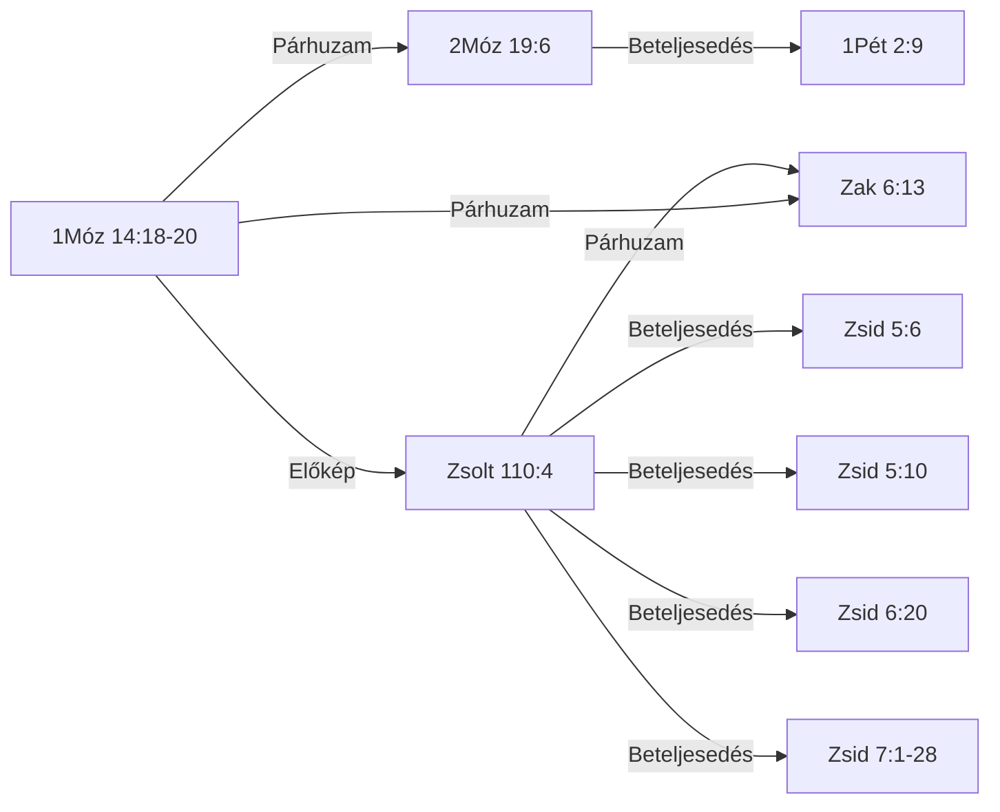

# 📖 KIRALY-001 — Melkizedek — király-pap rendje, kenyér és bor

## Kivonat *(kézi)*

*Kézzel írandó — 3-5 mondatos prózai kivonat: mi a motívum, milyen azonosság-típusú, hány igehelyen, mi a legfontosabb lexikai lelet.*

## Tartalomjegyzék

<!-- GENERÁLT-KEZDET: general.py --cel lexikon#KIRALY-001#tartalom | forrás:  | licenc: projekt-adat | ts=2026-09-22 -->

*Ez a blokk a lexikon-oldal 12 szakaszának tartalomjegyzékét adja (LEXV2_2_BRIEF.md G1).*

- [Kivonat](#kivonat)
- [Jelmagyarázat és rövidítések](#jelmagyarázat-és-rövidítések)
- [1. Előfordulások](#1-előfordulások)
- [1/b. Kizárt és vizsgált helyek](#1b-kizárt-és-vizsgált-helyek)
- [2. Szótári háttér](#2-szótári-háttér)
- [3. LXX-fordítói döntések](#3-lxx-fordítói-döntések)
- [4. Kereszthivatkozások](#4-kereszthivatkozások)
- [5. Kapcsolatok](#5-kapcsolatok)
- [6. Értelmezés](#6-értelmezés)
- [7. Módszertan és nyitott kérdések](#7-módszertan-és-nyitott-kérdések)
- [8. Irodalom és idézés](#8-irodalom-és-idézés)
- [Kolofon](#kolofon)

<!-- GENERÁLT-VÉGE: lexikon#KIRALY-001#tartalom -->

## Jelmagyarázat és rövidítések

<!-- GENERÁLT-KEZDET: general.py --cel lexikon#KIRALY-001#jelmagyarazat | forrás:  | licenc: projekt-adat | ts=2026-09-22 -->

*Ez a blokk közös, minden lexikon-oldalon szó szerint azonos szöveg (G10).*

**PaRDeS-szintek** (`sablonok/PaRDeS_gyorsreferencia.md`):
- **Peshat** — a szöveg szerinti, szó szerinti értelem.
- **Remez** — csak felismerés/azonosítás, következtetés nélkül.
- **Drash** — normatív, következtető, alkalmazó.
- **Sod** — fegyelmezett, csak szövegből levezethető, gematria/allegorizálás nélkül.

**Funkció:** a vers szerepe a motívum ívében — az `adat/SEMA.md` szerint
szabad szöveg (nincs zárt értékkészlet), az alábbi táblákban a motívum
saját study-jából átvett megnevezéssel szerepel.

**Rövidítések:** BDB (Brown–Driver–Briggs), TBESH/TBESG (Tyndale Bible
Encyclopedia — Strong's Hebrew/Greek), Thayer (Thayer's Greek Lexicon),
UBS (UBS Dictionary of New Testament Greek — Louw–Nida szemantikai
doménekkel), L–N (Louw–Nida doménkód), SDBH/SDGNT (Semantic Dictionary
of Biblical Hebrew/Greek), OSHL (Open Scriptures Hebrew Lexicon), TWOT
(Theological Wordbook of the Old Testament — csak számhivatkozás), TSK
(Treasury of Scripture Knowledge), KH (Károli-kereszthivatkozás), LXX
(Septuaginta), MT (Masoretic Text), KJV (King James Version).

A szótári fordításokban a πνεῦμα (pneuma) mindig *szellem*, a ψυχή
(pszükhé) *lélek*; a Károli-idézetek szövege változatlan (pl. »Lélek«).

<!-- GENERÁLT-VÉGE: lexikon#KIRALY-001#jelmagyarazat -->

## 1. Előfordulások

<!-- GENERÁLT-KEZDET: general.py --cel lexikon#KIRALY-001#elofordulasok | forrás: adat/elofordulasok.tsv, konkordancia/Karoli_1908.tsv, konkordancia/UBS_DNTG_referenciak.tsv, konkordancia/UBS_DNTG_jelentesek.tsv, adat/forditas_ubs.tsv | licenc: projekt-adat, közkincs, CC BY-SA 4.0 | ts=2026-09-22 -->

*Ez a blokk a `[ID: KIRALY-001]` motívum 9 igehely-sorát fedi az `elofordulasok.tsv`-ből, kanonikus sorrendben, a Károli-szöveggel (1/a) és az UBS-jelentés renderidejű hozzárendelésével (G3).*

| Igehely | Kulcsszó | Funkció | PaRDeS-szint | Strong | Szótári jelentés | UBS-jelentés | Megbízhatóság · azonosítás módja |
|---|---|---|---|---|---|---|---|
| [1Móz 14:18-20](#ige-1móz-14-18-20)[^1] | papja — כֹהֵ֖ן (kho.Hen) | 🌱 alap-előfordulás — a motívum legelső megjelenése | Peshat | H3548 | BDB H3548 1 — pap-király | — | magas · tartalom-alapú |
| [2Móz 19:6](#ige-2móz-19-6)[^2] | papok — כֹּהֲנִ֖ים (ko.ha.Nim); מַמְלֶ֥כֶת (mam.Le.khet) | egyéni → kollektív szintre emelve | Remez | H3548+H4467 | BDB H3548 1 — egyszerre papok és királyok a nemzetekhez való viszonyukban | — | magas · tartalom-alapú |
| [Zsolt 76:3](#ige-zsolt-76-3)[^3] | Sálemben — שָׁלֵ֣ם (sha.Lem) | helynév-azonosítás, lexikai kapocs | Remez | H8004 | BDB H8004 — helynév, Jeruzsálem rövidüléseként/archaizáló neveként; a BDB explicit Zsolt 76:3-at idézi Gen 14:18 mellett | — | magas · tartalom-alapú |
| [Zsolt 110:4](#ige-zsolt-110-4)[^4] | Pap — כֹהֵ֥ן (kho.Hen) | próféciai megerősítés, dávidi szintre szűkítve | Remez | H3548 | BDB H3548 1 — messiási pap-király, mint Melkizedek | — | magas · tartalom-alapú |
| [Zak 6:13](#ige-zak-6-13)[^5] | pap — כֹהֵן֙ (kho.Hen); כִּסְא֔ (kis.') | explicit "pap a trónon" kép, próféciai megerősítés | Remez | H3548+H3678 | BDB H3548 1 — messiási pap és király | — | magas · tartalom-alapú |
| [Zsid 5:6](#ige-zsid-5-6)[^6] | rendje szerint — τάξιν (taxin) | krisztológiai betöltés, első idézet | Drash | G5010 | — | 58.21 — valamely dolog fajtája vagy típusa, más hasonló dolgokkal való szembeállítást és összehasonlítást feltételezve | magas · tartalom-alapú |
| [Zsid 5:10](#ige-zsid-5-10)[^7] | rendje szerint — τάξιν (taxin) | krisztológiai betöltés | Drash | G5010 | — | 58.21 — valamely dolog fajtája vagy típusa, más hasonló dolgokkal való szembeállítást és összehasonlítást feltételezve | magas · tartalom-alapú |
| [Zsid 6:20](#ige-zsid-6-20)[^8] | rendje szerint — τάξιν (taxin) | krisztológiai betöltés | Drash | G5010 | — | 58.21 — valamely dolog fajtája vagy típusa, más hasonló dolgokkal való szembeállítást és összehasonlítást feltételezve | magas · tartalom-alapú |
| [Zsid 7:1-28](#ige-zsid-7-1-28)[^9] | rendje szerint (G5010, 7:17); Apa nélkül (G0540, 7:3); anya nélkül (G0282, 7:3); nemzetség nélkül való (G0035, 7:3) — τάξιν (taxin); ἀμήτωρ, (amētōr) | krisztológiai betöltés, teljes kifejtés | Drash/Sod | G5010+G0813+G0282 | — | 58.21 — valamely dolog fajtája vagy típusa, más hasonló dolgokkal való szembeállítást és összehasonlítást feltételezve *(jelölt, nem egyértelmű)*; 10.17 — olyan személy, akinek anyjáról nincs feljegyzés, vagy akinek sohasem volt anyja, vagy akinek anyja meghalt *(jelölt, nem egyértelmű)* | magas · tartalom-alapú |

[^1]: proveniencia: scope=manual | forras=Melkizedek_tematikus.md | ts=2026-09-08 | igazolas: nincs
[^2]: proveniencia: scope=manual | forras=Melkizedek_tematikus.md | ts=2026-09-08 | igazolas: nincs
[^3]: proveniencia: scope=manual | forras=Melkizedek_tematikus.md | ts=2026-09-09 | igazolas: nincs
[^4]: proveniencia: scope=manual | forras=Melkizedek_tematikus.md | ts=2026-09-08 | igazolas: nincs
[^5]: proveniencia: scope=manual | forras=Melkizedek_tematikus.md | ts=2026-09-08 | igazolas: nincs
[^6]: proveniencia: scope=manual | forras=Melkizedek_tematikus.md | ts=2026-09-08 | igazolas: nincs
[^7]: proveniencia: scope=manual | forras=Melkizedek_tematikus.md | ts=2026-09-08 | igazolas: nincs
[^8]: proveniencia: scope=manual | forras=Melkizedek_tematikus.md | ts=2026-09-08 | igazolas: nincs
[^9]: proveniencia: scope=manual | forras=Melkizedek_tematikus.md | ts=2026-09-08 | igazolas: nincs

#### 1/a. Az igehelyek szövege

**1Móz 14:18-20**
*Melkhisédek pedig Sálem királya, kenyeret és bort hoza; ő pedig a Magasságos Istennek papja vala.*
*És megáldá őt, és monda: Áldott legyen Ábrám a Magasságos Istentől, ég és föld teremtőjétől.*
*Áldott a Magasságos Isten, a ki kezedbe adta ellenségeidet. És tizedet ada néki mindenből.*
Melkizedek, Sálem királya, egyszerre "a Felséges Isten papja" — kenyeret és bort hoz, megáldja Ábrámot, aki tizedet ad neki. Első előfordulás, minden előzmény és genealógia nélkül.

**2Móz 19:6**
*És lesztek ti nékem papok birodalma és szent nép. Ezek azok az ígék, melyeket el kell mondanod Izráel fiainak.*
"Ti pedig lesztek nékem papok királysága" — a Sínai-szövetségben Izráel egésze kap kollektív király-pap identitást, a lévita papság intézményesítése előtt. Ugyanaz a כֹּהֵן gyök, mint Melkizedeknél, de itt nem egy egyén, hanem egy egész nép viseli.

**Zsolt 76:3**
*Mert hajléka van Sálemben, és lakhelye Sionban.*
"Sálemben van az ő sátora, és lakóhelye Sionban" — a Sálem=Jeruzsálem/Sion azonosítás, ugyanazzal a Strong-számmal (H8004), mint 1Móz 14:18-nál — lexikai, nem csak tematikus kapcsolat.

**Zsolt 110:4**
*Megesküdt az Úr és meg nem másítja: Pap vagy te örökké Melkhisedek rendje szerint.*
"Megesküdt az Úr és meg nem másítja: Te vagy pap örökké Melkhisédek rendje szerint" — próféciai eskü-formula, dávidi/individuális szintre visszavéve a mintát.

**Zak 6:13**
*Mert ő fogja megépíteni az Úrnak templomát, és nagy lesz az ő dicsősége, és ülni és uralkodni fog az ő székében, és pap is lesz az ő székében, és békesség tanácsa lesz kettőjük között.*
"pap lesz az ő királyi székén" — próféciai kép egyetlen alakról, aki egyszerre ül a trónon és visel papi tisztséget.

**Zsid 5:6**
*Miképen másutt is mondja: Te örökké való pap vagy, Melkisédek rendje szerint.*
A Zsolt 110:4 első idézetei, bevezetve Krisztus főpapságának témáját.

**Zsid 5:10**
*Neveztetvén az Istentől Melkisédek rendje szerint való főpapnak.*
A Zsolt 110:4 idézése, Krisztus főpapságának bevezetése.

**Zsid 6:20**
*A hová útnyitóul bement érettünk Jézus, a ki örökké való főpap lett Melkisédek rendje szerint.*
A Zsolt 110:4 idézése, Krisztus "örökkévaló főpap Melkhisédek rendje szerint" bevezetése.

**Zsid 7:1-28**
*Mert ez a Melkisédek Sálem királya, a felséges Isten papja, a ki a királyok leveréséből visszatérő Ábrahámmal találkozván, őt megáldotta,*
*A kinek tizedet is adott Ábrahám mindenből: a ki elsőben is magyarázat szerint igazság királya, azután pedig Sálem királya is, azaz békesség királya,*
*Apa nélkül, anya nélkül, nemzetség nélkül való; sem napjainak kezdete, sem életének vége nincs, de hasonlóvá tétetvén az Isten Fiához, pap marad örökké.*
*Nézzétek meg pedig, mily nagy ez, a kinek a zsákmányból tizedet is adott Ábrahám, a pátriárka;*
*És bár azoknak, kik a Lévi fiai közül nyerik el a papságot, parancsolatjok van, hogy törvény szerint tizedet szedjenek a néptől, azaz az ő atyafiaiktól, jóllehet ők is az Ábrahám ágyékából származtak;*
*De az, a kinek nemzetsége nem azok közül való, tizedet vett Ábrahámtól, és az ígéretek birtokosát megáldotta,*
*Pedig minden ellenmondás nélkül való, hogy a nagyobb áldja meg a kisebbet.*
*És itt halandó emberek szednek tizedet, ott ellenben az, a ki bizonyság szerint él:*
*És hogy úgy szóljak, Ábrahámnál fogva tized vétetett Lévitől is, a tizedszedőtől,*
*Mert ő még az atyja ágyékában vala, a mikor annak elébe ment Melkisédek.*
*Ha tehát a lévitai papság által volna a tökéletesség (mert a nép ez alatt nyerte a törvényt): mi szükség tovább is mondogatni, hogy más pap támadjon a Melkisédek rendje szerint és ne az Áron rendje szerint?*
*Mert a papság megváltozásával szükségképen megváltozik a törvény is.*
*Mert a kiről ezek mondatnak, az más nemzetségből származott, a melyből senki sem szolgált az oltár körül;*
*Mert nyilvánvaló, hogy a mi Urunk Júdából támadott, a mely nemzetségre nézve semmit sem szólott Mózes a papságról.*
*És még inkább nyilvánvaló az, ha a Melkisédek hasonlatossága szerint áll elő más pap,*
*A ki nem testi parancsolatnak törvénye szerint, hanem enyészhetetlen életnek ereje szerint lett.*
*Mert ez a bizonyságtétel: Te pap vagy örökké, Melkisédek rendje szerint.*
*Mert az előbbi parancsolat eltöröltetik, mivelhogy erőtelen és haszontalan,*
*Minthogy a törvény semmiben sem szerzett tökéletességet; de beáll a jobb reménység, a mely által közeledünk az Istenhez.*
*És a mennyiben nem esküvés nélkül való, mert amazok esküvés nélkül lettek papokká,*
*De ez esküvéssel, az által, a ki azt mondá néki: Megesküdött az Úr, és nem bánja meg, te pap vagy örökké, Melkisédek rendje szerint:*
*Annyiban jobb szövetségnek lett kezesévé Jézus.*
*És amazok jóllehet többen lettek papokká, mert a halál miatt meg nem maradhattak:*
*De ennek, minthogy örökké megmarad, változhatatlan a papsága.*
*Ennekokáért ő mindenképen idvezítheti is azokat, a kik ő általa járulnak Istenhez, mert mindenha él, hogy esedezzék érettök.*
*Mert ilyen főpap illet vala minket, szent, ártatlan, szeplőtelen, a bűnösöktől elválasztott, és a ki az egeknél magasságosabb lőn,*
*A kinek nincs szüksége, mint a főpapoknak, hogy napról-napra előbb a saját bűneiért vigyen áldozatot, azután a népéiért, mert ezt egyszer megcselekedte, maga-magát megáldozván.*
*Mert a törvény gyarló embereket rendel főpapokká, de a törvény után való esküvés beszéde örök tökéletes Fiút.*
A Melkizedek-rend teljes kifejtése: nagyobb a lévita rendnél (a tized-jelenetből levezetve), örökkévaló (argumentum e silentio), a törvény megváltozásának alapja.

<!-- GENERÁLT-VÉGE: lexikon#KIRALY-001#elofordulasok -->

## 1/b. Kizárt és vizsgált helyek

<!-- GENERÁLT-KEZDET: general.py --cel lexikon#KIRALY-001#kizart | forrás: adat/jeloltek.tsv, adat/motivumok.tsv | licenc: projekt-adat | ts=2026-09-22 -->

*Ez a blokk a `[ID: KIRALY-001]` motívum 0 elutasított/nyitva maradt jelöltjét fedi a `jeloltek.tsv`-ből (G7).*

Nincs kizárt vagy nyitva maradt jelölt a `jeloltek.tsv`-ben ehhez a motívumhoz.

**Negatív kritérium** (`motivumok.tsv`): az igehelynek vagy név szerint Melkizedeket kell megneveznie/rá hivatkoznia (a "rendje szerint" formulával), vagy a BDB H3548 "priest-king" lexikai sense alá kell tartoznia — a puszta "pap" vagy "király" cím külön-külön nem elég (l. a BDB "chieftain (exercising priestly functions)" alkategória kizárása, Jetró/Dávid fiai/Ira)

<!-- GENERÁLT-VÉGE: lexikon#KIRALY-001#kizart -->

## 2. Szótári háttér

<!-- GENERÁLT-KEZDET: general.py --cel lexikon#KIRALY-001#szocikkek | forrás: adat/lexikon_hivatkozasok.tsv, konkordancia/BDB_teljes_unabridged.tsv, konkordancia/OSHL_lexikalis_index.tsv, konkordancia/SDBH_domenek.tsv, konkordancia/SDGNT_domenek.tsv, konkordancia/TBESG.txt, konkordancia/TBESH.txt, konkordancia/Thayer_teljes.tsv | licenc: CC BY 4.0, CC BY-SA 4.0, közkincs | ts=2026-09-22 -->

*Ez a blokk a `[ID: KIRALY-001]` motívum 7 Strong-tokenjét fedi, van jelentés-hivatkozással a `lexikon_hivatkozasok.tsv`-ből.*

### G0282 — ἀμήτωρ (amētōr)

**TWOT:** —

**Szemantikai domén:** 010002 Kinship Relations Involving Successive Generations

#### Thayer G282 — (teljes szócikk)

> G282 — ἀμήτωρ (ορος, ὁ, ἡ (μήτηρ), without a mother, motherless; in Greek writings: 1. born without a mother, e. g. Minerva, Euripides, Phoen. 666f, others; God himself, inasmuch as he is without origin, Lactantius, instt. 4, 13, 2. 2. bereft of a mother, Herodotus 4, 154, elsewhere. 3. born of a base or unknown mother, Euripides, Ion 109 cf. 837. 4. unmotherly, unworthy of the name of mother: μήτηρ ἀμήτωρ, Sophocles El. 1154. Cf. Bleek on Heb. vol. ii., 2, p. 305ff 5. in a significance unused by the Greeks, 'whose mother is not recorded in the genealogy': of Melchizedek, Heb 7:3; (of Sarah by Philo in de temul. § 14, and rer. div. haer. § 12; (cf. Bleek as above)); cf. the classic ἀνολυμπιάς.

*Fordítás függőben.*

*Forrás: konkordancia/Thayer_teljes.tsv*

### G0813 — ἄτακτος (ataktos)

**TWOT:** —

**Szemantikai domén:** 088032 Laziness, Idleness

#### Thayer G813 — (teljes szócikk)

> G813 — ἄτακτος ἄτακτον (τάσσω), disorderly, out of the ranks, (often so of soldiers); irregular, inordinate (ἀτακτοι ἡδοναι immoderate pleasures, Plato, legg. 2, 660 b.; Plutarch, de book educ. c. 7), deviating from the prescribed order or rule: 1Th 5:14, cf. 2Th 3:6. (In Greek writings from (Herodotus and) Thucydides down; often in Plato.)

*Fordítás függőben.*

*Forrás: konkordancia/Thayer_teljes.tsv*

### G5010 — τάξις (taxis)

**TWOT:** —

**Szemantikai domén:** 058004 Class, Kind, 061 Sequence, 062002 Organize [of events and states]

#### Thayer G5010 — (teljes szócikk)

> G5010 — τάξις τάξεως, ἡ (τάσσω), from Aeschylus and Herodotus down; 1. an arranging, arrangement. 2. order, i. e. a fixed succession observing also a fixed time: Luk 1:8. 3. due or right order: κατά τάξιν, in order, 1Co 14:40; orderly condition, Col 2:5 (some give it here a military sense, 'orderly array', see στερέωμα, c.). 4. the post, rank, or position which one holds in civil or other affairs; and since this position generally depends on one's talents, experience, resources, τάξις becomes equivalent to character, fashion, quality, style, (2 Macc. 9:18 2Macc. 1:19; οὐ γάρ ἱστορίας, ἀλλά κουρεακης λαλιᾶς ἐμοί δοκοῦσι τάξιν ἔχειν, Polybius 3, 20, 5): κατά τήν τάξιν (for which in Heb 7:15 we have κατά τήν ὁμοιότητα) Μελχισέδεκ, after the manner of the priesthood (A. V. order) of Melchizedek (according to the Sept. of Psa 109:5 עַל־דִּבְרָתִי), Heb 5:6, Heb 5:10; Heb 6:20; Heb 7:11, Heb 7:17, Heb 7:21 (where T Tr WH omit the phrase).

*Fordítás függőben.*

*Forrás: konkordancia/Thayer_teljes.tsv*

### H3548 — כֹּהֵן (ko.hen)

**TWOT:** 959a

**Szemantikai domén:** 001002007008 Priests

#### BDB H3548 — 1. jelentés

> 1 priest-king: e.g. Melchizedek Gen 14:18 (E ?), compare Psa 110:4 (the Messianic priest-king like Melchizedek); Zech 6:13 (Messianic priest and king); Israel כֹּהֲנִים מַמְלֶכֶת Exod 19:6 (E) a kingdom of priests (priests and kings at once in their relation to the nations); compare Isa 61:6 (of Israel ministering as a priest); or a chieftain (exercising priestly functions) מִדְיָן כֹּהֵן Exod 2:16; 3:1; 18:1 (all J E); so also probably the sons of David 2Sam 8:18, his grandson 1Kin 4:5, and Ira the Jairite 2Sam 20:26, who as princes performed priestly functions. With these we may class the כהנים Exod 19:22, 24 (J).

**🇭🇺** 1 pap-király: pl. Melkisédek 1Móz 14:18 (E ?), vö. Zsolt 110:4 (a Melkisédekhez hasonló messiási pap-király); Zak 6:13 (messiási pap és király); Izráel: כֹּהֲנִים מַמְלֶכֶת 2Móz 19:6 (E), papok királysága (a népekhez való viszonyukban egyszerre papok és királyok); vö. Ézs 61:6 (Izráelről, amint papként szolgál); vagy törzsfő (aki papi feladatokat lát el): מִדְיָן כֹּהֵן 2Móz 2:16; 3:1; 18:1 (mind J E); így valószínűleg Dávid fiai is, 2Sám 8:18, az unokája, 1Kir 4:5, és a jairita Íra, 2Sám 20:26, akik fejedelmekként papi feladatokat végeztek. Velük sorolhatók a כהנים is, 2Móz 19:22, 24 (J).

*Forrás: konkordancia/BDB_teljes_unabridged.tsv*

### H3678 — כִּסֵּא (kis.se)

**TWOT:** 1007

**Szemantikai domén:** 001002008001008 Furnishings, 002001002012 Great, 002003002007 Control

Nincs jelentés-hivatkozás a `lexikon_hivatkozasok.tsv`-ben.

### H4467 — מַמְלָכָה (mam.la.khah)

**TWOT:** 1199f

**Szemantikai domén:** 001002001 Land, 001002007004 Groups, 002001001 Attribute, 002003002007 Control

Nincs jelentés-hivatkozás a `lexikon_hivatkozasok.tsv`-ben.

### H8004 — שָׁלֵם (sha.lem)

**TWOT:** —

**Szemantikai domén:** 001002007003 Friends, 002001002008 Faithful, 002001003003 Complete, 002003001020 Whole, 002003003019 Safe, 003001010 Names of Locations

Nincs jelentés-hivatkozás a `lexikon_hivatkozasok.tsv`-ben.

<!-- GENERÁLT-VÉGE: lexikon#KIRALY-001#szocikkek -->

### 2/b *(kézi, ha van)*

*Kézzel írandó, ha van.*

### Miért fontos ez a lelet *(kézi)*

*Kézzel írandó.*

## 3. LXX-fordítói döntések

<!-- GENERÁLT-KEZDET: general.py --cel lexikon#KIRALY-001#lxx | forrás: konkordancia/LXX_OS/exodus.tsv, konkordancia/LXX_OS/genesis.tsv, konkordancia/LXX_OS/psalms-lxx.tsv, konkordancia/LXX_OS/zechariah.tsv | licenc: CC BY 4.0, projekt-adat | ts=2026-09-22 -->

*Ez a blokk a `[ID: KIRALY-001]` motívum ÓSZ-i előfordulásait veti össze az `LXX_OS`-szel (G5), soronként a Károli-vers minden versére.*

| Igehely (Károli) | LXX-igehely | Héber kulcsszó | Görög megfelelő | Egyezés | Forrás |
|---|---|---|---|---|---|
| 1Móz 14:18 | 1Móz 14:18 | כֹהֵ֖ן (kho.Hen) | — | kutatói azonosítás függőben | LXX_OS |
| 1Móz 14:19 | 1Móz 14:19 | — | — | kutatói azonosítás függőben | LXX_OS |
| 1Móz 14:20 | 1Móz 14:20 | — | — | kutatói azonosítás függőben | LXX_OS |
| Zsolt 76:3 | Zsolt(LXX) 75:3 | שָׁלֵ֣ם (sha.Lem) | — | kutatói azonosítás függőben | LXX_OS |
| 2Móz 19:6 | 2Móz 19:6 | כֹּהֲנִ֖ים (ko.ha.Nim) | — | kutatói azonosítás függőben | LXX_OS |
| Zsolt 110:4 | Zsolt(LXX) 109:4 | כֹהֵ֥ן (kho.Hen) | τάξιν (τάξις, taxis G5010) | egyező | LXX_OS |
| Zak 6:13 | Zak 6:13 | כֹהֵן֙ (kho.Hen) | — | kutatói azonosítás függőben | LXX_OS |

*Összesítés: egyező=1, eltérő=0, LXX-minusz=0, kutatói azonosítás függőben=6, szamozas_elteres=0.*

<!-- GENERÁLT-VÉGE: lexikon#KIRALY-001#lxx -->

## 4. Kereszthivatkozások

<!-- GENERÁLT-KEZDET: general.py --cel lexikon#KIRALY-001#kereszthivatkozasok | forrás: konkordancia/TSK_kereszthivatkozasok.tsv, konkordancia/Karoli_kereszthivatkozasok.tsv | licenc: CC BY 4.0, közkincs | ts=2026-09-22 -->

*Ez a blokk a `[ID: KIRALY-001]` motívum 9 igehelyét veti össze a TSK (Votes ≥ 15) és a Károli-KH táblával; 7 igehely ad legalább egy találatot (18 találat összesen), 2 igehely versenkénti kereséssel nem vizsgálható.*

#### 2Móz 19:6
- TSK: Jel 5:10 (Votes: 23)
- TSK: 1Pét 2:9 (Votes: 22)
- TSK: 1Pét 2:5 (Votes: 18)
- Károli-KH: 1Pét 2:9

#### Zsolt 76:3
- Károli-KH: Zsolt 132:13-14

#### Zsolt 110:4
- TSK: Zsid 7:17 (Votes: 25)
- TSK: Zsid 5:6 (Votes: 24)
- TSK: Zsid 7:21 (Votes: 22)
- TSK: 1Móz 14:18 (Votes: 15)
- Károli-KH: Zsid 5:6
- Károli-KH: Zsid 6:20
- Károli-KH: Zsid 7:17

#### Zak 6:13
- Károli-KH: Zak 11:4

#### Zsid 5:6
- TSK: Zsolt 110:4 (Votes: 21)
- Károli-KH: Zsolt 110:4

#### Zsid 5:10
- Károli-KH: 1Móz 14:18-20
- Károli-KH: Zsolt 110:4

#### Zsid 6:20
- Károli-KH: Jel 3:19

*Versenkénti kereséssel nem vizsgálható: 1Móz 14:18-20, Zsid 7:1-28.*

<!-- GENERÁLT-VÉGE: lexikon#KIRALY-001#kereszthivatkozasok -->

### Minősítés *(kézi)*

*Kézzel írandó: független megerősítés / új találat / nem releváns.*

## 5. Kapcsolatok

<!-- GENERÁLT-KEZDET: general.py --cel lexikon#KIRALY-001#kapcsolatok | forrás: adat/kapcsolatok.tsv | licenc: projekt-adat | ts=2026-09-22 -->

*Ez a blokk a `[ID: KIRALY-001]` motívum 9 kapcsolat-sorát fedi a `kapcsolatok.tsv`-ből, 9 igehely-csomóponttal.*

| Forrás | Cél | Típus | Funkció | Bizonyosság | PaRDeS-szint |
|---|---|---|---|---|---|
| 1Móz 14:18-20 | 2Móz 19:6 | Párhuzam | egyéni eset → kollektív, nemzeti szintre emelve, lévita rend előtt | magas | Remez |
| 1Móz 14:18-20 | Zsolt 110:4 | Előkép | egyszeri esemény → örökkévaló, próféciai "rendé" emelve; TSK 14 szavazat | magas | Remez |
| Zsolt 110:4 | Zak 6:13 | Párhuzam | próféciai visszautalás → explicit "pap a trónon" kép; TSK 9 szavazat | magas | Remez |
| 1Móz 14:18-20 | Zak 6:13 | Párhuzam | közös H3548 priest-king sense; TSK csak 2 szavazat, gyenge megerősítés | közepes | Remez |
| 2Móz 19:6 | 1Pét 2:9 | Beteljesedés | szó szerinti LXX-idézés (βασίλειον ἱεράτευμα); TSK 22 szavazat | magas | Drash |
| Zsolt 110:4 | Zsid 5:6 | Beteljesedés | a Zsolt 110:4 első idézete, Krisztus főpapságának bevezetése | magas | Drash |
| Zsolt 110:4 | Zsid 5:10 | Beteljesedés | a Zsolt 110:4 idézése | magas | Drash |
| Zsolt 110:4 | Zsid 6:20 | Beteljesedés | a Zsolt 110:4 idézése | magas | Drash |
| Zsolt 110:4 | Zsid 7:1-28 | Beteljesedés | a Melkizedek-rend teljes kifejtése, a Zsolt 110:4 nyomán | magas | Drash/Sod |

Mermaid-ábra

<!-- GENERÁLT-VÉGE: lexikon#KIRALY-001#kapcsolatok -->

### Alátámasztás *(kézi)*

*Kézzel írandó.*

## 6. Értelmezés *(kézi)*

### PaRDeS keretrendszer

*Kézzel írandó — a forrás-study 3. pontja alapján, a 2. szakasz lexikai adataival bővítve.*

## 7. Módszertan és nyitott kérdések *(kézi)*

### Módszertani napló

*Kézzel írandó.*

### Nyitott kérdések és séma-korlátok

*Kézzel írandó.*

## 8. Irodalom és idézés

<!-- GENERÁLT-KEZDET: general.py --cel lexikon#KIRALY-001#idezes | forrás:  | licenc: projekt-adat | ts=2026-09-22 -->

*Ez a blokk a `[ID: KIRALY-001]` motívum hivatkozási adatait, a ténylegesen felhasznált szótárakat (teljes névvel, forrásfájlonként) és az adatforrásokat adja (G9, LEXV2_3-ig szűkítve).*

**Hogyan hivatkozz:**
- ID: `KIRALY-001`
- Cím: Melkizedek — király-pap rendje, kenyér és bor
- Státusz: publikálható (`v2`, 2026.09.10)
- Generálva: 2026-09-22
- Fájl: `https://github.com/Basesoft777/Bible-Study/blob/main/lexikon/KIRALY-001_TUDOMANYOS.md`

**Felhasznált szótárak:**
- BDB (Brown–Driver–Briggs, A Hebrew and English Lexicon of the Old Testament, 1906) (`konkordancia/BDB_teljes_unabridged.tsv`, közkincs)
- LXX (Septuaginta — lxx-morph + GreekWordList szövegkorpusz) (`konkordancia/LXX_OS/exodus.tsv`, `konkordancia/LXX_OS/genesis.tsv`, `konkordancia/LXX_OS/psalms-lxx.tsv`, `konkordancia/LXX_OS/zechariah.tsv`, CC BY 4.0)
- OSHL (Open Scriptures Hebrew Lexicon) — csak TWOT-szám (`konkordancia/OSHL_lexikalis_index.tsv`, CC BY 4.0)
- SDBH (Semantic Dictionary of Biblical Hebrew) (`konkordancia/SDBH_domenek.tsv`, CC BY-SA 4.0)
- SDGNT (Semantic Dictionary of Biblical Greek) (`konkordancia/SDGNT_domenek.tsv`, CC BY-SA 4.0)
- TBESG (Tyndale Brief lexicon of Extended Strongs for Greek) (`konkordancia/TBESG.txt`, CC BY 4.0)
- TBESH (Tyndale Brief lexicon of Extended Strongs for Hebrew) (`konkordancia/TBESH.txt`, CC BY 4.0)
- TSK (Treasury of Scripture Knowledge) (`konkordancia/TSK_kereszthivatkozasok.tsv`, CC BY 4.0)
- Thayer (Thayer's Greek-English Lexicon of the New Testament) (`konkordancia/Thayer_teljes.tsv`, közkincs)
- UBS (UBS Dictionary of New Testament Greek — Louw–Nida szemantikai domének) (`konkordancia/UBS_DNTG_jelentesek.tsv`, `konkordancia/UBS_DNTG_referenciak.tsv`, CC BY-SA 4.0)

**Adatforrások:**
- `adat/elofordulasok.tsv` (projekt-adat)
- `adat/forditas_ubs.tsv` (projekt-adat)
- `adat/jeloltek.tsv` (projekt-adat)
- `adat/kapcsolatok.tsv` (projekt-adat)
- `adat/lexikon_hivatkozasok.tsv` (közkincs)
- `adat/motivumok.tsv` (projekt-adat)
- `konkordancia/Karoli_1908.tsv` (közkincs)
- `konkordancia/Karoli_kereszthivatkozasok.tsv` (közkincs)

<!-- GENERÁLT-VÉGE: lexikon#KIRALY-001#idezes -->

## Kolofon

<!-- GENERÁLT-KEZDET: general.py --cel lexikon#KIRALY-001#kolofon | forrás: adat/elofordulasok.tsv, adat/forditas_ubs.tsv, adat/jeloltek.tsv, adat/kapcsolatok.tsv, adat/lexikon_hivatkozasok.tsv, adat/motivumok.tsv, konkordancia/BDB_teljes_unabridged.tsv, konkordancia/Karoli_1908.tsv, konkordancia/Karoli_kereszthivatkozasok.tsv, konkordancia/LXX_OS/exodus.tsv, konkordancia/LXX_OS/genesis.tsv, konkordancia/LXX_OS/psalms-lxx.tsv, konkordancia/LXX_OS/zechariah.tsv, konkordancia/OSHL_lexikalis_index.tsv, konkordancia/SDBH_domenek.tsv, konkordancia/SDGNT_domenek.tsv, konkordancia/TBESG.txt, konkordancia/TBESH.txt, konkordancia/TSK_kereszthivatkozasok.tsv, konkordancia/Thayer_teljes.tsv, konkordancia/UBS_DNTG_jelentesek.tsv, konkordancia/UBS_DNTG_referenciak.tsv | licenc: CC BY 4.0, CC BY-SA 4.0, közkincs, projekt-adat | ts=2026-09-22 -->

*Ez a blokk a `[ID: KIRALY-001]` motívum törzsadatait (`motivumok.tsv`) és a lexikon-oldalon ténylegesen felhasznált forrásokat sorolja fel.*

| Mező | Érték |
|---|---|
| ID | `KIRALY-001` |
| Rövid UI-címke | Melkizedek-rend |
| Teljes cím | Melkizedek — király-pap rendje, kenyér és bor |
| Téma | Krisztológia |
| PaRDeS-szint | Drash/Sod |
| Státusz | publikálható (`v2`, 2026.09.10) |
| Azonosság típusa | lexikai |
| Negatív kritérium | az igehelynek vagy név szerint Melkizedeket kell megneveznie/rá hivatkoznia (a "rendje szerint" formulával), vagy a BDB H3548 "priest-king" lexikai sense alá kell tartoznia — a puszta "pap" vagy "király" cím külön-külön nem elég (l. a BDB "chieftain (exercising priestly functions)" alkategória kizárása, Jetró/Dávid fiai/Ira) |
| Fölérendelt fogalom | papi és királyi tisztség kombinációja általában (bármely "pap-király" szereplő, Melkizedekre/a H3548 priest-king sense-re való hivatkozás nélkül) |
| Forrás-study | `tematikus_lezart/Melkizedek_tematikus.md` |
| Kereszthivatkozás-napló | `tematikus_lezart/naplok/Melkizedek_tematikus_kereszthivatkozas_naplo.md` |
| Sablon-megfelelőség | v12 |

---

| Forrás | Fájl | Licenc | Blokk |
|---|---|---|---|
| `elofordulasok.tsv` | `adat/elofordulasok.tsv` | projekt-adat | elofordulasok |
| `forditas_ubs.tsv` | `adat/forditas_ubs.tsv` | projekt-adat | elofordulasok |
| `jeloltek.tsv` | `adat/jeloltek.tsv` | projekt-adat | kizart |
| `kapcsolatok.tsv` | `adat/kapcsolatok.tsv` | projekt-adat | kapcsolatok |
| `lexikon_hivatkozasok.tsv` | `adat/lexikon_hivatkozasok.tsv` | közkincs | szocikkek |
| `motivumok.tsv` | `adat/motivumok.tsv` | projekt-adat | kizart |
| `BDB_teljes_unabridged.tsv` | `konkordancia/BDB_teljes_unabridged.tsv` | közkincs | szocikkek |
| `Karoli_1908.tsv` | `konkordancia/Karoli_1908.tsv` | közkincs | elofordulasok |
| `Karoli_kereszthivatkozasok.tsv` | `konkordancia/Karoli_kereszthivatkozasok.tsv` | közkincs | kereszthivatkozasok |
| `exodus.tsv` | `konkordancia/LXX_OS/exodus.tsv` | CC BY 4.0 | lxx |
| `genesis.tsv` | `konkordancia/LXX_OS/genesis.tsv` | CC BY 4.0 | lxx |
| `psalms-lxx.tsv` | `konkordancia/LXX_OS/psalms-lxx.tsv` | CC BY 4.0 | lxx |
| `zechariah.tsv` | `konkordancia/LXX_OS/zechariah.tsv` | CC BY 4.0 | lxx |
| `OSHL_lexikalis_index.tsv` | `konkordancia/OSHL_lexikalis_index.tsv` | CC BY 4.0 | szocikkek |
| `SDBH_domenek.tsv` | `konkordancia/SDBH_domenek.tsv` | CC BY-SA 4.0 | szocikkek |
| `SDGNT_domenek.tsv` | `konkordancia/SDGNT_domenek.tsv` | CC BY-SA 4.0 | szocikkek |
| `TBESG.txt` | `konkordancia/TBESG.txt` | CC BY 4.0 | szocikkek |
| `TBESH.txt` | `konkordancia/TBESH.txt` | CC BY 4.0 | szocikkek |
| `TSK_kereszthivatkozasok.tsv` | `konkordancia/TSK_kereszthivatkozasok.tsv` | CC BY 4.0 | kereszthivatkozasok |
| `Thayer_teljes.tsv` | `konkordancia/Thayer_teljes.tsv` | közkincs | szocikkek |
| `UBS_DNTG_jelentesek.tsv` | `konkordancia/UBS_DNTG_jelentesek.tsv` | CC BY-SA 4.0 | elofordulasok |
| `UBS_DNTG_referenciak.tsv` | `konkordancia/UBS_DNTG_referenciak.tsv` | CC BY-SA 4.0 | elofordulasok |

<!-- GENERÁLT-VÉGE: lexikon#KIRALY-001#kolofon -->
