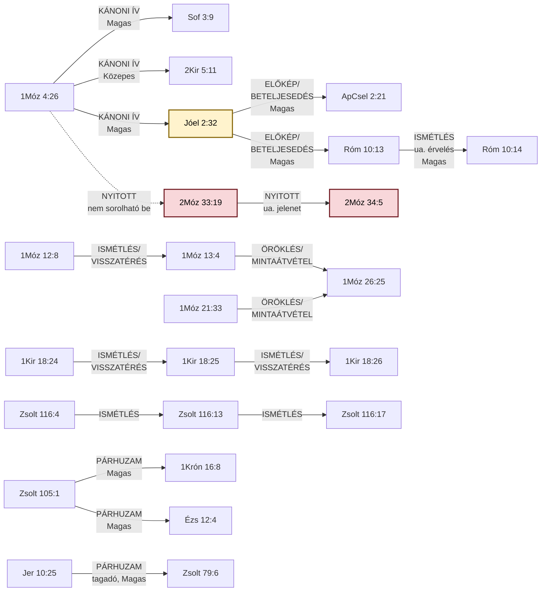

# ISTENTISZT-001 — Olvasói szint pilot (teljes cikk)

*Ez a fájl a `motivumlog/lexikon_pilot/ISTENTISZT-001_TUDOMANYOS.md` teljes
tartalmán végzett kézi, nem script-alapú próba-generálás, a 6-fokozatú,
tengelyenkénti rubrika szerint (l. `motivumlog/Olvasoi_szint_tervezesi_
naplo.md` 4. pontja). Munkapéldány — még nem szánt repóba kerülésre.*

**Döntés a bontásról:** a nyers forrásidézetek (BDB/TBESG/Thayer/LSJ
szócikkek), a táblázatok és a Mermaid-diagram invariánsak — egyszer
szerepelnek, jelölve. A magyarázó/összefoglaló prózai bekezdések mind a
6 fokozatban ki vannak dolgozva.

---

## Rubrika-táblázat

| Fokozat | Terminológia | Apparátus | Mondatszerkezet | Indoklás-sűrűség |
|---|---|---|---|---|
| **1** | Eredeti írásjel + transzliteráció + jelentés minden előforduláskor | Teljes 【NAPLO】-jelölés + minden hivatkozott igehely kiírva | Hosszú, többszörösen alárendelt mondatok (3-4 tagmondat) | Teljes érvelési lánc + kizárt alternatívák + explicit záró-korlátozás |
| **2** | Írásjel csak első előfordulásnál, utána csak transzliteráció | 【NAPLO】 megmarad, hivatkozások tömörítve | Rövidebb, de még összetett mondatok (max 2 tagmondat) | Teljes érvelési lánc, kizártak említve, korlátozás rövidítve |
| **3** | Csak transzliteráció (dőlttel), írásjel sehol | 【NAPLO】 eltávolítva, igehelyek még mind felsorolva | Egyszerű mondatok, egy gondolat/mondat | Fő érvelés megmarad, korlátozás egy tagmondatban |
| **4** | Transzliteráció csak 1-2 kulcsszónál | Igehelyek kategóriánként csoportosítva | Rövid, aktív szerkezetű mondatok | Csak a következtetés + rövid "miért" |
| **5** | Elvétve, egy-egy szónál | Igehelyek csak névvel/számmal | Nagyon rövid, tőmondat-közeli | Csak a következtetés |
| **6** | Nincs idegen nyelvi elem | Nincs hivatkozás-apparátus | Minimál mondatok | Csak a tény kimondása |

---

## 0. Metaadatok

*[INVARIÁNS — adattábla, nem regiszterezhető]*

| Mező | Érték |
|---|---|
| ID | `ISTENTISZT-001` |
| Rövid UI-címke | "Névbe vetett segítségül hívás" |
| Teljes cím | Segítségül hívni az Úr nevét |
| Formula | קָרָא בְשֵׁם יְהוָה (*kará beshém Adonáj*) |
| Kapcsolódó motívum | `ISTENTISZT-002` (Oltárépítés — Ábrám vándorlásának jelölői) — a 12:8 és 13:4 oltára fizikailag azonos a névsegítségül-hívás helyszínével, de a két motívum lexikailag elkülönül (az oltárépítés maga a cselekedet, a névsegítségül-hívás az azon végzett aktus) |
| Forrás-study | `tematikus_lezart/Segitsegul_hivni_az_Urat_tematikus.md` |
| Kereszthivatkozás-napló | `tematikus_lezart/naplok/Segitsegul_hivni_az_Urat_kereszthivatkozas_naplo.md` |
| Sablon-megfelelőség | v12, teljes (2026.09.05 audit) |

---

## 1. Előfordulások tábla

*[INVARIÁNS — adattábla, nem regiszterezhető]*

| Igehely | Kapcsolódás | PaRDeS-szint | Funkció | Strong-szám(ok) | BDB sense |
|---|---|---|---|---|---|
| 1Móz 4:26 | A formula első előfordulása — Séth fia, Énós nemzedéke; a Kain-vonal önerős civilizációépítése (4:17-24) utáni korszakváltás jele: a nemzedék tudatosan, névvel azonosítva kezdi imádni Istent | Drash (tanulság) | 🌱 **Alap-előfordulás** — a motívum legelső megjelenése a kánonban, minden későbbi eset erre vezethető vissza | H7121 (קָרָא, "hívni") + H8034 (שֵׁם, "név") | 2.c ("invokálni, segítségül hívni") |
| 1Móz 12:8 | Ábrám, Bétel és Ai között épít oltárt, és ott hívja segítségül az Úr nevét — az oltárépítés és a névsegítségül-hívás első összekapcsolása a szövegben | Drash (tanulság) | 🔁 **Ismétlődés** — a formula második, még nem rögzült szokásként ismétlődő megjelenése | H7121 (קָרָא, "hívni") + H8034 (שֵׁם, "név") | 2.c ("invokálni, segítségül hívni") |
| 1Móz 13:4 | Ábrám Egyiptomból visszatérve tudatosan felkeresi ugyanazt az oltárt, ahol korábban (12:8) segítségül hívta az Urat — a formula itt már nem egyszeri esemény, hanem felkeresett, fenntartott szokássá válik | Drash (tanulság) | ⭐ **Küszöb-előfordulás** — a 3. genezisi eset, ami miatt a motívum elérte az önálló tematikus feldolgozáshoz szükséges gyakoriságot | H7121 (קָרָא, "hívni") + H8034 (שֵׁם, "név") | 2.c ("invokálni, segítségül hívni") |
| 1Móz 21:33 | Ábrahám tamariszkuszfát ültet Beérsebában, és a névhez egy isteni jelzőt is társít: אֵל עוֹלָם (*él olám*, "örökkévaló Isten") — az egyetlen genezisi hely, ahol a formula önmagában teológiai kijelentést is hordoz Isten természetéről | — | ➕ **Bővülés** — a formula első alkalommal egészül ki isteni jelzővel, új teológiai tartalmat hordozva | H7121 (קָרָא, "hívni") + H8034 (שֵׁם, "név") | 2.c ("invokálni, segítségül hívni") |
| 1Móz 26:25 | Izsák, ugyanabban a Beérsebában, apja gyakorlatát folytatva hívja segítségül az Urat — a minta szó szerint átöröklődik a második pátriárka-nemzedékre, ugyanazon a földrajzi ponton | — | 👨‍👦 **Öröklés** — a gyakorlat generációk között, tudatos folytonossággal adódik át | H7121 (קָרָא, "hívni") + H8034 (שֵׁם, "név") | 2.c ("invokálni, segítségül hívni") |
| 1Kir 18:24 | Illés a Kármel-hegyi próbatételen egyetlen mondatban állítja szembe a két invokációt: "ti a ti isteneitek nevét hívjátok, és én segítségül hívom az Úr nevét" — a kontraszt (YHVH neve vs. a nép istenének neve) magán a versen belül van, nem két igehely között | Remez (kapcsolódás) | ⚔️ **Nyilvános versengés** — a formula először jelenik meg nyilvános, két isten közötti próbatétel kontextusában | H7121 (קָרָא) + H8034 (שֵׁם) + H0430 (אֱלֹהִים, "isten") + H3068 (יְהוָה, YHVH) | 2.c ("invokálni, segítségül hívni") |
| 1Kir 18:25 | A Baál-próféták felszólítása: "hívjátok segítségül a ti istenetek nevét" — a próbatétel gyakorlati végrehajtásának kezdete, a 24. vers kihívásának első lépése | Remez (kapcsolódás) | ⚔️ **Nyilvános versengés (folytatás)** — a próbatétel gyakorlati végrehajtása és kudarca | H7121 (קָרָא, "hívni") + H8034 (שֵׁם, "név") | 2.c ("invokálni" — itt Baál nevére alkalmazva) |
| 1Kir 18:26 | A Baál-próféták ismétlődő, egész délelőtti, sikertelen invokációja ("Baál! hallgass meg minket!") — a formula kudarca a kontraszt kiteljesedése | Remez (kapcsolódás) | ⚔️ **Nyilvános versengés (folytatás)** — a próbatétel gyakorlati végrehajtása és kudarca | H7121 (קָרָא, "hívni") + H8034 (שֵׁם, "név") | 2.c ("invokálni" — itt Baál nevére alkalmazva) |
| 2Kir 5:11 | A szíriai hadvezér, Naámán elvárja Elizeustól, hogy nyilvánosan, "az Úr, az ő Istene nevét segítségül hívva" gyógyítsa meg — a formula ismertsége egy nem-izraeli szereplő szájában is | Remez (kapcsolódás) | 🔁 **Ismétlődés, kívülálló szemszögéből** — a formula ismertsége Izraelen kívül is | H7121 (קָרָא, "hívni") + H8034 (שֵׁם, "név") | 2.c ("invokálni, segítségül hívni") |
| Sof 3:9 | Eszkatológiai ígéret: a népek nyelve megtisztul, hogy "mindnyájan segítségül hívják az Úr nevét, és egy akarattal szolgáljanak néki" — a formula univerzális, jövőbeli beteljesedésként jelenik meg | Remez (kapcsolódás) | 🔮 **Eszkatológiai kitekintés** — a formula jövőbeli, univerzális beteljesedésének előrevetítése | H7121 (קָרָא, "hívni") + H8034 (שֵׁם, "név") | 2.c (rokon — Sof 3:9 nem szerepel a BDB citációjában, de azonos szerkezetű) |
| Zsolt 116:4 | A zsoltáros saját, személyes hála-könyörgésének első megfogalmazása: "segítségül hívom az Úr nevét" — az egyéni imaéletbe ágyazott gyakorlat kezdő pontja ugyanabban a zsoltárban | Remez (kapcsolódás) | 🔁 **Ismétlődés, személyes könyörgésben** — a formula az egyéni imaéletbe ágyazva | H7121 (קָרָא, "hívni") + H8034 (שֵׁם, "név") | 2.c ("invokálni, segítségül hívni") |
| Zsolt 116:13 | A formula második, szó szerinti megismétlése ugyanabban a zsoltárban, a "szabadulás poharának" felemelése kontextusában | Remez (kapcsolódás) | 🔁 **Ismétlődés, személyes könyörgésben** — a formula az egyéni imaéletbe ágyazva | H7121 (קָרָא, "hívni") + H8034 (שֵׁם, "név") | 2.c ("invokálni, segítségül hívni") |
| Zsolt 116:17 | A formula harmadik megismétlése, hála-áldozat felajánlása kontextusában — LXX-hiba miatt a görög oldalon csak részlegesen ellenőrizhető, l. 5. szakasz | Remez (kapcsolódás) | 🔁 **Ismétlődés, személyes könyörgésben** — a formula az egyéni imaéletbe ágyazva | H7121 (קָרָא, "hívni") + H8034 (שֵׁם, "név") | 2.c ("invokálni, segítségül hívni") |
| Jóel 2:32 (MT) / 3:5 (Károli) | Az ószövetségi megfogalmazás csúcspontja: "mindaz, aki segítségül hívja az Úr nevét, megmenekül" — ezt a verset Péter (ApCsel 2:21, Pünkösd) és Pál (Róm 10:13) is szó szerint idézi az evangéliumi üzenet alátámasztására | Remez (kapcsolódás) | 🎯 **Előkép/beteljesedés** — az ÓSZ-i ígéret, amit az ÚSZ tételesen, szó szerint idéz | H7121 (קָרָא, "hívni") + H8034 (שֵׁם, "név") | 2.c ("invokálni, segítségül hívni") |
| Róm 10:14 *(új, 2026.09.06, TSK-eredetű)* | Pál folytatja az érvelést: "Mimódon hívják segítségül, a kiben nem hittek?" — ugyanaz a görög ige (ἐπικαλέσωνται), mint a 10:13-nál, retorikai/negatív irányú megfogalmazásban, a hit előfeltétel voltát hangsúlyozva | Remez (kapcsolódás) | 🎯 **Előkép/beteljesedés (folytatás)** — Pál közvetlenül továbbviszi az érvelést ugyanabban a szakaszban | G1941 (ἐπικαλέομαι) | — (ÚSZ-i, nincs önálló BDB-sense) |
| Zsolt 105:1 | "Hívjátok segítségül az ő nevét, hirdessétek a népek közt az ő cselekedeteit" — a genezisi hagyományból örökölt formula önálló, liturgikus tétellé válása, nem a történetszál narratív folytatása | Remez (kapcsolódás) | ⇄ **Párhuzam** — formulai/liturgikus örökség a genezisi hagyományból, nem narratív folytonosság | H7121 (קָרָא, "hívni") + H8034 (שֵׁם, "név") | 2.c ("invokálni, segítségül hívni") |
| 1Krón 16:8 | A Zsolt 105:1 szinte szó szerinti megismétlése a frigyláda Sátor elé állításának liturgiájában — ismerten a 105., 96. és 106. zsoltár összeállítását idézi | Remez (kapcsolódás) | ⇄ **Párhuzam** — formulai/liturgikus örökség a genezisi hagyományból, nem narratív folytonosság | H7121 (קָרָא, "hívni") + H8034 (שֵׁם, "név") | 2.c ("invokálni, segítségül hívni") |
| Ézs 12:4 | Szó szerint majdnem azonos a Zsolt 105:1-gyel, egy eszkatológiai hálaének kontextusában — a formula ugyanazzal a szövegezéssel bukkan fel egy teljesen más irodalmi műfajban (próféciai hálaének) | Remez (kapcsolódás) | ⇄ **Párhuzam** — formulai/liturgikus örökség a genezisi hagyományból, nem narratív folytonosság | H7121 (קָרָא, "hívni") + H8034 (שֵׁם, "név") | 2.c ("invokálni, segítségül hívni") |
| Jer 10:25 | "Öntsd ki haragodat a pogányokra... és a nemzetségekre, akik a Te nevedet nem hívják segítségül" — a formula itt tagadó, vádló formában, fordított szórenddel (a "nevedet" főnév megelőzi a "nem hívták" igét) jelenik meg, a formula elmulasztása mint a pogányok elleni vád | Remez (kapcsolódás) | ⇄🚫 **Párhuzam, tagadó forma** — a formula elmulasztása mint vád, fordított szórenddel | H7121 (קָרָא, "hívni") + H8034 (שֵׁם, "név") | 2.c ("invokálni" — tagadó szerkezetben, a mulasztás vádjaként) |
| Zsolt 79:6 | A Jer 10:25 szinte szó szerinti párhuzama, azonos vádló szerkezettel — a két könyv közti ismert szövegpárhuzam | Remez (kapcsolódás) | ⇄🚫 **Párhuzam, tagadó forma** — a formula elmulasztása mint vád, fordított szórenddel | H7121 (קָרָא, "hívni") + H8034 (שֵׁם, "név") | 2.c ("invokálni" — tagadó szerkezetben, a mulasztás vádjaként) |
| 2Móz 33:19 | Isten maga jelenti ki Mózesnek: "kihirdetem előtted az Úr nevét" — közvetlenül a Sínai-hegyi tulajdonság-kinyilatkoztatás (34:6-7) előtt; itt nem az ember hívja segítségül Isten nevét, hanem Isten mondja ki a sajátját | Remez (kapcsolódás, nyitott besorolású) | ❓ **Be nem sorolható** — a szereplők szerepe felcserélődik, egyik meglévő kategóriába sem illik tisztán | H7121 (קָרָא, "hívni") + H8034 (שֵׁם, "név") | **3** ("kihirdetni, kinyilatkoztatni" — NEM invokáció) |
| 2Móz 34:5 | Ugyanaz a jelenet folytatása: "az Úr nevében kiáltott" — Isten ténylegesen végrehajtja az előző fejezetben megígért önki­hirdetést | Remez (kapcsolódás, nyitott besorolású) | ❓ **Be nem sorolható** — a szereplők szerepe felcserélődik, egyik meglévő kategóriába sem illik tisztán | H7121 (קָרָא, "hívni") + H8034 (שֵׁם, "név") | **3** ("kihirdetni, kinyilatkoztatni" — NEM invokáció) |

---

## PaRDeS keretrendszer

### Blokk: "Mit jelent ez a négy szint?" (bevezető)

**1. fokozat** *(eredeti, jelöléssel)*:
> **Mit jelent ez a négy szint?** A PaRDeS a zsidó bibliaértelmezés négy hagyományos rétegének kezdőbetűiből áll össze — mindegyik más kérdést tesz fel ugyanarról a szövegről: **Peshat** (פְּשָׁט, *pshat*, "egyszerű") — mit mond a szöveg a legközvetlenebb, szó szerinti értelmében, mi történik a történetben, mit tesznek a szereplők? **Remez** (רֶמֶז, *remez*, "utalás") — hová mutat ez a szöveg még, milyen más bibliai helyekkel cseng össze, milyen nagyobb ívbe illeszkedik, ahol még csak a kapcsolat felismerése a cél, következtetés nélkül? **Drash** (דְּרַשׁ, *drash*, "keresés/magyarázat") — mit tanulhatunk ebből, mit kell tennünk vele, ez a normatív, alkalmazó szint? **Sod** (סוֹד, *szód*, "titok") — van-e ennek mélyebb, spirituális rétege, ami fegyelmezetten, tényleg levezethető a szövegből, nem találgatás vagy allegorizálás?

**2. fokozat**:
> A PaRDeS a zsidó bibliaértelmezés négy hagyományos rétegének kezdőbetűiből áll össze — mindegyik más kérdést tesz fel ugyanarról a szövegről. **Peshat** (*pshat*, "egyszerű") — mit mond a szöveg szó szerint, mi történik a történetben. **Remez** (*remez*, "utalás") — hová mutat ez a szöveg még, milyen más helyekkel cseng össze; itt még csak a kapcsolat felismerése a cél. **Drash** (*drash*, "magyarázat") — mit tanulhatunk ebből, ez a normatív, alkalmazó szint. **Sod** (*szód*, "titok") — van-e mélyebb, spirituális réteg, amit tényleg a szövegből lehet levezetni.

**3. fokozat**:
> A PaRDeS a zsidó bibliaértelmezés négy rétege. Mindegyik más kérdést tesz fel ugyanarról a szövegről. *Pshat*: mit mond a szöveg szó szerint? *Remez*: milyen más helyekkel cseng össze? *Drash*: mit tanulhatunk belőle? *Szód*: van-e mélyebb, lelki rétege?

**4. fokozat**:
> A zsidó bibliaértelmezés négy réteget különböztet meg. Az első: mit mond a szöveg szó szerint. A második: milyen más bibliai helyekkel függ össze. A harmadik: mi a tanulság belőle. A negyedik: van-e mélyebb, lelki jelentése.

**5. fokozat**:
> A magyarázat négy lépésben halad: mit mond a szöveg; mihez kapcsolódik; mi a tanulság; van-e mélyebb jelentése.

**6. fokozat**:
> Négyféleképpen közelítjük meg a szöveget: mit mond, mihez kapcsolódik, mit tanulunk belőle, van-e mélyebb jelentése.

**Típus-tudatos konfigurált átírás (5. fokozat):**
> A magyarázat négy lépésben halad: *Peshat* (mit mond a szöveg), *Remez* (mihez kapcsolódik), *Drash* (mi a tanulság belőle), *Szód* (van-e mélyebb jelentése).

### Blokk: Peshat

**1. fokozat**:
> **Peshat:** a genezisi öt előfordulás (1Móz 4:26, 12:8, 13:4, 21:33, 26:25) egyetlen, folytonos gyakorlatot ír le: a hívő ember Isten nevének invokálásával fejezi ki függőségét és hódolatát — jellemzően egy konkrét, helyhez kötött kultikus jelhez kapcsolva (oltárépítés 12:8, 13:4 és 26:25 esetén; fa ültetése 21:33-nál). A gyakorlat nem egyszeri esemény, hanem nemzedékeken át öröklődő szokás (Ábrahám → Izsák), amely konkrét földrajzi pontokhoz kötődik (Bétel-Ai, Beérseba).

**2. fokozat**:
> **Peshat:** a genezisi öt előfordulás (1Móz 4:26, 12:8, 13:4, 21:33, 26:25) egyetlen gyakorlatot ír le: a hívő ember Isten nevének invokálásával fejezi ki függőségét — jellemzően egy konkrét kultikus jelhez kapcsolva (oltárépítés vagy fa ültetése). A gyakorlat nemzedékeken át öröklődő szokás (Ábrahám → Izsák), konkrét helyekhez kötve (Bétel-Ai, Beérseba).

**3. fokozat**:
> A genezisi öt előfordulás egyetlen gyakorlatot ír le. A hívő ember Isten nevének segítségül hívásával fejezi ki függőségét. Ez jellemzően egy oltárhoz vagy fa ültetéséhez kapcsolódik. A gyakorlat nemzedékeken át öröklődik, Ábrahámtól Izsákig, mindig ugyanazon a helyen.

**4. fokozat**:
> Öt alkalommal jelenik meg ez a mozzanat a Genezisben. Az ember Isten nevét szólítva fejezi ki, hogy tőle függ. Ez rendszerint egy oltárhoz kapcsolódik. A gyakorlat apáról fiúra száll.

**5. fokozat**:
> A Genezisben ötször jelenik meg ez. Az ember Isten nevét szólítja meg, és ez apáról fiúra öröklődik.

**6. fokozat**:
> Ez a gyakorlat ötször fordul elő a Genezisben, és apáról fiúra száll.

**Típus-tudatos konfigurált átírás (5. fokozat):**
> Ez a gyakorlat a Genezisben ötször jelenik meg, és nemzedékeken át, apáról fiúra öröklődik.

### Blokk: Remez

**1. fokozat**:
> **Remez:** a minta a Séthita vonaltól a pátriárkákon át húzódik tovább, a próféták nyilvános, versengő kontextusán (1Kir 18) és a zsoltáros személyes könyörgésén (Zsolt 116) át egy eszkatológiai, univerzális ígéretig (Sof 3:9, Zak 13:9; Jóel 3:5/2:32), amely Pünkösdkor (ApCsel 2:21) és Pál evangéliumi érvelésében (Róm 10:13-14) nyeri el végső alkalmazását.

**2. fokozat**:
> **Remez:** a minta a pátriárkáktól a próféták nyilvános kontextusán (1Kir 18) és a zsoltáros személyes könyörgésén (Zsolt 116) át egy eszkatológiai ígéretig húzódik (Sof 3:9, Jóel 2:32), amely Pünkösdkor (ApCsel 2:21) és Pál érvelésében (Róm 10:13-14) éri el végső alkalmazását.

**3. fokozat**:
> A minta a pátriárkáktól indul. Áthalad a próféták nyilvános fellépésén és a zsoltáros személyes könyörgésén. Eljut egy eszkatológiai ígéretig. Végül Pünkösdkor és Pál levelében nyeri el végső alkalmazását.

**4. fokozat**:
> A minta a pátriárkáktól a prófétákon és zsoltárokon át egy jövőbeli ígéretig húzódik, amit végül az Újszövetség (Pünkösd, Pál) valósít meg.

**5. fokozat**:
> A minta az Ószövetségen át halad, és az Újszövetségben teljesedik be.

**6. fokozat**:
> Ez a minta végigvonul a Bibliánn, és az Újszövetségben teljesedik be.

**Típus-tudatos konfigurált átírás (5. fokozat):**
> A minta a pátriárkáktól a prófétákon és a zsoltáron át egy jövőbeli ígéretig húzódik, majd Pünkösdkor és Pál levelében nyeri el végső beteljesedését.

### Blokk: "Miért nem csak véletlen szóegyezés" (kiterjesztett érvelés)

**1. fokozat**:
> **Miért nem csak véletlen szóegyezés ez:** amikor Péter és Pál görögül idézik a formulát, egy görög igét használnak (ἐπικαλέομαι, *epikaleomai*), aminek önmagában elég tág, általános jelentése van — bárkit meg lehet vele "szólítani", akár egy pogány istent is. Felmerülhetne tehát a kérdés: tényleg ugyanarról a dologról van szó, mint a genezisi történetben, vagy csak egy tág jelentésű szót választottak, ami történetesen illik ide? A válasz most, hogy három egymástól teljesen független szótár (a héber BDB, és két külön görög szótár, a TBESG és a Thayer) is elérhető, egyértelműbb, mint korábban volt: a Thayer ugyanis külön kategóriába teszi azt az esetet, amikor ezt a görög igét kifejezetten egy héber kifejezés fordításaként használják — külön véve attól az esettől, amikor csak simán "hívnak/szólítanak" valakit. Ez azért erősebb bizonyíték, mint ha csak egy forrásra támaszkodnánk: három, egymástól független szótárkészítő, más korban, más módszerrel dolgozva jutott ugyanarra a következtetésre.

**2. fokozat**:
> **Miért nem csak véletlen szóegyezés ez:** Péter és Pál egy görög igét (*epikaleomai*) használnak, aminek önmagában tág jelentése van — bárkit meg lehet vele szólítani. Felmerülhetne: tényleg ugyanaz, mint a genezisi történetben, vagy csak véletlen szóválasztás? Három független szótár (a héber BDB, a görög TBESG és a Thayer) mind ugyanarra jut: a Thayer külön kategóriába teszi azt az esetet, amikor ezt az igét kifejezetten egy héber kifejezés fordításaként használják. Három, egymástól független forrás ugyanarra a következtetésre jutása erősebb bizonyíték, mint egyetlen forrás.

**3. fokozat**:
> Péter és Pál egy görög igét (*epikaleomai*) használnak, aminek önmagában tág jelentése van. Felmerülhetne a kérdés: ez tényleg ugyanaz, mint a genezisi történetben? Három független szótár vizsgálata megerősíti: igen. A Thayer külön kategóriába teszi azt az esetet, amikor ez az ige egy héber kifejezés fordítása. Három forrás egybehangzó eredménye erős bizonyíték.

**4. fokozat**:
> Felmerülhetne, hogy Péter és Pál csak egy általános jelentésű görög szót választottak, ami véletlenül illik ide. Három független szótár vizsgálata viszont megerősíti: ez tudatos, a héber mintát követő szóhasználat volt.

**5. fokozat**:
> Három egymástól független szótár is megerősíti: Péter és Pál tudatosan a héber mintát folytatták, nem véletlenül választottak hasonló szót.

**6. fokozat**:
> A szótárak megerősítik: ez tudatos folytatás, nem véletlen.

**Típus-tudatos konfigurált átírás (5. fokozat):**
> Három, egymástól teljesen független szótár is megerősíti: ez tudatos, a héber mintát követő szóhasználat volt, nem véletlen egyezés.

### Blokk: Drash

**1. fokozat**:
> **Drash:** a motívum azt tanítja, hogy az istentisztelet magja nem a nyilvános teljesítmény vagy a rituálé pontossága, hanem a függőség tudatos, névvel azonosított kifejezése. Ábrahám és Izsák párhuzama azt is megmutatja, hogy ez a fajta istentisztelet taníthatóvá és örökölhetővé válik. A study időközben visszaírt A/B/C tipológiája ezt a tanítást egy szinttel mélyebbre viszi: a קָרָא (*kará*, "hívni") + שֵׁם (*shém*, "név") szókapcsolat nemcsak az ember Isten felé irányuló invokációját fejezheti ki, hanem — ugyanazzal a nyelvi szerkezettel, felcserélt alany/tárgy-szereposztásban — Isten önkinyilatkoztatását is, és Isten névadó tettét egy emberen. A motívum tehát nem elszigetelt emberi gyakorlat, hanem egy tágabb, kölcsönös isteni-emberi kommunikációs mintázat egyik pólusa.

**2. fokozat**:
> **Drash:** a motívum azt tanítja, hogy az istentisztelet magja nem a rituálé pontossága, hanem a függőség tudatos, névvel azonosított kifejezése. Ábrahám és Izsák párhuzama mutatja: ez taníthatóvá és örökölhetővé válik. Az A/B/C tipológia egy szinttel mélyebbre viszi ezt: ugyanaz a nyelvi szerkezet kifejezheti az ember Isten felé irányuló invokációját, Isten önkinyilatkoztatását, és Isten névadó tettét egy emberen — ez egy tágabb, kölcsönös kommunikációs mintázat.

**3. fokozat**:
> A motívum azt tanítja: az istentisztelet magja a függőség tudatos kifejezése, nem a rituálé pontossága. Ábrahám és Izsák példája mutatja, hogy ez taníthatóvá válik. A tágabb minta szerint ugyanez a szerkezet kifejezheti Isten önkinyilatkoztatását is, nem csak az ember imáját. Ez egy kölcsönös, isteni-emberi mintázat.

**4. fokozat**:
> A motívum lényege: az istentisztelet a függőség kimondása, nem a szertartás pontossága. Ez taníthatóvá és örökölhetővé válik nemzedékről nemzedékre. Egy tágabb minta szerint ugyanez a szerkezet Isten önkinyilatkoztatására is vonatkozik.

**5. fokozat**:
> Az istentisztelet lényege a függőség kimondása, ami apáról fiúra öröklődik.

**6. fokozat**:
> Az istentisztelet a függőség kimondása.

**Típus-tudatos konfigurált átírás (5. fokozat):**
> Az istentisztelet lényege a függőség kimondása. Egy tágabb minta ezt egy szinttel mélyebbre viszi: ugyanez a szerkezet Isten önkinyilatkoztatására is vonatkozik.

### Blokk: Sod (+ Rashi-vita)

**1. fokozat**:
> **Sod** *(fegyelmezetten, csak a fenti rétegekből levezetve)*: a bűneset és Kain testvérgyilkossága utáni emberiség első dokumentált lelki válasza nem az önmegváltás kísérlete, hanem a segítségül hívás — a névbe vetett függőség beismerése, éles ellentétben a Bábel-építőkkel, akik "nevet akarnak szerezni maguknak" (1Móz 11:4). ⚠️ *(a Rashi-vita itt is releváns: ha a 4:26 valójában a bálványimádás kezdetét jelzi, a Sod-szintű "első pozitív lelki válasz" olvasat módosulna — a projekt a többségi olvasatot követi, de a vitát nem hallgatja el)*

**2. fokozat**:
> **Sod:** a bűneset utáni emberiség első dokumentált lelki válasza nem az önmegváltás kísérlete, hanem a segítségül hívás — éles ellentétben a Bábel-építőkkel, akik "nevet akarnak szerezni maguknak" (1Móz 11:4). ⚠️ *(egy kisebbségi olvasat — Rashi — szerint a 4:26 valójában a bálványimádás kezdetét jelzi; a projekt a többségi olvasatot követi, de a vitát jelzi)*

**3. fokozat**:
> A bűneset utáni emberiség első lelki válasza nem az önmegváltás, hanem a segítségül hívás. Ez éles ellentétben áll a Bábel-építőkkel, akik maguknak akartak nevet szerezni. Van egy kisebbségi olvasat, ami szerint ez a vers valójában a bálványimádás kezdetét jelzi — a többségi nézet ezt nem osztja.

**4. fokozat**:
> Az emberiség első lelki válasza a bűneset után a segítségül hívás volt, nem az önerő. Ez szemben áll a Bábel-építőkkel. Van egy vitatott, kisebbségi olvasat is erről a versről.

**5. fokozat**:
> Az ember első válasza a bűneset után Isten segítségül hívása volt, nem az önerő.

**6. fokozat**:
> Az ember először Istenhez fordult, nem önmagához.

---

## 2. TELJES BDB szócikk — H7121 (קָרָא)

*[INVARIÁNS — forrásidézet]*

> **2. c.** ׳ק בְּשֵׁם י׳ *call with name of Yahweh (i.e. use it in invocation)*: Gen 4:26; 12:8; 2Kin 5:11; Jer 10:25 = Psa 79:6 16t. (1Kin 18:24 of specific appeal to ׳י to display his power), + Isa 65:1 (see Pu`al); with name of Baal 1Kin 18:24-25, 26.
>
> **🇭🇺 Magyarul:** *"hívni Jahve nevével" (azaz segítségül hívni, invokálni)*: 1Móz 4:26; 12:8; 2Kir 5:11; Jer 10:25 = Zsolt 79:6, és további 16 előfordulás (1Kir 18:24-nél kifejezetten arra a konkrét felszólításra vonatkozik, hogy Jahve mutassa meg hatalmát), valamint Ézs 65:1 (l. szenvedő alak); Baál nevével: 1Kir 18:24-25, 26.
>
> **3. proclaim: a.** with accusative of thing procl. Amos 4:5; Gen 41:43; Deut 15:2; Jer 31:6; Lev 25:10 +; **׳ק followed by oratio recta [direct speech] Exod 34:6, etc.**
>
> **🇭🇺 Magyarul:** *3. kihirdetni: a.* a kihirdetett dolog tárgyesetével: Ámós 4:5; 1Móz 41:43; 5Móz 15:2; Jer 31:6; 3Móz 25:10 és mások; **egyenes idézetet [közvetlen beszédet] követve: 2Móz 34:6, stb.**

### Blokk: "Kiemelés jelentősége"

**1. fokozat**:
> **Kiemelés jelentősége:** a fenti 2.c és 3. sense-ek — kiemelve, mert a motívum funkcionális kettéválasztásának (emberi invokáció vs. isteni önkihirdetés) ez a lexikográfiai, BDB-szintű alapja. A 2.c citációs listája (1Móz 4:26; 12:8; 2Kir 5:11; Jer 10:25 = Zsolt 79:6; 1Kir 18:24; Baál 1Kir 18:24-26) önállóan, a mi kutatásunktól függetlenül csaknem pontosan egyezik a study saját, 2026.09.05-i auditjának eredményével — beleértve a Jer 10:25 = Zsolt 79:6 párt, amit a study a BDB-idézet alapján, nem önálló kereséssel talált meg.

**2. fokozat**:
> A 2.c és 3. sense-ek azért fontosak, mert ez a motívum kettéválasztásának (emberi invokáció vs. isteni önkihirdetés) lexikográfiai alapja. A 2.c citációs listája önállóan, a mi kutatásunktól függetlenül csaknem pontosan egyezik a study saját auditjának eredményével — a Jer 10:25 = Zsolt 79:6 párt is beleértve.

**3. fokozat**:
> Ez a két BDB-sense a motívum kettéválasztásának alapja. A BDB saját idézetlistája szinte pontosan megegyezik azzal, amit a study független kutatással talált. Ez erős megerősítés.

**4. fokozat**:
> A BDB két jelentés-ága önállóan alátámasztja a study eredményeit — a szótár, tőlünk függetlenül, ugyanazokat az igehelyeket sorolja fel.

**5. fokozat**:
> A szótár önállóan megerősíti a study eredményeit.

**6. fokozat**:
> A szótár is megerősíti ezt.

---

## 3. TELJES BDB szócikk — H8034 (שֵׁם)

*[INVARIÁNS — forrásidézet]*

> **H8034. shem I. שֵׁם_864 noun masculine name (√ unknown; Thes שׁמה, compare Ba^ZMG xli (1887), 635; Lag^BN 160 ושׁם, Arabic brand, mark; Late Hebrew = Biblical Hebrew (especially הַשֵּׁם = יהוה); Phoenician שם; Assyrian šumu; Sabean סם; Ethiopic; Arabic; Aramaic שְׁמָא שֵׁם, Old Aramaic, Palmyrene שם);** — absolute ׳שׁ Gen 6:4 +; construct ׳שׁ 12:8 +...

**🇭🇺 Magyarul:** *shem I. שֵׁם — hímnemű főnév: "név" (gyök ismeretlen; a Thesaurus szerint a שׁמה szóval rokon; késői héberben megegyezik a bibliai héberrel, különösen a הַשֵּׁם ["a Név"] kifejezésben, ami YHVH körülírása; főníciaiul שם; asszírul šumu; sabeus nyelven סם; megvan etióp és arab nyelvben is; arámiul שְׁמָא/שֵׁם, óarámiul és palmürai nyelven is שם) — abszolút alakban 1Móz 6:4-től, birtokos szerkezetben 12:8-tól kezdve...*

### Blokk: "Jelentősége"

**1. fokozat**:
> **Jelentősége:** a "√ unknown" (gyök ismeretlen) jelölés a szócikk legelején — ez a lexikográfiai alap ahhoz, hogy a study 2/b Origin-lánc lépése lezártnak minősüljön (nincs tovább vezethető etimológia, tehát nincs mit "elutasítani" vagy "beépíteni" ezen a téren).

**2. fokozat**:
> A szócikk elején a "gyök ismeretlen" jelölés a lexikográfiai alap ahhoz, hogy az etimológia-vizsgálat lezártnak minősüljön — nincs tovább vezethető gyök, amit vizsgálni kellene.

**3. fokozat**:
> A szótár szerint ennek a szónak ismeretlen az eredete. Ezért az etimológiai vizsgálat itt lezárható — nincs mit tovább kutatni.

**4. fokozat**:
> A szó eredete a szótár szerint ismeretlen, tehát ezen a téren nincs több teendő.

**5. fokozat**:
> A szó eredete ismeretlen — ez lezárt kérdés.

**6. fokozat**:
> A szó eredete nem ismert.

---

## 4. TELJES TBESG szócikkek — a három görög ige

### G1941 ἐπικαλέω, G2564 καλέω, G0994 βοάω

*[INVARIÁNS — forrásidézetek]*

**TBESG (Abbott-Smith):**

> **ἐπι-καλέω**, -ῶ [in LXX chiefly for קָרָא] —
> **1.** *to call, name, surname*: with accusative (cl.), Mat.10:25; pass., Act.1:23, 4:36, 10:5, 18, 10:22, 11:13, 12:12, 25, Heb.11:16; τ. ὄνομα, before ἐπί (denoting possession, as Heb. עַל..שֻׁם קָרָא), Act.15:17 (LXX), Jas.2:7.
> **2. Mid. (so also act.; cl., LXX), to call upon, invoke, appeal to** (θεόν, θεούς, Hdt., Xen., al.): Καίσαρα (Σεβαστόν, Act.25:25), Act.25:11-12, 21, 26:32, 28:19; sc. τ. Κύριον Ἰησοῦν, Act.7:59; μάρτυρα (cl.) τ. θεόν, 2Co.1:23; πατέρα, 1Pe.1:17; τ. κύριον, Rom.10:12, 2Ti.2:22; **τ. ὄνομα κυρίου (μου, σου; like Heb. יְהוָֹה שֻׁם קָרָא), Act.2:21 (LXX) Act.9:14, 21, 22:16, Rom.10:13-14 (LXX) 1Co.1:2** (Cremer, 335, 742). (AS)

**🇭🇺 Magyarul (Abbott-Smith):** *ἐπι-καλέω — a LXX-ben elsősorban a קָרָא megfelelője —*

**1.** *hívni, nevezni, elnevezni*: tárgyesettel (klasszikus göröngben), Mt 10:25; szenvedő szerkezetben, ApCsel 1:23, 4:36, 10:5,18,22, 11:13, 12:12,25, Zsid 11:16; "a nevet" ἐπί-vel (birtoklást jelölve, mint a héber עַל..שֻׁם קָרָא), ApCsel 15:17 (LXX), Jak 2:7.

**2. Közép alakban (de aktívban is; klasszikus göröngben és LXX-ben): *segítségül hívni, invokálni, folyamodni*** (istenhez/istenekhez): a császárhoz (fellebbezve), ApCsel 25:11-12,21, 26:32, 28:19; "az Úr Jézust", ApCsel 7:59; tanúul hívni az Istent, 2Kor 1:23; "Atyát", 1Pét 1:17; "az Urat", Róm 10:12, 2Tim 2:22; **"az Úr nevét" (enyémet/tiédet) — pontosan úgy, mint a héber יְהוָֹה שֻׁם קָרָא — ApCsel 2:21 (LXX-idézet), ApCsel 9:14,21, 22:16, Róm 10:13-14 (LXX-idézet), 1Kor 1:2.**

**Thayer's Greek-English Lexicon (2026.09.07-től ténylegesen elérhető, l. 10. szakasz) — TELJES, 5 jelentés-ágas szócikk:**

> **G1941 — ἐπικαλέω** ... the Sept. very often for קָרָא ; **1.** to put a name upon, to surname: τινα, Mat 10:25; passive ὁ ἐπικαλούμενος, "he who is surnamed", Luk 22:3, Act 10:18, 11:13, 12:12 etc. **2.** ἐπικαλεῖται τό ὄνομα τίνος ἐπί τινα, after the Hebrew ... "the name of one is named upon some one" (cf. Gesenius, Thesaurus iii., p. 1232a): Act 15:17 from Amo 9:12; Jam 2:7. **3.** τίνι with accusative — legal sense, "to charge something to one as a crime; to accuse of": Mat 10:25. **4. to call upon (like German** *anrufen***), to invoke; middle, to call upon for oneself, in one's behalf**: as a helper, Act 7:59; as a witness, 2Co 1:23; as a judge/appeal, Act 25:11, 26:32, 28:19. **5. Hebraistically (like יְהוָה בְּשֵׁם קָרָא to call upon by pronouncing the name of Jehovah, Gen 4:26; Gen 12:8; 2Ki 5:11, etc.; cf. Gesenius, Thesaurus, p. 1231b ... an expression finding its explanation in the fact that prayers addressed to God ordinarily began with an invocation of the divine name: Psa 3:2; Psa 6:2; Psa 7:2, etc.) ἐπικαλοῦμαι τό ὄνομα τοῦ κυρίου, I call upon the name of the Lord, i.e. to invoke, adore, worship, the Lord: Act 2:21 (from Joe 2:32); Act 9:14,21; 22:16; Rom 10:13; 1Co 1:2; τόν κύριον, Rom 10:12; 2Ti 2:22.**

**🇭🇺 Magyarul (Thayer, kivonatosan a releváns 4-5. pontra):** ***4. segítségül hívni** (mint a német "anrufen"), **invokálni**; közép alakban: segítségül hívni magának, a saját javára*: mint segítőt, ApCsel 7:59; mint tanút, 2Kor 1:23; mint bírót/fellebbezésként, ApCsel 25:11, 26:32, 28:19. ***5. héberiesen** (mint a יְהוָה בְּשֵׁם קָרָא, "az Úr nevét kimondva hívni segítségül", 1Móz 4:26; 12:8; 2Kir 5:11 stb.; vö. Gesenius Thesaurus, 1231b oldal ... ez a kifejezés onnan nyeri magyarázatát, hogy az Istenhez intézett imák rendszerint az isteni név segítségülhívásával kezdődtek: Zsolt 3:2; 6:2; 7:2, stb.) "az Úr nevét hívom segítségül", azaz invokálni, imádni, tisztelni az Urat*: ApCsel 2:21 (a Jóel 2:32-ből); ApCsel 9:14,21; 22:16; Róm 10:13; 1Kor 1:2; "az Urat", Róm 10:12; 2Tim 2:22.

**Miért fontos ez a lelet:** a Thayer **explicit** szétválasztja a "héberies" (Hebraistically) 5. sense-t a sima 4. "invokálni" sense-től — ez egy **harmadik, tőlünk teljesen független forrás** (BDB és Abbott-Smith után), ami megerősíti, hogy a mi motívumunk nem csupán "invokáció általában", hanem egy **specifikusan héber eredetű, azonosított nyelvi mintázat**, amit a görög fordítói/kommentár-hagyomány is külön kategóriaként kezel. A Zsolt 3:2/6:2/7:2 hivatkozásokat ellenőriztem — **nem** tartalmazzák a H7121+H8034 formulát, Thayer itt csak általánosságban jegyzi meg, hogy a zsoltárok gyakran isteni névvel kezdődnek — nem új rejtett találat, de nem is hamis nyom.

### G2564 καλέω (kaleō)

> **καλέω**, -ῶ, [in LXX chiefly for קרא] —
> **1.** *to call, summon*: with accusative of person(s), Mat.20:8, 25:14, Mrk.3:31, Luk.19:13, Act.4:18; before ἐκ, Mat.2:15 (LXX); metaphorically, 1Pe.2:9.
> **2.** *to call to one's house, invite*: Luk.14:16, 1Co.10:27, Rev.19:9; ... metaphorically, of inviting to partake of the blessings of the kingdom of God: Rom.8:30, 9:24-25, 1Co.7:17-18...
> **3.** *to call, name, call by name*: pass., Mat.2:23, Luk.1:32, al.; with pred. nom., Mat.5:9, Luk.1:35, Rom.9:26, Jas.2:23, 1Jn.3:1. (AS)

**🇭🇺 Magyarul:** *καλέω — a LXX-ben elsősorban a קרא megfelelője —*

**1.** *hívni, odahívni*: személy tárgyesetével, Mt 20:8, 25:14, Mk 3:31, Lk 19:13, ApCsel 4:18; ἐκ-val (közül), Mt 2:15 (LXX); átvitt értelemben, 1Pét 2:9.

**2.** *házába hívni, meghívni*: Lk 14:16, 1Kor 10:27, Jel 19:9; ... átvitt értelemben, Isten országa áldásaiban való részesedésre hívva: Róm 8:30, 9:24-25, 1Kor 7:17-18...

**3.** *hívni, nevezni, néven nevezni*: szenvedő szerkezetben, Mt 2:23, Lk 1:32, és másutt; állítmányi névszóval, Mt 5:9, Lk 1:35, Róm 9:26, Jak 2:23, 1Jn 3:1.

### G0994 βοάω (boaō)

**TBESG (Abbott-Smith):**

> **βοάω**, -ῶ (βοή), [in LXX chiefly for זעק, צעק, קרא] —
> **1. absol., to cry, call out**: Mat.3:3, 27:46, Mrk.1:3, 15:34, Luk.3:4, 9:38, 18:38, Jhn.1:23, Act.8:7, 17:6, 25:24, Gal.4:27.
> **2. C. dative, to call on for help** (Heb. זעק על, Hos.7:14, al.), Luk.18:7.
> **SYN.: καλέω, to call, invite, summon; κράζω, to cry, harshly or inarticulately, as animals; κραυγάζω, intensive of κράζω. βοάω expresses emotion, whether joy, fear, etc.** (AS)

**🇭🇺 Magyarul (Abbott-Smith):** *βοάω (a βοή főnévből) — a LXX-ben elsősorban a זעק, צעק, קרא megfelelője —*

**1. önmagában: *kiáltani, hangosan szólni***: Mt 3:3, 27:46, Mk 1:3, 15:34, Lk 3:4, 9:38, 18:38, Jn 1:23, ApCsel 8:7, 17:6, 25:24, Gal 4:27.

**2. részes esettel: *segítségért kiáltani*** (héberül זעק על, Hós 7:14, és másutt), Lk 18:7.

**SZINONIMÁK: καλέω — hívni, meghívni, összehívni; κράζω — kiáltani, durván vagy artikulálatlanul, mint az állatok; κραυγάζω — a κράζω fokozott alakja. A βοάω érzelmet fejez ki — legyen az öröm, félelem vagy más.**

**Thayer's Greek-English Lexicon (2026.09.07-től ténylegesen elérhető):**

> **G994 — βοάω** ... in the Sept. mostly for קָרָא, זָעַק, צָעַק; **to cry aloud, shout: 1. to raise a cry**: of joy, Gal 4:27 (from Isa 54:1); of pain, Mat 27:46, Act 8:7. **2. to cry i.e. speak with a high, strong voice**: Mat 3:3, Mar 1:3, Luk 3:4, Joh 1:23 (all from Isa 40:3); Mar 15:34; Luk 9:38; Act 17:6; Act 21:34. **3. πρός τινα to cry to one for help, implore his aid**: Luk 18:7 (1Sa 7:8; 1Ch 5:20; Hos 7:14, etc. for אֶל...זָעַק). (Compare: ἀναβοάω, ἐπιβοάω.)

**🇭🇺 Magyarul (Thayer):** *G994 — βοάω ... a LXX-ben leginkább a קָרָא, זָעַק, צָעַק megfelelője; **hangosan kiáltani, ordítani: 1. felkiáltani***: örömből, Gal 4:27 (Ézs 54:1-ből); fájdalomból, Mt 27:46, ApCsel 8:7. ***2. kiáltani, azaz magas, erős hangon beszélni***: Mt 3:3, Mk 1:3, Lk 3:4, Jn 1:23 (mind Ézs 40:3-ból); Mk 15:34; Lk 9:38; ApCsel 17:6; ApCsel 21:34. ***3. πρός τινα — segítségért kiáltani valakihez, segítségét kérve***: Lk 18:7 (1Sám 7:8; 1Krón 5:20; Hós 7:14 stb., a héber אֶל...זָעַק megfelelőjeként). (Vö.: ἀναβοάω, ἐπιβοάω.)

### Blokk: G1941 — "Miért fontos ez a lelet"

**1. fokozat**:
> **Miért fontos ez a lelet:** a Thayer explicit szétválasztja a "héberies" (Hebraistically) 5. sense-t a sima 4. "invokálni" sense-től — ez egy harmadik, tőlünk teljesen független forrás (BDB és Abbott-Smith után), ami megerősíti, hogy a mi motívumunk nem csupán "invokáció általában", hanem egy specifikusan héber eredetű, azonosított nyelvi mintázat, amit a görög fordítói/kommentár-hagyomány is külön kategóriaként kezel. A Zsolt 3:2/6:2/7:2 hivatkozásokat ellenőriztem — nem tartalmazzák a H7121+H8034 formulát, Thayer itt csak általánosságban jegyzi meg, hogy a zsoltárok gyakran isteni névvel kezdődnek — nem új rejtett találat, de nem is hamis nyom.

**2. fokozat**:
> A Thayer külön választja a "héberies" 5. sense-t a sima "invokálni" sense-től — ez egy harmadik, független forrás (a BDB és az Abbott-Smith után), ami megerősíti: nem csak általános invokációról van szó, hanem egy specifikusan héber eredetű mintáról. A Zsolt 3:2/6:2/7:2 hivatkozásokat ellenőriztem — nem tartalmazzák a formulát, ez nem új találat, de nem is téves nyom.

**3. fokozat**:
> A Thayer külön kategóriába teszi a héberies jelentést. Ez egy harmadik, tőlünk független forrás, ami megerősíti a motívum valódiságát. Néhány kapcsolódó hivatkozást ellenőriztem — azok nem tartoznak ide, de nem is tévesek.

**4. fokozat**:
> Egy harmadik, független szótár is külön kezeli ezt a jelentést — ez tovább erősíti, hogy a motívum valódi, nem véletlen egybeesés.

**5. fokozat**:
> Egy harmadik forrás is megerősíti a motívum valódiságát.

**6. fokozat**:
> Ezt egy harmadik forrás is megerősíti.

**Típus-tudatos konfigurált átírás (5. fokozat):**
> Egy harmadik, tőlünk teljesen független forrás is külön kezeli ezt a jelentést — ez tovább erősíti, hogy a motívum valódi.

### Blokk: G994 (βοάω) — "Miért fontos ez a lelet"

**1. fokozat**:
> **Miért fontos ez a lelet:** a Thayer megerősíti az Abbott-Smith szinonima-magyarázatát (βοάω ≠ ἐπικαλέομαι, más érzelmi regiszter), és pontosítja, hogy az Ézs 12:4-nél használt fordítói döntés (βοάω) illeszkedik a βοάω tipikus LXX-forrásaihoz (Ézs 40:3, Ézs 54:1 — mindkettő Ézsaiás-részlet, ahogy a mi versünk is!) — vagyis a fordító stílusregiszterben és forráskönyvben is konzisztens választást tett, nem véletlenszerű eltérést az ἐπικαλέομαι-tól.

**2. fokozat**:
> A Thayer megerősíti: a βοάω más érzelmi regiszterű, mint az ἐπικαλέομαι. Az Ézs 12:4-nél használt βοάω illeszkedik a szó tipikus előfordulásaihoz (más Ézsaiás-részletekhez) — a fordító tehát tudatos, konzisztens választást tett, nem véletlen eltérést.

**3. fokozat**:
> A βοάω más hangulatú szó, mint az ἐπικαλέομαι. Az Ézsaiásnál használt szóválasztás illik a szó megszokott előfordulási helyeihez. Ez tudatos fordítói döntés volt, nem véletlen.

**4. fokozat**:
> A fordító itt tudatosan, nem véletlenül választott egy másik görög szót — ez illik a szó szokásos használatához.

**5. fokozat**:
> A szóválasztás itt tudatos volt, nem véletlen.

**6. fokozat**:
> Ez tudatos szóválasztás volt.

**Típus-tudatos konfigurált átírás (5. fokozat):**
> A fordító itt is tudatos, konzisztens választást tett — a szó stílusában és forráskönyvében is illik a szövegkörnyezethez.

### Blokk: MCGED/SECE/LSJ — "Kiemelt módszertani jelentőség"

*[INVARIÁNS — adattáblák]*

**MCGED (Mounce Concise Greek-English Dictionary) — pontos NT-előfordulás-szám mindhárom igére:**

| Ige | Frekvencia (teljes ÚSZ) | Mounce tömör gloss |
|---|---|---|
| ἐπικαλέω (G1941) | **30×** | "to call on; to attach or connect a name" |
| καλέω (G2564) | **148×** | "to call, call to... to invite... to call to a participation in the privileges of the Gospel" |
| βοάω (G994) | **12×** | "to cry out; to exclaim, proclaim... πρός τινα, to invoke, implore" |

**SECE (kibővített Strong's) — Louw-Nida szemantikai domain + teljes héber-megfelelő lista:**

| Ige | Louw-Nida domain-számok | Héber megfelelők (a teljes LXX-en át) |
|---|---|---|
| ἐπικαλέω (G1941) | 11.28, 33.131, 33.176, 56.15 | זָכַר, מָצָא, נָקַב, עָשָׂה, **קָרָא**, שׂוּם, שָׁכַן, שֻׁם |
| καλέω (G2564) | 33.129, 33.131, 33.307, 33.312, 33.315 | אָמַר, בֹּוא, דָבַר, הָיָה, זָכַר, זָעַק, לָקַח, עֲלַל, **קָרָא**, רוּם, שֵׁם |
| βοάω (G994) | 33.81 | אָמַר, הָגָה, הָמָה, זָעַק, זַעַק, כָּנָה, נָהַם, נָהַק, נָשָׂא, פָּצַח, צָהַל, צָוַח, צָעַק, צָרַח, **קָרָא**, רוּעַ, רָעַם, שָׁאַג, שָׁבַע, שָׁעָה |

**1. fokozat**:
> **Kiemelt módszertani jelentőség:** mindhárom ige SECE-listája tartalmazza a קָרָא-t (kiemelve) mint egyik lehetséges héber forrását — ez független megerősítés arra, amit a mai LXX-audit talált: a קָרָא fordítása mindhárom göröggel (ἐπικαλέομαι, καλέω, βοάω) általánosan bevett, dokumentált gyakorlat volt, nem a mi két "kivételes" versünkre jellemző egyedi eset. A Louw-Nida domain-számok egy teljesen új, jelentés szerinti keresési dimenziót nyitnak meg a jövőre nézve.

**2. fokozat**:
> Mindhárom ige listája tartalmazza a קָרָא-t mint egyik héber forrását — ez független megerősítés: a קָרָא mindhárom göröggel való fordítása bevett gyakorlat volt, nem csak a mi két versünkre jellemző kivétel.

**3. fokozat**:
> Mindhárom görög szó listájában szerepel ugyanaz a héber szó forrásként. Ez megerősíti: a fordítási minta általános volt, nem csak a mi két versünkre jellemző kivétel.

**4. fokozat**:
> A három görög szó mind ugyanabból a héber szóból eredhet — ez megerősíti, hogy a fordítási gyakorlat általános volt.

**5. fokozat**:
> A fordítási minta általánosan bevett volt, nem kivétel.

**6. fokozat**:
> Ez a fordítási minta megszokott volt.

**Típus-tudatos konfigurált átírás (5. fokozat):**
> A fordítási minta itt is független megerősítést kapott — ez általánosan bevett gyakorlat volt, nem kivétel.

### Blokk: LSJ (καλέω klasszikus szócikke) — magyar kivonat

*[INVARIÁNS — forrásidézet]*

**LSJ (Liddell-Scott-Jones) — καλέω teljes klasszikus szócikke (13 750 karakter, itt csak reprezentatív részlet):**

> ...**II 1. call by name, name**: ὃν Βριάρεων καλέουσι θεοί ("akit Briareósznak neveznek az istenek"), Il. 1.403; ὄνομα καλεῖν τινα — "néven nevezni valakit", Od. 8.550; κ. ὄνομα ἐπί τινι — "nevet adni valaminek", Pl. Prm. 147d; κ. τινὰ ἐπὶ τῷ ὀνόματι τοῦ πατρός — "apja nevén nevezni", **Luk 1:59**... Passzívban: ὁ καλούμενος — "az úgynevezett"... **2.** Passzívban: "neveztetni", majdnem = "lenni", különösen rokonsági/státusz-kifejezésekkel...

**🇭🇺 Magyarul (kivonatosan):** a καλέω klasszikus göröngben (Homérosztól kezdve) elsősorban **"néven nevezni, elnevezni"** jelentésben áll — ez pontosan megegyezik azzal a jelentés-ággal, amit a 2Móz 33:19/34:5-nél azonosítottunk (BDB sense 3, "proclaim/kihirdetni"; Thayer sense 1, "to surname"). **Az LSJ tehát klasszikus görög irodalmi háttérrel is megerősíti**: a καλέω elsődleges, legrégebbi jelentése a "megnevezés" aktusa, nem az "invokáció" — így nyelvtörténetileg is indokolt, hogy a fordító pont ezt az igét választotta Isten *önmegnevező* aktusára, nem az ἐπικαλέομαι-t (ami maga is a καλέω-ból képzett, de már specializálódott "segítségül hívás" jelentéssel).

*(Az ἐπικαλέω LSJ-szócikke maga csak átirányít a καλέω alapigéhez — klasszikus lexikográfiai gyakorlat összetett igéknél, önálló LSJ-tartalom nincs rá.)*

*[INVARIÁNS — a héber oldal kiegészítő adatai, TBESH-konszolidáció + SECE]*

**Típus-tudatos konfigurált átírás (5. fokozat):**
> A klasszikus görögben ez a szó elsődlegesen a megnevezés jelentésével bírt — ez igazolja a fordító szóválasztását.

### A héber oldal kiegészítő adatai (TBESH-konszolidáció + SECE)

**TBESH.lexicon (SQLite, konszolidált verzió, 2026.09.07-től elérhető)** — a korábban dokumentált "többsoros Strong-szám" probléma (H7121 4 alsora a szöveges TBESH.txt-ben) itt **egyetlen, tiszta bejegyzésben** jelenik meg:

> קָרָא [H:V] to call **1)** to call, call out, recite, read, cry out, proclaim **1a)** (Qal) **1a1)** to call, cry, utter a loud sound **1a2) to call unto, cry (for help), call (with name of God)** **1a3)** to proclaim **1a4)** to read aloud, read (to oneself), read **1a5)** to summon, invite, call for, call and commission, appoint, call and endow **1a6)** to call, name, give name to, call by **1b)** (Niphal) ... **1c)** (Pual) to be called, be named, be called out, be chosen

**SECE H7121 — teljes görög-megfelelő lista (a teljes LXX-en át):** ἄγω, ἀναβοάω, ἀναγγέλλω, ἀναγινώσκω, ἀνακράζω, ἀνοίγω, ..., **βοάω**, ..., ἐγκαλέω, ..., **ἐπικαλέομαι** (kétszer is szerepel a listában, jelezve gyakoriságát), ..., **καλέω**, κηρύσσω, κράζω, ..., ὀνομάζω, παρακαλέω, προσκαλέομαι, ..., φωνέω. TWOT-szám: **2063**. GK-szám: **H7924**.

**SECE H8034 (שֵׁם) — görög megfelelők:** θρόνος, **καλέω**, καλός, καύχημα, **ὄνομα** (kétszer), Σήμ. TWOT-szám: **2405**.

**Forrás mindháromhoz:** `TBESG.txt` (Abbott-Smith-alapú,
STEPBible-Data, CC BY 4.0), saját `grep "^G####"` lekérdezés,
2026.09.05/06.

**1. fokozat**:
> A καλέω klasszikus göröngben (Homérosztól kezdve) elsősorban "néven nevezni, elnevezni" jelentésben áll — ez pontosan megegyezik azzal a jelentés-ággal, amit a 2Móz 33:19/34:5-nél azonosítottunk (BDB sense 3, "proclaim/kihirdetni"; Thayer sense 1, "to surname"). Az LSJ tehát klasszikus görög irodalmi háttérrel is megerősíti: a καλέω elsődleges, legrégebbi jelentése a "megnevezés" aktusa, nem az "invokáció" — így nyelvtörténetileg is indokolt, hogy a fordító pont ezt az igét választotta Isten önmegnevező aktusára, nem az ἐπικαλέομαι-t.

**2. fokozat**:
> A καλέω klasszikus göröngben elsősorban "néven nevezni" jelentésű — ez megegyezik azzal, amit a 2Móz 33:19/34:5-nél azonosítottunk. Az LSJ tehát klasszikus háttérrel is megerősíti: a fordító nyelvtörténetileg is indokoltan választotta ezt az igét Isten önmegnevező aktusára.

**3. fokozat**:
> A καλέω ősi görögben "néven nevezni" jelentésű volt. Ez megegyezik azzal, amit Isten önkihirdetésénél találtunk. A fordító tehát a helyes, régi jelentés szerint választott igét.

**4. fokozat**:
> A klasszikus görög nyelvhasználat is megerősíti: ez az ige a "megnevezés" jelentésével illik Isten önkihirdető tettéhez.

**5. fokozat**:
> A klasszikus görög nyelvhasználat is megerősíti a szóválasztást.

**6. fokozat**:
> A klasszikus nyelvhasználat is ezt igazolja.

### Blokk: "Kereszt-elemzés a három ige között"

**1. fokozat**:
> **Kereszt-elemzés a három ige között:** a βοάω saját szinonima-magyarázata explicit szembeállítja magát a καλέω-val és a κράζω-val — ez azt jelenti, hogy az Ézs 12:4 fordítója egy tudatos, a szótár által is dokumentált stilisztikai spektrumból választott, nem véletlenül tért el a "szabvány" ἐπικαλέομαι-tól.

**2. fokozat**:
> A βοάω szótári magyarázata explicit megkülönbözteti magát a καλέω-tól és a κράζω-tól — ez azt jelenti, hogy az Ézs 12:4 fordítója tudatosan, egy dokumentált stilisztikai spektrumból választott, nem véletlenül tért el a megszokott igétől.

**3. fokozat**:
> A szótár külön kezeli ezt a három rokon szót. Ez azt mutatja, hogy az Ézsaiás-fordító tudatosan választott közülük, nem véletlenül.

**4. fokozat**:
> A fordító tudatosan választott a rokon szavak közül, nem véletlenül tért el a megszokottól.

**5. fokozat**:
> A szóválasztás itt is tudatos volt.

**6. fokozat**:
> Ez a választás is tudatos volt.

**Típus-tudatos konfigurált átírás (5. fokozat):**
> A fordító itt is tudatosan, egy dokumentált nyelvi választék közül választott — nem véletlenül tért el a megszokottól.

---

## 5. LXX-híd nyers adat — morfológiai részletek

*[INVARIÁNS — adattábla, nem regiszterezhető]*

| Igehely | Görög szóalak | Morfológiai kód | Strong | Forrás-jelzés |
|---|---|---|---|---|
| 1Móz 4:26 | ἐπικαλεῖσθαι | V-PMN | G1941 | ABP-pótolt |
| 1Móz 12:8 | ἐπεκαλέσατο | V-AMI-3S | G1941 | ABP-pótolt |
| 1Móz 13:4 | ἐπεκαλέσατο | V-AMI-3S | G1941 | ABP-pótolt |
| 1Kir 18:24 | ἐπικαλέσομαι | V-FMI-1S | G1941 | ABP-pótolt |
| 1Kir 18:25 | ἐπικαλεσασθε | V-AMD-2P | G1941 | ABP-pótolt |
| 1Kir 18:26 | ἐπεκαλουντο | V-IMI-3P | G1941 | ABP-pótolt |
| 2Kir 5:11 | ἐπικαλεσεται | V-FMI-3S | G1941 | ABP-pótolt |
| Sof 3:9 | επικαλεισθαι | V-PMN | *(nincs)* | ELTERO_SZOVEGALAP |
| Zsolt 105:1 | επικαλεισθε | V-PMD-2P | *(nincs)* | ABP-pótolt |
| Zsolt 116:4 | επεκαλεσαμην | V-AMI-1S | **G1941 (2026.09.07: javítva, korábban tévesen G4506)** | ABP-pótolt |
| Zsolt 116:13 | επικαλεσομαι | V-FMI-1S | G1941 | ABP-pótolt |
| Zsolt 116:17 | σοὶ θύσω θυσίαν αἰνέσεως (teljes, a görög LXX autentikusan itt végződik) | — | — | LXX_WH |
| 1Krón 16:8 | επικαλεισθε | V-PMI-2P | *(nincs)* | ELTERO_SZOVEGALAP |
| Zsolt 79:6 | επεκαλεσαντο | V-AMI-3P | *(nincs)* | ELTERO_SZOVEGALAP |
| Jer 10:25 | επεκαλεσαντο | V-AMI-3P | *(nincs)* | ELTERO_SZOVEGALAP |
| Ézs 12:4 | βοατε | V-PAD-2P | G0994 | LXX_WH |
| 2Móz 33:19 | καλεσω | (Hiph., "kihirdetem") | G2564 | LXX_WH |
| 2Móz 34:5 | εκαλεσεν | (Qal, "kihirdette") | G2564 | LXX_WH |

---

## 6. TSK és Károli-KH kereszthivatkozás

*[INVARIÁNS — nyers eredménylista]*

**TSK (Votes ≥ 15 szűréssel), 21 igehelyre lefuttatva — eredmény:**

- Zsolt 105:1 ↔ Ézs 12:4 (Votes 24) — **független megerősítés**
- 1Krón 16:8 ↔ Ézs 12:4 (Votes 18), 1Krón 16:8 ↔ Zsolt 105:1 (Votes 22) — **független megerősítés**
- 1Krón 16:8 → Zsolt 105:15 (Votes 22) — ellenőrizve, tartalmilag NEM releváns (a próféták érintetlenségéről szól, ugyanabban a zsoltárban)
- **Jóel 2:32 → Róm 10:14 (Votes 19) — ÚJ, VALÓDI TALÁLAT** (l. lent)
- Jóel 2:32 → Róm 10:11 (Votes 19) — ellenőrizve, nincs ἐπικαλέομαι/καλέω a versben, NEM releváns

**Károli-KH (szentiras.hu szerkesztői hálózat), 21 igehelyre lefuttatva:**

- 1Móz 13:4 → 1Móz 12:8 — **független megerősítés**
- Zsolt 105:1 → 1Krón 16:8 — **független megerősítés**
- 1Krón 16:8 → Ézs 12:4 — **független megerősítés**
- Jer 10:25 ↔ Zsolt 79:6 (mindkét irányban) — **független megerősítés**
- 2Móz 34:5 → 2Móz 33:19 — **független megerősítés**
- Zsolt 116:13 → Róm 3:13, Jak 3:8; Zsolt 116:17 → 2Sám 7:9; Zep 3:9 → Zsolt 113:3, 114:2; Ézs 12:4 → Zsolt 66:1-5, 118:1, 106:1; 2Móz 33:19 → Róm 9:15 — mind ellenőrizve, egyik sem tartalmazza a H7121+H8034/ἐπικαλέομαι formulát, NEM relevánsak

### Blokk: "Miért most fut le rendszeresen" 【NAPLO-jellegű】

**1. fokozat** *(jelöléssel)*:
> 【NAPLO: miért most fut le rendszeresen】 a `PaRDeS_gyorsreferencia.md` explicit kimondja, hogy a Károli-KH/TSK vers-szintű keresésnek minden vizsgált igehelyre le kell futnia, nem csak alkalmi mintavétellel. A 2026.09.05-i audit ezt nem tartotta be következetesen (csak a 2Móz 33:19/34:5-re futott le TSK, Károli-KH pedig egyáltalán nem) — ez most, 2026.09.06-án lett pótolva, mind a 21 igehelyre.

**2. fokozat**:
> 【NAPLO】 A módszertani szabály szerint a kereszthivatkozás-keresésnek minden igehelyre le kell futnia, nem csak mintavétellel. A korábbi audit ezt nem tartotta be következetesen — ez most lett pótolva, mind a 21 igehelyre.

**3. fokozat**:
> A keresésnek minden igehelyre le kell futnia — ez korábban elmaradt néhány helyen. Ezt most pótoltuk, mind a 21 igehelyre.

**4. fokozat**:
> Ezt a keresést most futtattuk le minden érintett igehelyre, hogy teljes legyen az ellenőrzés.

**5. fokozat**:
> A keresést most minden igehelyre elvégeztük.

**6. fokozat**:
> Minden igehelyet ellenőriztünk.

**Típus-tudatos konfigurált átírás (6. fokozat):**
> Egy korábbi hiányosságot most pótoltunk: minden érintett igehelyet ellenőriztünk.

### Blokk: "ÚJ IGEHELY: Róm 10:14"

**1. fokozat**:
> **Új igehely: Róm 10:14** — "Mimódon hívják tehát segítségül, a kiben nem hittek? Mimódon hisznek pedig abban, a ki felől nem hallottak?" — ugyanaz az ige (ἐπικαλέσωνται, G1941), mint a már dokumentált 10:13-nál, Pál folytatólagos érvelésében ugyanabban a szakaszban. Funkció: az előkép/beteljesedés klaszter kiegészítése, retorikai, negatív irányú megfogalmazásban — ez előfeltételezi és megerősíti a 10:13 pozitív állítását.

**2. fokozat**:
> Új igehely: Róm 10:14 — "Mimódon hívják segítségül, a kiben nem hittek?" — ugyanaz az ige, mint a már dokumentált 10:13-nál, Pál folytatólagos érvelésében. Ez negatív irányú megfogalmazásban erősíti meg a 10:13 pozitív állítását.

**3. fokozat**:
> Egy új igehely, Róm 10:14, Pál közvetlenül folytatja a gondolatot a 10:13-ból. Ugyanazt a görög igét használja. Ez negatív oldalról erősíti meg az előző verset.

**4. fokozat**:
> Pál a Róm 10:14-ben folytatja az előző vers gondolatát, ugyanazzal az igével — ez egy új, kapcsolódó igehely.

**5. fokozat**:
> Róm 10:14 közvetlenül folytatja az előző vers gondolatát.

**6. fokozat**:
> Ez a vers folytatja az előzőt.

**Típus-tudatos konfigurált átírás (6. fokozat):**
> Ez a vers ugyanazt a görög igét használja, mint az előző, és közvetlenül folytatja annak gondolatát.

---

## 7. Kapcsolatok — teljes relációs adat

*[INVARIÁNS — diagram]*

### A kapcsolatok alátámasztása

*Minden sor: miért ez a funkció-címke, miért ez a bizonyossági szint.*

| Kapcsolat | Alátámasztás |
|---|---|
| 1Móz 4:26 → Sof 3:9 | Mindkettő explicit a formulát alkalmazza istentiszteleti kontextusban ("segítségül hívni az Úr nevét" / "segítségül hívják mindnyájan az Úr nevét") — közös, felismerhető hitvallási nyelvezet, nem csak tematikus rokonság. |
| 1Móz 4:26 → 2Kir 5:11 | Naámán nem szó szerint idézi a formulát, hanem parafrazálja ("segítségül hívja az Úr, az ő Istene nevét") — a tartalmi kapcsolat egyértelmű, de nincs szó szerinti szövegi egyezés, innen a Közepes (nem Magas) bizonyosság. |
| 1Móz 4:26 → Jóel 2:32 → ApCsel 2:21 / Róm 10:13 | Az ApCsel és a Róma-levél **szó szerint**, görögül idézi a LXX Jóel-szöveget (πᾶς ὃς ἂν ἐπικαλέσηται τὸ ὄνομα Κυρίου σωθήσεται) — ez verbális, nem csak tematikus idézés, innen a Magas bizonyosság mindkét NT-kapcsolatnál. |
| 1Móz 4:26 → 2Móz 33:19 | A lexikai kapocs (azonos H7121+H8034 pár) önmagában Magas bizonyosságú — de a BDB eltérő sense-be sorolja (2.c vs. 3.) és a LXX eltérő igét használ (ἐπικαλέομαι vs. καλέω), ezért a *funkcionális* besorolás marad nyitott, a *lexikai* kapcsolat bizonyossága nem. |
| 1Móz 12:8 → 1Móz 13:4 | A szöveg explicit jelzi: Ábrám "**visszatér** ugyanahhoz az oltárhoz" — azonos helyszín, azonos szereplő, közvetlen szövegi utalás, nem rekonstrukció. |
| 1Móz 13:4 → 1Móz 26:25 / 1Móz 21:33 → 1Móz 26:25 | Izsák explicit Ábrahám fia, ugyanazon a földrajzi ponton (Beérseba) cselekszik — a genealógiai és helyrajzi kapcsolat mindkét irányban a szövegből, nem következtetésből ered. |
| 1Kir 18:24 → 18:25 → 18:26 | Egyazon pericope (a Kármel-hegyi próbatétel) közvetlenül egymást követő versei — a narratív folytonosság szövegi tény, nem értelmezés. |
| Zsolt 116:4 → 116:13 → 116:17 | Egyazon zsoltár, egyazon beszélő (a zsoltáros) — a formula szó szerinti, azonos szövegű megismétlése ugyanabban a versben, háromszor. |
| Zsolt 105:1 → 1Krón 16:8 | A két szöveg **majdnem szó szerint azonos** — 1Krón 16 ismerten a Zsolt 105/96/106 összeállítását idézi a frigyláda Sátor elé helyezésekor; ez bibliakritikailag jól dokumentált szövegpárhuzam, nem feltételezés. |
| Zsolt 105:1 → Ézs 12:4 | Szinte szó szerinti egyezés a formulában, de nincs explicit idézési jelzés egyik szövegben sem — a Magas bizonyosság a szövegi hasonlóság mértékén alapul, nem irodalomkritikai konszenzuson a közvetlen függésről. |
| Jer 10:25 → Zsolt 79:6 | A két vers csaknem szóról szóra megegyezik (jól ismert, kommentárokban gyakran tárgyalt szövegpárhuzam a két könyv között) — a Magas bizonyosság indokolt. **2026.09.06: Károli-KH is megerősíti, mindkét irányban.** |
| Róm 10:13 → Róm 10:14 | Ugyanaz a görög ige (ἐπικαλέομαι), Pál közvetlenül folytatódó érvelésében ugyanabban a szakaszban — TSK-eredetű lelet, 2026.09.06. |

*(A nyers, gépileg olvasható adat: `Motivum_kapcsolatok_PILOT.tsv`,
17 sor, oszlopok: Forrás-igehely | Cél-igehely | Motívum-ID | Típus |
Funkció | Bizonyosság | PaRDeS-szint.)*

### Blokk: Jelmagyarázat

**1. fokozat**:
> *Jelmagyarázat: a sárga csomópont (Jóel 2:32) az előkép/beteljesedés csomópont, ahonnan az újszövetségi beteljesedés indul; a piros csomópontok (2Móz 33:19/34:5) a "be nem sorolható" fordított irányú esetet jelölik — a szaggatott nyíl is ezt a bizonytalanabb, csak lexikai (nem funkcionális) kapcsolatot jelzi.*

**2. fokozat**:
> A sárga csomópont (Jóel 2:32) az előkép/beteljesedés pont, ahonnan az újszövetségi beteljesedés indul. A piros csomópontok a "be nem sorolható" esetet jelölik — a szaggatott nyíl a bizonytalanabb, csak lexikai kapcsolatot jelzi.

**3. fokozat**:
> A sárga pont mutatja, honnan indul az újszövetségi beteljesedés. A piros pontok egy bizonytalanabb, kivételes esetet jelölnek.

**4. fokozat**:
> A színek a diagramban az egyes esetek típusát jelzik: sárga a beteljesedés kiindulópontja, piros a kivételes eset.

**5. fokozat**:
> A színek az esetek típusát jelölik a diagramon.

**6. fokozat**:
> A diagram színekkel különbözteti meg az eseteket.

**Típus-tudatos konfigurált átírás (6. fokozat):**
> A diagram két színt használ: az egyik a beteljesedés kiindulópontját, a másik egy kivételes esetet jelöl.

### Blokk: "⚠️ Séma-korlát, amit ez a bővítés feltárt"

**1. fokozat**:
> ⚠️ **Séma-korlát, amit ez a bővítés feltárt:** az 1Kir 18:24-ben a kontraszt (Baál neve vs. YHVH neve) egyetlen versen belül jelenik meg — Illés egy mondatban mondja ki mindkét felet. A kapcsolatok-réteg jelenlegi formátuma (forrás-igehely | cél-igehely) két különböző igehelyet feltételez — egy versen belüli kontrasztot nem tud natívan ábrázolni. Ezért a diagramban ez most csak narratív sorozatként szerepel, a belső kontraszt puszta prózai megjegyzésként marad a tematikus study-ban, nem kapcsolat-sorként. 【NAPLO: ez egy valódi, a pilot által felszínre hozott tervezési kérdés a Bibliai_Motivumlexikon_tervezesi_naplo.md KAPCSOLATOK-fejezetéhez】

**2. fokozat**:
> ⚠️ Séma-korlát: az 1Kir 18:24-ben a kontraszt (Baál neve vs. YHVH neve) egyetlen versen belül jelenik meg — Illés egy mondatban mondja ki mindkét felet. A jelenlegi rendszer két különböző igehelyet feltételez, egy versen belüli kontrasztot nem tud ábrázolni. Ez egy nyitott tervezési kérdés.

**3. fokozat**:
> Van egy korlát: az 1Kir 18:24-ben a kontraszt egyetlen versen belül van, nem két vers között. A jelenlegi rendszer ezt nem tudja jól ábrázolni. Ez egy nyitott kérdés.

**4. fokozat**:
> A rendszer jelenleg nem tudja jól kezelni azt az esetet, amikor a kontraszt egyetlen versen belül van, nem két vers között.

**5. fokozat**:
> Van egy eset, amit a rendszer még nem kezel jól.

**6. fokozat**:
> Ez egy még megoldatlan eset.

**Típus-tudatos konfigurált átírás (3. fokozat):**
> Van egy eset, ahol a kontraszt egyetlen versen belül van, nem két vers között. A jelenlegi rendszer ezt nem tudja jól ábrázolni, mert két külön igehelyet feltételez.

---

## 8. Módszertani napló — a 8 ellenőrzési réteg összegzése

*[INVARIÁNS — adattábla, nem regiszterezhető]*

| # | Módszer | Eredmény |
|---|---|---|
| 1 | Nyers Strong-szám grep | 153 találat (túl zajos) |
| 2 | Kalibrált pozíció-alapú frázis-keresés | 9 ismert + 2Móz 33:19/34:5 |
| 3 | Hamis-negatív teszt (tág ablak) | 0 új, megerősítve |
| 4 | Anaforikus névmás-bővítés | 7 jelölt, 3 valódi + 4 hamis pozitív |
| 5 | TSK kereszthivatkozás | Ézs 12:4 |
| 6 | BDB szótári idézet-ellenőrzés | Jer 10:25 / Zsolt 79:6 |
| 7 | Kétirányú szórend-ellenőrzés, teljes ÓSZ | 0 új, megerősítve |
| 8 | Szisztematikus LXX-egyeztetés, mind a 17 versre | 15/17 ἐπικαλέομαι; 2 kivétel; 1 adathiba; 1 kinyerési hiány |

---

## 8/b. ÚJ FELISMERÉS — A/B/C tipológia

*[INVARIÁNS — adattábla]*

| Minta | Alany | Tárgy | Igehelyek | Eddigi kezelés |
|---|---|---|---|---|
| **A — fő motívum** | ember | Isten neve | a 15 emberi-invokációs eset (l. 1. pont) | ✅ a study fő tárgya |
| **B** | Isten | saját neve | 2Móz 33:19, 34:5 | "be nem sorolható" — l. 1. pont |
| **C** | Isten | ember neve | Ézs 43:1, 44:5, 45:3 | ❌ elutasítva, "hamis pozitív" |

### Blokk: Bevezető + státusz-jelölés

**1. fokozat**:
> 【NAPLO: 2026.09.06, pilot-only, még nem írva vissza a study-ba — ez a szakasz kizárólag a lexikon-pilotban rögzített megfigyelés, a fő study fájlba szándékosan NEM került be, amíg külön döntés nem születik róla】 A 2026.09.05-i audit során elutasított jelöltek (Ézs 43:1, 44:5, 45:3 — "Isten néven szólít egy embert") és a "be nem sorolható" eset (2Móz 33:19/34:5 — "Isten kihirdeti saját nevét") együtt nézve nem véletlen zaj, hanem egy koherens, háromtagú mintázat részei. A קָרָא + שֵׁם szerkezet ugyanazokkal a szavakkal, de szisztematikusan variálódó alany/tárgy-szereposztással három, egymástól élesen elkülönülő teológiai aktust fejez ki.

**2. fokozat**:
> 【NAPLO: pilot-only megfigyelés】 A korábban elutasított jelöltek (Ézs 43:1, 44:5, 45:3) és a "be nem sorolható" eset (2Móz 33:19/34:5) együtt nézve nem véletlen zaj, hanem egy koherens, háromtagú mintázat részei. Ugyanaz a nyelvi szerkezet, de más alany/tárgy-szereposztással, három elkülönülő teológiai aktust fejez ki.

**3. fokozat**:
> Néhány korábban elutasított igehely és egy különálló eset valójában összetartozik. Együtt egy háromtagú mintázatot alkotnak. Ugyanaz a szókapcsolat három különböző szereposztásban jelenik meg.

**4. fokozat**:
> Felismertük, hogy néhány korábban elvetett igehely valójában egy összefüggő, háromtagú mintázat része.

**5. fokozat**:
> Egy korábban elvetett igehely-csoport valójában összefügg.

**6. fokozat**:
> Ezek az igehelyek valójában összetartoznak.

**Típus-tudatos konfigurált átírás (6. fokozat):**
> Ez a felismerés egyelőre csak itt szerepel, a fő tanulmányba még nem került be.

### Blokk: "Miért fontos ez"

**1. fokozat**:
> **Miért fontos ez:** a "B" eset eddig elszigetelt anomáliaként szerepelt a study-ban ("nem sorolható be a meglévő funkciók egyikébe sem"). A "C" jelöltek pedig egyszerűen ki lettek zárva, mint a motívumhoz nem tartozó zaj. Együtt nézve viszont kiderül: mindhárom minta ugyanannak a nyelvi szerkezetnek a szisztematikus variánsa, nem esetleges egybeesés — a "B" tehát nem a "be nem sorolható" kategóriába, hanem egy önálló, felismerhető harmadik mintázatba tartozik, aminek a "C" is tagja.

**2. fokozat**:
> A "B" eset eddig elszigetelt anomáliaként szerepelt, a "C" jelöltek pedig ki lettek zárva mint nem odatartozók. Együtt nézve viszont kiderül: mindhárom ugyanannak a szerkezetnek a szisztematikus variánsa, nem véletlen egybeesés.

**3. fokozat**:
> Korábban a "B" esetet kivételnek tartottuk, a "C" eseteket pedig kizártuk. Most kiderült: mindhárom ugyanannak a mintának a változata, nem véletlen.

**4. fokozat**:
> Amit korábban kivételnek vagy oda nem tartozónak gondoltunk, valójában egy közös minta része.

**5. fokozat**:
> A korábbi kivételek valójában egy közös mintához tartoznak.

**6. fokozat**:
> Ez nem kivétel, hanem egy közös minta része.

**Típus-tudatos konfigurált átírás (4. fokozat):**
> Amit korábban kivételnek és kizárt esetnek gondoltunk, valójában egy szisztematikus, közös minta három változata — nem véletlen egybeesés.

### Blokk: "Amit ez a felismerés NEM állít"

**1. fokozat**:
> **Amit ez a felismerés NEM állít:** nem állítja, hogy A/B/C motívum-szinten összetartozna (a study fókusza jogosan marad az A mintán) — csak azt, hogy a lexikai szerkezet szintjén van egy magasabb rendű, közös minta. Nem old meg semmit a kapcsolatok-réteg funkció-készletében — a "be nem sorolható" címke a study-ban marad, amíg nincs döntés arról, hogy a lexikonban legyen-e egy negyedik, formális funkció-kategória erre a jelenségre.

**2. fokozat**:
> Amit ez NEM állít: nem azt, hogy A/B/C egy motívumhoz tartozna — csak azt, hogy a nyelvi szerkezet szintjén rokonok. Azt sem old meg, hogyan kellene ezt a rendszerben kezelni — az továbbra is nyitott kérdés.

**3. fokozat**:
> Ez nem azt jelenti, hogy A/B/C egy motívum lenne — csak azt, hogy nyelvileg rokonok. Az sem eldöntött még, hogyan kezeljük ezt a rendszerben.

**4. fokozat**:
> Ez a felismerés csak nyelvi rokonságot jelent, nem azt, hogy egy motívumról van szó.

**5. fokozat**:
> Ez csak nyelvi rokonságot jelent, nem tartalmi egységet.

**6. fokozat**:
> Ez csak nyelvi hasonlóság.

**Típus-tudatos konfigurált átírás (4. fokozat):**
> Ez csak nyelvi szerkezeti rokonságot jelent, nem azt, hogy egy motívumhoz tartoznának — és azt sem dönti el, hogyan kezelje ezt a rendszer.

### Blokk: "Nyitott kérdés a folytatáshoz"

**1. fokozat**:
> **Nyitott kérdés a folytatáshoz:** érdemes-e ezt a hármas tipológiát (A/B/C) saját, önálló megfigyelésként rögzíteni a `Bibliai_Motivumlexikon_tervezesi_naplo.md`-ben, mint a kapcsolatok-réteg funkció-készletének egy általánosítható kiegészítését — nem csak erre az egy motívumra, hanem elvi mintaként más "elhívás/megnevezés" jellegű motívumoknál is alkalmazható módon?

**2. fokozat**:
> Nyitott kérdés: érdemes-e ezt a tipológiát rögzíteni a tervezési naplóban, mint egy általánosítható elvet, ami más hasonló motívumoknál is alkalmazható lehet?

**3. fokozat**:
> Kérdés: érdemes lenne-e ezt a felismerést egy általános elvként rögzíteni, ami máshol is használható?

**4. fokozat**:
> Érdemes lehet ezt az elvet más motívumoknál is alkalmazni — ez még nyitott kérdés.

**5. fokozat**:
> Ez az elv talán máshol is alkalmazható — még nem eldöntött.

**6. fokozat**:
> Ez talán máshol is alkalmazható.

**Típus-tudatos konfigurált átírás (6. fokozat):**
> Ez egy nyitott kérdés — még nincs eldöntve, hogy máshol is alkalmazható elvként rögzítsük-e.

---

## 9. Nyitott kérdések és séma-korlátok

*[A 4 tétel rövid, táblázat-közeli tényközlés — l. eredeti 530-546. sor. Az alábbi verziók az összes tételt együtt kezelik.]*

**1. fokozat**:
> (1) A 2Móz 33:19/34:5 funkcionális besorolása nem sorolható be a meglévő kapcsolatok-funkciók egyikébe sem — javasolt felvétel a tervezési naplóba mint nyitott kérdés. (2) Az 1Kir 18:24-nél egy versen belüli kontraszt a jelenlegi séma (forrás-igehely | cél-igehely) számára natívan nem ábrázolható. (3) A görög oldal erősítésére dokumentált 5 lehetőségből a "Thayer beszerzése" pont ténylegesen megoldódott: a teljes Thayer's Greek-English Lexicon elérhetővé vált, és ebbe a pilot-oldalba be is épült — a fájl repóba emelése még külön döntést igényel. (4) Az LXX-híd 2 korábbi adatminőségi hibája lezárva: a Zsolt 116:4 téves címkéje javítva, a Zsolt 116:17 "hiánya" tévhitnek bizonyult.

**2. fokozat**:
> (1) A 2Móz 33:19/34:5 besorolása nyitott kérdés marad. (2) Az 1Kir 18:24-nél egy versen belüli kontraszt nem ábrázolható a jelenlegi rendszerben. (3) A görög oldal erősítésére szánt lehetőségek közül a Thayer-szótár beszerzése megtörtént és be is épült — a repóba emelése még döntésre vár. (4) Az LXX-híd két korábbi hibája lezárva.

**3. fokozat**:
> Négy nyitott vagy éppen lezárt pont van. A 2Móz 33:19/34:5 besorolása még nyitott. Egy versen belüli kontraszt (1Kir 18:24) még nem ábrázolható a rendszerben. A Thayer-szótár beszerzése megtörtént. Az LXX két korábbi hibája lezárva.

**4. fokozat**:
> Van még két nyitott kérdés (egy igehely besorolása, egy ábrázolási korlát) és két lezárt pont (a Thayer-szótár beszerzése, két LXX-hiba javítása).

**5. fokozat**:
> Két kérdés még nyitott, kettő már lezárult.

**6. fokozat**:
> Néhány kérdés még nyitott, néhány már lezárult.

**Típus-tudatos konfigurált átírás (5. fokozat):**
> Négy pont maradt: egy igehely besorolása még nyitott; egy ábrázolási korlát még megoldatlan; a Thayer-szótár beszerzése megtörtént; és az LXX-híd két korábbi hibája lezárult.

---

*Vége a pilot-generálásnak. A dokumentum a `Segitsegul_hivni_az_Urat_tematikus.md` A/B/C bekezdésén kívül most a teljes `ISTENTISZT-001_TUDOMANYOS.md` cikket lefedi.*
