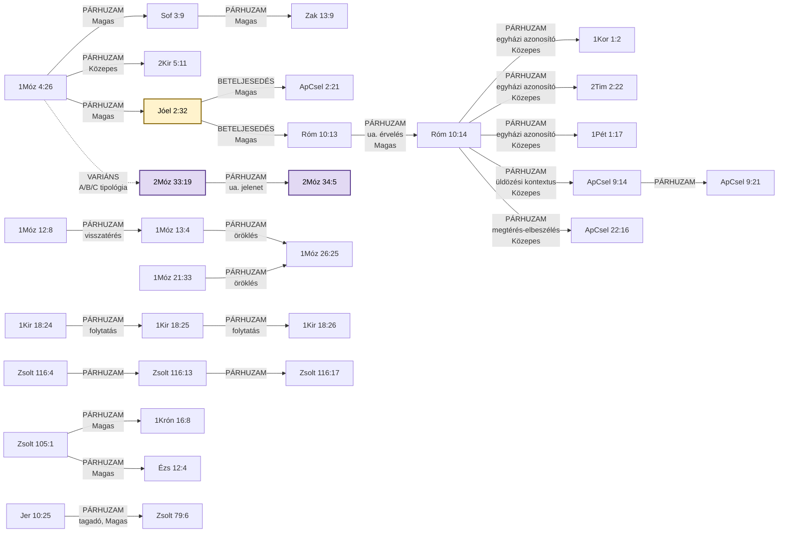

# 📖 ISTENTISZT-001 — Névbe vetett segítségül hívás

## TUDOMÁNYOS REFERENCIA-VÁLTOZAT — minden kapcsolható forrásadat

*Motívumlexikon-pilot, 2. ág (tudományos), 2026.09.06 — a `Segitsegul_
hivni_az_Urat_tematikus.md`, a `BDB_teljes_unabridged.tsv`, a
`TBESG.txt`, a `LXX_kivonat_*.tsv` fájlok és a `TSK_kereszthivatkozasok.
tsv` teljes, szó szerinti forrásanyagára építve. Ez a változat NEM
olvasmányosságra, hanem teljességre optimalizált — a párja
(`..._PILOT_olvashato.md`) az egyszerűsített, nyomtatható verzió.*

---

## 0. Metaadatok

| Mező | Érték |
|---|---|
| ID | `ISTENTISZT-001` |
| Rövid UI-címke | "Névbe vetett segítségül hívás" |
| Teljes cím | Segítségül hívni az Úr nevét |
| Formula | קָרָא בְשֵׁם יְהוָה (*kará beshém Adonáj*) |
| Kapcsolódó motívum | `ISTENTISZT-002` (Oltárépítés — Ábrám vándorlásának jelölői) — a 12:8 és 13:4 oltára fizikailag azonos a névsegítségül-hívás helyszínével, de a két motívum lexikailag elkülönül (az oltárépítés maga a cselekedet, a névsegítségül-hívás az azon végzett aktus) |
| Forrás-study | `tematikus_lezart/Segitsegul_hivni_az_Urat_tematikus.md` |
| Kereszthivatkozás-napló | `tematikus_lezart/naplok/Segitsegul_hivni_az_Urat_kereszthivatkozas_naplo.md` |
| Sablon-megfelelőség | v12, teljes (2026.09.05 audit) |

---

## 1. Előfordulások — teljes leírással (29 tétel, 29 igehely)

*(azonos a study 1. pontjával, szó szerint átemelve)*

【NAPLO: 7 új sor felvéve 2026.09.09-én (Zak 13:9, 1Kor 1:2, 2Tim 2:22,
1Pét 1:17, ApCsel 9:14, 9:21, 22:16) — a study 2026.09.08-i
v2-bővítésének utólagos átvezetése erre a lexikon-oldalra, l.
`tematikus_lezart/Segitsegul_hivni_az_Urat_tematikus.md` 1. pontja.
A négyforrásos audit ezekre a sorokra már a study-ban lefutott
(2026.09.08) — itt nem ismételt, csak átemelt tartalom.】

| Igehely | Kapcsolódás | PaRDeS-szint | Funkció | Strong-szám(ok) | BDB jelentés |
|---|---|---|---|---|---|
| 1Móz 4:26 | A formula első előfordulása — Séth fia, Énós nemzedéke; a Kain-vonal önerős civilizációépítése (4:17-24) utáni korszakváltás jele: a nemzedék tudatosan, névvel azonosítva kezdi imádni Istent | Drash (tanulság) | 🌱 **Alap-előfordulás** — a motívum legelső megjelenése a kánonban, minden későbbi eset erre vezethető vissza | H7121 (קָרָא, "hívni") + H8034 (שֵׁם, "név") | 2.c ("invokálni, segítségül hívni") |
| 1Móz 12:8 | Ábrám, Bétel és Ai között épít oltárt, és ott hívja segítségül az Úr nevét — az oltárépítés és a névsegítségül-hívás első összekapcsolása a szövegben | Drash (tanulság) | 🔁 **Ismétlődés** — a formula második, még nem rögzült szokásként ismétlődő megjelenése | H7121 (קָרָא, "hívni") + H8034 (שֵׁם, "név") | 2.c ("invokálni, segítségül hívni") |
| 1Móz 13:4 | Ábrám Egyiptomból visszatérve tudatosan felkeresi ugyanazt az oltárt, ahol korábban (12:8) segítségül hívta az Urat — a formula itt már nem egyszeri esemény, hanem felkeresett, fenntartott szokássá válik | Drash (tanulság) | ⭐ **Küszöb-előfordulás** — a 3. genezisi eset, ami miatt a motívum elérte az önálló tematikus feldolgozáshoz szükséges gyakoriságot | H7121 (קָרָא, "hívni") + H8034 (שֵׁם, "név") | 2.c ("invokálni, segítségül hívni") |
| 1Móz 21:33 | Ábrahám tamariszkuszfát ültet Beérsebában, és a névhez egy isteni jelzőt is társít: אֵל עוֹלָם (*él olám*, "örökkévaló Isten") — az egyetlen genezisi hely, ahol a formula önmagában teológiai kijelentést is hordoz Isten természetéről | — | ➕ **Bővülés** — a formula első alkalommal egészül ki isteni jelzővel, új teológiai tartalmat hordozva | H7121 (קָרָא, "hívni") + H8034 (שֵׁם, "név") | 2.c ("invokálni, segítségül hívni") |
| 1Móz 26:25 | Izsák, ugyanabban a Beérsebában, apja gyakorlatát folytatva hívja segítségül az Urat — a minta szó szerint átöröklődik a második pátriárka-nemzedékre, ugyanazon a földrajzi ponton | — | 👨‍👦 **Öröklés** — a gyakorlat generációk között, tudatos folytonossággal adódik át | H7121 (קָרָא, "hívni") + H8034 (שֵׁם, "név") | 2.c ("invokálni, segítségül hívni") |
| 1Kir 18:24 | Illés a Kármel-hegyi próbatételen egyetlen mondatban állítja szembe a két invokációt: "ti a ti isteneitek nevét hívjátok, és én segítségül hívom az Úr nevét" — a kontraszt (YHVH neve vs. a nép istenének neve) magán a versen belül van, nem két igehely között | Remez (kapcsolódás) | ⚔️ **Nyilvános versengés** — a formula először jelenik meg nyilvános, két isten közötti próbatétel kontextusában | H7121 (קָרָא) + H8034 (שֵׁם) + H0430 (אֱלֹהִים, "isten") + H3068 (יְהוָה, YHVH) | 2.c ("invokálni, segítségül hívni") |
| 1Kir 18:25 | A Baál-próféták felszólítása: "hívjátok segítségül a ti istenetek nevét" — a próbatétel gyakorlati végrehajtásának kezdete, a 24. vers kihívásának első lépése | Remez (kapcsolódás) | ⚔️ **Nyilvános versengés (folytatás)** — a próbatétel gyakorlati végrehajtása és kudarca | H7121 (קָרָא, "hívni") + H8034 (שֵׁם, "név") | 2.c ("invokálni" — itt Baál nevére alkalmazva) |
| 1Kir 18:26 | A Baál-próféták ismétlődő, egész délelőtti, sikertelen invokációja ("Baál! hallgass meg minket!") — a formula kudarca a kontraszt kiteljesedése | Remez (kapcsolódás) | ⚔️ **Nyilvános versengés (folytatás)** — a próbatétel gyakorlati végrehajtása és kudarca | H7121 (קָרָא, "hívni") + H8034 (שֵׁם, "név") | 2.c ("invokálni" — itt Baál nevére alkalmazva) |
| 2Kir 5:11 | A szíriai hadvezér, Naámán elvárja Elizeustól, hogy nyilvánosan, "az Úr, az ő Istene nevét segítségül hívva" gyógyítsa meg — a formula ismertsége egy nem-izraeli szereplő szájában is | Remez (kapcsolódás) | 🔁 **Ismétlődés, kívülálló szemszögéből** — a formula ismertsége Izraelen kívül is | H7121 (קָרָא, "hívni") + H8034 (שֵׁם, "név") | 2.c ("invokálni, segítségül hívni") |
| Sof 3:9 | Eszkatológiai ígéret: a népek nyelve megtisztul, hogy "mindnyájan segítségül hívják az Úr nevét, és egy akarattal szolgáljanak néki" — a formula univerzális, jövőbeli beteljesedésként jelenik meg | Remez (kapcsolódás) | 🔮 **Eszkatológiai kitekintés** — a formula jövőbeli, univerzális beteljesedésének előrevetítése | H7121 (קָרָא, "hívni") + H8034 (שֵׁם, "név") | 2.c (rokon — Sof 3:9 nem szerepel a BDB citációjában, de azonos szerkezetű) |
| Zak 13:9 | Sof 3:9 párja: a megtisztított maradék segítségül hívja Isten nevét, és Isten válaszol — kétirányú szövetségi megerősítés ("Népem ő... az Úr az én Istenem") | Remez (kapcsolódás) | 🔮 **Eszkatológiai kitekintés (folytatás)** — a Sof 3:9-cel párhuzamos, kétirányú szövetségi megerősítéssé bővíti az eszkatológiai ígéretet | H7121 (קָרָא, "hívni") + H8034 (שֵׁם, "név") | 2.c ("invokálni, segítségül hívni") |
| Zsolt 116:4 | A zsoltáros saját, személyes hála-könyörgésének első megfogalmazása: "segítségül hívom az Úr nevét" — az egyéni imaéletbe ágyazott gyakorlat kezdő pontja ugyanabban a zsoltárban | Remez (kapcsolódás) | 🔁 **Ismétlődés, személyes könyörgésben** — a formula az egyéni imaéletbe ágyazva | H7121 (קָרָא, "hívni") + H8034 (שֵׁם, "név") | 2.c ("invokálni, segítségül hívni") |
| Zsolt 116:13 | A formula második, szó szerinti megismétlése ugyanabban a zsoltárban, a "szabadulás poharának" felemelése kontextusában | Remez (kapcsolódás) | 🔁 **Ismétlődés, személyes könyörgésben** — a formula az egyéni imaéletbe ágyazva | H7121 (קָרָא, "hívni") + H8034 (שֵׁם, "név") | 2.c ("invokálni, segítségül hívni") |
| Zsolt 116:17 | A formula harmadik megismétlése, hála-áldozat felajánlása kontextusában — a vers második fele a görög LXX-ben autentikusan nincs lefordítva (l. 5. szakasz) | Remez (kapcsolódás) | 🔁 **Ismétlődés, személyes könyörgésben** — a formula az egyéni imaéletbe ágyazva | H7121 (קָרָא, "hívni") + H8034 (שֵׁם, "név") | 2.c ("invokálni, segítségül hívni") |
| Jóel 2:32 (MT) / 3:5 (Károli) | Az ószövetségi megfogalmazás csúcspontja: "mindaz, aki segítségül hívja az Úr nevét, megmenekül" — ezt a verset Péter (ApCsel 2:21, Pünkösd) és Pál (Róm 10:13) is szó szerint idézi az evangéliumi üzenet alátámasztására | Remez (kapcsolódás) | 🎯 **Előkép/beteljesedés** — az ÓSZ-i ígéret, amit az ÚSZ tételesen, szó szerint idéz | H7121 (קָרָא, "hívni") + H8034 (שֵׁם, "név") | 2.c ("invokálni, segítségül hívni") |
| Róm 10:14 | Pál folytatja az érvelést: "Mimódon hívják segítségül, a kiben nem hittek?" — ugyanaz a görög ige (ἐπικαλέσωνται, *epikalészóntai*), mint a 10:13-nál, retorikai/negatív irányú megfogalmazásban, a hit előfeltétel voltát hangsúlyozva | Remez (kapcsolódás) | 🎯 **Előkép/beteljesedés (folytatás)** — Pál közvetlenül továbbviszi az érvelést ugyanabban a szakaszban | G1941 (ἐπικαλέομαι) | — (ÚSZ-i, nincs önálló BDB-jelentés) |
| 1Kor 1:2 | "…mindazokkal egybe, a kik a mi Urunk Jézus Krisztus nevét segítségül hívják bármely helyen" — a formula első explicit alkalmazása Krisztusra mint az invokáció közvetlen tárgyára, egyúttal a gyülekezet önmeghatározása | Remez (kapcsolódás) | 🎯 **Előkép/beteljesedés (kiterjesztés)** — a formula önálló egyházi azonosító-formulává válik | G1941 (ἐπικαλέομαι) | — (ÚSZ-i, nincs önálló BDB-jelentés) |
| 2Tim 2:22 | "…azokkal egyetembe, a kik segítségül hívják az Urat tiszta szívből" — parenetikus alkalmazás: a segítségül hívás mint közösségi hovatartozás jele — Pál ez alapján határozza meg, kikkel érdemes együtt törekedni az igazságra/hitre/szeretetre/békességre | Remez (kapcsolódás) | 🎯 **Előkép/beteljesedés (kiterjesztés)** — a formula önálló egyházi azonosító-formulává válik | G1941 (ἐπικαλέομαι) | — (ÚSZ-i, nincs önálló BDB-jelentés) |
| 1Pét 1:17 | "…ha Atyának hívjátok őt…" — az invokáció "Atya" megszólításra alkalmazva; a Károli-fordítás nem tartja meg a "segítségül" szót, de a görög ige (ἐπικαλεῖσθε, *epikaleiszthe*) azonos | Remez (kapcsolódás) | 🎯 **Előkép/beteljesedés (kiterjesztés)** — a formula önálló egyházi azonosító-formulává válik | G1941 (ἐπικαλέομαι) | — (ÚSZ-i, nincs önálló BDB-jelentés) |
| ApCsel 9:14 | "…mindazokat…, kik a te nevedet segítségül hívják" — Saul üldözési célpontjainak leírása: a kifejezés itt válik a korai keresztények azonosító megnevezésévé | Remez (kapcsolódás) | 🎯 **Előkép/beteljesedés (kiterjesztés)** — a formula önálló egyházi azonosító-formulává válik | G1941 (ἐπικαλέομαι) | — (ÚSZ-i, nincs önálló BDB-jelentés) |
| ApCsel 9:21 | "…a kik ezt a nevet hívják segítségül" — ugyanaz a leírás, ugyanabban a fejezetben megismételve | Remez (kapcsolódás) | 🔁 **Ismétlődés** — az ApCsel 9:14-es leírás közvetlen megismétlése ugyanabban a fejezetben | G1941 (ἐπικαλέομαι) | — (ÚSZ-i, nincs önálló BDB-jelentés) |
| ApCsel 22:16 | "…segítségül híván az Úrnak nevét" — Pál saját megtérés-elbeszélésében, a keresztséggel összekapcsolva | Remez (kapcsolódás) | 🎯 **Előkép/beteljesedés (kiterjesztés)** — a formula önálló egyházi azonosító-formulává válik | G1941 (ἐπικαλέομαι) | — (ÚSZ-i, nincs önálló BDB-jelentés) |
| Zsolt 105:1 | "Hívjátok segítségül az ő nevét, hirdessétek a népek közt az ő cselekedeteit" — a genezisi hagyományból örökölt formula önálló, liturgikus tétellé válása, nem a történetszál narratív folytatása | Remez (kapcsolódás) | ⇄ **Párhuzam** — formulai/liturgikus örökség a genezisi hagyományból, nem narratív folytonosság | H7121 (קָרָא, "hívni") + H8034 (שֵׁם, "név") | 2.c ("invokálni, segítségül hívni") |
| 1Krón 16:8 | A Zsolt 105:1 szinte szó szerinti megismétlése a frigyláda Sátor elé állításának liturgiájában — ismerten a 105., 96. és 106. zsoltár összeállítását idézi | Remez (kapcsolódás) | ⇄ **Párhuzam** — formulai/liturgikus örökség a genezisi hagyományból, nem narratív folytonosság | H7121 (קָרָא, "hívni") + H8034 (שֵׁם, "név") | 2.c ("invokálni, segítségül hívni") |
| Ézs 12:4 | Szó szerint majdnem azonos a Zsolt 105:1-gyel, egy eszkatológiai hálaének kontextusában — a formula ugyanazzal a szövegezéssel bukkan fel egy teljesen más irodalmi műfajban (próféciai hálaének) | Remez (kapcsolódás) | ⇄ **Párhuzam** — formulai/liturgikus örökség a genezisi hagyományból, nem narratív folytonosság | H7121 (קָרָא, "hívni") + H8034 (שֵׁם, "név") | 2.c ("invokálni, segítségül hívni") |
| Jer 10:25 | "Öntsd ki haragodat a pogányokra... és a nemzetségekre, akik a Te nevedet nem hívják segítségül" — a formula itt tagadó, vádló formában, fordított szórenddel (a "nevedet" főnév megelőzi a "nem hívták" igét) jelenik meg, a formula elmulasztása mint a pogányok elleni vád | Remez (kapcsolódás) | ⇄🚫 **Párhuzam, tagadó forma** — a formula elmulasztása mint vád, fordított szórenddel | H7121 (קָרָא, "hívni") + H8034 (שֵׁם, "név") | 2.c ("invokálni" — tagadó szerkezetben, a mulasztás vádjaként) |
| Zsolt 79:6 | A Jer 10:25 szinte szó szerinti párhuzama, azonos vádló szerkezettel — a két könyv közti ismert szövegpárhuzam | Remez (kapcsolódás) | ⇄🚫 **Párhuzam, tagadó forma** — a formula elmulasztása mint vád, fordított szórenddel | H7121 (קָרָא, "hívni") + H8034 (שֵׁם, "név") | 2.c ("invokálni" — tagadó szerkezetben, a mulasztás vádjaként) |
| 2Móz 33:19 | Isten maga jelenti ki Mózesnek: "kihirdetem előtted az Úr nevét" — közvetlenül a Sínai-hegyi tulajdonság-kinyilatkoztatás (34:6-7) előtt; itt nem az ember hívja segítségül Isten nevét, hanem Isten mondja ki a sajátját | Remez (kapcsolódás, nyitott besorolású) | ❓ **Be nem sorolható** — a szereplők szerepe felcserélődik, egyik meglévő kategóriába sem illik tisztán | H7121 (קָרָא, "hívni") + H8034 (שֵׁם, "név") | **3** ("kihirdetni, kinyilatkoztatni" — NEM invokáció) |
| 2Móz 34:5 | Ugyanaz a jelenet folytatása: "az Úr nevében kiáltott" — Isten ténylegesen végrehajtja az előző fejezetben megígért önki­hirdetést | Remez (kapcsolódás, nyitott besorolású) | ❓ **Be nem sorolható** — a szereplők szerepe felcserélődik, egyik meglévő kategóriába sem illik tisztán | H7121 (קָרָא, "hívni") + H8034 (שֵׁם, "név") | **3** ("kihirdetni, kinyilatkoztatni" — NEM invokáció) |

---

## PaRDeS keretrendszer — a motívum egészére alkalmazva

【NAPLO: a study saját 3. pontjából átvéve, a lexikon-kiegészítés (2-4. szakasz) fényében bővítve, 2026.09.07.】

**Mit jelent ez a négy szint?** A PaRDeS a zsidó bibliaértelmezés
négy hagyományos rétegének kezdőbetűiből áll össze — mindegyik más
kérdést tesz fel ugyanarról a szövegről:

- **Peshat** (פְּשָׁט, "egyszerű") — mit mond a szöveg a
  legközvetlenebb, szó szerinti értelmében? Mi történik a
  történetben, mit tesznek a szereplők?
- **Remez** (רֶמֶז, "utalás") — hová mutat ez a szöveg még? Milyen más
  bibliai helyekkel cseng össze, milyen nagyobb ívbe illeszkedik? Itt
  még csak a kapcsolat *felismerése* a cél, következtetés nélkül —
  azt már a következő szint vonja le.
- **Drash** (דְּרַשׁ, "keresés/magyarázat") — mit tanulhatunk ebből,
  mit kell tennünk vele? Ez a normatív, alkalmazó szint: erkölcsi
  vagy gyakorlati tanulság, amit a szöveg felkínál.
- **Sod** (סוֹד, "titok") — van-e ennek mélyebb, spirituális rétege?
  Ez a legfegyelmezettebb szint: csak akkor szólal meg, ha
  ténylegesen levezethető a szövegből, nem szabad, hogy találgatás
  vagy allegorizálás legyen.

**Peshat:** a genezisi öt előfordulás (4:26, 12:8, 13:4, 21:33, 26:25)
egyetlen, folytonos gyakorlatot ír le: a hívő ember Isten nevének
invokálásával fejezi ki függőségét és hódolatát — jellemzően egy
konkrét, helyhez kötött kultikus jelhez kapcsolva (oltárépítés 12:8,
13:4 és 26:25 esetén; fa ültetése 21:33-nál). A gyakorlat nem
egyszeri esemény, hanem nemzedékeken át öröklődő szokás (Ábrahám →
Izsák), amely konkrét földrajzi pontokhoz kötődik (Bétel-Ai,
Beérseba).

**Remez:** a minta a Séthita vonaltól a pátriárkákon át húzódik
tovább, a próféták nyilvános, versengő kontextusán (1Kir 18) és a
zsoltáros személyes könyörgésén (Zsolt 116) át egy eszkatológiai,
univerzális ígéretig (Sof 3:9, Zak 13:9; Jóel 3:5/2:32), amely
Pünkösdkor (ApCsel 2:21) és Pál evangéliumi érvelésében (Róm
10:13-14) nyeri el végső alkalmazását.

**Miért nem csak véletlen szóegyezés ez:**
amikor Péter és Pál görögül idézik a formulát, egy görög igét
használnak (ἐπικαλέομαι), aminek önmagában elég tág, általános
jelentése van — bárkit meg lehet vele "szólítani", akár egy pogány
istent is. Felmerülhetne tehát a kérdés: tényleg ugyanarról a
dologról van szó, mint a genezisi történetben, vagy csak egy tág
jelentésű szót választottak, ami történetesen illik ide?

A válasz most, hogy három egymástól teljesen független szótár
(a héber BDB, és két külön görög szótár, a TBESG és Thayer)
is elérhető, egyértelműbb, mint korábban volt. A Thayer
ugyanis **külön kategóriába** teszi azt az esetet, amikor ezt a görög
igét kifejezetten **egy héber kifejezés fordításaként** használják —
külön véve attól az esettől, amikor csak simán "hívnak/szólítanak"
valakit. Vagyis maga a szótár mondja ki: ez nem esetleges
szóhasználat, hanem tudatos fordítás egy már ismert héber mintára.

【NAPLO: a Thayer 2026.09.07-től vált ténylegesen elérhetővé (l. 9. szakasz) — előtte csak a BDB és a TBESG állt rendelkezésre.】

Ez azért erősebb bizonyíték, mint egyetlen forrásra támaszkodni:
három, egymástól független szótárkészítő, más korban, más módszerrel
dolgozva jutott ugyanarra a következtetésre. Egyetlen olvasat esetén
felmerülhetne, hogy a kapcsolat csak belelátás, nem valódi — de mivel
maguk a szótárak, egymástól függetlenül, külön kezelik ezt az esetet,
ez megerősíti a motívum valódiságát: Pál és Péter nem véletlenül
fogalmaznak úgy, mint a Genezis, hanem tudatosan ugyanazt a régi
mintát viszik tovább, csak már görögül.

**Drash:** a motívum azt tanítja, hogy az istentisztelet magja nem a
nyilvános teljesítmény vagy a rituálé pontossága, hanem a
**függőség tudatos, névvel azonosított kifejezése**. Ábrahám és
Izsák párhuzama azt is megmutatja, hogy ez a fajta istentisztelet
**taníthatóvá és örökölhetővé** válik.

*(Remez-szintű kiegészítés, l. 8/b pont):* ugyanez a קָרָא+שֵׁם
szókapcsolat, felcserélt alany/tárgy-szereposztásban, Isten
önkinyilatkoztatását (2Móz 33:19/34:5) és Isten névadó tettét egy
emberen (Ézs 43:1, 44:5, 45:3) is kifejezheti — a motívum tehát nem
elszigetelt emberi gyakorlat, hanem egy tágabb, kölcsönös isteni-emberi
kommunikációs mintázat egyik pólusa.

【NAPLO: az A/B/C tipológiát a study 2026.09.07-én írta vissza.】

**Sod** *(fegyelmezetten, csak a fenti rétegekből levezetve)*: a
bűneset és Kain testvérgyilkossága utáni emberiség első dokumentált
lelki válasza nem az önmegváltás kísérlete, hanem a segítségül
hívás — a névbe vetett függőség beismerése, éles ellentétben a
Bábel-építőkkel, akik "nevet akarnak szerezni maguknak" (1Móz 11:4).
Ez tematikus, nem lexikai párhuzam. A réteg fegyelmezetten
változatlan marad.

【NAPLO: a lexikon-kiegészítés nem indokolt új Sod-szintű állítást.】

⚠️ *(a Rashi-vita itt is releváns: ha a 4:26 valójában a
bálványimádás kezdetét jelzi, a Sod-szintű "első pozitív lelki
válasz" olvasat módosulna — a projekt a többségi olvasatot követi, de
a vitát nem hallgatja el)*

---

## 2. TELJES BDB szócikk — H7121 (קָרָא), releváns jelentések szó szerint

【NAPLO: a teljes BDB-bejegyzés 10 781 karakter
(`BDB_teljes_unabridged.tsv`) — itt a motívum szempontjából releváns
2. és 3. jelentés szó szerint, angolul, forrásmegjelöléssel idézve. A
teljes szócikk a morfológiai alakokat (Qal, Niphal, Pual stb.) és
minden előfordulást is felsorolja, ami itt nem releváns, ezért nincs
beidézve.】

> **2. c.** ׳ק בְּשֵׁם י׳ *call with name of Yahweh (i.e. use it in invocation)*: Gen 4:26; 12:8; 2Kin 5:11; Jer 10:25 = Psa 79:6 16t. (1Kin 18:24 of specific appeal to ׳י to display his power), + Isa 65:1 (see Pu`al); with name of Baal 1Kin 18:24-25, 26.

**🇭🇺 Magyarul:** *"hívni Jahve nevével" (azaz segítségül hívni, invokálni)*: 1Móz 4:26; 12:8; 2Kir 5:11; Jer 10:25 = Zsolt 79:6, és további 16 előfordulás (1Kir 18:24-nél kifejezetten arra a konkrét felszólításra vonatkozik, hogy Jahve mutassa meg hatalmát), valamint Ézs 65:1 (l. szenvedő alak); Baál nevével: 1Kir 18:24-25, 26.

> **3. proclaim: a.** with accusative of thing procl. Amos 4:5; Gen 41:43; Deut 15:2; Jer 31:6; Lev 25:10 +; **׳ק followed by oratio recta [direct speech] Exod 34:6, etc.**

**🇭🇺 Magyarul:** *3. kihirdetni: a.* a kihirdetett dolog tárgyesetével: Ámós 4:5; 1Móz 41:43; 5Móz 15:2; Jer 31:6; 3Móz 25:10 és mások; **egyenes idézetet [közvetlen beszédet] követve: 2Móz 34:6, stb.**

【NAPLO: forrás — `BDB_teljes_unabridged.tsv`, H7121 sor, saját
feldolgozás (Python `csv`, `encoding='utf-8', errors='replace'`).】

**Kiemelés jelentősége:** a fenti **2.c** és **3.** jelentések —
kiemelve, mert a motívum funkcionális kettéválasztásának (emberi
invokáció vs. isteni önki­hirdetés) ez a lexikográfiai, BDB-szintű
alapja. A **2.c** citációs listája (Gen 4:26; 12:8; 2Kin 5:11; Jer
10:25 = Psa 79:6; 1Kin 18:24; Baal 1Kin 18:24-26) **önállóan, a mi
kutatásunktól függetlenül** csaknem pontosan egyezik a study saját
audit-eredményével — beleértve a Jer 10:25 = Psa 79:6 párt.

【NAPLO: a study saját auditja 2026.09.05-i; a Jer 10:25 = Psa 79:6 párt a study a BDB-idézet alapján találta meg, nem önálló kereséssel.】

---

## 3. TELJES BDB szócikk — H8034 (שֵׁם), etimológiai rész szó szerint

> **H8034. shem I. שֵׁם_864 noun masculine name (√ unknown; Thes שׁמה, compare Ba^ZMG xli (1887), 635; Lag^BN 160 ושׁם, Arabic brand, mark; Late Hebrew = Biblical Hebrew (especially הַשֵּׁם = יהוה); Phoenician שם; Assyrian šumu; Sabean סם; Ethiopic; Arabic; Aramaic שְׁמָא שֵׁם, Old Aramaic, Palmyrene שם);** — absolute ׳שׁ Gen 6:4 +; construct ׳שׁ 12:8 +...

**🇭🇺 Magyarul:** *shem I. שֵׁם — hímnemű főnév: "név" (gyök ismeretlen; a Thesaurus szerint a שׁמה szóval rokon; késői héberben megegyezik a bibliai héberrel, különösen a הַשֵּׁם ["a Név"] kifejezésben, ami YHVH körülírása; főníciaiul שם; asszírul šumu; sabeus nyelven סם; megvan etióp és arab nyelvben is; arámiul שְׁמָא/שֵׁם, óarámiul és palmürai nyelven is שם) — abszolút alakban 1Móz 6:4-től, birtokos szerkezetben 12:8-tól kezdve...*

【NAPLO: forrás — `BDB_teljes_unabridged.tsv`, H8034 sor.】

**Jelentősége:** a **"√ unknown"** (gyök ismeretlen) jelölés a szócikk
legelején azt jelzi: nincs tovább vezethető etimológia.

【NAPLO: ez a lexikográfiai alap ahhoz, hogy a study 2/b Origin-lánc lépése lezártnak minősüljön — nincs mit "elutasítani" vagy "beépíteni" ezen a téren.】

---

## 4. TELJES TBESG (Abbott-Smith) szócikkek — a három görög ige

### G1941 ἐπικαλέω (epikaleō)

**TBESG (Abbott-Smith):**

> **ἐπι-καλέω**, -ῶ [in LXX chiefly for קָרָא] —
> **1.** *to call, name, surname*: with accusative (cl.), Mat.10:25; pass., Act.1:23, 4:36, 10:5, 18, 10:22, 11:13, 12:12, 25, Heb.11:16; τ. ὄνομα, before ἐπί (denoting possession, as Heb. עַל..שֻׁם קָרָא), Act.15:17 (LXX), Jas.2:7.
> **2. Mid. (so also act.; cl., LXX), to call upon, invoke, appeal to** (θεόν, θεούς, Hdt., Xen., al.): Καίσαρα (Σεβαστόν, Act.25:25), Act.25:11-12, 21, 26:32, 28:19; sc. τ. Κύριον Ἰησοῦν, Act.7:59; μάρτυρα (cl.) τ. θεόν, 2Co.1:23; πατέρα, 1Pe.1:17; τ. κύριον, Rom.10:12, 2Ti.2:22; **τ. ὄνομα κυρίου (μου, σου; like Heb. יְהוָֹה שֻׁם קָרָא), Act.2:21 (LXX) Act.9:14, 21, 22:16, Rom.10:13-14 (LXX) 1Co.1:2** (Cremer, 335, 742). (AS)

**🇭🇺 Magyarul (Abbott-Smith):** *ἐπι-καλέω — a LXX-ben elsősorban a קָרָא megfelelője —*

**1.** *hívni, nevezni, elnevezni*: tárgyesettel (klasszikus göröngben), Mt 10:25; szenvedő szerkezetben, ApCsel 1:23, 4:36, 10:5,18,22, 11:13, 12:12,25, Zsid 11:16; "a nevet" ἐπί-vel (birtoklást jelölve, mint a héber עַל..שֻׁם קָרָא), ApCsel 15:17 (LXX), Jak 2:7.

**2. Közép alakban (de aktívban is; klasszikus göröngben és LXX-ben): *segítségül hívni, invokálni, folyamodni*** (istenhez/istenekhez): a császárhoz (fellebbezve), ApCsel 25:11-12,21, 26:32, 28:19; "az Úr Jézust", ApCsel 7:59; tanúul hívni az Istent, 2Kor 1:23; "Atyát", 1Pét 1:17; "az Urat", Róm 10:12, 2Tim 2:22; **"az Úr nevét" (enyémet/tiédet) — pontosan úgy, mint a héber יְהוָֹה שֻׁם קָרָא — ApCsel 2:21 (LXX-idézet), ApCsel 9:14,21, 22:16, Róm 10:13-14 (LXX-idézet), 1Kor 1:2.**

**Thayer's Greek-English Lexicon (2026.09.07-től ténylegesen elérhető, l. 10. szakasz) — TELJES, 5 jelentés-ágas szócikk:**

> **G1941 — ἐπικαλέω** ... the Sept. very often for קָרָא ; **1.** to put a name upon, to surname: τινα, Mat 10:25; passive ὁ ἐπικαλούμενος, "he who is surnamed", Luk 22:3, Act 10:18, 11:13, 12:12 etc. **2.** ἐπικαλεῖται τό ὄνομα τίνος ἐπί τινα, after the Hebrew ... "the name of one is named upon some one" (cf. Gesenius, Thesaurus iii., p. 1232a): Act 15:17 from Amo 9:12; Jam 2:7. **3.** τίνι with accusative — legal sense, "to charge something to one as a crime; to accuse of": Mat 10:25. **4. to call upon (like German** *anrufen***), to invoke; middle, to call upon for oneself, in one's behalf**: as a helper, Act 7:59; as a witness, 2Co 1:23; as a judge/appeal, Act 25:11, 26:32, 28:19. **5. Hebraistically (like יְהוָה בְּשֵׁם קָרָא to call upon by pronouncing the name of Jehovah, Gen 4:26; Gen 12:8; 2Ki 5:11, etc.; cf. Gesenius, Thesaurus, p. 1231b ... an expression finding its explanation in the fact that prayers addressed to God ordinarily began with an invocation of the divine name: Psa 3:2; Psa 6:2; Psa 7:2, etc.) ἐπικαλοῦμαι τό ὄνομα τοῦ κυρίου, I call upon the name of the Lord, i.e. to invoke, adore, worship, the Lord: Act 2:21 (from Joe 2:32); Act 9:14,21; 22:16; Rom 10:13; 1Co 1:2; τόν κύριον, Rom 10:12; 2Ti 2:22.**

**🇭🇺 Magyarul (Thayer, kivonatosan a releváns 4-5. pontra):** ***4. segítségül hívni** (mint a német "anrufen"), **invokálni**; közép alakban: segítségül hívni magának, a saját javára*: mint segítőt, ApCsel 7:59; mint tanút, 2Kor 1:23; mint bírót/fellebbezésként, ApCsel 25:11, 26:32, 28:19. ***5. héberiesen** (mint a יְהוָה בְּשֵׁם קָרָא, "az Úr nevét kimondva hívni segítségül", 1Móz 4:26; 12:8; 2Kir 5:11 stb.; vö. Gesenius Thesaurus, 1231b oldal ... ez a kifejezés onnan nyeri magyarázatát, hogy az Istenhez intézett imák rendszerint az isteni név segítségülhívásával kezdődtek: Zsolt 3:2; 6:2; 7:2, stb.) "az Úr nevét hívom segítségül", azaz invokálni, imádni, tisztelni az Urat*: ApCsel 2:21 (a Jóel 2:32-ből); ApCsel 9:14,21; 22:16; Róm 10:13; 1Kor 1:2; "az Urat", Róm 10:12; 2Tim 2:22.

**Miért fontos ez a lelet:** a Thayer **explicit** szétválasztja a "héberies" (Hebraistically) 5. jelentésárnyalatot a sima 4. "invokálni" jelentésárnyalattól — ez egy **harmadik, tőlünk teljesen független forrás** (BDB és Abbott-Smith után), ami megerősíti, hogy a mi motívumunk nem csupán "invokáció általában", hanem egy **specifikusan héber eredetű, azonosított nyelvi mintázat**, amit a görög fordítói/kommentár-hagyomány is külön kategóriaként kezel.

【NAPLO: a Thayer-idézet Zsolt 3:2/6:2/7:2 hivatkozásait ellenőriztük —
nem tartalmazzák a H7121+H8034 formulát; Thayer itt csak
általánosságban jegyzi meg, hogy a zsoltárok gyakran isteni névvel
kezdődnek — nem új rejtett találat, de nem is hamis nyom.】

### G2564 καλέω (kaleō)

> **καλέω**, -ῶ, [in LXX chiefly for קרא] —
> **1.** *to call, summon*: with accusative of person(s), Mat.20:8, 25:14, Mrk.3:31, Luk.19:13, Act.4:18; before ἐκ, Mat.2:15 (LXX); metaphorically, 1Pe.2:9.
> **2.** *to call to one's house, invite*: Luk.14:16, 1Co.10:27, Rev.19:9; ... metaphorically, of inviting to partake of the blessings of the kingdom of God: Rom.8:30, 9:24-25, 1Co.7:17-18...
> **3.** *to call, name, call by name*: pass., Mat.2:23, Luk.1:32, al.; with pred. nom., Mat.5:9, Luk.1:35, Rom.9:26, Jas.2:23, 1Jn.3:1. (AS)

**🇭🇺 Magyarul:** *καλέω — a LXX-ben elsősorban a קרא megfelelője —*

**1.** *hívni, odahívni*: személy tárgyesetével, Mt 20:8, 25:14, Mk 3:31, Lk 19:13, ApCsel 4:18; ἐκ-val (közül), Mt 2:15 (LXX); átvitt értelemben, 1Pét 2:9.

**2.** *házába hívni, meghívni*: Lk 14:16, 1Kor 10:27, Jel 19:9; ... átvitt értelemben, Isten országa áldásaiban való részesedésre hívva: Róm 8:30, 9:24-25, 1Kor 7:17-18...

**3.** *hívni, nevezni, néven nevezni*: szenvedő szerkezetben, Mt 2:23, Lk 1:32, és másutt; állítmányi névszóval, Mt 5:9, Lk 1:35, Róm 9:26, Jak 2:23, 1Jn 3:1.

### G0994 βοάω (boaō)

**TBESG (Abbott-Smith):**

> **βοάω**, -ῶ (βοή), [in LXX chiefly for זעק, צעק, קרא] —
> **1. absol., to cry, call out**: Mat.3:3, 27:46, Mrk.1:3, 15:34, Luk.3:4, 9:38, 18:38, Jhn.1:23, Act.8:7, 17:6, 25:24, Gal.4:27.
> **2. C. dative, to call on for help** (Heb. זעק על, Hos.7:14, al.), Luk.18:7.
> **SYN.: καλέω, to call, invite, summon; κράζω, to cry, harshly or inarticulately, as animals; κραυγάζω, intensive of κράζω. βοάω expresses emotion, whether joy, fear, etc.** (AS)

**🇭🇺 Magyarul (Abbott-Smith):** *βοάω (a βοή főnévből) — a LXX-ben elsősorban a זעק, צעק, קרא megfelelője —*

**1. önmagában: *kiáltani, hangosan szólni***: Mt 3:3, 27:46, Mk 1:3, 15:34, Lk 3:4, 9:38, 18:38, Jn 1:23, ApCsel 8:7, 17:6, 25:24, Gal 4:27.

**2. részes esettel: *segítségért kiáltani*** (héberül זעק על, Hós 7:14, és másutt), Lk 18:7.

**SZINONIMÁK: καλέω — hívni, meghívni, összehívni; κράζω — kiáltani, durván vagy artikulálatlanul, mint az állatok; κραυγάζω — a κράζω fokozott alakja. A βοάω érzelmet fejez ki — legyen az öröm, félelem vagy más.**

**Thayer's Greek-English Lexicon (2026.09.07-től ténylegesen elérhető):**

> **G994 — βοάω** ... in the Sept. mostly for קָרָא, זָעַק, צָעַק; **to cry aloud, shout: 1. to raise a cry**: of joy, Gal 4:27 (from Isa 54:1); of pain, Mat 27:46, Act 8:7. **2. to cry i.e. speak with a high, strong voice**: Mat 3:3, Mar 1:3, Luk 3:4, Joh 1:23 (all from Isa 40:3); Mar 15:34; Luk 9:38; Act 17:6; Act 21:34. **3. πρός τινα to cry to one for help, implore his aid**: Luk 18:7 (1Sa 7:8; 1Ch 5:20; Hos 7:14, etc. for אֶל...זָעַק). (Compare: ἀναβοάω, ἐπιβοάω.)

**🇭🇺 Magyarul (Thayer):** *G994 — βοάω ... a LXX-ben leginkább a קָרָא, זָעַק, צָעַק megfelelője; **hangosan kiáltani, ordítani: 1. felkiáltani***: örömből, Gal 4:27 (Ézs 54:1-ből); fájdalomból, Mt 27:46, ApCsel 8:7. ***2. kiáltani, azaz magas, erős hangon beszélni***: Mt 3:3, Mk 1:3, Lk 3:4, Jn 1:23 (mind Ézs 40:3-ból); Mk 15:34; Lk 9:38; ApCsel 17:6; ApCsel 21:34. ***3. πρός τινα — segítségért kiáltani valakihez, segítségét kérve***: Lk 18:7 (1Sám 7:8; 1Krón 5:20; Hós 7:14 stb., a héber אֶל...זָעַק megfelelőjeként). (Vö.: ἀναβοάω, ἐπιβοάω.)

**Miért fontos ez a lelet:** a Thayer megerősíti az Abbott-Smith szinonima-magyarázatát (βοάω ≠ ἐπικαλέομαι, más érzelmi regiszter), és pontosítja, hogy az Ézs 12:4-nél használt fordítói döntés (βοάω) illeszkedik a βοάω tipikus LXX-forrásaihoz (Ézs 40:3, Ézs 54:1 — mindkettő Ézsaiás-részlet, ahogy a mi versünk is!) — vagyis a fordító **stílusregiszterben és forráskönyvben is konzisztens** választást tett, nem véletlenszerű eltérést az ἐπικαλέομαι-tól.

### Kiegészítő adatok: MCGED (Mounce), SECE (Louw-Nida) és LSJ

【NAPLO: elérhetővé vált 2026.09.07-től.】

**MCGED (Mounce Concise Greek-English Dictionary) — pontos NT-előfordulás-szám mindhárom igére:**

| Ige | Frekvencia (teljes ÚSZ) | Mounce tömör gloss |
|---|---|---|
| ἐπικαλέω (G1941) | **30×** | "to call on; to attach or connect a name" |
| καλέω (G2564) | **148×** | "to call, call to... to invite... to call to a participation in the privileges of the Gospel" |
| βοάω (G994) | **12×** | "to cry out; to exclaim, proclaim... πρός τινα, to invoke, implore" |

**SECE (kibővített Strong's) — Louw-Nida szemantikai domain + teljes héber-megfelelő lista:**

| Ige | Louw-Nida domain-számok | Héber megfelelők (a teljes LXX-en át) |
|---|---|---|
| ἐπικαλέω (G1941) | 11.28, 33.131, 33.176, 56.15 | זָכַר, מָצָא, נָקַב, עָשָׂה, **קָרָא**, שׂוּם, שָׁכַן, שֻׁם |
| καλέω (G2564) | 33.129, 33.131, 33.307, 33.312, 33.315 | אָמַר, בֹּוא, דָבַר, הָיָה, זָכַר, זָעַק, לָקַח, עֲלַל, **קָרָא**, רוּם, שֵׁם |
| βοάω (G994) | 33.81 | אָמַר, הָגָה, הָמָה, זָעַק, זַעַק, כָּנָה, נָהַם, נָהַק, נָשָׂא, פָּצַח, צָהַל, צָוַח, צָעַק, צָרַח, **קָרָא**, רוּעַ, רָעַם, שָׁאַג, שָׁבַע, שָׁעָה |

**Kiemelt módszertani jelentőség:** mindhárom ige SECE-listája tartalmazza a קָרָא-t (kiemelve) mint egyik lehetséges héber forrását — ez **független megerősítés** arra, amit a mai LXX-audit talált: a קָרָא fordítása mindhárom göröggel (ἐπικαλέομαι, καλέω, βοάω) **általánosan bevett, dokumentált gyakorlat** volt, nem a mi két "kivételes" versünkre (2Móz 33:19/34:5; Ézs 12:4) jellemző egyedi eset. A Louw-Nida domain-számok egy teljesen új, **jelentés szerinti** keresési dimenziót nyitnak meg a jövőre nézve — a jelenlegi Strong-szám-alapú módszertan csak azonos-gyökű szavakat talál meg, a Louw-Nida-alapú keresés viszont *azonos jelentésmezőbe* tartozó, eltérő gyökű szavakat is felszínre hozhatna.

**LSJ (Liddell-Scott-Jones) — καλέω teljes klasszikus szócikke (13 750 karakter, itt csak reprezentatív részlet):**

> ...**II 1. call by name, name**: ὃν Βριάρεων καλέουσι θεοί ("akit Briareósznak neveznek az istenek"), Il. 1.403; ὄνομα καλεῖν τινα — "néven nevezni valakit", Od. 8.550; κ. ὄνομα ἐπί τινι — "nevet adni valaminek", Pl. Prm. 147d; κ. τινὰ ἐπὶ τῷ ὀνόματι τοῦ πατρός — "apja nevén nevezni", **Luk 1:59**... Passzívban: ὁ καλούμενος — "az úgynevezett"... **2.** Passzívban: "neveztetni", majdnem = "lenni", különösen rokonsági/státusz-kifejezésekkel...

**🇭🇺 Magyarul (kivonatosan):** a καλέω klasszikus göröngben (Homérosztól kezdve) elsősorban **"néven nevezni, elnevezni"** jelentésben áll — ez pontosan megegyezik azzal a jelentés-ággal, amit a 2Móz 33:19/34:5-nél azonosítottunk (BDB 3. jelentés, "proclaim/kihirdetni"; Thayer 1. jelentés, "to surname"). **Az LSJ tehát klasszikus görög irodalmi háttérrel is megerősíti**: a καλέω elsődleges, legrégebbi jelentése a "megnevezés" aktusa, nem az "invokáció" — így nyelvtörténetileg is indokolt, hogy a fordító pont ezt az igét választotta Isten *önmegnevező* aktusára, nem az ἐπικαλέομαι-t (ami maga is a καλέω-ból képzett, de már specializálódott "segítségül hívás" jelentéssel).

*(Az ἐπικαλέω LSJ-szócikke maga csak átirányít a καλέω alapigéhez — klasszikus lexikográfiai gyakorlat összetett igéknél, önálló LSJ-tartalom nincs rá.)*

### A héber oldal kiegészítő adatai (TBESH-konszolidáció + SECE)

**TBESH.lexicon (SQLite, konszolidált verzió)** — H7121 itt **egyetlen, tiszta bejegyzésben** jelenik meg:

【NAPLO: 2026.09.07-től elérhető; a korábban dokumentált "többsoros Strong-szám" probléma (H7121 4 alsora a szöveges TBESH.txt-ben) ezzel megoldódott.】

> קָרָא [H:V] to call **1)** to call, call out, recite, read, cry out, proclaim **1a)** (Qal) **1a1)** to call, cry, utter a loud sound **1a2) to call unto, cry (for help), call (with name of God)** **1a3)** to proclaim **1a4)** to read aloud, read (to oneself), read **1a5)** to summon, invite, call for, call and commission, appoint, call and endow **1a6)** to call, name, give name to, call by **1b)** (Niphal) ... **1c)** (Pual) to be called, be named, be called out, be chosen

**SECE H7121 — teljes görög-megfelelő lista (a teljes LXX-en át):** ἄγω, ἀναβοάω, ἀναγγέλλω, ἀναγινώσκω, ἀνακράζω, ἀνοίγω, ..., **βοάω**, ..., ἐγκαλέω, ..., **ἐπικαλέομαι** (kétszer is szerepel a listában, jelezve gyakoriságát), ..., **καλέω**, κηρύσσω, κράζω, ..., ὀνομάζω, παρακαλέω, προσκαλέομαι, ..., φωνέω. TWOT-szám: **2063**. GK-szám: **H7924**.

**SECE H8034 (שֵׁם) — görög megfelelők:** θρόνος, **καλέω**, καλός, καύχημα, **ὄνομα** (kétszer), Σήμ. TWOT-szám: **2405**.

【NAPLO: forrás mindháromhoz — `TBESG.txt` (Abbott-Smith-alapú,
STEPBible-Data, CC BY 4.0), saját `grep "^G####"` lekérdezés,
2026.09.05/06.】

**Kereszt-elemzés a három ige között (a szótár SYN.-jegyzete alapján):**
a βοáω saját szinonima-magyarázata explicit szembeállítja magát a
καλέω-val és a κράζω-val — ez azt jelenti, hogy az Ézs 12:4 fordítója
egy **tudatos, a szótár által is dokumentált stilisztikai spektrumból**
választott, nem véletlenül tért el a "szabvány" ἐπικαλέομαι-tól.

---

## 5. LXX-híd nyers adat — morfológiai részletek

| Igehely | Görög szóalak | Morfológiai kód | Strong | Forrás-jelzés |
|---|---|---|---|---|
| 1Móz 4:26 | ἐπικαλεῖσθαι | V-PMN | G1941 | ABP-pótolt |
| 1Móz 12:8 | ἐπεκαλέσατο | V-AMI-3S | G1941 | ABP-pótolt |
| 1Móz 13:4 | ἐπεκαλέσατο | V-AMI-3S | G1941 | ABP-pótolt |
| 1Kir 18:24 | ἐπικαλέσομαι | V-FMI-1S | G1941 | ABP-pótolt |
| 1Kir 18:25 | ἐπικαλεσασθε | V-AMD-2P | G1941 | ABP-pótolt |
| 1Kir 18:26 | ἐπεκαλουντο | V-IMI-3P | G1941 | ABP-pótolt |
| 2Kir 5:11 | ἐπικαλεσεται | V-FMI-3S | G1941 | ABP-pótolt |
| Sof 3:9 | επικαλεισθαι | V-PMN | *(nincs)* | ELTERO_SZOVEGALAP |
| Zsolt 105:1 | επικαλεισθε | V-PMD-2P | *(nincs)* | ABP-pótolt |
| Zsolt 116:4 | επεκαλεσαμην | V-AMI-1S | G1941\* | ABP-pótolt |
| Zsolt 116:13 | επικαλεσομαι | V-FMI-1S | G1941 | ABP-pótolt |
| Zsolt 116:17 | σοὶ θύσω θυσίαν αἰνέσεως (teljes, a görög LXX autentikusan itt végződik) | — | — | LXX_WH |
| 1Krón 16:8 | επικαλεισθε | V-PMI-2P | *(nincs)* | ELTERO_SZOVEGALAP |
| Zsolt 79:6 | επεκαλεσαντο | V-AMI-3P | *(nincs)* | ELTERO_SZOVEGALAP |
| Jer 10:25 | επεκαλεσαντο | V-AMI-3P | *(nincs)* | ELTERO_SZOVEGALAP |
| Ézs 12:4 | βοατε | V-PAD-2P | G0994 | LXX_WH |
| 2Móz 33:19 | καλεσω | (Hiph., "kihirdetem") | G2564 | LXX_WH |
| 2Móz 34:5 | εκαλεσεν | (Qal, "kihirdette") | G2564 | LXX_WH |

\* 【NAPLO: 2026.09.07-én javítva, korábban tévesen G4506 szerepelt.】

【NAPLO: forrás — `LXX_kivonat_Genezis.tsv`, `LXX_kivonat_Kiralyok_1.tsv`,
`LXX_kivonat_Kiralyok_2.tsv`, `LXX_kivonat_Sofonias.tsv`,
`LXX_kivonat_Zsoltarok.tsv`, `LXX_kivonat_Kronikak_1.tsv`,
`LXX_kivonat_Jeremias.tsv`, `LXX_kivonat_Ezsaias.tsv`,
`LXX_kivonat_Exodus.tsv`.】

---

## 6. TSK és Károli-KH kereszthivatkozás — nyers eredmény

【NAPLO: 2026.09.06, teljes 4-forrásos újrafuttatás mind a 21 igehelyre. A `PaRDeS_gyorsreferencia.md` előírja, hogy a Károli-KH/TSK vers-szintű keresésnek minden vizsgált igehelyre le kell futnia. A 2026.09.05-i audit ezt nem tartotta be következetesen (csak a 2Móz 33:19/34:5-re futott le TSK, Károli-KH pedig egyáltalán nem) — ez 2026.09.06-án lett pótolva.】

**TSK (Votes ≥ 15 szűréssel), 21 igehelyre lefuttatva — eredmény:**

- Zsolt 105:1 ↔ Ézs 12:4 (Votes 24) — **független megerősítés**
- 1Krón 16:8 ↔ Ézs 12:4 (Votes 18), 1Krón 16:8 ↔ Zsolt 105:1 (Votes 22) — **független megerősítés**
- 1Krón 16:8 → Zsolt 105:15 (Votes 22) — ellenőrizve, tartalmilag NEM releváns (a próféták érintetlenségéről szól, ugyanabban a zsoltárban)
- **Jóel 2:32 → Róm 10:14 (Votes 19) — ÚJ, VALÓDI TALÁLAT** (l. lent)
- Jóel 2:32 → Róm 10:11 (Votes 19) — ellenőrizve, nincs ἐπικαλέομαι/καλέω a versben, NEM releváns

**Károli-KH (szentiras.hu szerkesztői hálózat), 21 igehelyre lefuttatva:**

- 1Móz 13:4 → 1Móz 12:8 — **független megerősítés**
- Zsolt 105:1 → 1Krón 16:8 — **független megerősítés**
- 1Krón 16:8 → Ézs 12:4 — **független megerősítés**
- Jer 10:25 ↔ Zsolt 79:6 (mindkét irányban) — **független megerősítés**
- 2Móz 34:5 → 2Móz 33:19 — **független megerősítés**
- Zsolt 116:13 → Róm 3:13, Jak 3:8; Zsolt 116:17 → 2Sám 7:9; Zep 3:9 → Zsolt 113:3, 114:2; Ézs 12:4 → Zsolt 66:1-5, 118:1, 106:1; 2Móz 33:19 → Róm 9:15 — mind ellenőrizve, egyik sem tartalmazza a H7121+H8034/ἐπικαλέομαι formulát, NEM relevánsak

**ÚJ IGEHELY: Róm 10:14** — *"Mimódon hívják tehát segítségül, a kiben
nem hittek? mimódon hisznek pedig abban, a ki felől nem hallottak?"*
— **ἐπικαλέσωνται** (*epikalészóntai*, G1941), ugyanaz az ige, mint a
már dokumentált 10:13-nál, Pál folytatólagos érvelésében ugyanabban a
szakaszban.
Funkció: ELŐKÉP/BETELJESEDÉS klaszter kiegészítése (retorikai, negatív
irányú megfogalmazásban — "hogyan hívnák segítségül, akiben nem
hisznek" — előfeltételezi és megerősíti a 10:13 pozitív állítását).

**A 2Móz 33:19/34:5 → Ézs 12:4 és a 9 emberi-invokációs igehely felé
továbbra sincs TSK-kereszthivatkozás** — megerősítve, ez a felismerés
saját, lexikai szintű megfigyelés marad (l. korábbi megállapítás).

---

## 7. Kapcsolatok — teljes relációs adat, diagrammal és alátámasztással

*Mind a 29 táblázat-sor (29 egyedi igehely) legalább egy kapcsolatban
megjelenik — a 2026.09.09-i bővítéssel (Zak 13:9 + 6 ÚSZ-i egyházi
alkalmazás) a diagram és az alátámasztás-táblázat is kiegészült.*

*A Típus-mező öt kategóriája (l. `Bibliai_Motivumlexikon_tervezesi_
naplo.md`, 2026.09.09):*

| Típus | Rövid meghatározás |
|---|---|
| **Előkép** | korábbi esemény/alak, ami egy későbbi, teljesebb valóság mintája |
| **Párhuzam** | ismétlődő mintázat, a szereplők szerepe azonos marad |
| **Beteljesedés** | egy Előkép lezárása/valóra válása — mindig egy Előkép-jelöléshez kapcsolódik |
| **Kontraszt** | két fél szándékosan szembeállítva, a lényeg az eltérés |
| **Variáns** | ugyanaz a lexikai/formula-mag, de a szereplők szerepe szisztematikusan felcserélődik, nem szembeállítva |

*Jelmagyarázat: a sárga csomópont (Jóel 2:32) az Előkép, ahonnan a
Beteljesedés (ApCsel 2:21, Róm 10:13) indul; a lila csomópontok
(2Móz 33:19/34:5) a Variáns esetet jelölik (A/B/C tipológia, B-eset:
azonos szerkezet, felcserélt alany/tárgy) — a szaggatott nyíl a
lexikai (nem funkcionális) alapú kapcsolatot jelzi A és G között.*

**Megjegyzés az 1Kir 18:24-hez — Típus: Kontraszt:** a kontraszt (Baál neve vs. YHVH neve) **egyetlen versen belül**
jelenik meg — Illés egy mondatban mondja ki mindkét felet ("ti a ti
istenetek nevét, én az Úr nevét").

【NAPLO: séma-korlát, amit ez a bővítés feltárt — a KAPCSOLATOK-réteg jelenlegi formátuma (Forrás-igehely | Cél-igehely) két különböző igehelyet feltételez, egy versen belüli kontrasztot nem tud natívan ábrázolni. Ezért a fenti diagramban ez most csak narratív sorozatként (24→25→26, "ismétlés/visszatérés") szerepel, a belső kontraszt puszta prózai megjegyzésként marad a tematikus study-ban, nem KAPCSOLAT-sorként. Valódi, a pilot által felszínre hozott tervezési kérdés a `Bibliai_Motivumlexikon_tervezesi_naplo.md` KAPCSOLATOK-fejezetéhez.】

### A kapcsolatok alátámasztása

*Minden sor: miért ez a funkció-címke, miért ez a bizonyossági szint.*

| Kapcsolat | Alátámasztás |
|---|---|
| 1Móz 4:26 → Sof 3:9 | Mindkettő explicit a formulát alkalmazza istentiszteleti kontextusban ("segítségül hívni az Úr nevét" / "segítségül hívják mindnyájan az Úr nevét") — közös, felismerhető hitvallási nyelvezet, nem csak tematikus rokonság. |
| 1Móz 4:26 → 2Kir 5:11 | Naámán nem szó szerint idézi a formulát, hanem parafrazálja ("segítségül hívja az Úr, az ő Istene nevét") — a tartalmi kapcsolat egyértelmű, de nincs szó szerinti szövegi egyezés, innen a Közepes (nem Magas) bizonyosság. |
| 1Móz 4:26 → Jóel 2:32 → ApCsel 2:21 / Róm 10:13 | Az ApCsel és a Róma-levél **szó szerint**, görögül idézi a LXX Jóel-szöveget (πᾶς ὃς ἂν ἐπικαλέσηται τὸ ὄνομα Κυρίου σωθήσεται) — ez verbális, nem csak tematikus idézés, innen a Magas bizonyosság mindkét NT-kapcsolatnál. |
| 1Móz 4:26 → 2Móz 33:19 | A lexikai kapocs (azonos H7121+H8034 pár) önmagában Magas bizonyosságú — de a BDB eltérő jelentés alá sorolja (2.c vs. 3.) és a LXX eltérő igét használ (ἐπικαλέομαι vs. καλέω), ezért a *funkcionális* besorolás marad nyitott, a *lexikai* kapcsolat bizonyossága nem. |
| 1Móz 12:8 → 1Móz 13:4 | A szöveg explicit jelzi: Ábrám "**visszatér** ugyanahhoz az oltárhoz" — azonos helyszín, azonos szereplő, közvetlen szövegi utalás, nem rekonstrukció. |
| 1Móz 13:4 → 1Móz 26:25 / 1Móz 21:33 → 1Móz 26:25 | Izsák explicit Ábrahám fia, ugyanazon a földrajzi ponton (Beérseba) cselekszik — a genealógiai és helyrajzi kapcsolat mindkét irányban a szövegből, nem következtetésből ered. |
| 1Kir 18:24 → 18:25 → 18:26 | Egyazon pericope (a Kármel-hegyi próbatétel) közvetlenül egymást követő versei — a narratív folytonosság szövegi tény, nem értelmezés. |
| Zsolt 116:4 → 116:13 → 116:17 | Egyazon zsoltár, egyazon beszélő (a zsoltáros) — a formula szó szerinti, azonos szövegű megismétlése ugyanabban a versben, háromszor. |
| Zsolt 105:1 → 1Krón 16:8 | A két szöveg **majdnem szó szerint azonos** — 1Krón 16 ismerten a Zsolt 105/96/106 összeállítását idézi a frigyláda Sátor elé helyezésekor; ez bibliakritikailag jól dokumentált szövegpárhuzam, nem feltételezés. |
| Zsolt 105:1 → Ézs 12:4 | Szinte szó szerinti egyezés a formulában, de nincs explicit idézési jelzés egyik szövegben sem — a Magas bizonyosság a szövegi hasonlóság mértékén alapul, nem irodalomkritikai konszenzuson a közvetlen függésről. |
| Jer 10:25 → Zsolt 79:6 | A két vers csaknem szóról szóra megegyezik (jól ismert, kommentárokban gyakran tárgyalt szövegpárhuzam a két könyv között) — a Magas bizonyosság indokolt. **2026.09.06: Károli-KH is megerősíti, mindkét irányban.** |
| Róm 10:13 → Róm 10:14 | Ugyanaz a görög ige (ἐπικαλέομαι), Pál közvetlenül folytatódó érvelésében ugyanabban a szakaszban — TSK-eredetű lelet, 2026.09.06. |
| Sof 3:9 → Zak 13:9 | Mindkettő explicit, egyértelműen eszkatológiai ígéretként fogalmazza meg a segítségül hívást; Zak 13:9 kétirányú szövetségi megerősítéssel egészíti ki (Isten is válaszol) — közös próféciai regiszter, innen a Magas bizonyosság. |
| Róm 10:14 → 1Kor 1:2 / 2Tim 2:22 / 1Pét 1:17 / ApCsel 9:14 / ApCsel 22:16 | Azonos görög ige (ἐπικαλέομαι/ἐπικαλεῖσθε), de nincs szó szerinti idézési kapcsolat a Jóel-lánchoz vagy egymáshoz — a kapcsolat lexikai (azonos G1941 szó, azonos jelentés-ág), nem verbális idézés, innen a Közepes (nem Magas) bizonyosság. |
| ApCsel 9:14 → ApCsel 9:21 | Ugyanaz a leírás, ugyanabban a fejezetben, néhány verssel később szó szerint megismételve ("kik ezt a nevet hívják segítségül") — Magas bizonyosság. |

*(A nyers, gépileg olvasható adat: `Motivum_kapcsolatok_PILOT.tsv`,
25 sor, oszlopok: Forrás-igehely | Cél-igehely | Motívum-ID | Típus |
Funkció | Bizonyosság | PaRDeS-szint. A 2026.09.09-i bővítéssel 7 új
sorral egészült ki.)*

【NAPLO: névütközés-figyelmeztetés — a TSV "Típus" oszlopa (LEXIKAI/
NARRATÍV/STRUKTURÁLIS/TEMATIKUS) egy MÁSIK, a kapcsolat jellegét leíró
tengely, nem azonos a fenti diagramban használt PaRDeS Típus-mezővel
(Előkép/Párhuzam/Beteljesedés/Kontraszt/Variáns). A TSV-ben jelenleg
nincs önálló oszlop a PaRDeS Típus-mezőre — ez nyitott kérdés marad.】

---

## 8. Módszertani napló — a 8 ellenőrzési réteg összegzése

| # | Módszer | Eredmény |
|---|---|---|
| 1 | Nyers Strong-szám grep | 153 találat (túl zajos) |
| 2 | Kalibrált pozíció-alapú frázis-keresés | 9 ismert + 2Móz 33:19/34:5 |
| 3 | Hamis-negatív teszt (tág ablak) | 0 új, megerősítve |
| 4 | Anaforikus névmás-bővítés | 7 jelölt, 3 valódi + 4 hamis pozitív |
| 5 | TSK kereszthivatkozás | Ézs 12:4 |
| 6 | BDB szótári idézet-ellenőrzés | Jer 10:25 / Zsolt 79:6 |
| 7 | Kétirányú szórend-ellenőrzés, teljes ÓSZ | 0 új, megerősítve |
| 8 | Szisztematikus LXX-egyeztetés, mind a 17 versre | 15/17 ἐπικαλέομαι; 2 kivétel; 1 adathiba; 1 kinyerési hiány |

**Teljes indoklás:** l. a chat-munkamenet 2026.09.05-i naplója és a
`Segitsegul_hivni_az_Urat_kereszthivatkozas_naplo.md`.

---

## 8/b. A "be nem sorolható" eset mögötti hármas tipológia (A/B/C)

【NAPLO: eredetileg lexikon-pilot-only megfigyelésként rögzítve, 2026.09.06. 2026.09.07-én a study PaRDeS-keretrendszer Drash-szakaszába visszaírva (l. fent) — ez a szakasz itt a tipológia teljes, részletes kifejtését őrzi.】

Az elutasított jelöltek (Ézs 43:1, 44:5, 45:3
— "Isten néven szólít egy embert") és a "be nem sorolható" eset
(2Móz 33:19/34:5 — "Isten kihirdeti saját nevét") **együtt nézve nem
véletlen zaj, hanem egy koherens, háromtagú mintázat** részei. A
קָרָא + שֵׁם szerkezet ugyanazokkal a szavakkal, de szisztematikusan
variálódó alany/tárgy-szereposztással három, egymástól élesen
elkülönülő teológiai aktust fejez ki:

【NAPLO: a jelöltek eredeti elutasítása és a "be nem sorolható" besorolás a 2026.09.05-i audit eredménye; a hármas mintázat felismerése 2026.09.06-i.】

| Minta | Alany | Tárgy | Igehelyek | Eddigi kezelés |
|---|---|---|---|---|
| **A — fő motívum** | ember | Isten neve | a 15 emberi-invokációs eset (l. 1. pont) | ✅ a study fő tárgya |
| **B** | Isten | saját neve | 2Móz 33:19, 34:5 | "be nem sorolható" — l. 1. pont |
| **C** | Isten | ember neve | Ézs 43:1, 44:5, 45:3 | ❌ elutasítva, "hamis pozitív" |

**Miért fontos ez:** a "B" eset eddig elszigetelt anomáliaként szerepelt
a study-ban ("nem sorolható be a meglévő funkciók egyikébe sem"). A
"C" jelöltek pedig egyszerűen ki lettek zárva, mint a motívumhoz nem
tartozó zaj. Együtt nézve viszont kiderül: **mindhárom minta ugyanannak
a nyelvi szerkezetnek a szisztematikus variánsa**, nem esetleges
egybeesés — a "B" tehát nem a "be nem sorolható" kategóriába, hanem egy
**önálló, felismerhető harmadik mintázatba** tartozik, aminek a "C" is
tagja.

**Amit ez a felismerés NEM állít:**

- Nem állítja, hogy A/B/C motívum-szinten összetartozna (a study
  fókusza jogosan marad az A mintán) — csak azt, hogy a **lexikai
  szerkezet szintjén** van egy magasabb rendű, közös minta.
- Nem old meg semmit a KAPCSOLATOK-réteg funkció-készletében — a
  "be nem sorolható" címke a study-ban marad, amíg nincs döntés arról,
  hogy a lexikonban legyen-e egy negyedik, formális funkció-kategória
  (pl. "TIPOLÓGIAI VÁLTOZAT" vagy hasonló) erre a jelenségre.

**Nyitott kérdés a folytatáshoz:** érdemes-e ezt a hármas tipológiát
(A/B/C) saját, önálló megfigyelésként rögzíteni a
`Bibliai_Motivumlexikon_tervezesi_naplo.md`-ben, mint a KAPCSOLATOK-
réteg funkció-készletének egy általánosítható kiegészítését — nem csak
erre az egy motívumra, hanem elvi mintaként más "elhívás/megnevezés"
jellegű motívumoknál is alkalmazható módon?

【NAPLO: a fenti nyitott kérdés 2026.09.09-én megválaszolva — l.
`Bibliai_Motivumlexikon_tervezesi_naplo.md` KAPCSOLATOK Típus-mező v1
döntése: az A/B/C tipológia (szereplő-csere ugyanazon a szerkezeten
belül) a KAPCSOLATOK-réteg új **Variáns** kategóriájába tartozik.】

### D — negyedik minta: נִקְרָא...עַל (birtoklás/hovatartozás), kizárva

A H7121+H8034 kombinált teljes-előfordulás scan
(`tematikus_lezart/Segitsegul_hivni_az_Urat_tematikus.md`, 2026.09.08-i
v2-bővítés) egy negyedik, nyelvtanilag élesen elkülönülő szerkezetet is
felszínre hozott: **נִקְרָא...עַל** (*nikrá...al*, "[egy név] hivatik ...
felette/rajta") — passzív nifal ige + עַל elöljárószó, szemben a fő
motívum aktív קָרָא + בְּ szerkezetével. Ez nem invokációt fejez ki, hanem
**birtoklást/hovatartozást**: "X az Ő nevéről neveztetik", azaz X
Istenhez tartozik, az Ő tulajdona. Példák: a frigyláda (2Sám 6:2, 1Krón
13:6), a jeruzsálemi templom (Jer 7:10-11,14,30), Izráel egésze (5Móz
28:10).

**Ez a motívumhoz NEM tartozik** — Q3-fegyelem: azonos két gyök, de
eltérő grammatikai forma (aktív vs. passzív), eltérő elöljárószó (בְּ
vs. עַל), és eltérő jelentés (invokáció vs. birtoklás). **ÚSZ-párja:**
Zsid 11:16 (ugyanez a D-minta, passzív "neveztetni" értelemben, G1941)
— emiatt explicit kizárva, annak ellenére, hogy Strong-szinten (G1941)
azonos szót használ, mint a fő motívum ÚSZ-i helyei.

**Kapcsolata az A/B/C tipológiához:** a D-minta ugyanannak a
קָרָא+שֵׁם szerkezetnek egy negyedik szisztematikus variánsa — de mivel
az alany itt nem személy (Isten vagy ember), hanem egy tárgy/hely/nép,
amire a név *rájuk mondatik*, ez nem simán illeszkedik az A/B/C sorba
(ahol mindhárom esetben egy invokáló/megnevező cselekvő és egy
megnevezett/invokált fél áll szemben); a D inkább egy ötödik dimenzió
(birtoklás-kifejezés), nem az A/B/C egyenes folytatása.

【NAPLO: felismerve és a study-ban explicit kizárva, 2026.09.08. Itt, a
lexikon-oldalon dokumentálva 2026.09.09-én, hogy egy jövőbeli kör
tévesen ne sorolja be a motívumba.】

---

## 9. Nyitott kérdések és séma-korlátok

1. **2Móz 33:19/34:5 funkcionális besorolása** — nem sorolható be a
   meglévő KAPCSOLATOK-funkciók egyikébe sem (l. 1. pont indoklása a
   tematikus study-ban). Javasolt felvétel a
   `Bibliai_Motivumlexikon_tervezesi_naplo.md`-be nyitott kérdésként.
2. **Egy versen belüli kontraszt (1Kir 18:24)** — a KAPCSOLATOK-séma
   (Forrás-igehely | Cél-igehely, mindig két igehely) nem tudja
   natívan ábrázolni.
3. **A görög oldal erősítése** — 5 dokumentált lehetőség
   (`konkordancia/Javasolt_gorog_oldal_erositese.md`). Ebből a
   "Thayer beszerzése" pont **2026.09.07-én ténylegesen megoldódott**:
   a teljes Thayer's Greek-English Lexicon SQLite-fájlban elérhetővé
   vált (5427 bejegyzés), és ebbe a pilot-oldalba be is építve (l. 4.
   szakasz). **A fájl repóba emelése még külön döntést igényel.**
4. ~~LXX-híd 2 adatminőségi hibája~~ — 2026.09.07-én lezárva: Zsolt
   116:4 téves G-címkéje javítva G1941-re; Zsolt 116:17 "hiánya"
   tévhitnek bizonyult — a görög LXX autentikusan nem fordítja le a
   vers második felét, a kivonat eleve helyes és teljes volt.
