**Ítéletkódok** (CREMER_OCR_BRIEF.md O0.6.4): `ok`; `n<k>` nem-szó görög
(pl. Odvatos); `l<k>` latinosított görög (pl. Adtapoy, x.7.r.); `v<k>` valós szóra
cserélt görög (pl. ὅτε/ὅτι); `h<k>` csak ékezet-, hehezet-, iota subscriptum- vagy
koronishiba; `m<k>` a képen görög, a rétegből hiányzik; `e<k>` hibás vagy
latinosított héber hely. Egy sorban több kód is állhat, vesszővel elválasztva.

| sorszám | kivágás | cremuoft-sor | gépi jelölés | ítélet |
|---|---|---|---|---|
| 1 | 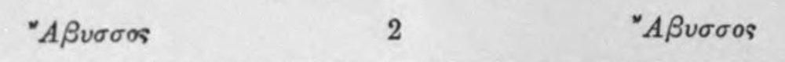 | ἤΑβυσσος 2 Αβυσσος | c5_nem_igazolt |  |
| 2 | 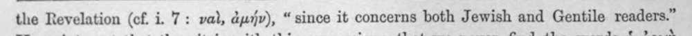 | the Revelation (cf. i. 7: ναὶ, ἀμήν), “since it concerns both Jewish and Gentile readers.” | (csak görög, jelzés nélkül) |  |
| 3 | 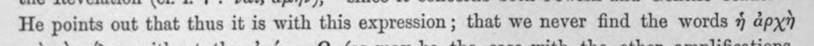 | He points out that thus it is with this expression; that we never find the words ἡ ἀρχὴ | (csak görög, jelzés nélkül) |  |
| 4 | 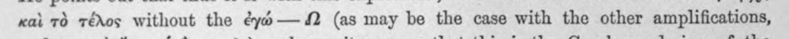 | καὶ τὸ τέλος without the éyd— (as may be the case with the other amplifications, | (csak görög, jelzés nélkül) |  |
| 5 | 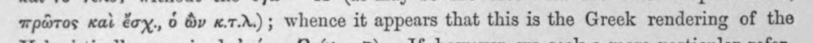 | πρῶτος καὶ ἔσχ., ὁ dy x.7..); whence it appears that this is the Greek rendering of the | latin_torzkep |  |
| 6 | 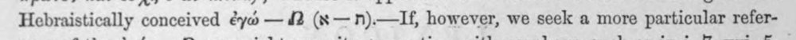 | Hebraistically conceived ἐγώ --- 42 (x—n).—If, however, we seek a more particular refer- | latin_torzkep |  |
| 7 | 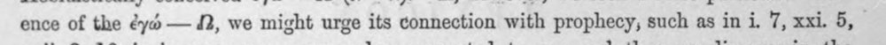 | ence of the ἐγώ --- 2, we might urge its connection with prophecy, such as in i. 7, xxi. 5, | latin_torzkep |  |
| 8 | 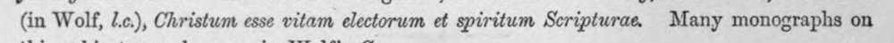 | (in Wolf, 1..), Christum esse vitam electorum et spiritum Scripturae. Many monographs on | latin_torzkep |  |
| 9 | 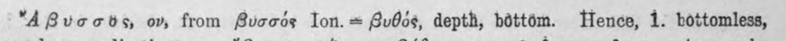 | "Αβυσσὸς, ον, from βυσσός Ion. = βυθός, depth, béttém. Hence, 1. bottomless, | c5_nem_igazolt |  |
| 10 | 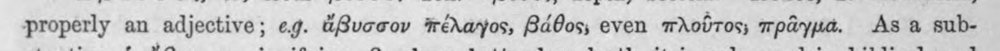 | properly an adjective; eg. ἄβυσσον πέλαγος, βάθος, even πλοῦτος; πρᾶγμα. As a sub- | (csak görög, jelzés nélkül) |  |
| 11 | 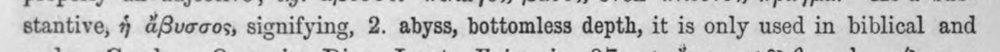 | stantive, ἡ ἄβυσσος, signifying, 2. abyss, bottomless depth, it is only used in biblical and | latin_torzkep |  |
| 12 | 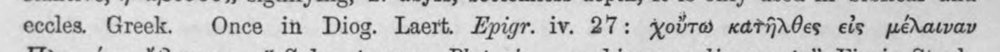 | eccles. Greek. Once in Diog. Laert. Epigr. iv. 27: otro κατῆλθες εἰς μέλαιναν | c5_nem_igazolt, latin_torzkep |  |
| 13 | 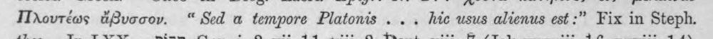 | Πλουτέως ἄβυσσον. “ Sed a tempore Platonis . . . hic usus alienus est :” Fix in Steph. | c5_nem_igazolt, latin_torzkep |  |
| 14 | 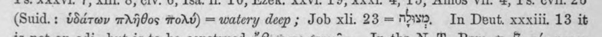 | (Suid.: ὑδάτων πλῆθος “πολῦ) = watery deep ; Job xli. 23 = nDWID, In Deut. xxxiii. 13 it | c5_nem_igazolt, latin_torzkep |  |
| 15 | 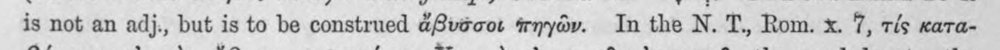 | is not an adj., but is to be construed ἄβυδσοι πηγῶν. In the N. T., Rom. x. 7, τίς κατα- | c5_nem_igazolt |  |
| 16 | 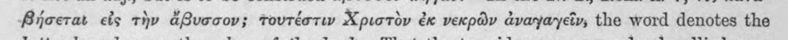 | ιβήσεται εἰς τὴν ἄβυσσον; τουτέστιν Χριστὸν ἐκ νεκρῶν ἀναγαγεῖν, the word denotes the | c5_nem_igazolt |  |
| 17 | 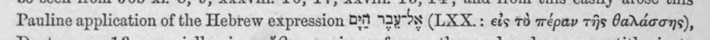 | Pauline application of the Hebrew expression ὉΠ Ἔν ΟΝ (LXX.: εἰς τὸ πέραν τῆς θαλάσσης), | c5_nem_igazolt |  |
| 18 | 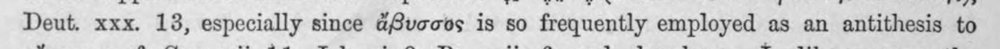 | Deut. xxx. 13, especially since ἄβυσσος is so frequently employed as an antithesis to | (csak görög, jelzés nélkül) |  |
| 19 | 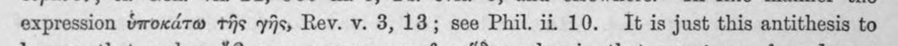 | expression ὑποκάτω τῆς γῆς, Rev. v. 3,18; see Phil. ii 10. It is just this antithesis to | (csak görög, jelzés nélkül) |  |
| 20 | 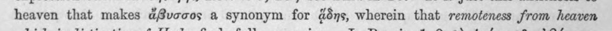 | heaven that makes ἄβυσσος a synonym for 48s, wherein that remoteness from heaven | latin_torzkep |  |
| 21 | 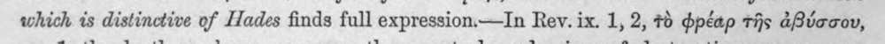 | which is distinctive of Hades finds full expression—In Rev. ix. 1, 2, Τὸ φρέαρ τῆς ἀβύσσου, | (csak görög, jelzés nélkül) |  |
| 22 | 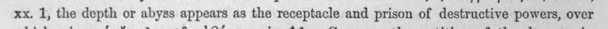 | xx. 1, the depth or abyss appears as the receptacle and prison of destructive powers, over | latin_torzkep |  |
| 23 | 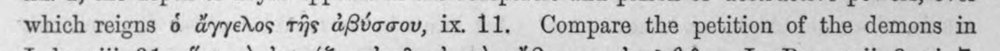 | which reigns 6 ἄγγελος τῆς ἀβύσσου, ix. 11. Compare the petition of the demons in | latin_torzkep |  |
| 24 | 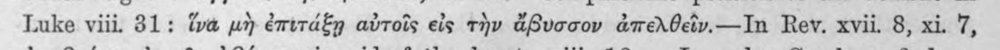 | Luke viii. 31: ἵνα μὴ ἐπιτάξῃ αὐτοῖς εἰς τὴν ἄβυσσον ἀπελθεῖν.----Τὰ Rev. xvii. 8, xi. 7, | c5_nem_igazolt |  |
| 25 | 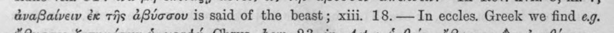 | ἀναβαίνειν ἐκ τῆς ἀβύσσου is said of the beast; xiii. 18.— In eccles. Greek we find eg. | (csak görög, jelzés nélkül) |  |
| 26 | 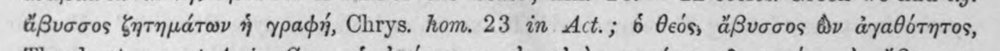 | ἄβυσσος ζητημάτων ἡ γραφή, Chrys. hom. 23 in Act.; ὃ θεός, ἄβυσσος dv ἀγαθότητος, | (csak görög, jelzés nélkül) |  |
| 27 | 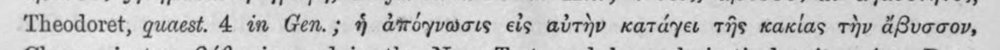 | Theodoret, quaest. 4 in Gen.; ἡ ἀπόγνωσις εἰς αὐτὴν κατάγει τῆς κακίας τὴν ἄβυσσον, | c5_nem_igazolt |  |
| 28 | 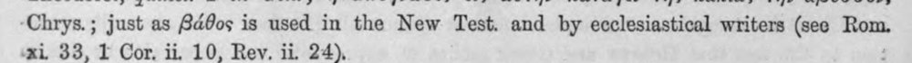 | ‘Chrys. ; just as βάθος is used in the New Test. and by ecclesiastical writers (see a. | (csak görög, jelzés nélkül) |  |
| 29 | 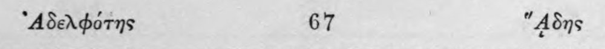 | ᾿Αδελφότης 67 “ἅδης | c5_nem_igazolt |  |
| 30 | 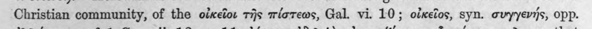 | Christian community, of the οἰκεῖοι τῆς πίστεως, Gal. vi. 10; οἰκεῖος, syn. συγγενής, opp. | (csak görög, jelzés nélkül) |  |
| 31 | 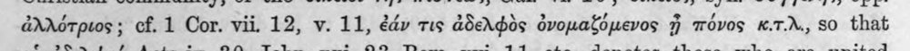 | ἀλλότριος ; cf. 1 Cor. vii. 12, v. 11, ἐάν τις ἀδελφὸς ὀνομαζόμενος ἢ πόνος K.7.r., 580 that | (csak görög, jelzés nélkül) |  |
| 32 | 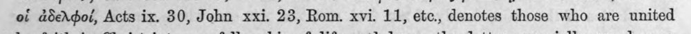 | οἱ ἀδελφοί, Acts ix. 30, John xxi. 23, Rom. xvi. 11, etc., denotes those who are united | (csak görög, jelzés nélkül) |  |
| 33 | 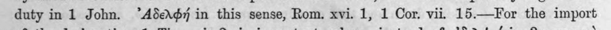 | duty in 1 John. ᾿Αδελφή in this sense, Rom. xvi. 1, 1 Cor. vii. 15.—For the import | c5_nem_igazolt |  |
| 34 | 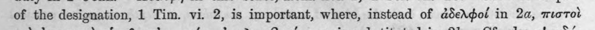 | of the designation, 1 Tim. vi. 2, is important, where, instead of ἀδελφοί in 2a, πιστοὶ | (csak görög, jelzés nélkül) |  |
| 35 | 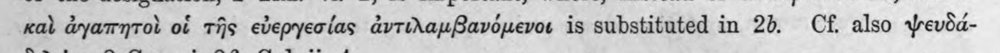 | καὶ ἀγαπητοὶ οἱ τῆς εὐεργεσίας ἀντιλαμβανόμενοι is substituted in 2b. Cf. also Ψευδά- | c5_nem_igazolt |  |
| 36 | 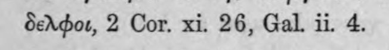 | δελφοι, 2 Cor, xi. 26, Gal. ii. 4. | (csak görög, jelzés nélkül) |  |
| 37 | 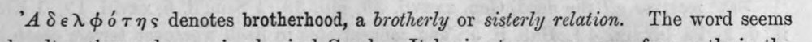 | ᾿Αδελφότης denotes brotherhood, a brotherly or sisterly relation. The word seems | c5_nem_igazolt, latin_torzkep |  |
| 38 | 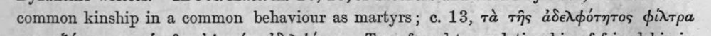 | common kinship in a common behaviour as martyrs; 6. 13, τὰ τῆς ἀδελφότητος φίλτρα | (csak görög, jelzés nélkül) |  |
| 39 | 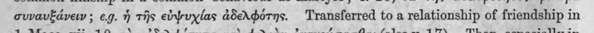 | συναυξάνειν ; e.g. ἡ τῆς εὐψυχίας ἀδελφότης. Transferred to a relationship of friendship in | c5_nem_igazolt, latin_torzkep |  |
| 40 | 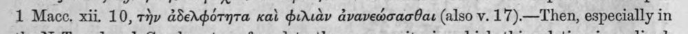 | 1 Mace. xii. 10, τὴν ἀδελφότητα καὶ φιλιὰν ἀνανεώσασθαι (also v. 17).—Then, especially in | c5_nem_igazolt |  |
| 41 | 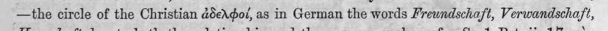 | —the circle of the Christian ἀδελφοί, as in German the words Frewndschaft, Verwandschaft, | (csak görög, jelzés nélkül) |  |
| 42 | 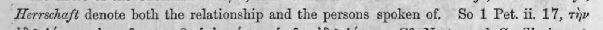 | Herrschaft denote both the relationship and the persons spoken of. So 1 Pet. ii. 17, τὴν | latin_torzkep |  |
| 43 | 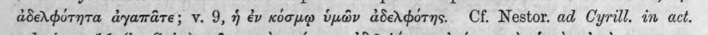 | ἀδελφότητα ἀγαπᾶτε; v. 9, ἡ ἐν κόσμῳ ὑμῶν ἀδελφότης. Cf. Nestor. ad Cyrill. in act. | (csak görög, jelzés nélkül) |  |
| 44 | 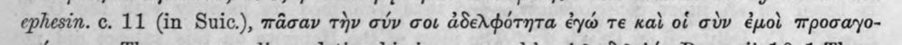 | ephesin. ο. 11 (in Suic.), πᾶσαν τὴν σύν σοι ἀδελφότητα ἐγώ τε καὶ of σὺν ἐμοὶ mpocayo- | latin_torzkep |  |
| 45 | 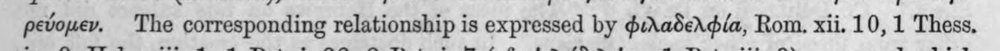 | ρεύομεν. The corresponding relationship is expressed by φιλαδελφία, Rom. xii. 10, 1 Thess. | (csak görög, jelzés nélkül) |  |
| 46 | 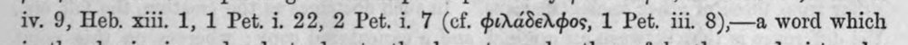 | iv. 9, Heb. xiii. 1, 1 Pet. i. 22, 2 Pet. i. 7 (cf. φιλάδελφος, 1 Pet. iii. 8)—a word which | (csak görög, jelzés nélkül) |  |
| 47 | 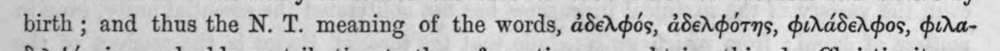 | birth ; and thus the N. T. meaning of the words, ἀδελφός, ἀδελφότης, φιλάδελφος, φιλα- | (csak görög, jelzés nélkül) |  |
| 48 | 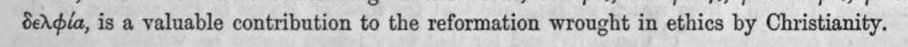 | δελφία, is a valuable contribution to the reformation wrought in ethics by Christianity. | latin_torzkep |  |
| 49 | 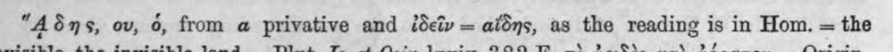 | “4δης, ov, 6, from a@ privative and ἐδεῖν = αἴδης, as the reading is in Hom. = the | c5_nem_igazolt |  |
| 50 | 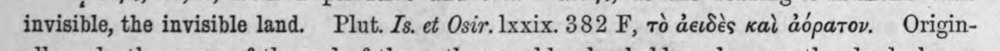 | invisible, the invisible land. Plut. Js. οὐ Osir. lxxix. 382 F, τὸ ἀειδὲς καὶ ἀόρατον. Origin- | c5_nem_igazolt |  |
