| sorszám | kivágás | cremuoft-sor | gépi jelölés | ítélet |
|---|---|---|---|---|
| 51 | 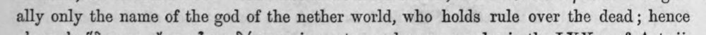 | ally only the name of the god of the nether world, who holds rule over the dead; hence | latin_torzkep |  |
| 52 | 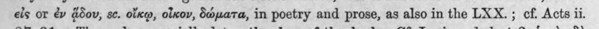 | eis or ἐν ddov, sc. οἴκῳ, οἶκον, δώματα, in poetry and prose, as also in the LXX. ; ef. Acts ii. | (csak görög, jelzés nélkül) |  |
| 53 | 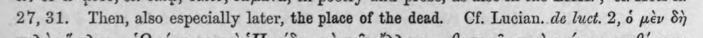 | 27,31. Then, also especially later, the place of the dead. Cf. Lucian. de luct. 2, ὁ μὲν δὴ | (csak görög, jelzés nélkül) |  |
| 54 | 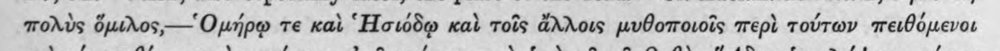 | πολὺς ὅμιλος,---Ομήρῳ te καὶ “Howd@ καὶ τοῖς ἄλλοις μυθοποιοῖς περὶ τούτων πειθόμενοι | c5_nem_igazolt |  |
| 55 | 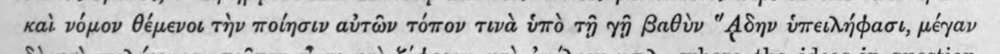 | καὶ νόμον θέμενοι τὴν ποίησιν αὐτῶν τόπον τινὰ ὑπὸ τῇ γῇ βαθὺν “4δην ὑπειλήφασι, μέγαν | c5_nem_igazolt |  |
| 56 | 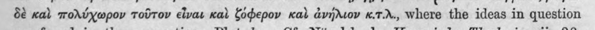 | δὲ καὶ πολύχωρον τοῦτον εἶναι καὶ ζόφερον καὶ ἀνήλιον «.7.r., where the ideas in question | c5_nem_igazolt |  |
| 57 | 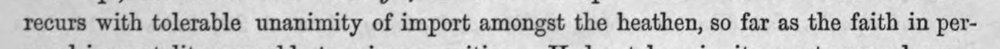 | recurs with tolerable unanimity of import amongst the heathen, so far as the faith in per- | latin_torzkep |  |
| 58 | 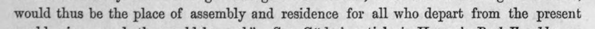 | would thus be the place of assembly and residence for all who depart from the present | latin_torzkep |  |
| 59 | 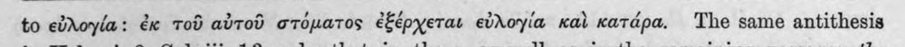 | to εὐλογία: ἐκ τοῦ αὐτοῦ στόματος ἐξέρχεται εὐλογία καὶ κατάρα. The same antithesis | (csak görög, jelzés nélkül) |  |
| 60 | 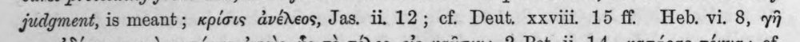 | judgment, is meant; κρίσις ἀνέλεος, Jas. ii, 12; cf Deut. xxviii 15 ff Heb. vi. 8, γῆ | latin_torzkep |  |
| 61 | 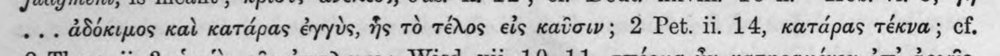 | .. . ἀδόκιμος καὶ κατάρας ἐγγὺς, ἧς τὸ τέλος εἰς καῦσιν ; 2 Pet. ii. 14, κατάρας τέκνα ; cf. | (csak görög, jelzés nélkül) |  |
| 62 | 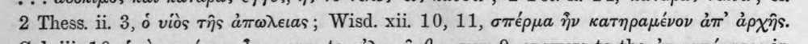 | 2 Thess. ii. 3, ὁ υἱὸς τῆς ἀπωλειας ; Wisd. xii. 10, 11, σπέρμα ἣν κατηραμένον an’ ἀρχῆς. | c5_nem_igazolt |  |
| 63 | 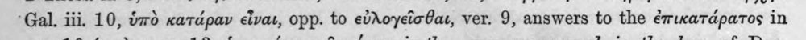 | ‘Gal. iii. 10, ὑπὸ κατάραν εἶναι, opp. to εὐλογεῖσθαι, ver. 9, answers to the ἐπικατάρατος in | (csak görög, jelzés nélkül) |  |
| 64 | 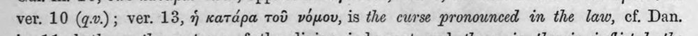 | ver. 10 (q.v.); ver. 13, ἡ κατάρα Tod νόμου, is the curse pronounced in the law, cf. Dan. | (csak görög, jelzés nélkül) |  |
| 65 | 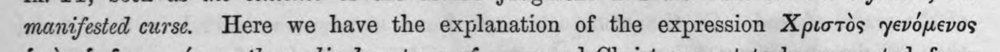 | manifested curse. Here we have the explanation of the expression Χριστὸς γενόμενος | (csak görög, jelzés nélkül) |  |
| 66 | 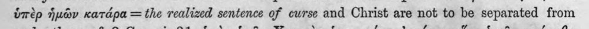 | ὑπὲρ ἡμῶν κατάρα =the realized sentence of curse and Christ are not to be separated from | (csak görög, jelzés nélkül) |  |
| 67 | 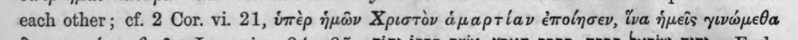 | each other; cf. 2 Cor. vi. 21, ὑπὲρ ἡμῶν Χριστὸν ἁμαρτίαν ἐποίησεν, ἵνα ἡμεῖς γινώμεθα | (csak görög, jelzés nélkül) |  |
| 68 | 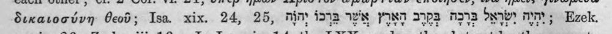 | δικαιοσύνη θεοῦ; Isa. xix. 24, 25, nim isa wx PINT TPZ ADI OMe MM; Ezek. | latin_torzkep |  |
| 69 | 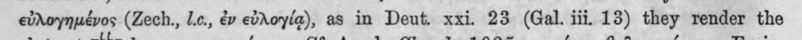 | εὐλογημένος (Zech., 1..., ἐν εὐλογίᾳ), as in Deut. xxi. 23 (Gal. iii. 13) they render the | (csak görög, jelzés nélkül) |  |
| 70 | 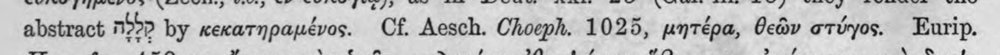 | abstract 795? by κεκατηραμένος. Cf. Aesch. Choeph. 1025, μητέρα, θεῶν στύγος. Eurip. | (csak görög, jelzés nélkül) |  |
| 71 | 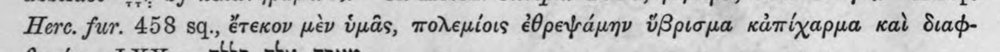 | Here. fur. 458 sq., ἔτεκον μὲν ὑμᾶς, πολεμίοις ἐθρεψάμην ὕβρισμα κἀπίχαρμα καὶ διαφ- | c5_nem_igazolt |  |
| 72 | 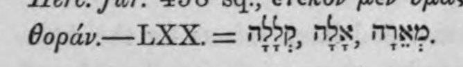 | Oopdv.—LXX. = 79>p, τρις, ΠΝ, | c5_nem_igazolt |  |
| 73 | 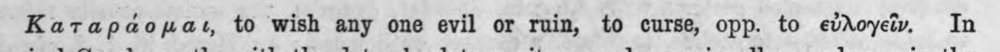 | Καταράομαι, to wish any one evil or ruin, to curse, opp. to εὐλογεῖν. In | c5_nem_igazolt |  |
| 74 | 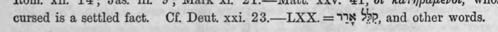 | cursed is a settled fact. Cf Deut. xxi. 23—LXX.= 718 Shp. and other words. | heberdetektor, latin_torzkep |  |
| 75 | 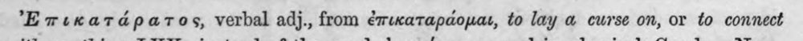 | Ἐπικατάρατος, verbal adj., from ἐπικαταράομαι, to lay a curse on, or to connect | c5_nem_igazolt |  |
| 76 | 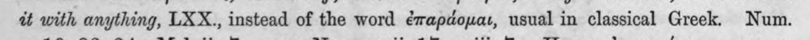 | ἐξ with anything, LXX., instead of the word ἐπαράομαι, usual in classical Greek. Num. | (csak görög, jelzés nélkül) |  |
| 77 | 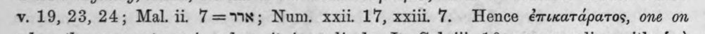 | v. 19, 23, 24; Mal. 11. 7= 78; Num. xxii. 17, xxiii. 7. Hence ἐπικατάρατος, one on | (csak görög, jelzés nélkül) |  |
| 78 | 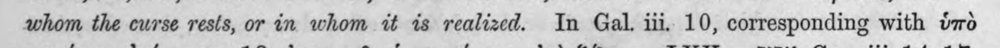 | whom the curse rests, or in whom it is realized. In Gal. iii. 10, corresponding with ὑπὸ | (csak görög, jelzés nélkül) |  |
| 79 | 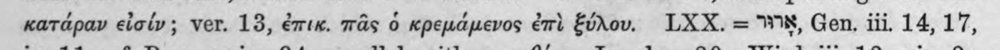 | κατάραν εἰσίν; ver. 13, ἐπικ. πᾶς ὁ κρεμάμενος ἐπὶ ξύλου. LXX. = WR, Gen. iii. 14,17, | (csak görög, jelzés nélkül) |  |
| 80 | 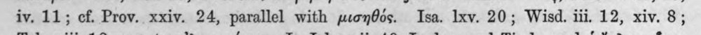 | iv. 11; cf. Prov. xxiv. 24, parallel with μισηθός. Isa. Ixv. 20; Wisd. iii. 12, xiv. 8; | c5_nem_igazolt |  |
| 81 | 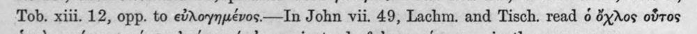 | Tob. xiii. 12, opp. to εὐλογημένος.---Τὴ John vii. 49, Lachm. and Tisch. read ὁ ὄχλος οὗτος | c5_nem_igazolt |  |
| 82 | 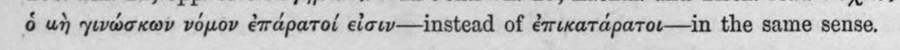 | ὁ ut) γινώσκων νόμον ἐπάρατοί eioww—instead of ἐπικατάρατοι---ἶπι the same sense. | c5_nem_igazolt |  |
| 83 | 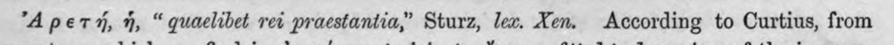 | "A pety, ἡ, “quaclibet ret praestantia,” Sturz, lex. Xen. According to Curtius, from | (csak görög, jelzés nélkül) |  |
| 84 | 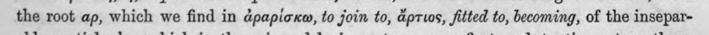 | the root ap, which we find in ἀραρίσκω, to join to, ἄρτιος, fitted to, becoming, of the insepar- | latin_torzkep |  |
| 85 | 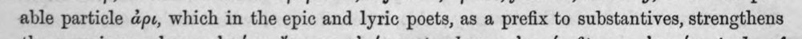 | able particle ἀριε, which in the epic and lyric poets, as a prefix to substantives, strengthens | c5_nem_igazolt, latin_torzkep |  |
| 86 | 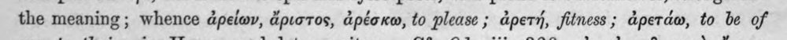 | the meaning; whence ἀρείων, ἄριστος, ἀρέσκω, to please ; ἀρετή, fitness; ἀρετάω, to be of | c5_nem_igazolt |  |
| 87 | 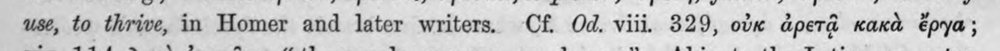 | use, to thrive, in Homer and later writers. Cf. Od. viii. 329, οὐκ ἀρετᾷ κακὰ ἔργα; | (csak görög, jelzés nélkül) |  |
| 88 | 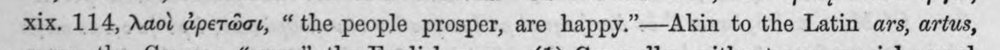 | xix. 114, λαοὶ ἀρετῶσι, “ the people prosper, are happy.’—Akin to the Latin ars, artus, | (csak görög, jelzés nélkül) |  |
| 89 | 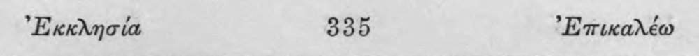 | ᾿Εκκλησία 335 ᾿Επικαλέω | c5_nem_igazolt |  |
| 90 | 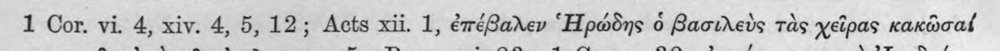 | 1 Cor. vi. 4, xiv. 4, 5,12; Acts xii. 1, ἐπέβαλεν «Ἡρώδης ὁ βασιλεὺς τὰς χεῖρας κακῶσαί | (csak görög, jelzés nélkül) |  |
| 91 | 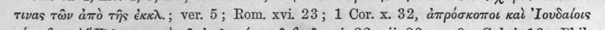 | τινας τῶν ἀπὸ τῆς ἐκκὰλ.; ver. 5; Rom. xvi. 23; 1 Cor. x. 32, ἀπρόσκοποι καὶ ᾿Ιουδαίοις | c5_nem_igazolt |  |
| 92 | 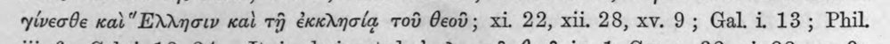 | γίνεσθε καὶ “Ελλησιν καὶ τῇ ἐκκλησίᾳ τοῦ θεοῦ; xi. 22, xii. 28, xv. 9; Gal. i 13; Phil | c5_nem_igazolt |  |
| 93 | 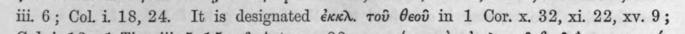 | iii. 6; Col. 1. 18,24. It is designated ἐκκλ. τοῦ θεοῦ in 1 Cor. x. 32, xi. 22, xv. 9; | (csak görög, jelzés nélkül) |  |
| 94 | 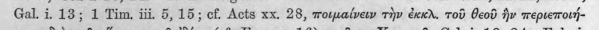 | Gal. 1. 13; 1 Tim. iii 5,15; cf. Acts xx. 28, ποιμαίνειν τὴν ἐκκλ. τοῦ θεοῦ ἣν περιεποιή- | c5_nem_igazolt |  |
| 95 | 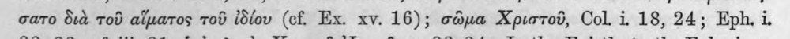 | σατο διὰ τοῦ αἵματος τοῦ ἰδίου (cf. Ex. xv. 16); σῶμα Χριστοῦ, Col. i. 18, 24; Eph. i. | (csak görög, jelzés nélkül) |  |
| 96 | 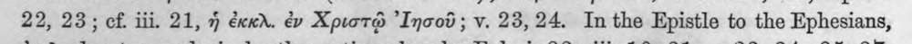 | 22, 23; cf. iii. 21, ἡ ἐκκλ. ἐν Χριστῷ "Inood; v. 23,24. In the Epistle to the Ephesians, | (csak görög, jelzés nélkül) |  |
| 97 | 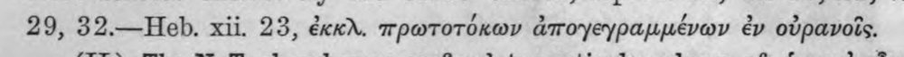 | 29, 32.—Heb. xii. 23, ἐκκὰ. πρωτοτόκων ἀπογεγραμμένων ἐν οὐρανοῖς. | c5_nem_igazolt |  |
| 98 | 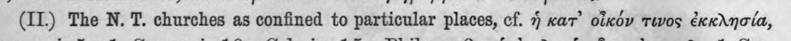 | (1) The Ν. Τ΄ churches as confined to particular places, cf. ἡ κατ᾽ οἷκόν τινος ἐκκλησία, | c5_nem_igazolt |  |
| 99 | 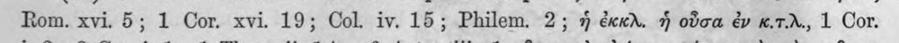 | Rom. xvi. 5; 1 Cor. xvi. 19; Col. iv. 15; Philem. 2; ἡ exer. ἡ οὖσα ἐν κιτιλ., 1 Cor. | c5_nem_igazolt |  |
| 100 | 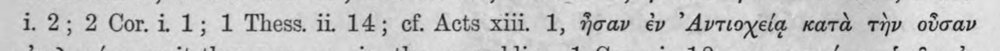 | 1. 2; 2 Cor.i 1; 1 Thess. ii 14; cf. Acts xiii. 1, ἦσαν ἐν ᾿Αντιοχείᾳ κατὰ τὴν οὖσαν | c5_nem_igazolt |  |
