| sorszám | kivágás | cremuoft-sor | gépi jelölés | ítélet |
|---|---|---|---|---|
| 101 | 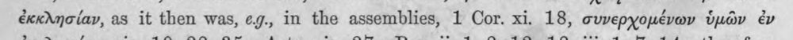 | ἐκκλησίαν, as it then was, ¢g., in the assemblies, 1 Cor. xi. 18, συνερχομένων ὑμῶν ἐν | (csak görög, jelzés nélkül) |  |
| 102 | 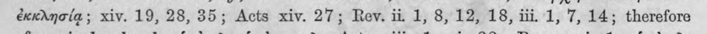 | ἐκκλησίᾳ; xiv. 19, 28,35; Acts xiv. 27; Rev. ii 1, 8, 12, 18, iii, 1, 7, 14; therefore | (csak görög, jelzés nélkül) |  |
| 103 | 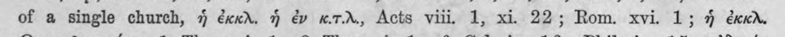 | of a single church, ἡ ἐκκλ. ἡ ἐν κιτίλ,, Acts viii. 1, xi. 22; Rom. xvi. 1; ἡ ἐκκὰλ. | c5_nem_igazolt |  |
| 104 | 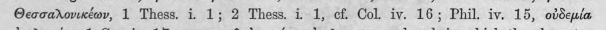 | Θεσσαλονικέων, 1 Thess. i. 1; 2 Thess. i 1, cf. Col. iv. 16; Phil. iv. 15, οὐδεμία | (csak görög, jelzés nélkül) |  |
| 105 | 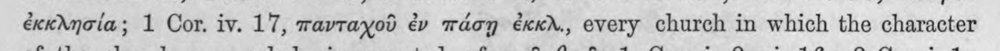 | ἐκκλησία; 1 Cor. iv. 17, πανταχοῦ ἐν πάσῃ ἐκκλ., every church in which the character | (csak görög, jelzés nélkül) |  |
| 106 | 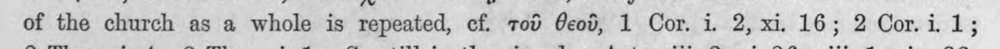 | of the church as a whole is repeated, cf. τοῦ θεοῦ, 1 Cor. 1. 2, xi. 16; 2 Cori 1; | latin_torzkep |  |
| 107 | 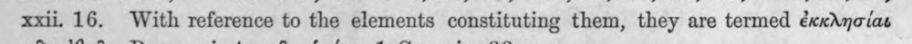 | xxii. 16. With reference to the elements constituting them, they are termed ἐκκλησίαι | (csak görög, jelzés nélkül) |  |
| 108 | 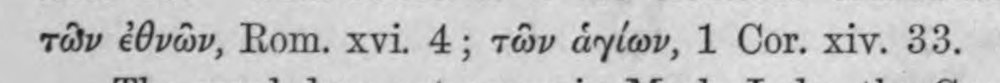 | τῶν ἐθνῶν, Rom. xvi. 4; τῶν ἁγίων, 1 Cor. xiv. 33. | (csak görög, jelzés nélkül) |  |
| 109 | 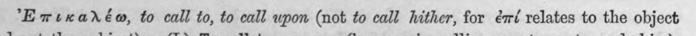 | Ἔπικαλέω, to call to, to call upon (not to call hither, for ἐπί relates to the object | c5_nem_igazolt |  |
| 110 | 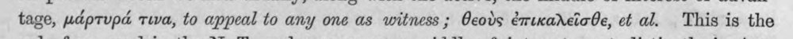 | tage, μάρτυρά τινα, to appeal to any one as witness ; θεοὺς ἐπικαλεῖσθε, ct al. This is the | c5_nem_igazolt |  |
| 111 | 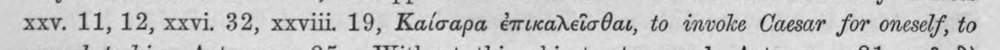 | xxv. 11, 12, xxvi. 32, xxviii 19, Καίσαρα ἐπικαλεῖσθαι, to invoke Caesar for oneself, to | latin_torzkep |  |
| 112 | 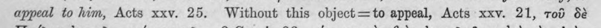 | appeal to him, Acts xxv. 25. Without this object=to appeal, Acts xxv. 21, τοῦ δὲ | (csak görög, jelzés nélkül) |  |
| 113 | 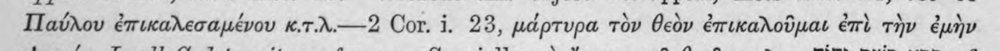 | Παύλου ἐπικαλεσαμένου κ.τ.λ.----2 Cor. i. 23, μάρτυρα τὸν θεὸν ἐπικαλοῦμαι ἐπὶ τὴν ἐμὴν | (csak görög, jelzés nélkül) |  |
| 114 | 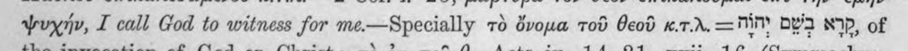 | ψυχήν, I call God to witness for me-—Specially τὸ ὄνομα τοῦ θεοῦ κ.τ᾿Δ. τ-Ξ ΠΥ Ὁ NIP, of | c5_nem_igazolt |  |
| 115 | 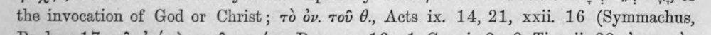 | the invocation of God or Christ; τὸ dv. τοῦ @., Acts ix. 14, 21, xxii. 16 (Symmachus, | latin_torzkep |  |
| 116 | 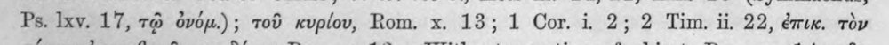 | Ps. Ixy. 17, τῷ ὀνόμ.); τοῦ κυρίου, Rom. x. 13; 1 Cor. 1. 2; 2 Tim. ii. 22, ἐπικ. τὸν | (csak görög, jelzés nélkül) |  |
| 117 | 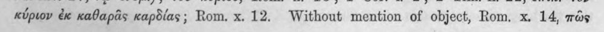 | κύριον ἐκ καθαρᾶς καρδίας; Rom. x.12. Without mention of object, Rom. x. 14, πῶς | (csak görög, jelzés nélkül) |  |
| 118 | 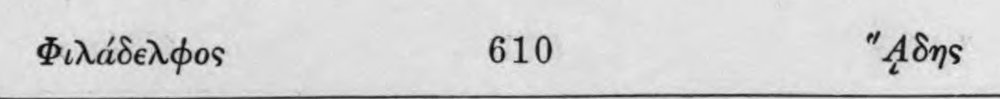 | Φιλάδελφος 610 "A8ns | c5_nem_igazolt |  |
| 119 | 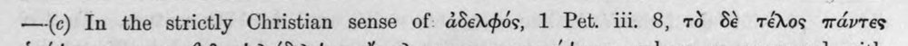 | —-(c) In the strictly Christian sense οἵ. ἀδελφός, 1 Pet. iii. 8, τὸ δὲ τέλος πάντες | (csak görög, jelzés nélkül) |  |
| 120 | 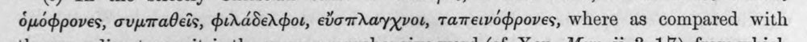 | ὁμόφρονες, συμπαθεῖς, φιλάδελφοι, εὔσπλαγχνοι, ταπεινόφρονες, Where as compared with | (csak görög, jelzés nélkül) |  |
| 121 | 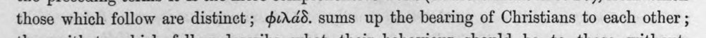 | those which follow are distinct; φιλάδ. sums up the bearing of Christians to each other ; | (csak görög, jelzés nélkül) |  |
| 122 | 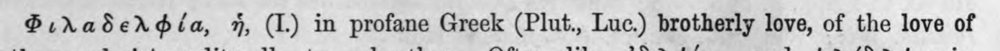 | Φιλαδελφία, ἡ, (1.) in profane Greek (Plut., Luc.) brotherly love, of the love of | (csak görög, jelzés nélkül) |  |
| 123 |  | brothers and sisters, literally, to each other. Often, like ἀδελφότης and φιλάδελφος in | (csak görög, jelzés nélkül) |  |
| 124 | 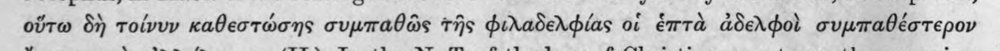 | οὕτω δὴ τοίνυν καθεστώσης συμπαθῶς τῆς φιλαδελφίας οἱ ἑπτὰ ἀδελφοὶ συμπαθέστερον | c5_nem_igazolt |  |
| 125 | 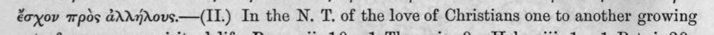 | ἔσχον πρὸς ἀλλήλους.----(11.) In the N. T. of the love of Christians one to another growing | (csak görög, jelzés nélkül) |  |
| 126 | 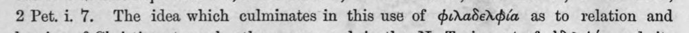 | 2 Pet. i. 7. The idea which culminates in this use of φιλαδελφία as to relation and | latin_torzkep |  |
| 127 |  | bearing of Christians to each other, expressed in the N. Τὶ import of ἀδελφός and its | c5_nem_igazolt |  |
| 128 | 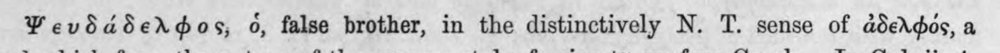 | Ψευδάδελφος, 6, false brother, in the distinctively N. T. sense of ἀδελφός, a | c5_nem_igazolt |  |
| 129 | 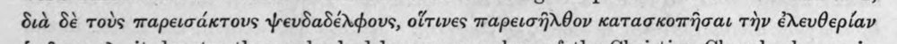 | διὰ δὲ τοὺς παρεισάκτους ψευδαδέλφους, οἵτινες παρεισῆλθον κατασκοπῆσαι THY ἐλευθερίαν | (csak görög, jelzés nélkül) |  |
| 130 | 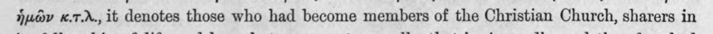 | ἡμῶν κιτιλ., it denotes those who had become members of the Christian Church, sharers in | c5_nem_igazolt, latin_torzkep |  |
| 131 |  | no right to be ἀδελφοί (παρείσακτοι, παρεισῆλθον). They had the companionship of the | c5_nem_igazolt, latin_torzkep |  |
| 132 | 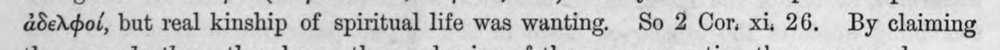 | ἀδελφοί, but real kinship of spiritual life was wanting. So 2 Cor, xii 26. By claiming | latin_torzkep |  |
| 133 |  | “A 8ns. The comparison of the wotd οἰ with the German Hille is a mistake. | latin_torzkep |  |
| 134 | 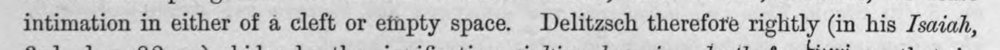 | intimation in either of a cleft or efapty space. Delitzsch therefore rightly (in his Isaiah, | latin_torzkep |  |
| 135 | 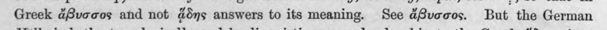 | Greek ἄβυσσος and not ἅδης answers to its meaning. See ἄβυσσος. But the German | c5_nem_igazolt |  |
| 136 | 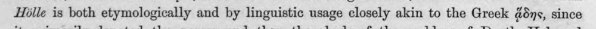 | Hille is both etymologically and by linguistic usage closely akin to the Greek ὕδης, since | c5_nem_igazolt, latin_torzkep |  |
| 137 |  | renders ans by halja, whereas for yéevva he has no Gothic word, but adopts the Greek | latin_torzkep |  |
| 138 | 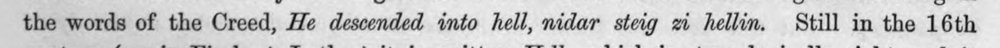 | the words of the Creed, He descended into hell, nidar steig zi hellin. Still in the 16th | latin_torzkep |  |
| 139 |  | Καλέω 742 * Exixaréo | c5_nem_igazolt |  |
| 140 |  | by βοᾶν, ἀναγιγνώσκειν, κηρύσσειν). The distinctive N. T. use of the word (Luke v. 32; | (csak görög, jelzés nélkül) |  |
| 141 |  | Matt. ix. 13; Mark ii. 17, καλέσαι ἁμαρτωλούς) answers to the use of xp in Isa. 1. 2; | latin_torzkep |  |
| 142 | 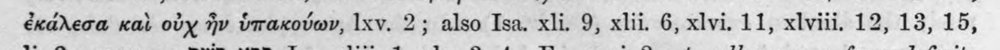 | ἐκάλεσα καὶ οὐχ ἣν ὑπακούων, lxv. 2; also Isa. xli. 9, xlii. 6, xlvi. 11, xlviii. 12, 13, 15, | (csak görög, jelzés nélkül) |  |
| 143 |  | li. 2; compare ὩΣ 87P, Isa. xliii. 1, xlv. 3, 4; Ex. xxxi. 2 Ξξ ἐο call a person for a definite | c5_nem_igazolt |  |
| 144 | 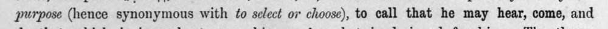 | purpose (hence synonymous with ἐο select ov choose), to call that he may hear, come, and | (csak görög, jelzés nélkül) |  |
| 145 |  | do that which is incumbent upon him, or ke what is designed for him. The theme | latin_torzkep |  |
| 146 | 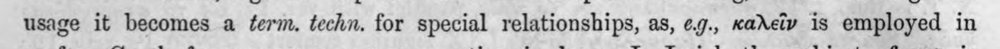 | usage it becomes a term. techn. for special relationships, as, 6.9., καλεῖν is employed in | (csak görög, jelzés nélkül) |  |
| 147 | 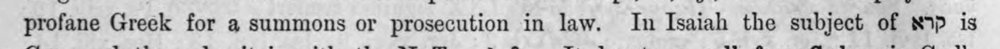 | profane Greek for a summons or prosecution in law. In Isaiah the subject of δὲ is | latin_torzkep |  |
| 148 | 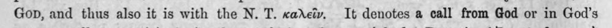 | Gop, and thus also it is with the N. T. καλεῖν. It denotes a call from God or in God’s | (csak görög, jelzés nélkül) |  |
| 149 | 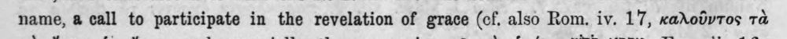 | name, ἃ call to participate in the revelation of grace (cf. also Rom. iv. 17, καλοῦντος τὰ | (csak görög, jelzés nélkül) |  |
| 150 | 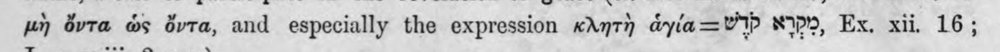 | μὴ ὄντα ὡς ὄντα, and especially the expression κλητὴ dyia=VIP IPP, Ex, xii. 16; | (csak görög, jelzés nélkül) |  |
