| sorszám | kivágás | cremuoft-sor | gépi jelölés | ítélet |
|---|---|---|---|---|
| 151 | 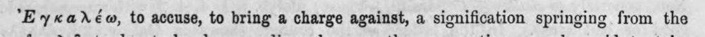 | ᾿γ καλέω, to accuse, to bring a charge against, a signification springing from the | (csak görög, jelzés nélkül) |  |
| 152 | 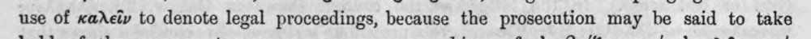 | use of καλεῖν to denote legal proceedings, because the prosecution may be said to take | latin_torzkep |  |
| 153 | 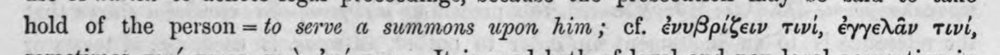 | hold of the person = to serve a summons upon him; cf. ἐνυβρίζειν τινί, ἐγγελᾶν τινί, | c5_nem_igazolt |  |
| 154 | 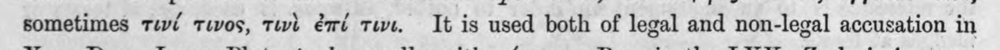 | sometimes τινί τινος, τινὶ ἐπί τινι. It is used both of legal and non-legal accusation in | latin_torzkep |  |
| 155 | 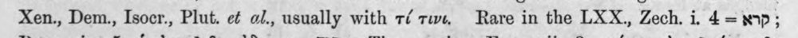 | Xen., Dem., Isocr., Plut. οὐ o/., usually with τί τιν, Rare in the LXX., Zech. i. 4 =p; | (csak görög, jelzés nélkül) |  |
| 156 | 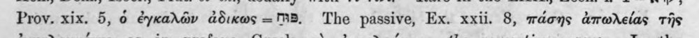 | Prov. xix. 5, ὁ ἐγκαλῶν ἀδικως -- ΓΒ. The passive, Ex. xxii. 8, πάσης ἀπωλείας τῆς | c5_nem_igazolt |  |
| 157 | 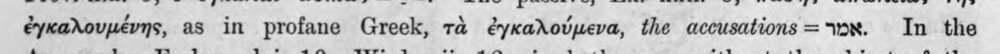 | ἐγκαλουμένης, as in profane Greek, τὰ ἐγκαλούμενα, the accusations= 0x. In the | c5_nem_igazolt |  |
| 158 | 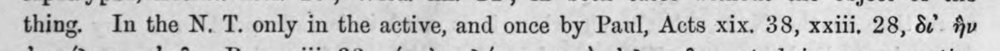 | thing. In the N. T. only in the active, and once by Paul, Acts xix. 38, xxiii, 28, δ ἣν | (csak görög, jelzés nélkül) |  |
| 159 | 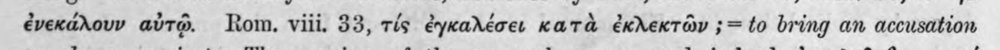 | ἐνεκάλουν αὐτῷ. Rom. viii. 33, ris ἐγκαλέσει κατὰ ἐκλεκτῶν ;= to bring an accusation | latin_torzkep |  |
| 160 | 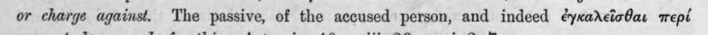 | or charge against. The passive, of the accused person, and indeed ἐγκαλεῖσθαι περί | (csak görög, jelzés nélkül) |  |
| 161 | 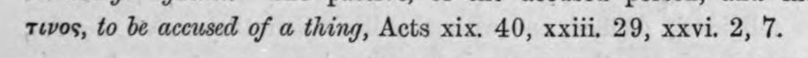 | τινος, to be accused of a thing, Acts xix. 40, xxiii. 29, xxvi. 2, 7. | (csak görög, jelzés nélkül) |  |
| 162 | 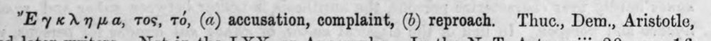 | "Ey«*Xn μα, Tos, τό, (a) accusation, complaint, (Ὁ) reproach. Thuc., Dem., Aristotle, | (csak görög, jelzés nélkül) |  |
| 163 | 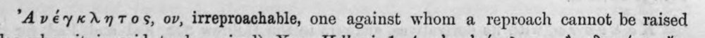 | ᾿Ανέγκλητος, ον, irreproachable, one against whom a reproach cannot be raised | c5_nem_igazolt |  |
| 164 | 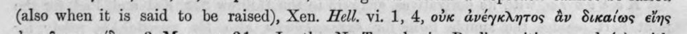 | (also when it is said to be raised), Xen. Hell. vi. 1, 4, οὐκ ἀνέγκλητος ἂν δικαίως εἴης | (csak görög, jelzés nélkül) |  |
| 165 | 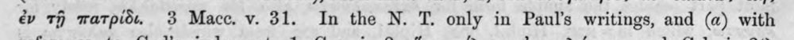 | ἐν τῇ πατρίδι. 3 Macc. v. 31. In the N. T. only in Paul’s writings, and (a) with | (csak görög, jelzés nélkül) |  |
| 166 | 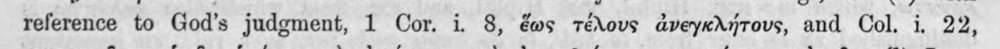 | reference to God’s judgment, 1 Cor. i. 8, ἕως τέλους ἀνεγκλήτους, and Col. 1, 22, | (csak görög, jelzés nélkül) |  |
| 167 | 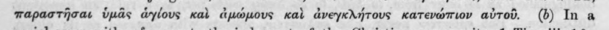 | παραστῆσαι ὑμᾶς ἁγίους καὶ ἀμώμους καὶ ἀνεγκλήτους κατενώπιον αὐτοῦ. (Ὁ) In a | (csak görög, jelzés nélkül) |  |
| 168 | 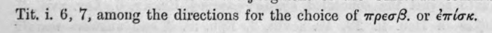 | Tit, i. 6, 7, among the directions for the choice of πρεσβ. or ἐπίσκ. | latin_torzkep |  |
| 169 | 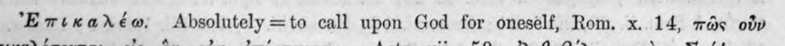 | Ἐπικαλέω. Absolutely =to call upon God for oneself, Rom. x. 14, πῶς οὖν | c5_nem_igazolt |  |
| 170 | 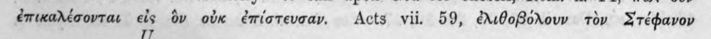 | ἐπικαλέσονται εἰς ὃν οὐκ ἐπίστευσαν. Acts vii. 59, ἐλιθοβόλουν τὸν Στέφανον | c5_nem_igazolt |  |
| 171 | 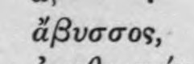 | ἄβυσσος, | (csak görög, jelzés nélkül) |  |
| 172 | 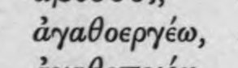 | ἀγαθοεργέω, | (csak görög, jelzés nélkül) |  |
| 173 | 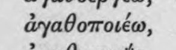 | ἀγαθοποιέω, | (csak görög, jelzés nélkül) |  |
| 174 | 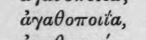 | ἀγαθοποιΐα, | (csak görög, jelzés nélkül) |  |
| 175 | 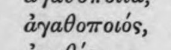 | ἀγαθοποιός, | (csak görög, jelzés nélkül) |  |
| 176 | 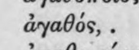 | ἀγαθός,. | (csak görög, jelzés nélkül) |  |
| 177 | 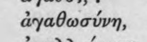 | ἀγαθωσύνη, | (csak görög, jelzés nélkül) |  |
| 178 | 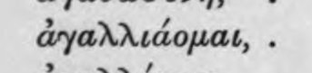 | ἀγαλλιάομαι,. | (csak görög, jelzés nélkül) |  |
| 179 | 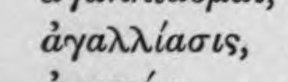 | ἀγαλλίασις, | (csak görög, jelzés nélkül) |  |
| 180 | 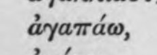 | ἀγαπάω, | (csak görög, jelzés nélkül) |  |
| 181 | 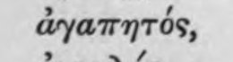 | ἀγαπητός, | (csak görög, jelzés nélkül) |  |
| 182 | 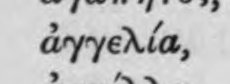 | ἀγγελία, | (csak görög, jelzés nélkül) |  |
| 183 | 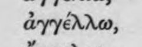 | ἀγγέλλω, | (csak görög, jelzés nélkül) |  |
| 184 | 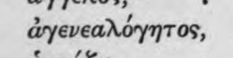 | ἀγενεαλόγητος, | (csak görög, jelzés nélkül) |  |
| 185 | 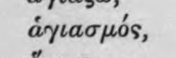 | ἁγιασμός, | (csak görög, jelzés nélkül) |  |
| 186 | 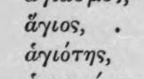 | ἅγιος, . ἁγιότης, | (csak görög, jelzés nélkül) |  |
| 187 | 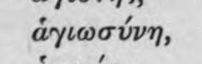 | ἁγιωσύνη, | (csak görög, jelzés nélkül) |  |
| 188 | 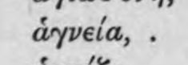 | ἁγνεία,. | (csak görög, jelzés nélkül) |  |
| 189 | 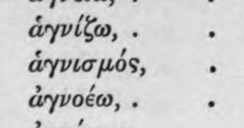 | ἁγνίζω,. : ἁγνισμός, : ἀγνοέω,. | (csak görög, jelzés nélkül) |  |
| 190 | 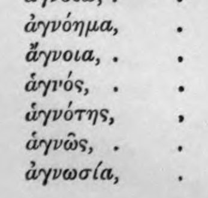 | ἀγνόημα, . ἄγνοια,. . ἁγνός, . 3 ἁγνότης, ᾿ ἁγνῶς, . ἀγνωσία, | (csak görög, jelzés nélkül) |  |
| 191 | 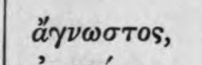 | ἄγνωστος, | (csak görög, jelzés nélkül) |  |
| 192 | 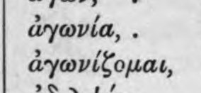 | ἀγωνία, . > fi ayovifouat, | latin_torzkep |  |
| 193 | 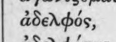 | ἀδελφός, | (csak görög, jelzés nélkül) |  |
| 194 | 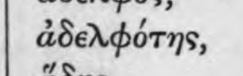 | ἀδελφότης, | (csak görög, jelzés nélkül) |  |
| 195 | 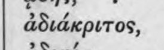 | ἀδιάκριτος, | (csak görög, jelzés nélkül) |  |
| 196 | 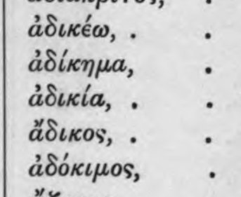 | > , ἀδικέω,. : > / ἀδίκημα, Ξ ἀδικία, : ἄδικος, - ἀδόκιμος, | (csak görög, jelzés nélkül) |  |
| 197 | 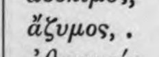 | ΝΜ ἄξυμος,. | c5_nem_igazolt |  |
| 198 | 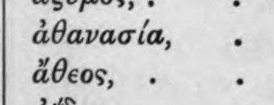 | > , ἀθανασία, ᾿ ΝΜ ἄθεος, | c5_nem_igazolt |  |
| 199 | 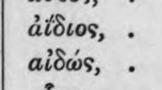 | ἀΐδιος, . αἰδώς, | (csak görög, jelzés nélkül) |  |
| 200 | 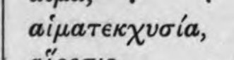 | αἱματεκχυσία, | (csak görög, jelzés nélkül) |  |
