| sorszám | kivágás | cremuoft-sor | gépi jelölés | ítélet |
|---|---|---|---|---|
| 201 | 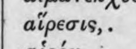 | αἵρεσις,. | (csak görög, jelzés nélkül) |  |
| 202 | 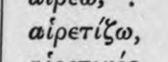 | ec se αἱρετίζω, | latin_torzkep |  |
| 203 | 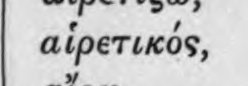 | αἱρετικός, | (csak görög, jelzés nélkül) |  |
| 204 | 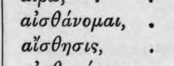 | > Ul αἰσθάνομαι, . αἴσθησις, | latin_torzkep |  |
| 205 | 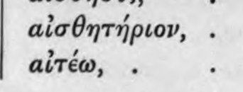 | αἰσθητήριον, . αἰτέω, | (csak görög, jelzés nélkül) |  |
| 206 | 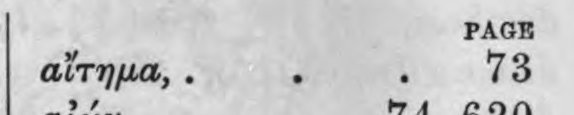 | PAGE αἴτημα, : 73 | (csak görög, jelzés nélkül) |  |
| 207 | 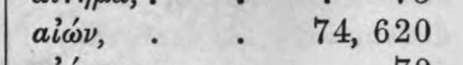 | αἰών, . i 74, 620 | (csak görög, jelzés nélkül) |  |
| 208 | 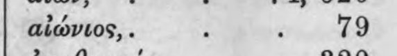 | αἰώνιος,. 79 | (csak görög, jelzés nélkül) |  |
| 209 | 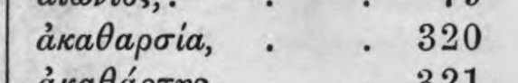 | ἀκαθαρσία, 320 | (csak görög, jelzés nélkül) |  |
| 210 | 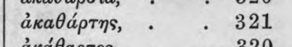 | ἀκαθάρτης, 321 | (csak görög, jelzés nélkül) |  |
| 211 | 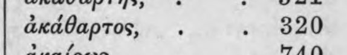 | ἀκάθαρτος, 820 | (csak görög, jelzés nélkül) |  |
| 212 | 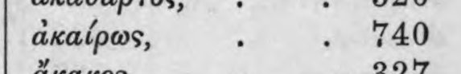 | ἀκαίρως, 740 | (csak görög, jelzés nélkül) |  |
| 213 | 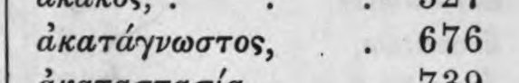 | ἀκατάγνωστος, 676 | (csak görög, jelzés nélkül) |  |
| 214 | 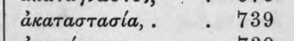 | ἀκαταστασία,. 739 | (csak görög, jelzés nélkül) |  |
| 215 | 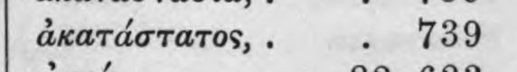 | ἀκατάστατος,. α: 1399 | (csak görög, jelzés nélkül) |  |
| 216 | 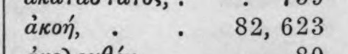 | ἀκοή, 82, 623 | (csak görög, jelzés nélkül) |  |
| 217 | 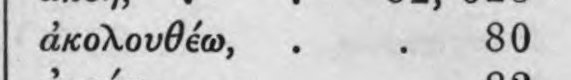 | ἀκολουθέω, 80 | (csak görög, jelzés nélkül) |  |
| 218 | 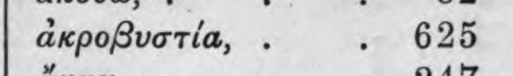 | ἀκροβυστία,. 625 | (csak görög, jelzés nélkül) |  |
| 219 | 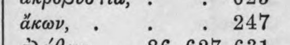 | ἄκων, ΤΑ | c5_nem_igazolt |  |
| 220 | 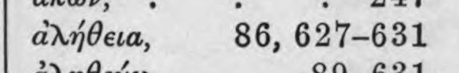 | ἀλήθεια, 86, 627-631 | (csak görög, jelzés nélkül) |  |
| 221 | 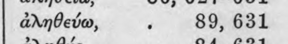 | ἀληθεύω, 3 89, 631 | (csak görög, jelzés nélkül) |  |
| 222 | 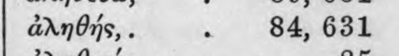 | ἀληθής,. 84, 631 | (csak görög, jelzés nélkül) |  |
| 223 | 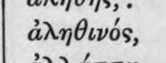 | ἀληθινός, | (csak görög, jelzés nélkül) |  |
| 224 | 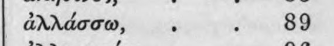 | ἀλλάσσω, . 89 | (csak görög, jelzés nélkül) |  |
| 225 | 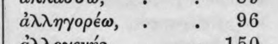 | ἀλληγορέω, 96 | (csak görög, jelzés nélkül) |  |
| 226 | 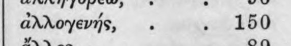 | ἀλλογενής, 150 | (csak görög, jelzés nélkül) |  |
| 227 | 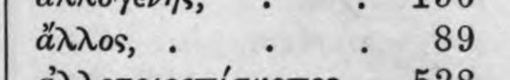 | ἄλλος, 209 | (csak görög, jelzés nélkül) |  |
| 228 | 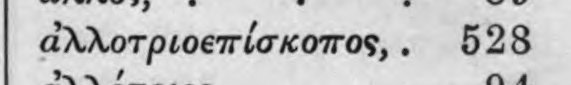 | ἀχλοτριοεπίσκοπος,. 528 | c5_nem_igazolt |  |
| 229 | 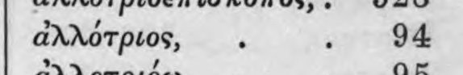 | ἀλλότριος, 94 | (csak görög, jelzés nélkül) |  |
| 230 | 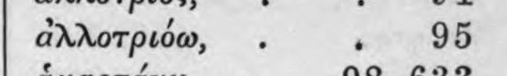 | ἀχλοτριόω, . 2 95 | c5_nem_igazolt |  |
| 231 | 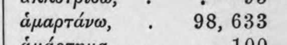 | ἁμαρτάνω, 98, 633 | (csak görög, jelzés nélkül) |  |
| 232 | 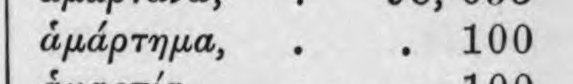 | ἁμάρτημα, 100 | (csak görög, jelzés nélkül) |  |
| 233 | 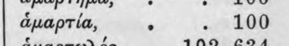 | ἁμαρτία, . 100 | (csak görög, jelzés nélkül) |  |
| 234 | 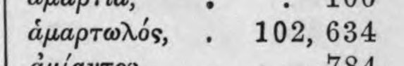 | ἁμαρτωλός, 102, 634 | (csak görög, jelzés nélkül) |  |
| 235 | 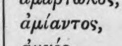 | ἀμίαντος, | (csak görög, jelzés nélkül) |  |
| 236 | 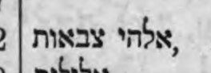 | ΓΝ αν ‘nds, | c5_nem_igazolt |  |
| 237 | 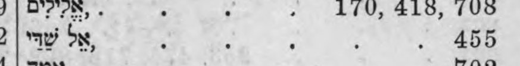 | νην’ be, 455 | (csak görög, jelzés nélkül) |  |
| 238 | 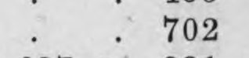 | ὃ . 702 | (csak görög, jelzés nélkül) |  |
| 239 | 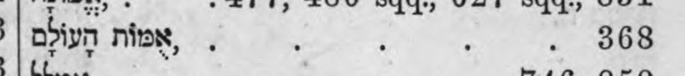 | ppiyn nie, . ς΄, 368 | latin_torzkep |  |
| 240 | 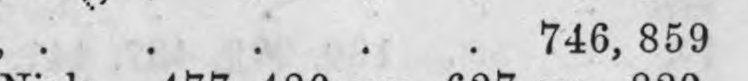 | ς . . 746, 859 | (csak görög, jelzés nélkül) |  |
| 241 | 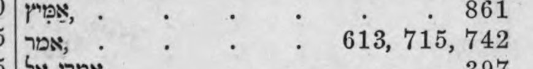 | ἼΩΝ, 618, 715, 142 | c5_nem_igazolt |  |
| 242 | 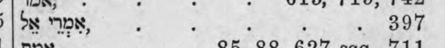 | mS ΤΟΝ, . 397 | c5_nem_igazolt, latin_torzkep |  |
| 243 | 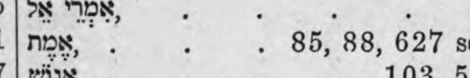 | τρὶς, 8ῦ, 88, 627 | (csak görög, jelzés nélkül) |  |
| 244 | 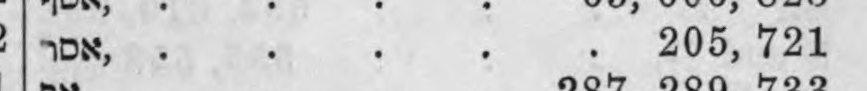 | ΟΝ, . 205. 712} | (csak görög, jelzés nélkül) |  |
| 245 | 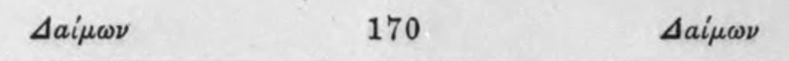 | Δαίμων 170 Δαίμων | c5_nem_igazolt |  |
| 246 | 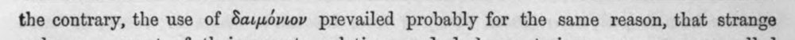 | the contrary, the use οἵ δαιμόνιον prevailed probably for the same reason, that strange | latin_torzkep |  |
| 247 | 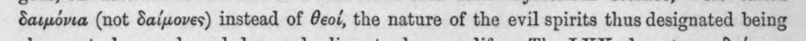 | δαιμόνια (not δαίμονες) instead of θεοί, the nature of the evil spirits thus designated being | (csak görög, jelzés nélkül) |  |
| 248 | 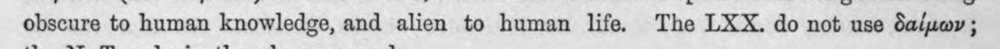 | obscure to human knowledge, and alien to human life. The LXX. do not use δαίμων ; | heberdetektor, latin_torzkep |  |
| 249 | 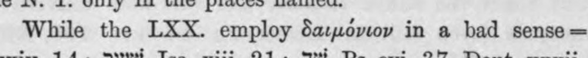 | While the LXX. employ δαιμόνιον in a bad sense | (csak görög, jelzés nélkül) |  |
| 250 | 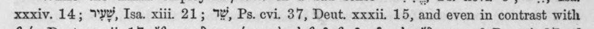 | xxxiv. 14; VW, Isa. xiii 21; Ἢν, Ps. cvi. 37, Deut. xxxii. 15, and even in contrast with | c5_nem_igazolt, latin_torzkep |  |
