| sorszám | kivágás | cremuoft-sor | gépi jelölés | ítélet |
|---|---|---|---|---|
| 251 | 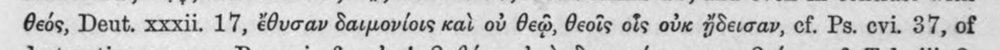 | θεός, Deut. xxxii. 17, ἔθυσαν δαιμονίοις καὶ οὐ θεῷ, θεοῖς οἷς οὐκ ἤδεισαν, cf. Ps. evi. 37, of | c5_nem_igazolt |  |
| 252 | 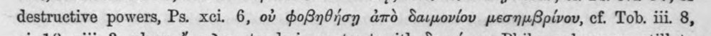 | destructive powers, Ps. xci. 6, οὐ φοβηθήσῃ ἀπὸ δαιμονίου μεσημβρίνου, cf. Tob. iii. 8, | c5_nem_igazolt |  |
| 253 | 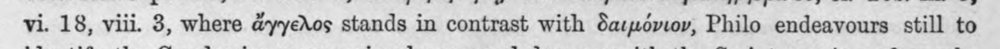 | vi. 18, viii. 3, where ἄγγελος stands in contrast with δαιμόνιον, Philo endeavours still to | (csak görög, jelzés nélkül) |  |
| 254 | 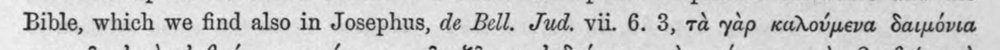 | Bible, which we find also in Josephus, de Bell. Jud. vii. 6. 3, τὰ yap καλούμενα δαιμόνια | (csak görög, jelzés nélkül) |  |
| 255 | 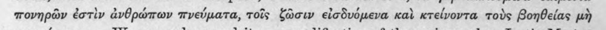 | πονηρῶν ἐστὶν ἀνθρώπων πνεύματα, τοῖς ζῶσιν εἰσδυόμενα καὶ κτείνοντα τοὺς βοηθείας μὴ | c5_nem_igazolt |  |
| 256 | 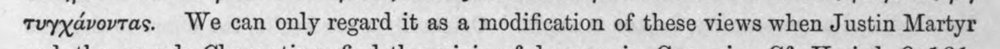 | τυγχάνοντας. We can only regard it as a modification of these views when Justin Martyr | c5_nem_igazolt |  |
| 257 | 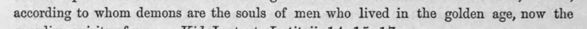 | according to whom demons are the souls of men who lived in the golden age, now the | latin_torzkep |  |
| 258 | 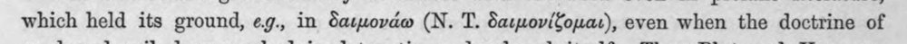 | which held its ground, eg., in δαιμονάω (N. T. δαιμονίζομαι), even when the doctrine of | (csak görög, jelzés nélkül) |  |
| 259 | 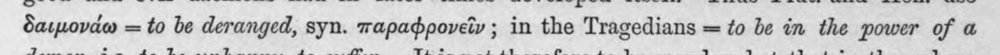 | δαιμονάω = to be deranged, syn. παραφρονεῖν ; in the Tragedians = to be in the power of a | c5_nem_igazolt |  |
| 260 | 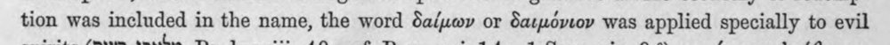 | tion was included in the name, the word δαίμων or δαιμόνιον was applied specially to evil | (csak görög, jelzés nélkül) |  |
| 261 | 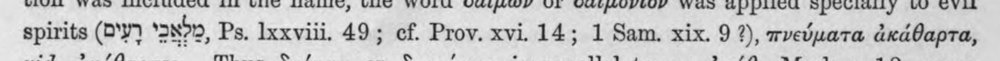 | spirits (Ὁ ‘udp, Ps. Ixxviii. 49; ef. Prov. xvi. 14; 1 Sam. xix. 9 2), πνεύματα ἀκάθαρτα, | (csak görög, jelzés nélkül) |  |
| 262 | 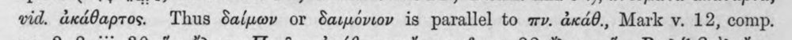 | vid. ἀκάθαρτος. Thus δαίμων or δαιμόνιον is parallel to wv. ἀκάθ., Mark v. 12, comp. | (csak görög, jelzés nélkül) |  |
| 263 | 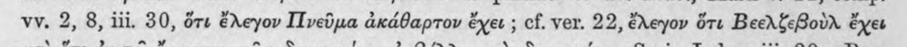 | vv. 2, 8, iii. 30, ὅτε ἔλεγον Πνεῦμα ἀκάθαρτον ἔχει ; cf. ver. 22, ἔλεγον ὅτε Βεελζεβοὺλ ἔχει | c5_nem_igazolt |  |
| 264 | 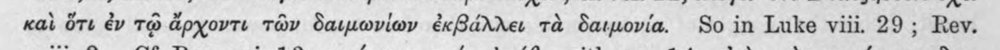 | καὶ ὅτι ἐν τῷ ἄρχοντι τῶν δαιμωνίων ἐκβάλλει τὰ δαιμονία. So in Luke viii. 29; Rev. | c5_nem_igazolt |  |
| 265 | 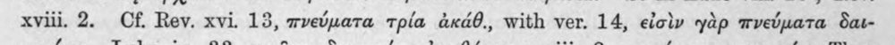 | xviii. 2. Cf. Rev. xvi. 13, πνεύματα τρία ἀκάθ., with ver. 14, εἰσὶν γὰρ πνεύματα δαι- | (csak görög, jelzés nélkül) |  |
| 266 | 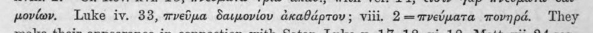 | μονίων. Luke iv. 88, πνεῦμα δαιμονίου ἀκαθάρτου ; viii. 2 -- πνεύματα πονηρά. They | (csak görög, jelzés nélkül) |  |
| 267 | 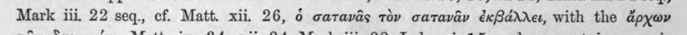 | Mark iii, 22 seq., cf. Matt. xii. 26, 6 σατανᾶς τὸν σατανᾶν ἐκβάλλει, with the ἄρχων | (csak görög, jelzés nélkül) |  |
| 268 | 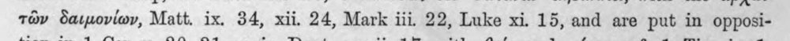 | τῶν δαιμονίων, Matt. ix. 34, xii. 24, Mark iii. 22, Luke xi. 15, and are put in opposi- | (csak görög, jelzés nélkül) |  |
| 269 | 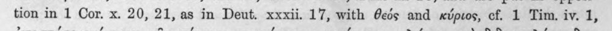 | tion in 1 Cor. x. 20, 21, as in Deut. xxxii. 17, with Θεός and κύριος, cf. 1 Tim. iv. 1, | (csak görög, jelzés nélkül) |  |
| 270 | 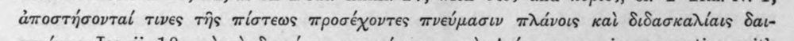 | ἀποστήσονταί τινες τῆς πίστεως προσέχοντες πνεύμασιν πλάνοις καὶ διδασκαλίαις δαι- | (csak görög, jelzés nélkül) |  |
| 271 | 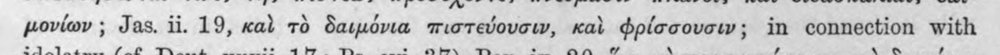 | μονίων ; Jas. ii. 19, cal τὸ δαιμόνια πιστεύουσιν, καὶ φρίσσουσιν; in connection with | latin_torzkep |  |
| 272 | 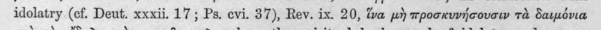 | idolatry (cf. Deut. xxxii. 17; Ps. evi. 37), Rev. ix. 20, ἵνα μὴ προσκυνήσουσιν τὰ δαιμόνια | latin_torzkep |  |
| 273 | 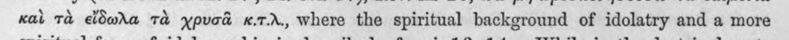 | καὶ τὰ εἴδωλα τὰ χρυσᾶ x.7.r., where the spiritual background of idolatry and a more | latin_torzkep |  |
| 274 | 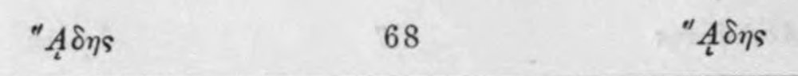 | "Adns 68 “4δης | (csak görög, jelzés nélkül) |  |
| 275 | 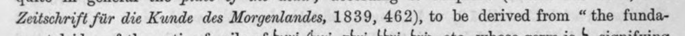 | Zeitschrift fir die Kunde des Morgenlandes, 1839, 462), to be derived from “the funda- | latin_torzkep |  |
| 276 | 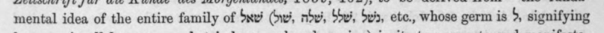 | mental idea of the entire family of Sxvi Gri, ndwi, Sde’, Seis, etc., whose germ is δ, signifying | latin_torzkep |  |
| 277 | 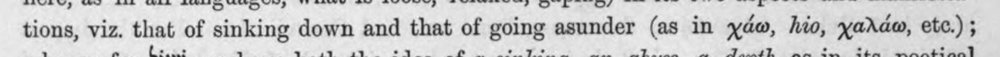 | tions, viz. that of sinking down and that of going asunder (as in χάω, hio, yadda, etc.) ; | latin_torzkep |  |
| 278 | 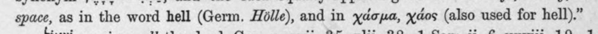 | space, as in the word hell (Germ. Holle), and in χάσμα, χάος (also used for hell).” | latin_torzkep |  |
| 279 | 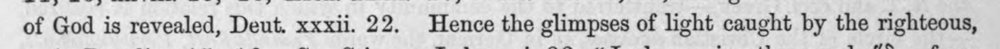 | of God is revealed, Deut. xxxii. 22, Hence the glimpses of light caught by the righteous, | latin_torzkep |  |
| 280 | 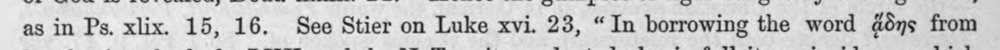 | as in Ps. xlix. 15, 16. See Stier on Luke xvi. 23, “In borrowing the word ays from | latin_torzkep |  |
| 281 | 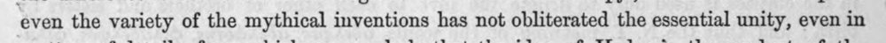 | even the variety of the mythical inventions has not obliterated the essential unity, even in | latin_torzkep |  |
| 282 | 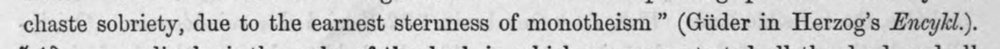 | chaste sobriety, due to the earnest sternness of monotheism” (Giider in Herzog’s Encyki.). | latin_torzkep |  |
| 283 | 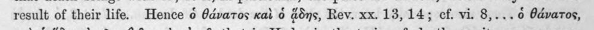 | result of their life. Hence ὁ θάνατος καὶ ὁ ans, Rev. xx. 13,14; cf. vi. 8,...0 θάνατος, | (csak görög, jelzés nélkül) |  |
| 284 | 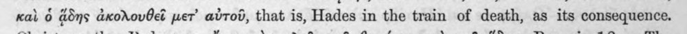 | καὶ ὁ ἅδης ἀκολουθεῖ per’ αὐτοῦ, that is, Hades in the train of death, as its consequence. | c5_nem_igazolt |  |
| 285 | 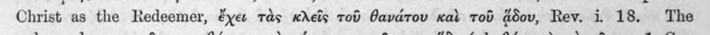 | Christ as the Redeemer, ἔχεν τὰς κλεῖς τοῦ θανάτου καὶ τοῦ adov, Rev. i. 18. The | (csak görög, jelzés nélkül) |  |
| 286 | 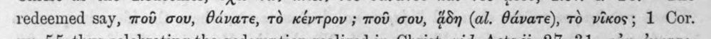 | redeemed say, ποῦ σου, θάνατε, τὸ κέντρον ; ποῦ σου, ἅδη (al. θάνατε), τὸ νῖκος; 1 Cor. | c5_nem_igazolt |  |
| 287 | 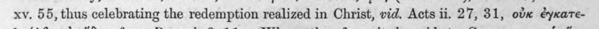 | xv. 55, thus celebrating the redemption realized in Christ, vid. Acts ii. 27, 81, οὐκ ἐγκατε- | c5_nem_igazolt, latin_torzkep |  |
| 288 | 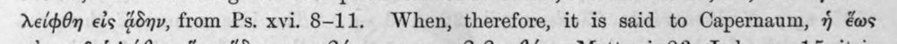 | λείφθη εἰς ἄδην, from Ps. xvi. 8-11. When, therefore, it is said to Capernaum, ἡ ἕως | (csak görög, jelzés nélkül) |  |
| 289 | 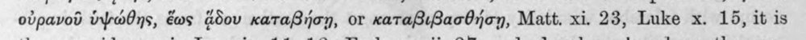 | οὐρανοῦ ὑψώθης, ἕως ἅδου καταβήσῃ, or καταβιβασθήσῃ, Matt. xi. 23, Luke x. 15, it is | c5_nem_igazolt |  |
| 290 | 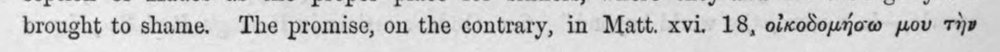 | brought to shame. The promise, on the contrary, in Matt. xvi. 18, οἰκοδομήσω μου τὴν | (csak görög, jelzés nélkül) |  |
| 291 | 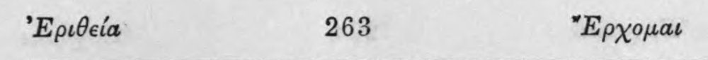 | ᾿Εριθεία 268 Ἔρχομαι | c5_nem_igazolt |  |
| 292 | 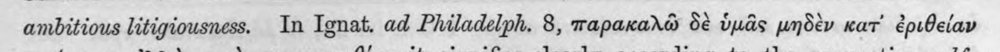 | ambitious litigiousness. In Ignat. ad Philadelph. 8, παρακαλῶ δὲ ὑμᾶς μηδὲν κατ᾽ ἐριθείαν | latin_torzkep |  |
| 293 | 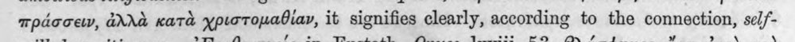 | πράσσειν, ἀλλὰ κατὰ χριστομαθίαν, it signifies clearly, according to the connection, 8ε7- | c5_nem_igazolt |  |
| 294 | 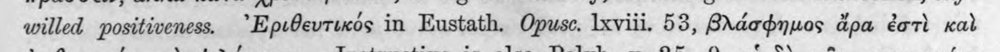 | willed positiveness. ᾿Ἐριθευτικός in Eustath, Opuse. lxviii. 53, βλάσφημος ἄρα ἐστὶ καὶ | c5_nem_igazolt |  |
| 295 | 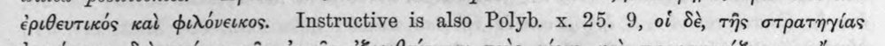 | ἐριθευτικός καὶ φιλόνεικος. Instructive is also Polyb. x. 25. 9, οἱ δὲ, τῆς στρατηγίας | c5_nem_igazolt, latin_torzkep |  |
| 296 | 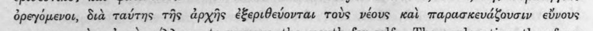 | ὀρεγόμενοι, διὰ ταύτης τῆς ἀρχῆς ἐξεριθεύονται τοὺς νέους καὶ παρασκευάξουσιν εὔνους | c5_nem_igazolt |  |
| 297 | 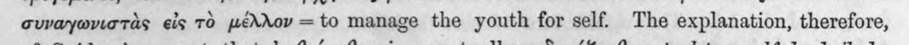 | συναγωνιστὰς εἰς τὸ μέλλον -- ἴο manage the youth for self. The explanation, therefore, | c5_nem_igazolt, latin_torzkep |  |
| 298 | 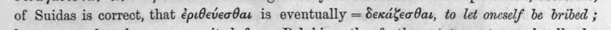 | of Suidas is correct, that ἐριθεύεσθαι is eventually = δεκάξεσθαι, to let oneself be bribed ; | c5_nem_igazolt, latin_torzkep |  |
| 299 | 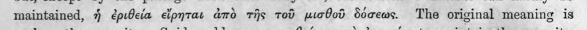 | maintained, ἡ ἐριθεία εἴρηται ἀπὸ τῆς τοῦ μισθοῦ δόσεως. The original meaning is | (csak görög, jelzés nélkül) |  |
| 300 | 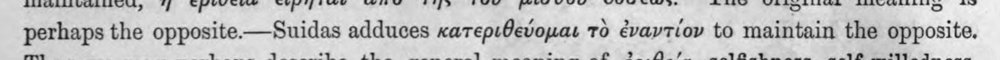 | perhaps the opposite —Suidas adduces κατεριθεύομαι τὸ ἐναντίον to maintain the opposite. | c5_nem_igazolt |  |
