| sorszám | kivágás | cremuoft-sor | gépi jelölés | ítélet |
|---|---|---|---|---|
| 301 | 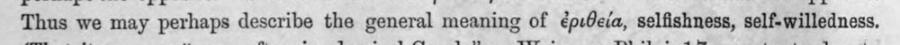 | Thus we may perhaps describe the general meaning of ἐριθεία, selfishness, self-willedness. | (csak görög, jelzés nélkül) |  |
| 302 | 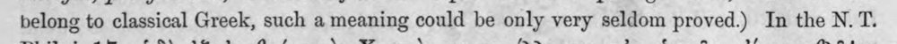 | belong to classical Greek, such a meaning could be only very seldom proved.) In the N. Τὶ | c5_nem_igazolt |  |
| 303 | 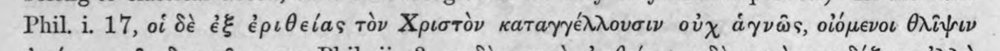 | Phil. i. 17, of δὲ ἐξ ἐριθείας τὸν Χριστὸν καταγγέλλουσιν οὐχ ἁγνῶς, οἰόμενοι θλῖψιν | (csak görög, jelzés nélkül) |  |
| 304 | 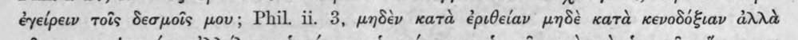 | ἐγείρειν τοῖς δεσμοῖς μου; Phil. ii. 3, μηδὲν κατὰ ἐριθείαν μηδὲ κατὰ κενοδόξιαν ἀλλὰ | c5_nem_igazolt |  |
| 305 | 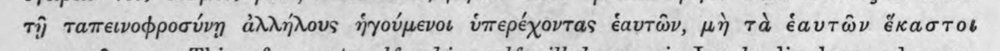 | τῇ ταπεινοφροσύνῃ ἀλλήλους ἡγούμενοι ὑπερέχοντας ἑαυτῶν, μὴ τὰ ἑαυτῶν ἕκαστοι | (csak görög, jelzés nélkül) |  |
| 306 | 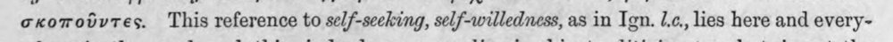 | σκοποῦντες. This reference to self-seeking, self-willedness, as in Ign. ἐ,6,, lies here and every- | (csak görög, jelzés nélkül) |  |
| 307 | 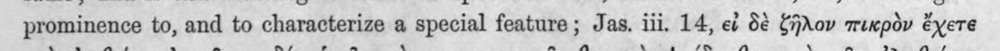 | prominence to, and to characterize a special feature; Jas. iii, 14, εἰ δὲ ζῆλον πικρὸν ἔχετε | (csak görög, jelzés nélkül) |  |
| 308 | 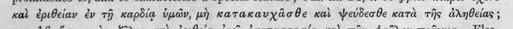 | καὶ ἐριθείαν ἐν τῇ καρδίᾳ ὑμῶν, μὴ κατακαυχᾶσθε καὶ ψεύδεσθε κατὰ τῆς ἀληθείας ; | (csak görög, jelzés nélkül) |  |
| 309 | 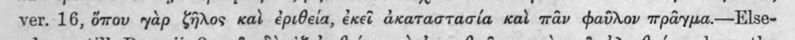 | ver. 16, ὅπου γὰρ ζῆλος καὶ ἐριθεία, ἐκεὶ ἀκαταστασία καὶ πᾶν φαῦλον πρᾶγμα.---Ἐ756- | c5_nem_igazolt |  |
| 310 | 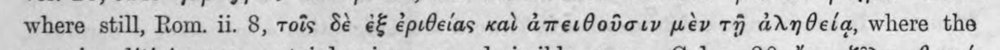 | where still, Rom. ii. 8, τοῖς δὲ ἐξ ἐριθείας καὶ ἀπειθοῦσιν μὲν τῇ ἀληθείᾳ, where the | (csak görög, jelzés nélkül) |  |
| 311 | 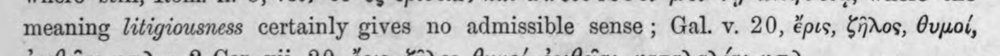 | meaning litigiousness certainly gives no admissible sense ; Gal. v. 20, ἔρις, ζῆλος, θυμοί, | latin_torzkep |  |
| 312 | 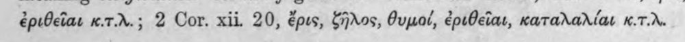 | ἐριθεῖαι w.t.r.; 2 Cor. xii. 20, ἔρις, ζῆλος, θυμοί, ἐριθεῖαι, καταλαλίαι K.7.d. | c5_nem_igazolt |  |
| 313 | 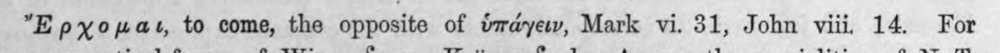 | "Epxopast, to come, the opposite of ὑπάγειν, Mark vi. 31, John viii 14. For | (csak görög, jelzés nélkül) |  |
| 314 | 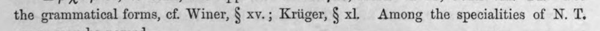 | the grammatical forms, cf. Winer, ὃ xv.; Kriiger, § xl. Among the specialities of N. T. | latin_torzkep |  |
| 315 | 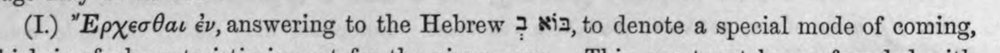 | (1) Ἔρχεσθαι ἐν, answering to the Hebrew 3 813, to denote a special mode of coming, | c5_nem_igazolt |  |
| 316 | 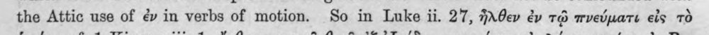 | the Attic use of ἐν in verbs of motion. So in Luke ii. 27, ἦλθεν ἐν τῷ πνεύματι eis τὸ | (csak görög, jelzés nélkül) |  |
| 317 | 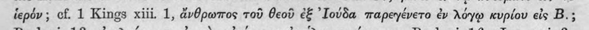 | ἱερόν; cf. 1 Kings xiii. 1, ἄνθρωπος τοῦ θεοῦ ἐξ ᾿Ιούδα παρεγένετο ἐν λόγῳ κυρίου eis B.; | c5_nem_igazolt |  |
| 318 | 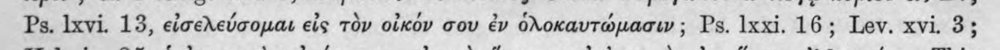 | Ps. lxvi. 13, εἰσελεύσομαι εἰς τὸν οἶκόν σου ἐν ὁλοκαυτώμασιν ; Ps. lxxi. 16; Lev. xvi. 3; | (csak görög, jelzés nélkül) |  |
| 319 | 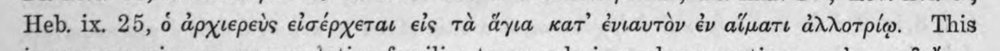 | Heb. ix. 25, ὁ ἀρχιερεὺς εἰσέρχεται εἰς τὰ ἅγια κατ᾽ ἐνιαυτὸν ἐν αἵματι ἀλλοτρίῳ. This | (csak görög, jelzés nélkül) |  |
| 320 | 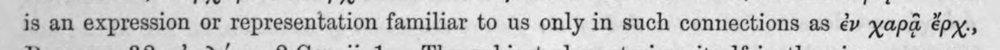 | is an expression or representation familiar to us only in such connections as ἐν χαρᾷ épy., | (csak görög, jelzés nélkül) |  |
| 321 | 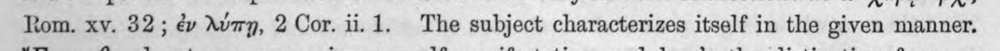 | Rom. xv. 32; ἐν λύπῃ, 2 Cor. ii. 1. The subject characterizes itself in the given manner. | (csak görög, jelzés nélkül) |  |
| 322 | 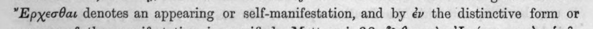 | ἜἜρχεσθαι denotes an appearing or self-manifestation, and by ἐν the distinctive form or | c5_nem_igazolt |  |
| 323 | 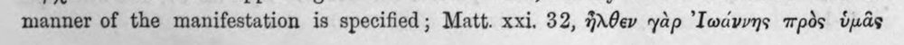 | manner of the manifestation is specified; Matt. xxi. 32, ἦλθεν yap ᾿Ιωάννης πρὸς ὑμᾶς | (csak görög, jelzés nélkül) |  |
| 324 | 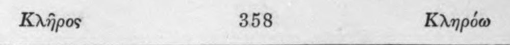 | Κλῆρος 358 Κληρόω | c5_nem_igazolt |  |
| 325 | 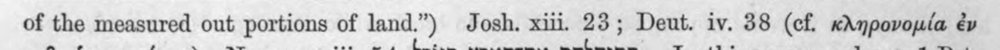 | of the measured out portions of land.”) Josh. xiii. 23; Deut. iv. 38 (cf. κληρονομία ἐν | (csak görög, jelzés nélkül) |  |
| 326 | 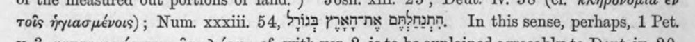 | τοῖς ἡγιασμένοις) ; Num. xxxiii, 54, 9723 yy OF-MIN. In this sense, perhaps, 1 Pet. | latin_torzkep |  |
| 327 | 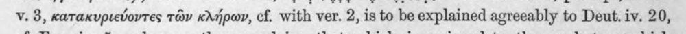 | v. 3, κατακυριεύοντες τῶν κλήρων, cf. with ver. 2, is to be explained agreeably to Deut. iv. 20, | (csak görög, jelzés nélkül) |  |
| 328 | 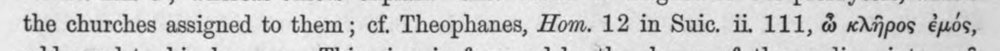 | the churches assigned to them; cf. Theophanes, Hom. 12 in Suic. ii, 111, ὦ κλῆρος ἐμός, | (csak görög, jelzés nélkül) |  |
| 329 | 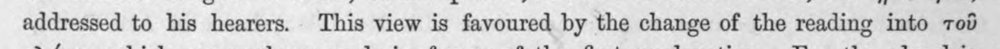 | addressed to his hearers. This view is favoured by the change of the reading into τοῦ | (csak görög, jelzés nélkül) |  |
| 330 | 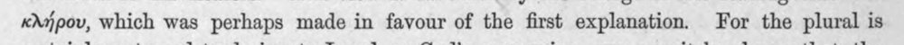 | κλήρου, which was perhaps made in favour of the first explanation. For the plural is | (csak görög, jelzés nélkül) |  |
| 331 | 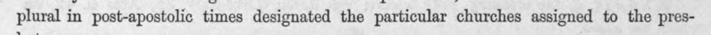 | plural in post-apostolic times designated the particular churches assigned to the pres- | latin_torzkep |  |
| 332 | 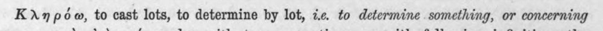 | Κληρόω, to cast lots, to determine by lot, ic. to determine something, or concerning | c5_nem_igazolt |  |
| 333 | 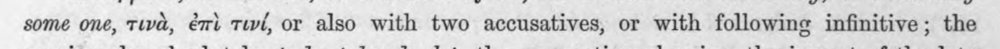 | some one, τινὰ, ἐπὶ τινί, or also with two accusatives, or with following infinitive; the | (csak görög, jelzés nélkül) |  |
| 334 | 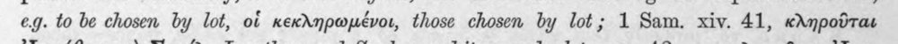 | eg. to be chosen by lot, οἱ κεκληρωμένοι, those chosen by lot; 1 Sam. xiv. 41, κληροῦται | (csak görög, jelzés nélkül) |  |
| 335 | 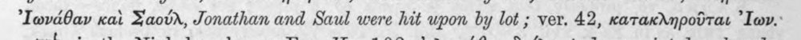 | ᾿Ιωνάθαν καὶ Σαούλ, Jonathan and Saul were hit upon by lot ; ver. 42, κατακληροῦται ᾽Ιων." | c5_nem_igazolt, latin_torzkep |  |
| 336 | 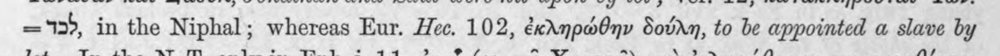 | =12, in the Niphal; whereas Eur. Hee. 102, ἐκληρώθην δούλη, to be appointed a slave by | (csak görög, jelzés nélkül) |  |
| 337 | 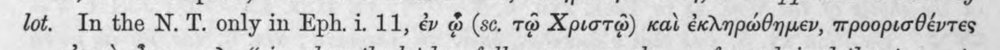 | lot. In the N. T. only in Eph. i. 11, ἐν ᾧ (sc. τῷ Χριστῷ) καὶ ἐκληρώθημεν, προορισθέντες | (csak görög, jelzés nélkül) |  |
| 338 | 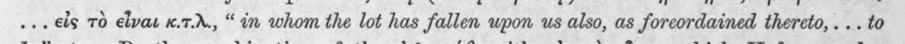 | ἐὸν εἰς τὸ εἶναι x.7.d., “in whom the lot has fallen upon us also, as foreordained thereto, . .. to | latin_torzkep |  |
| 339 | 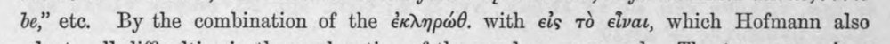 | be,” ete. By the combination of the ἐκληρώθ. with eis τὸ εἶναι, which Hofmann also | (csak görög, jelzés nélkül) |  |
| 340 | 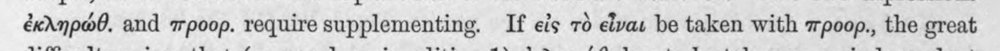 | ἐκληρώθ. and mpoop. require supplementing. If eis τὸ εἶναι be taken with προορ., the great | (csak görög, jelzés nélkül) |  |
| 341 | 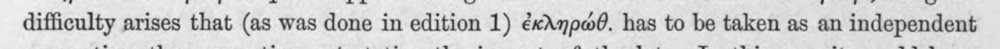 | difficulty arises that (as was done in edition 1) ἐκληρώθ. has to be taken as an independent | (csak görög, jelzés nélkül) |  |
| 342 | 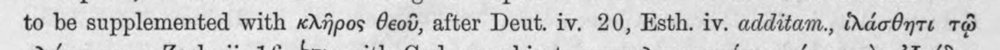 | to be supplemented with κλῆρος θεοῦ, after Deut. iv. 20, Esth. iv. additam., ἱλάσθητι τῷ | latin_torzkep |  |
| 343 | 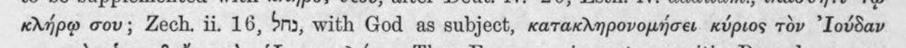 | κλήρῳ σου; Zech. ii. 16, Sn, with God as subject, κατακληρονομήσει κύριος τὸν ᾿Ιούδαν | c5_nem_igazolt |  |
| 344 | 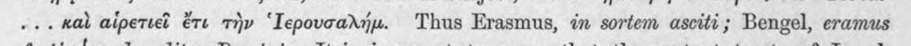 | ... καὶ αἱρετιεῖ ἔτι τὴν ᾿Ιερουσαλήμ. Thus Erasmus, in sortem asciti; Bengel, eramus | c5_nem_igazolt, latin_torzkep |  |
| 345 | 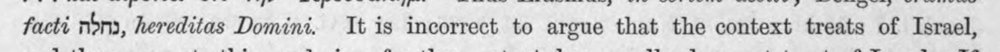 | facti noma, hereditas Domini. Tt is incorrect to argue that the context treats of Israel, | latin_torzkep |  |
| 346 | 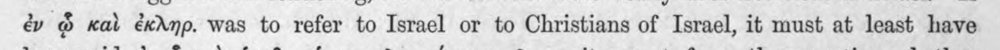 | ἐν ᾧ καὶ ἐκληρ. was to refer to Israel or to Christians of Israel, it must at least have | (csak görög, jelzés nélkül) |  |
| 347 | 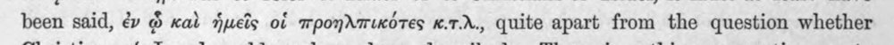 | been said, ἐν ᾧ καὶ ἡμεῖς of προηλπικότες x.7.X., quite apart from the question whether | (csak görög, jelzés nélkül) |  |
| 348 | 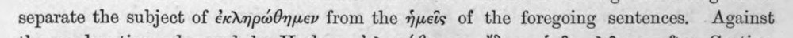 | separate the subject of ἐκληρώθημεν from the ἡμεῖς of the foregoing sentences. Against | (csak görög, jelzés nélkül) |  |
| 349 | 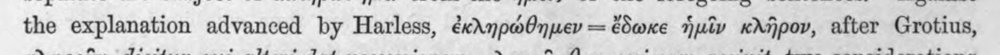 | the explanation advanced by Harless, ἐκληρώθημεν -- ἔδωκε ἡμῖν κλῆρον, after Grotius, | (csak görög, jelzés nélkül) |  |
| 350 | 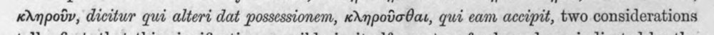 | κληροῦν, dicitur qui alteri dat possessionem, κληροῦσθαι, qui eam accipit, two considerations | c5_nem_igazolt, latin_torzkep |  |
