| sorszám | kivágás | cremuoft-sor | gépi jelölés | ítélet |
|---|---|---|---|---|
| 351 | 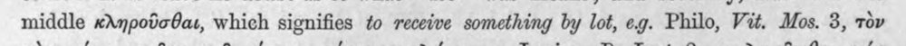 | middle κληροῦσθαι, which signifies to receive something by lot, eg. Philo, Vit. Mos. 3, τὸν | c5_nem_igazolt |  |
| 352 | 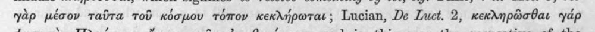 | yap μέσον ταῦτα τοῦ κόσμου τόπον κεκλήρωται ; Lucian, De Luct. 2, κεκληρῶσθαι yap | (csak görög, jelzés nélkül) |  |
| 353 | 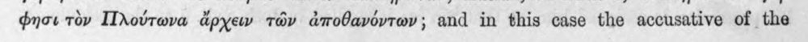 | φησι τὸν Πλούτωνα ἄρχειν τῶν ἀποθανόντων; and in this case the accusative of the | c5_nem_igazolt |  |
| 354 | 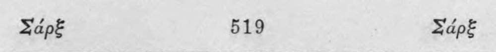 | Σάρξ 519 Σάρξ | c5_nem_igazolt |  |
| 355 | 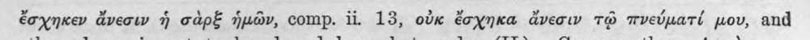 | ἔσχηκεν ἄνεσιν ἡ σὰρξ ἡμῶν, comp. ii. 13, οὐκ ἔσχηκα ἄνεσιν τῷ πνεύματί μου, and | (csak görög, jelzés nélkül) |  |
| 356 | 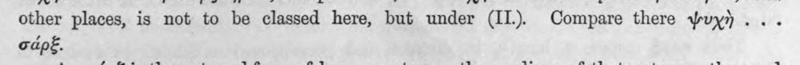 | other places, is not to be classed here, but under (11... Compare there ψυχὴ ... σάρξ. | (csak görög, jelzés nélkül) |  |
| 357 | 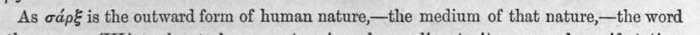 | As σάρξ is the outward form of human nature——the medium of that nature,—the word | (csak görög, jelzés nélkül) |  |
| 358 | 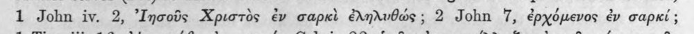 | 1 John iv. 2, ᾿Ιησοῦς Χριστὸς ἐν σαρκὶ éednrvOads; 2 John 7, ἐρχόμενος ἐν σαρκί; | c5_nem_igazolt |  |
| 359 | 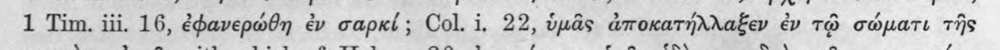 | 1 Tim. iii. 16, ἐφανερώθη ἐν σαρκί; Col. 1. 22, ὑμᾶς ἀποκατήλλαξεν ἐν τῷ σώματι τῆς | c5_nem_igazolt |  |
| 360 | 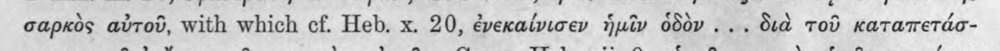 | σαρκὸς αὐτοῦ, with which cf. Heb. x. 20, ἐνεκαίνισεν ἡμῖν ὁδὸν ... διὰ τοῦ καταπετάσ- | c5_nem_igazolt |  |
| 361 | 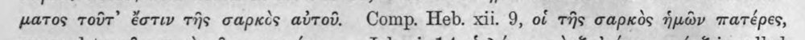 | ματος τοῦτ᾽ ἔστιν τῆς σαρκὸς αὐτοῦ. Comp. Heb. xii. 9, of τῆς σαρκὸς ἡμῶν πατέρες, | (csak görög, jelzés nélkül) |  |
| 362 | 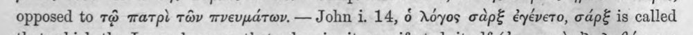 | opposed to τῷ πατρὶ τῶν πνευμάτων. --- John i. 14, ὁ λόγος σὰρξ ἐγένετο, σάρξ is called | (csak görög, jelzés nélkül) |  |
| 363 | 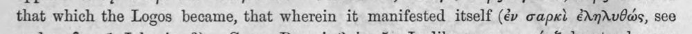 | that which the Logos became, that wherein it manifested itself (ἐν σαρκὶ ἐληλυθώς, see | (csak görög, jelzés nélkül) |  |
| 364 | 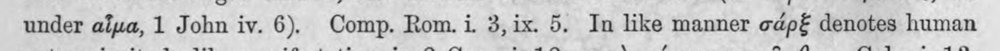 | under αἷμα, 1 John iv. 6). Comp. Rom. i. 3,ix. 5. In like manner σάρξ denotes human | (csak görög, jelzés nélkül) |  |
| 365 | 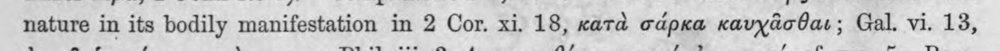 | nature in its bodily manifestation in 2 Cor. xi. 18, κατὰ σάρκα καυχᾶσθαι; Gal. vi. 13, | (csak görög, jelzés nélkül) |  |
| 366 | 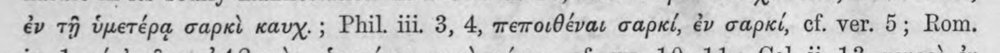 | ἐν τῇ ὑμετέρᾳ σαρκὶ καυχ. ; Phil. iii. 3, 4, πεποιθέναι σαρκί, ἐν σαρκί, cf. ver. 5; Rom, | (csak görög, jelzés nélkül) |  |
| 367 | 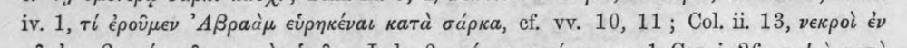 | iv. 1, ri ἐροῦμεν ᾿Αβραὰμ εὑρηκέναι κατὰ σάρκα, cf. vv. 10, 11; Col. ii, 18, νεκροὶ ἐν | c5_nem_igazolt, latin_torzkep |  |
| 368 | 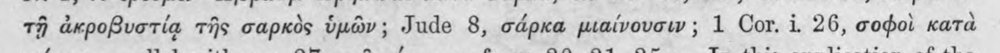 | τῇ ἀκροβυστίᾳ τῆς σαρκὸς ὑμῶν; Jude 8, σάρκα μιαίνουσιν; 1 Cor. i. 26, σοφοὶ κατὰ | (csak görög, jelzés nélkül) |  |
| 369 | 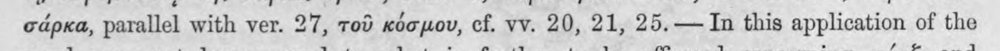 | σάρκα, parallel with ver. 27, τοῦ κόσμου, cf. vv. 20, 21, 25.— In this application of the | (csak görög, jelzés nélkül) |  |
| 370 | 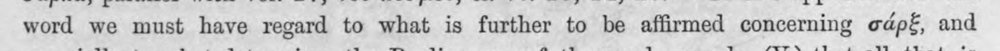 | word we must have regard to what is further to be affirmed concerning σάρξ, and | (csak görög, jelzés nélkül) |  |
| 371 | 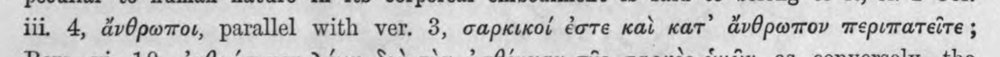 | iii 4, ἄνθρωποι, parallel with ver. 3, σαρκικοί ἐστε καὶ κατ᾽ ἄνθρωπον περιπατεῖτε ; | (csak görög, jelzés nélkül) |  |
| 372 | 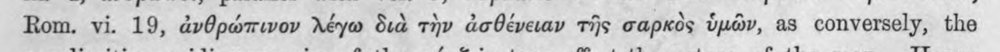 | Rom. vi. 19, ἀνθρώπινον λέγω Sia τὴν ἀσθένειαν τῆς σαρκὸς ὑμῶν, as conversely, the | latin_torzkep |  |
| 373 | 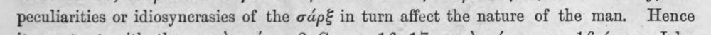 | peculiarities or idiosyncrasies of the σάρξ in turn affect the nature of the man. Hence | latin_torzkep |  |
| 374 | 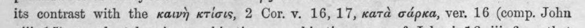 | its contrast with the καινὴ κτίσις, 2 Cor. v. 16,17, κατὰ σάρκα, ver, 16 (comp. John | (csak görög, jelzés nélkül) |  |
| 375 | 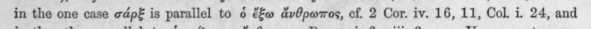 | in the one case σάρξ is parallel to ὁ ἔξω ἄνθρωπος, cf. 2 Cor. iv. 16, 11, Col. i. 24, and | (csak görög, jelzés nélkül) |  |
| 376 | 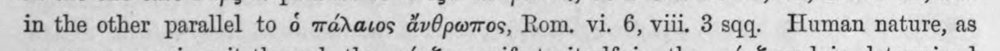 | in the other parallel to ὁ πάλαιος ἄνθρωπος, Rom, vi. 6, viii. 3 sqq. Human nature, as | c5_nem_igazolt |  |
| 377 | 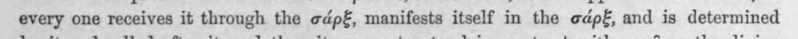 | every one receives it through the σάρξ, manifests itself in the σάρξ, and is determined | (csak görög, jelzés nélkül) |  |
| 378 | 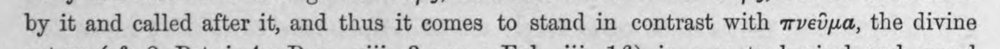 | by it and called after it, and thus it comes to stand in contrast with πνεῦμα, the divine | (csak görög, jelzés nélkül) |  |
| 379 | 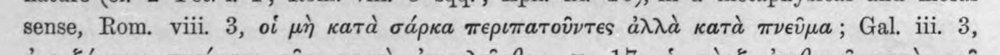 | sense, Rom. viii. 3, of μὴ κατὰ σάρκα περιπατοῦντες ἀλλὰ κατὰ πνεῦμα ; Gal. iii. 3, | (csak görög, jelzés nélkül) |  |
| 380 | 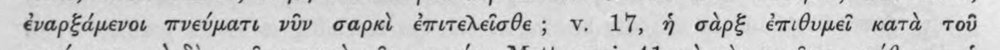 | ἐναρξάμενοι πνεύματι viv σαρκὶ ἐπιτελεῖσθε; v. 17, ἡ σὰρξ ἐπιθυμεῖ κατὰ τοῦ | (csak görög, jelzés nélkül) |  |
| 381 | 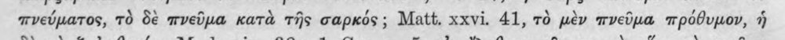 | πνεύματος, τὸ δὲ πνεῦμα κατὰ τῆς σαρκός ; Matt. xxvi. 41, τὸ μὲν πνεῦμα πρόθυμον, ἡ | (csak görög, jelzés nélkül) |  |
| 382 | 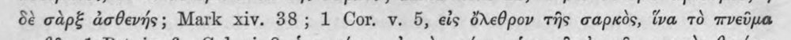 | δὲ σὰρξ ἀσθενής; Mark xiv. 38; 1 Cor. v. 5, εἰς ὄλεθρον τῆς σαρκὸς, ἵνα τὸ πνεῦμα | (csak görög, jelzés nélkül) |  |
| 383 | 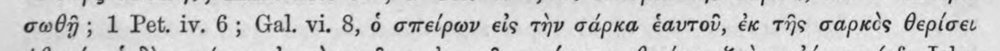 | σωθῇ; 1 Pet. iv. 6; Gal. vi. 8, ὁ σπείρων εἰς τὴν σάρκα ἑαυτοῦ, ἐκ τῆς σαρκὸς θερίσει | (csak görög, jelzés nélkül) |  |
| 384 | 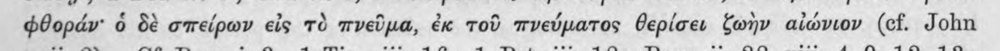 | φθοράν' ὁ δὲ σπείρων εἰς τὸ πνεῦμα, ἐκ τοῦ πνεύματος θερίσει ζωὴν αἰώνιον (cf. John | (csak görög, jelzés nélkül) |  |
| 385 | 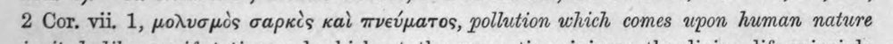 | 2 Cor. vii. 1, μολυσμὸς σαρκὲς καὶ πνεύματος, pollution which comes upon human nature | c5_nem_igazolt |  |
| 386 | 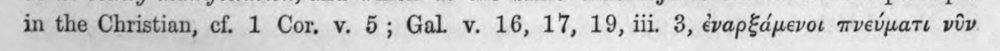 | in the Christian, cf. 1 Cor, v. 5; Gal. v. 16, 17, 19, iii. 3, ἐναρξάμενοι πνεύματι viv | (csak görög, jelzés nélkül) |  |
| 387 | 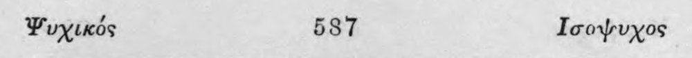 | Ψυχικός 587 Ισοψυχος | c5_nem_igazolt |  |
| 388 | 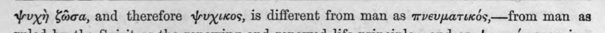 | Ψυχὴ ζῶσα, and therefore ψύχίκος, is different from man as πνευματικός, --- ἔροτη man as | c5_nem_igazolt |  |
| 389 | 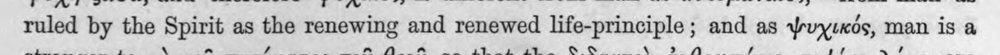 | ruled by the Spirit as the renewing and renewed life-principle ; and as ψυχικός, man is a | latin_torzkep |  |
| 390 | 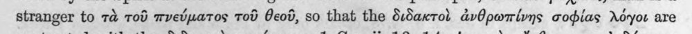 | stranger to τὰ τοῦ πνεύματος τοῦ θεοῦ, so that the διδακτοὶ ἀνθρωπίνης σοφίας λόγοι are | (csak görög, jelzés nélkül) |  |
| 391 |  | eontrasted with the διδακτοὶ πνεύματος, 1 Cor. ii, 18, 14, ψυχικὸς ἄνθρωπος οὐ δύναται | latin_torzkep |  |
| 392 | 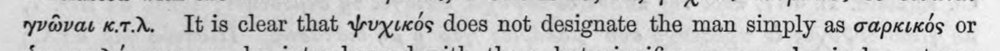 | γνῶναι κιτιλ. Τῷ is clear that ψυχικός does not designate the man simply as σαρκικός or | c5_nem_igazolt |  |
| 393 | 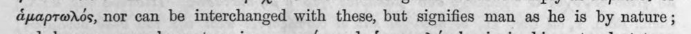 | ἁμαρτωλός, nor can be interchanged with these, but signifies man as he is by nature; | (csak görög, jelzés nélkül) |  |
| 394 | 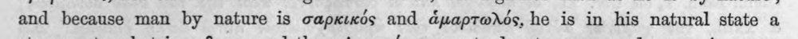 | and because man by nature is σαρκικός and ἁμαρτωλός, he is in his natural state a | (csak görög, jelzés nélkül) |  |
| 395 | 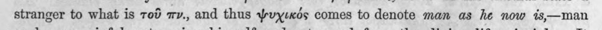 | stranger to what is τοῦ πν., and thus ψυχιεκός comes to denote man as he now %is,—man | c5_nem_igazolt |  |
| 396 | 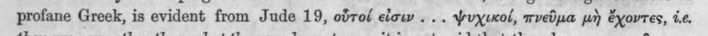 | profane Greek, is evident from Jude 19, οὗτοί εἰσιν... ψυχικοί, πνεῦμα μὴ ἔχοντες, 1.6. | (csak görög, jelzés nélkül) |  |
| 397 | 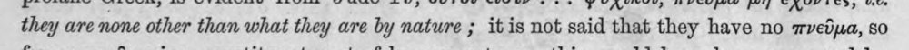 | they are none other than what they are by nature ; itis not said that they have no πνεῦμα, so | latin_torzkep |  |
| 398 | 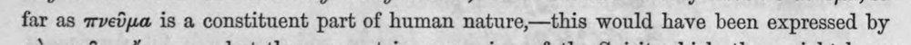 | far as πνεῦμα is a constituent part of human nature,—this would have been expressed by | (csak görög, jelzés nélkül) |  |
| 399 | 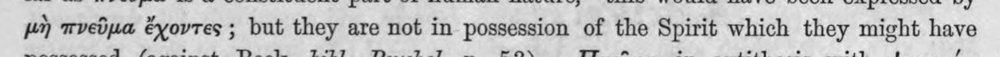 | μὴ πνεῦμα ἔχοντες ; but they are not in possession of the Spirit which they might have | (csak görög, jelzés nélkül) |  |
| 400 | 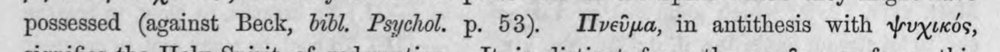 | possessed (against Beck, bibl. Psychol. p. 53). Πνεῦμα, in antithesis with ψυχικός, | c5_nem_igazolt |  |
