| sorszám | kivágás | cremuoft-sor | gépi jelölés | ítélet |
|---|---|---|---|---|
| 401 | 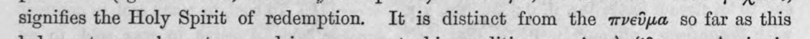 | signifies the Holy Spirit of redemption. It is distinct from the πνεῦμα so far as this | (csak görög, jelzés nélkül) |  |
| 402 | 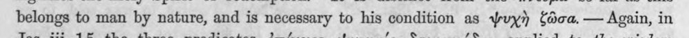 | belongs to man by nature, and is necessary to his condition as ψυχὴ ζῶσα. ---- Again, in | (csak görög, jelzés nélkül) |  |
| 403 |  | Jas. iii, 15, the three predicates, ἐπέγειος, ψυχικός, δαιμονιώδης, applied to the wisdom | c5_nem_igazolt |  |
| 404 |  | which cometh not from above, express a progressive enhancement resting upon an inner | latin_torzkep |  |
| 405 | 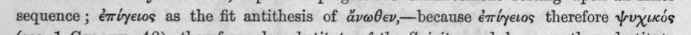 | sequence ; ἐπύγειος as the fit antithesis of dvwferv,—because ἐπύγειος therefore ψυχικός | c5_nem_igazolt |  |
| 406 | 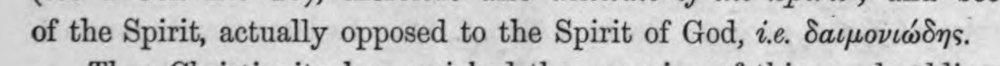 | of the Spirit, actually opposed to the Spirit of God, 7c. δαιμονιώδης. | (csak görög, jelzés nélkül) |  |
| 407 | 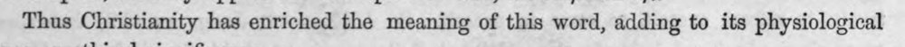 | Thus Christianity has enriched the meaning of this word, adding to its physiological | latin_torzkep |  |
| 408 | 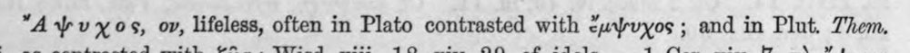 | ἔἤλψυχος, ον, lifeless, often in Plato contrasted with ἔμψυχος ; and in Plut. Them. | c5_nem_igazolt |  |
| 409 | 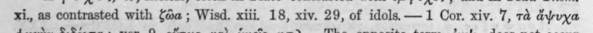 | xi., as contrasted with ζῶα ; Wisd. xiii. 18, xiv. 29, of idols. —1 Cor. xiv. 7, τὰ ἄψυχα | c5_nem_igazolt |  |
| 410 | 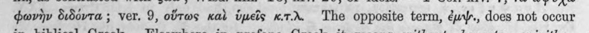 | φωνὴν διδόντα ; ver. 9, οὕτως καὶ ὑμεῖς κιτλ. The opposite term, ἐμψ"., does not occur | c5_nem_igazolt |  |
| 411 | 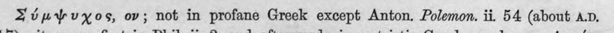 | Σύμψυχος, ov; not in profane Greek except Anton. Polemon. ii. 54 (about A.D. | c5_nem_igazolt |  |
| 412 | 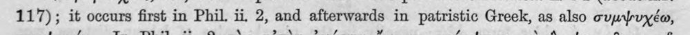 | 117); it occurs first in Phil. ii, 2, and afterwards in patristic Greek, as also συμψυχέω, | c5_nem_igazolt |  |
| 413 | 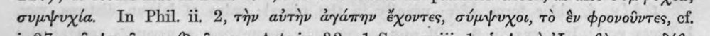 | συμψυχία. In Phil. ii, 2, τὴν αὐτὴν ἀγάπην ἔχοντες, σύμψυχοι, τὸ ὃν φρονοῦντες, cf. | c5_nem_igazolt |  |
| 414 | 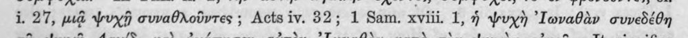 | i. 27, μιᾷ ψυχῇ συναθλοῦντες ; Acts iv. 32; 1 Sam. xviii. 1, ἡ ψυχὴ ᾿Ιωναθὰν συνεδέθη | c5_nem_igazolt |  |
| 415 | 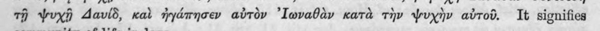 | τῇ ψυχῇ Δαυίδ, καὶ ἠγάπησεν αὐτὸν ᾿Ιωναθὰν κατὰ τὴν ψυχὴν αὐτοῦ. It signifies | c5_nem_igazolt |  |
| 416 | 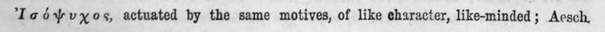 | Ἰσόψυχος, actuated by the same motives, of like character, like-minded; Aesch, | c5_nem_igazolt, latin_torzkep |  |
| 417 | 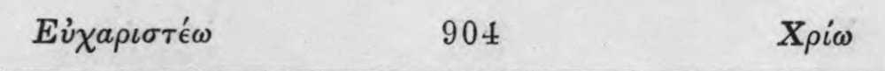 | Εὐχαριστέω 904 Xpio | c5_nem_igazolt, latin_torzkep |  |
| 418 | 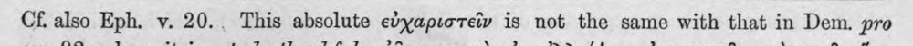 | Cf. also Eph. v. 20.. This absolute εὐχαριστεῖν is not the same with that in Dem. pro | (csak görög, jelzés nélkül) |  |
| 419 | 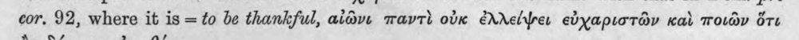 | cor, 92, where it is = to be thankful, αἰῶνι παντὶ οὐκ ἐλλείψει εὐχαριστῶν καὶ ποιῶν ὅτι | (csak görög, jelzés nélkül) |  |
| 420 | 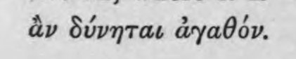 | ἂν δύνηται ἀγαθόν. | (csak görög, jelzés nélkül) |  |
| 421 | 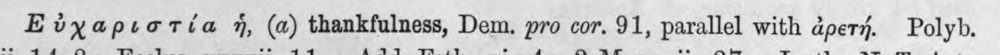 | Εὐχαριστία ἡ, (a) thankfulness, Dem. pro cor. 91, parallel with ἀρετή. Polyb. | c5_nem_igazolt |  |
| 422 | 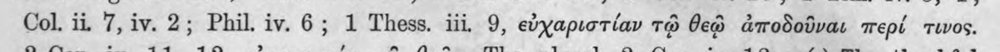 | Col. ii, 7, iv. 2; Phil. iv. 6; 1 Thess. iii, 9, εὐχαριστίαν τῷ θεῷ ἀποδοῦναι περί τινος. | (csak görög, jelzés nélkül) |  |
| 423 | 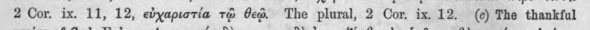 | 2 Cor. ix. 11, 12, εὐχαριστία τῷ θεῷ: The plural, 2 Cor. ix. 12. (6) The thankful | (csak görög, jelzés nélkül) |  |
| 424 |  | praise of God, Eph. v. 4, πορνεία δὲ... μηδὲ ὀνομαξέσθω ἐν ὑμῖν, καθὼς πρέπει ἁγίοις, | c5_nem_igazolt |  |
| 425 | 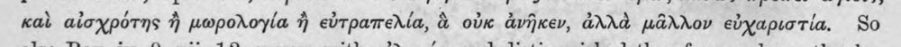 | καὶ αἰσχρότης ἢ μωρολογία ἢ εὐτραπελία, ἃ οὐκ ἀνῆκεν, ἀλλὰ μᾶλλον εὐχαριστία. So | (csak görög, jelzés nélkül) |  |
| 426 | 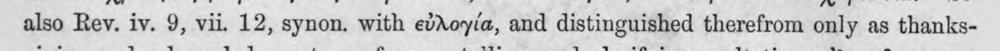 | also Rey. iv. 9, vii. 12, synon. with εὐλογία, and distinguished therefrom only as thanks- | (csak görög, jelzés nélkül) |  |
| 427 | 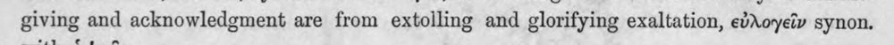 | giving and acknowledgment are from extolling and glorifying exaltation, εὐλογεῖν synon. | latin_torzkep |  |
| 428 | 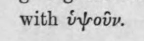 | with ὑψοῦν. | (csak görög, jelzés nélkül) |  |
| 429 | 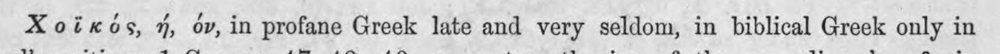 | Xoixdés, ἡ, ov, in profane Greek late and very seldom, in biblical Greek only in | (csak görög, jelzés nélkül) |  |
| 430 | 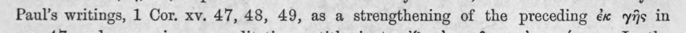 | Paul’s writings, 1 Cor. xv. 47, 48, 49, as a strengthening of the preceding ἐκ γῆς in | (csak görög, jelzés nélkül) |  |
| 431 | 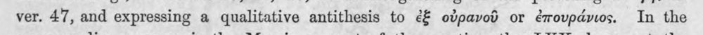 | ver. 47, and expressing a qualitative antithesis to ἐξ οὐρανοῦ or ἐπουράνιος. In the | (csak görög, jelzés nélkül) |  |
| 432 | 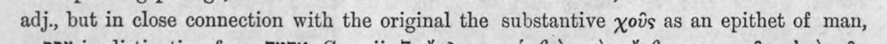 | adj., but in close connection with the original the substantive χοῦς as an epithet of man, | (csak görög, jelzés nélkül) |  |
| 433 | 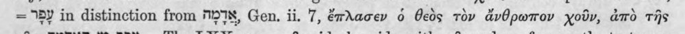 | = 5Y in distinction from M18, Gen. ii. 7, ἔπλασεν ὁ θεὸς τὸν ἄνθρωπον χοῦν, ἀπὸ τῆς | (csak görög, jelzés nélkül) |  |
| 434 | 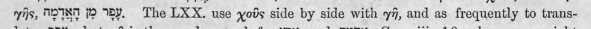 | γῆς, WOIST 9 ἜΣ. The LXX. use χοῦς side by side with γῆ, and as frequently to trans- | c5_nem_igazolt, heberdetektor, latin_torzkep |  |
| 435 | 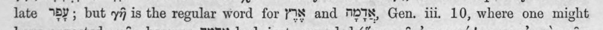 | late “5Y; but γῇ is the regular word for YS and TIX, Gen. 111, 10, where one might | latin_torzkep |  |
| 436 | 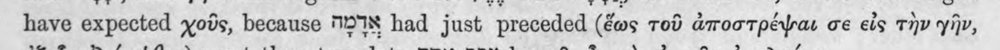 | have expected χοῦς, because M278 had just preceded (ἕως τοῦ ἀποστρέψαι ce εἰς τὴν γῆν, | (csak görög, jelzés nélkül) |  |
| 437 | 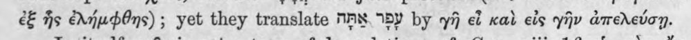 | ἐξ ἧς ἐλήμφθης) ; yet they translate NAY. ΒΨ by γῆ ef καὶ εἰς γῆν ἀπελεύσῃ. | c5_nem_igazolt |  |
| 438 | 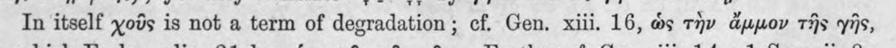 | In itself χοῦς is not a term of degradation; cf. Gen. xiii. 16, ὡς τὴν ἄμμον τῆς γῆς, | (csak görög, jelzés nélkül) |  |
| 439 | 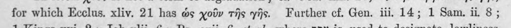 | for which Ecclus. xliv. 21 has ὡς χοῦν τῆς γῆς. Further cf. Gen. iii, 14; 1 Sam. ii 8 ; | (csak görög, jelzés nélkül) |  |
| 440 | 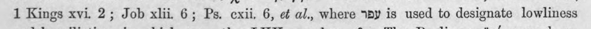 | 1 Kings xvi. 2; Job xlii. 6; Ps. cxii. 6, σέ al., where ἼΒΨ is used to designate lowliness | c5_nem_igazolt, latin_torzkep |  |
| 441 |  | and humiliation, in which cases the LXX. employ γῆ. The Pauline χοῖκός may how- | c5_nem_igazolt |  |
| 442 | 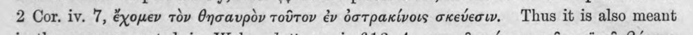 | 2 Cor. iv. 7, ἔχομεν τὸν θησαυρὸν τοῦτον ἐν ὀστρακίνοις σκεύεσιν. Thus it is also meant | (csak görög, jelzés nélkül) |  |
| 443 | 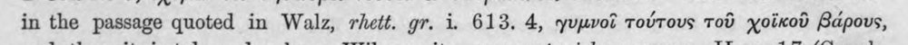 | in the passage quoted in Walz, rhett. gr. i. 613. 4, γυμνοῖ τούτους τοῦ χοϊκοῦ βάρους, | c5_nem_igazolt |  |
| 444 | 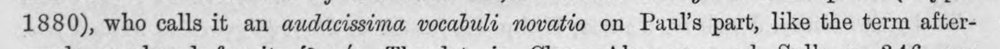 | 1880), who calls it an audacissima vocabuli novatio on Paul's part, like the term after- | latin_torzkep |  |
| 445 |  | wards employed for it, ὑλικός, Theodot. in Clem. Alex. opp. ed. Sylb. p. 346, see | c5_nem_igazolt, latin_torzkep |  |
| 446 |  | Wilamowitz ; cf. Orac. Sibyll. viii. 445 sqq., ᾧ θνητῷ περ ἐόντι, τὰ κόσμικα πάντα | c5_nem_igazolt, latin_torzkep |  |
| 447 | 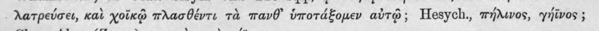 | λατρεύσει, καὶ χοϊκῷ πλασθέντι τὰ πανθ᾽ ὑποτάξομεν αὐτῷ; Hesych., πήλινος, γήϊνος ; | c5_nem_igazolt |  |
| 448 | 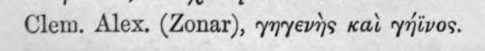 | Clem. Alex. (Zonar), γηγενὴς καὶ γήϊνος. | c5_nem_igazolt |  |
| 449 | 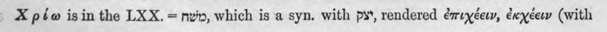 | X péw isin the LXX. -- nvin, which is a syn. with py’, rendered ἐπιχέειν, ἐκχέειν (with | c5_nem_igazolt, heberdetektor, latin_torzkep |  |
| 450 | 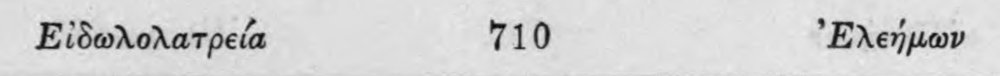 | Εἰδωλολατρεία 710 ᾿Ελεήμων | c5_nem_igazolt |  |
