| sorszám | kivágás | cremuoft-sor | gépi jelölés | ítélet |
|---|---|---|---|---|
| 451 | 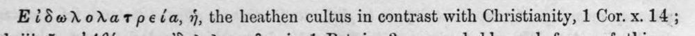 | Εἰδωλολατρεΐα, ἡ, the heathen cultus in contrast with Christianity, 1 Cor. χ. 14; | c5_nem_igazolt |  |
| 452 | 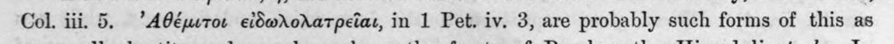 | Col. iii. 5. ᾿Αθέμιτοι εἰδωλολατρεῖαι, in 1 Pet. iv. 3, are probably such forms of this as | c5_nem_igazolt |  |
| 453 | 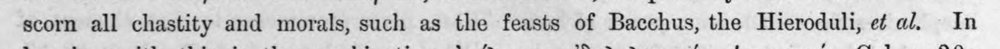 | scorn all chastity and morals, such as the feasts of Bacchus, the Hieroduli, εὐ al. In | latin_torzkep |  |
| 454 | 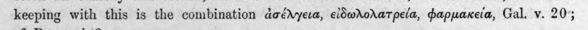 | keeping with this is the combination ἀσέλγεια, εἰδωλολατρεία, φαρμακεία, Gal. v. 20; | (csak görög, jelzés nélkül) |  |
| 455 | 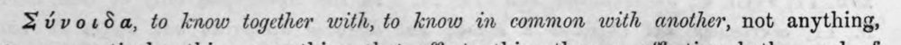 | Σύνοιδα, to know together with, to know in common with another, not anything, | c5_nem_igazolt |  |
| 456 |  | witnesses and confederates, Soph. Ant. 264 sqq., ἦμεν δ᾽ ἑτοῖμοι καὶ μύδρους αἴρειν χεροῖν | c5_nem_igazolt |  |
| 457 | 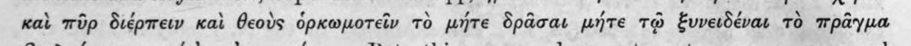 | καὶ πῦρ διέρπειν Kai θεοὺς ὁρκωμοτεῖν τὸ μήτε δρᾶσαι μήτε τῷ ξυνειδέναι τὸ πρᾶγμα | (csak görög, jelzés nélkül) |  |
| 458 | 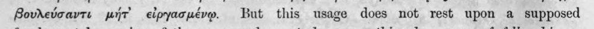 | βουλεύσαντε μήτ᾽ εἰργασμένῳ But this usage does not rest upon a supposed | (csak görög, jelzés nélkül) |  |
| 459 | 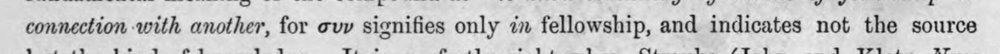 | connection with another, for συν signifies only in fellowship, and indicates not the source | (csak görög, jelzés nélkül) |  |
| 460 | 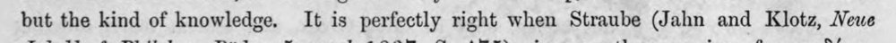 | but the kind of knowledge. It is perfectly right when Straube (Jahn and Klotz, Neue | latin_torzkep |  |
| 461 |  | Jahrbb. f. Philol. τι. Piidag. 5 suppl. 1837, S. 475) gives as the meaning of συνειδέναι, | c5_nem_igazolt |  |
| 462 | 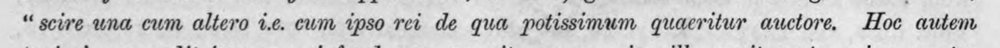 | “ scire una cum altero 1.6. cwm ipso rei de qua potissimum quacritur auctore. Hoc autem | latin_torzkep |  |
| 463 | 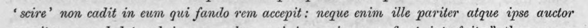 | ‘ scire’ non cadit in eum qui fando vem accepit: neque enim ille pariter atque ipse auctor | latin_torzkep |  |
| 464 | 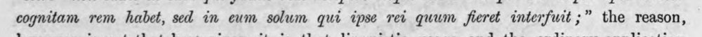 | cognitam rem habet, sed in eum solum qui ipse rei quum fieret interfuit ;” the reason, | latin_torzkep |  |
| 465 |  | of the word have fixed it to a special object and relation, Συνειδέναι is used regarding | c5_nem_igazolt |  |
| 466 |  | Hence συνειδέναι ἑαυτῷ = to be one's own witness, to be conscious to oneself. | c5_nem_igazolt, latin_torzkep |  |
| 467 | 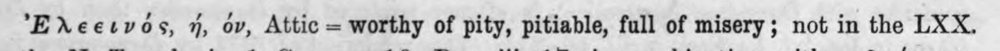 | Ἐλεεινός, 7, ov, Attic = worthy of pity, pitiable, full of misery; not in the LXX. | c5_nem_igazolt |  |
| 468 | 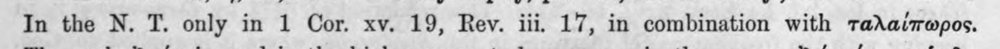 | In the N. T. only in 1 Cor. xv. 19, Rev. iii. 17, in combination with ταλαίπωρος. | (csak görög, jelzés nélkül) |  |
| 469 | 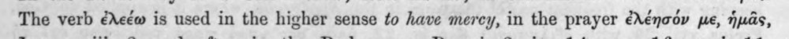 | The verb ἐλεέω is used in the higher sense to have mercy, in the prayer ἐλέησόν pe, ἡμᾶς, | (csak görög, jelzés nélkül) |  |
| 470 | 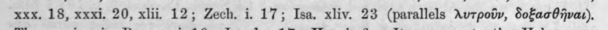 | xxx, 18, xxxi. 20, xlii, 12; Zech. i. 17; Isa. xliv. 23 (parallels λυτροῦν, SofacOjvar). | c5_nem_igazolt |  |
| 471 | 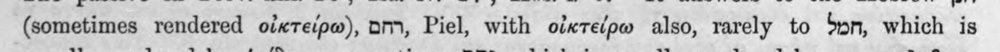 | (sometimes rendered οἰκτείρω), om, Piel, with οἰκτείρω also, rarely to bon, which is | (csak görög, jelzés nélkül) |  |
| 472 | 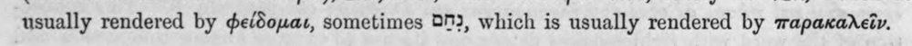 | usually rendered by φείδομαι, sometimes ὉΠ), which is usually rendered by παρακαλεῖν. | c5_nem_igazolt |  |
| 473 | 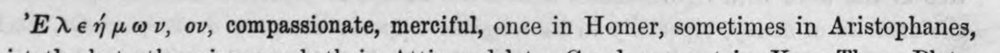 | Ἐλεήμων, ov, compassionate, merciful, once in Homer, sometimes in Aristophanes, | c5_nem_igazolt |  |
| 474 | 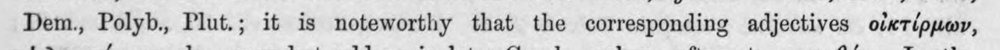 | Dem., Polyb., Plut.; it is noteworthy that the corresponding adjectives οἰκτέρμων, | c5_nem_igazolt |  |
| 475 | 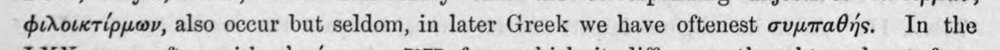 | φιλοικτίρμων, also occur but seldom, in later Greek we have oftenest συμπαθής. In the | c5_nem_igazolt |  |
| 476 | 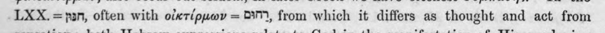 | LXX. =pan, often with οἰκτίρμων = 037, from which it differs as thought and act from | (csak görög, jelzés nélkül) |  |
| 477 | 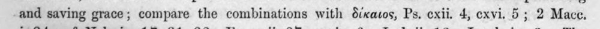 | -and saving grace; compare the combinations with δίκαιος, Ps. exii. 4, exvi. 5 ; 2 Mace. | (csak görög, jelzés nélkül) |  |
| 478 | 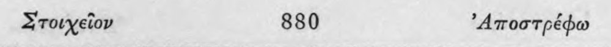 | Στοιχεῖον 880 ᾿Αποστρέφω | c5_nem_igazolt |  |
| 479 | 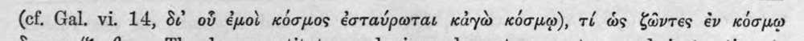 | (cf. Gal. vi. 14, δ οὗ ἐμοὶ κόσμος ἐσταύρωται κἀγὼ κόσμῳ), τέ ὡς ζῶντες ἐν κόσμῳ | (csak görög, jelzés nélkül) |  |
| 480 | 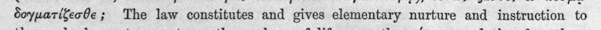 | δογματίζεσθε; The law constitutes and gives elementary nurture and instruction to | (csak görög, jelzés nélkül) |  |
| 481 | 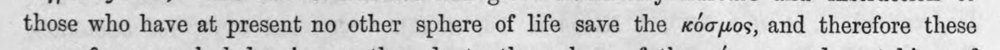 | those who have at present no other sphere of life save the κόσμος, and therefore these | (csak görög, jelzés nélkül) |  |
| 482 | 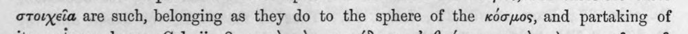 | στοιχεῖα are such, belonging as they do to the sphere of the κόσμος, and partaking of | latin_torzkep |  |
| 483 | 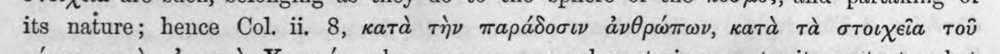 | its nature; hence Col. ii, 8, κατὰ τὴν παράδοσιν ἀνθρώπων, κατὰ τὰ στοιχεῖα τοῦ | (csak görög, jelzés nélkül) |  |
| 484 | 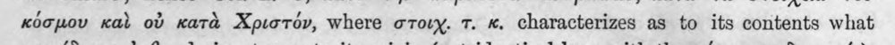 | κόσμου καὶ οὐ κατὰ Χριστόν, where στοῖχ. τ. «. characterizes as to its contents what | (csak görög, jelzés nélkül) |  |
| 485 | 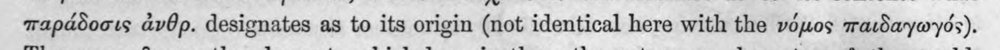 | παράδοσις ἀνθρ. designates as to its origin (not identical here with the νόμος παιδαγωγός). | (csak görög, jelzés nélkül) |  |
| 486 | 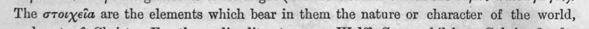 | The στοιχεῖα are the elements which bear in them the nature or character of the world, | (csak görög, jelzés nélkül) |  |
| 487 | 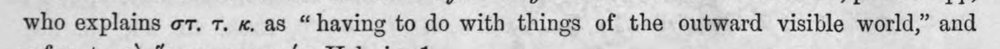 | who explains στ. τ. x, as “having to do with things of the outward visible world,” and | (csak görög, jelzés nélkül) |  |
| 488 |  | refers to τὸ ἅγιον κοσμικόν, Heb. ix. 1. | (csak görög, jelzés nélkül) |  |
| 489 | 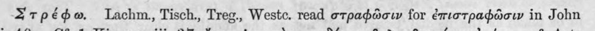 | Σ τρέφω. Lachm,, Tisch. Treg., Westc. read στραφῶσιν for ἐπιστραφῶσιν in John | c5_nem_igazolt |  |
| 490 | 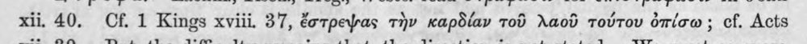 | xii. 40. Cf. 1 Kings xviii. 37, ἔστρεψας τὴν καρδίαν τοῦ λαοῦ τούτου ὀπίσω : cf. Acts | (csak görög, jelzés nélkül) |  |
| 491 | 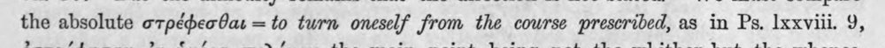 | the absolute στρέφεσθαι = to turn oneself from the course prescribed, as in Ps. Ixxviii. 9, | (csak görög, jelzés nélkül) |  |
| 492 | 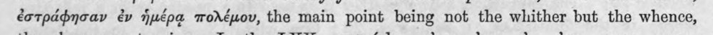 | ἐστράφησαν ἐν ἡμέρᾳ πολέμου, the main point being not the whither but the whence, | (csak görög, jelzés nélkül) |  |
| 493 | 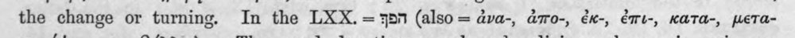 | the change or turning. In the LXX.= ἼΞΠ (also= ἀνα-, ἀπο-, ἐκ-, ἐπι-, KaTa-, μετα- | c5_nem_igazolt |  |
| 494 | 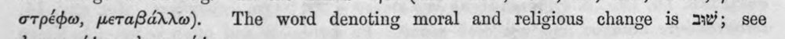 | στρέφω, μεταβάλλωθ. The word denoting moral and religious change is mw; see | c5_nem_igazolt |  |
| 495 | 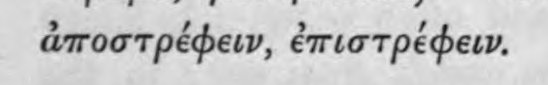 | ἀποστρέφειν, ἐπιστρέφειν. | (csak görög, jelzés nélkül) |  |
| 496 | 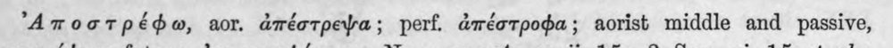 | ᾿Αποστρέφω, aor. ἀπέστρεψα; perf. ἀπέστροφα;; aorist middle and passive, | c5_nem_igazolt |  |
| 497 | 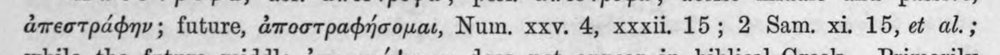 | ἀπεστράφην ; future, ἀποστραφήσομαι, Num. xxv. 4, xxxii. 15; 2 Sam. xi. 15, οἱ al.; | c5_nem_igazolt |  |
| 498 |  | while the future middle ἀποστρέψομαι does not appear in biblical Greek. Primarily | c5_nem_igazolt |  |
| 499 |  | a middle, is clear not only from the future ἀποστραφήσομαι peculiar to biblical Greek, | (csak görög, jelzés nélkül) |  |
| 500 | 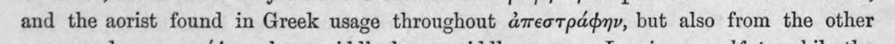 | and the aorist found in Greek usage throughout ἀπεστράφην, but also from the other | c5_nem_igazolt |  |
