| sorszám | kivágás | cremuoft-sor | gépi jelölés | ítélet |
|---|---|---|---|---|
| 501 | 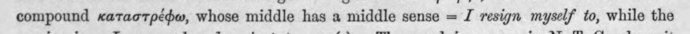 | compound καταστρέφω, whose middle has a middle sense = 7 resign myself to, while the | latin_torzkep |  |
| 502 | 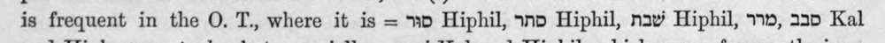 | is frequent in the O. T., where it is = Ὃ Hiphil, snp Hiphil, nav Hiphil, 1», 230 Kal | latin_torzkep |  |
| 503 | 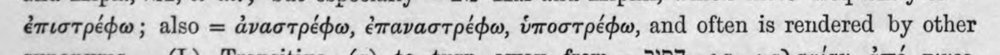 | ἐπιστρέφω ; also = ἀναστρέφω, ἐπαναστρέφω, ὑποστρέφω, and often is rendered by other | (csak görög, jelzés nélkül) |  |
| 504 | 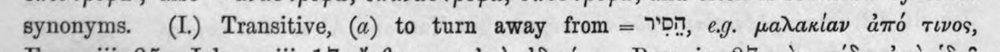 | synonyms. (I.) Transitive, (α) to turn away from = ὙΠ, eg. μαλακίαν ἀπό τινος, | c5_nem_igazolt |  |
| 505 | 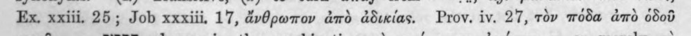 | Ex, xxiii. 25; Job xxxiii, 17, ἄνθρωπον ἀπὸ ἀδικίας. Prov. iv. 27, τὸν πόδα ἀπὸ ὁδοῦ | (csak görög, jelzés nélkül) |  |
| 506 | 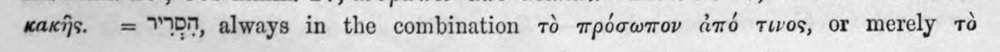 | a κακῆς. = DH, always in the combination τὸ πρόσωπον ἀπό τινος, or merely τὸ | (csak görög, jelzés nélkül) |  |
| 507 | 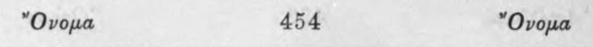 | Ὄνομα 454 Ὄνομα | c5_nem_igazolt |  |
| 508 | 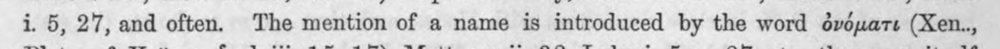 | i. 5, 27, and often. The mention of a name is introduced by the word ὀνόματι (Xen.., | (csak görög, jelzés nélkül) |  |
| 509 | 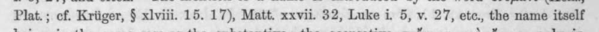 | Plat. ; cf. Kriiger, ὃ xlviii. 15. 17), Matt. xxvii. 32, Luke i. 5, v. 27, etc., the name itself | (csak görög, jelzés nélkül) |  |
| 510 | 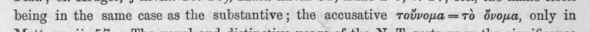 | being in the same case as the substantive; the accusative τοὔνομα --- τὸ ὄνομα, only in | (csak görög, jelzés nélkül) |  |
| 511 | 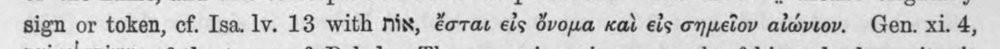 | sign or token, cf. Isa. lv. 13 with nix, ἔσται εἰς ὄνομα καὶ εἰς σημεῖον αἰώνιον. Gen. xi. 4, | (csak görög, jelzés nélkül) |  |
| 512 | 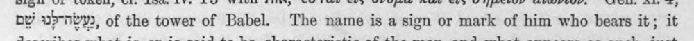 | ny wbrnbys, of the tower of Babel. The name is a sign or mark of him who bears it; it | latin_torzkep |  |
| 513 | 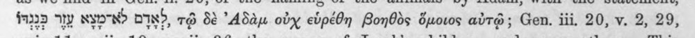 | faa Wy NBN DIN?, τῷ δὲ ᾿Αδὰμ ody εὑρέθη βοηθὸς ὅμοιος αὐτῷ ; Gen. iii, 20, v. 2, 29, | c5_nem_igazolt, latin_torzkep |  |
| 514 | 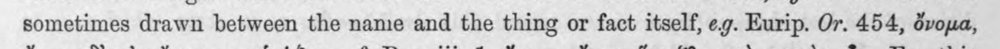 | sometimes drawn between the name and the thing or fact itself, e.g. Eurip. Or. 454, ὄνομα, | (csak görög, jelzés nélkül) |  |
| 515 | 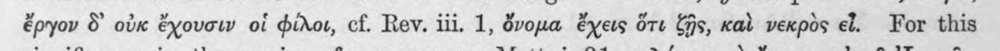 | ἔργον δ᾽ οὐκ ἔχουσιν οἱ φίλοι, cf. Rev. iii. 1, ὄνομα ἔχεις ὅτι Gs, καὶ νεκρὸς el. For this | (csak görög, jelzés nélkül) |  |
| 516 | 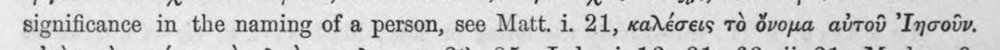 | significance in the naming of a person, see Matt. i. 21, καλέσεις τὸ ὄνομα αὐτοῦ ᾿Ιησοῦν. | c5_nem_igazolt |  |
| 517 | 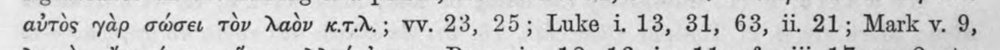 | αὐτὸς yap σώσει τὸν λαὸν x.T.A.; VV. 23, 25; Luke i. 13, 31, 63, 11, 21; Mark v. 9, | (csak görög, jelzés nélkül) |  |
| 518 | 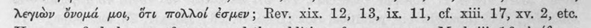 | λεγιὼν ὄνομά pot, ὅτε πολλοί ἐσμεν; Rev. xix. 12, 13, ix. 11, cf. xiii. 17, xv. 2, ete. | (csak görög, jelzés nélkül) |  |
| 519 | 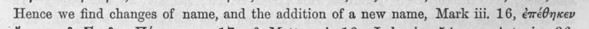 | Hence we find changes of name, and the addition of a new name, Mark iii. 16, ἐπέθηκεν | (csak görög, jelzés nélkül) |  |
| 520 | 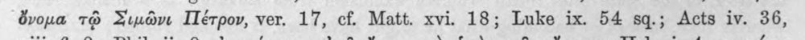 | ὄνομα τῷ Σιμῶνι Πέτρον, ver. 17, cf. Matt. xvi. 18; Luke ix. 54 sq.; Acts iv. 36, | c5_nem_igazolt |  |
| 521 | 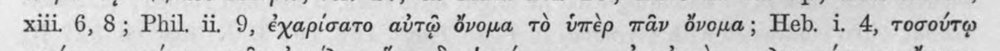 | xiii. 6, 8; Phil. ii 9, ἐχαρίσατο αὐτῷ ὄνομα τὸ ὑπὲρ πᾶν ὄνομα; Heb. i. 4, τοσούτῳ | (csak görög, jelzés nélkül) |  |
| 522 | 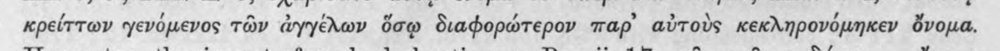 | κρείττων γενόμενος τῶν ἀγγέλων ὅσῳ διαφορώτερον παρ᾽ αὐτοὺς κεκληρονόμηκεν ὄνομα. | (csak görög, jelzés nélkül) |  |
| 523 | 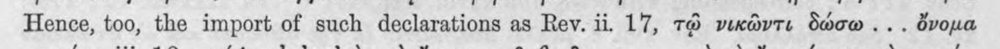 | Hence, too, the import of such declarations as Rev. ii. 17, τῷ νικῶντε δώσω... ὄνομα | c5_nem_igazolt |  |
| 524 | 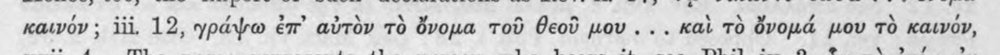 | καινόν ; iii, 12, γράψω ἐπ᾽ αὐτὸν τὸ ὄνομα τοῦ θεοῦ pov... καὶ TO ὄνομά μου τὸ καινόν, | (csak görög, jelzés nélkül) |  |
| 525 | 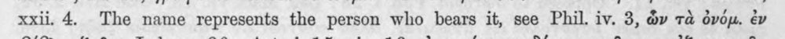 | xxii. 4. The name represents the person who bears it, see Phil. iv. 3, ὧν τὰ ὀνόμ. ἐν | (csak görög, jelzés nélkül) |  |
| 526 | 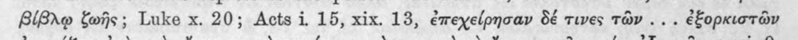 | βίβλῳ ffs; Luke x. 20; Acts i 15, xix. 13, ἐπεχείρησαν δέ τινες τῶν... ἐξορκιστῶν | (csak görög, jelzés nélkül) |  |
| 527 | 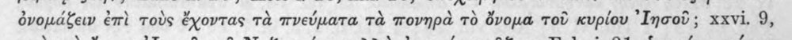 | ὀνομάζειν ἐπὶ τοὺς ἔχοντας τὰ πνεύματα τὰ πονηρὰ τὸ ὄνομα τοῦ κυρίου ᾿Ιησοῦ; xxvi. 9, | c5_nem_igazolt |  |
| 528 | 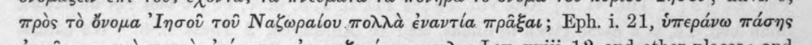 | πρὸς τὸ ὄνομα ᾿Ιησοῦ τοῦ Ναζωραίου πολλὰ ἐναντία πρᾶξαι; Eph. i. 21, ὑπεράνω πάσης | c5_nem_igazolt |  |
| 529 | 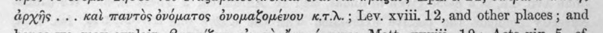 | ἀρχῆς... καὶ παντὸς ὀνόματος ὀνομαζομένου x.7.d.; Lev. xviii. 12, and other places ; and | (csak görög, jelzés nélkül) |  |
| 530 | 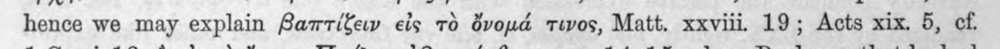 | hence we may explain βαπτίζειν εἰς τὸ ὄνομά twos, Matt. xxviii. 19; Acts xix. 5, οἵ, | (csak görög, jelzés nélkül) |  |
| 531 | 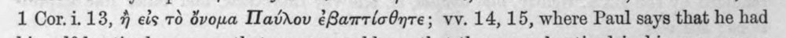 | 1 Cor. i. 13, ἢ εἰς τὸ ὄομα Παύλου ἐβαπτίσθητε; vv. 14, 15, where Paul says that he had | c5_nem_igazolt |  |
| 532 | 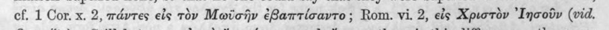 | ef. 1 Cor. x. 2, πάντες eis τὸν Μωϊσῆν ¢8articayto; Rom. vi. 2, εἰς Χριστὸν ᾿Ιησοῦν (vid. | c5_nem_igazolt |  |
| 533 | 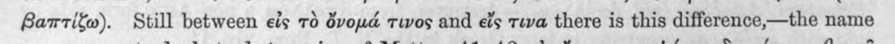 | Barrifw). Still between εἰς τὸ ὄνομά twos and εἴς teva there is this difference,—the name | latin_torzkep |  |
| 534 | 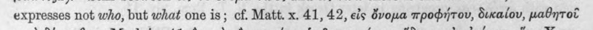 | expresses not who, but what one is; οἵ, Matt. x. 41, 42, eis ὄνομα προφήτου, δικαίου, μαθητοῦ | (csak görög, jelzés nélkül) |  |
| 535 | 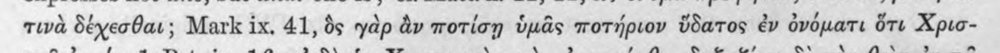 | τινὰ δέχεσθαι; Mark ix, 41, ὃς γὰρ ἂν ποτίσῃ ὑμᾶς ποτήριον ὕδατος ἐν ὀνόματι ὅτι Xpic- | latin_torzkep |  |
| 536 | 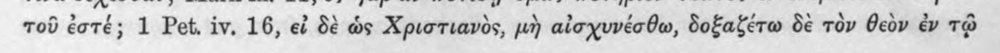 | τοῦ ἐστέ; 1 Pet. iv. 16, εἰ δὲ ὡς Χριστιανὸς, μὴ αἰσχυνέσθω, δοξαξέτω δὲ τὸν θεὸν ἐν τῷ | c5_nem_igazolt |  |
| 537 | 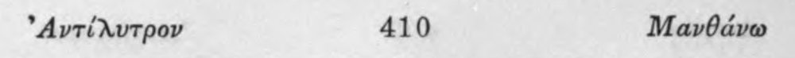 | ᾿Αντίλυτρον 410 Μανθάνω | c5_nem_igazolt |  |
| 538 | 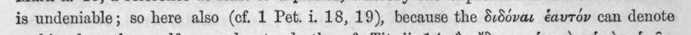 | is undeniable; so here also (cf. 1 Pet. i. 18, 19), because the διδόναι ἑαυτόν can denote | (csak görög, jelzés nélkül) |  |
| 539 | 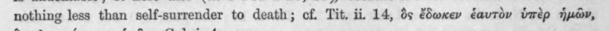 | nothing less than self-surrender to death; cf. Tit. ii, 14, ὃς ἔδωκεν ἑαυτὸν ὑπὲρ ἡμῶν, | (csak görög, jelzés nélkül) |  |
| 540 | 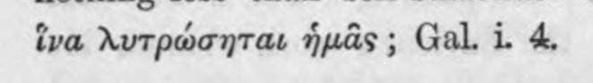 | ἵνα λυτρώσηται ἡμᾶς ; Gal. 1. 4. | (csak görög, jelzés nélkül) |  |
| 541 | 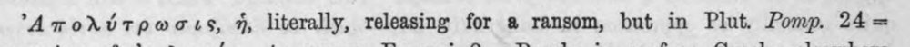 | ᾿Απολύτρωσις, ἡ, literally, releasing for a ransom, but in Plut. Pomp. 24 -- | c5_nem_igazolt, latin_torzkep |  |
| 542 | 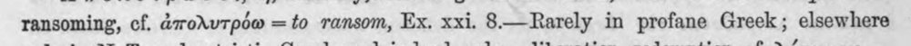 | ransoming, cf. ἀπολυτρόω = to ransom, Ex. xxi. 8—Rarely in profane Greek; elsewhere | (csak görög, jelzés nélkül) |  |
| 543 | 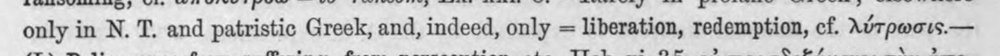 | only in N. T. and patristic Greek, and, indeed, only = liberation, redemption, cf. λύτρωσις.--- | (csak görög, jelzés nélkül) |  |
| 544 | 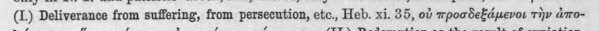 | (1) Deliverance from suffering, from persecution, etc., Heb. xi. 35, οὐ προσδεξάμενοι τὴν ἀπο- | (csak görög, jelzés nélkül) |  |
| 545 | 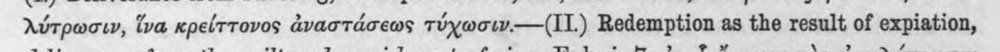 | λύτρωσιν, ἵνα κρείττονος ἀναστάσεως τύχωσιν.----(11.) Redemption as the result of expiation, | (csak görög, jelzés nélkül) |  |
| 546 | 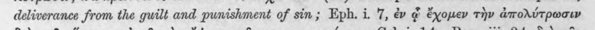 | deliverance from the guilt and punishment of sin; Eph. i. 7, ἐν ᾧ ἔχομεν τὴν ἀπολύτρωσιν | (csak görög, jelzés nélkül) |  |
| 547 | 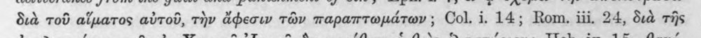 | διὰ τοῦ αἵματος αὐτοῦ, τὴν ἄφεσιν τῶν παραπτωμάτων ; Col. i. 14; Rom, iii, 24, διὰ τῆς | (csak görög, jelzés nélkül) |  |
| 548 | 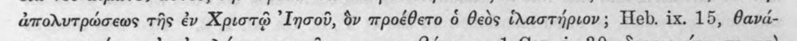 | ἀπολυτρώσεως τῆς ἐν Χριστῷ ᾿Ιησοῦ, ὃν προέθετο ὁ θεὸς ἱλαστήριον; Heb. ix. 15, θανά- | c5_nem_igazolt |  |
| 549 | 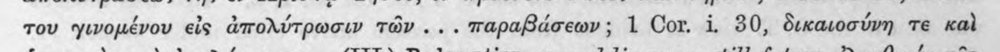 | του γινομένου εἰς ἀπολύτρωσιν τῶν... παραβάσεων; 1 Cor. i. 80, δικαιοσύνη τε καὶ | (csak görög, jelzés nélkül) |  |
| 550 | 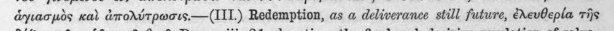 | ἁγιασμὸς καὶ ἀπολύτρωσις.----(111.) Redemption, as a deliverance still future, ἐλευθερία τῆς | (csak görög, jelzés nélkül) |  |
