| sorszám | kivágás | cremuoft-sor | gépi jelölés | ítélet |
|---|---|---|---|---|
| 551 | 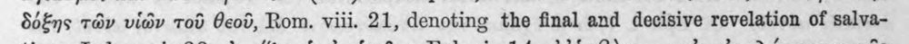 | δόξης τῶν υἱῶν τοῦ θεοῦ, Rom. viii. 21, denoting the final and decisive revelation of salva- | (csak görög, jelzés nélkül) |  |
| 552 | 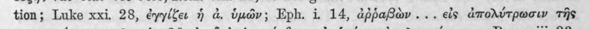 | tion; Luke xxi. 28, ἐγγίζει ἡ ἀ. ὑμῶν; Eph. i 14, ἀῤῥαβὼν.... εἰς ἀπολύτρωσιν τῆς | c5_nem_igazolt |  |
| 553 | 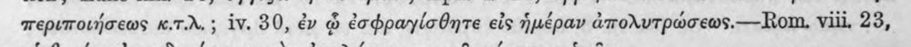 | περιποιήσεως K.T.r.; iv. 80, ἐν ᾧ ἐσφραγίσθητε εἰς ἡμέραν ἀπολυτρώσεως.---οτη, viii, 23, | c5_nem_igazolt |  |
| 554 | 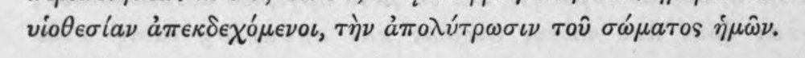 | υἱοθεσίαν ἀπεκδεχόμενοι, τὴν ἀπολύτρωσιν τοῦ σώματος ἡμῶν. | (csak görög, jelzés nélkül) |  |
| 555 | 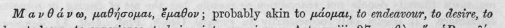 | Μανθάνω, μαθήσομαι, ἔμαθον ; probably akin to μάομαι, to endeavour, to desire, to | c5_nem_igazolt |  |
| 556 | 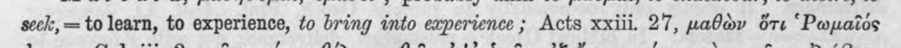 | seck, = to learn, to experience, to bring into experience; Acts xxiii. 27, μαθὼν ὅτι “Pwpaios | (csak görög, jelzés nélkül) |  |
| 557 | 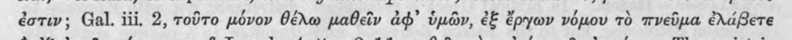 | ἐστιν; Gal. iii. 2, τοῦτο μόνον θέλω μαθεῖν ad’ ὑμῶν, ἐξ ἔργων νόμου τὸ πνεῦμα ἐλάβετε | (csak görög, jelzés nélkül) |  |
| 558 | 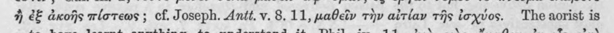 | ἢ ἐξ ἀκοῆς πίστεως ; cf. Joseph. Antt. v. 8.11, μαθεῖν τὴν αἰτίαν τῆς ἰσχύος. The aorist is | (csak görög, jelzés nélkül) |  |
| 559 | 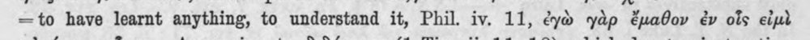 | =to have learnt anything, to understand it, Phil. iv. 11, ἐγὼ γὰρ ἔμαθον ἐν οἷς εἰμὴ | c5_nem_igazolt |  |
| 560 | 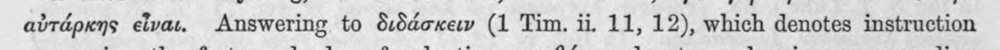 | αὐτάρκης εἶναι. Answering to διδάσκειν (1 Tim. ii. 11, 12), which denotes instruction | (csak görög, jelzés nélkül) |  |
| 561 | 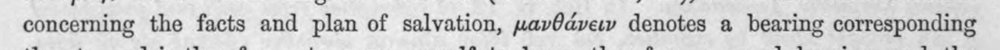 | concerning the facts and plan of salvation, μανθάνειν denotes a bearing corresponding | (csak görög, jelzés nélkül) |  |
| 562 | 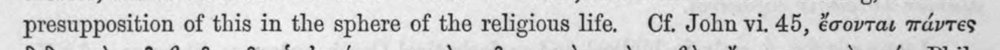 | presupposition of this in the sphere of the religious life. Cf. John vi. 45, ἔσονται πάντες | (csak görög, jelzés nélkül) |  |
| 563 | 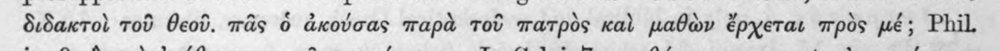 | διδακτοὶ τοῦ θεοῦ. πᾶς ὁ ἀκούσας παρὰ τοῦ πατρὸς Kal μαθὼν ἔρχεται πρὸς μέ; Phil. | (csak görög, jelzés nélkül) |  |
| 564 | 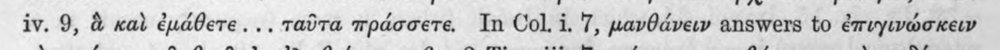 | iv. 9, ἃ καὶ ἐμάθετε.... ταῦτα πράσσετε. In Col. i. 7, μανθάνειν answers to ἐπιγινώσκειν | (csak görög, jelzés nélkül) |  |
| 565 | 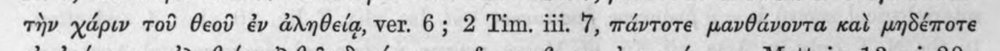 | τὴν χάριν τοῦ θεοῦ ἐν ἀληθείᾳ, ver. 6; 2 Tim. iii. 7, πάντοτε μανθάνοντα καὶ μηδέποτε | (csak görög, jelzés nélkül) |  |
| 566 | 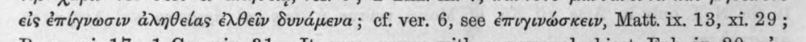 | εἰς ἐπίγνωσιν ἀληθείας ἐλθεῖν δυνάμενα ; cf. ver. 6, see ἐπυγινώσκειν, Matt. ix. 18, xi. 29 ; | c5_nem_igazolt |  |
| 567 | 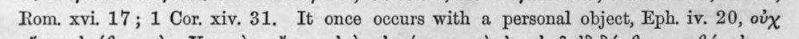 | Rom. xvi. 17; 1 Cor. xiv. 31. It once occurs with a personal object, Eph. iv. 20, οὐχ | (csak görög, jelzés nélkül) |  |
| 568 | 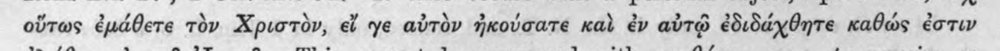 | οὕτως ἐμάθετε τὸν Χριστὸν, εἴ ye αὐτὸν ἠκούσατε καὶ ἐν αὐτῷ ἐδιδάχθητε καθώς ἐστιν | (csak görög, jelzés nélkül) |  |
| 569 | 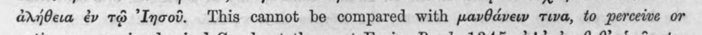 | ἀλήθεια ἐν τῷ ᾿Ιησοῦ. This cannot be compared with μανθάνειν τινα, to perceive or | c5_nem_igazolt |  |
| 570 |  | notice any one, in classical Greek, at the most Eurip, Bacch, 1345, dy’ ἐμαθεθ᾽ ὑμᾶς, too | c5_nem_igazolt |  |
| 571 | 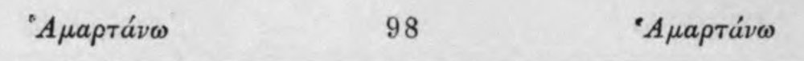 | “Ἡμαρτάνω 98 *Apaptave | c5_nem_igazolt |  |
| 572 | 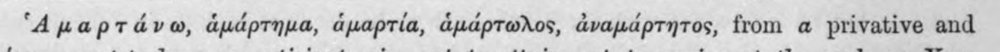 | ‘Apaptadveo, ἁμάρτημα, ἁμαρτία, ἁμάρτωλος, ἀναμάρτητος, from a privative and | c5_nem_igazolt |  |
| 573 | 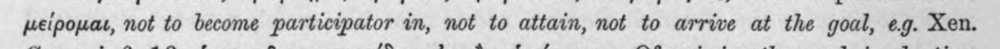 | μείρομαι, not to become participator in, not to attain, not to arrive at the goal, eg. Xen. | latin_torzkep |  |
| 574 | 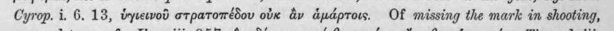 | Cyrop. i. 6. 13, ὑγιεινοῦ στρατοπέδου οὐκ ἂν ἁμάρτοις. Of missing the mark in shooting, | (csak görög, jelzés nélkül) |  |
| 575 | 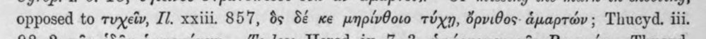 | opposed to τυχεῖν, Il. xxiii. 857, ὃς δέ κε μηρίνθοιο τύχῃ, ὄρνιθος. ἁμαρτών ; Thucyd. iii. | (csak görög, jelzés nélkül) |  |
| 576 | 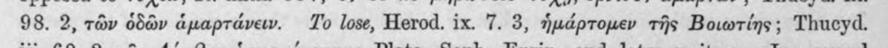 | 98. 2, τῶν ὁδῶν ἁμαρτάνειν. To lose, Herod. ix. 7. 3, ἡμάρτομεν τῆς Βοιωτίης ; Thucyd. | (csak görög, jelzés nélkül) |  |
| 577 | 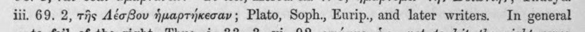 | iii. 69. 2, τῆς AéoBou ἡμαρτήκεσαν ; Plato, Soph., Eurip., and later writers. In general | c5_nem_igazolt |  |
| 578 | 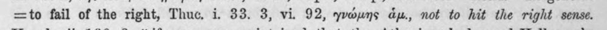 | =to fail of the right, Thuc. i. 33. 3, vii 92, γνώμης dy, not to hit the right sense. | latin_torzkep |  |
| 579 | 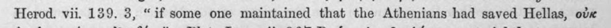 | Herod. vii. 139. 3, “if some one maintained that the Athenians had saved Hellas, οὐκ | latin_torzkep |  |
| 580 | 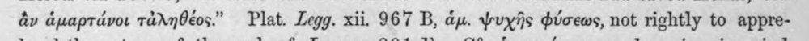 | ἂν ἁμαρτάνοι τἀληθέος." Plat. Legg. xii. 967 B, ἅμ. ψυχῆς φύσεως, not rightly to appre- | c5_nem_igazolt, latin_torzkep |  |
| 581 | 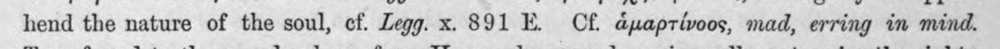 | hend the nature of the soul, cf. Legg. x. 891 Ὁ Cf. ἁμαρτίνοος, mad, erring in mind. | c5_nem_igazolt, latin_torzkep |  |
| 582 | 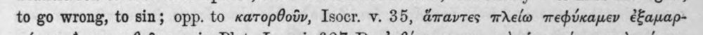 | to go wrong, to sin; opp. to κατορθοῦν, Isocr. v. 35, ἅπαντες πλείω πεφύκαμεν ἐξαμαρ- | (csak görög, jelzés nélkül) |  |
| 583 | 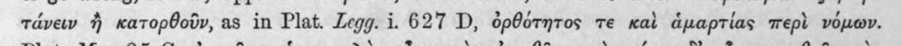 | tavew ἢ κατορθοῦν, as in Plat. Legg. i. 627 D, ὀρθότητος τε καὶ ἁμαρτίας περὶ νόμων. | c5_nem_igazolt, latin_torzkep |  |
| 584 | 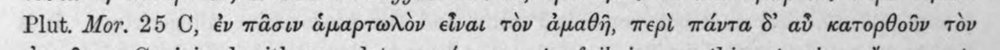 | Plut. Mor. 25 C, ἐν πᾶσιν ἁμαρτωλὸν εἶναι τὸν ἀμαθῆ, περὶ πάντα δ᾽ αὖ κατορθοῦν τὸν | (csak görög, jelzés nélkül) |  |
| 585 | 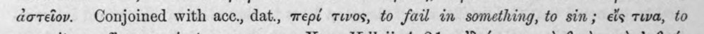 | ἀστεῖον. Conjoined with acc., dat., περί τινος, to fail in something, to sin; εἴς τινα, to | (csak görög, jelzés nélkül) |  |
| 586 | 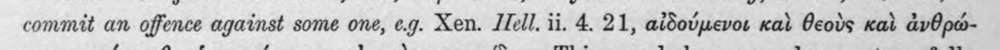 | commit an offence against some one, e.g. Xen. 110]. ii. 4. 21, αἰδούμενοι καὶ θεοὺς καὶ ἀνθρώ- | (csak görög, jelzés nélkül) |  |
| 587 | 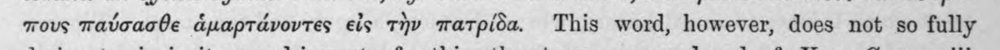 | mous παύσασθε ἁμαρτάνοντες eis τὴν πατρίδα. This word, however, does not so fully | latin_torzkep |  |
| 588 | 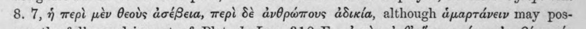 | 8. 7, ἡ περὶ μὲν θεοὺς ἀσέβεια, περὶ δὲ ἀνθρώπους ἀδικία, although ἁμαρτάνειν may pos- | latin_torzkep |  |
| 589 | 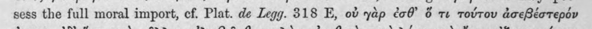 | sess the full moral import, ef. Plat. de Legg. 318 E, οὐ γὰρ ἐσθ᾽ ὅ τι τούτου ἀσεβέστερόν | c5_nem_igazolt, latin_torzkep |  |
| 590 | 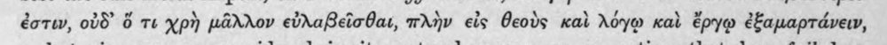 | ἐστιν, οὐδ᾽ ὅ τι χρὴ μᾶλλον εὐλαβεῖσθαι, πλὴν εἰς θεοὺς καὶ λόγῳ καὶ ἔργῳ ἐξαμαρτάνειν, | (csak görög, jelzés nélkül) |  |
| 591 | 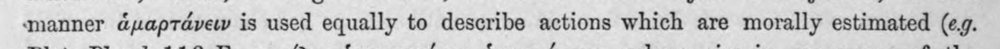 | manner ἁμαρτάνειν is used equally to describe actions which are morally estimated (eg. | (csak görög, jelzés nélkül) |  |
| 592 | 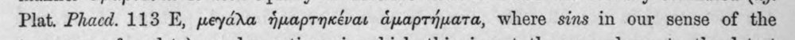 | Plat. Phacd. 113 E, μεγάλα ἡμαρτηκέναι ἁμαρτήματα, where sins in our sense of the | (csak görög, jelzés nélkül) |  |
| 593 | 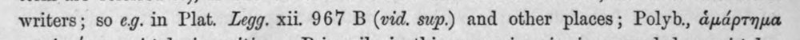 | writers; so eg. in Plat. Legg. xii. 967 B (vid. sup.) and other places; Polyb., ἁμάρτημα | (csak görög, jelzés nélkül) |  |
| 594 | 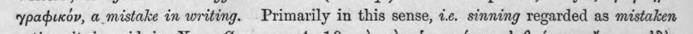 | γραφικόν, a mistake in writing. Primarily in this sense, 1.6. sinning regarded as mistaken | latin_torzkep |  |
| 595 | 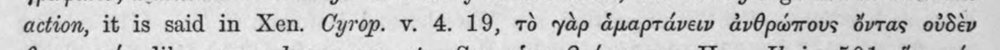 | action, it is said in Xen. Cyrop. v. 4. 19, τὸ γὰρ ἁμαρτάνειν ἀνθρώπους ὄντας οὐδὲν | (csak görög, jelzés nélkül) |  |
| 596 | 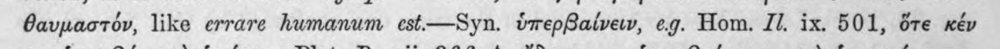 | θαυμαστόν, like errare humanum est.—Syn. ὑπερβαίνειν, eg. Hom. Il. ix. 501, ὅτε κέν | latin_torzkep |  |
| 597 | 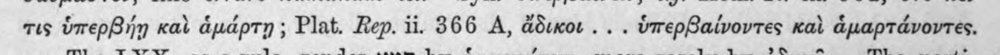 | τις ὑπερβήῃ καὶ ἁμάρτῃ ; Plat. Rep. ii. 366 A, ἄδικοι... ὑπερβαίνοντες καὶ ἁμαρτάνοντες. | (csak görög, jelzés nélkül) |  |
| 598 | 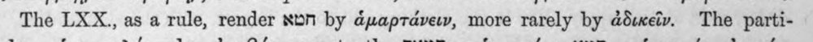 | The LXX., as ἃ rule, render xpn by ἁμαρτάνειν, more rarely by ἀδικεῖν. The parti- | heberdetektor, latin_torzkep |  |
| 599 | 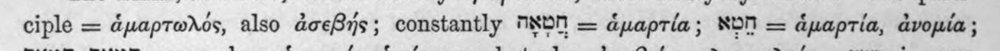 | ciple = ἁμαρτωλός, also ἀσεβής ; constantly MXON = ἁμαρτία; NON = ἁμαρτία, ἀνομία; | latin_torzkep |  |
| 600 | 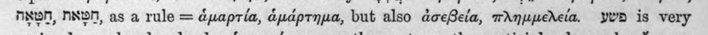 | ANN, NNN, as a rule = ἁμαρτία, ἁμάρτημα, but also ἀσεβεία, πλημμεέλεία. ywD is very | c5_nem_igazolt, latin_torzkep |  |
