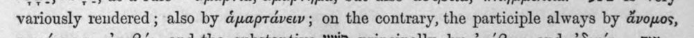
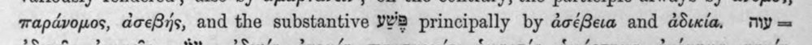
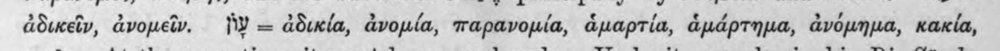
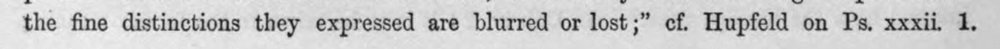

| sorszám | kivágás | cremuoft-sor | gépi jelölés | ítélet |
|---|---|---|---|---|
| 601 |  | variously rendered ; also by ἁμαρτάνειν ; on the contrary, the participle always by ἄνομος, | (csak görög, jelzés nélkül) |  |
| 602 |  | παράνομος, ἀσεβής, and the substantive YYB principally by ἀσέβεια and ἀδικία, my = | latin_torzkep |  |
| 603 |  | ἀδικεῖν, ἀνομεῖν. PY = ἀδικία, ἀνομία, παρανομία, ἁμαρτία, ἁμάρτημα, ἀνόμημα, κακία, | c5_nem_igazolt, latin_torzkep |  |
| 604 |  | the fine distinctions they expressed are blurred or lost ;” cf. Hupfeld on Ps. xxxii. 1. | latin_torzkep |  |
